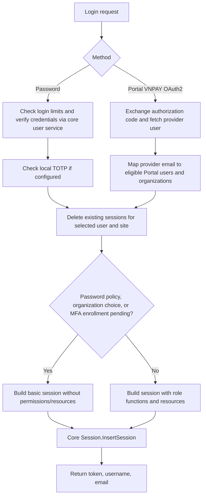

# Authentication flow

This document summarizes the current implementation in `middleware/authen`. This Go gRPC service coordinates authentication, builds authorization data into sessions, and delegates session storage/token issuance to the core Session service. Password verification, provider protocol details, and authentication of subsequent requests are partly implemented in external core services/shared libraries; their internals are outside this summary.

## Entry points and supported methods

`main.go` registers `PortalAuthService` and `BOAuthService`, initializes downstream clients, a Redis-backed login limiter, authentication handlers, and session handlers.

| RPC | Portal | Back Office |
| --- | --- | --- |
| `Login` | Password login; username must be in `UserLoginAuthPassword` | Password login |
| `GetOAuth2AuthorizeURL` | Builds a provider authorization URL | Unimplemented |
| `LoginOAuth2` | VNPAY SSO | Unimplemented |
| `BuildSessionWithOrganization` | Selects an organization for an OAuth2 session | Not exposed here |
| `RebuildSession` | Rebuilds the current session | Rebuilds the current session |
| `Logout` | Deletes session and invokes logout handlers | Deletes session and invokes logout handlers |

Both RPC handlers construct shared `MiddlewareAuth` with `Login`, `LoginOAuth2`, and `GetOAuth2AuthorizeURL` as authentication exceptions. Other operations consume the authenticated session from request context. The server also configures request-domain validation for those three entry methods through a shared interceptor.

Only three authentication combinations are registered: Portal/password, Back Office/password, and Portal/VNPAY OAuth2. VinCSS configuration and authorization-URL support exist, but no VinCSS login handler is registered.

Sources: [main.go](main.go), [Portal handler](handler/portal_handler.go), [Back Office handler](handler/bo_handler.go), [authentication dispatch](manager/biz/handler/auth/handler.go).

## Overall login flow

The common orchestration is `Handler.Login` in [auth.go](manager/biz/handler/auth/auth.go). Existing sessions are deleted **before** building and inserting the new session. A failure after deletion can therefore invalidate earlier sessions without returning a replacement token.

## Password login

1. The Portal handler checks the configured username allowlist; Back Office has no equivalent check here. The dispatcher forces the login type to `AUTH_PASSWORD`.
2. The common handler checks the failed-login budget for the site, username, and optional organization alias.
3. `UserPasswordAuth.Auth` requires a nonempty username and a password length of 6–32 bytes.
4. The site-specific client calls core `PortalUser.Auth` or `BOUser.Auth`. Portal forwards `OrgAliasCode` as well as username/password. The response must contain an active user. Portal also resolves the organization group's frontend domain, falling back to `DefaultFrontendDomain` when appropriate.
5. The middleware asks core MFA whether a TOTP configuration exists for the user ID:
   - No TOTP configured and no OTP supplied: continue.
   - TOTP configured but OTP missing: return `AlreadyExists` with “Please use MFA to login”; the caller can retry the login with an OTP.
   - OTP supplied without TOTP configured: reject.
   - TOTP configured and OTP supplied: validate it through core MFA.
6. After authentication, revoke existing sessions for that user/site, build a new session, insert it into core Session, and return `Token`, `Username`, and `Email`.

Core failed-precondition errors are preserved; most other credential-authentication failures become a generic login failure. Many password-path errors also receive remaining-attempt information.

Sources: [password authentication and TOTP](manager/biz/auth/userpass/password.go), [Portal credentials](manager/biz/auth/userpass/portal_auth.go), [Back Office credentials](manager/biz/auth/userpass/bo_auth.go), [MFA client](manager/biz/client/mfa_client.go).

## Portal OAuth2 / VNPAY SSO

1. The frontend requests `GetOAuth2AuthorizeURL`. The redirect URL must exactly match an entry in `WhileListRedirectURI`; if omitted, the first entry is used. The service appends `redirect_uri` to the configured authorization URL.
2. After provider authentication, the caller submits the authorization code, provider type, and redirect URL through `LoginOAuth2`.
3. The dispatcher stores the OAuth2 request in context and selects the Portal/VNPAY handler.
4. The provider adapter validates the redirect URL again, URL-decodes the authorization code, rejects decoded codes longer than 256 bytes, and uses the shared OAuth2 provider library to `FetchToken` and then `FetchUser` with the access token.
5. The adapter returns the provider email and OIDC ID token. The email is used to look up existing Portal accounts; this path does not create accounts.
6. Eligible candidates include active admins, active staff with at least one granted service, and additional organization memberships of admins. Staff invitation status is not used for this eligibility check. If no candidate exists, login returns a registration, disabled-account, or missing-service error as applicable.
7. The code sorts candidates to prefer admins and selects one to represent the initial session. If multiple candidates exist, it marks the user as having multiple OAuth2 identities/organizations and sets `RequireChoosingOrg` on the session.
8. The common flow revokes sessions for the selected user/site and inserts the initial session. If organization selection is required, permission/resource building is skipped. The provider ID token is carried into the session for logout.

Local TOTP validation is part of password authentication; the OAuth2 path does not call it. Portal staff MFA enrollment policy is still checked when deciding whether to build full permissions.

Sources: [OAuth2 dispatch](manager/biz/auth/oauth2/oauth2.go), [VNPAY adapter](manager/biz/auth/oauth2/vnpay_sso.go), [provider exchange and redirects](manager/biz/auth/oauth2/helper.go), [Portal account selection](manager/biz/handler/auth/auth.go).

## Organization selection

The public `BuildSessionWithOrganization` RPC routes to `BuildSessionWithSelectedOrganization` in the session handler.

1. Require a current Portal session with login type `AUTH_OAUTH2`.
2. Fetch the requested Portal user and preserve the current session's OIDC ID token.
3. Accept the requested user/organization pair if it appears in the session's `UserOrgInfosWhenLoginOath2`, or if the fetched user has the requested organization among their additional resource-owner memberships.
4. Check staff MFA enrollment requirements; build a session with the selected organization, secondary-organization flag, and `RequireChoosingOrg=false`.
5. Load role functions and the selected organization's resource data unless permission building is skipped.
6. Insert a new session, attempt an organization-access audit log, and return the new token, username, and email. Audit-log failure is logged without failing the response.

This path creates a new session; it does not explicitly delete the previous session. The older internal method named `BuildSessionWithOrganization` is still present, but is not the method used by the RPC dispatcher.

Sources: [session dispatch](manager/biz/handler/session/handler.go), [organization selection](manager/biz/handler/session/session.go).

## Session contents and permission gating

The session builder writes user identity and site/login type, then normally:

- Fetches role functions using user ID and site type, storing them in `FunctionIdMap`.
- Loads Portal organization host-group metadata.
- Fetches owned/allowed user resources; resource-not-found is treated as an empty resource set.
- Copies resource data into the Portal session through its site-specific builder extension.

Initial login skips permission/resource building when the password-authenticated user violates password policy, an OAuth2 user must choose an organization, or a Portal staff user must enable MFA. A basic session is still issued in these cases, with an empty function map.

The staff MFA enrollment check compares staff and organization-admin MFA status through `CheckExistMFAFromSSO`, using email and the S3-staff flag. If the admin has MFA and the staff user does not, full permissions are withheld. This is separate from verifying a supplied local TOTP during password login.

Sources: [session builder](manager/biz/builder/builder.go), [Portal extension](manager/biz/builder/portal.go), [MFA enrollment policy](manager/biz/mfa/mfa.go), [session client](manager/biz/client/session_client.go).

## Limits and failure handling

- RPC handlers configure 3 requests/second for `LoginRequest`, keyed by `portal_<username>` or `admin_<username>`. Other request types return an empty limiter key.
- The common password login flow uses a Redis-backed budget of 5 failures per 30 minutes. Its key includes site, username, and organization alias when supplied.
- Successful login resets the budget. Failed login reduces it, except the missing-OTP/`AlreadyExists` case. Failures after credential validation can also consume the budget.
- When the formatted error indicates two attempts remain, an asynchronous warning email is attempted, excluding the missing-OTP challenge.
- OAuth2 skips the password budget precheck. A six-per-30-minute limiter is constructed in the VNPAY adapter, but its `Auth` method does not use it.

Sources: [common login and limits](manager/biz/handler/auth/auth.go), [Redis limiter setup](manager/biz/factory/factory.go), [error formatting and warning trigger](manager/biz/helper/fmt_error.go).

## Rebuild and logout

**Rebuild:** Read the current context session, reload the user, preserve the OIDC ID token, re-evaluate password-policy/MFA restrictions, and rebuild session data. The old token is retained, and the update uses core `InsertSession` again.

**Logout:** Read the current session and first call core `DeleteSession`. Then dispatch by site/login type. Password logout calls the corresponding core user service. Portal OAuth2 logout attempts a GET to the provider logout URL with `id_token_hint`, then calls core Portal-user logout. Provider logout failures are logged and suppressed by the VNPAY adapter; later core logout failures can still be returned after local session deletion.

Sources: [session lifecycle](manager/biz/handler/session/session.go), [logout dispatch](manager/biz/handler/auth/handler.go), [VNPAY logout](manager/biz/auth/oauth2/vnpay_sso.go).

## Implementation details that affect interpretation

- The local OTP-length condition is `otpLen < 6 && otpLen > 8`, which cannot be true. Actual OTP validation is delegated to core MFA.
- `validateRequestDomain` exists in the common auth handler but is not called by `Login`; entry-point domain validation is configured separately through the shared interceptor.
- Organization candidate lists built into sessions use `ListUsers` by email without the active/service filters used during initial OAuth2 account selection. The selected-organization handler itself does not repeat those eligibility checks.
- Organization selection logs MFA-policy lookup errors and continues using the returned boolean; initial login and rebuild return those errors.
- `RebuildSession` does not explicitly populate `BuilderInfo.LoginType`, organization-choice state, or selected secondary-organization fields from the old session. Do not assume rebuild preserves all of that state merely because it preserves the token.
- An omitted redirect URL assumes `WhileListRedirectURI` is nonempty. OAuth2 state/PKCE handling, token format/expiry/refresh, password hashing, and downstream token validation are not established by the code reviewed in this module.

This is a source-based flow summary, not a runtime or security validation of downstream services.
