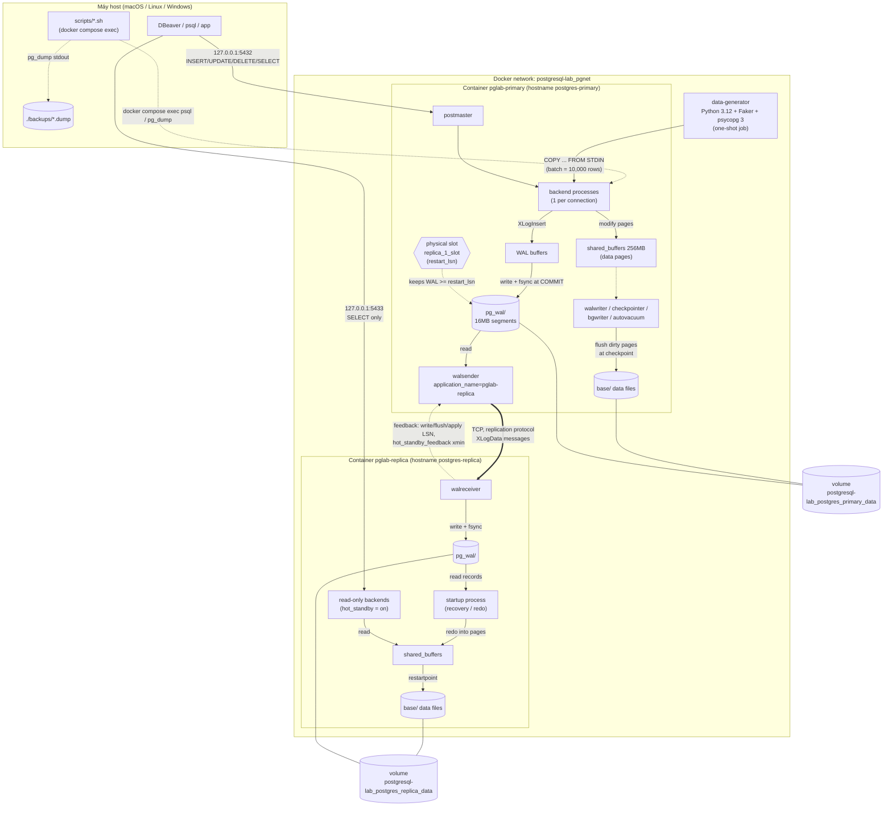
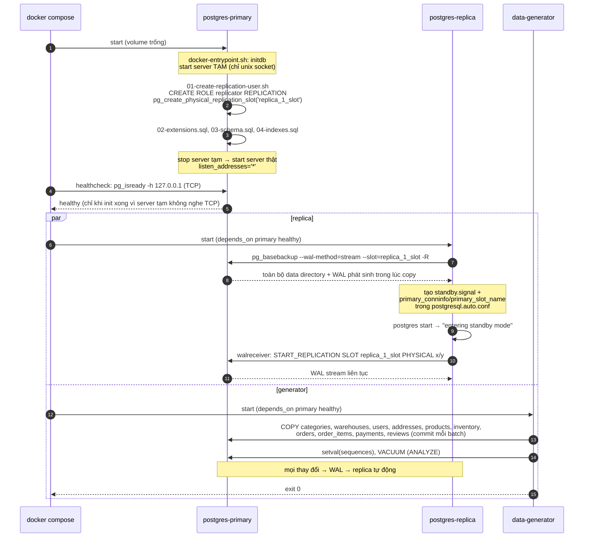
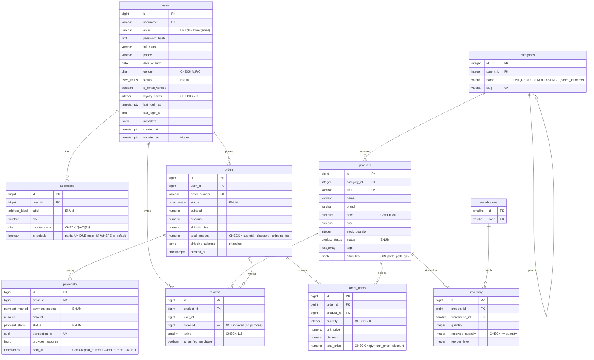

# Kiến trúc

## 1. Tổng thể



| Thành phần | Image | Port host | Volume | Vai trò |
| --- | --- | --- | --- | --- |
| `postgres-primary` | `postgresql-lab/postgres-primary:16` (từ `postgres:16-bookworm`) | `127.0.0.1:5432` | `postgresql-lab_postgres_primary_data` → `/var/lib/postgresql/data` | nhận mọi thao tác ghi, sinh WAL, gửi WAL |
| `postgres-replica` | `postgresql-lab/postgres-replica:16` | `127.0.0.1:5433` | `postgresql-lab_postgres_replica_data` → `/var/lib/postgresql/data` (cluster nằm ở `.../pgdata`) | nhận WAL, replay, phục vụ SELECT |
| `data-generator` | `postgresql-lab/data-generator` (từ `python:3.12-slim`) | — | — | nạp dữ liệu vào primary rồi thoát |

## 2. Trình tự khởi động (`docker compose up -d --build`)



Lần `docker compose up` sau đó (volume đã có dữ liệu): primary bỏ qua init scripts; replica thấy file đánh dấu `.bootstrap-complete` nên chỉ start và **tiếp tục stream từ LSN đã replay cuối cùng** (slot đã giữ lại WAL còn thiếu); generator thấy run `COMPLETED` nên thoát ngay.

## 3. Các process PostgreSQL

Xem process trong container:

```bash
docker compose exec postgres-primary ps -o pid,cmd -u postgres
docker compose exec postgres-replica ps -o pid,cmd -u postgres
```

```text
# primary
      1 postgres -c config_file=/etc/postgresql/postgresql.conf       <- postmaster
     26 postgres: pglab-primary: checkpointer
     27 postgres: pglab-primary: background writer
     29 postgres: pglab-primary: walwriter
     30 postgres: pglab-primary: autovacuum launcher
     31 postgres: pglab-primary: logical replication launcher
     39 postgres: pglab-primary: walsender replicator 192.168.147.3(36738) streaming 1/370010D8
    (+ 1 dòng "postgres: pglab-primary: postgres ecommerce 192.168.147.1(...) idle" cho mỗi connection DBeaver)

# replica
      1 postgres -c config_file=/etc/postgresql/postgresql.conf
     19 postgres: pglab-replica: checkpointer
     20 postgres: pglab-replica: background writer
     21 postgres: pglab-replica: startup recovering 000000010000000100000037   <- file WAL đang replay
     22 postgres: pglab-replica: walreceiver streaming 1/370010D8
```

`000000010000000100000037` là tên WAL segment: 8 hex đầu = **timeline** (`00000001`), 16 hex sau = số segment. Sau một lần failover, timeline tăng lên `00000002`.

`cluster_name` (`pglab-primary` / `pglab-replica`) xuất hiện trong tên process, và tên replica cũng chính là `application_name` trong `pg_stat_replication`.

Từ SQL:

```sql
SELECT pid, backend_type, state, application_name FROM pg_stat_activity ORDER BY backend_type;
```

| Process | Ở đâu | Làm gì |
| --- | --- | --- |
| postmaster | cả hai | process cha, nhận connection và fork backend |
| backend (`client backend`) | cả hai | 1 process / connection, thực thi SQL |
| walwriter | primary | định kỳ ghi WAL buffers xuống `pg_wal` |
| checkpointer | cả hai | checkpoint (primary) / restartpoint (replica): ghi dirty pages xuống data files |
| background writer | cả hai | ghi bớt dirty pages để backend không phải tự ghi |
| autovacuum | primary | VACUUM/ANALYZE tự động (replica không được VACUUM — nó nhận kết quả qua WAL) |
| walsender | primary | đọc WAL, gửi cho replica / pg_basebackup |
| walreceiver | replica | nhận WAL, ghi vào `pg_wal` của replica, gửi feedback |
| startup | replica | đọc WAL và **replay** (redo) vào data pages |

## 4. Mô hình dữ liệu



Các quyết định thiết kế đáng chú ý (đọc thêm comment trong [03-schema.sql](../postgres/primary/init/03-schema.sql)):

- **Tiền = `numeric(12,2)`**, không bao giờ dùng `float`. Generator tính bằng *cent* (integer) nên CHECK `total_price = quantity * unit_price - discount` luôn đúng tuyệt đối.
- **`orders.shipping_address` là JSONB snapshot**, không phải FK tới `addresses`: user sửa địa chỉ sau này không được làm thay đổi đơn cũ.
- **`order_items.unit_price`** lưu giá tại thời điểm mua (`products.price` có thể đổi).
- **`products.stock_quantity`** là giá trị *denormalized* của `SUM(inventory.quantity)` — có bài tập kiểm tra độ lệch.
- **Identity `GENERATED BY DEFAULT`** để generator tự cấp id (và sắp xếp id theo thời gian), sau đó `setval` đồng bộ sequence.
- **ENUM có thứ tự**: `'PENDING' < 'CONFIRMED' < … < 'CANCELLED'` — `ORDER BY status` theo thứ tự khai báo, không theo alphabet.
- **Constraint có tên** (`pk_`, `fk_`, `uq_`, `ck_`) để thông báo lỗi dễ đọc.

## 5. Index

Danh sách index hiện có và index **cố ý bỏ trống** nằm ở đầu [04-indexes.sql](../postgres/primary/init/04-indexes.sql). Xem nhanh:

```sql
SELECT tablename, indexname, indexdef FROM pg_indexes WHERE schemaname = 'public' ORDER BY 1, 2;
```

## 6. Cấu hình quan trọng

| File | Nội dung chính |
| --- | --- |
| [postgres/primary/postgresql.conf](../postgres/primary/postgresql.conf) | `wal_level=replica`, `max_wal_senders=10`, `max_replication_slots=10`, `wal_keep_size=512MB`, `max_slot_wal_keep_size=4GB`, `wal_log_hints=on`, `shared_preload_libraries=pg_stat_statements`, `track_io_timing=on`, logging |
| [postgres/primary/pg_hba.conf](../postgres/primary/pg_hba.conf) | `host replication all samenet scram-sha-256` + client `scram-sha-256` |
| [postgres/replica/postgresql.conf](../postgres/replica/postgresql.conf) | `hot_standby=on`, `hot_standby_feedback=on`, `max_standby_streaming_delay=30s`, `wal_receiver_status_interval=1s` |
| `$PGDATA/postgresql.auto.conf` (replica) | `primary_conninfo`, `primary_slot_name` — do `pg_basebackup -R` sinh ra |
| `$PGDATA/standby.signal` (replica) | file rỗng; có file này → server khởi động ở chế độ standby |

```bash
docker compose exec postgres-replica cat /var/lib/postgresql/data/pgdata/postgresql.auto.conf
docker compose exec postgres-replica ls -la /var/lib/postgresql/data/pgdata/standby.signal
```

Giải thích chi tiết từng tham số: [replication.md](replication.md#2-cấu-hình).
