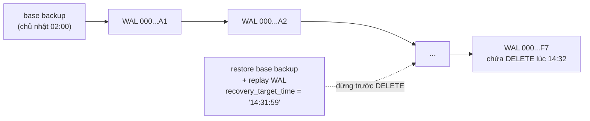

# Backup / Restore — pg_dump, pg_restore, pg_basebackup, PITR

**Replica không phải là backup.** Một câu `DELETE FROM orders;` chạy nhầm trên primary sẽ được replicate sang replica trong vài mili giây. Replication bảo vệ khỏi *hỏng máy*; backup bảo vệ khỏi *sai lầm* (của người, của code, của migration).

| | Logical backup | Physical backup |
| --- | --- | --- |
| Công cụ | `pg_dump` / `pg_dumpall` → `pg_restore` / `psql` | `pg_basebackup` (+ WAL archive cho PITR) |
| Nội dung | câu lệnh SQL / dữ liệu dạng hàng (schema + `COPY`) | bản sao từng byte của data directory |
| Phạm vi | một database, một bảng, một schema | **toàn bộ cluster** (mọi database) |
| Restore | vào bất kỳ phiên bản PostgreSQL mới hơn, bất kỳ kiến trúc CPU | cùng major version, cùng kiến trúc |
| Restore một bảng | dễ (`pg_restore -t`) | không (phải dựng cả cluster) |
| Về thời điểm bất kỳ (PITR) | không — chỉ đúng thời điểm dump | có, nếu lưu đủ WAL |
| Tốc độ với DB lớn | chậm (phải build lại index, ANALYZE) | nhanh (copy file) |
| Dùng cho | chuyển dữ liệu, nâng cấp major version, backup nhỏ, môi trường dev | backup production, dựng replica (chính là cách replica của lab được tạo) |

Lab đã có sẵn script cho logical backup. Cả hai script chạy `pg_dump`/`pg_restore` **bên trong container** nên không cần cài PostgreSQL client trên máy.

---

## 1. Backup bằng `scripts/backup.sh`

```bash
./scripts/backup.sh                          # custom format (.dump) từ PRIMARY
./scripts/backup.sh --from-replica           # dump từ REPLICA - không tạo tải đọc lên primary
./scripts/backup.sh --plain                  # SQL thuần (.sql), đọc được bằng mắt
./scripts/backup.sh --db other_db
```

Kết quả đo trên lab (dataset mặc định, database ~800 MB):

| Lệnh | File | Kích thước | Thời gian |
| --- | --- | --- | --- |
| `./scripts/backup.sh` | `backups/ecommerce_<UTC>.dump` | 128 MB (nén) | 10 s |
| `./scripts/backup.sh --from-replica --plain` | `backups/ecommerce_<UTC>.sql` | 450 MB | 4 s |

Bên dưới là:

```bash
docker compose exec -T postgres-primary pg_dump -U postgres -d ecommerce --format=custom --compress=6 > backups/ecommerce_....dump
```

Những điều cần biết về `pg_dump`:

- **Nhất quán mà không khoá**: `pg_dump` mở một transaction `REPEATABLE READ` và dump mọi bảng từ **cùng một snapshot** (MVCC). Ứng dụng vẫn đọc ghi bình thường trong lúc dump. Nó chỉ lấy `AccessShareLock` trên từng bảng → chặn `ALTER TABLE`/`DROP` (và mọi thứ xếp hàng sau chúng, xem [transaction-lab.md §8.1](transaction-lab.md#81-hàng-đợi-lock-một-select-bình-thường-cũng-bị-treo)).
- Vì giữ snapshot suốt thời gian dump, một `pg_dump` dài **giữ `xmin`**, làm VACUUM không dọn được dead tuple. Dump từ replica tránh được tải I/O nhưng với `hot_standby_feedback = on` thì xmin vẫn được báo về primary.
- **Không** gồm role, mật khẩu, tablespace (đối tượng cấp cluster). Dùng `pg_dumpall --globals-only` cho phần đó:

  ```bash
  docker compose exec -T postgres-primary pg_dumpall -U postgres --globals-only > backups/globals.sql
  ```

Các định dạng:

| `--format` | Đuôi | Nén | Restore song song (`--jobs`) | Chọn lọc đối tượng | Restore bằng |
| --- | --- | --- | --- | --- | --- |
| `plain` | `.sql` | không (tuỳ chọn gzip ngoài) | không | không | `psql -f` |
| `custom` | `.dump` | có | **có** | **có** | `pg_restore` |
| `directory` | thư mục | có | có (cả khi **dump**: `pg_dump -j N`) | có | `pg_restore` |
| `tar` | `.tar` | không | không | có | `pg_restore` |

Xem mục lục bên trong một file custom:

```bash
docker compose exec -T postgres-primary pg_restore --list < backups/ecommerce_*.dump | head -40
```

Mỗi dòng là một *TOC entry*: `TABLE` (tạo bảng), `TABLE DATA` (dữ liệu, dạng `COPY`), `INDEX`, `CONSTRAINT`, `FK CONSTRAINT`, `TRIGGER`, `SEQUENCE SET`… Thứ tự restore: schema → dữ liệu → index → constraint/FK. Nạp dữ liệu **trước** rồi mới tạo index và FK nhanh hơn nhiều so với ngược lại.

---

## 2. Restore bằng `scripts/restore.sh`

```bash
./scripts/restore.sh backups/ecommerce_20261001T031352Z.dump
#  -> tạo database MỚI "ecommerce_restore" (mặc định an toàn) rồi pg_restore --jobs=4

./scripts/restore.sh backups/ecommerce_20261001T031352Z.dump my_copy
#  -> database "my_copy" (xoá và tạo lại nếu đã có)

./scripts/restore.sh backups/ecommerce_20261001T031352Z.dump ecommerce --force
#  -> THAY THẾ database chính (ngắt mọi connection đang mở!)
```

Script từ chối ghi đè `ecommerce` nếu thiếu `--force`, và không bao giờ đụng `postgres`/`template0`/`template1`.

Đo trên lab: restore file custom 128 MB với `--jobs=4` mất **10 s**; restore file `.sql` 450 MB bằng `psql` (một luồng) mất **21 s**. Sau restore script chạy `vacuumdb --analyze-only` vì **`pg_restore` không khôi phục thống kê planner** — bỏ qua bước này, mọi truy vấn đầu tiên sẽ có ước lượng sai (xem [query-optimization-lab.md §5](query-optimization-lab.md#5-statistics-khi-planner-đoán-sai)).

Database restore trên primary **tự xuất hiện trên replica** (`CREATE DATABASE` và toàn bộ dữ liệu đi qua WAL):

```bash
docker exec pglab-replica psql -U postgres -d ecommerce_restore -c "SELECT count(*) FROM orders"   # 500000
```

Dọn dẹp: `docker exec pglab-primary psql -U postgres -c "DROP DATABASE ecommerce_restore WITH (FORCE)"`.

### 2.1 Restore có chọn lọc

```bash
F=backups/ecommerce_20261001T031352Z.dump      # đổi thành file của bạn
docker compose cp "$F" postgres-primary:/tmp/lab.dump

# Chỉ schema (không dữ liệu) ra SQL để đọc
docker compose exec postgres-primary pg_restore --schema-only -f - /tmp/lab.dump | less

# Chỉ một bảng, vào database có sẵn
docker compose exec postgres-primary psql -U postgres -c "CREATE DATABASE only_reviews"
docker compose exec postgres-primary pg_restore -U postgres -d only_reviews -t categories -t reviews /tmp/lab.dump
#  -> 300,000 dòng, nhưng chỉ có bảng + dữ liệu + CHECK constraint (khai báo trong CREATE TABLE).
#     KHÔNG có PRIMARY KEY, UNIQUE, index, FK: đó là các TOC entry riêng mà -t không chọn.
#     Kiểm tra: \d reviews trong database only_reviews.

# Danh sách TOC tuỳ chỉnh: bỏ index thừa khi restore
docker compose exec postgres-primary bash -c \
  "pg_restore --list /tmp/lab.dump | grep -v idx_order_items_order_id > /tmp/lab.list"
docker compose exec postgres-primary psql -U postgres -c "CREATE DATABASE trimmed"
docker compose exec postgres-primary pg_restore -U postgres -d trimmed -L /tmp/lab.list --jobs=4 /tmp/lab.dump

# Dọn dẹp
docker compose exec postgres-primary psql -U postgres -c "DROP DATABASE only_reviews" -c "DROP DATABASE trimmed"
docker compose exec postgres-primary rm -f /tmp/lab.dump /tmp/lab.list
```

### 2.2 Bài tập: khôi phục sau "tai nạn"

1. `./scripts/backup.sh`
2. Trên primary: `DELETE FROM reviews WHERE rating = 1;` (27,224 dòng biến mất — trên **cả replica**, kiểm tra ở `5433`).
3. Khôi phục **chỉ** các dòng đã mất mà không ghi đè dữ liệu mới phát sinh sau backup:

   ```bash
   ./scripts/restore.sh backups/<file>.dump recovery
   ```

   ```sql
   -- trên primary, database ecommerce
   CREATE EXTENSION IF NOT EXISTS dblink;
   INSERT INTO reviews
   SELECT * FROM dblink('dbname=recovery user=postgres',
                        'SELECT * FROM reviews WHERE rating = 1')
     AS r(id bigint, product_id bigint, user_id bigint, order_id bigint, rating smallint, title varchar,
          body text, is_verified_purchase boolean, helpful_count integer, created_at timestamptz)
   ON CONFLICT DO NOTHING;
   ```

   Cách khác không cần extension: `pg_dump` không có tuỳ chọn lọc dòng (`--where`), nên xuất bằng `\copy (SELECT * FROM reviews WHERE rating = 1) TO '/tmp/r1.csv' CSV` trong database `recovery`, rồi `\copy reviews FROM '/tmp/r1.csv' CSV` trong `ecommerce` (dùng `./scripts/psql.sh` để file nằm cùng container).
4. Câu hỏi: các review được **tạo mới** trong khoảng giữa lúc backup và lúc xoá có rating 1 có được cứu không? Đó chính là giới hạn của logical backup → mục 4 (PITR).

---

## 3. Physical backup: `pg_basebackup`

`pg_basebackup` copy toàn bộ data directory qua một **replication connection**, đồng thời stream WAL sinh ra trong lúc copy để bản sao tự nhất quán. Đây chính là bước replica của lab chạy khi khởi động lần đầu ([postgres/replica/entrypoint.sh](../postgres/replica/entrypoint.sh)).

```bash
docker compose exec postgres-primary bash -c '
  rm -rf /tmp/basebackup &&
  pg_basebackup -U postgres -D /tmp/basebackup -Ft -z -X stream --checkpoint=fast --progress &&
  ls -lh /tmp/basebackup'
```

```text
867196/867196 kB (100%), 1/1 tablespace
-rw------- 1 root root 193K backup_manifest
-rw------- 1 root root 221M base.tar.gz        <- data directory (tất cả database)
-rw------- 1 root root  17K pg_wal.tar.gz      <- WAL từ lúc bắt đầu tới lúc kết thúc copy
```

- `-Ft -z`: định dạng tar nén (`-Fp` = thư mục thường, như replica dùng).
- `-X stream`: mở thêm một connection để stream WAL song song → bản backup tự đủ để khởi động.
- `--checkpoint=fast`: ép checkpoint ngay thay vì đợi checkpoint kế tiếp.
- `backup_manifest` + `pg_verifybackup` kiểm tra tính toàn vẹn:

  ```bash
  docker compose exec postgres-primary bash -c '
    mkdir -p /tmp/bb_plain && cd /tmp/bb_plain && tar xzf /tmp/basebackup/base.tar.gz &&
    mkdir -p pg_wal && tar xzf /tmp/basebackup/pg_wal.tar.gz -C pg_wal &&
    pg_verifybackup -m /tmp/basebackup/backup_manifest /tmp/bb_plain'
  docker compose exec postgres-primary rm -rf /tmp/basebackup /tmp/bb_plain     # dọn dẹp
  ```

Trong lúc chạy, quan sát trên primary:

```sql
SELECT pid, phase, pg_size_pretty(backup_total) AS total, pg_size_pretty(backup_streamed) AS streamed
FROM pg_stat_progress_basebackup;
SELECT application_name, state FROM pg_stat_replication;   -- thêm 1-2 dòng 'pg_basebackup'
```

---

## 4. Point-in-Time Recovery (PITR) — khái niệm

Physical backup + **mọi file WAL kể từ backup** = khôi phục được về **bất kỳ thời điểm nào** sau backup: "trạng thái lúc 14:31:59, một giây trước khi `DELETE` chạy".



Cần ba thứ mà lab **chưa bật** (để giữ cấu hình đơn giản):

```ini
# postgresql.conf (primary)
archive_mode = on
archive_command = 'test ! -f /archive/%f && cp %p /archive/%f'   # copy mỗi WAL segment đã đầy ra nơi an toàn
# hoặc archive_library (PG15+), hoặc công cụ như pgBackRest / WAL-G / Barman
```

Quy trình khôi phục:

1. Dừng PostgreSQL, thay data directory bằng nội dung base backup.
2. Trong `postgresql.conf`:

   ```ini
   restore_command = 'cp /archive/%f %p'
   recovery_target_time = '2026-10-01 14:31:59+00'
   recovery_target_action = 'pause'       # dừng để kiểm tra, rồi SELECT pg_wal_replay_resume() / promote
   ```

3. Tạo file `recovery.signal` trong data directory, khởi động. Server replay WAL tới đúng thời điểm rồi dừng.

So sánh với replica của lab: replica **cũng** replay WAL, chỉ khác là WAL đến qua mạng (streaming) thay vì từ archive, và không có điểm dừng. Một biến thể hữu ích là **delayed replica** (`recovery_min_apply_delay = '1h'` — đã có dòng comment sẵn trong [postgres/replica/postgresql.conf](../postgres/replica/postgresql.conf)): replica luôn trễ 1 giờ, cho bạn 1 giờ để phát hiện `DELETE` nhầm và lấy dữ liệu từ đó.

**Bài tập nâng cao** (tự cấu hình): thêm volume `/archive` cho primary, bật `archive_mode` + `archive_command`, chạy `pg_basebackup`, tạo vài giao dịch có ghi lại `now()`, xoá nhầm một bảng, rồi dựng một container PostgreSQL thứ ba khôi phục tới trước thời điểm xoá. Kiểm tra `SELECT pg_switch_wal();` (ép đóng segment WAL hiện tại để archive ngay) và `pg_stat_archiver`.

---

## 5. Chiến lược trong thực tế

- **Thử restore định kỳ.** Backup chưa từng restore thành công coi như không có backup. Đo luôn thời gian restore (RTO).
- Lưu backup **ngoài** máy chủ database (và ngoài cùng region/tài khoản cloud).
- Logical dump hằng ngày cho DB nhỏ/dev; physical + WAL archive (pgBackRest, WAL-G, Barman, hoặc dịch vụ managed) cho production. RPO (mất tối đa bao nhiêu dữ liệu) với WAL archive = vài giây đến 1 segment WAL; với dump hằng ngày = tới 24 giờ.
- Backup gồm cả **globals** (role, mật khẩu) và **cấu hình** (`postgresql.conf`, `pg_hba.conf` — lab lưu chúng trong git ở [postgres/](../postgres/)).
- Nâng cấp major version: `pg_dump` từ bản cũ + restore vào bản mới, hoặc `pg_upgrade` (nhanh hơn, cùng máy).

Volume Docker của lab (`postgresql-lab_postgres_primary_data`) cũng là một dạng "dữ liệu sống", không phải backup: `docker compose down -v` xoá nó vĩnh viễn.
