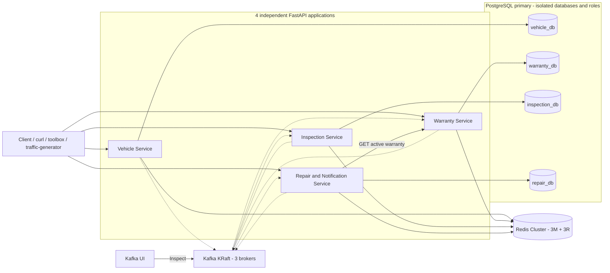
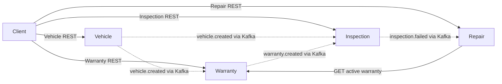
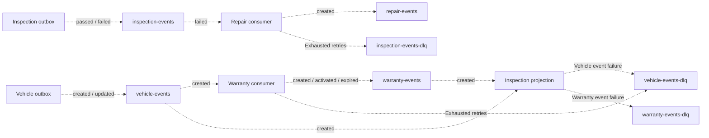
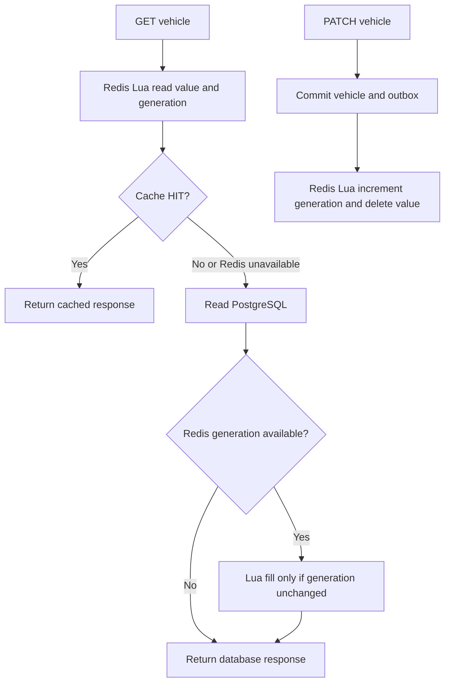
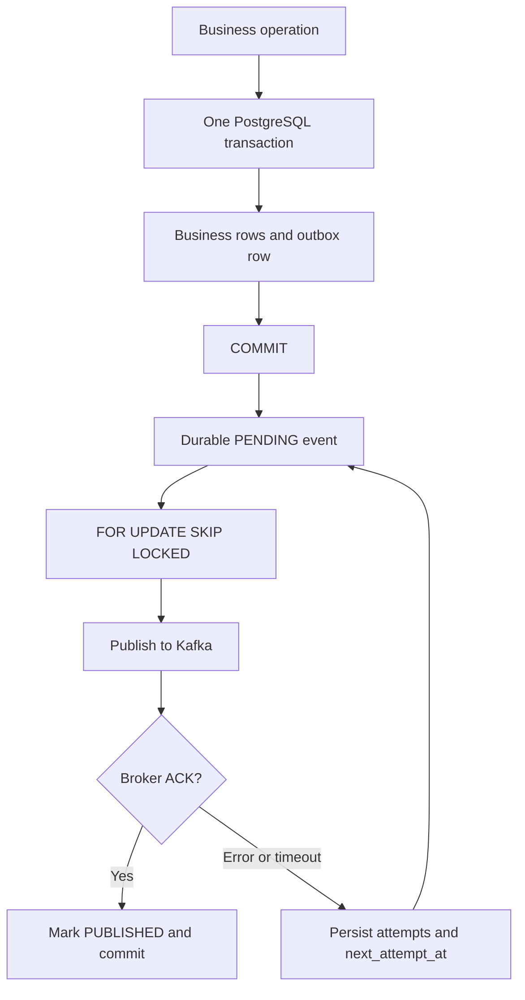
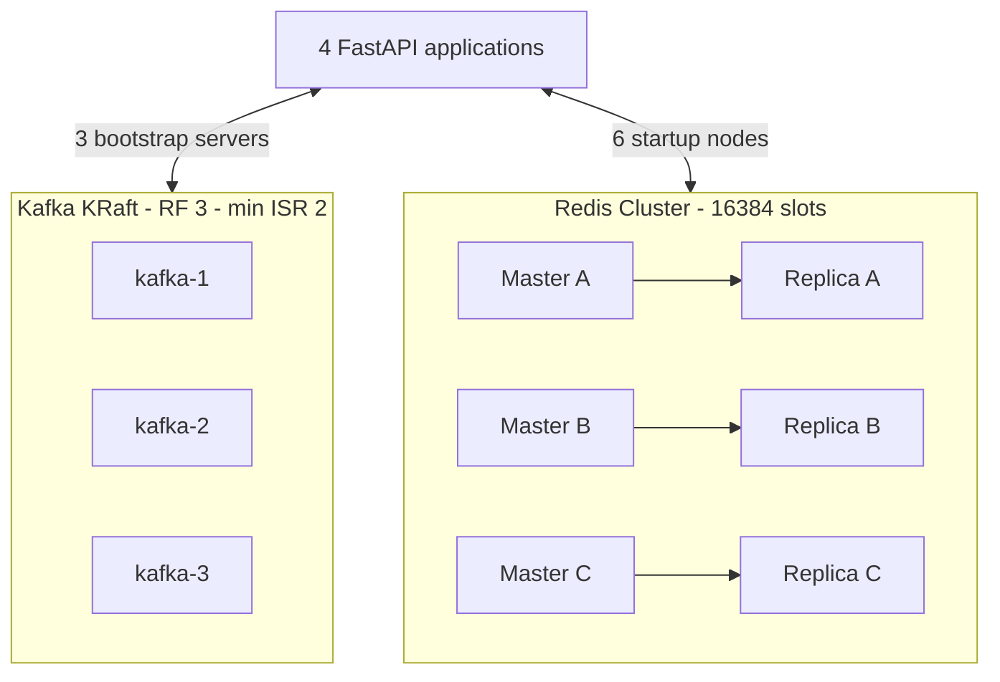
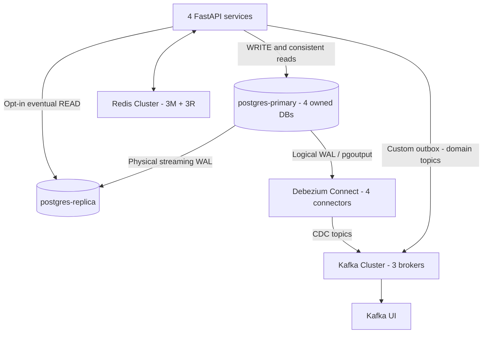

# Vehicle Service & Warranty Platform

Bài lab backend Python dành cho Senior/Lead: **4 microservice nghiệp vụ và một traffic-generator độc lập**, PostgreSQL primary–replica với database riêng theo service và Debezium CDC, **Redis Cluster 6 node (3 master + 3 replica)**, **Kafka KRaft 3 broker (RF=3)**, REST bất đồng bộ bằng `httpx`, transactional outbox, consumer idempotent và các bài thử lỗi có thể chạy lại.

**Tài liệu thiết kế:** [Traffic Generator](docs/TRAFFIC_GENERATOR.md) · [PostgreSQL & CDC](docs/POSTGRESQL_CDC.md) · [Kafka & Redis Cluster](docs/CLUSTER_INFRASTRUCTURE.md) · [Mục lục docs](docs/README.md) · [System Design](docs/SYSTEM_DESIGN.md) · [ERD và state machines](docs/DATA_MODEL.md) · [Sequence diagrams](docs/REQUEST_FLOWS.md) · [API](docs/API_CONTRACTS.md) · [Events](docs/EVENT_CONTRACTS.md) · [Consistency](docs/CONSISTENCY_AND_FAILURES.md) · [Runbook](docs/OPERATIONS.md) · [Architecture decisions](docs/ARCHITECTURE_DECISIONS.md). Có cả source Mermaid và [bản SVG](docs/diagrams/README.md).

Chỉ cần Docker và Docker Compose v2+ trên host. `make` là tiện ích tùy chọn; mọi lệnh có bản Docker tương đương. Cấu hình cluster đã được kiểm thử với 8 GB RAM và 8 CPU cấp cho Docker; mức sử dụng thay đổi theo workload. Các image được kiểm thử trên Linux ARM64 qua Docker; không ép kiến trúc CPU trong Compose.

```sh
[ -f .env ] || cp .env.example .env
make up                 # 10 bước RUNNING / WAIT / OK / FAILED
make ps
make traffic-status
make traffic-logs       # Ctrl+C để thoát logs; containers vẫn chạy
```

**Thứ tự CLI và log khởi động:** [Getting Started](docs/GETTING_STARTED.md). Không có Make: `bash scripts/up.sh`. Đợi `READY Startup completed`; traffic tự chạy. Log từng lần khởi động lưu trong `artifacts/startup/<timestamp>-<pid>/startup.log`.

Swagger: [Vehicle :8001](http://localhost:8001/docs), [Warranty :8002](http://localhost:8002/docs), [Inspection :8003](http://localhost:8003/docs). Repair nhận một cổng trong dải 8004–8006; lấy địa chỉ bằng `docker compose port --index 1 repair-service 8000` rồi mở `/docs`. [Kafka UI :8080](http://localhost:8080) hiển thị topic, partition, message, group và lag. Kết quả traffic ở [Traffic Validation](docs/TRAFFIC_VALIDATION.md); PostgreSQL ở [PostgreSQL & CDC Validation](docs/POSTGRESQL_CDC_VALIDATION.md); bằng chứng Kafka/Redis ở [Cluster Validation](docs/CLUSTER_VALIDATION.md).

## 1. Project Overview

Một xe mới được đăng ký sẽ sinh warranty mặc định. Khách hàng tạo inspection, kỹ thuật viên hoàn tất PASS hoặc FAIL. FAIL tạo repair request sau khi Repair Service hỏi Warranty Service về bảo hành hiện tại, đồng thời lưu notification mô phỏng.

Không có SQLite, queue thay thế Kafka hay Redis bằng dictionary. API trả về sau transaction của service sở hữu dữ liệu; việc đồng bộ sang service khác diễn ra eventual consistency. Các API có `/docs`, `/health`, `/ready`, request validation, response model và lỗi JSON nhất quán.

## 2. Business Domain

| Đối tượng | Quy tắc trong lab |
|---|---|
| Vehicle | VIN duy nhất, 17 ký tự theo tập ký tự VIN; không kiểm check digit theo thị trường. VIN không đổi sau tạo. Status ACTIVE/INACTIVE. |
| Customer | Thông tin owner cơ bản nằm ở `vehicles.owner_name`; không có service customer thứ năm. |
| Warranty | Mỗi xe tối đa một warranty cho từng loại DEFAULT, EXTENDED, POWERTRAIN. DEFAULT tự tạo ACTIVE, thời hạn 1095 ngày từ ngày event tạo xe. |
| Coverage | `status=ACTIVE` và `start_date <= ngày UTC hiện tại <= end_date`. Chưa nhận dữ liệu warranty trả 404, không kết luận uncovered. |
| Inspection | PENDING → IN_PROGRESS → COMPLETED; có thể complete thẳng từ PENDING. FAIL bắt buộc có reason; PASS không có failure reason. Completed là immutable. |
| Repair | Một repair cho mỗi inspection. OPEN → IN_PROGRESS → COMPLETED; OPEN/IN_PROGRESS có thể CANCELLED. Coverage là snapshot tại lúc tạo repair. |
| Notification | Một bản ghi LOG/SIMULATED cho mỗi repair, cùng transaction với repair; không gửi email/SMS. |

`POST /repairs` là luồng nhập phiếu thủ công của workshop: caller cung cấp inspection ID và vehicle ID. Lab chưa xác thực inspection đó qua Inspection REST; consumer tự động chỉ tạo từ `inspection.failed`. Cả hai luồng dùng chung ràng buộc unique `inspection_id`.

## 3. Architecture

System Architecture Diagram:



Mỗi application chứa API, outbox task và consumer task nếu có. Expiry task nằm trong Warranty Service. Chúng dùng asyncio, một uvicorn process/container; có thể chạy thêm replica cùng group. Thêm `traffic-generator` chạy worker client REST riêng để tạo workload; không thêm domain nghiệp vụ. `kafka-init` là init job; `toolbox` là container chạy script/test rồi thoát.

Outbox task trong từng service đọc database của chính service đó và phát domain events vào Kafka. Debezium đọc logical WAL để phát CDC vào các topic riêng.

## 4. Service Responsibilities

| Service | Host port | Sở hữu | Consume | Publish |
|---|---:|---|---|---|
| vehicle-service | 8001 | Vehicle, owner | Không | vehicle.created, vehicle.updated |
| warranty-service | 8002 | Warranty, coverage, expiry | vehicle.created | warranty.created, warranty.activated, warranty.expired |
| inspection-service | 8003 | Inspection, projection xe/warranty | vehicle.created, warranty.created | inspection.passed, inspection.failed |
| repair-service | 8004–8006 (cấp động) | Repair, notification | inspection.failed | repair.created |

Service Communication Diagram — nét liền là REST, nét đứt là Kafka:



Chọn REST cho câu hỏi coverage cần trả lời tại thời điểm xử lý repair; chọn event cho thông báo sự kiện nghiệp vụ và fan-out sang nhiều bên. Không có distributed transaction giữa REST và các database.

## 5. Project Structure

```text
.
├── services/
│   ├── vehicle-service/
│   ├── warranty-service/
│   ├── inspection-service/
│   └── repair-service/
│       ├── app/
│       │   ├── api/routes.py
│       │   ├── models/
│       │   ├── schemas/
│       │   ├── repositories/
│       │   ├── services/
│       │   ├── messaging/handlers.py
│       │   ├── infrastructure/warranty_client.py
│       │   └── main.py
│       ├── migrations/versions/0001_initial.py
│       ├── tests/
│       ├── Dockerfile
│       ├── requirements.txt
│       └── README.md
├── common/platform_common/   # Runtime/config/DB/Redis/Kafka/logging; không chứa domain
├── infrastructure/
│   ├── postgres/init-databases.sh
│   └── kafka/init-topics.sh
├── scripts/                 # Demo, seed, replay, fault drills
├── tests/{unit,integration}/
├── docs/VALIDATION.md
├── docker-compose.yml
├── compose.chaos.yml
├── Dockerfile.tools
├── requirements.txt         # Dependencies trực tiếp
├── requirements.lock        # Cả transitive dependencies đã kiểm thử
├── .env.example
└── Makefile
```

Vehicle không cần consumer handler; chỉ Repair có HTTP integration riêng. Core/infrastructure dùng chung được đóng gói **vào từng image lúc build**, không phải service dùng chung qua network. Từng service có entrypoint, schema, migration history và Dockerfile riêng. Build context là root để copy thư viện chung; không import domain của service khác.

## 6. Database Design

| Database / role | Business tables | Constraints chính |
|---|---|---|
| vehicle_db / vehicle_app | vehicles | UUID PK; unique VIN; check year/status |
| warranty_db / warranty_app | warranties | UUID PK; unique vehicle_id + warranty_type; check dates/status |
| inspection_db / inspection_app | inspections, vehicle_references | UUID PK; projection PK vehicle_id; check completion và failure reason |
| repair_db / repair_app | repair_requests, notifications | UUID PK; unique inspection_id; FK notification → repair trong cùng DB; unique repair_id + channel |

Tất cả DB có `outbox_events`, `processed_events`, `idempotency_records`, `alembic_version`. Vehicle không dùng processed_events; Vehicle/Warranty chưa có API cần idempotency_records, nhưng schema hạ tầng được giữ thống nhất.

Business rows có `created_at/updated_at`; inspections thêm `completed_at`. Timestamp lưu `TIMESTAMPTZ`; Pydantic serialize ISO 8601. UUID được tạo ở ứng dụng. Cross-service ID là giá trị tham chiếu, không có FK hay JOIN sang database của service khác.

## 7. PostgreSQL Usage

SQLAlchemy 2.x async + asyncpg; mỗi task/request mở session riêng. Engine có pool `5 + 5 overflow`, acquire timeout 3 giây, connect timeout 3 giây, statement timeout 10 giây và `pool_pre_ping=True`. `expire_on_commit=False` tránh lazy reload ngoài ngữ cảnh async. Cách quản lý session theo task theo [SQLAlchemy AsyncIO](https://docs.sqlalchemy.org/en/20/orm/extensions/asyncio.html).

| Index | Lý do |
|---|---|
| vehicles(vin) unique | Chặn race tạo xe trùng tại DB |
| vehicles(created_at,id) | Danh sách có thứ tự ổn định, limit/offset |
| warranties(vehicle_id,warranty_type) unique | Chặn duplicate warranty kể cả event ID khác |
| warranties(vehicle_id,status,start_date,end_date) | Có prefix vehicle_id phục vụ coverage lookup; lab đọc lịch sử nhỏ của xe rồi lọc ngày trong Python |
| warranties(status,end_date) | Expiry task tìm warranty quá hạn |
| inspections(vehicle_id,created_at) | Lấy inspections theo xe |
| repair_requests(inspection_id) unique | Một repair cho một inspection |
| repair_requests(vehicle_id,created_at) | Danh sách repairs theo xe |
| notifications(repair_id,channel) unique | Một notification/channel và lookup theo repair |
| processed_events(event_id,consumer_name) PK | Serialize và dedupe concurrent event |
| idempotency_records(scope,key_hash) PK | Serialize các request retry cùng khóa |
| outbox pending(next_attempt_at,id) partial | Chỉ quét event cần publish |
| outbox pending(aggregate_id,id) partial | Tìm event cũ hơn chưa publish cùng aggregate |

Alembic `upgrade head` tự chạy trước uvicorn. Advisory lock ở từng DB serialize migration khi nhiều replica khởi động. Migration `0001` là DDL cố định; không dùng `create_all()` khi application startup. Test dùng `create_all()` chỉ trong schema PostgreSQL tạm và xóa schema đó sau test.

```sh
docker compose exec vehicle-service alembic current
docker compose exec warranty-service alembic current
docker compose exec inspection-service alembic current
docker compose exec repair-service alembic current
docker compose exec postgres-primary psql -U platform_admin -d vehicle_db -c '\dt'
```

Init script tạo bốn role/password riêng, revoke CONNECT từ PUBLIC trên bốn database, grant lại cho owner. Test xác nhận vehicle_app không connect được warranty_db. Admin chỉ dành cho vận hành/test; ứng dụng không dùng admin. Script init chỉ chạy khi volume PostgreSQL rỗng.

## 8. Redis Usage

| Use case | Key | Hành vi lỗi |
|---|---|---|
| Vehicle cache | `vehicle:{UUID}` và `vehicle:{UUID}:generation` (dấu `{}` có thật) | Bypass sang DB; log lỗi; stale value có TTL |
| Idempotency state/result | `idem:{service}:{scope}:{sha256(key)}` | Dùng durable ledger PostgreSQL |
| Distributed lock | `lock:{service}:{resource}` | Khi Redis lỗi, dùng constraint/transaction PostgreSQL; lock đang bận thì consumer retry |

RedisCluster async client dùng cả sáu startup nodes, được reuse trong lifespan; socket timeout 0.5 giây và deadline mỗi thao tác 2 giây. Idempotency result TTL 86400 giây, processing state và lock TTL 30 giây. Namespace tách service và scope. Không có tính đúng đắn dài hạn nào chỉ dựa vào Redis.

## 9. Kafka Architecture

Kafka có ba broker/controller KRaft, không ZooKeeper. Topic có ít nhất 3 partitions, replication factor 3 và min.insync.replicas=2; retention 7 ngày. Mọi service publish thông qua outbox, key bằng `vehicle_id` để gom các event cùng xe vào một partition của mỗi topic. Kafka chỉ bảo đảm thứ tự trong một partition, không có thứ tự xuyên topic.

Kafka Event Flow Diagram:



`repair-events` có sẵn cho downstream/Kafka UI, hiện không có consumer trong 4 service. `repair-events-dlq` được init để nhất quán, hiện không có consumer nguồn tạo bản ghi vào đó. PASS được publish và Repair bỏ qua vì không thuộc subscription nghiệp vụ.

## 10. Kafka Topics

Topic nguồn: `vehicle-events`, `warranty-events`, `inspection-events`, `repair-events`.

DLQ tương ứng: `vehicle-events-dlq`, `warranty-events-dlq`, `inspection-events-dlq`, `repair-events-dlq`.

`kafka-init` chạy `--create --if-not-exists`, topic auto-create của broker tắt. Tăng `KAFKA_TOPIC_PARTITIONS` sau khi topic đã tồn tại không tự tăng partitions; cần thao tác Kafka admin riêng. Kafka chỉ advertise `kafka-1:9092,kafka-2:9092,kafka-3:9092` trong network Compose; CLI chạy trong container hoặc xem Kafka UI.

```sh
docker compose exec kafka-1 /opt/kafka/bin/kafka-topics.sh --bootstrap-server kafka-1:9092,kafka-2:9092,kafka-3:9092 --list
docker compose exec kafka-1 /opt/kafka/bin/kafka-consumer-groups.sh --bootstrap-server kafka-1:9092,kafka-2:9092,kafka-3:9092 --all-groups --describe
```

## 11. Event Schema

Envelope version `1.0` trong `common/platform_common/events.py`:

```json
{
  "event_id": "e06d0aaf-c879-4d58-9260-d7082b4cb8ae",
  "event_type": "inspection.failed",
  "event_version": "1.0",
  "occurred_at": "2026-09-30T10:00:00Z",
  "producer": "inspection-service",
  "correlation_id": "583364bc-d7e5-4717-870f-1a682a7c3943",
  "data": {
    "inspection_id": "512ef7f4-a0ee-4b17-9de8-0165c9f6f322",
    "vehicle_id": "02fc3c76-9c9a-483c-bdc3-62b2be3608f0",
    "failure_reason": "Battery coolant leak",
    "occurred_at": "2026-09-30T10:00:00Z"
  }
}
```

Vehicle/warranty/repair events chứa snapshot response model; inspection events chứa các trường trên. `event_id` giữ nguyên qua outbox retry và replay. Envelope được validate; unsupported version/malformed JSON đi DLQ ngay; payload sai trong handler được retry hữu hạn rồi DLQ. Message type hợp lệ nhưng handler không quan tâm được bỏ qua và commit offset.

## 12. Consumer Groups

| Group | Topics | Handler |
|---|---|---|
| warranty-service-v1 | vehicle-events | Tạo DEFAULT warranty |
| inspection-service-v1 | vehicle-events, warranty-events | Upsert projection cục bộ |
| repair-service-v1 | inspection-events | Warranty REST + repair + notification |

`enable_auto_commit=False`, `auto_offset_reset=earliest`, xử lý từng record tuần tự và commit đúng `{topic-partition: offset + 1}` sau khi DB commit hoặc DLQ ACK. Cơ chế manual commit tham chiếu [aiokafka manual commit](https://aiokafka.readthedocs.io/en/stable/examples/manual_commit.html).

Nếu rebalance làm commit lỗi, consumer đóng và tạo lại từ committed offset. Ledger xử lý việc nhận lại. Không tiếp tục đọc record sau khi publish DLQ hay commit offset thất bại. Một worker chờ retry có thể làm các partition worker đó sở hữu cùng chậm; max poll interval mặc định 300 giây lớn hơn retry budget mặc định. Khi tăng timeout/retries cần tính lại budget.

## 13. REST Communication

Repair gọi `GET /warranties/vehicle/{vehicle_id}/active` qua một `httpx.AsyncClient` cho toàn lifespan:

- Connect timeout 1 giây, read/write/pool timeout 2 giây, tối đa 20 connections và 10 keepalive connections.
- Một lần gọi + tối đa 2 retry, chờ 0.2 rồi 0.4 giây.
- 404 nghĩa là chưa có lịch sử warranty; 429/5xx, network error, timeout hoặc response không hợp lệ đều không được chuyển thành `covered=false`.
- API caller nhận 503 + `Retry-After: 2`; transaction rollback, có thể retry cùng Idempotency-Key.
- Consumer rollback marker và business write, retry theo consumer budget, cuối cùng DLQ nếu chưa phục hồi.
- Response `covered=false` hợp lệ chỉ khi service đã có lịch sử warranty và không tìm thấy warranty active theo ngày hiện tại.

Lab giữ DB transaction khi gọi REST để ledger reservation và business commit nằm cùng transaction. Đổi lại connection bị giữ lâu hơn; timeout hữu hạn hạn chế tác động. Production có thể tách bước resolve coverage thành state machine nhưng cần xử lý lại race/claim và retention.

## 14. Cache Strategy

Redis Cache Flow:



TTL 60 giây. `X-Cache: HIT/MISS` giúp quan sát. PATCH commit trước rồi invalidate cache. Generation check chặn một GET miss đọc bản cũ trước PATCH rồi ghi lại cache sau invalidation thành công.

Đây là cache eventual consistency: crash sau DB commit trước invalidate, Redis unavailable lúc invalidate, hay dữ liệu sửa trực tiếp bằng SQL vẫn có thể để lại stale cache. TTL giới hạn thời gian sống mỗi cache entry; không có bảo đảm read-after-write khi dependency lỗi. Generation key được giữ không TTL trong lab; cần chiến lược dọn metadata khi dữ liệu lớn.

## 15. Idempotency Strategy

`POST /inspections` và `POST /repairs` bắt buộc `Idempotency-Key`, dài 1–128 ký tự. Cùng key + cùng canonical payload trả cùng response snapshot 201; cùng key + payload khác trả 409. Snapshot tạo ban đầu có thể vẫn là PENDING dù resource sau đó COMPLETED; GET lấy trạng thái mới.

Redis lưu processing/completed state và result để retry nhanh. PostgreSQL giữ `(scope,key_hash,request_hash,response)` lâu dài. Trong một transaction: `INSERT ... ON CONFLICT DO NOTHING` để giữ chỗ → tạo business row/outbox → cập nhật response → COMMIT. Request concurrent chờ unique conflict được giải quyết, đọc kết quả đã commit. Crash/rollback xóa cả reservation chưa commit.

Redis outage, eviction hoặc hết TTL không làm tạo duplicate. Hash khóa tránh lưu raw key; đây không phải hệ thống xác thực. Lab chưa có user/tenant, nên key scope theo service + endpoint; production phải thêm tenant/principal vào scope. Không tự xóa durable ledger; retention cần lớn hơn thời gian client có thể retry.

## 16. Distributed Lock

Redis `SET key token NX EX 30` khóa tạo default warranty hoặc repair theo natural key. Unlock Lua chỉ DEL nếu token còn thuộc worker hiện tại. Worker chết thì TTL giải phóng; worker chậm quá lease không được xóa lock mới của worker khác.

Lock giúp giảm công việc thừa; không phải fencing token cho database. Unique constraints, row lock và processed ledger vẫn bảo vệ tính đúng đắn khi lease hết, Redis restart hoặc hai process cùng chạy. Redis down thì tiếp tục bằng DB constraints; lock đang bận là transient error để consumer retry. Idempotency API có Redis lock hỗ trợ nhưng khi contention vẫn đi vào DB reservation.

## 17. Transaction Management

Business layer sở hữu `sessions.begin()`. Repository chỉ query/lock; không tự commit. `SELECT ... FOR UPDATE` serialize PATCH/complete/transition. Mọi exception rời transaction block đều rollback.

Các transaction quan trọng:

- Vehicle + vehicle event outbox.
- Processed marker + default warranty + warranty event outbox.
- Inspection completion + passed/failed event outbox.
- Processed marker + repair + notification + repair event outbox.
- API idempotency record + resource + response, cùng outbox nếu nghiệp vụ phát event.

Vehicle Creation Sequence Diagram:

```mermaid
sequenceDiagram
    participant Client
    participant VehicleService
    participant VehicleDB
    participant VehicleOutbox
    participant Kafka
    participant WarrantyService
    participant WarrantyDB
    Client->>VehicleService: POST /vehicles
    VehicleService->>VehicleDB: BEGIN; insert vehicle and outbox; COMMIT
    VehicleDB-->>VehicleService: Committed
    VehicleService-->>Client: 201 vehicle
    VehicleOutbox->>VehicleDB: Lock pending event
    VehicleOutbox->>Kafka: vehicle.created
    Kafka-->>VehicleOutbox: ACK
    VehicleOutbox->>VehicleDB: Mark PUBLISHED; COMMIT
    Kafka->>WarrantyService: vehicle.created
    WarrantyService->>WarrantyDB: BEGIN; reserve event; create default warranty and outbox; COMMIT
    WarrantyService->>Kafka: Commit source offset plus one
```

## 18. Transactional Outbox

Implementation: `common/platform_common/events.py`, `models.py`, `outbox.py`; `outbox_events` nằm ở **mỗi database**, không phải database chung.

Transactional Outbox Diagram:



Worker chọn event pending đến hạn, giữ row lock trong lúc chờ Kafka ACK. Dùng `SKIP LOCKED` để nhiều publisher không giữ cùng một row. Event pending có ID nhỏ hơn và đã visible của cùng aggregate phải publish trước; aggregate khác vẫn tiến triển khi một event đang backoff. Không tuyên bố thứ tự tuyệt đối giữa mọi transaction đồng thời hay giữa các topic.

Kafka down: business commit vẫn thành công sau khi hệ thống đã startup; event tiếp tục nằm PENDING. Retry 1,2,4,8… giây, cap 60, không xóa hoặc bỏ event sau N lần. `attempts`, `last_error`, `next_attempt_at` giúp điều tra. `status=PUBLISHED` chỉ sau broker ACK.

Crash sau ACK nhưng trước mark/commit có thể publish lại cùng `event_id`. Producer bật `enable_idempotence=True, acks=all` giảm duplicate do protocol retry nhưng không giải quyết cửa sổ crash giữa Kafka và PostgreSQL. Toàn luồng vẫn **at-least-once**, không phải distributed exactly-once.

## 19. Idempotent Consumer

`common/platform_common/consumer.py:process_event` insert marker ngay đầu transaction bằng ON CONFLICT, rồi mới gọi handler. Cách này đóng race của `SELECT chưa có → hai worker cùng INSERT business`.

- Marker mới: handler + marker commit cùng nhau.
- Marker đã commit: skip handler; vẫn commit Kafka offset.
- Handler lỗi: rollback marker và toàn bộ business changes.
- Crash sau DB commit trước offset commit: Kafka replay; marker làm skip.
- Hai event ID khác nhau diễn tả cùng business action: unique DEFAULT warranty / inspection_id của repair bảo vệ lớp thứ hai.

Inspection projection upsert từng flag `vehicle_seen` / `warranty_seen`, chấp nhận warranty.created đến trước vehicle.created. API tạo inspection trả 409 `vehicle_projection_not_ready` nếu vehicle event chưa tới; client/demo có polling hữu hạn.

Inspection Failure → Repair Sequence Diagram:

```mermaid
sequenceDiagram
    participant Client
    participant InspectionService
    participant InspectionDB
    participant Kafka
    participant RepairService
    participant Redis
    participant WarrantyService
    participant RepairDB
    Client->>InspectionService: Complete FAIL with reason
    InspectionService->>InspectionDB: Update inspection and insert failed outbox; COMMIT
    InspectionService-->>Client: COMPLETED / FAIL
    InspectionService->>Kafka: Outbox publishes inspection.failed
    Kafka->>RepairService: Deliver event
    RepairService->>RepairDB: BEGIN; insert processed marker
    RepairService->>Redis: Acquire repair lock with TTL
    RepairService->>WarrantyService: GET active warranty
    WarrantyService-->>RepairService: Coverage snapshot
    RepairService->>RepairDB: Insert repair, notification, repair outbox
    RepairService->>Redis: Release lock with token check
    RepairService->>RepairDB: COMMIT
    RepairService->>Kafka: Commit source offset plus one
    RepairService->>Kafka: Outbox publishes repair.created
```

Redis lock scope kết thúc trước outer DB commit; DB constraints/ledger là lớp bảo vệ cho cửa sổ này. Nếu REST lỗi, các bước insert/commit tiếp theo không xảy ra; transaction rollback và consumer retry.

## 20. Retry Strategy

| Operation | Budget mặc định | Sau thất bại |
|---|---|---|
| Consumer handler | 1 lần + 4 retry; sleep 1,2,4,8 giây | Gửi DLQ, chờ ACK rồi commit source offset |
| Warranty HTTP | 1 lần + 2 retry; sleep 0.2,0.4 giây | Raise transient; API 503 hoặc consumer retry |
| Outbox publish | Retry vô hạn, exponential cap 60 giây | Giữ durable pending row |
| Consumer startup / source commit / DLQ transport | Restart consumer, chờ 1 giây | Đọc từ committed offset, có thể redeliver |
| Expiry worker | Chu kỳ 30 giây | Log lỗi, thử ở chu kỳ kế tiếp |

Budget lồng nhau có thể tăng latency khi Warranty mất kết nối. Cần quan sát pool, lag và DLQ; production cần jitter, circuit breaker và phân loại permanent/transient tinh hơn. Consumer lab retry cả business payload error, còn malformed envelope gửi DLQ ngay.

## 21. Dead Letter Topics

DLQ chứa `original_event`, `original_bytes_base64`, `failure_reason`, `failed_at`, `retry_count`, `consumer` và source topic/partition/offset. Giữ raw bytes để điều tra cả JSON hỏng. Dedupe marker không được lưu cho event đã thất bại; replay sau sửa lỗi vẫn xử lý được.

```sh
docker compose exec kafka-1 /opt/kafka/bin/kafka-console-consumer.sh \
  --bootstrap-server kafka-1:9092,kafka-2:9092,kafka-3:9092 --topic inspection-events-dlq --from-beginning \
  --property print.partition=true --property print.offset=true

# Thay 0 12 bằng partition và offset nhìn thấy trong Kafka UI.
docker compose run --rm toolbox python scripts/replay_dlq.py inspection-events-dlq 0 12
```

Replay giữ event ID, không xóa record DLQ và không tự động thay payload. Nếu nhiều consumer cùng dùng một topic nguồn, replay sẽ tới cả các group; group đã thành công sẽ dedupe. JSON hỏng cần sửa thủ công, script từ chối replay mù. DLQ có thể chứa duplicate nếu crash sau gửi DLQ trước offset commit; bộ xử lý vận hành cần dedupe theo source + consumer.

## 22. Logging

Structured JSON logging có `timestamp`, `level`, `service`, `request_id`, `correlation_id`, `trace_id`, `event_id`, `message` và fields theo context. `trace_id=null` vì lab chưa tích hợp tracing. Middleware nhận UUID hợp lệ qua `X-Request-ID`, `X-Correlation-ID`, hoặc sinh mới; trả cả hai header.

Correlation ID đi vào outbox envelope, qua consumer context và REST tới Warranty. Không log nguyên request body hay credential. Notification DB record là bằng chứng mô phỏng chính thức; log `notification_staged` phát trước outer commit nên không phải bằng chứng transaction đã thành công.

```sh
docker compose logs -f --tail=100 vehicle-service warranty-service inspection-service repair-service
```

Các message hữu ích: `outbox_publish_retry`, `outbox_published`, `duplicate_event_skipped`, `event_db_committed`, `consumer_retry`, `consumer_sent_to_dlq`, `cache_bypass`, `vehicle_cache_hit`, `warranty_http_retry`.

## 23. Configuration

`common/platform_common/config.py` dùng pydantic-settings. `.env` dùng cho Compose interpolation; container nhận env rõ ràng từ Compose. Có default local lab nên không bắt buộc copy file trước khi chạy.

```sh
cp .env.example .env
docker compose config --quiet
```

| Biến | Default / cách dùng |
|---|---|
| WRITE_DATABASE_URL | Primary, riêng mỗi service; dùng cả migrations |
| READ_DATABASE_URL | Replica, reader role riêng mỗi service |
| DB_READ_TIMEOUT | 3 giây mỗi read attempt; fallback primary cho replica query lỗi |
| REDIS_CLUSTER_NODES | redis-1:6379,…,redis-6:6379 |
| KAFKA_BOOTSTRAP_SERVERS | kafka-1:9092,kafka-2:9092,kafka-3:9092 |
| SERVICE_NAME / KAFKA_CONSUMER_GROUP | Khai báo riêng trong Compose |
| CACHE_TTL / IDEMPOTENCY_TTL / LOCK_TIMEOUT | 60 / 86400 / 30 giây |
| DB_POOL_SIZE / DB_MAX_OVERFLOW / DB_POOL_TIMEOUT | 5 / 5 / 3 giây |
| DB_STATEMENT_TIMEOUT_MS | 10000 ms |
| REDIS_TIMEOUT | 0.5 giây |
| REDIS_OPERATION_TIMEOUT | 2 giây cho mỗi thao tác gồm discovery/retry |
| REDIS_SUBNET_PREFIX | 172.29.86, node IP .11–.16 trên subnet Docker riêng |
| HTTP_CONNECT_TIMEOUT / HTTP_TIMEOUT / HTTP_RETRIES | 1 / 2 giây / 2 retry |
| HTTP_MAX_CONNECTIONS | 20 |
| WARRANTY_SERVICE_URL | http://warranty-service:8000 |
| OUTBOX_INTERVAL / OUTBOX_RETRY_MAX_SECONDS | 0.5 / 60 giây |
| KAFKA_SEND_TIMEOUT | 5 giây |
| KAFKA_REQUEST_TIMEOUT_MS / KAFKA_RETRY_BACKOFF_MS | 10000 / 200 ms |
| KAFKA_CLUSTER_ID | Chung cho ba node, giữ ổn định với volumes đã format |
| CONSUMER_MAX_RETRIES / RETRY_BASE_SECONDS | 4 / 1 giây |
| CONSUMER_MAX_POLL_INTERVAL_MS | 300000 ms |
| CONSUMER_FETCH_TIMEOUT / CONSUMER_STALL_TIMEOUT | 15s network deadline / 15s kiểm tra empty-poll backlog |
| DEFAULT_WARRANTY_DAYS / WARRANTY_EXPIRY_INTERVAL | 1095 ngày / 30 giây |
| BACKGROUND_WORKERS | true; test fixture tắt task nền |
| LAB_MODE | false; override chaos bật endpoint thử lỗi |

Ports, role passwords, log level và partition count có trong `.env.example`. Khi đổi password ở database đã khởi tạo phải `ALTER ROLE` tương ứng hoặc dùng volume lab mới. Password đặc biệt trong WRITE_DATABASE_URL/READ_DATABASE_URL phải URL-encode. Config sai kiểu/range khiến process startup fail rõ ràng.

## 24. Docker Architecture

Compose gồm 4 application, PostgreSQL 16 primary và replica, Debezium Connect với 4 connectors, sáu Redis 7 nodes, ba Apache Kafka 3.9.1 nodes, Kafka UI, các init jobs và toolbox theo profile `tools`. Các application bind host port vào `127.0.0.1`; database/broker/Redis không mở host port. Named volumes riêng giữ PostgreSQL, từng Redis AOF/nodes.conf và từng Kafka log.

Application chạy non-root, có init process và shutdown grace 20 giây. Client HTTP/Redis, producer, task và DB pool được đóng khi lifespan kết thúc. Startup dependency order: PostgreSQL primary healthy + postgres-init, Redis cluster init và Kafka topic init thành công → migrations → application → CDC publication init và connector registration. Replica bootstrap từ primary bằng pg_basebackup. `/health` chỉ liveness; `/ready` kiểm DB query, Redis Cluster state/slots, Kafka Admin describe cluster và task còn sống. Một dependency lỗi trả readiness 503, nhưng Docker không tự restart chỉ vì healthcheck fail; process crash thì restart `unless-stopped`.

Lab đóng gói pytest/ruff trong image để host chỉ cần Docker. Production nên dùng image runtime nhỏ và image test riêng. Dependency versions khóa trong `requirements.lock`, Docker base images có tag cụ thể ngoại trừ Python minor tag; production cần digest pin và cập nhật CVE định kỳ. Kafka KRaft image theo [Apache Kafka Docker guide](https://kafka.apache.org/39/getting-started/docker/).

## 25. How To Run

```sh
# Foreground đúng một lệnh theo yêu cầu:
docker compose up --build

# Hoặc background và chờ healthy:
docker compose up --build -d --wait
docker compose ps

# Dừng, giữ dữ liệu:
docker compose down

# Xem logs:
docker compose logs -f --tail=100

# XÓA dữ liệu lab và containers:
docker compose --profile tools down -v --remove-orphans
```

Khởi động theo 10 bước có status log bằng `make up` hoặc `bash scripts/up.sh`; xem [thứ tự CLI](docs/GETTING_STARTED.md). Lệnh Compose trực tiếp vẫn dùng được, nhưng không có nhãn tổng thể của launcher.

Make targets: `make up`, `down`, `build`, `logs`, `ps`, `demo`, `seed`, `test`, `lint`, `chaos-up`, `test-chaos`, `clean`. `make clean` xóa cả named volumes. Port đang bận: sửa các biến `*_PORT` trong `.env`. Nếu init script thay đổi trên volume cũ, migration không tự tạo lại DB/role; dùng volume mới hoặc thực hiện migration vận hành rõ ràng.

## 26. API Examples

Các ví dụ sau dùng shell và curl. Parser JSON chạy **trong container**, không cần Python/jq host. Dùng mặc định port; nếu đổi `.env`, sửa URL tương ứng. Gán ID từ response, không dùng UUID giả để demo nghiệp vụ.

```sh
field() {
  docker compose exec -T vehicle-service python -c \
    'import json,sys; print(json.load(sys.stdin)[sys.argv[1]])' "$1"
}
VIN=$(docker compose exec -T vehicle-service python -c \
  'from uuid import uuid4; print("LAB" + uuid4().hex[:14].upper())')

# Create Vehicle
VEHICLE_JSON=$(curl -fsS http://localhost:8001/vehicles \
  -H 'Content-Type: application/json' \
  -d "{\"vin\":\"$VIN\",\"model\":\"EV9\",\"manufacturer\":\"Lab Motors\",\"production_year\":2026,\"owner_name\":\"Nguyen Van An\"}")
VEHICLE_ID=$(printf '%s' "$VEHICLE_JSON" | field id)

# GET hai lần: quan sát X-Cache MISS rồi HIT
curl -i "http://localhost:8001/vehicles/$VEHICLE_ID"
curl -i "http://localhost:8001/vehicles/$VEHICLE_ID"
curl -fsS 'http://localhost:8001/vehicles?limit=20&offset=0'

# Update -> invalidate cache
curl -fsS -X PATCH "http://localhost:8001/vehicles/$VEHICLE_ID" \
  -H 'Content-Type: application/json' -d '{"owner_name":"Tran Thi Binh"}'
curl -i "http://localhost:8001/vehicles/$VEHICLE_ID"

# Get Warranty; retry chờ vehicle.created được consume
curl -fsS --retry 20 --retry-all-errors --retry-delay 1 \
  "http://localhost:8002/warranties/vehicle/$VEHICLE_ID/active"
curl -fsS "http://localhost:8002/warranties/vehicle/$VEHICLE_ID"

# Create Inspection; retry 409 projection chưa sẵn sàng bằng cùng key
INSPECTION_JSON=$(curl -fsS --retry 20 --retry-all-errors --retry-delay 1 \
  http://localhost:8003/inspections -H 'Content-Type: application/json' \
  -H "Idempotency-Key: inspect-$VEHICLE_ID" \
  -d "{\"vehicle_id\":\"$VEHICLE_ID\",\"inspection_type\":\"DIAGNOSTIC\",\"notes\":\"Battery inspection\"}")
INSPECTION_ID=$(printf '%s' "$INSPECTION_JSON" | field id)

# Test Idempotency-Key: cùng payload -> cùng ID, không có resource thứ hai
curl -fsS http://localhost:8003/inspections -H 'Content-Type: application/json' \
  -H "Idempotency-Key: inspect-$VEHICLE_ID" \
  -d "{\"vehicle_id\":\"$VEHICLE_ID\",\"inspection_type\":\"DIAGNOSTIC\",\"notes\":\"Battery inspection\"}"

# Cùng key, payload khác -> HTTP 409
curl -i http://localhost:8003/inspections -H 'Content-Type: application/json' \
  -H "Idempotency-Key: inspect-$VEHICLE_ID" \
  -d "{\"vehicle_id\":\"$VEHICLE_ID\",\"notes\":\"Changed payload\"}"

# Update Inspection
curl -fsS -X PATCH "http://localhost:8003/inspections/$INSPECTION_ID" \
  -H 'Content-Type: application/json' -d '{"status":"IN_PROGRESS","notes":"Investigating coolant"}'

# Complete Inspection FAIL
curl -fsS -X POST "http://localhost:8003/inspections/$INSPECTION_ID/complete" \
  -H 'Content-Type: application/json' \
  -d '{"result":"FAIL","failure_reason":"Battery coolant leak","notes":"Requires replacement"}'

# Get Repair Request; eventual consistency: danh sách có thể tạm thời rỗng
REPAIR_URL="http://$(docker compose port --index 1 repair-service 8000)"
curl -fsS "$REPAIR_URL/repairs?inspection_id=$INSPECTION_ID"
# Lấy ID bằng script polling trong container (timeout 60 giây)
REPAIR_ID=$(docker compose exec -T -e INSPECTION_ID="$INSPECTION_ID" repair-service python -c '
import asyncio,os,sys
sys.path.insert(0,"/opt/scripts")
from lab_client import LabClient
async def run():
    c=LabClient()
    try: print((await c.repair(os.environ["INSPECTION_ID"]))["id"])
    finally: await c.close()
asyncio.run(run())')
curl -fsS "$REPAIR_URL/repairs/$REPAIR_ID"
curl -fsS "$REPAIR_URL/repairs/$REPAIR_ID/notifications"
curl -fsS -X PATCH "$REPAIR_URL/repairs/$REPAIR_ID" \
  -H 'Content-Type: application/json' -d '{"status":"IN_PROGRESS"}'

# POST repair thủ công cùng inspection sẽ trả repair hiện có
curl -fsS "$REPAIR_URL/repairs" -H 'Content-Type: application/json' \
  -H "Idempotency-Key: repair-$INSPECTION_ID" \
  -d "{\"vehicle_id\":\"$VEHICLE_ID\",\"inspection_id\":\"$INSPECTION_ID\",\"description\":\"Battery coolant leak\"}"

# Tạo inspection KHÁC cho nhánh PASS
PASS_JSON=$(curl -fsS http://localhost:8003/inspections -H 'Content-Type: application/json' \
  -H "Idempotency-Key: pass-$VEHICLE_ID" \
  -d "{\"vehicle_id\":\"$VEHICLE_ID\",\"inspection_type\":\"PERIODIC\"}")
PASS_ID=$(printf '%s' "$PASS_JSON" | field id)
curl -fsS -X POST "http://localhost:8003/inspections/$PASS_ID/complete" \
  -H 'Content-Type: application/json' -d '{"result":"PASS"}'
```

Warranty manual lifecycle; dates dưới đây lấy UTC trong container để lệnh vẫn dùng được về sau:

```sh
TODAY=$(docker compose exec -T warranty-service python -c 'from datetime import datetime,UTC; print(datetime.now(UTC).date())')
END_DATE=$(docker compose exec -T warranty-service python -c 'from datetime import datetime,UTC,timedelta; print(datetime.now(UTC).date()+timedelta(days=365))')
WARRANTY_JSON=$(curl -fsS http://localhost:8002/warranties -H 'Content-Type: application/json' \
  -d "{\"vehicle_id\":\"$VEHICLE_ID\",\"warranty_type\":\"EXTENDED\",\"start_date\":\"$TODAY\",\"end_date\":\"$END_DATE\"}")
WARRANTY_ID=$(printf '%s' "$WARRANTY_JSON" | field id)
curl -fsS -X POST "http://localhost:8002/warranties/$WARRANTY_ID/activate"
curl -fsS -X POST "http://localhost:8002/warranties/$WARRANTY_ID/expire"
```

DELETE chỉ dành cho xe mô phỏng có run marker; dữ liệu nghiệp vụ thường giữ lịch sử và không có DELETE tổng quát. List APIs dùng limit tối đa 100, offset >= 0; warranty list theo xe có tối đa số loại warranty của lab.

## 27. End-to-End Demo

```sh
make demo
# Hoặc
docker compose run --build --rm toolbox python scripts/demo.py

make seed
# Hoặc: 100 xe, 100 warranties, 100 inspections, 66 PASS, 34 FAIL/repairs/notifications
docker compose run --build --rm toolbox python scripts/seed.py --count 100
```

Demo tạo VIN mới mỗi lần, chờ warranty/projection bằng polling hữu hạn, retry idempotency, complete FAIL, chờ repair + notification, rồi complete một inspection PASS. Script assert kết quả và in `DEMO PASSED`. Seed chạy tối đa 5 workflow đồng thời, đi qua public API và Kafka, không insert trực tiếp vào database. Chạy lại sẽ thêm bộ dữ liệu mới.

## 28. Testing

```sh
make test
# Tương đương, sau khi stack healthy:
for service in vehicle-service warranty-service inspection-service repair-service; do
  docker compose exec -T "$service" pytest -q tests || exit 1
done
docker compose run --build --rm toolbox pytest -q tests

# Unit không cần stack đang chạy:
docker compose run --build --rm --no-deps toolbox pytest -q tests/unit

make lint
```

`pytest` + `pytest-asyncio`. Service tests sử dụng schema tạm trên PostgreSQL thật, Redis thật; outbox retry cuối cùng publish Kafka thật. Root integration tests gọi HTTP thật, đọc Kafka thật, kiểm DB ledger và Redis cache. Test lỗi HTTP cục bộ trong Repair sử dụng `httpx.MockTransport` để chủ động timeout; root E2E vẫn gọi Warranty Service thật.

Coverage gồm VIN conflict, cache hit/invalidation/generation race, transaction rollback, outbox retry/order, default warranty, concurrent duplicate event, projection đảo thứ tự, concurrent Idempotency-Key, cache eviction, incompatible payload, PASS/FAIL validation, immutable completion, repair+notification, expired coverage, HTTP timeout budget, Kafka duplicates, DLQ, readiness và DB permission isolation.

API/Kafka integration tests và demo để lại dữ liệu lab với UUID/VIN mới; không truncate dữ liệu đang dùng. Schema service tests bị xóa sau test. Chạy fault drills riêng, tránh chạy đồng thời với test suite thường.

## 29. Failure Scenarios

Đọc cả cột hành vi và cách mô phỏng. Các thao tác chỉ dành cho stack lab. `scripts/outage_drills.sh` dùng shell/Docker, tự start lại dependency qua trap kể cả probe lỗi; không yêu cầu Python host.

| # | Failure | Hành vi hiện tại | Mô phỏng |
|---:|---|---|---|
| 1 | Kafka duplicate | Ledger skip; natural unique bảo vệ cùng nghiệp vụ với event ID khác | `events.py duplicate` bên dưới; Kafka integration test |
| 2 | Crash sau DB commit trước offset | Container restart; replay event, skip business; chỉ một repair/notification | `make chaos-up`, `make test-chaos` |
| 3 | PostgreSQL unavailable | Mutation/list 503; cache HIT có thể vẫn 200; consumer rollback/retry/DLQ nếu DB chưa trở lại; outbox giữ rows đã commit | `sh scripts/outage_drills.sh postgres` |
| 4 | Redis unavailable | Cache bypass, idempotency/locks fallback PostgreSQL; readiness 503 | `sh scripts/outage_drills.sh redis` |
| 5 | Kafka unavailable | API vẫn commit DB/outbox sau startup; pending tăng; worker retry khi broker trở lại | `sh scripts/outage_drills.sh kafka` |
| 6 | Warranty unavailable | Repair API 503 và không tạo repair; consumer retry rồi DLQ | `sh scripts/outage_drills.sh warranty-service` sau `make demo` |
| 7 | HTTP timeout | Timeout hữu hạn + HTTP retry; không gán coverage false | `make test-chaos` dùng `/lab/http-delay` 3 giây |
| 8 | DB pool exhausted | Chờ acquire tối đa 3 giây rồi 503; phục hồi khi connection trả về | `make test-chaos`, mặc định pool 5+5 |
| 9 | Consumer lag tăng | Retry/delay chặn worker; Kafka UI và CLI thấy lag; không có autoscaler | `/lab/consumer-delay` rồi seed |
| 10 | Hai worker cùng event | PostgreSQL unique reservation serialize, marker+business atomic | Test concurrent 4–6 task; hoặc thêm replica và scatter duplicate |
| 11 | Outbox publish thất bại | attempts tăng; event vẫn PENDING, không mất; aggregate khác tiếp tục | `make test-chaos` dùng `/lab/outbox-failures` |
| 12 | Cache stale | Có thể đọc cũ đến TTL; generation ngăn late fill sau invalidate thành công | `make test-chaos` inject cache cũ TTL 2 giây |

Drill tự động cho crash/timeout/pool/stale/outbox:

```sh
make chaos-up
make test-chaos
# Hoặc
docker compose -f docker-compose.yml -f compose.chaos.yml up -d --build --wait
docker compose run --build --rm --no-deps toolbox python scripts/chaos_verify.py

# Kết thúc: tạo lại application theo cấu hình LAB_MODE=false
docker compose up -d --wait
```

`chaos_verify.py` yêu cầu pool mặc định 5+5, HTTP_TIMEOUT=2 và workload khác đã dừng. `/lab/*` không tồn tại khi LAB_MODE=false. Crash marker dùng file trong container, xóa trước `os._exit(70)` nên crash đúng một lần; `/health.instance_id` xác nhận process thật sự restart.

Replay duplicate từ outbox service nguồn:

```sh
docker compose exec inspection-service python /opt/scripts/events.py list
# Gán event_id của inspection.failed lấy từ output:
EVENT_ID='thay-bang-event-uuid'
docker compose exec inspection-service python /opt/scripts/events.py duplicate "$EVENT_ID" --count 3
docker compose logs --tail=50 repair-service
```

Hai process/partitions cùng xử lý duplicate:

```sh
docker compose run -d --no-deps --name vehicle-lab-repair-worker-2 repair-service
# Cố ý phá quy ước cùng key cùng partition để mô phỏng duplicate tới nhiều worker
docker compose exec inspection-service python /opt/scripts/events.py duplicate "$EVENT_ID" --count 6 --scatter
docker compose logs --tail=50 repair-service
docker logs --tail=50 vehicle-lab-repair-worker-2
docker rm -f vehicle-lab-repair-worker-2
```

Trong hoạt động bình thường Kafka không chủ động assign cùng partition cho hai member ổn định của cùng group. Race có thể xuất hiện khi rebalance/crash hoặc duplicate event đi qua nhiều partition; database tests trực tiếp tạo concurrency để kiểm cơ chế bảo vệ.

Consumer lag:

```sh
make chaos-up
REPAIR_URL="http://$(docker compose port --index 1 repair-service 8000)"
curl -fsS "$REPAIR_URL/lab/consumer-delay" -H 'Content-Type: application/json' -d '{"seconds":5}'
# Chạy seed ở terminal khác, quan sát Kafka UI / CLI trong lúc script chờ repair
docker compose run --rm --no-deps toolbox python scripts/seed.py --count 30
docker compose exec kafka-1 /opt/kafka/bin/kafka-consumer-groups.sh \
  --bootstrap-server kafka-1:9092,kafka-2:9092,kafka-3:9092 --group repair-service-v1 --describe
curl -fsS "$REPAIR_URL/lab/consumer-delay" -H 'Content-Type: application/json' -d '{"seconds":0}'
```

Quan sát durable state:

```sh
docker compose exec postgres-primary psql -U platform_admin -d vehicle_db \
  -c "SELECT event_id,event_type,status,attempts,next_attempt_at,last_error FROM outbox_events ORDER BY id DESC LIMIT 20;"
docker compose exec postgres-primary psql -U platform_admin -d repair_db \
  -c "SELECT event_id,consumer_name,processed_at FROM processed_events ORDER BY processed_at DESC LIMIT 20;"
```

## 30. Production Considerations

Các cải tiến sau chưa được triển khai trong lab:

- Kubernetes/deployment riêng, API Gateway/Ingress, graceful draining, migration job và autoscaling theo consumer lag; tách API/worker process khi workload lớn.
- Authentication OAuth2/OIDC, authorization/RBAC, tenant isolation, rate limiting; kiểm tra quyền và nguồn inspection của luồng nhập repair thủ công.
- TLS, Kafka SASL/ACL, Redis auth, Secrets Manager; không dùng password lab. Quản lý PII owner và dữ liệu trong DLQ/log.
- Prometheus/Grafana: outbox age/depth, handler latency, retry/DLQ count, pool wait, cache hit, lag. OpenTelemetry propagation và distributed tracing.
- Kafka tách controller/broker giữa nhiều host/AZ, TLS/ACL; Schema Registry, Avro/Protobuf, compatibility policy và rollout version. Lab đã có 3 broker/controller, RF=3, min ISR=2.
- PostgreSQL automatic failover/fencing, backup/PITR và diễn tập restore; kiểm soát connection budget, PgBouncer nếu phù hợp, query plan với dữ liệu lớn. Physical replication đã có trong lab.
- Circuit breaker/bulkhead cho Warranty REST, retry jitter, tổng deadline, phân loại error, retry topics hoặc scheduler để giảm head-of-line blocking.
- Quy trình DLQ review/replay, audit, retention/archival cho outbox/processed/idempotency và khả năng tái xây dựng projection.
- Notification thật cần delivery outbox/provider idempotency riêng và audit trạng thái; không coi log là gửi thành công.
- Dependency/CVE scanning, digest image, SBOM, load/soak testing, SLO và capacity planning; service mesh chỉ khi nhu cầu vận hành biện minh chi phí.

## 31. Trade-offs

Lab ưu tiên thấy rõ transaction và failure behavior: polling outbox giữ DB row lock khi gửi Kafka; REST coverage giữ connection trong transaction; retry inline gây head-of-line blocking; PostgreSQL primary vẫn quyết định write availability, Docker host là failure domain chung. Kafka/Redis có failover node, PostgreSQL có hot standby nhưng chưa automatic promotion; các cấu hình này chưa cung cấp HA giữa các host hoặc vùng triển khai.

Shared infrastructure giảm lặp code, đồng thời tạo coupling phiên bản khi release. HTTP và consumer cùng process tiết kiệm container nhưng crash consumer restart cả API. Offset commit và DB commit không atomic; mọi retry phải chấp nhận duplicate. Default warranty ACTIVE là business policy của lab, không phụ thuộc inspection PASS.

Warranty một record mỗi loại chưa mô hình hóa gia hạn nhiều kỳ, claim limits, mileage hay điều khoản theo linh kiện. Coverage snapshot tại thời điểm xử lý repair có thể khác thời điểm inspection thất bại; backdated claim cần thiết kế riêng. Customer chỉ có owner name. List dùng offset pagination; dữ liệu lớn nên dùng cursor. Cache chỉ eventual consistency. Đây là các giới hạn được nêu rõ để bạn có thể mở rộng và đo ảnh hưởng bằng lab.

## 32. Cluster Infrastructure

Thiết kế và lệnh thực hành đầy đủ: [Kafka & Redis Cluster](docs/CLUSTER_INFRASTRUCTURE.md). `make cluster-check` xác minh topology; `make cluster-test` chạy hard-stop, failover, recovery và consumer scale với evidence thực tế.

### Docker Architecture Diagram



Tên master/replica trong sơ đồ là vai trò động. Xem [SVG infrastructure](docs/diagrams/clustered-infrastructure.svg).

### Kafka Cluster Architecture

Ba broker `kafka-1/2/3`, mỗi node một persistent volume và healthcheck. Application và Kafka UI dùng `kafka-1:9092,kafka-2:9092,kafka-3:9092`.

### Kafka KRaft Architecture

Ba node combined `broker,controller`; static quorum voters đủ IDs 1/2/3. Mất một node vẫn có majority 2/3. Đọc active controller từ `kafka-metadata-quorum.sh` / `LeaderId`; MetadataResponse controller_id có thể chỉ là broker forward admin requests. Combined mode tiết kiệm container nhưng ghép failure domain broker/controller; production quan trọng nên tách vai trò.

### Kafka Broker Configuration

Mỗi node advertise hostname riêng trên PLAINTEXT:9092; CONTROLLER:9093 dành cho quorum, không cho application. Log directory `/var/lib/kafka/data`, cluster ID chung, node ID khác nhau; auto-create topics và unclean leader election tắt.

### Topic Partitioning

Cả tám business/DLQ topics có tối thiểu ba partitions. Key business là vehicle_id; ordering chỉ trong một partition/topic. Partition count khác replication factor.

### Replication Factor

RF=3 cho business/DLQ và consumer offsets topic. `min.insync.replicas=2`. Init kiểm tra topic có đủ replicas, không âm thầm giữ RF=1 từ cấu hình cũ.

### Partition Leader & Replica

Producer gửi tới partition leader, followers replicate log. Khi leader mất, controller chọn live ISR replica. Node cũ start lại phải catch up; không nhất thiết giành lại vai trò leader ngay.

### ISR

ISR là replicas đang đồng bộ. Khi mất một broker, ISR thường giảm 3 → 2 rồi trở lại 3 sau recovery. `acks=all` đợi tất cả ISR; min ISR=2 là ngưỡng ghi. Mất hai node không còn availability guarantee.

### Producer Reliability

aiokafka producer dùng idempotence, acks=all, request timeout 10s, retry backoff 200ms, deadline asyncio 5s mỗi startup/publish. Library tự retry lỗi phù hợp; outbox retry bảo toàn intent khi deadline hết. aiokafka không có Java options `retries`/`delivery.timeout.ms`; timeout không chứng minh broker chưa nhận event, consumer vẫn dedupe bằng event ID.

### Consumer Groups

Warranty: `warranty-service-v1`; Inspection: `inspection-service-v1`; Repair: `repair-service-v1`. Member cùng group chia partition, client ID có instance suffix. Polling có deadline và kiểm backlog khi idle để phục hồi fetcher bị kẹt sau outage. Group khác là subscription/ledger namespace khác.

### Consumer Rebalancing

```sh
docker compose up -d --no-deps --scale repair-service=3 repair-service
docker compose run --rm --no-deps toolbox python scripts/cluster_verify.py verify --members 3
docker compose exec kafka-1 /opt/kafka/bin/kafka-consumer-groups.sh \
  --bootstrap-server kafka-1:9092,kafka-2:9092,kafka-3:9092 \
  --describe --group repair-service-v1 --members --verbose
docker compose up -d --no-deps --scale repair-service=1 repair-service
```

Một assignment có thể là P0 → repair-1, P1 → repair-2, P2 → repair-3; không ghim mapping. Repair ports dùng range 8004–8006, không đặt container_name. Instance thứ tư không thêm throughput cho topic ba partition.

### Kafka Failure Simulation

```sh
docker compose exec kafka-1 /opt/kafka/bin/kafka-metadata-quorum.sh \
  --bootstrap-server kafka-1:9092,kafka-2:9092,kafka-3:9092 describe --status
docker compose stop -t 0 kafka-1
docker compose exec kafka-2 /opt/kafka/bin/kafka-topics.sh \
  --bootstrap-server kafka-2:9092,kafka-3:9092 --describe --topic inspection-events
docker compose run --rm --no-deps toolbox python scripts/cluster_verify.py workflow
docker compose start kafka-1
make cluster-check
```

`make cluster-test` còn chọn node đang giữ partition leader/controller từ metadata, giữ producer/consumer kết nối trước outage và kiểm lại ISR khi node join.

### Redis Cluster Architecture

Sáu node cluster-enabled, 16.384 slots, AOF everysec và volume riêng từng node. Init container tự tạo cluster trên nodes trống, chờ slot coverage và replication links; rerun không reset dữ liệu.

### Redis Masters & Replicas

Ba master, mỗi master có một replica. Role là động: sau failover redis-1 có thể trở thành replica. Xem `docker compose exec redis-2 redis-cli cluster nodes` để biết mapping hiện tại.

### Redis Hash Slots

Key được map vào slot bằng CRC16 mod 16384. Cache `vehicle:{UUID}` và generation `vehicle:{UUID}:generation` dùng dấu ngoặc nhọn thật để Lua hai key cùng slot. UUID khác nhau phân phối dữ liệu; không dồn toàn bộ cache vào một tag.

### Redis Failover

Node timeout 5s, sau đó detection/election/gossip/client refresh có thể cần thêm thời gian. Replica được majority masters cấp quyền promote. Node cũ join lại thường làm replica; async replication có thể mất write vừa ACK. Một Docker host vẫn là failure domain chung.

### Redis Cluster-aware Client

`redis.asyncio.cluster.RedisCluster` dùng cả sáu startup nodes, học slot map và xử lý redirection. Không dùng fixed master cho data path. Node IP cố định trên subnet riêng giúp persistent nodes.conf sống qua container recreation; có thể đổi REDIS_SUBNET_PREFIX khi subnet bị trùng.

### Redis Cache Strategy

Cache-aside có TTL 60s, generation guard bằng Lua cùng slot, PATCH invalidate sau DB commit. Redis timeout/unavailable → đọc PostgreSQL. Mỗi thao tác Redis có deadline 2s; cache có thể stale khi invalidation bị mất/failover, nên không dùng cache làm source of truth.

### Redis Idempotency

Result/state có TTL trong cluster; lock reservation Redis dùng SET NX EX. Correctness lâu dài nằm ở PostgreSQL idempotency reservation, business write và stored response trong cùng transaction. Redis restart/failover/eviction không cho phép bỏ lớp dedupe này.

### Redis Distributed Lock

SET NX EX, owner token UUID, unlock Lua compare-and-delete. Lease không có renewal/fencing; Redis async failover có thể làm mất lock. Unique constraints, processed ledger và durable idempotency tiếp tục bảo vệ business operation khi lock backend unavailable.

### Redis Failure Simulation

```sh
docker compose exec redis-2 redis-cli cluster nodes
# Ví dụ nếu redis-1 đang là master; kiểm role trước khi dừng
docker compose stop -t 0 redis-1
docker compose exec redis-2 redis-cli cluster info
docker compose exec redis-2 redis-cli cluster nodes
docker compose run --rm --no-deps toolbox python scripts/cluster_verify.py workflow
docker compose start redis-1
make cluster-check
# Tự chọn master/replica đúng role, kiểm promotion và restore
make cluster-test
```

Kết quả mong đợi sau phục hồi: `cluster_state:ok`, 16.384 slots, 3 master + 3 replica, ba replication links UP. Full-cluster outage vẫn có bài riêng: `sh scripts/outage_drills.sh redis` hoặc `... kafka`; các lệnh này dừng cả cluster, khác với mất một node.

## 33. PostgreSQL Primary–Replica và Debezium CDC

[Thiết kế đầy đủ, diagrams và SQL](docs/POSTGRESQL_CDC.md) · [Kết quả chạy thực tế](docs/POSTGRESQL_CDC_VALIDATION.md)

```sh
docker compose up --build -d --wait
make db-check
make cdc-demo
make db-test
```



### PostgreSQL Architecture

Hai PostgreSQL 16.9 nodes có volume riêng. Primary giữ volume/dữ liệu cũ; replica bootstrap tự động. Database-per-service và CONNECT permissions vẫn được giữ.

### Primary / Replica

Primary nhận writes/DDL; replica là hot standby read-only. **Không có automatic failover manager**; primary down không tự promote replica.

### Physical Streaming Replication

`pg_basebackup -R -X stream` bootstrap replica; role `replicator` và physical slot `lab_physical_replica` giữ kết nối/tiến độ. Replica sao chép toàn cluster gồm bốn database.

### WAL

Write-ahead log phục vụ recovery và replication. `wal_level=logical` đáp ứng cả physical standby và logical CDC; LSN là vị trí trong WAL.

### WAL Sender

Primary có WAL sender cho standby và các logical streams. Xem `pg_stat_replication`; trạng thái bình thường của replica là `streaming`, `sync_state=async`.

### WAL Receiver

Replica nhận rồi replay WAL. Xem `pg_stat_wal_receiver`, `pg_last_wal_receive_lsn()` và `pg_last_wal_replay_lsn()`; `pg_is_in_recovery()` phải là true.

### Replication Slot

Physical slot giữ WAL cần cho standby. Logical slots riêng cho từng database/connector. Slot có thể giữ WAL ngay cả khi client đang down.

### Replication Lag

Commit primary không đợi replica replay. So sánh LSN/byte lag bằng SQL trong [runbook](docs/POSTGRESQL_CDC.md#9-lệnh-verify-và-quan-sát-lagwal); bài `make db-test` pause replay để chứng minh stale read rồi resume.

### Read / Write Routing

`WRITE_DATABASE_URL` tới primary; `READ_DATABASE_URL` tới replica bằng reader role. Vehicle detail GET với `?consistency=eventual` dùng replica; lỗi kết nối/query fallback SELECT primary và trả header `X-Read-Source: primary-fallback`. Không ghi replica.

### Read-after-write Consistency

Default GET/cache fill, coverage, outbox và business transactions vẫn dùng primary. Eventual GET bypass cache; có thể trả 404 khi replica lag. Không dùng replica để kiểm tra invariant hoặc điền primary cache. Cache-aside mặc định vẫn có giới hạn invalidation/TTL đã mô tả.

### Primary Failure

`docker compose stop postgres-primary`: writes/readiness 503; replica vẫn đọc dữ liệu đã replay; CDC retry và chờ primary. `docker compose start postgres-primary` để phục hồi. Không tự promote và không tự chuyển writer.

### Replica Failure

`docker compose stop postgres-replica`: writes và CDC vẫn chạy; eventual GET fallback primary. Start lại node, kiểm `pg_stat_replication` và catch up. Nếu WAL cần thiết đã mất, phải rebootstrap có chủ đích.

### Debezium Architecture

`debezium-connect` dùng Debezium PostgreSQL Connector 3.2.4.Final, bootstrap cả ba Kafka brokers. Bốn connector tương ứng bốn DB; `debezium-init` tự đăng ký và kiểm connector/task RUNNING. Connect REST ở `http://localhost:8083`.

### CDC Flow

API → primary transaction → WAL → Debezium → topic `<service>-cdc.public.<table>`. Physical replication tới replica là một nhánh khác; CDC không chờ replica replay. Kafka UI quan sát cả hai nhóm topic CDC/domain.

### Logical Decoding

Plugin PostgreSQL `pgoutput` giải mã thay đổi đã commit từ WAL. Python probes chỉ tạo workload và đọc Kafka để kiểm chứng, không thực hiện CDC bằng polling.

### Publication

`cdc-db-init` tạo publication `dbz_<service>` cho bảng nghiệp vụ và heartbeat. Debezium chỉ phát bảng nằm trong table include list; publication không capture outbox/ledger.

### Replication Slot for Debezium

Các slots `dbz_vehicle`, `dbz_warranty`, `dbz_inspection`, `dbz_repair` dùng pgoutput, giữ lại qua connector restart. Role `debezium` không SUPERUSER. PostgreSQL 16 không tự chuyển các slot này khi promote standby.

### Initial Snapshot

`snapshot.mode=initial`: lần đầu đọc dữ liệu hiện hữu, phát `op=r`, rồi chuyển sang WAL. DB trống không có row snapshot. Stored offset hợp lệ giúp restart tiếp tục stream.

### Continuous CDC

Sau snapshot, task đọc WAL liên tục, publish Kafka, lưu source LSN trong compacted Connect offset topic. Crash trước offset flush có thể phát lại record; downstream cần idempotent processing.

### CDC Event Format

Value có `before`, `after`, `source`, `op`, `ts_ms`; key chứa row primary key. `source` cho biết DB/table/LSN; timestamp xử lý connector không đồng nhất với source commit timestamp.

### CDC INSERT / UPDATE / DELETE

`c`: before null, after row mới. `u`: before/after. `d`: before row cũ, after null; sau đó tombstone value null. Bốn bảng dùng REPLICA IDENTITY FULL. `make cdc-demo` dùng API INSERT/PATCH và SQL DELETE đúng row mới tạo; SQL DELETE không thay thế API xóa nghiệp vụ. Traffic Generator mới dùng REST DELETE có marker theo run để chỉ xóa xe mô phỏng; xem mục 34.

### Debezium Failure Recovery

Dừng `debezium-connect`, ghi dữ liệu, start lại: connector đọc bù qua slot/stored offset nếu WAL còn. `make db-test` assert đủ INSERT/UPDATE/DELETE/tombstone sau restart.

### WAL Retention Risk

Slot chậm có thể làm đầy disk. Lab đặt `max_slot_wal_keep_size=1GB`, không phải quota cứng; quá ngưỡng có thể mất WAL cần thiết và cần re-snapshot/rebootstrap. Theo dõi slot restart/confirmed LSN, retained bytes, WAL directory và connector status.

### CDC vs Domain Events

`vehicle.created` là business fact do ứng dụng định nghĩa. CDC `op=c` chỉ phản ánh row được INSERT, kể cả SQL trực tiếp. Topics/envelopes/consumers của hai loại được tách riêng.

### Transactional Outbox vs CDC

Custom outbox publisher tiếp tục phát domain events từ business transaction. Debezium chỉ phát database change stream; không bật Outbox Event Router cùng publisher. Router có thể thay publisher sau này khi có kế hoạch cutover rõ ràng.

## 34. Traffic Generator

[System design, diagrams và live observation guide](docs/TRAFFIC_GENERATOR.md) · [Kết quả kiểm chứng](docs/TRAFFIC_VALIDATION.md)

Sau `docker compose up --build`, service `traffic-generator` tự chạy khi bốn API healthy và Debezium init xong. Python asyncio + HTTPX mô phỏng **5 virtual users** độc lập, mỗi user nghỉ **2000ms sau một lifecycle**. Worker chỉ gọi REST bằng Docker DNS; không ghi PostgreSQL/Redis hoặc publish Kafka trực tiếp.



Flow: **POST xe → đọc replica tại 0/100/500/1000ms → GET MISS/HIT → PATCH → GET sau invalidation → POST inspection với Idempotency-Key → complete PASS/FAIL → query warranty → nếu FAIL chờ repair qua Kafka → đôi khi DELETE xe mô phỏng → nghỉ**. Mọi request trong flow giữ cùng correlation ID; mỗi attempt có request ID riêng.

| Config chính | Default | Tác dụng |
|---|---|---|
| TRAFFIC_ENABLED / TRAFFIC_MODE | true / continuous | continuous liên tục; scenario đúng một flow rồi exit |
| VIRTUAL_USERS | 5 | Alias TRAFFIC_CONCURRENCY nếu VIRTUAL_USERS chưa đặt |
| TRAFFIC_INTERVAL_MS | 2000 | Nghỉ giữa hai lifecycle của mỗi user |
| REQUEST_TIMEOUT_SECONDS / MAX_RETRIES | 5 / 3 | Timeout toàn attempt; tối đa 1+3 attempts cho transport/timeout/5xx |
| TRAFFIC_ERROR_RATE | 0.05 | PATCH year sai có chủ đích →422, không retry |
| DUPLICATE_REQUEST_RATE | 0.05 | Hai POST inspection đồng thời cùng key; xác nhận một inspection |
| FAIL_INSPECTION_RATE | 0.30 | FAIL 30%, PASS 70%; FAIL kích hoạt Repair consumer |
| DELETE_RATE | 0.01 | Xóa xe mô phỏng thuộc chính run, sau khi downstream đã có dữ liệu |

Các biến nâng cao, bốn `*_SERVICE_URL`, deadline/backoff và giới hạn nằm trong [bảng config](docs/TRAFFIC_GENERATOR.md#4-cấu-hình). Transport/timeout/5xx retry với exponential backoff và jitter; không retry mù quáng business 4xx. Projection/warranty chưa sẵn sàng được polling hữu hạn. Hết budget thì log flow_failed và tiếp tục flow mới. VIN/body và inspection key giữ nguyên qua retry để tránh tạo resource mới khi response bị mất.

POST/PATCH/DELETE qua API sinh CDC c/u/d và tombstone. DELETE yêu cầu persisted `simulation_run_id` khớp `X-Simulation-Run-ID` cùng VIN TRF; xe thường/run khác không bị xóa. Không cascade lịch sử các domain và không phát vehicle.deleted. Tỷ lệ 1% là xác suất, chưa thấy DELETE trong mẫu nhỏ là bình thường. Marker là guard chống xóa nhầm, không thay thế auth.

Logs ghi expected/observed MISS→HIT→MISS, source của replica read, stale404 hợp lệ và primary-fallback khi replica down. Summary mỗi 30s có requests/success/failure, average/p95 latency, vehicles/inspections/repairs, duplicate, DELETE và flow counters. `failed_requests` bao gồm cả 4xx có chủ đích; xem thêm `expected_error_responses`. Bộ nhớ giữ tối đa 10.000 latency samples; không có control API.

```sh
docker compose logs -f --tail=50 traffic-generator
make traffic-status
make traffic-stop
make traffic-start
make traffic-scenario
# Chạy đúng một flow chắc chắn FAIL, duplicate và CDC DELETE
docker compose run --rm --no-deps -e TRAFFIC_MODE=scenario \
  -e FAIL_INSPECTION_RATE=1 -e DUPLICATE_REQUEST_RATE=1 -e DELETE_RATE=1 traffic-generator
make traffic-test    # Verify PASS/FAIL, correlation, duplicate/cache, CDC
make traffic-drills  # Verify worker khi từng dependency bị dừng rồi khôi phục
```

Quan sát realtime khi traffic đang chạy:

1. Mở [Kafka UI](http://localhost:8080): domain topics `*-events`, CDC topics `*-cdc.public.*`, partitions, messages, consumer groups và lag. Domain events filter bằng correlation_id; CDC nối bằng vehicle_id/row ID/run marker, không mang HTTP correlation ID.
2. PostgreSQL primary: xem `vehicles` trong vehicle_db, `warranties` trong warranty_db, `inspections` trong inspection_db và `repair_requests` trong repair_db. Ví dụ: `docker compose exec postgres-primary psql -U platform_admin -d vehicle_db -c 'SELECT id,vin,simulation_run_id FROM vehicles ORDER BY created_at DESC LIMIT 10;'`.
3. Replica: đổi service ở lệnh SQL thành `postgres-replica`, đối chiếu cùng ID; xem `pg_stat_replication` trên primary và `pg_last_wal_replay_lsn()` trên replica. Worker log cả mốc đọc yêu cầu lẫn thời gian thực tế.
4. Debezium: `curl -fsS http://localhost:8083/connectors/vehicle-postgres-connector/status`, tương tự warranty/inspection/repair; connector và task phải RUNNING.
5. Redis: `docker compose exec redis-1 redis-cli cluster nodes`; SCAN từng master để thấy `vehicle:*`, `idem:*`, `lock:*`. `SCAN` không duyệt toàn cluster; vòng lặp đầy đủ nằm trong [live guide](docs/TRAFFIC_GENERATOR.md#redis-cluster).
6. Theo logs: `docker compose logs -f vehicle-service warranty-service inspection-service repair-service`; dùng correlation ID trong `flow_completed` để tìm cùng flow qua API, outbox và consumer.

`make test` tự pause/resume generator. Dừng traffic trước những bài fault drill cũ cần global lag/outbox về 0; riêng `make traffic-drills` cần traffic đang chạy. Continuous mode giữ tạo dữ liệu cho đến khi stop; DELETE 1% không dọn lịch sử downstream/ledgers và không phải retention policy.
