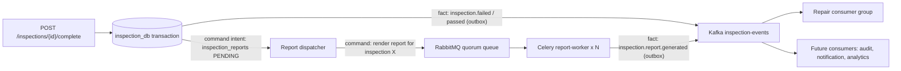
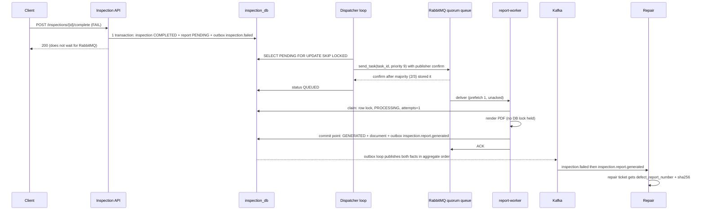
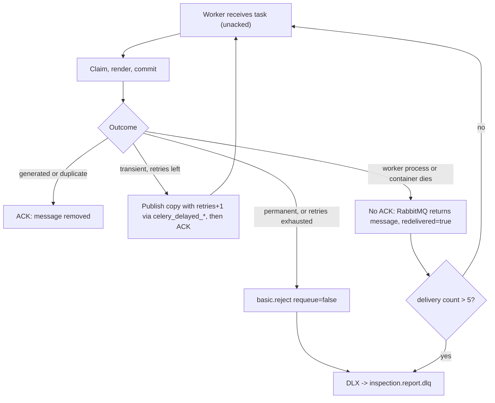

# RabbitMQ + Celery — Background Task Processing

[Mục lục](README.md) · [System Design](SYSTEM_DESIGN.md) · [Observability](OBSERVABILITY.md) · [Event Contracts](EVENT_CONTRACTS.md) · [API Contracts](API_CONTRACTS.md)

Tài liệu này mô tả **code đang chạy**: cụm RabbitMQ 3 node, quorum queue, Celery worker phát hành biên bản kiểm định, retry, DLQ, timeout, priority, metrics và các bài thử lỗi. Kafka giữ nguyên vai trò cũ; RabbitMQ chỉ được thêm cho một workload mà Kafka phục vụ kém.

## 1. Nghiệp vụ: phát hành biên bản kiểm định

Khi một inspection chuyển sang `COMPLETED`, trung tâm kiểm định phải phát hành **một tài liệu chính thức** cho đúng inspection đó:

| Kết quả | Tài liệu (`kind`) | Người dùng tài liệu | Priority |
|---|---|---|---|
| FAIL | `DEFECT_REPORT` — biên bản lỗi, ghi lỗi phát hiện, xe phải sửa trước khi lưu hành | Xưởng sửa chữa (Repair gắn số biên bản + SHA-256 vào repair ticket) | HIGH (AMQP 9) |
| PASS | `CERTIFICATE` — chứng nhận đạt | Chủ xe, lưu hồ sơ | NORMAL (AMQP 0) |

Nội dung lấy từ inspection, projection xe (VIN, hãng, model, năm, chủ xe) và projection bảo hành trong `inspection_db`. Kết quả là một file PDF thật (`GET /inspections/{id}/report.pdf`), lưu cùng `sha256`, `report_number` (`IR-YYYYMMDD-<8 ký tự inspection_id>`) trong bảng `inspection_reports`.

**Vì sao phải chạy nền, không làm trong `POST /inspections/{id}/complete`:**

- Render tài liệu tốn CPU và thời gian biến động (biên bản thật có ảnh, biểu đồ, font). Lab mô phỏng chi phí này bằng `REPORT_RENDER_COST_MS` (mặc định 300ms CPU thật, hashing); bản thân PDF của lab rất nhỏ. Để trong request, P95 của `complete` sẽ tăng theo tải render.
- Render phụ thuộc DB và (ở production) kho lưu trữ tài liệu: có lỗi tạm thời cần retry có backoff, có input hỏng không bao giờ render được.
- Mỗi inspection chỉ được có **đúng một** biên bản dù message bị giao lại.
- Throughput render phải tăng bằng cách thêm worker, độc lập với API.

## 2. WHY KAFKA HERE? WHY RABBITMQ HERE?

Hai hệ thống chở **hai loại message khác nhau** trong cùng một luồng. Không có message nào được publish vào cả hai.



[Xem SVG](diagrams/kafka-vs-rabbitmq-roles.svg)

### WHY KAFKA HERE?

- `inspection.failed` và `inspection.report.generated` là **sự thật đã xảy ra**. Repair (group `repair-service-v1`) đọc cả hai; ngày mai một service audit/notification có thể đọc cùng topic `inspection-events` bằng group riêng mà Inspection không phải sửa gì. RabbitMQ work queue giao mỗi message cho **một** consumer; muốn nhiều bên cùng nhận phải thêm exchange/queue cho từng bên và dữ liệu cũ không đọc lại được.
- Key Kafka là `vehicle_id` và outbox publish theo thứ tự aggregate, nên Repair luôn thấy `inspection.failed` (tạo repair) trước `inspection.report.generated` (gắn biên bản) của cùng xe. Thứ tự này là lý do handler gắn biên bản đơn giản.
- Kafka giữ lịch sử: có thể replay offset để dựng lại projection hoặc điều tra (xem [Dead Letter Topics](../README.md#21-dead-letter-topics)). Debezium CDC (`warranty-cdc.public.warranties`) cũng là stream sự thật, không phải việc cần làm.

### WHY RABBITMQ HERE?

- "Render biên bản cho inspection X" là **một việc cần làm đúng một lần** bởi một worker bất kỳ. Làm xong, không ai cần replay lệnh đó; sự thật sinh ra (`inspection.report.generated`) mới đi Kafka.
- Consumer Kafka của lab xử lý **một record tại một thời điểm trên mỗi partition** ([consumer.py](../common/platform_common/consumer.py)); `inspection-events` có 3 partition nên một group tối đa 3 worker song song. Một lần render 1–20s ở đầu partition chặn mọi event phía sau của các xe cùng partition (head-of-line blocking). Với RabbitMQ, số worker không bị giới hạn bởi partition: backlog demo scale 1 → 4 container; `prefetch=1` chia việc công bằng cho task dài.
- **ACK từng message.** Worker chết giữa lúc render thì RabbitMQ giao lại đúng task chưa ACK đó. Offset Kafka là vị trí: không thể commit message 7 khi message 6 còn đang render nếu không tự quản lý thêm.
- **Retry có delay, DLQ, giới hạn giao lại theo từng message** là tính năng broker: TTL + dead-letter exchange (Celery native delayed delivery), `x-delivery-limit` của quorum queue. Với Kafka, lab đã phải tự xây retry/DLQ topic.
- **Priority:** biên bản lỗi (xưởng đang chờ) được lấy trước chứng nhận PASS khi hàng đợi dồn. Kafka không có priority theo message.
- **Queue depth = số việc chưa làm** (ready/unacked), đúng câu hỏi "cần thêm worker không?". Kafka lag đo khoảng cách offset của một group.

## 3. Luồng xử lý



[Xem SVG](diagrams/report-task-lifecycle.svg)

Code: [InspectionService.complete](../services/inspection-service/app/services/inspections.py), [dispatcher.py](../services/inspection-service/app/reports/dispatcher.py), [tasks.py](../services/inspection-service/app/reports/tasks.py), [celery_app.py](../services/inspection-service/app/reports/celery_app.py), [Repair handler](../services/repair-service/app/messaging/handlers.py).

**Dispatcher = outbox cho command.** Transaction hoàn tất inspection không gọi RabbitMQ; nó chỉ chèn một dòng `inspection_reports` trạng thái `PENDING`. Vòng lặp dispatcher trong `inspection-service` publish dòng đó bằng Celery `send_task` với publisher confirm, rồi mới đánh dấu `QUEUED`. Vì vậy:

| Sự cố | Kết quả |
|---|---|
| API crash sau commit, trước publish | Dòng vẫn `PENDING`; dispatcher (kể cả replica khác) publish sau |
| Publish được confirm, crash trước khi ghi `QUEUED` | Publish lại cùng `task_id`; worker xử lý bản thứ hai như duplicate |
| RabbitMQ mất hẳn | `complete` vẫn 200; dòng `PENDING` tăng (`inspection_reports_open{status="PENDING"}`), dispatcher backoff 1s → 30s |

Trạng thái report: `PENDING → QUEUED → PROCESSING → GENERATED`, hoặc `RETRY_SCHEDULED` giữa các lần thử, `FAILED` khi task vào DLQ. Worker là container riêng `report-worker`, cùng image và codebase với Inspection (Inspection sở hữu `inspection_db` và biên bản), chạy `celery worker --pool prefork`.

## 4. Topology RabbitMQ

| Thành phần | Loại | Khai báo bởi | Ghi chú |
|---|---|---|---|
| `inspection.reports` | topic exchange | [init-topology.py](../infrastructure/rabbitmq/init-topology.py) + Celery | Topic vì Celery native delayed delivery định tuyến bằng routing key có tiền tố |
| `inspection.report.generate` | quorum queue, binding `report.generate` | init + Celery (x-arguments giống hệt) | Queue duy nhất của workload |
| `inspection.reports.dlx` → `inspection.report.dlq` | topic exchange → quorum queue, binding `#` | init | Nơi đỗ task hỏng |
| `celery_delayed_0..27`, `celery_delayed_delivery` | 28 quorum queue TTL 2^n giây + exchanges | Celery worker khi thấy quorum queue | Countdown của retry nằm trong RabbitMQ, không nằm trong RAM worker |
| Policy `inspection-report-work` | queue `inspection.report.generate` | init | `dead-letter-exchange`, `dead-letter-strategy: at-least-once`, `overflow: reject-publish`, `delivery-limit: 5` |
| Policy `inspection-report-dlq` | queue DLQ | init | `delivery-limit: -1` để xem DLQ (get + requeue) không bao giờ làm rơi message |

**Vì sao chỉ một queue:** hiện chỉ có một loại việc (render biên bản) với một hồ sơ tài nguyên. Tách `inspection.report.render` / `inspection.media.process` chỉ có ý nghĩa khi thêm workload khác CPU/RAM (ví dụ xử lý ảnh kiểm định) để scale worker pool riêng. Routing vẫn khai báo tường minh: `task_routes` gắn `inspection.generate_report` vào queue, `task_create_missing_queues=False` nên task không route được sẽ lỗi thay vì âm thầm tạo queue `celery` mặc định.

## 5. Cụm 3 node và quorum queue

- `rabbitmq-1..3` (RabbitMQ 4.3.6, Erlang 27) dùng chung Erlang cookie và tự join cluster qua `classic_config` peer discovery ([rabbitmq.conf](../infrastructure/rabbitmq/rabbitmq.conf)). `rabbitmq-init` chỉ thành công khi API thấy đủ 3 node `running`. Metadata (queue, policy, user) dùng Khepri — cũng là Raft, cần đa số node để thay đổi.
- `cluster_partition_handling = pause_minority`: phía thiểu số khi bị chia mạng ngừng phục vụ, client nối lại vào phía đa số.
- **Quorum queue** là queue được nhân bản bằng thuật toán Raft. Mỗi queue có 3 member trên 3 node: một **leader** nhận publish/giao message, hai **follower** nhận bản ghi log từ leader. Publish chỉ được confirm khi **đa số (2/3)** member đã ghi xuống đĩa, nên dispatcher chỉ đánh dấu `QUEUED` cho message đã an toàn trước khi mất một node. `queue_leader_locator = balanced` rải leader của các queue lên các node.
- **Node follower chết:** queue vẫn có leader + 1 follower = đa số, tiếp tục nhận và giao message; node quay lại tự bắt kịp log.
- **Node leader chết:** follower không nhận heartbeat, bầu leader mới trong vài giây; consumer nối tới node còn sống tiếp tục nhận; worker nối vào đúng node chết mất connection, message chưa ACK được trả về queue, Celery nối lại node khác theo danh sách failover `RABBITMQ_URLS`.
- **Hai node chết:** không còn đa số, queue không nhận publish. Dispatcher nhận lỗi, backoff, report nằm ở `PENDING` trong PostgreSQL — trễ, không mất.
- Priority: quorum queue có 2 mức, priority > 4 là high; consumer được giao high và normal theo tỉ lệ 2:1 nên certificate không bị đói hoàn toàn.

Xem trạng thái: `make rabbitmq-status` (leader, members, online, ready/unacked/consumers) hoặc `docker compose exec rabbitmq-1 rabbitmq-queues quorum_status inspection.report.generate`.

## 6. ACK, redelivery và timeout

Cấu hình trong [celery_app.py](../services/inspection-service/app/reports/celery_app.py): `task_acks_late=True`, `worker_prefetch_multiplier=1`, `task_reject_on_worker_lost=True`, `task_acks_on_failure_or_timeout=False`, `worker_cancel_long_running_tasks_on_connection_loss=True`.



[Xem SVG](diagrams/report-task-ack.svg)

- **ACK chỉ sau khi business effect đã commit.** Worker chết trước ACK (kill -9, OOM, mất mạng) thì message không mất: channel đóng, RabbitMQ đưa message về queue với cờ `redelivered`, worker khác nhận.
- **Soft time limit** (`REPORT_SOFT_TIME_LIMIT=20s`): Celery ném `SoftTimeLimitExceeded` trong task, transaction đang mở rollback, task đi nhánh retry với reason `timeout`.
- **Hard time limit** (`REPORT_TIME_LIMIT=30s`, phải lớn hơn soft): nếu code phớt lờ soft limit (vòng lặp C bị kẹt), Celery giết process con và thay process mới; message bị reject với `requeue=true` nên được giao lại. Một task luôn treo sẽ không lặp vô hạn: khi số lần bị trả lại vượt `delivery-limit: 5` của policy (đo được `x-delivery-count=6`), quorum queue dead-letter nó với lý do `delivery_limit`.

## 7. Idempotency: at-least-once delivery, exactly-once effect

Message có thể đến hơn một lần: worker chết trước ACK, dispatcher publish lại, operator replay DLQ. Chống trùng dựa trên **business key**, không dựa trên việc broker giao đúng một lần:

1. `inspection_reports.inspection_id` UNIQUE: một inspection có tối đa một dòng report.
2. Claim là transaction ngắn; render diễn ra **không** giữ lock DB.
3. **Commit point** khóa lại dòng (`SELECT … FOR UPDATE`); nếu đã `GENERATED` thì trả `duplicate`. Chỉ lần giao thắng mới lưu PDF và thêm outbox `inspection.report.generated` trong cùng transaction.
4. PDF là hàm tất định của dữ liệu inspection: hai lần render cho ra cùng bytes và cùng SHA-256.
5. `task_id` ổn định qua publish lại, retry và redelivery — dùng để tìm log, không dùng làm khóa chống trùng.

Hai worker có thể cùng render một inspection (tốn CPU), nhưng chỉ một lần commit: không có biên bản thứ hai, không có event thứ hai, Repair không bị cập nhật hai lần (Repair còn có ledger `processed_events`). Test: [test_reports.py](../services/inspection-service/tests/test_reports.py) chạy hai lần giao đồng thời và một lần redelivery.

## 8. Retry, DLQ và priority

| Lỗi | Ví dụ | Hành vi |
|---|---|---|
| Permanent | `inspection_id` không hợp lệ, không có dòng report, inspection chưa COMPLETED | `Reject(requeue=False)` → DLQ ngay, không retry, report `FAILED` |
| Transient | DB/pool lỗi, dependency lỗi, soft timeout, lỗi không phân loại | Retry tối đa `REPORT_MAX_RETRIES=3`, backoff `2·2^n` giây ±20% jitter, trần 60s |
| Hết retry | Lỗi tạm thời kéo dài qua 4 lần thử | Report `FAILED` + `last_error`, reject → DLQ |

Retry dùng `self.retry(countdown=…)`. Vì queue là quorum, Celery 5.6 gửi bản sao vào chuỗi `celery_delayed_27 … celery_delayed_0` (mỗi tầng TTL 2^n giây, dead-letter xuống tầng dưới) rồi quay lại `inspection.report.generate`. Countdown nằm trong RabbitMQ nên worker restart không làm mất lịch retry. Jitter tránh hàng loạt task cùng retry sau một sự cố chung.

**Thông tin trong DLQ:** header Celery `id` (task id), `task` (task type), `retries`, `kwargsrepr` (`inspection_id`), header broker `x-death` (queue nguồn, `reason` = `rejected`/`delivery_limit`, thời điểm, số lần) và `x-delivery-count`. Lý do lỗi dạng chữ nằm ở `inspection_reports.last_error` và log JSON `report_task_dead_lettered`. `make report-dlq` ghép hai nguồn:

```sh
make report-dlq                    # task id, type, inspection_id, retries, reason, time, last_error
make report-replay LIMIT=10        # publish lại (retries=0), ACK DLQ sau confirm, report FAILED -> QUEUED
make report-drill FAULT=transient  # task luôn lỗi tạm thời: retry x3 -> DLQ
make report-drill                  # input không hợp lệ: DLQ ngay
```

**Priority có lý do nghiệp vụ:** biên bản lỗi là đầu vào để xưởng mở phiếu sửa và giữ xe không lưu hành; chứng nhận PASS chỉ lưu hồ sơ. Dispatcher cũng lấy `PENDING` theo priority trước. Metric `background_task_queue_wait_seconds{priority}` cho thấy chênh lệch khi có backlog.

## 9. Scale worker

```sh
make workers-scale N=4                               # = docker compose up -d --no-deps --wait --scale report-worker=4 report-worker
REPORT_WORKER_CONCURRENCY=2 make workers-scale N=2   # 2 container x 2 process
```

Mỗi container là một Celery worker prefork, mặc định `concurrency=1`, 2 replica. Consumers của queue = container × concurrency. `worker_prefetch_multiplier=1` + `acks_late` nghĩa là mỗi process chỉ giữ đúng task đang làm; worker mới vào nhận việc ngay thay vì chờ worker cũ nhả hàng đã prefetch.

## 10. Quan sát

**Management UI** (user `lab` / `lab_rabbitmq_password`, đổi trong `.env`): [rabbitmq-1](http://localhost:15672), [rabbitmq-2](http://localhost:15673), [rabbitmq-3](http://localhost:15674) — mỗi node một port để UI vẫn mở được khi một node dừng.

| Muốn xem | Ở đâu trong UI |
|---|---|
| Nodes, memory/disk alarm, fd | Overview → Nodes |
| Exchanges, bindings | Exchanges → `inspection.reports` / `inspection.reports.dlx` |
| Queue depth, ready, unacked, message rates | Queues → `inspection.report.generate` |
| Leader, members, online | Queues → queue → Details (Leader, Online, Members) |
| Consumers (worker processes), prefetch | Queues → queue → Consumers; hoặc Channels |
| Retry đang chờ | Queues → `celery_delayed_*` |
| Task hỏng | Queues → `inspection.report.dlq` → Get messages (xem header `x-death`) |

**Prometheus** (plugin `rabbitmq_prometheus`, port 15692):

| Job | Nguồn | Nội dung |
|---|---|---|
| `rabbitmq` | `/metrics` trên 3 node | Node up, connections, channels, consumers, publish/deliver/ack/redeliver, dead-letter, memory, disk, fd, Erlang ports, alarms |
| `rabbitmq-queues` | `/metrics/detailed?family=queue_coarse_metrics&family=queue_consumer_count` | `rabbitmq_detailed_queue_messages{,_ready,_unacked}`, `_consumers`, `_info{membership}` theo queue. Chỉ node giữ leader báo số liệu của queue, nên `sum by(queue)` không đếm trùng |
| `report-worker` | DNS SD `report-worker:9808` | Metrics Celery tự đo (prefork multiprocess); `up` = worker online/offline |

Tên metric lấy từ endpoint thật của RabbitMQ 4.3.6. Hai giới hạn của phiên bản này: không có counter publish/deliver **theo queue** (chỉ theo node, tổng mọi queue — gồm cả các bước qua `celery_delayed_*`), và không có gauge socket riêng — dashboard dùng `erlang_vm_ports / erlang_vm_port_limit` (mỗi socket TCP là một Erlang port).

Metrics của worker ([worker_metrics.py](../services/inspection-service/app/reports/worker_metrics.py)) và dispatcher, labels `service`, `task_type`, `queue` (+ `outcome`/`reason`/`priority`/`status`); không bao giờ có `task_id`, `inspection_id`, `vehicle_id`:

| Metric | Ý nghĩa |
|---|---|
| `background_tasks_submitted_total` | Publish được RabbitMQ confirm (inspection-service) |
| `background_task_dispatch_failures_total` | Publish không được confirm |
| `background_tasks_started_total` | Lần thực thi (kể cả retry, redelivery) |
| `background_tasks_completed_total{outcome=generated\|duplicate}` | Hoàn tất; `duplicate` = redelivery bị idempotency hấp thụ |
| `background_tasks_failed_total{reason=permanent\|retries_exhausted}` | Vào DLQ |
| `background_tasks_retried_total{reason=timeout\|database\|dependency\|unexpected}` | Retry đã lên lịch |
| `background_tasks_redelivered_total` | Message có cờ `redelivered` |
| `background_tasks_active` | Task đang chạy |
| `background_task_duration_seconds{outcome}` | Thời gian thực thi |
| `background_task_queue_wait_seconds{priority}` | Từ lúc dispatch tới lúc bắt đầu (lần thử đầu) |
| `inspection_reports_open{status}` | Dòng chưa GENERATED trong `inspection_db` |

**Grafana** → dashboard **RabbitMQ / Background Tasks** (`lab-rabbitmq`, 33 panels): cluster (node up, số node, peer unreachable, leader, connections, channels, consumers), queues (depth, ready, unacked, retry đang chờ, publish/deliver/ack/redelivery, dead-letter theo lý do), tài nguyên (memory/high watermark, disk, fd, Erlang ports, alarms), Celery (workers online, active, submitted/started, completed, failed, retries, redeliveries, P95 duration, queue wait theo priority, DLQ, report rows). **System Overview** thêm RabbitMQ Queue Depth, Celery Active Tasks, Task Failure Rate, Background Task P95 Duration.

Alerts ([rules/lab.yml](../monitoring/prometheus/rules/lab.yml)): `RabbitMQNodeDown`, `RabbitMQPeerUnreachable`, `RabbitMQResourceAlarm`, `ReportQueueBacklogHigh`, `ReportTasksDeadLettered`, `ReportWorkersDown`, `ReportDispatchBacklog`.

## 11. Bài thử lỗi

Tự động: `make rabbitmq-drills` ([rabbitmq_drills.sh](../scripts/rabbitmq_drills.sh), probe [rabbitmq_probe.py](../scripts/rabbitmq_probe.py)) chạy lần lượt 7 case, khôi phục node/worker/traffic khi kết thúc và ghi JSON vào `artifacts/rabbitmq/drills-*`. Mỗi case đọc đồng thời Management API, Prometheus và `inspection_db`.

| Case | Thao tác (lệnh thủ công tương đương) | Quan sát | Kết quả chạy thật 2026-09-30 |
|---|---|---|---|
| 1. Dừng một node | `docker compose stop rabbitmq-3` (follower của work queue) | `make rabbitmq-status`: node DOWN, `online` 2/3; UI Overview; Grafana Node Up, Unreachable Cluster Peers | Queue vẫn có leader, 48 biên bản được tạo trong 30s node dừng; node start lại tự rejoin, `online` 3/3 |
| 2. Dừng leader của queue | Lấy leader từ `make rabbitmq-status`, `docker compose kill rabbitmq-2` | Leader đổi (panel Queue Leader Node), consumers về lại, Completed Tasks/sec | Leader `rabbitmq-2` → `rabbitmq-1`: thấy leader mới sau 1.8s, 2 consumer nối lại sau 5.2s, biên bản mới được tạo sau 6.4s; node cũ quay lại làm follower |
| 3. Kill worker giữa task | `REPORT_RENDER_COST_MS=15000 make workers-scale N=1`, đợi report `PROCESSING`, `docker compose kill -s SIGKILL report-worker`, `make workers-scale N=1` | Unacked → ready → giao lại (`redelivered`), `GET /inspections/{id}/report` | Worker `c67…` chết ở attempt 1; worker mới nhận lại, `attempts=2`, **một** PDF, **một** event `inspection.report.generated`; counter broker `rabbitmq_global_messages_redelivered_total` tăng |
| 4. Dừng toàn bộ worker | `docker compose stop report-worker` (traffic vẫn chạy) | Queue Depth, Consumers = 0, ReportWorkersDown | Depth 0 → 150 trong 60s, 0 consumer; API complete vẫn 200 |
| 5. Start worker lại | `make workers-scale N=1` | Depth giảm khi capacity > tốc độ đến | Với 1 worker chậm (1000ms) và traffic 35 req/s: 0.97 biên bản/s, chưa đủ; xem case 6 |
| 6. Scale 1 → 4 | `make workers-scale N=4` | Consumers by Queue 1 → 4, Completed/sec, CPU | Throughput 0.97/s → 3.85/s; depth 276 → 211 trong 60s dù traffic không đổi |
| 7. Task luôn lỗi | `make report-drill FAULT=transient`; `make report-drill` (input sai) | Log `report_task_retry_scheduled` attempt 1, 2, 3 rồi `report_task_dead_lettered` attempt 4; `celery_delayed_*`; DLQ Depth; `make report-dlq` | Transient: retry ×3 (~2s, 4s, 8s) → DLQ `retries=3`, `reason=rejected`. Invalid: DLQ ngay, `retries=0` |

Timeout cũng đã chạy thật: `make report-drill FAULT=hang` — soft limit 20s → retry sau 2s, 4s, 9s → lần 4 `retries_exhausted` → DLQ (`reason=rejected`). `make report-drill FAULT=stuck` (phớt lờ soft limit) — Celery báo `Hard time limit (30s) exceeded`, giết process con, message được giao lại; quorum queue dead-letter nó với `reason=delivery_limit`, `x-delivery-count=6` (vượt `delivery-limit: 5`). Không có vòng lặp vô hạn.

Evidence: `artifacts/rabbitmq/drills-20260930-201958/` (baseline, case1…case7 JSON, danh sách DLQ).

## 12. Backlog demo (bắt buộc)

```sh
make task-backlog-demo
# Tuỳ chỉnh: BACKLOG_RENDER_COST_MS=1000 BACKLOG_TRAFFIC_RPS=35 BACKLOG_GROW_SECONDS=90 BACKLOG_DRAIN_SECONDS=120
```

Kịch bản ([task_backlog_demo.sh](../scripts/task_backlog_demo.sh)): 1 worker, concurrency 1, 1000ms mỗi biên bản (~1 task/s); traffic generator đặt 35 HTTP req/s bằng `traffic_generator.control` (~2.8 inspection hoàn tất/s, mỗi cái sinh một task) → queue depth tăng. Sau đó scale lên 4 worker với **cùng** traffic → throughput ~4 task/s vượt tốc độ đến, depth giảm. Script khẳng định: depth tăng, rồi giảm, throughput tăng ≥2 lần; khôi phục traffic và số worker khi thoát.

Kết quả chạy thật ngày 2026-09-30 (8 CPU, 16 GB cho Docker; evidence `artifacts/rabbitmq/backlog-20260930-201128/`):

| Pha | Worker | Traffic | Depth (ready + unacked) | Throughput biên bản |
|---|---|---|---|---|
| Growing, 90s | 1 × concurrency 1, 1000ms/biên bản | 35 req/s ≈ 2.8 task/s | 8 → 165 (+1.75/s) | 0.98/s |
| Draining, 130s | 4 × concurrency 1, 1000ms/biên bản | giữ nguyên | 181 → 52 (−1/s) | 3.87/s |

Queue wait P95 trong backlog: **4.5s cho DEFECT_REPORT (high)** so với **62s cho CERTIFICATE (normal)** — priority của quorum queue đưa biên bản lỗi lên trước mà không bỏ đói chứng nhận. Lần chạy đầu với 60 req/s (≈4.7 task/s) cho thấy 4 worker (3.87/s) vẫn **không** theo kịp: depth tiếp tục tăng 372 → 466. Scale đúng mức phải dựa trên tốc độ đến đo được, không phải số worker cố định.

Trên Grafana (RabbitMQ / Background Tasks): **Queue Depth** và **Ready Messages** đi lên rồi xuống, **Consumers by Queue** 1 → 4, **Completed Tasks/sec** tăng, **Queue Wait P95 by Priority** cho thấy high thấp hơn normal; **System Overview → RabbitMQ Queue Depth** thấy cùng backlog.

## 13. Cấu hình

| Biến | Default | Ý nghĩa |
|---|---|---|
| `RABBITMQ_USER` / `RABBITMQ_PASSWORD` | `lab` / `lab_rabbitmq_password` | User quản trị tạo ở lần boot đầu (đổi sau đó cần `rabbitmqctl change_password`) |
| `RABBITMQ_ERLANG_COOKIE` | `vehicle-lab-rabbitmq-cookie` | Chung cho 3 node và CLI |
| `RABBITMQ_UI_PORT[_2,_3]` | 15672 / 15673 / 15674 | Management UI mỗi node, chỉ bind 127.0.0.1 |
| `RABBITMQ_HEARTBEAT` | 10 | Giây; phát hiện connection chết nhanh để redelivery sớm |
| `REPORT_WORKER_CONCURRENCY` | 1 | Process mỗi container |
| `REPORT_RENDER_COST_MS` | 300 | Chi phí CPU mô phỏng mỗi biên bản |
| `REPORT_MAX_RETRIES` | 3 | Retry sau lần thử đầu |
| `REPORT_RETRY_BASE_SECONDS` / `_MAX_SECONDS` | 2 / 60 | Backoff mũ ±20% |
| `REPORT_SOFT_TIME_LIMIT` / `REPORT_TIME_LIMIT` | 20 / 30 | Soft → retry; hard → kill process, redelivery |
| `REPORT_DELIVERY_LIMIT` | 5 | Số lần giao lại trước khi dead-letter (policy) |
| `REPORT_DISPATCH_INTERVAL` / `_BATCH` | 0.5 / 20 | Chu kỳ và kích thước lô của dispatcher |

## 14. Giới hạn

- Inspection hoàn tất trước bản phát hành này không có biên bản (migration không backfill). `GET /inspections/{id}/report` trả 404 `report_not_found` cho chúng.
- PDF lưu trong PostgreSQL (`BYTEA`, ~1KB). Production nên đưa file vào object storage và chỉ lưu khóa + SHA-256.
- Task bị dead-letter vì `delivery_limit` (process bị giết liên tục) không kịp ghi `FAILED`; dòng report ở `PROCESSING`. `make report-dlq` vẫn thấy nó, `make report-replay` đưa lại vào queue.
- Repair bỏ qua `inspection.report.generated` nếu repair chưa tồn tại (ví dụ `inspection.failed` đang nằm trong DLT của Kafka); replay DLT sau đó không tự gắn lại biên bản.
- Không có Celery result backend và không bật Celery events/Flower: trạng thái nghiệp vụ nằm ở `inspection_reports`, quan sát task qua Prometheus, log JSON và Management UI.
