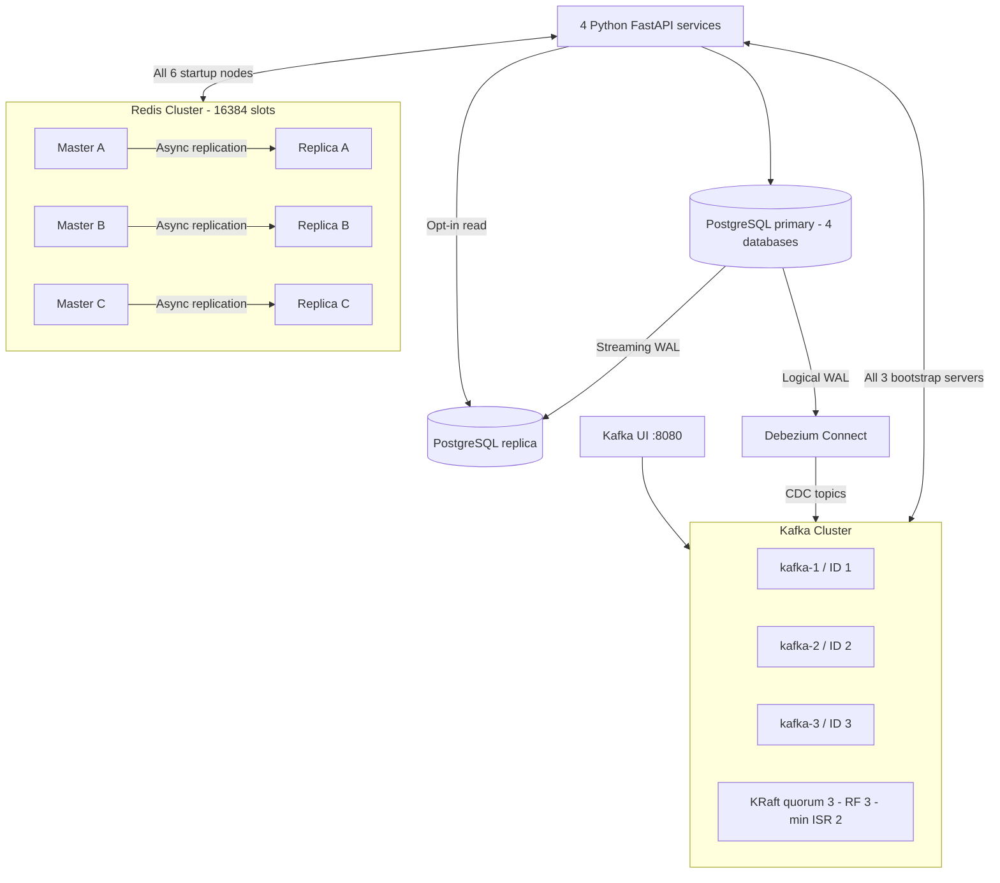
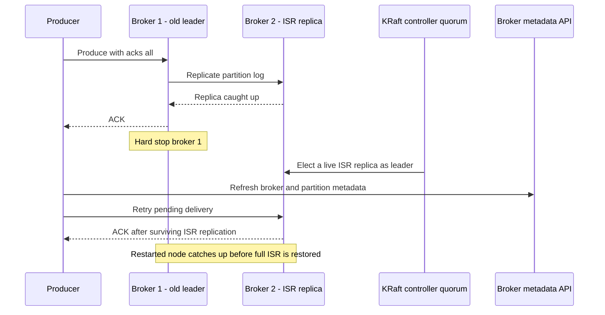
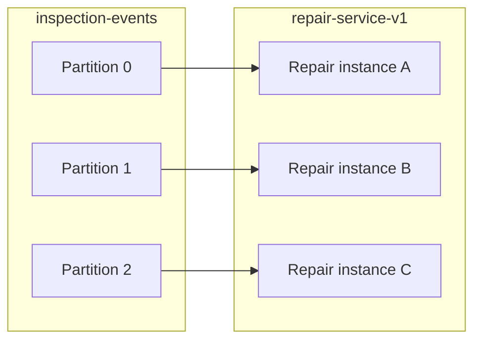
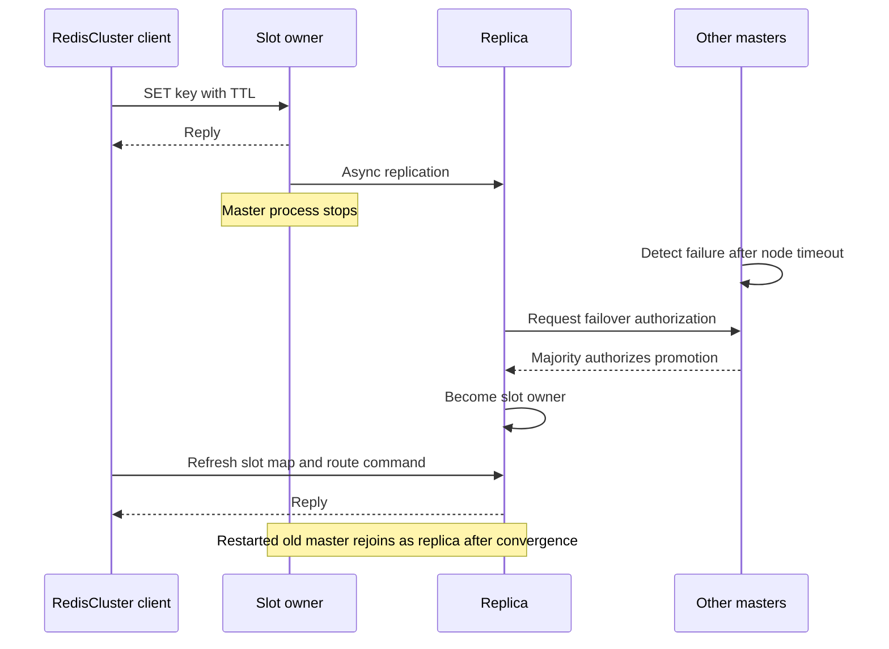

# Kafka và Redis Cluster — System Design và thực hành

[Mục lục](README.md) · [System Design](SYSTEM_DESIGN.md) · [Runbook](OPERATIONS.md) · [Consistency](CONSISTENCY_AND_FAILURES.md)

## 1. Topology đang triển khai

Đúng bốn application nghiệp vụ. Hạ tầng có PostgreSQL primary–replica, Debezium Connect, ba Kafka broker/controller, sáu Redis node, Kafka UI và các init jobs. [PostgreSQL & CDC](POSTGRESQL_CDC.md) mô tả database layer hiện tại. Các service dùng danh sách bootstrap/startup nodes đầy đủ. Không có ZooKeeper, Sentinel hoặc Redis standalone trong Compose hiện tại.



[Xem SVG](diagrams/clustered-infrastructure.svg)

Master A/B/C là vai trò, không cố định tên container sau failover. Trên cluster mới, redis-cli chọn ba master và gán một replica cho mỗi master. Xem `CLUSTER NODES` để biết cặp thực tế; không suy ra redis-4 luôn là replica của redis-1.

Docker host hiện được kiểm thử với 8 GB RAM/8 CPU; đây là cấu hình môi trường kiểm thử, không phải kết quả capacity benchmark. Mỗi broker có heap tối đa 384 MB mặc định. Mỗi Redis node có volume riêng, AOF `everysec` và `nodes.conf` trong `/data`. Mỗi Kafka node cũng có volume riêng. PostgreSQL volume cũ được giữ nguyên khi nâng cấp.

## 2. Kafka KRaft, replication và quorum

Ba node cùng `CLUSTER_ID`, mỗi node ID khác nhau. Mỗi node chạy `process.roles=broker,controller`, voters `1@kafka-1:9093,2@kafka-2:9093,3@kafka-3:9093`. Đây là static KRaft quorum của Kafka 3.9.1. Một controller active điều phối metadata; hai controller còn lại theo dõi log metadata. Broker partition leader là vai trò khác controller leader.

Khi tìm **active KRaft controller**, dùng `kafka-metadata-quorum.sh describe --status` và trường `LeaderId`. `controller_id` của MetadataResponse/aiokafka describe_cluster có thể là một broker sống được chọn để forward admin requests, không phải bằng chứng về Raft leader. [Kafka metadata cache](https://apache.googlesource.com/kafka/+/7ef5e8b022ce27dd30012a3fdd4a12a076facade/core/src/main/scala/kafka/server/metadata/KRaftMetadataCache.scala).

Combined mode giảm số container cho lab. Node failure ảnh hưởng đồng thời một broker và một controller; cluster ba node còn khả dụng khi mất một node, với điều kiện các replica đã đồng bộ. Triển khai quan trọng nên tách controller và broker trên các fault domain khác nhau. [Kafka KRaft chính thức](https://kafka.apache.org/39/operations/kraft/).

| Thuộc tính | Cấu hình hiện tại | Ý nghĩa |
|---|---|---|
| Client/inter-broker listener | PLAINTEXT :9092 | Advertise từng hostname kafka-1/2/3, không advertise localhost |
| Controller listener | CONTROLLER :9093 | Riêng cho metadata quorum |
| Business và DLQ topics | ≥3 partitions, RF=3 | Mỗi partition có một bản trên mỗi broker |
| min.insync.replicas | 2 | Cần ít nhất hai ISR để ghi với acks=all |
| Unclean leader election | false | Không chọn replica ngoài ISR chỉ để tiếp tục ghi |
| Internal offsets topic | RF=3 | Consumer offsets có replication |
| Internal transaction-state topic | RF=3, min ISR=2 | Cấu hình độ bền dù lab không dùng Kafka transactions |
| Persistence | kafka-1-data, kafka-2-data, kafka-3-data | Không chia sẻ log directory giữa node |

ISR là tập replica đang theo kịp leader. `acks=all` đợi tất cả replica đang trong ISR, không phải một giá trị ACK cố định bằng 2; min ISR=2 là ngưỡng cho phép ghi. Mất hai broker khiến quorum không đủ và writes không được coi là thành công. Local HTTP mutation vẫn có thể commit PostgreSQL/outbox rồi chờ Kafka phục hồi. [Kafka broker configs](https://kafka.apache.org/39/configuration/broker-configs/).



[Xem SVG](diagrams/kafka-leader-failover.svg)

Sơ đồ lược bớt replica thứ ba. Metadata refresh đi qua broker API; application không truy cập controller listener.

### Producer và consumer

`KafkaPublisher` dùng `AIOKafkaProducer`, `enable_idempotence=True`, `acks="all"`, request timeout 10 giây và retry backoff 200 ms. Deadline ngoài cho producer startup và mỗi publish là 5 giây/bước; outbox retry giữ cùng event ID. Timeout có thể xảy ra sau khi broker đã nhận record, nên consumer ledger vẫn cần thiết.

Không gán các Java producer options như `retries` hoặc `delivery.timeout.ms` cho aiokafka vì API này không có các tham số đó. Khi bật idempotence, aiokafka không hết hạn batch chỉ vì `request_timeout_ms` đã qua; deadline asyncio giới hạn thời gian caller đợi, không chứng minh batch đã bị hủy. [aiokafka producer docs](https://aiokafka.readthedocs.io/en/stable/producer.html).

Consumer subscribe bằng cả ba bootstrap servers, manual commit và group ổn định. Poll getmany tối đa một record; start/fetch/commit có deadline 15s. Sau 15s poll rỗng, worker đối chiếu end offsets với position và recreate consumer nếu có backlog bị kẹt; idle topic không kích hoạt restart. Client ID có instance suffix để quan sát thành viên; consumer group name vẫn giữ nguyên để chia partitions và dùng cùng processed ledger.



[Xem SVG](diagrams/consumer-partition-rebalance.svg)

Đây là một assignment có thể xảy ra, không ghim partition vào container. Sau khi member rời/join, group rebalance lại. Trên topic ba partition, consumer thứ tư không có thêm partition để xử lý. Mỗi process hiện vẫn xử lý sequential; tăng replicas đồng thời tăng API/outbox tasks và DB pools.

## 3. Redis Cluster, hash slots và client

Redis chia key space thành 16.384 slots: `CRC16(key) mod 16384`, hoặc CRC16 phần nằm trong hash tag `{...}` nếu tag hợp lệ. Mỗi slot thuộc một master; replica giữ bản sao bất đồng bộ. Cluster client học slot map, gửi command đến owner và xử lý MOVED/ASK. [Redis Cluster specification](https://redis.io/docs/latest/operate/oss_and_stack/reference/cluster-spec/).

Client thực là `redis.asyncio.cluster.RedisCluster` của redis-py 6.2.0. Cả sáu hostname được đưa vào startup nodes; danh sách seed được giữ để discovery lại. Read mặc định tới primary; không bật replica reads. Socket timeout 0.5 giây, một retry có backoff, và `RedisSupport` áp deadline 2 giây cho mỗi thao tác gồm cả discovery/retry. [Source redis-py phiên bản sử dụng](https://github.com/redis/redis-py/blob/v6.2.0/redis/asyncio/cluster.py).

Các node có IP ổn định trên subnet Docker riêng `${REDIS_SUBNET_PREFIX:-172.29.86}.0/24`, từ `.11` đến `.16`. Điều này giữ địa chỉ gossip trong `nodes.conf` hợp lệ khi container được recreate. Đây là địa chỉ node, không phải mapping master cố định. Không publish Redis client/bus ports ra host; chạy redis-cli trong container/toolbox.

| Key | Ví dụ thật | Multi-key / atomicity |
|---|---|---|
| Vehicle cache | `vehicle:{a-vehicle-uuid}` | Hash tag là UUID |
| Cache generation | `vehicle:{a-vehicle-uuid}:generation` | Cùng slot với cache, ba Lua scripts chạy atomically |
| API idempotency | `idem:inspection-service:POST:/inspections:<sha256>` | GET/SET một key, có TTL; PostgreSQL reservation quyết định uniqueness |
| Lock | `lock:repair-service:repair:<inspection-id>` | SET NX EX một key, token UUID, Lua compare-and-delete |

Dấu ngoặc nhọn của hai cache keys là **ký tự thật**, không chỉ ký hiệu placeholder. UUID khác nhau phân phối sang nhiều slots; không đặt toàn bộ xe dưới một tag như `{vehicle}`. Idempotency result và lock không được thực hiện trong một multi-key Lua/transaction nên không cần chung slot. Xóa nhiều key ở các slot khác nhau phải chia theo slot hoặc từng key, kể cả trong tests.

### Initialization và persistence

`redis-cluster-init` chờ sáu PING healthchecks. Khi cả sáu node trống và chưa join, script chạy `redis-cli --cluster create ... --cluster-replicas 1 --cluster-yes`. Sau đó poll hữu hạn đến khi cả sáu node thấy state OK, đủ 16.384 slots, ba master, ba replica và ba replication links UP.

Nếu đã có cluster, init chỉ kiểm tra, không reset slots hoặc ép role trở về tên ban đầu. Partial/corrupt cluster không bị tự xóa; init fail rõ sau deadline để operator điều tra. Startup toàn stack cần đủ cluster init; hệ thống đã chạy vẫn có thể chịu một node failure. AOF everysec giảm mất dữ liệu khi restart nhưng không biến replication bất đồng bộ thành synchronous durability.

### Failover và correctness



[Xem SVG](diagrams/redis-master-failover.svg)

Node timeout là 5 giây; tổng thời gian phục hồi còn gồm detection, election, gossip, client refresh và retries. Không coi 5 giây là SLO. Một master và replica duy nhất của nó cùng mất sẽ làm slot range unavailable; với full coverage policy, cluster có thể từ chối cả key ngoài range đó.

- Cache: lỗi/timeout → đọc PostgreSQL; sau recovery client có thể fill cache lại. Invalidation thất bại hoặc bị mất do async replication có thể giữ stale cache đến TTL.
- Idempotency: Redis result/state là fast path; reservation + business write + response nằm cùng PostgreSQL transaction. Redis eviction/failover không tạo resource trùng.
- Lock: SET NX EX và Lua token check chống xóa lock của owner mới. Async failover có thể mất lock vừa ACK hoặc lease hết trước workflow kết thúc. Đây không phải fencing/Redlock; DB constraints/ledger tiếp tục bảo vệ invariant.

## 4. Chạy và quan sát

```sh
docker compose up --build -d --wait
make cluster-check
# Tám topics: >=3 partitions, mỗi partition replicas/ISR = 1,2,3
docker compose exec kafka-1 /opt/kafka/bin/kafka-topics.sh \
  --bootstrap-server kafka-1:9092,kafka-2:9092,kafka-3:9092 --describe
# Ba broker và controller quorum
docker compose exec kafka-1 /opt/kafka/bin/kafka-broker-api-versions.sh \
  --bootstrap-server kafka-1:9092,kafka-2:9092,kafka-3:9092
docker compose exec kafka-1 /opt/kafka/bin/kafka-metadata-quorum.sh \
  --bootstrap-server kafka-1:9092,kafka-2:9092,kafka-3:9092 describe --status
docker compose exec redis-1 redis-cli cluster info
docker compose exec redis-1 redis-cli cluster nodes
docker compose exec redis-1 redis-cli --cluster check redis-1:6379
```

Kafka UI tại [localhost:8080](http://localhost:8080) dùng cả ba bootstrap servers. Xem Brokers, Topics → Partitions (leader/replicas/ISR), Consumer Groups (members/lag), Messages. Không dùng Kafka bootstrap `localhost` từ toolbox/application.

## 5. Failure drills và scale

```sh
# Toàn bộ bài kiểm tra, có cleanup để start lại node khi lỗi
make cluster-test
# Hoặc không dùng Make
sh scripts/cluster_drills.sh
```

Drill xác định vai trò qua metadata hiện tại, giữ client kết nối trước khi hard-stop node, rồi kiểm:

1. Dừng node đang là Kafka active controller; chờ quorum/partition recovery và test publish/consume bằng cùng client instances.
2. Dừng leader của partition hiện tại; kiểm RF vẫn ba, live ISR còn hai; workflow Vehicle → Warranty → Inspection FAIL → Repair vẫn hoàn tất.
3. Start lại broker, chờ đủ ba ISR trên mọi business/DLQ partition.
4. Dừng một Redis replica; cluster vẫn phục vụ, cache/idempotency tiếp tục hoạt động.
5. Dừng một Redis master; xác minh replica của chính master đó được promote, key được route sang owner mới và API cache trở lại HIT.
6. Start node cũ, chờ 3 master + 3 replica và replication links phục hồi.
7. Scale Repair 1 → 3 → 1, kiểm ba partitions được assign độc quyền cho ba member rồi rebalance lại.

`stop -t 0` dùng SIGKILL khi chưa kịp shutdown và đánh dấu container stopped để restart policy không che mất outage. Scripts không chạy song song với tests/seed/fault drills khác. Probe Kafka còn ghi event kỹ thuật `repair.cluster_probe` vào repair-events (không phải business event mới). Chúng để lại dữ liệu mẫu và evidence JSON/log trong `artifacts/cluster-drills/<timestamp>/`, đồng thời trả Repair về một instance.

Thực hành thủ công khi chọn kafka-1:

```sh
docker compose stop -t 0 kafka-1
# Dùng node còn sống để inspect
docker compose exec kafka-2 /opt/kafka/bin/kafka-topics.sh \
  --bootstrap-server kafka-2:9092,kafka-3:9092 --describe --topic inspection-events
docker compose run --rm --no-deps toolbox python scripts/cluster_verify.py workflow
docker compose start kafka-1
make cluster-check
```

Để chắc chắn dừng đúng leader, chạy `docker compose run --rm --no-deps toolbox python scripts/cluster_verify.py select --kind kafka-leader` rồi dùng node được trả về. Với Redis dùng `--kind redis-master` hoặc `--kind redis-replica`; role thay đổi sau failover.

```sh
# Xem role trước khi dừng; ví dụ redis-1 đang là master
docker compose exec redis-2 redis-cli cluster nodes
docker compose stop -t 0 redis-1
docker compose exec redis-2 redis-cli cluster info
docker compose exec redis-2 redis-cli cluster nodes
docker compose run --rm --no-deps toolbox python scripts/cluster_verify.py workflow
docker compose start redis-1
make cluster-check
# Scale không restart dependencies/init jobs
docker compose up -d --no-deps --scale repair-service=3 repair-service
docker compose run --rm --no-deps toolbox python scripts/cluster_verify.py verify --members 3
docker compose exec kafka-2 /opt/kafka/bin/kafka-consumer-groups.sh \
  --bootstrap-server kafka-1:9092,kafka-2:9092,kafka-3:9092 \
  --describe --group repair-service-v1 --members --verbose
docker compose up -d --no-deps --scale repair-service=1 repair-service
```

Repair host ports dùng range 8004–8006 để ba instance không tranh một port. Ngay cả khi chỉ có một instance, Docker có thể cấp 8005 hoặc 8006; dùng `docker compose port --index 1 repair-service 8000` để lấy địa chỉ thật sau recreate/scale. Đây là port mapping cho lab, chưa có HTTP load balancer. Inspection đã có Nginx gateway ở host 8003; scale `inspection-service=3` không tranh port, Prometheus khám phá từng replica qua Docker DNS. Vehicle/Warranty giữ host port cố định; scale hai service này cần override port mapping. Trong Docker network, service discovery có thể trả nhiều địa chỉ Repair.

## 6. Giới hạn, nâng cấp từ lab cũ và phục hồi

HA trong bài này là chịu lỗi node/process trên **cùng một Docker host**. Không chịu được mất host, disk hoặc PostgreSQL primary chưa có automatic failover; không thay thế backup/PITR. Redis replication bất đồng bộ có cửa sổ mất write đã ACK. Kafka acks/ISR bảo vệ theo replication policy, không bảo vệ khỏi xóa volumes hoặc lỗi đồng thời mọi storage.

Compose hiện dùng các volume `kafka-{1,2,3}-data` và `redis-{1..6}-data`. Không mount chung volume standalone cũ vào nhiều node. Không chạy `down -v` để nâng cấp. `kafka-init` từ chối topic RF thấp/thiếu partitions; thay đổi replication/partition của một cluster có dữ liệu cần Kafka admin reassignment có chủ đích.

Lượt chuyển đổi workspace này đã dừng application để quiesce writers, xuất và nhập 441 Kafka records sang cluster mới, giữ key/value/partition/offset/timestamp, giữ PostgreSQL và các volume cũ. Consumer đọc lại từ earliest trên cluster mới, dùng durable ledger để skip đã xử lý. Redis cũ là cache nên được warm lại; không chuyển lock lease cũ sang cluster mới. Đây là migration cụ thể cho dataset hiện có, không phải công cụ live migration tổng quát. Xem [báo cáo kiểm chứng cluster](CLUSTER_VALIDATION.md) để biết các thao tác đã thực thi.

Khi restore Kafka từ snapshot/cluster khác, offset cũ trong DLQ hoặc group có thể không còn tương ứng; phải kiểm mapping. Khi restore PostgreSQL về trước, processed ledger cũng quay lại: Kafka replay sau đó có thể chạy lại side effect. Lập kế hoạch phối hợp recovery giữa DB, outbox và Kafka trước khi xóa dữ liệu.
