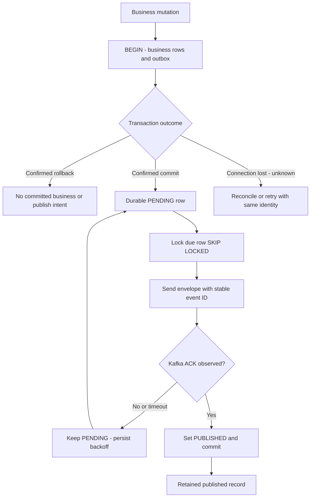
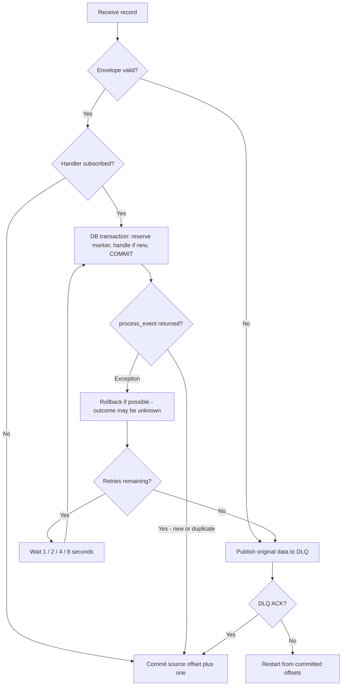
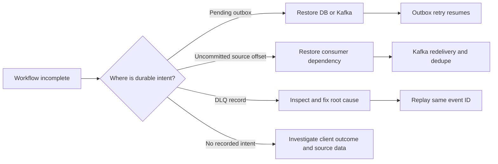

# Consistency, Reliability và Failure Design

[Mục lục](README.md) · [Luồng tương tác](REQUEST_FLOWS.md) · [Runbook](OPERATIONS.md)

## 1. Những invariant được bảo vệ

| Invariant | Lớp thực thi cuối cùng | Transaction liên quan |
|---|---|---|
| Một VIN chỉ có một vehicle | PostgreSQL unique vin | Vehicle + outbox |
| Một DEFAULT warranty/vehicle | Unique vehicle_id + warranty_type | REST provision: warranty + outbox, conflict trả row đã có |
| Một repair/inspection | Unique inspection_id | Marker hoặc API idempotency + repair + notification + outbox |
| Một notification/channel/repair | Unique repair_id + channel | Cùng repair creation |
| Event đã commit không chạy handler lần nữa cho cùng consumer_name | Processed PK event_id + consumer_name | Marker + business commit cùng nhau |
| API retry cùng ý định không tạo resource mới | Idempotency PK scope + key_hash | Reservation + action + response cùng nhau |
| Mutation phát event có durable publish intent | Outbox insert cùng business transaction | Không có direct DB-write-then-Kafka-send trong request |

SQL constraints không thể bảo vệ quy tắc chưa được encode. Ví dụ manual repair chưa xác minh inspection tồn tại/FAIL, repair row giữ warranty_id và coverage boolean nhưng chưa giữ toàn bộ response/thời điểm lookup, và notification FK không ép vehicle_id bằng vehicle_id của repair. Đây là giới hạn domain hiện tại.

## 2. Transactional outbox và các cửa sổ crash

[Xem sơ đồ SVG](diagrams/outbox-reliability.svg)

| Crash/failure point | DB/Kafka có thể chứa gì? | Recovery |
|---|---|---|
| Trước business commit | Chưa có committed mutation/outbox | Client retry; local transaction rollback |
| Sau business commit trước publisher | Business + PENDING row | Publisher đọc lại; không cần client phát event |
| Send lỗi trước broker nhận | PENDING, chưa có message | Retry theo next_attempt_at |
| Send timeout, broker có thể đã nhận | PENDING, kết quả gửi không chắc chắn | Retry cùng event ID; consumer dedupe |
| Kafka ACK xong, trước DB mark/commit | Message có trong Kafka, row còn PENDING | Có thể publish lại; delivery at-least-once |
| Sau mark/commit | Message ACKed, row PUBLISHED | Worker không publish row đó nữa |

Mất connection trong lúc COMMIT có thể khiến caller không biết DB đã commit hay chưa; không suy ra rollback chỉ từ HTTP 503. API idempotency/natural key và kiểm tra source of truth xử lý unknown outcome này. Tương tự, timeout chờ Kafka không chứng minh broker chưa nhận message. Vì vậy không tạo event ID mới khi retry. Outbox không xóa row vì vượt số attempt; exponential backoff cap 60 giây, có thể tiếp tục vô hạn cho đến khi operator sửa lỗi.

Worker giữ DB transaction/row lock khi chờ network ACK. Cách này đơn giản để claim atomically nhưng tiêu tốn connection và tăng thời gian lock. Nhiều worker dùng SKIP LOCKED; publisher này chưa có leasing table; Debezium chạy song song để capture bảng nghiệp vụ, không thay outbox publisher.

Source: [outbox.py](../common/platform_common/outbox.py), [kafka.py](../common/platform_common/kafka.py).

## 3. Idempotent consumer và offset discipline

[Xem sơ đồ SVG](diagrams/consumer-processing.svg)

Reservation thực hiện bằng INSERT ON CONFLICT DO NOTHING, không phải SELECT rồi INSERT. PostgreSQL unique key serialize hai transaction concurrent. Đặt marker vào cùng transaction làm cho handler rollback cũng rollback marker.

Nếu mất kết nối lúc COMMIT, caller có thể không biết transaction đã commit hay chưa. Retry vẫn giữ event ID: marker đã durable thì skip, nếu chưa thì xử lý lại. Khi hết retry budget, record có thể vào DLQ dù transaction cuối đã commit nhưng client không nhận xác nhận; replay cùng ID vẫn được ledger bảo vệ. Vì vậy có DLQ không tự chứng minh business effect chưa xảy ra.

Sau DB commit trước Kafka offset commit là cửa sổ duplicate có chủ đích. Consumer phát hiện marker, skip handler và commit lại offset. Nếu offset commit lỗi vì rebalance, worker đóng/recreate consumer; nó không giả định có quyền tiếp tục từ vị trí đã fetch.

`getmany(timeout_ms=1000,max_records=1)` sequential làm mỗi process xử lý từng record. Offset commit chỉ ghi partition của record hiện tại với offset+1; không commit bừa các partition đã prefetched. Consumer restart cũng là đường phục hồi khi gửi DLQ thất bại.

Consumer poll bằng getmany mỗi giây, có deadline 15s cho start/fetch/offset commit. Khi nhiều poll rỗng liên tiếp trong 15s, worker kiểm end offsets và position qua broker API: nếu có backlog nhưng fetch không tiến triển, nó recreate consumer từ committed offsets. Topic không có backlog hoặc member chưa có partition không bị restart chỉ vì idle. Handler và DB transaction không bị watchdog này cắt giữa chừng. Cơ chế này xử lý trường hợp heartbeat còn sống nhưng fetcher bị kẹt sau broker outage; `/ready` riêng lẻ không chứng minh consumer có tiến triển.

Processed ledger bảo vệ event ID trong một consumer namespace. Natural unique bảo vệ thêm “cùng nghiệp vụ, event ID khác”. Hai lớp không thay thế nhau: feature tương lai có side effect mới vẫn cần event dedupe dù business resource đã có unique key.

## 4. API idempotency và unknown outcome

Request có thể commit thành công nhưng client timeout trước khi nhận response. Để xử lý unknown outcome, client phải giữ cùng Idempotency-Key và payload khi retry POST inspection/repair.

Transaction giữ reservation, action và response snapshot. Redis processing/completed chỉ hỗ trợ fast path; khi Redis down, helper tiếp tục bằng PostgreSQL. Nếu action lỗi, không có durable reservation dở dang. Nếu cache result ghi thất bại sau commit, retry đọc ledger.

Lab chưa có retention job, tenant scope hoặc replay mọi loại response/header. API đang trả 201 cho create/replay; không cache lỗi 4xx/5xx thành durable completed result. Validation xảy ra trước helper, nên input chưa hợp lệ không “tiêu thụ” key trong DB.

## 5. Redis locks và fencing

Lock dùng SET NX EX với token UUID. Unlock Lua so sánh token trước DEL; worker cũ không xóa lock của worker mới sau khi lease cũ hết.

Lease 30 giây **không phải fencing token** cho PostgreSQL. Không có lock renewal hoặc monotonic fencing counter. Worker có thể chạy quá lease; correctness vẫn dựa vào DB uniqueness và processed/idempotency reservation. Lock release trong warranty/repair handler xảy ra trước outer DB commit; transaction khác có thể vào lock rồi chờ DB constraint.

Redis down khác lock busy: down → fallback constraints; lock busy ở repair creation → TransientError. Warranty REST provision và API idempotency helper tiếp tục serialize bằng DB uniqueness khi lock contention, để concurrent retry nhận cùng kết quả.

Redis Cluster dùng replication bất đồng bộ: failover có thể làm mất lock vừa được ACK, khiến hai worker cùng nghĩ mình giữ lease. Các DB invariants vẫn bắt buộc. Cache/generation dùng hash tag theo vehicle UUID để multi-key Lua không bị CROSSSLOT; failover mất một invalidation vẫn có thể trả stale đến TTL. Xem [thiết kế cluster](CLUSTER_INFRASTRUCTURE.md).

## 6. Cache consistency

Cache-aside GET lấy atomically value và generation, query DB khi miss, rồi chỉ SET nếu generation không đổi. PATCH commit DB/outbox xong mới INCR generation + DEL cache.

Ba giới hạn cần nhớ:

1. GET đang chạy có thể trả snapshot cũ đã đọc, dù late cache fill bị chặn.
2. Crash sau DB commit trước invalidation hoặc Redis down có thể giữ stale entry.
3. TTL 60 giây tính từ lúc entry được ghi, không phải một bằng chứng mọi read luôn mới trong 60 giây kể từ mọi mutation. Delayed readers, key reset hoặc thay đổi ngoài API cần được xét riêng.

Generation key không TTL. Redis AOF giúp persistence cache nhưng không biến cache thành source of truth. Không dùng cache vehicle để trả lời coverage.

## 7. Timeout và retry budgets

| Operation | Default | Giới hạn thực tế |
|---|---|---|
| DB pool acquire | 3s | SQLAlchemy pool wait; không phải toàn request deadline |
| DB connect | 3s | Connect attempt |
| DB statement | 10s | Một statement; không phải tổng transaction |
| Idle transaction | 30s | Có thể kết thúc transaction đang idle chờ dependency |
| Redis connect/socket | 0.5s | Mỗi operation có thể có chi phí connection/command |
| Redis operation | 2s | Bao cả slot discovery, command và client retries trong RedisSupport |
| HTTP connect | 1s | Giai đoạn connect |
| HTTP read/write/pool | 2s | Timeout theo phase, read timeout không phải tổng stream duration |
| Warranty lookup | 1 + 2 attempts | Backoff 0.2s, 0.4s |
| Consumer handler | 1 + 4 attempts | Backoff 1s, 2s, 4s, 8s |
| Kafka producer start/send | 5s cho mỗi bước | Lazy startup và send là hai timeout scope khác nhau |
| Kafka request / retry backoff | 10s / 200ms | aiokafka idempotent batch có thể tiếp tục sau deadline caller |
| Kafka consumer max poll interval | 300s | Phải cân với thời gian xử lý/retry và rebalance |

Ví dụ **ước tính cho read-timeout drill**, khi mỗi HTTP attempt dừng sau khoảng 2s: một coverage lookup khoảng `3 × 2 + 0.2 + 0.4 = 6.6s`; một consumer delivery thử năm lần khoảng `5 × 6.6 + 15 = 48s`, chưa tính DB/Redis/connection/DLQ.

Không dùng phép tính đó làm hard upper bound. Code chưa có overall wall-clock deadline bao toàn workflow; các phase timeout và network behavior khác nhau. Tăng HTTP_TIMEOUT/HTTP_RETRIES/CONSUMER_MAX_RETRIES có thể vượt lock lease, idle transaction timeout hoặc max poll interval. Tăng retries phải đi kèm đo pool occupancy và thời gian phục hồi, không chỉ tăng timeout.

HTTP wrapper hiện retry cả HTTPError/response validation error, kể cả unexpected 4xx sau raise_for_status. Consumer retry cả lỗi payload handler. Phân loại permanent/transient tinh hơn, jitter, circuit breaker và bulkhead là cải tiến chưa làm.

## 8. Failure matrix

| Failure | HTTP behavior | Async behavior | Bằng chứng cần xem |
|---|---|---|---|
| DB unavailable | Writes/list 503; cache HIT có thể trả 200 | Consumer rollback/retry rồi DLQ; outbox task chờ DB | readiness postgres, database_unavailable, pending rows sau phục hồi |
| Redis unavailable | Cache bypass; create idempotency dùng DB | Lock fallback constraints | cache_bypass, lock_bypass_using_database_constraints |
| Kafka unavailable sau startup | Local writes vẫn commit outbox; readiness 503 | Publisher/consumer reconnect; pending tăng | outbox attempts/age, Kafka health |
| Warranty unavailable | Repair create mới 503 | Retry, rollback marker, sau budget đi DLQ | warranty_http_retry, không có repair mới |
| Pool exhausted | 503 sau acquire timeout | Worker cũng tranh pool, lag có thể tăng | HTTP duration, DB sessions, pool drill |
| Event duplicate | Không có HTTP trực tiếp | Skip hoặc natural-key conflict handling | duplicate_event_skipped, row count |
| Poison event | Không có HTTP trực tiếp | Retry hoặc DLQ ngay tùy envelope/handler | original bytes, source offset, reason |
| Cache stale | GET có thể trả snapshot cũ | Không có background invalidation consumer | X-Cache, Redis TTL, DB row |

## 9. Recovery khác compensation

Kafka hoặc DB phục hồi có thể đủ để outbox tự tiếp tục; event đã sang DLQ cần operator replay sau khi sửa nguyên nhân. Không có job tự quét mọi inspection FAIL để tạo repair thiếu và không có distributed compensation xóa vehicle/warranty.

[Xem sơ đồ SVG](diagrams/recovery-strategy.svg)

Không reset offset hoặc xóa processed marker chỉ để “chạy lại cho chắc”. Reset offset có thể phát lại toàn partition; xóa marker có thể kích hoạt lại side effect. Dùng event/source identity, kiểm source of truth và chọn replay một record đã điều tra.

Source: [consumer](../common/platform_common/consumer.py), [idempotency](../common/platform_common/idempotency.py), [Redis](../common/platform_common/redis.py), [config](../common/platform_common/config.py). Lệnh thao tác cụ thể ở [Operations](OPERATIONS.md).

## PostgreSQL replica và CDC

Primary commit không đợi replica replay. Chỉ Vehicle GET opt-in `consistency=eventual` dùng reader pool; replica unavailable fallback SELECT primary, stale 404 giữ nguyên. Read replica không điền primary cache. Coverage, mutations, outbox và dedupe luôn dùng primary. Debezium CDC có checkpoint LSN riêng, có thể duplicate sau restart và phụ thuộc WAL còn được giữ. Xem [thiết kế và failure matrix](POSTGRESQL_CDC.md).
