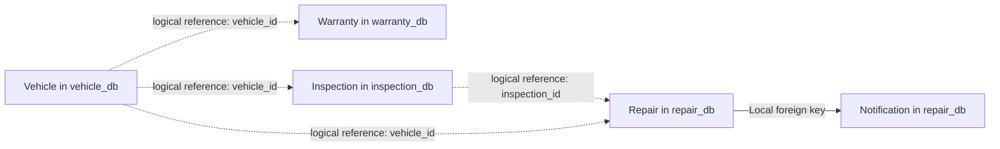
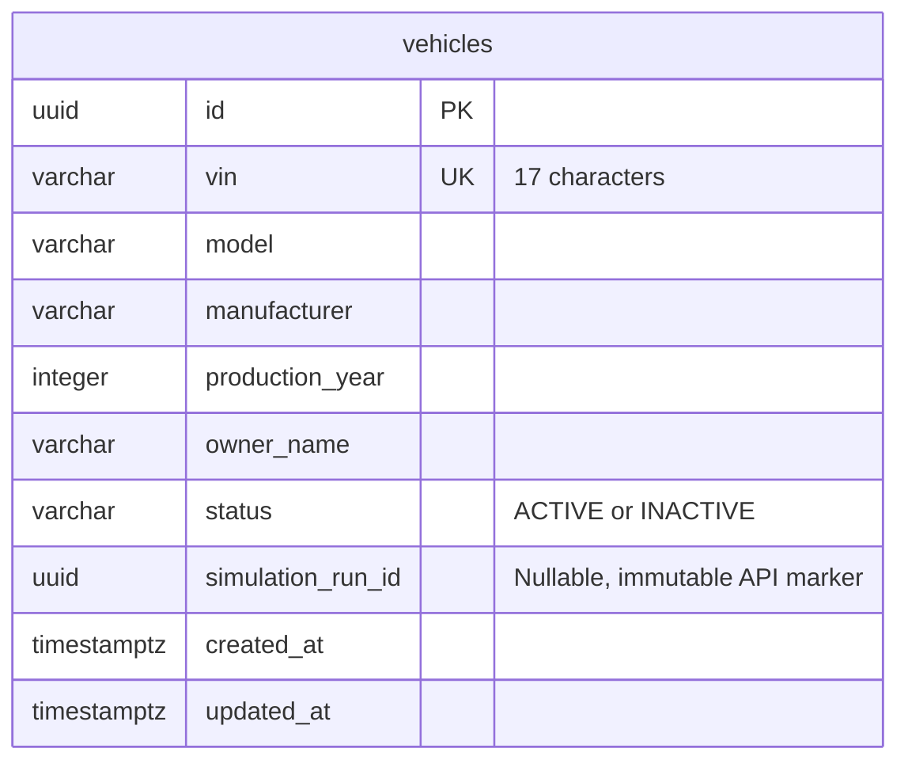
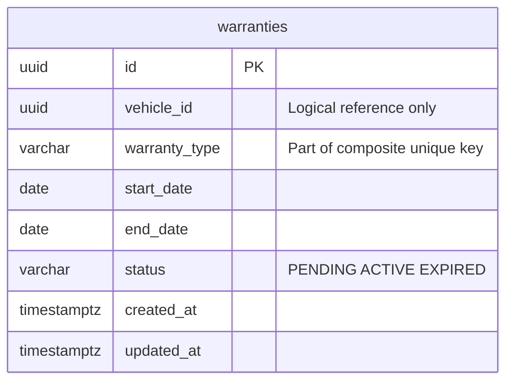
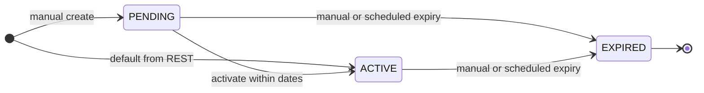
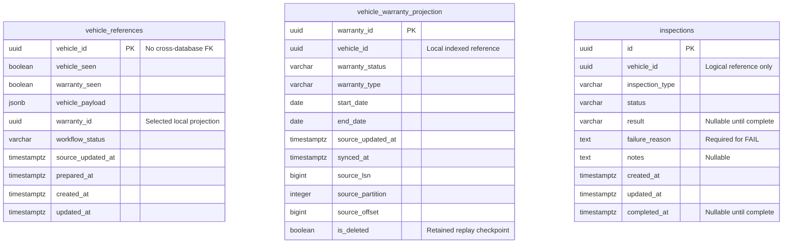
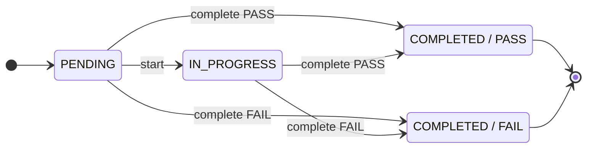
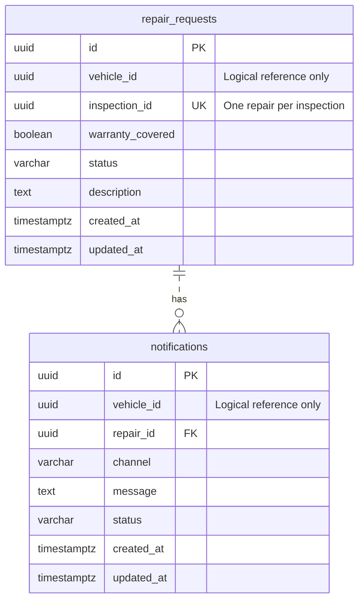
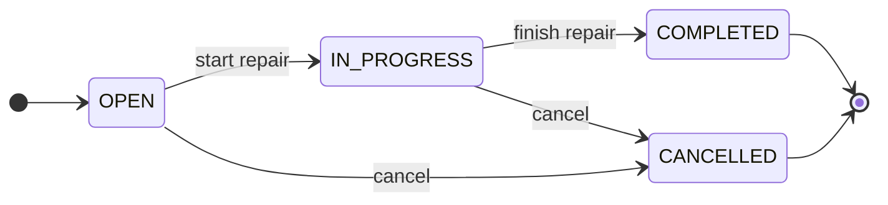
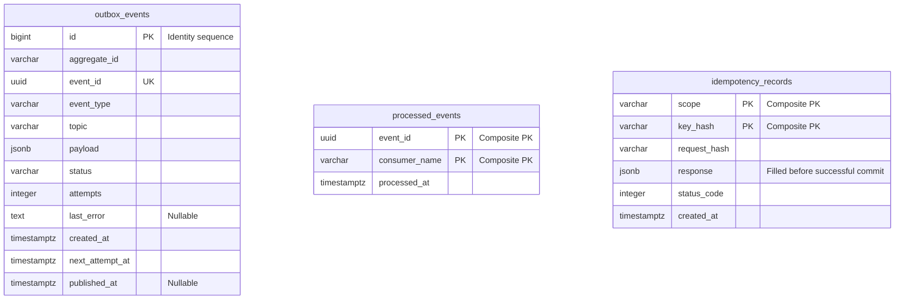

# Data Model và vòng đời nghiệp vụ

[Mục lục](README.md) · [API Contracts](API_CONTRACTS.md) · [Consistency](CONSISTENCY_AND_FAILURES.md)

## 1. Quyền sở hữu và quan hệ giữa domain



[Xem sơ đồ SVG](diagrams/domain-ownership.svg)

Nét đứt chỉ quan hệ nghiệp vụ. Không có foreign key, JOIN hoặc cascade giữa database. Mỗi service có Alembic history và credentials riêng. Quan hệ notification → repair là FK thực trong cùng database.

Tất cả business IDs là UUID do ứng dụng sinh. `created_at`, `updated_at`, `completed_at` dùng TIMESTAMPTZ; API serialize ISO 8601. `updated_at` được cập nhật bởi SQLAlchemy, không có PostgreSQL trigger: SQL thủ công muốn thay timestamp phải cập nhật rõ ràng.

## 2. Vehicle database



[Xem sơ đồ SVG](diagrams/vehicle-erd.svg)

| Field | Validation/constraint | Ý nghĩa |
|---|---|---|
| vin | API regex `^[A-HJ-NPR-Z0-9]{17}$`; DB unique, varchar(17) | Danh tính nghiệp vụ bất biến; không có API sửa VIN |
| model, manufacturer | API 1–100 ký tự, trim; DB NOT NULL | Thông tin xe |
| production_year | API và DB 1886–2100 | Năm sản xuất |
| owner_name | API 1–200 ký tự, trim; DB NOT NULL | Customer cơ bản của lab |
| status | Default ACTIVE; DB check ACTIVE/INACTIVE | Trạng thái record xe |
| simulation_run_id | Nullable UUID; API create có marker yêu cầu VIN TRF; PATCH không nhận field | Phạm vi xóa xe của traffic run |

`vehicles_vin_key` là unique constraint chống race giữa hai create request. `ix_vehicles_created(created_at,id)` hỗ trợ list ổn định. PATCH khóa row bằng FOR UPDATE, đổi dữ liệu và thêm vehicle.updated trong cùng transaction.

[Migration 0002](../services/vehicle-service/migrations/versions/0002_simulation_marker.py) thêm marker nullable, giữ dữ liệu hiện hữu. DELETE mô phỏng cần marker bằng run header, khóa row rồi xóa; references ở DB khác vẫn giữ lịch sử, không cascade. Unique VIN index cũng phục vụ exact-match lookup để reconcile create timeout.

**Giới hạn:** INACTIVE hiện không tự expire warranty hay chặn inspection/repair. Những policy này chưa được implement. API không kiểm VIN check digit theo quy định từng thị trường.

Source: [model](../services/vehicle-service/app/models/vehicle.py), [schema](../services/vehicle-service/app/schemas/vehicle.py), [migration](../services/vehicle-service/migrations/versions/0001_initial.py).

## 3. Warranty database



[Xem sơ đồ SVG](diagrams/warranty-erd.svg)

Unique key là **cặp** `(vehicle_id,warranty_type)`; từng cột riêng lẻ không unique. Mỗi xe có tối đa một DEFAULT, một EXTENDED và một POWERTRAIN theo API hiện tại. `end_date >= start_date` được kiểm ở API và DB.

| Loại | Nguồn tạo | Ngày bắt đầu/kết thúc | Trạng thái ban đầu |
|---|---|---|---|
| DEFAULT | vehicle.created handler | Ngày `event.occurred_at` → cộng DEFAULT_WARRANTY_DAYS | ACTIVE |
| EXTENDED/POWERTRAIN | POST /warranties | Do caller gửi; phải đã có warranty history của xe | PENDING |

`start_date/end_date` là date. Coverage xét ngày UTC hiện tại, inclusive cả hai đầu. DEFAULT cộng 1095 ngày là policy của lab, không phải phép cộng ba calendar years trong mọi năm nhuận.



[Xem sơ đồ SVG](diagrams/warranty-states.svg)

Activate chỉ hợp lệ từ PENDING khi ngày hiện tại trong khoảng bảo hành. Manual expire được gọi cả trước end_date. Worker expiry mỗi 30 giây khóa tối đa 100 row PENDING/ACTIVE có `end_date < today`, chuyển EXPIRED và enqueue event; backlog lớn có thể cần nhiều chu kỳ.

Gọi lại transition với cùng trạng thái trả resource hiện có, không tạo event thứ hai. EXPIRED không activate lại. Coverage kiểm cả ngày nên không phụ thuộc worker expiry chạy đúng ngay thời điểm chuyển ngày.

Indexes: unique `(vehicle_id,warranty_type)`; `ix_warranties_coverage(vehicle_id,status,start_date,end_date)`; `ix_warranties_expiry(status,end_date)`. Query hiện tại lấy warranty history của xe rồi lọc coverage trong Python; index coverage có prefix vehicle_id hỗ trợ lookup đó.

Source: [model](../services/warranty-service/app/models/warranty.py), [business rules](../services/warranty-service/app/services/warranties.py).

## 4. Inspection database



[Xem sơ đồ SVG](diagrams/inspection-erd.svg)

Không vẽ cạnh FK giữa hai bảng vì migration không tạo FK đó. Business layer kiểm cả vehicle_seen và warranty_seen/workflow_status=READY trước khi tạo inspection. Warranty projection đến từ CDC; READY không diễn tả coverage còn hiệu lực.

`inspection_type` qua API thuộc DELIVERY/PERIODIC/DIAGNOSTIC, default PERIODIC. Notes tối đa 4000 ký tự ở API; failure_reason 1–4000 và bắt buộc cho FAIL. DB dùng TEXT, vì vậy giới hạn độ dài tối đa nằm ở schema validation.

| Trạng thái | result | failure_reason | completed_at |
|---|---|---|---|
| PENDING/IN_PROGRESS | NULL | NULL | NULL |
| COMPLETED + PASS | PASS | NULL | NOT NULL |
| COMPLETED + FAIL | FAIL | NOT NULL, không rỗng/blank | NOT NULL |

Các quan hệ trong bảng trên được bảo vệ bởi check constraints. Index `(vehicle_id,created_at)` hỗ trợ truy vấn lịch sử xe. Completed inspection bất biến qua API; kiểm immutability ở business layer, không phải database trigger.



[Xem sơ đồ SVG](diagrams/inspection-states.svg)

PASSED/FAILED không phải giá trị status lưu DB; sơ đồ dùng hai trạng thái kết hợp `status + result` để thể hiện hai kết quả terminal. Complete cùng result/reason và notes tương thích trả kết quả đã có; đổi kết quả sau complete trả 409.

### inspection_reports

Một dòng cho mỗi inspection hoàn tất (UNIQUE `inspection_id`, FK tới `inspections` trong cùng database), tạo trong transaction complete và cũng là ý định task bền vững cho dispatcher RabbitMQ. Cột: `kind` (CERTIFICATE/DEFECT_REPORT), `priority` (AMQP 9/0), `status` (PENDING → QUEUED → PROCESSING → GENERATED, hoặc RETRY_SCHEDULED/FAILED), `task_id` (UNIQUE, ổn định qua mọi lần giao), `correlation_id`, `attempts`, `dispatch_attempts`, `next_dispatch_at`, các mốc `queued_at/started_at/generated_at/failed_at`, `worker`, `last_error`, `report_number`, `sha256`, `size_bytes`, `document` (BYTEA, deferred). CHECK bảo đảm `GENERATED` khi và chỉ khi có document + sha256 + generated_at. Partial index cho dòng PENDING (dispatcher) và dòng chưa GENERATED (metrics). Migration `0003` không backfill inspection cũ. Chi tiết luồng: [Background Tasks](BACKGROUND_TASKS.md).

Source: [model](../services/inspection-service/app/models/inspection.py), [projection handler](../services/inspection-service/app/messaging/handlers.py), [service](../services/inspection-service/app/services/inspections.py).

## 5. Repair database



[Xem sơ đồ SVG](diagrams/repair-erd.svg)

ERD thể hiện cardinality schema: repair có thể có 0..N notifications, mỗi notification thuộc đúng một repair. Service hiện tại tạo đúng một LOG notification cùng transaction với repair. Unique `(repair_id,channel)` giới hạn mỗi channel một record; không có FK nào ép một repair phải có notification hoặc ép hai vehicle_id bằng nhau. Business layer thực hiện invariant đó.

`warranty_covered` NOT NULL là snapshot. Khi Warranty unavailable, lab rollback creation, không lưu NULL hoặc tự chọn false. Repair đã lưu nullable warranty_id; chưa lưu checked_at/terms version nên chưa đủ cho audit claim production. `description` do API nhập hoặc lấy từ failure_reason của event.



[Xem sơ đồ SVG](diagrams/repair-states.svg)

Không được nhảy OPEN → COMPLETED, không reopen terminal state. PATCH cùng trạng thái vẫn thành công. Chỉ creation phát repair.created; PATCH repair hiện không phát repair.updated/completed.

Notification channel/status hiện là LOG/SIMULATED. Đây là record mô phỏng, không phải acknowledgement từ provider. `notification_staged` log có thể xuất hiện trước outer transaction commit.

Source: [model](../services/repair-service/app/models/repair.py), [transaction](../services/repair-service/app/services/repairs.py).

## 6. Infrastructure tables trong từng database



[Xem sơ đồ SVG](diagrams/messaging-tables-erd.svg)

Các bảng này không có FK với nhau. Event ID ở outbox nguồn và processed ledger downstream thuộc database khác nhau. `outbox_events.payload` chứa toàn bộ envelope; `id` chỉ phục vụ ordering/scan cục bộ, không phải Kafka offset. `aggregate_id` trong luồng hiện tại là vehicle ID cho cả bốn domain.

Outbox status PENDING/PUBLISHED, partial indexes trên pending `(next_attempt_at,id)` và `(aggregate_id,id)`. `attempts` đếm số publish attempt thất bại đã ghi lại, không phải số lần gửi thành công và không nhất thiết bao phủ crash trước DB commit.

Processed PK `(event_id,consumer_name)` giữ reservation chưa commit trong transaction rồi trở thành marker durable khi commit. Idempotency PK `(scope,key_hash)` giữ một payload hash và response snapshot; schema cho response nullable trong lúc xử lý nhưng application không commit reservation dở dang khi action lỗi.

`status_code` của idempotency ledger hiện mặc định 201; hai API consumer của helper đều là create trả 201. Helper hiện chỉ trả body, chưa tổng quát hóa replay mọi HTTP status/header.

Source: [models chung](../common/platform_common/models.py), [DDL v1](../common/platform_common/migration_v1.py).

## 7. Migrations, query và retention

Mỗi service chạy `alembic upgrade head` ở startup dưới PostgreSQL advisory lock. Application không dùng create_all khi startup; test fixture dùng schema tạm PostgreSQL riêng. Không chỉnh migration đã phát hành để triển khai feature mới; tạo revision kế tiếp.

```sh
docker compose exec vehicle-service alembic current
docker compose exec vehicle-service alembic check
docker compose exec postgres-primary psql -U platform_admin -d warranty_db \
  -c "SELECT status,count(*) FROM warranties GROUP BY status;"
```

Danh sách vehicle/inspection/repair dùng limit/offset. Query ordering có thêm ID để ổn định khi timestamp trùng. Index inspections/repairs chưa chứa ID trong khóa index; PostgreSQL có thể cần sort phần bổ sung. Chưa claim tất cả list query đều index-only hoặc phù hợp hàng triệu row.

Retention hiện tại: không có cleanup cho business history, outbox/processed/idempotency ledger hay Redis generation keys. Đề xuất production phải xác định thời gian client retry, Kafka replay/backup restore horizon và audit requirements trước khi archive/delete. Không dùng TTL Redis thay cho retention policy của durable ledger.

## Bổ sung cho REST và CDC

- vehicle_db có `warranty_provision_requests`: vehicle_id PK, correlation_id, status PENDING/DELIVERED, attempts, next_attempt_at, last_error, warranty_id, timestamps. Không FK sang warranty_db. Row được insert cùng vehicle/outbox; worker chỉ đánh dấu DELIVERED sau REST thành công.
- warranty_db thêm nullable correlation_id trên warranties để nối WAL row image về HTTP flow.
- inspection_db thêm `vehicle_warranty_projection`, vehicle_payload/status/prepared_at/warranty_id tại reference; inspection lưu warranty_id đã chọn lúc tạo. Projection checkpoint delete ngăn replay cũ làm sống lại row.
- repair_db thêm nullable warranty_id từ coverage REST. ID là tham chiếu logic; coverage owner vẫn là B.

Migrations additive: Vehicle 0003, các domain còn lại 0002; migration lock theo DB cho phép scale nhiều process cùng startup. Consumer group v2 đọc lại retained vehicle/CDC streams để xây projection mới; nếu topic lịch sử đã bị retention xóa, cần kế hoạch backfill/snapshot trước khi nâng cấp production.
