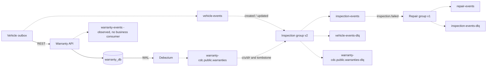

# Kafka Event Contracts

[Mục lục](README.md) · [Sequence diagrams](REQUEST_FLOWS.md) · [Retry và DLQ](CONSISTENCY_AND_FAILURES.md)

## 1. Topology và subscriptions



[Xem sơ đồ SVG](diagrams/event-topology.svg)

Group node bao gồm consumer và outbox task của service tương ứng. Inspection publish event khi client complete inspection, không publish chỉ vì projection được cập nhật.

| Topic | Producer | Consumer group | Event types được xử lý |
|---|---|---|---|
| vehicle-events | vehicle-service | inspection-service-v2 | vehicle.created, vehicle.updated |
| warranty-cdc.public.warranties | Debezium | inspection-service-v2 | CDC c/u/d/r, tombstone |
| warranty-events | warranty-service | Chưa có | Quan sát events |
| inspection-events | inspection-service | repair-service-v1 | inspection.failed |
| repair-events | repair-service | Chưa có | — |

Cả bốn topic nguồn và bốn topic `-dlq` có ba partitions, RF=3, min ISR=2, retention bảy ngày trong lab. `repair-events-dlq` được tạo sẵn nhưng chưa có consumer nguồn viết vào. Consumer bỏ qua event type hợp lệ không có handler; vẫn commit offset. Version/envelope validation xảy ra trước bước bỏ qua type.

## 2. Common envelope

```json
{
  "event_id": "e06d0aaf-c879-4d58-9260-d7082b4cb8ae",
  "event_type": "inspection.failed",
  "event_version": "1.0",
  "occurred_at": "2026-09-30T10:00:00Z",
  "producer": "inspection-service",
  "correlation_id": "583364bc-d7e5-4717-870f-1a682a7c3943",
  "data": {
    "inspection_id": "512ef7f4-a0ee-4b17-9de8-0165c9f6f322",
    "vehicle_id": "02fc3c76-9c9a-483c-bdc3-62b2be3608f0",
    "failure_reason": "Battery coolant leak",
    "occurred_at": "2026-09-30T09:59:59.999Z"
  }
}
```

| Field | Kiểu/validation hiện tại | Ý nghĩa |
|---|---|---|
| event_id | UUID | Danh tính sự kiện; giữ nguyên khi outbox retry/replay |
| event_type | String 1–100 | Điều hướng handler và chọn topic khi enqueue |
| event_version | Literal `1.0`, default nếu thiếu | Unsupported value bị reject; hiện chưa bắt buộc producer phải gửi explicit field |
| occurred_at | Datetime | Thời gian enqueue envelope; producer nội bộ dùng UTC aware |
| producer | String | Tên service; lab chưa xác thực producer identity bằng broker ACL |
| request_id | Nullable string, optional cho event cũ | HTTP request gốc; consumer dùng event ID khi không có |
| correlation_id | String | Liên kết HTTP/event/REST; producer nội bộ sinh/propagate UUID |
| data | JSON object | Payload nghiệp vụ |

Envelope cấm extra top-level fields. `occurred_at` hiện dùng Pydantic datetime, chưa bắt buộc timezone-aware cho input ngoài hệ thống. Một producer ngoài lab cần tuân thủ timestamp UTC contract; validation hiện tại chưa bảo vệ mọi rule của contract đó.

Không có traceparent, tenant_id, aggregate_version hay schema registry ID. Correlation ID không phải khóa dedupe. Kafka key không nằm trong envelope.

## 3. Catalog tám event types

| Event | Trigger | Payload `data` | Handler hiện tại |
|---|---|---|---|
| vehicle.created | Create vehicle commit | VehicleRead snapshot | Inspection vehicle projection |
| vehicle.updated | PATCH vehicle commit | VehicleRead snapshot | Inspection cập nhật vehicle projection |
| warranty.created | Default hoặc manual warranty create | WarrantyRead snapshot | Không có consumer; C nhận row CDC |
| warranty.activated | Chuyển PENDING → ACTIVE | WarrantyRead snapshot | Không có |
| warranty.expired | Manual/expiry task chuyển EXPIRED | WarrantyRead snapshot | Không có |
| inspection.passed | Complete PASS lần đầu | inspection_id, vehicle_id, warranty_id, failure_reason=null, occurred_at | Không có handler nghiệp vụ; Repair bỏ qua |
| inspection.failed | Complete FAIL lần đầu | inspection_id, vehicle_id, warranty_id, failure_reason, occurred_at | Repair tạo repair + notification |
| repair.created | Repair mới từ event hoặc REST | RepairRead snapshot | Không có |

Không có events customer.created, inspection.created/updated, repair.updated/completed hoặc notification.sent. Không suy diễn event chỉ từ tên endpoint.

### Vehicle payload

`id` là vehicle ID, không có field `vehicle_id` trong snapshot này. Fields đầy đủ: id, vin, model, manufacturer, production_year, owner_name, status, simulation_run_id (nullable UUID), created_at, updated_at. Marker mới là additive field; event cũ có thể thiếu field này, consumer hiện tại bỏ qua field không dùng. DELETE mô phỏng chỉ sinh CDC d/tombstone, không có domain event vehicle.deleted. Inspection handler đọc `data.id` rồi parse UUID; không validate toàn bộ snapshot bằng VehicleRead ở bên nhận.

### Warranty payload

Fields: id (warranty ID), vehicle_id, warranty_type, start_date, end_date, status, created_at, updated_at. Inspection nhận status/type/dates qua CDC topic thay vì domain warranty events; projection không dùng để quyết định coverage của Repair.

DEFAULT tạo thẳng ACTIVE chỉ phát warranty.created; không phát thêm warranty.activated cho lần tạo này. Manual create PENDING và activate sau đó mới tạo hai event khác nhau.

### Inspection payload

Fields đúng như ví dụ envelope. `data.occurred_at` là completed_at của inspection; envelope occurred_at là thời điểm enqueue, có thể chênh nhẹ. Repair validate payload failed bằng model có UUIDs, reason 1–4000 và datetime. Handler dùng reason làm repair description; chưa dùng occurred_at để tính coverage quá khứ.

### Repair payload

Fields: id, vehicle_id, inspection_id, description, warranty_covered, status, created_at, updated_at. Có nullable warranty_id từ coverage REST; không chứa notifications hoặc timestamp coverage lookup. Downstream muốn gửi notification thật cần một contract/delivery mechanism mới.

## 4. Partition key và ordering

Producer nội bộ dùng `aggregate_id` từ outbox làm Kafka key UTF-8. Trong luồng hiện tại aggregate_id là **vehicle ID**, kể cả warranty/inspection/repair events. Các event của cùng xe đi cùng partition trong một topic khi partition count không đổi.

Không có order giữa vehicle-events và warranty-cdc.public.warranties. C serialize cả hai handler theo vehicle ID, gọi try_prepare_inspection sau mỗi UPSERT. CDC dùng LSN/offset để loại replay cũ; vehicle projection so sánh occurred_at. Domain timestamps không thay aggregate version cho mọi mô hình đồng hồ phân tán.

Outbox bigint ID chỉ là thứ tự cấp ID trong database cục bộ. Worker ngăn event visible mới hơn vượt qua pending event visible cũ hơn của cùng aggregate. Nó không tạo total order xuyên database hoặc bảo đảm thứ tự tuyệt đối giữa transaction chưa commit. Replay DLQ xảy ra sau các event mới hơn; consumer tương lai phải tự giải quyết out-of-order nghiệp vụ.

## 5. Delivery và offsets

Các business events không publish trong HTTP transaction. Event durable ở outbox → worker gửi → broker ACK → mark PUBLISHED. Consumer: receive → reserve processed marker + business transaction → commit DB → commit đúng offset+1.

Semantics là at-least-once với idempotent business processing. Producer idempotence bảo vệ protocol retry trong session producer; nó không atomically nối PostgreSQL và Kafka. Crash sau ACK/before mark có thể gửi cùng event ID lần nữa.

Group ID cũng được dùng làm `consumer_name` trong processed ledger. Đổi group ID có thể tạo consumer ledger namespace mới và đọc lại topic từ earliest nếu chưa có offset. Đây không phải một thao tác “scale worker”; scale bình thường giữ cùng group ID.

## 6. DLQ contract

```json
{
  "original_event": {"event_id":"e06d0aaf-c879-4d58-9260-d7082b4cb8ae","event_type":"inspection.failed"},
  "original_bytes_base64": "...",
  "failure_reason": "ValidationError: required failure fields are missing",
  "failed_at": "2026-09-30T10:00:15Z",
  "retry_count": 4,
  "consumer": "repair-service-v1",
  "source": {"topic":"inspection-events","partition":1,"offset":42}
}
```

`original_event` trong ví dụ được rút gọn; runtime giữ nguyên JSON đã decode, hoặc null nếu không decode được. `original_bytes_base64` giữ bytes thực, kể cả JSON hỏng. retry_count đếm **retry thêm**, nên 4 tương ứng tối đa 5 handler attempts. Malformed envelope/version gửi DLQ ngay với retry_count=0.

DLQ topic là `<source-topic>-dlq`; key là source partition dạng string, không còn vehicle ID. Source offset chỉ commit sau ACK DLQ. Nếu DLQ send hoặc source commit thất bại, consumer restart từ committed offset; DLQ cũng có thể duplicate. Dùng tuple `(consumer, source.topic, source.partition, source.offset)` để nhận diện một failure khi vận hành.

Replay script giữ event ID, phục hồi key từ data.vehicle_id/data.id và gửi về source topic; source partition có thể khác record gốc. Không tự xóa DLQ, không sửa payload và không giải quyết schema incompatibility thay người vận hành.

## 7. Evolution và compatibility

**Hiện tại:** chỉ version 1.0, JSON, không registry. Top-level extra field bị reject; body consumers có mức validation khác nhau. Thêm top-level field không tự động backward-compatible với consumer đang chạy.

**Quy trình đề xuất khi thay contract:** mô tả field/semantic mới → viết compatibility tests → consumer hỗ trợ cả hai version → deploy consumer → producer phát version mới → quan sát lag/DLQ → giữ khả năng replay version cũ theo retention horizon. Với dữ liệu lớn cân nhắc Schema Registry và Avro/Protobuf; chưa có trong lab.

Source: [envelope](../common/platform_common/events.py), [publisher](../common/platform_common/kafka.py), [consumer](../common/platform_common/consumer.py), [topic init](../infrastructure/kafka/init-topics.sh), [DLQ replay](../scripts/replay_dlq.py).

## CDC streams riêng biệt

Bốn topic `<service>-cdc.public.<table>` do Debezium đọc WAL và phát row changes. Chúng không dùng domain envelope/event IDs. Inspection decode warranty CDC thành event nội bộ với ID ổn định từ topic/partition/offset để dùng durable ledger; CDC không thay custom outbox publisher. Xem [CDC format và topology](POSTGRESQL_CDC.md).

Warranty CDC có DLQ riêng `warranty-cdc.public.warranties-dlq` RF3/minISR2. CDC replay phải giữ nguyên row key, envelope before/after/source và LSN; script replay domain hiện không dùng cho CDC. Tombstone được xử lý riêng, không gửi DLQ. `source.db/schema/table` được validate; malformed envelope đi DLQ và chỉ commit source offset sau ACK.
