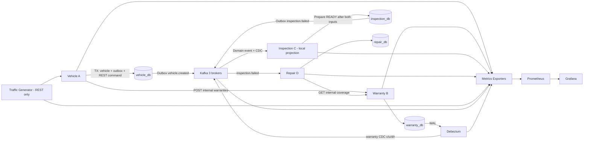
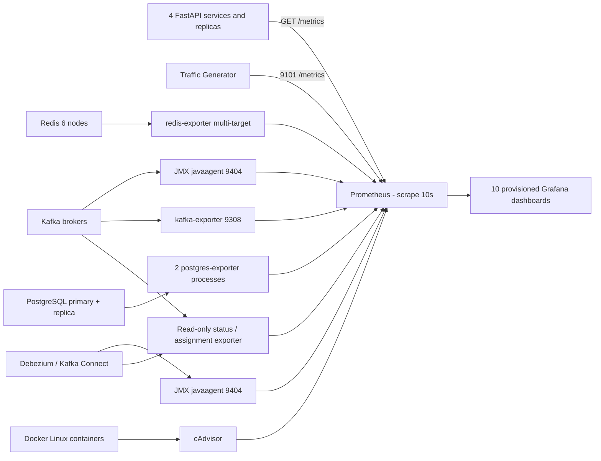
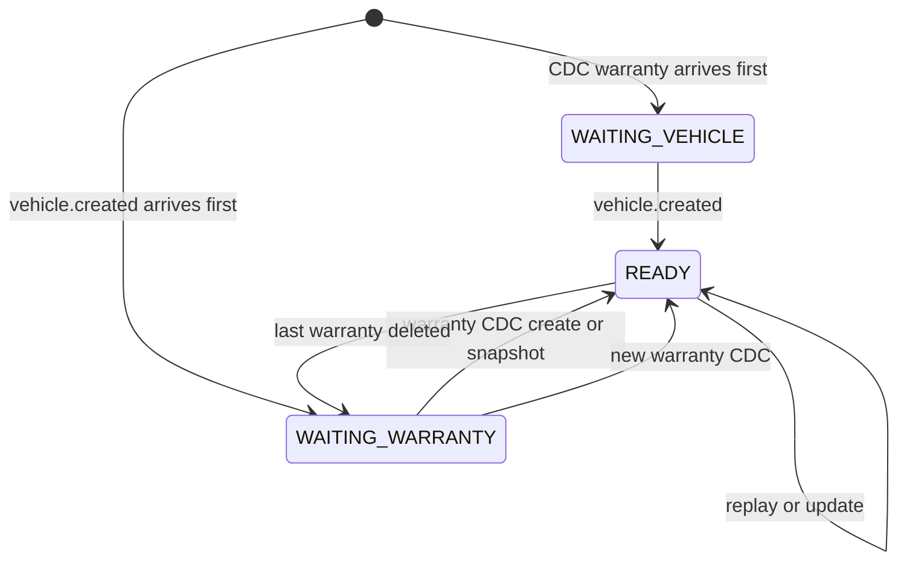

# Observability lab: REST, CDC, Kafka và metrics thật

[Mục lục](README.md) · [System Design](SYSTEM_DESIGN.md) · [Khởi động](GETTING_STARTED.md) · [Monitoring configuration](../monitoring/README.md) · [Kết quả kiểm chứng](OBSERVABILITY_VALIDATION.md)

## 1. Chạy và mở dashboard

```sh
[ -f .env ] || cp .env.example .env
make up
make traffic-status
# Kiểm chứng dữ liệu thật, datasource, dashboards và PromQL:
make monitoring-check
# Kiểm chứng REST → CDC c/u/d/tombstone → projection và FAIL → repair:
make cdc-projection-check
# Bài thử bắt buộc: lag tăng → scale Inspection lên 3 → lag giảm:
make lag-demo
```

`docker compose up --build` cũng tự bật traffic, exporters, Prometheus và Grafana. `make up` bổ sung 12 bước RUNNING/WAIT/OK/FAILED và lưu log tại `artifacts/startup/`. Bước cuối chờ các scrape target bắt buộc UP.

- [Grafana](http://localhost:3000): `admin` / `lab_grafana_password`, đổi bằng `GRAFANA_USER`, `GRAFANA_PASSWORD` trước lần tạo volume đầu tiên. Datasource **Prometheus**, UID `lab-prometheus`, và 10 dashboard được provision tự động vào folder **Vehicle Platform Lab**.
- [Prometheus Targets](http://localhost:9090/targets): xem trạng thái UP/DOWN và lỗi scrape cụ thể.
- [Prometheus Alerts](http://localhost:9090/alerts): example rules được load sẵn; chưa có kênh gửi thông báo.
- [Kafka UI](http://localhost:8080): partitions, ISR, records, consumer groups.
- API metrics: [Vehicle](http://localhost:8001/metrics), [Warranty](http://localhost:8002/metrics), [Inspection](http://localhost:8003/metrics); Repair dùng cổng từ `docker compose port --index 1 repair-service 8000`.

Exporter ports chỉ mở trong Docker network. Các UI/API host ports bind loopback. Đây là cấu hình lab, chưa có auth giữa các business services.

## 2. Architecture và metrics pipeline



[Xem SVG](diagrams/observable-business-flow.svg)



[Xem SVG](diagrams/metrics-pipeline.svg)

Prometheus khám phá FastAPI bằng Docker DNS A records mỗi 5 giây, scrape trực tiếp port 8000 của từng replica. `inspection-api` là Nginx gateway ở host port 8003; consumer vẫn chạy trong mỗi Inspection process. Scale không tạo thêm database/service ownership. Metrics của mỗi process reset khi restart; `rate()` xử lý counter reset.

## 3. Hai đường dữ liệu chuẩn bị Inspection

Vehicle commit vehicle, domain outbox và `warranty_provision_requests` trong **một transaction**. Sau commit, A thử REST B với timeout/pool của HTTPX. B tạo DEFAULT theo natural unique key `(vehicle_id, warranty_type)`; retry sau mất response nhận cùng warranty. Nếu B lỗi, A giữ yêu cầu PENDING, worker retry có backoff tối đa 60 giây; 201 chỉ cam kết local commit. Không rollback vehicle đã commit vì REST phía sau lỗi.

B lưu `correlation_id` trong warranty; Debezium mang nó trong row image. C đọc CDC topic thật, không truy vấn warranty_db. Projection `vehicle_warranty_projection` có warranty ID, vehicle ID, status/type/dates, source_updated_at, synced_at, LSN, partition/offset và checkpoint delete.



[Xem SVG](diagrams/inspection-two-input-readiness.svg)

Hai handler lấy transaction advisory lock theo vehicle ID trong inspection_db, UPSERT và gọi `try_prepare_inspection`. Processed ledger, projection và trạng thái workflow commit cùng transaction rồi mới commit Kafka offset. LSN loại update/snapshot cũ; delete giữ checkpoint để replay cũ không làm sống lại row. Tombstone value=null được acknowledge an toàn. READY nghĩa là đã có dữ liệu hai phía, **không đồng nghĩa covered**; D vẫn hỏi B qua REST để có coverage hiện tại.

`GET /inspections/workflows/{vehicle_id}` cho biết WAITING_VEHICLE / WAITING_WARRANTY / READY và source LSN đã sync. POST inspection trả 409 `vehicle_projection_not_ready` hoặc `warranty_projection_not_ready` khi chưa đủ đầu vào. `warranty.created` domain event vẫn xuất hiện cho quan sát/mở rộng nhưng không kích hoạt C nữa. Group mới `inspection-service-v2` đọc vehicle-events và warranty CDC; `repair-service-v1` giữ nguyên.

## 4. Dashboard guide và Golden Signals

| Dashboard | Nội dung chính |
|---|---|
| System Overview | Traffic: tổng RPS; latency: P95; errors: 5xx%; saturation: CPU/RAM/pool/lag; availability, PostgreSQL connections, Redis memory |
| FastAPI Services | RPS riêng Vehicle/Warranty/Inspection/Repair, endpoint/method/status, average/P50/P95/P99, active requests, pool/timeouts |
| Kafka Cluster | Broker UP/count, topics, partition/leader/ISR, URP, offline, messages/bytes, request mean latency |
| Kafka Consumer Groups — Consumer Lag | Group/topic/partition lag, current/end offset, top lagging, members, assignment, processed throughput, retry/DLQ |
| PostgreSQL | Primary/replica role, active/idle connections, transactions/commit/rollback, rows, locks/deadlocks, size, cache, replay/WAL/slots |
| Redis Cluster | Sáu nodes, role/link, RAM/limit, clients, ops, keys, hit/miss/ratio, expiry/eviction |
| CDC / Debezium | Connector/task RUNNING từ REST; captured/poll/write, queue, snapshot, source delay, consumer delay, errors, retained WAL |
| Container Resources | CPU, RAM working set/usage/limit, network RX/TX và start timestamp theo container |
| Business Flow | Committed vehicles/warranties/inspections/PASS/FAIL/repairs, CDC/domain events, outbox, A→B/D→B REST |
| Synthetic Traffic / Load Generator | Attempts/failures, flows hoàn tất/thất bại, latency histogram, retries, business objects quan sát được, controlled load |

Variables service/instance, topic/consumer_group, database, Redis node đặt ở dashboard tương ứng. Consumer lag có threshold vàng 100, đỏ 1000. Chọn khoảng thời gian 15 phút và refresh 10 giây; rate dùng cửa sổ 2 phút nên cần vài scrape mới có mẫu.

P50/P95/P99 tính từ histogram buckets bằng `histogram_quantile`, không từ average. HTTP latency gồm response body; `/metrics`, `/health`, `/ready` được loại khỏi business HTTP measurements. Kafka request latency là mean thực từ broker JMX, panel ghi rõ khác percentile của HTTP histogram.

## 5. Metrics contracts và cardinality

| Nhóm | Metric chính | Nguồn thực |
|---|---|---|
| HTTP | `http_requests_total`, `http_request_errors_total`, `http_request_duration_seconds`, `http_requests_in_progress` | ASGI request/response |
| Business | `vehicles_created_total`, `warranties_created_total`, `inspections_created_total`, `inspections_passed_total`, `inspections_failed_total`, `repairs_created_total` | Tăng sau DB commit, rollback không tăng |
| Cache | `vehicle_cache_hit_total`, `vehicle_cache_miss_total` | Cache-aside result tại Vehicle; khác keyspace counters toàn Redis |
| Consumer | `events_consumed_total`, `events_processed_total`, `events_failed_total`, `events_duplicate_total`, `events_retried_total`, `events_dlq_total`, `event_processing_duration_seconds` | Deliveries, successful DB commit/dedupe, attempts, ACK DLQ |
| CDC | `warranty_cdc_events_total`, `cdc_source_to_consumer_seconds` | Real Debezium envelope; source timestamp đến handler C, gồm queue/intentional delay |
| Outbox | `outbox_pending_events`, `outbox_published_total`, `outbox_publish_failed_total`, `outbox_publish_duration_seconds` | Own DB pending count; Kafka ACK và publish attempts |
| REST dependencies | `service_client_requests_total`, `service_client_errors_total`, `service_client_request_duration_seconds` | HTTPX A→B và D→B; source là label `service` |
| Pool | `db_pool_size`, `db_pool_checked_out`, `db_pool_idle_connections`, `db_pool_overflow`, `db_pool_capacity`, `db_pool_timeouts_total` | SQLAlchemy pool state; timeout error count, không giả lập wait time |
| DB sampler | `metrics_db_collection_success`, `metrics_db_collection_timestamp_seconds` | Biết gauge backlog có bị stale khi DB down hay không |
| REST delivery | `warranty_provision_pending_requests`, `warranty_provision_failures_total` | Durable commands trong vehicle_db và lỗi attempt |
| Generator | `traffic_requests_total`, `traffic_requests_failed_total`, `traffic_flow_completed_total`, `traffic_flow_failed_total`, `traffic_request_duration_seconds` | HTTP attempts/flow result của worker |

Counter business chỉ đo throughput trong vòng đời process, không thay DB total/audit. Nhiều replica cùng đọc outbox backlog: dùng `max by(service)`, không cộng trùng pending rows. Counter generator `vehicles_created_total` là quan sát ở client, nên query `job="traffic"`; counter server dùng `job="fastapi"`.

Labels chỉ dùng tập giá trị hữu hạn: service/method/route template/status/event_type/topic/operation. Route `/vehicles/{vehicle_id}` có một series cho mọi xe; raw URL làm series tăng theo dữ liệu. Không dùng VIN, vehicle_id, event_id, inspection_id, correlation_id, request_id hay user_id làm metric label. Các ID nằm trong JSON logs và payload để nối chi tiết một flow. Consumer assignment dùng group/topic/partition/client_host từ Kafka, không dùng member UUID ngẫu nhiên; số series theo replica đang chạy.

## 6. Phân biệt những loại lag

- Kafka lag = log end offset − committed offset, theo group/topic/partition. Đây là **số records**, không phải giây.
- `lab_pg_replication_lag_bytes` = primary current WAL LSN − standby replay LSN do primary nhận acknowledgement; phản ánh physical backlog. `lab_pg_role_wal_position_bytes` cho thấy cả hai vị trí.
- `lab_pg_replication_replay_lag_seconds` là độ trễ acknowledgement đo bởi PostgreSQL; có thể không có trên hệ thống idle. `last_replay_age_seconds` tăng khi không có transaction mới, không được coi là lag.
- `lab_pg_slot_retained_bytes` là WAL còn giữ phía sau restart LSN, cho physical/logical slots. Khi Connect down, logical retained WAL có thể tăng dù physical replica vẫn theo kịp.
- `debezium_millisecondsbehindsource` đo connector processing delay; histogram `cdc_source_to_consumer_seconds` đo thêm queue Kafka và delay của consumer. Snapshot dùng timestamp nguồn/envelope và được phân biệt bởi operation `r`.
- Connector REST RUNNING chưa chứng minh task đang tiến triển; phải xem events, poll/write, lag, slot bytes và workflow READY cùng nhau.

## 7. Bài thực hành lag → scale

`make lag-demo` chạy có giới hạn, ghi evidence, phục hồi cấu hình và traffic sau khi kết thúc. Consumer chậm 500ms mỗi record; controlled generator tạo xe qua REST, kéo theo vehicle domain event và warranty CDC. Mode này tạo đầu vào để đo lag, không tuyên bố mỗi xe đã hoàn thành full lifecycle.

Chạy bằng tay ở terminal riêng:

```sh
make traffic-stop
SIMULATE_CONSUMER_DELAY_MS=500 docker compose up -d --no-deps --scale inspection-service=1 inspection-service
LOAD_TEST_MODE=true LOAD_TEST_DURATION_SECONDS=240 LOAD_TEST_MAX_VEHICLES=1000 VIRTUAL_USERS=4 TRAFFIC_INTERVAL_MS=1800 docker compose up -d --no-deps traffic-generator
# Quan sát lag đi lên trong Grafana, rồi giữ delay khi scale:
SIMULATE_CONSUMER_DELAY_MS=500 docker compose up -d --no-deps --scale inspection-service=3 inspection-service
# Quan sát members=3, rebalance, throughput tăng, lag đi xuống.
# Sau buổi thực hành, phục hồi defaults:
docker compose stop traffic-generator
docker compose up -d --no-deps --scale inspection-service=1 inspection-service
docker compose up -d --no-deps traffic-generator
```

`--no-deps` giúp scale nhanh trong stack đã sẵn sàng. Lệnh `docker compose up -d --scale inspection-service=3` cũng hợp lệ; nếu đang demo delay, giữ env 500 hoặc đặt trong `.env` để Compose không thay nó về 0. C có sáu source partitions (hai topic × ba); D có ba partitions. Scale Repair bằng `docker compose up -d --no-deps --scale repair-service=3 repair-service`; ba host ports được cấp từ 8004–8006. Mỗi group chỉ assign một partition cho một member ở steady state. Cùng group ID, không đổi group để scale.

Capacity thực phụ thuộc CPU/DB/Kafka và phân bố key; ba consumer không đảm bảo đúng 3× throughput. Load có cả duration cap và vehicle-count cap; khi hết cap, worker dừng tạo mới, vẫn phục vụ metrics/heartbeat. Default mode tiếp tục full lifecycle như trước.

## 8. Mười failure scenarios

Chạy từng case riêng; mở dashboard trước, giữ ít nhất 30–60 giây để nhìn đủ mẫu. Luôn thực hiện lệnh phục hồi. Trong outage, full-flow generator có thể ghi flow_failed sau convergence deadline; đó là quan sát thật, không có cam kết mọi flow bị lỗi tự chạy lại.

| Case | CLI tạo lỗi → phục hồi | Quan sát |
|---|---|---|
| 1. API down | `docker compose stop vehicle-service` → `docker compose start vehicle-service` | FastAPI target DOWN, traffic transport failures; nếu Docker DNS rút endpoint thì series có thể stale/absent, kiểm target discovery |
| 2. Broker down | `docker compose stop kafka-1` → `docker compose start kafka-1` | Một JMX target DOWN, leader chuyển, ISR từ 3 xuống 2, URP tăng; RF3/minISR2 còn publish được |
| 3. Consumer down | `docker compose stop inspection-service` | C không commit offsets, CDC/domain lag tăng; generator chờ readiness rồi có thể timeout |
| 4. Consumer recovery | `docker compose start inspection-service` | Group rejoin, assignment trở lại, lag giảm, READY tiếp tục |
| 5. Replica down | `docker compose stop postgres-replica` → `docker compose start postgres-replica` | `pg_up{role="replica"}=0`, physical slot inactive; reader fallback primary; exporter target vẫn UP vì process exporter còn chạy |
| 6. Replica replay pause | Lệnh bên dưới | Byte lag tăng, replay LSN đứng; resume thì catch-up |
| 7. CDC down | `docker compose stop debezium-connect` | JMX DOWN, connector status exporter=0, slot WAL giữ lại; A/B vẫn commit, C chờ warranty CDC |
| 8. CDC recovery | `docker compose start debezium-connect` | RUNNING/task, poll/write spike, source lag giảm, C chuyển READY; outage lâu cần kiểm WAL retention |
| 9. Redis master down | Xác định role rồi stop node master, sau đó start lại | redis_up=0 ở node dừng, replica được promote, role/link thay đổi; cache có thể fallback DB |
| 10. Tăng concurrency | `VIRTUAL_USERS=100 docker compose up -d --no-deps traffic-generator` → `docker compose up -d --no-deps traffic-generator` | So sánh RPS/P95/CPU/RAM/connections/lag; với nguồn giới hạn tài nguyên, throughput có thể bão hòa |

```sh
# Case 6: pause/resume chỉ WAL replay; không xóa dữ liệu.
docker compose exec -T postgres-replica psql -U platform_admin -d postgres -c 'SELECT pg_wal_replay_pause();'
# Để traffic tạo thêm WAL rồi xem PostgreSQL dashboard.
docker compose exec -T postgres-replica psql -U platform_admin -d postgres -c 'SELECT pg_wal_replay_resume();'

# Case 9: role thay đổi sau failover; không giả định redis-1 luôn là master.
docker compose exec -T redis-1 redis-cli cluster nodes
# Stop một node có flags master, sau đó start chính node đó.
```

Muốn quan sát outbox backlog: `docker compose stop kafka-1 kafka-2 kafka-3`, để A/B còn nhận REST và commit, rồi `docker compose start kafka-1 kafka-2 kafka-3`. Chỉ dùng trong lab; producer ACK yêu cầu minISR2 nên mất một broker chưa đủ làm toàn outbox ngừng. Theo dõi `metrics_db_collection_success` để biết backlog gauge còn mới.

## 9. Useful PromQL

```promql
# RPS từng service; method/route có thể thêm vào by().
sum by(service)(rate(http_requests_total[2m]))
# 5xx / mọi response; zero fallback chỉ cho trường hợp chưa từng có 5xx.
100 * (sum(rate(http_requests_total{status_code=~"5.."}[2m])) or vector(0)) / clamp_min(sum(rate(http_requests_total[2m])), 0.001)
# P95 từ histogram.
histogram_quantile(0.95, sum by(le,service)(rate(http_request_duration_seconds_bucket[2m])))
# Lag và throughput.
sum by(consumergroup,topic)(kafka_consumergroup_lag)
sum by(service)(rate(events_processed_total[2m]))
# CPU cores và RAM.
sum by(service)(rate(container_cpu_usage_seconds_total[2m]))
sum by(service)(container_memory_working_set_bytes)
# Current physical backlog và retained logical WAL.
lab_pg_replication_lag_bytes
lab_pg_slot_retained_bytes{slot_type="logical"}
# Business backlog: không cộng trùng trên replicas.
max by(service)(outbox_pending_events)
```

## 10. Debug và giới hạn

Target DOWN: đọc `lastError` tại `/targets` → `docker compose logs --tail=100 <service/exporter>` → kiểm internal DNS/port/path → kiểm credentials/exporter connectivity. `up=1` chỉ xác nhận HTTP scrape; PostgreSQL còn cần `pg_up=1`, Redis `redis_up=1`, Connect cần task/connector và data progress. Dashboard No data: kiểm time range/rate warm-up, variable filters, tên metric trong Prometheus, exporter logs; không thay dữ liệu thiếu bằng số giả.

Nếu sau outage/recreate toàn bộ Kafka, Connect báo RUNNING nhưng poll/write đứng yên, C chờ CDC và log lặp `replication slot ... is active for PID ...`: kiểm worker/task cũ đang giữ slot. Với topology **chỉ một Connect worker** của lab, `docker compose restart debezium-connect` đóng các session cũ rồi resume từ stored offsets. Sau đó kiểm `confirmed_flush_lsn` tiếp tục tăng, chạy `make cdc-projection-check`. Không drop slot, reset offsets hoặc xóa volume để xử lý trường hợp này. Đây là recovery thực tế đã cần dùng khi thay toàn bộ image broker trong lượt validation; RUNNING/UP riêng lẻ không chứng minh pipeline khỏe.

cAdvisor chạy privileged với mount host Linux cgroups/Docker, chỉ dành cho máy lab tin cậy. Trên Docker Desktop/OrbStack, resource metrics thuộc **Linux VM và Linux containers**, không phản ánh toàn bộ CPU/RAM/process của macOS. Container không đặt memory limit có thể báo 0 hoặc VM capacity tùy runtime. Wrapper cAdvisor tự dò socket Docker/containerd; generic containerd namespace giữ k8s.io để Docker factory gắn đúng Compose labels. Không thêm node-exporter vì dễ gây hiểu nhầm đó là host macOS. cAdvisor không cung cấp Docker restart count tin cậy trong cấu hình này; dashboard dùng container start timestamp.

Connect dùng `init: true` để thu dọn tiến trình con khi stop/restart. Kafka agent chỉ được gắn vào broker JVM, nên Kafka CLI chạy trong cùng container không chiếm trùng port 9404. Mỗi broker có tên image riêng theo Compose service; tránh ba build cùng ghi đè một tag rồi gây recreate dù code không đổi.

Runtime giám sát các background workers. Nếu consumer/outbox/worker thiết yếu kết thúc ngoài shutdown bình thường, process ghi `background_worker_stopped_restart_required` và exit 70; Compose `restart: unless-stopped` tạo lại process. Đây là lớp phục hồi cho cả lỗi cleanup ngoài retry loop. Outbox, processed ledger và Kafka committed offset vẫn là checkpoint bền vững; request đang chạy có thể mất response và client cần retry theo contract.

Prometheus giữ tối đa 3 ngày/1 GB; Grafana/Prometheus có volume riêng. Application/CDC rows vẫn tăng theo workload. `make down` giữ data; `make clean` xóa volumes nên chỉ dùng khi chủ động reset toàn bộ lab. Metrics không thay logs/traces; chưa triển khai Loki/OTel, authentication, multi-host HA, retention policy cho nghiệp vụ hoặc failover PostgreSQL tự động.
