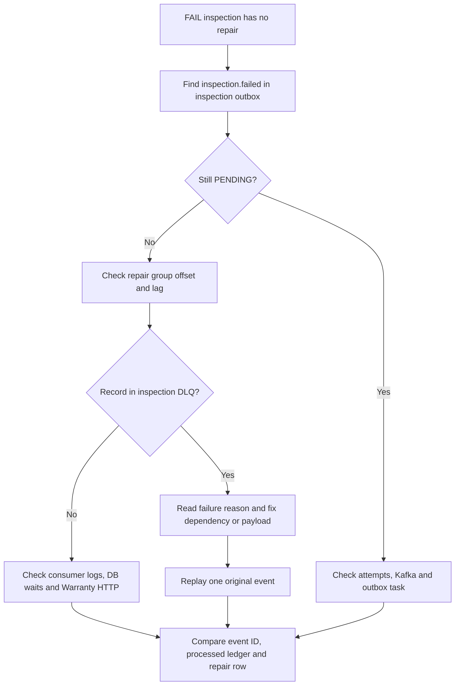

# Operations Runbook

[Mục lục](README.md) · [Failure design](CONSISTENCY_AND_FAILURES.md) · [Kết quả đã chạy](VALIDATION.md)

Các lệnh dưới đây chạy từ root repository. Chỉ áp dụng fault drill cho stack lab; không chạy đồng thời với bộ test thường hoặc seed lớn. Scripts outage dừng đúng dependency được chỉ định và có trap để start lại.

## 1. Khởi động, xem trạng thái và dừng

```sh
docker compose up --build -d --wait
docker compose ps
docker compose logs --tail=100 vehicle-service warranty-service inspection-service repair-service
docker compose run --build --rm toolbox python scripts/demo.py
```

Swagger ở ports 8001–8004, Kafka UI ở [localhost:8080](http://localhost:8080). PostgreSQL và Kafka chỉ mở trong network Compose; Redis có thêm host binding `127.0.0.1:6379`. HTTP ports cũng bind loopback. Khi port bận, đổi `*_PORT` trong `.env` rồi dùng URL tương ứng.

```sh
# Dừng và giữ dữ liệu
docker compose down
# Khởi động lại, giữ volumes
docker compose up -d --wait
```

`docker compose down -v` / `make clean` xóa named volumes và chỉ dùng khi chủ động reset dữ liệu lab. Đổi env password không tự đổi password của role trong volume đã khởi tạo.

## 2. Health và tín hiệu cần quan sát

```sh
curl -fsS http://localhost:8001/health
curl -i http://localhost:8001/ready
curl -i http://localhost:8002/ready
curl -i http://localhost:8003/ready
curl -i http://localhost:8004/ready
```

Liveness 200 chỉ cho biết process còn phục vụ HTTP. Readiness kiểm PostgreSQL SELECT 1, Redis ping, Kafka Admin describe cluster và task chưa done. Nó chưa đo tiến triển worker hoặc coverage dependency của Repair; Warranty HTTP down không nhất thiết làm `/ready` Repair trả 503.

| Tín hiệu | Hiện có | Cách diễn giải |
|---|---|---|
| HTTP latency/status | JSON `http_request` log | Thấy lỗi/pool waits tại request level |
| Correlation | X-Correlation-ID → envelope → Warranty HTTP | Ghép một workflow, không phải distributed tracing đầy đủ |
| Outbox status/attempts/age | SQL + JSON logs | Pending lâu là thiếu tiến triển, không chỉ nhìn count |
| Consumer group lag | Kafka UI / CLI | Partition nào chậm, offset có tiến không |
| DLQ | Kafka topic/UI | Event đã hết handler retry cần điều tra |
| Cache behavior | X-Cache, TTL và log | HIT/MISS không cho biết dữ liệu chắc chắn mới |
| Process restart | `/health.instance_id`, Docker restart state | Dùng để xác nhận crash drill |

Chưa có `/metrics`, Prometheus, Grafana hoặc exporter được cấu hình. Dashboard/alert production là đề xuất, không phải thành phần đang chạy.

## 3. Truy vấn chẩn đoán

Outbox pending và tuổi event, chạy trên DB của service nguồn đang điều tra:

```sh
docker compose exec postgres psql -U platform_admin -d inspection_db -c \
  "SELECT event_id,event_type,status,attempts,now()-created_at AS age,next_attempt_at,last_error FROM outbox_events WHERE status='PENDING' ORDER BY id LIMIT 20;"

docker compose exec postgres psql -U platform_admin -d repair_db -c \
  "SELECT event_id,consumer_name,processed_at FROM processed_events ORDER BY processed_at DESC LIMIT 20;"

docker compose exec postgres psql -U platform_admin -d repair_db -c \
  "SELECT id,vehicle_id,inspection_id,warranty_covered,status FROM repair_requests ORDER BY created_at DESC LIMIT 20;"

docker compose exec postgres psql -U platform_admin -d postgres -c \
  "SELECT datname,state,wait_event_type,wait_event,count(*) FROM pg_stat_activity WHERE usename <> 'platform_admin' GROUP BY datname,state,wait_event_type,wait_event;"

docker compose exec kafka /opt/kafka/bin/kafka-consumer-groups.sh \
  --bootstrap-server kafka:9092 --all-groups --describe
docker compose exec kafka /opt/kafka/bin/kafka-topics.sh \
  --bootstrap-server kafka:9092 --list
```

Admin ở đây là quyền operator của lab, không phải cách các application truy vấn dữ liệu. Không sửa marker, offset hoặc business rows trong lúc chỉ đang tìm nguyên nhân.

## 4. Quy trình điều tra một inspection FAIL chưa có repair



[Xem sơ đồ SVG](diagrams/incident-triage.svg)

Tìm theo inspection_id trong `outbox_events.payload->'data'->>'inspection_id'`; lấy event_id/correlation_id để ghép log. Không dùng “API 200 lúc complete” làm bằng chứng Kafka/Repair đã hoàn tất. Nếu processed marker có mà repair thiếu, đây là bất thường cần điều tra code/manual data change, không phải lý do xóa marker ngay.

## 5. Bật/tắt fault injection

```sh
docker compose -f docker-compose.yml -f compose.chaos.yml up -d --build --wait
docker compose run --build --rm --no-deps toolbox python scripts/chaos_verify.py
# Hoặc make chaos-up rồi make test-chaos

# Tạo lại application theo compose thường; .env phải để LAB_MODE=false
docker compose up -d --wait
curl -i -X POST http://localhost:8004/lab/crash-next-consumer
# Mong đợi 404 khi đã tắt
```

Fault endpoints không authentication; chỉ được bật cho lab bind loopback. `chaos_verify.py` giả định pool 5+5, HTTP_TIMEOUT=2 và không có workload cạnh tranh. Nó kiểm outbox failure, stale cache, HTTP timeout, process crash và pool exhaustion. Script crash làm API Repair restart cùng worker vì cùng process.

## 6. Runbook cho 12 failure scenarios

### 6.1. Duplicate Kafka message

```sh
docker compose exec inspection-service python /opt/scripts/events.py list
EVENT_ID='thay-bang-event-id-cua-inspection.failed'
docker compose exec inspection-service python /opt/scripts/events.py duplicate "$EVENT_ID" --count 3
docker compose logs --tail=80 repair-service
```

Mong đợi `duplicate_event_skipped`, cùng một repair/notification. Không đổi event ID để kiểm duplicate delivery; event ID mới là bài natural-key idempotency khác.

### 6.2. Crash sau DB commit trước offset commit

Bật chaos, gọi `POST /lab/crash-next-consumer` ở Repair rồi complete một inspection mới với FAIL. Script `chaos_verify.py` thực hiện toàn bộ và kiểm instance_id thay đổi. Log phải có crash marker rồi skip cùng event ID sau restart. Marker file được xóa trước exit nên chỉ crash một lần; không dùng docker stop thay thế vì nó có thể shutdown graceful.

### 6.3. PostgreSQL unavailable

```sh
sh scripts/outage_drills.sh postgres
```

Writes/list trả 503; cache HIT có thể vẫn 200. Sau restart, readiness trở lại. Nếu có consumer record đi DLQ trong thời gian outage, phục hồi DB không tự replay DLQ; xử lý theo mục 7.

### 6.4. Redis unavailable

```sh
sh scripts/outage_drills.sh redis
```

Mong đợi cache bypass, lock fallback, API idempotency vẫn trả cùng inspection nhờ DB. Readiness tổng hợp degraded trong khi dependency mất. Nếu sau recovery còn cache cũ, kiểm TTL/invalidation window trước khi kết luận PostgreSQL mất update.

### 6.5. Kafka unavailable

```sh
sh scripts/outage_drills.sh kafka
```

Probe tạo xe lúc broker dừng, kiểm outbox PENDING/attempts, khởi động lại broker và chờ pending drain. Không restart/xóa DB để sửa broker outage; outbox chính là dữ liệu cần giữ.

### 6.6. Warranty Service unavailable

```sh
docker compose run --rm toolbox python scripts/demo.py
sh scripts/outage_drills.sh warranty-service
```

Repair create mới trả 503, không lưu warranty_covered=false. Phiếu repair đã có vẫn GET được. Source event nếu hết retry sẽ nằm DLQ; cần replay sau khi Warranty phục hồi.

### 6.7. HTTP timeout

```sh
curl -fsS http://localhost:8002/lab/http-delay -H 'Content-Type: application/json' -d '{"seconds":3}'
# Tạo repair mới cho vehicle đã có warranty; mong đợi 503 với timeout mặc định 2s
curl -fsS http://localhost:8002/lab/http-delay -H 'Content-Type: application/json' -d '{"seconds":0}'
```

Thao tác tạo repair và assert đầy đủ có trong chaos script. Đặt delay ở Warranty thực, không giả lập HTTP client; kiểm không có repair mới được commit trong nhánh timeout.

### 6.8. Pool exhausted

```sh
# Terminal A, pool mặc định 10 connections
curl -fsS http://localhost:8001/lab/hold-db-connections \
  -H 'Content-Type: application/json' -d '{"count":10,"seconds":8}'
# Terminal B, trong lúc A còn giữ pool
curl -i http://localhost:8001/vehicles
```

Mong đợi 503 sau khoảng acquire timeout, rồi 200 khi A kết thúc. Dùng list để buộc vào DB; GET vehicle có cache HIT không kiểm pool exhaustion. Endpoint giữ pool có thể tự thất bại nếu workload khác đã chiếm nhiều connection.

### 6.9. Consumer lag tăng

```sh
curl -fsS http://localhost:8004/lab/consumer-delay -H 'Content-Type: application/json' -d '{"seconds":5}'
# Terminal khác
docker compose run --rm --no-deps toolbox python scripts/seed.py --count 30
# Theo dõi trong lúc seed còn chạy
docker compose exec kafka /opt/kafka/bin/kafka-consumer-groups.sh \
  --bootstrap-server kafka:9092 --group repair-service-v1 --describe
# Kết thúc drill
curl -fsS http://localhost:8004/lab/consumer-delay -H 'Content-Type: application/json' -d '{"seconds":0}'
```

Seed chờ repair và chỉ có năm workflow đồng thời nên workload bị giới hạn; đây là minh họa lag, không phải load generator benchmark. So sánh per-partition lag trước/trong/sau, không chỉ tổng số message trong topic.

### 6.10. Hai worker xử lý cùng event

```sh
docker compose run -d --no-deps --name vehicle-lab-repair-worker-2 repair-service
docker compose exec inspection-service python /opt/scripts/events.py duplicate "$EVENT_ID" --count 6 --scatter
docker logs --tail=80 vehicle-lab-repair-worker-2
docker compose logs --tail=80 repair-service
# Chỉ xóa container phụ vừa tạo
docker rm -f vehicle-lab-repair-worker-2
```

`EVENT_ID` lấy từ mục 6.1. Scatter cố ý gửi duplicate tới nhiều partitions, phá routing key bình thường để tạo cơ hội delivery đồng thời. Nếu event đã xử lý, quan sát skip; service tests tạo event mới và nhiều session concurrent để kiểm chính race tạo business record. Replica thêm phải dùng cùng group ID.

### 6.11. Outbox publish thất bại

```sh
curl -fsS http://localhost:8001/lab/outbox-failures -H 'Content-Type: application/json' -d '{"count":2}'
# Tạo xe mới bằng demo/API rồi query vehicle_db.outbox_events
docker compose run --rm --no-deps toolbox python scripts/demo.py
```

Mong đợi attempts tăng, next_attempt_at lùi, cuối cùng PUBLISHED. Injection counter thuộc process và có thể bị event pending khác tiêu thụ nếu đang có workload; dùng chaos script khi cần kiểm chứng cô lập.

### 6.12. Cache stale

Chaos script ghi bản cũ có chủ đích vào key của vehicle vừa tạo với TTL 2s, GET quan sát stale và chờ dữ liệu DB trở lại. Kết hợp đọc `X-Cache`, Redis TTL và DB row. Không dùng FLUSHALL để “sửa cache” vì nó còn xóa idempotency results/locks của các workflow khác.

## 7. DLQ investigation và replay

1. Ghi lại consumer, source topic/partition/offset, event ID và failure_reason từ Kafka UI.
2. Kiểm tra schema/version và dependency. Nếu payload sai, script không tự sửa thay operator.
3. Kiểm processed ledger và business natural key để hiểu lần xử lý trước có commit không.
4. Sau khi sửa nguyên nhân, replay đúng một record; giữ event ID.
5. Theo dõi source offset, marker, resource và outbox downstream. Giữ DLQ gốc để audit.

```sh
docker compose exec kafka /opt/kafka/bin/kafka-console-consumer.sh \
  --bootstrap-server kafka:9092 --topic inspection-events-dlq --from-beginning \
  --property print.partition=true --property print.offset=true

# Thay partition=0, offset=12 bằng record đã điều tra
docker compose run --rm toolbox python scripts/replay_dlq.py inspection-events-dlq 0 12
```

Không reset consumer offsets để thay thế selective replay. Nếu topic nguồn có nhiều consumer group, replay tới mọi group; group thành công trước đó dựa vào ledger để skip. Replay record đã hết Kafka retention cần nguồn lưu trữ ngoài Kafka, hiện chưa implement archive.

## 8. Backup, recovery và alerting cần bổ sung

Named volume persistence không phải backup. Ví dụ tạo backup thủ công một DB lab:

```sh
docker compose exec -T postgres pg_dump -U platform_admin -Fc vehicle_db > /tmp/vehicle_db.dump
```

Cần làm tương tự cho các DB khác và kiểm restore vào môi trường riêng. Bốn dump độc lập không tự tạo một global consistent snapshot cho workflow; cần kế hoạch quiesce/replay/reconcile khi restore. Chưa có PITR/automated backup hoặc RPO/RTO đã kiểm chứng.

Đề xuất alert: oldest pending outbox age, lag không giảm, DLQ tăng, pool timeout rate, repair coverage lookup failures và background task exit. Threshold phải dựa trên workload/SLO được đo; không lấy số của demo làm production threshold.
