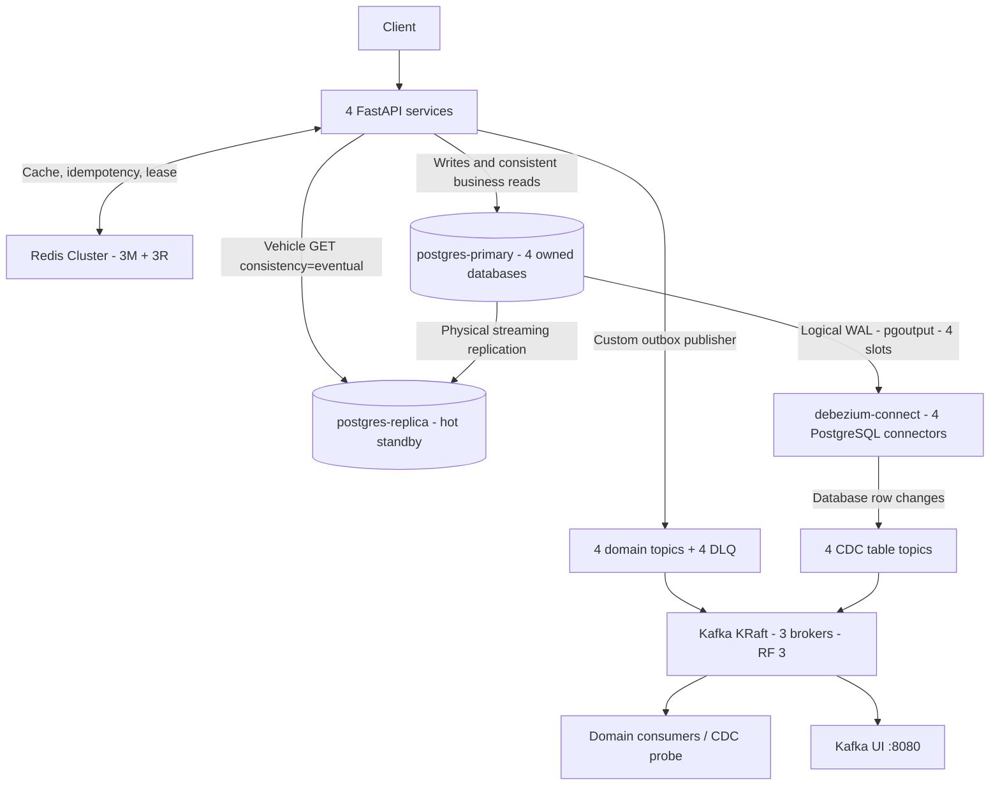
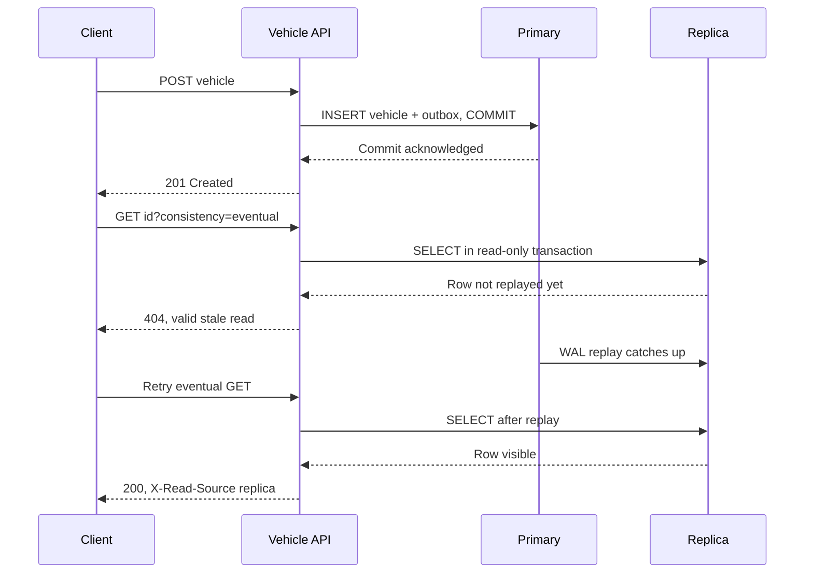
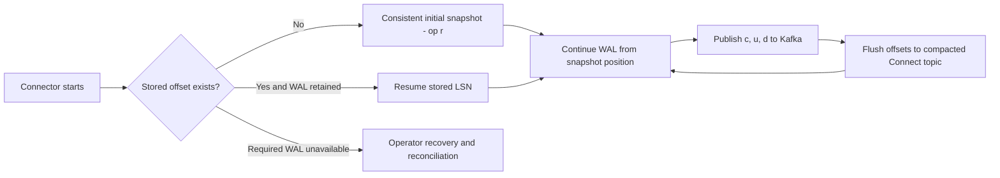
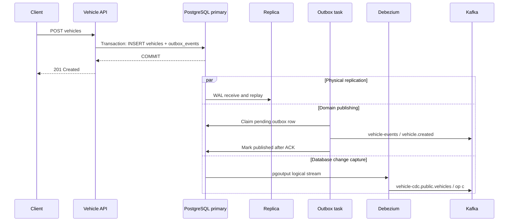

# PostgreSQL Primary–Replica và Debezium CDC

[Mục lục](README.md) · [System Design](SYSTEM_DESIGN.md) · [Kết quả kiểm chứng](POSTGRESQL_CDC_VALIDATION.md) · [Kafka/Redis](CLUSTER_INFRASTRUCTURE.md)

## 1. Thiết kế đang chạy

Lab dùng PostgreSQL 16.9 với **một primary và một hot standby**, streaming replication vật lý bất đồng bộ. Primary chứa bốn database độc lập: `vehicle_db`, `warranty_db`, `inspection_db`, `repair_db`. Replica sao chép toàn cluster, gồm dữ liệu, schema và roles. Mỗi service chỉ kết nối database mình sở hữu.

**Chưa có automatic PostgreSQL failover.** Replica không tự promote khi primary dừng. Đây là topology để học replication và duy trì một số read khi primary hỏng; write availability vẫn phụ thuộc primary. Hai node cùng Docker host cũng không bảo vệ trước mất host/disk. Patroni/DCS, fencing, routing writer và chuyển logical slots là phần mở rộng, chưa triển khai.



[Xem SVG](diagrams/postgres-cdc-infrastructure.svg)

Kafka Connect chạy một worker, gồm bốn connector/task, mỗi connector đọc một database. Một PostgreSQL connector không capture cả bốn database qua cùng một logical slot. Kafka Connect worker hiện chưa HA; khi worker dừng, database và outbox vẫn hoạt động, CDC đợi worker quay lại.

## 2. Streaming replication, WAL và LSN

**WAL** là log thay đổi dùng cho crash recovery và replication. **LSN** biểu diễn vị trí trong WAL, không phải business event ID. WAL sender trên primary phục vụ WAL receiver trên replica; replica nhận, flush rồi replay WAL. Receive LSN và replay LSN có thể khác nhau.

| Cấu hình primary | Giá trị trong Compose | Lý do |
|---|---|---|
| `wal_level` | `logical` | Hỗ trợ logical decoding lẫn physical replication |
| `max_wal_senders` | 16 | Replica, bốn logical streams và headroom bootstrap |
| `max_replication_slots` | 16 | Một physical slot, bốn logical slots và headroom |
| `wal_keep_size` | 256 MB | Giữ thêm WAL cho standby chậm |
| `max_slot_wal_keep_size` | 1 GB | Giới hạn retention do slot tại checkpoint; không phải disk quota cứng |
| `hot_standby` | on | Replica nhận SELECT trong recovery |
| `max_connections` | 200 | Dự phòng pool ứng dụng, CDC và công cụ lab |

Role `replicator` có LOGIN/REPLICATION, không SUPERUSER. `postgres-init` tạo physical slot `lab_physical_replica`; replica dùng `pg_basebackup --wal-method=stream --write-recovery-conf --slot=lab_physical_replica` khi volume trống. `standby.signal` giữ standby mode. Mỗi node có volume riêng; replica không chia sẻ thư mục data với primary. [PostgreSQL streaming replication](https://www.postgresql.org/docs/16/warm-standby.html), [pg_basebackup](https://www.postgresql.org/docs/16/app-pgbasebackup.html).

Replica giữ connection info/passfile trong volume riêng. Script không tự xóa một volume bootstrap dở hoặc một node đã được promote; nó báo lỗi để người vận hành xử lý có chủ đích. Giữ primary slot khi replica dừng giúp catch up, nhưng cũng giữ WAL.

## 3. Khởi động và quyền truy cập

```sh
docker compose up --build -d --wait
make db-check
make cdc-demo
```

Thứ tự: primary init bốn DB trên volume mới → `postgres-init` roles/physical slot → replica base backup và app migrations → `cdc-db-init` grants/identity/publications → `debezium-init` PUT configs và chờ cả connector/task RUNNING. Kafka topics được init trước Connect; Redis Cluster init trước app. Init jobs nhận biết trạng thái hiện có; không reset offsets hoặc logical slots khi chạy lại.

Kafka UI chờ `debezium-init` với `service_completed_successfully`. Điều này cũng cho Compose biết init job cuối kết thúc thành công là trạng thái hợp lệ khi chạy lại `up --wait`; job không phải daemon cần sống mãi.

| Role | Quyền và mục đích |
|---|---|
| `platform_admin` | Bootstrap/DBA/probes, không phải tài khoản ứng dụng |
| `<service>_app` | Sở hữu database của service; migrations, business writes, outbox/ledger |
| `<service>_reader` | CONNECT vào DB tương ứng, SELECT; mặc định transaction read-only |
| `replicator` | Physical streaming/base backup |
| `debezium` | LOGIN/REPLICATION; SELECT bốn bảng được capture, ghi bảng heartbeat riêng; không sở hữu bảng nghiệp vụ |

Database ports không publish ra host. HBA dùng SCRAM cho kết nối TCP trong mạng Docker; local socket dùng trust phục vụ bootstrap/CLI lab. Connect REST bind `127.0.0.1:8083`, không có authentication; config REST chứa mật khẩu lab nên không mở cổng này ra bên ngoài. Passwords lấy từ `.env`; thay password trên volume hiện hữu phải đồng bộ role và client. SQL grants riêng không cho application query DB của service khác.

## 4. Read / write routing và consistency

Bốn service đều có `WRITE_DATABASE_URL` tới primary và `READ_DATABASE_URL` tới replica bằng reader role. Migrations, mutations, idempotency, outbox, consumers và coverage đọc primary. Shared Runtime tạo hai engine/session factories; `sessions` luôn là writer.

Đường đọc replica thực tế hiện là **`GET /vehicles/{id}?consistency=eventual`**. Nó bỏ qua Redis, chạy transaction READ ONLY, trả `X-Read-Source: replica` và `X-Cache: BYPASS`. Nếu kết nối/query replica lỗi, thực hiện lại SELECT trong một transaction READ ONLY trên primary, trả `primary-fallback`. Mỗi lần thử có deadline `DB_READ_TIMEOUT=3` giây; cả hai nơi lỗi thì trả 503. Không retry mutation qua replica.

Một replica trả 404 hợp lệ do lag **không** kích hoạt fallback. Kết quả replica không điền Redis cache dùng cho đường đọc mặc định. `GET /vehicles/{id}` mặc định giữ cache-aside với DB source là primary; sau PATCH app invalidate cache. Cache invalidation thất bại vẫn có cửa sổ stale đến TTL như trước; tên `consistency=primary` chỉ chọn đường nguồn DB, không phải cam kết linearizable cache.

```sh
# Thay bằng ID trả về từ POST /vehicles
VEHICLE_ID='00000000-0000-0000-0000-000000000001'
curl -i "http://localhost:8001/vehicles/$VEHICLE_ID"
curl -i "http://localhost:8001/vehicles/$VEHICLE_ID?consistency=eventual"
```



[Xem SVG](diagrams/postgres-replica-lag.svg)

## 5. Debezium configuration, publication và slots

Image `quay.io/debezium/connect:3.2.4.Final` chạy Kafka Connect tương thích Kafka 3.9.1 của lab. Các phiên bản được pin để tái lập, không có nghĩa đây là phiên bản mới nhất. [Debezium 3.2 release notes](https://debezium.io/releases/3.2/release-notes).

| Connector | DB / table | Logical slot / publication | Topic |
|---|---|---|---|
| vehicle-postgres-connector | vehicle_db / vehicles | dbz_vehicle | vehicle-cdc.public.vehicles |
| warranty-postgres-connector | warranty_db / warranties | dbz_warranty | warranty-cdc.public.warranties |
| inspection-postgres-connector | inspection_db / inspections | dbz_inspection | inspection-cdc.public.inspections |
| repair-postgres-connector | repair_db / repair_requests | dbz_repair | repair-cdc.public.repair_requests |

**Logical decoding** chuyển WAL thành thay đổi row qua plugin `pgoutput`. **Publication** xác định những bảng PostgreSQL xuất cho logical replication. **Logical slot** giữ vị trí tiêu thụ/retention WAL của một connector; slot gắn database và nằm trên primary này. **Physical slot** giữ WAL cho toàn standby cluster. PostgreSQL 16 không tự đồng bộ các logical slots này sang replica để transparent CDC failover. [PostgreSQL replication slot catalog](https://www.postgresql.org/docs/16/view-pg-replication-slots.html).

DBA tạo publication trước, `publication.autocreate.mode=disabled`. Mỗi publication chứa bảng nghiệp vụ tương ứng và `cdc_heartbeat`; `table.include.list` chỉ emit bảng nghiệp vụ, loại outbox/ledger/heartbeat khỏi CDC table topics. `heartbeat.action.query` cập nhật một row heartbeat mỗi 5 giây, giúp connector tiến LSN ngay cả khi DB đó ít hoạt động so với các DB khác. `debezium` chỉ có INSERT/UPDATE thêm trên bảng heartbeat này.

Config nằm ở [init-connectors.py](../infrastructure/debezium/init-connectors.py): `plugin.name=pgoutput`, `snapshot.mode=initial`, slot giữ lại khi dừng, tombstone bật, retry vô hạn cho lỗi retriable. Invalid config, slot mất hoặc lỗi không retriable vẫn cần xử lý vận hành. [Debezium PostgreSQL configuration](https://debezium.io/documentation/reference/3.2/connectors/postgresql.html#postgresql-connector-properties).

Bốn topic CDC có 3 partitions/RF3/minISR2. Connect internal topics `connect-configs` có **1 partition**, `connect-offsets` và `connect-status` có 3; cả ba RF3/minISR2/compaction. Một partition config là yêu cầu ordering của Connect, không phải thiếu replication. Heartbeat topics có 1 partition/RF3. Application business topics/DLQ giữ cấu hình cũ.

## 6. Initial snapshot và continuous CDC

`snapshot.mode=initial`: nếu chưa có offset, connector snapshot dữ liệu hiện hữu rồi đọc WAL từ vị trí tương ứng. Row snapshot mang `op=r`; database trống thì không có row snapshot để phát. Restart với offset/slot còn hợp lệ tiếp tục stream, không mặc định snapshot lại. Khi volume/offset/slot mất, cần đánh giá gap và quy trình re-snapshot có chủ đích.



[Xem SVG](diagrams/debezium-snapshot-recovery.svg)

## 7. Event format và INSERT / UPDATE / DELETE

JSON converters hiện tắt schema envelope, nên record value có trực tiếp `before`, `after`, `source`, `op`, `ts_ms`. Probe cũng đọc được record lịch sử có lớp `payload` trong giai đoạn đổi converter. Key JSON chứa primary key của row. Một record thực tế được lưu trong báo cáo kiểm chứng; ví dụ rút gọn:

```json
{
  "before": {"id": "row-id", "owner_name": "An"},
  "after": {"id": "row-id", "owner_name": "Binh"},
  "source": {"connector": "postgresql", "db": "vehicle_db", "schema": "public", "table": "vehicles", "lsn": 123456},
  "op": "u",
  "ts_ms": 1790748000000
}
```

Đây là ví dụ cấu trúc, không phải snapshot kết quả chạy. `source` còn chứa metadata như transaction/snapshot/source timestamp. `ts_ms` ngoài cùng là thời điểm connector xử lý, không bằng thời điểm business request hoặc source commit trong mọi trường hợp.

| op | before | after | Ý nghĩa |
|---|---|---|---|
| c | null | Row mới | INSERT từ WAL |
| u | Row trước cập nhật | Row sau cập nhật | UPDATE từ WAL |
| d | Row bị xóa | null | DELETE từ WAL |
| r | null | Row snapshot | Initial snapshot read |

Bốn bảng chính dùng `REPLICA IDENTITY FULL` để lấy đầy đủ before image cho update/delete; đánh đổi là WAL lớn hơn và thêm chi phí. Sau delete event, tombstone cùng key có **Kafka value null**, không phải JSON `op=d`. Topic CDC hiện dùng delete retention để dễ quan sát lịch sử; tombstone có ý nghĩa xóa key khi downstream áp dụng compaction/materialization.

Debezium phát row events, không gom toàn transaction thành một record. Không có global ordering qua partitions/databases. Downstream phải chấp nhận duplicate khi crash/restart xảy ra giữa publish và offset flush.

## 8. Hai đường phát sự kiện độc lập



[Xem SVG](diagrams/outbox-and-cdc.svg)

Domain event mang ý nghĩa nghiệp vụ và schema hợp đồng do application thiết kế. CDC phản ánh insert/update/delete table, kể cả thay đổi SQL trực tiếp không phát domain event. Outbox row và business row commit cùng transaction; custom publisher tiếp tục là **cơ chế duy nhất phát domain events**. Debezium không capture `outbox_events` và không bật Outbox Event Router. Router là lựa chọn thay publisher sau này, cần chuyển quyền publish có chủ đích để tránh double publishing.

## 9. Lệnh verify và quan sát lag/WAL

```sh
docker compose exec postgres-primary psql -d postgres -c 'SELECT pg_is_in_recovery(), pg_current_wal_lsn();'
docker compose exec postgres-primary psql -d postgres -c 'SELECT application_name,state,sync_state,sent_lsn,write_lsn,flush_lsn,replay_lsn,pg_wal_lsn_diff(pg_current_wal_lsn(),replay_lsn) AS lag_bytes FROM pg_stat_replication;'
docker compose exec postgres-replica psql -U platform_admin -d postgres -c 'SELECT pg_is_in_recovery(),pg_last_wal_receive_lsn(),pg_last_wal_replay_lsn();'
docker compose exec postgres-replica psql -U platform_admin -d postgres -c 'SELECT status,sender_host,written_lsn,flushed_lsn,latest_end_lsn FROM pg_stat_wal_receiver;'
docker compose exec postgres-primary psql -d postgres -c 'SELECT slot_name,slot_type,plugin,database,active,restart_lsn,confirmed_flush_lsn,wal_status,pg_wal_lsn_diff(pg_current_wal_lsn(),restart_lsn) AS retained_bytes FROM pg_replication_slots;'
docker compose exec postgres-primary psql -d vehicle_db -c 'SELECT * FROM pg_publication; SELECT * FROM pg_publication_tables;'
# WAL directory size; slot estimates overlap and must not be summed as disk usage.
docker compose exec postgres-primary psql -d postgres -c 'SELECT pg_size_pretty(sum(size)) AS wal_size FROM pg_ls_waldir();'
curl -fsS http://localhost:8083/connectors
curl -fsS http://localhost:8083/connectors/vehicle-postgres-connector/status
# Config includes database password; inspect locally, do not paste it into shared logs.
curl -fsS http://localhost:8083/connectors/vehicle-postgres-connector/config
docker compose exec kafka-1 /opt/kafka/bin/kafka-topics.sh --bootstrap-server kafka-1:9092,kafka-2:9092,kafka-3:9092 --describe --topic vehicle-cdc.public.vehicles
docker compose exec kafka-1 /opt/kafka/bin/kafka-console-consumer.sh --bootstrap-server kafka-1:9092,kafka-2:9092,kafka-3:9092 --topic vehicle-cdc.public.vehicles --from-beginning --max-messages 3 --property print.key=true
docker compose exec kafka-1 /opt/kafka/bin/kafka-consumer-groups.sh --bootstrap-server kafka-1:9092,kafka-2:9092,kafka-3:9092 --list
```

Mỗi publication thuộc một database; đổi `-d` để xem ba DB còn lại. `confirmed_flush_lsn` là vị trí logical client xác nhận; `restart_lsn` là WAL cũ nhất slot còn cần. Byte lag đo lượng WAL chênh lệch; `now()-pg_last_xact_replay_timestamp()` tăng cả khi primary không có transaction mới, nên không dùng riêng chỉ số đó kết luận standby đang chậm.

Connect source task lưu source LSN trong `connect-offsets`, không có consumer group offset giống domain consumers đọc topic. `vehicle-lab-connect` là nhóm phối hợp workers. Quan sát `op/source.lsn`, task status, slots và Connect offset flush cùng nhau.

## 10. Failure drills

```sh
make db-test
# Raw evidence được ghi vào artifacts/postgres-cdc/<timestamp>/
```

Script [postgres_cdc_drills.sh](../scripts/postgres_cdc_drills.sh) có cleanup để start lại node hoặc resume replay khi lỗi. Không chạy đồng thời với test/seed/fault drills khác. Các thao tác chỉ nhắm stack lab và tạo dữ liệu mẫu.

| Case | Thao tác | Hành vi mong đợi và được probe kiểm tra |
|---|---|---|
| Replica down | `docker compose stop postgres-replica` | Primary/CDC vẫn hoạt động; eventual GET fallback primary |
| Replica restart | `docker compose start postgres-replica` | Giữ recovery mode, catch up từ physical slot |
| Connect down | `docker compose stop debezium-connect` | Thực hiện API INSERT/UPDATE và SQL DELETE; WAL được giữ |
| Connect restart | `docker compose start debezium-connect` | Đọc bù đủ c/u/d+tombstone, không snapshot lại row vừa xóa |
| Primary down | `docker compose stop postgres-primary` | Writes/readiness 503; eventual GET đọc row đã replay từ replica; receiver mất kết nối; CDC retry |
| Primary restart | `docker compose start postgres-primary` | Replica reconnect, slots active, CDC và business workflow tiếp tục |
| Replay paused | `pg_wal_replay_pause()` | New primary row thấy ở default GET, eventual GET có thể 404; CDC vẫn thấy INSERT |
| Replay resumed | `pg_wal_replay_resume()` | Replica thấy row mới, lag giảm |

Manual lag experiment:

```sh
docker compose exec postgres-replica psql -U platform_admin -d postgres -c 'SELECT pg_wal_replay_pause();'
# Chạy POST /vehicles, giữ ID; so sánh GET mặc định và consistency=eventual.
docker compose exec postgres-replica psql -U platform_admin -d postgres -c 'SELECT pg_get_wal_replay_pause_state();'
docker compose exec postgres-replica psql -U platform_admin -d postgres -c 'SELECT pg_wal_replay_resume();'
make db-check
```

`make cdc-demo` tạo xe qua API, xác nhận thấy ở replica, PATCH owner rồi SQL DELETE đúng row demo theo ID+VIN. Probe consume Kafka và assert before/after/op/source/LSN/tombstone. DELETE trực tiếp chỉ là demo CDC: không phát vehicle.deleted, không dọn dữ liệu downstream và không invalidate cache qua application; không coi đây là API xóa nghiệp vụ hoàn chỉnh.

Traffic Generator còn tạo c/u/d hoàn toàn qua REST với `simulation_run_id` và DELETE có header matching run, invalidate cache qua Vehicle API. Downstream history vẫn được giữ và không phát vehicle.deleted; xem [Traffic Generator](TRAFFIC_GENERATOR.md). `make traffic-test` ép DELETE=1 để kiểm CDC chắc chắn; default 1% chỉ mang tính xác suất.

Kết quả demo được giữ tại `artifacts/postgres-cdc/demo/insert-update-delete.json` (ghi đè khi chạy lại), gồm vehicle ID và raw CDC records. Dùng ID đó lọc key trong Kafka UI → topic `vehicle-cdc.public.vehicles` → Messages để đối chiếu c/u/d với before/after.

## 11. WAL retention và phục hồi có mất WAL

Connector/replica down làm slot chậm và giữ WAL. Lab giới hạn retention theo slot ở 1 GB, áp dụng tại checkpoint; disk vẫn có thể vượt mức đó vì WAL đang hoạt động, checkpoint và các retention policy khác. Query `pg_replication_slots`, `pg_ls_waldir()` và kiểm task status như trên. Heartbeat giúp DB ít hoạt động xác nhận tiến độ, không cứu connector đang down.

Nếu WAL bắt buộc bị loại bỏ, slot có thể mất hiệu lực; restart đơn thuần không tạo lại lịch sử đã mất. Phải bảo toàn evidence, xác định gap, rebootstrap replica hoặc re-snapshot connector có kế hoạch và reconcile downstream. Không tự drop slot, xóa offsets hoặc đổi topic prefix để che gap. Snapshot mới mô tả current state, không tái tạo đầy đủ mọi thay đổi đã biến mất. [PostgreSQL replication settings](https://www.postgresql.org/docs/16/runtime-config-replication.html).

Promotion thủ công cần fence primary cũ, xử lý writer endpoint, timeline/rejoin và logical slot/offset tương thích. Lab không chạy lệnh promote tự động và không tuyên bố CDC failover không mất dữ liệu.

## 12. Source map

- [Compose](../docker-compose.yml): services, volume, dependency và connection URLs.
- [Replication init](../infrastructure/postgres/init-replication.sh), [replica bootstrap](../infrastructure/postgres/start-replica.sh), [CDC SQL init](../infrastructure/postgres/init-cdc.sh).
- [Connector registration](../infrastructure/debezium/init-connectors.py): cấu hình bốn connector và bounded readiness polling.
- [Runtime read routing](../common/platform_common/runtime.py), [Vehicle routes](../services/vehicle-service/app/api/routes.py).
- [Verifier](../scripts/postgres_cdc_verify.py), [fault drills](../scripts/postgres_cdc_drills.sh), [integration tests](../tests/integration/test_postgres_cdc.py).
