# Tài liệu kỹ thuật — Vehicle Service & Warranty Platform

Bộ tài liệu này giải thích **hệ thống đang chạy trong repository**, từ quyết định kiến trúc đến transaction, event, sự cố và vận hành. Đọc [System Design](SYSTEM_DESIGN.md) trước; dùng [README gốc](../README.md) để khởi động stack và chạy curl demo.

## Mục lục

| Tài liệu | Nội dung | Khi nào cần đọc |
|---|---|---|
| [Observability Validation](OBSERVABILITY_VALIDATION.md) | 59 tests, CDC end-to-end, 21 targets, 134 panel queries và consumer scale thật | Xem bằng chứng phiên bản REST + CDC + monitoring |
| [Observability](OBSERVABILITY.md) | Metrics pipeline, 10 dashboards, PromQL, failures và lag/scale demo | Quan sát và thực hành |
| [Getting Started](GETTING_STARTED.md) | Thứ tự CLI, startup 12 bước, log tiến độ, xem traffic và dừng/chạy lại | Bắt đầu chạy lab |
| [System Design](SYSTEM_DESIGN.md) | Yêu cầu, ranh giới service, high-level/low-level design, deployment, capacity, security và hướng production | Muốn hiểu thiết kế tổng thể và lý do lựa chọn |
| [Cluster Infrastructure](CLUSTER_INFRASTRUCTURE.md) | Kafka 3 brokers, Redis 3M+3R, quorum/slots, failover, consumer scale và command thực hành | Học replication/HA và test node failure |
| [PostgreSQL & CDC](POSTGRESQL_CDC.md) | Primary/replica, WAL, read routing, Debezium, CDC vs domain events và 8 bài thử lỗi | Học database replication và CDC thật |
| [PostgreSQL & CDC Validation](POSTGRESQL_CDC_VALIDATION.md) | Kết quả streaming replication, CRUD CDC, outage/recovery và khởi động mới | Xem bằng chứng phiên bản hiện tại |
| [Traffic Generator](TRAFFIC_GENERATOR.md) | REST-only worker, virtual users, retry, duplicate/CDC/cache/replica observation và live guide | Tạo traffic tự động và quan sát xuyên hệ thống |
| [Traffic Validation](TRAFFIC_VALIDATION.md) | PASS/FAIL scenarios, CDC bằng REST và năm dependency outage | Xem bằng chứng của generator |
| [Data Model](DATA_MODEL.md) | ERD, dictionary dữ liệu, constraint/index, state machine, migration và retention | Thiết kế/chỉnh schema hoặc tìm invariant nghiệp vụ |
| [API Contracts](API_CONTRACTS.md) | Toàn bộ endpoint nghiệp vụ, input/output, validation, error và retry contract | Viết client hoặc sửa API |
| [Event Contracts](EVENT_CONTRACTS.md) | 8 event types, envelope, topics/groups, payload, ordering và versioning | Viết consumer hoặc điều tra event |
| [Request & Event Flows](REQUEST_FLOWS.md) | Sequence diagrams cho tạo xe, FAIL → repair, API retry, consumer concurrency, cache và expiry | Theo dõi một thao tác đi qua những thành phần nào |
| [Consistency & Failure Design](CONSISTENCY_AND_FAILURES.md) | Outbox, crash windows, at-least-once, deduplication, locks, timeout budget và recovery | Đánh giá correctness và failure behavior |
| [Operations Runbook](OPERATIONS.md) | Chạy hệ thống, health/log/SQL/Kafka, xử lý 12 failure scenarios, DLQ replay và phục hồi | Thực hành vận hành, quan sát và debug |
| [Development Guide](DEVELOPMENT.md) | Bản đồ code, thêm feature/event, migration, kiểm thử và cập nhật diagram | Phát triển tiếp bài lab |
| [Architecture Decisions](ARCHITECTURE_DECISIONS.md) | Các quyết định đã áp dụng, phương án thay thế, hệ quả và điều kiện xem xét lại | Review thiết kế hoặc đánh giá trade-off |
| [Cluster Validation](CLUSTER_VALIDATION.md) | Kết quả kiểm chứng 3 Kafka brokers, 6 Redis nodes, node failure, outage và rebalance | Xem bằng chứng infrastructure hiện tại |
| [Validation Report](VALIDATION.md) | Kết quả chạy thực tế trước đó, phạm vi đã kiểm chứng và giới hạn | Phân biệt bằng chứng chạy với mục tiêu thiết kế |
| [Diagram Gallery](diagrams/README.md) | Tất cả sơ đồ SVG và source Mermaid | Xem riêng, phóng to hoặc đưa vào tài liệu khác |

## Lộ trình đọc

**Nắm toàn cảnh:** System Design → Request Flows → Consistency & Failures → chạy `make demo`.

**Đọc code theo nghiệp vụ:** API Contracts → service/repository tương ứng → Data Model → Event Contracts → handler downstream. Mỗi tài liệu có link tới source thực hiện hành vi đang mô tả.

**Thực hành distributed systems:** đọc crash windows → chạy fault drill trong Operations → đối chiếu DB/outbox/offset/log → phục hồi dependency và xem sự kiện được xử lý lại.

**Review ở vai trò Lead:** System Design → Architecture Decisions → capacity/timeout budgets → production gaps → xác định phép đo hoặc invariant cần bổ sung trước khi thay đổi thiết kế.

## Quy ước tài liệu

- **Hiện tại:** đã có trong code/config. Đây là nguồn mô tả hành vi của lab.
- **Giới hạn:** điều implementation chưa bảo đảm, hoặc mô hình nghiệp vụ đã chủ động giản lược.
- **Đề xuất:** hướng mở rộng chưa được triển khai; các con số minh họa không phải benchmark/SLO đã đạt.
- Sơ đồ Mermaid là source; SVG được xuất từ cùng source. Tên service/container/table/field giữ nguyên để tra code dễ hơn. Mũi tên có nhãn `logical reference` không phải foreign key xuyên database.
- Các lệnh chạy từ **root repository**, trừ khi ghi khác. Ports trong ví dụ là default; xem `.env.example` nếu đổi port.

## Thuật ngữ dùng trong lab

| Thuật ngữ | Ý nghĩa cụ thể |
|---|---|
| Source of truth | Database của service sở hữu một loại dữ liệu |
| Local transaction | Atomic commit/rollback trong một PostgreSQL database |
| Outbox | Ý định publish event được lưu cùng business transaction |
| Processed ledger | Bảng `processed_events`, đánh dấu event đã xử lý thành công trong cùng transaction |
| Idempotency key | Danh tính một ý định tạo resource của client; khác với event ID |
| Natural key | Khóa nghiệp vụ như VIN hoặc inspection_id của repair |
| Projection | Bản đọc cục bộ dựng từ event; có thể chậm hơn source |
| Consumer lag | Khoảng cách giữa vị trí log và committed offset của một consumer group/partition |
| DLQ | Topic giữ record thất bại để điều tra và replay có chủ đích |
| Coverage snapshot | Kết quả bảo hành tại lúc Repair gọi Warranty; không tự thay đổi theo warranty về sau |

## Cập nhật tài liệu

Sửa Markdown, sau đó chạy `make docs-render` để xuất lại sơ đồ và `make docs-check` để kiểm tra links/source/artifacts. Công cụ render dùng Docker; không cần Node/Python trên host. Chi tiết ở [Development Guide](DEVELOPMENT.md).
