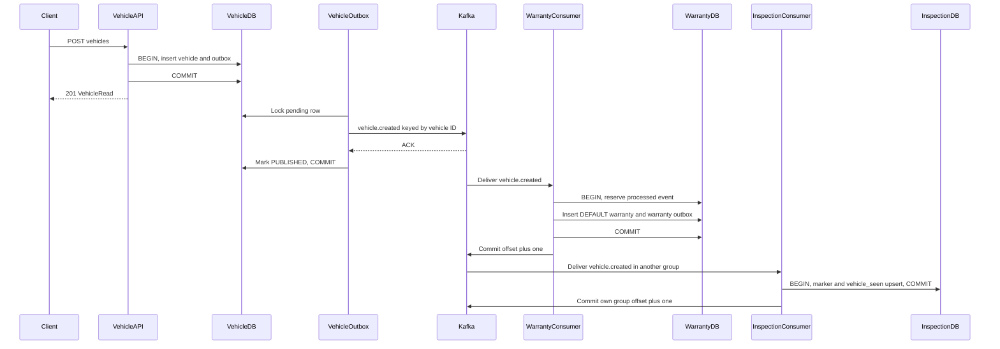
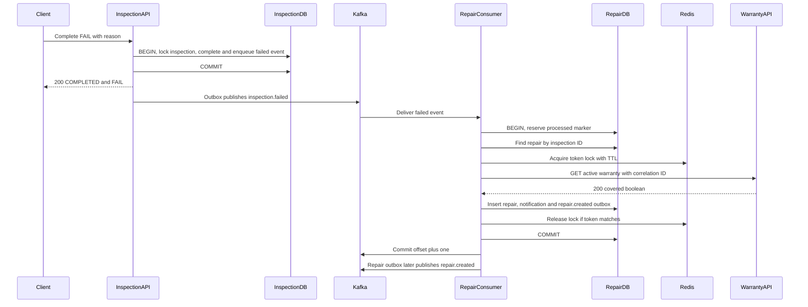
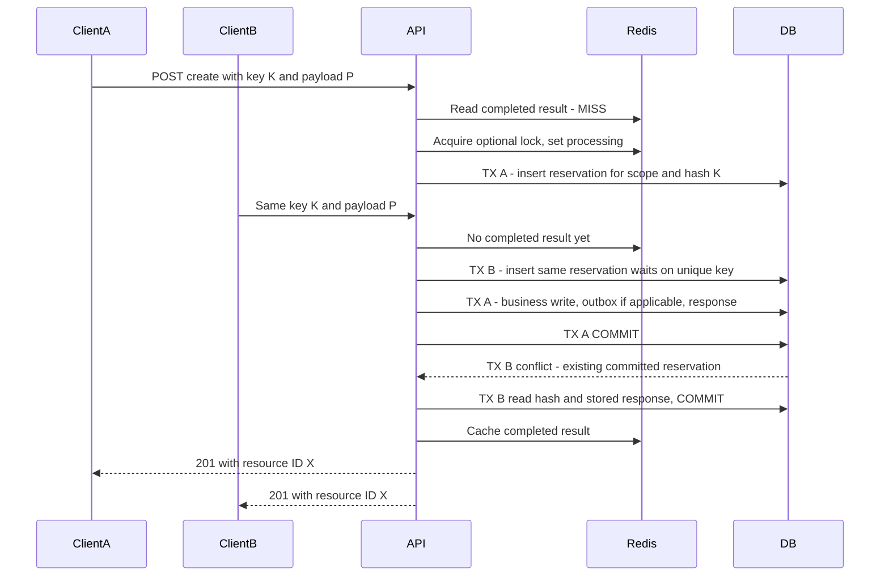
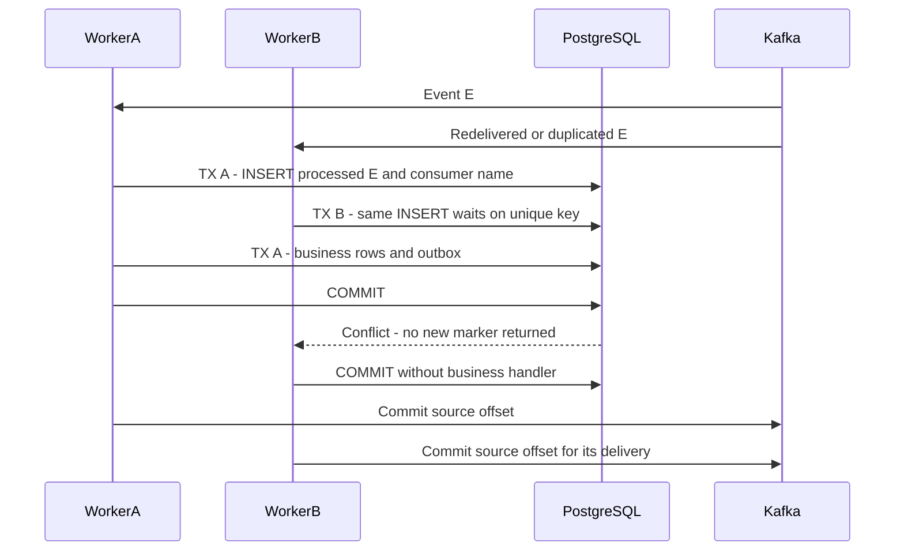
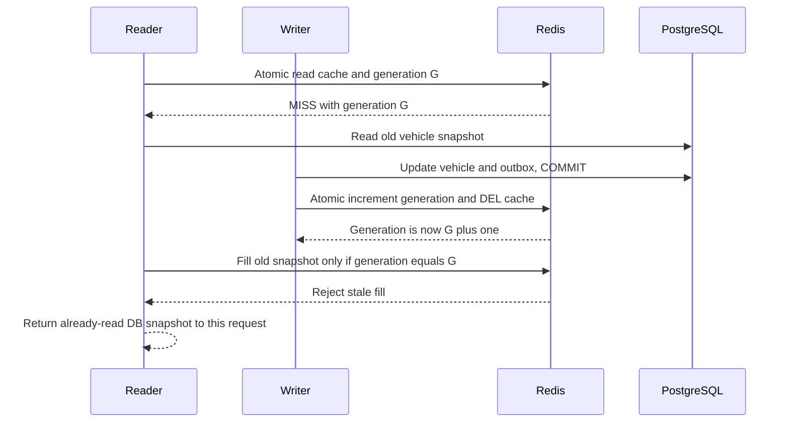
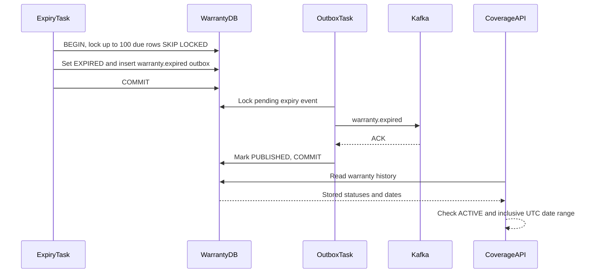

# Request và Event Flows

[Mục lục](README.md) · [API](API_CONTRACTS.md) · [Events](EVENT_CONTRACTS.md) · [Failure semantics](CONSISTENCY_AND_FAILURES.md)

Sơ đồ dưới đây theo đúng transaction boundary của code. Thời điểm trả HTTP response và thời điểm downstream consume là hai mốc khác nhau. Publisher/consumer là tasks trong application của domain tương ứng.

## 1. Tạo vehicle → default warranty → projection

[Xem sơ đồ SVG](diagrams/vehicle-creation-sequence.svg)

Warranty handler còn dùng Redis lock theo vehicle ID quanh default creation; sơ đồ tập trung commit/offset. Warranty outbox sau đó publish warranty.created, Inspection set warranty_seen. Hai group tiến độc lập; thứ tự trên hình minh họa một execution, không ép Warranty phải commit trước Inspection.

Nếu vehicle.created bị nhận lại, processed ledger skip handler. Nếu event ID mới nhưng cùng vehicle, unique `(vehicle_id,warranty_type)` vẫn ngăn default warranty thứ hai. Nếu handler rollback, marker chưa durable và delivery sau vẫn được xử lý.

Điểm đọc code: [VehicleService.create](../services/vehicle-service/app/services/vehicles.py), [create_default](../services/warranty-service/app/services/warranties.py), [update_reference](../services/inspection-service/app/messaging/handlers.py).

## 2. Complete FAIL → coverage REST → repair và notification

[Xem sơ đồ SVG](diagrams/inspection-repair-sequence.svg)

Sơ đồ là nhánh tạo mới và Warranty thành công. Nếu repair đã có với cùng inspection/vehicle, service trả record đó, không gọi lại coverage và không tạo notification/outbox mới. Nếu lock đang bận hoặc REST lỗi, outer transaction rollback rồi consumer retry. Redis outage cho phép fallback database; không tự rollback chỉ vì cache/lock backend mất kết nối.

Lock Redis được release trước outer DB commit; đây là lý do unique constraints và processed reservation phải giữ correctness. Coverage là kết quả hiện tại lúc REST trả lời, không phải lookup theo inspection occurred_at.

Điểm đọc code: [complete](../services/inspection-service/app/services/inspections.py), [failed handler](../services/repair-service/app/messaging/handlers.py), [repair transaction](../services/repair-service/app/services/repairs.py), [warranty client](../services/repair-service/app/infrastructure/warranty_client.py).

## 3. Hai API create request cùng Idempotency-Key

[Xem sơ đồ SVG](diagrams/api-idempotency-sequence.svg)

Redis lock contention ở helper idempotency không fail request; request B vẫn vào DB reservation. Nếu request hash khác, B trả 409. Nếu A rollback, B có thể giành reservation và thực hiện nghiệp vụ. Nếu A commit rồi response tới client bị mất, retry lấy cùng result từ Redis hoặc DB.

Hai response có thể về theo thứ tự khác sơ đồ. `POST /inspections` không có create event; cụm “outbox if applicable” áp dụng khi action là tạo repair.

Source: [execute_idempotent](../common/platform_common/idempotency.py).

## 4. Hai consumer task cùng event ID

[Xem sơ đồ SVG](diagrams/consumer-concurrency-sequence.svg)

Hai task cần cùng consumer_name để dùng cùng ledger key. Nếu A rollback, B có thể insert marker và xử lý. Đây là race trong delivery/rebalance hoặc duplicate qua partition khác; Kafka steady-state cùng group không assign một partition cho hai member đồng thời.

Nếu A đã commit DB nhưng crash trước offset commit, execution tương đương A dừng trước mũi tên commit Kafka; B/restarted A gặp marker và skip. Test service dùng nhiều session riêng trên PostgreSQL thật để kiểm tình huống này.

## 5. Cache fill chạy đua với PATCH

[Xem sơ đồ SVG](diagrams/cache-generation-sequence.svg)

Generation ngăn stale cache được **ghi lại** sau invalidation thành công. Nó không đổi kết quả DB mà request đang xử lý đã đọc, và không bảo đảm linearizable reads. Nếu invalidation thất bại vì Redis down hoặc writer crash sau DB commit, TTL của entry là cơ chế chữa stale còn lại; xem failure matrix.

Source: [Vehicle GET/PATCH](../services/vehicle-service/app/services/vehicles.py), [Lua operations](../common/platform_common/redis.py).

## 6. Warranty expiry tự động

[Xem sơ đồ SVG](diagrams/warranty-expiry-sequence.svg)

Coverage tự kiểm date kể cả khi expiry task chậm hoặc chưa chuyển status. Worker chỉ expire `end_date < today`; một warranty kết thúc hôm nay vẫn có thể covered đến hết ngày UTC. Không có consumer hiện tại dùng warranty.expired để tự sửa coverage snapshot của repair đã tạo.
