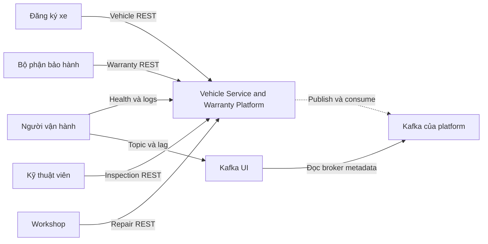
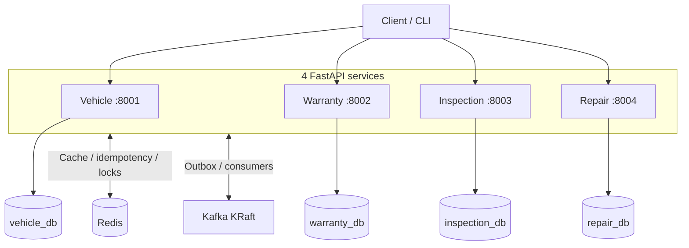
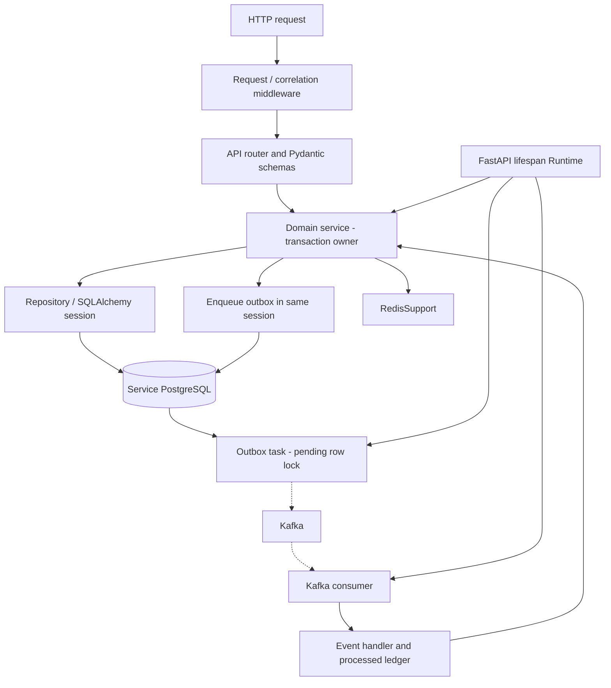
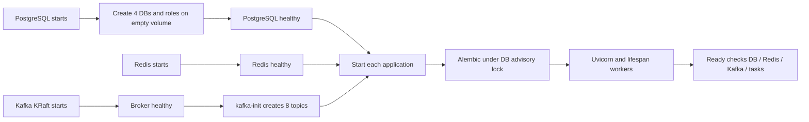
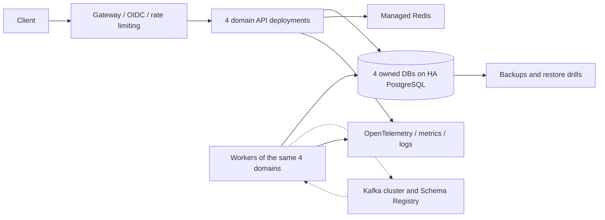

# System Design

[Mục lục tài liệu](README.md) · [Dữ liệu](DATA_MODEL.md) · [Luồng xử lý](REQUEST_FLOWS.md) · [Quyết định kiến trúc](ARCHITECTURE_DECISIONS.md)

## 1. Bài toán và phạm vi

Vehicle Service & Warranty Platform mô phỏng một nền tảng đăng ký xe, quản lý bảo hành, kiểm định và tạo yêu cầu sửa chữa. Thiết kế có **đúng bốn application nghiệp vụ**, mỗi application sở hữu database của mình. PostgreSQL, Redis, Kafka, Kafka UI và init/toolbox là hạ tầng hoặc công cụ.

| Actor | Nhu cầu | Đường vào hiện tại |
|---|---|---|
| Nhân viên đăng ký xe | Đăng ký VIN, model, nhà sản xuất, owner | Vehicle REST |
| Bộ phận bảo hành | Thêm bảo hành, activate/expire, tra coverage | Warranty REST |
| Kỹ thuật viên | Tạo/cập nhật/complete inspection | Inspection REST |
| Workshop | Xem và chuyển trạng thái repair | Repair REST |
| Người vận hành | Xem health, logs, events, offsets và chạy fault drill | Docker CLI, Kafka UI, `/health`, `/ready` |

Actor ở đây là vai trò nghiệp vụ; lab **chưa có login, RBAC hoặc phân quyền endpoint**.



[Xem sơ đồ SVG](diagrams/system-context.svg)

### Yêu cầu chức năng

Đăng ký/cập nhật xe; tạo default warranty từ event; quản lý vòng đời warranty; inspection PASS/FAIL; tạo repair/notification từ FAIL; tra coverage bằng REST; xử lý API retry và Kafka duplicate; quan sát/replay các tình huống thất bại.

### Yêu cầu chất lượng và giới hạn

| Mục tiêu | Cách hiện thực | Giới hạn |
|---|---|---|
| Không mất ý định phát event sau business commit | Transactional outbox trong cùng DB | Giả định DB/volume còn dữ liệu; không bảo vệ trước mất toàn bộ storage |
| Không tạo duplicate khi nhận lại event | Durable processed ledger + unique business keys | Retention/replay policy phải giữ ledger đủ lâu |
| Không tạo duplicate khi client retry create | Redis result cache + PostgreSQL idempotency reservation | Chỉ POST inspection/repair có header contract này |
| Không biến dependency failure thành kết quả nghiệp vụ sai | Coverage unavailable → rollback/retry/503 hoặc DLQ | Repair có thể chưa tồn tại cho đến khi dependency phục hồi/replay |
| Cho phép từng domain phát triển độc lập | Database/role, API và event ownership rõ ràng | Shared infrastructure package tạo coupling ở thời điểm build/release |
| Quan sát được hành vi lỗi | JSON logs, Kafka UI, health, fault endpoints opt-in | Chưa có metrics pipeline/tracing/SLO thực đo |

Không nằm trong phạm vi hiện tại: scheduling workshop, inventory/phụ tùng, thanh toán, mileage, warranty claim limits, giao tiếp ECU, customer master, gửi SMS/email thật hoặc orchestration saga có compensation.

## 2. Ranh giới và quyền sở hữu

| Service | Source of truth | Bản sao/đầu vào bên ngoài | Quyền quyết định |
|---|---|---|---|
| Vehicle | `vehicles`, gồm owner_name | Không | VIN duy nhất, trạng thái và thông tin xe |
| Warranty | `warranties` | `vehicle.created` | Loại/thời hạn/trạng thái bảo hành và coverage hiện tại |
| Inspection | `inspections` | `vehicle_references` từ hai loại event | Kết quả inspection và tính bất biến sau complete |
| Repair | `repair_requests`, `notifications` | Event FAIL; coverage REST | Một repair/inspection, coverage snapshot, trạng thái sửa chữa |

Không có service đọc trực tiếp DB của service khác. Inspection chỉ lưu hai cờ đã quan sát event; projection này không chứa đầy đủ vehicle/warranty và không đủ để tính coverage.

## 3. High-level design



[Xem sơ đồ SVG](diagrams/system-containers.svg)

Ports trên sơ đồ là host ports; bên trong container cả bốn application nghe port 8000. Các database nằm trên cùng một PostgreSQL instance nhưng có role/CONNECT permission riêng. Redis là một instance dùng key namespace. Kafka là một broker/controller KRaft kết hợp, ba partition/topic.

Mũi tên nối vào khung application gom các kết nối hạ tầng để sơ đồ gọn hơn. Vehicle dùng Redis cache; Warranty dùng lock; Inspection dùng idempotency; Repair dùng idempotency và lock. [Event topology](EVENT_CONTRACTS.md#1-topology-và-subscriptions) tách riêng từng topic và subscription. Kết nối REST từ Repair sang Warranty được trình bày trong bảng dưới và [sequence FAIL → repair](REQUEST_FLOWS.md#2-complete-fail--coverage-rest--repair-và-notification).

### Chọn synchronous hay asynchronous

| Interaction | Chọn | Lý do | Hệ quả client cần hiểu |
|---|---|---|---|
| Client → service sở hữu dữ liệu | REST | Validation và kết quả local transaction ngay | Thành công chỉ xác nhận local state |
| Vehicle → Warranty/Inspection | Kafka | Một sự kiện fan-out cho hai domain | Xe có thể tồn tại trước warranty/projection |
| Warranty → Inspection | Kafka | Cập nhật dấu đã quan sát warranty | Hai topic không có thứ tự toàn cục |
| Inspection FAIL → Repair | Kafka | Tách hoàn tất kiểm định khỏi latency/dependency sửa chữa | Complete FAIL có thể trả trước khi repair xuất hiện |
| Repair → Warranty | REST | Cần câu trả lời coverage hiện tại của owner | Repair creation phụ thuộc availability/latency của Warranty |
| Repair → downstream | Kafka | Phát `repair.created` cho bên mở rộng | Lab chưa có consumer cho topic này |

Đây là choreography bằng event. Không có central orchestrator, distributed transaction hoặc rollback xe khi Warranty xử lý thất bại.

## 4. Low-level design trong một application



[Xem sơ đồ SVG](diagrams/service-components.svg)

Sơ đồ thể hiện các vai trò; một số handler như Inspection projection dùng SQLAlchemy trực tiếp vì chỉ cần upsert nhỏ. `WarrantyService.create_default` và `RepairService.create_in_transaction` dùng session do consumer truyền vào, bảo toàn transaction boundary.

| Thành phần | Trách nhiệm | Source |
|---|---|---|
| App factory / middleware | Lifespan, error mapping, request context, health | [api.py](../common/platform_common/api.py) |
| Runtime | Một engine/session factory, Redis client, HTTP pool, Kafka publisher và tasks/process | [runtime.py](../common/platform_common/runtime.py) |
| Router/schema | HTTP contract, validation, dependency injection | `services/*/app/api`, `services/*/app/schemas` |
| Business/repository | State transition, transaction, row lookup/lock | `services/*/app/services`, `services/*/app/repositories` |
| Messaging | Envelope, outbox, retries và consumer ledger | [events.py](../common/platform_common/events.py), [consumer.py](../common/platform_common/consumer.py) |

Mỗi container chạy một uvicorn process. API và tasks asyncio chia sẻ pool nhưng không chia sẻ một `AsyncSession` giữa task. Vehicle có outbox task; ba service còn lại thêm consumer; Warranty thêm expiry task. Không có cron container hay worker application thứ năm.

## 5. Consistency contract

| Quan sát | Cam kết hiện tại |
|---|---|
| `POST /vehicles` trả 201 | Vehicle và `vehicle.created` outbox đã commit; không cam kết Warranty đã consume |
| `POST /inspections` trả 201 | Inspection và idempotency response đã commit; không phát inspection.created |
| Complete FAIL trả 200 | Inspection COMPLETED và failed outbox đã commit; repair có thể chưa có |
| Repair xuất hiện | Repair, notification và repair outbox đã commit cùng nhau |
| Redis lock mất/hết lease | DB constraints/ledger vẫn là lớp correctness |
| Consumer thấy event lần nữa | Đã commit marker thì skip, chưa commit thì thử lại |
| GET vehicle ngay sau PATCH | Cache bị invalidate khi Redis hoạt động; outage/crash window có thể trả stale |

Không có global exactly-once. Không có causal-read token cho client. Các script demo dùng polling hữu hạn để chờ eventual consistency. Xem [Consistency & Failures](CONSISTENCY_AND_FAILURES.md) để đọc từng crash window.

## 6. Deployment và lifecycle



[Xem sơ đồ SVG](diagrams/startup-dependencies.svg)

Startup chờ dependencies; resilience khi Kafka down áp dụng sau khi application đã chạy. Migration lỗi thì uvicorn chưa được mở. Lock migration thuộc từng DB nên các domain không cần khóa chung.

Shutdown cancel/await tasks rồi đóng producer, HTTP client, Redis và engine. Nếu process bị kill giữa ACK/commit, recovery dựa vào durable rows và redelivery. Docker restart policy xử lý process crash; healthcheck chuyển unhealthy không tự làm Docker restart container.

`toolbox` chạy khi gọi rõ ràng theo profile/`compose run`, dùng để seed/test. Database credentials nhiều service trong toolbox chỉ phục vụ quan sát/kiểm thử; đây không phải mẫu quyền của application production.

## 7. Capacity model và scaling

**Đây là cách ước tính, chưa phải benchmark.** Không suy ra production TPS từ việc 24 tests pass.

### Connection budget

Với `R_s` replica của service `s`, upper bound pool ứng dụng theo cấu hình là:

```text
C_app_max = Σ R_s × (DB_POOL_SIZE_s + DB_MAX_OVERFLOW_s)
Default: 4 × (5 + 5) = 40 connections
```

Cộng thêm connection của migrations, operator, toolbox và monitoring; chừa headroom cho PostgreSQL. Pool không mở sẵn toàn bộ 40 connection. Tăng replica để xử lý lag cũng tăng áp lực DB và HTTP upstream.

### Consumer throughput

Mỗi process xử lý một record tại một thời điểm, dù được assign nhiều partition. Nếu thời gian xử lý trung bình là `T_handler`, throughput gần đúng của process dưới điều kiện ổn định là `1 / T_handler`; retry/lock/pool wait làm giảm con số này.

Với một topic ba partition, tối đa ba consumer member có thể đồng thời sở hữu partition của topic đó. Inspection subscribe hai topic nên tổng cộng có sáu partition, nhưng assignment, key skew và thời gian từng handler quyết định hiệu quả thực tế. Một hot vehicle vẫn tập trung vào một partition trong từng topic.

### Backlog

```text
B(t + Δt) ≈ max(0, B(t) + (λ_in - μ_processing) × Δt)
T_drain ≈ backlog / (μ_processing - λ_in), chỉ khi μ_processing > λ_in
```

Đây là mô hình đơn giản giả định tốc độ ổn định. Ví dụ minh họa: producer 40 event/s, consumer tổng 25 event/s trong 120s tạo khoảng 1800 event tồn. Sau khi tăng năng lực lên 70 event/s và incoming vẫn 40/s, thời gian xả khoảng 60s. Cần đo handler latency, partition skew, DB waits và lag để thay số thật.

### Storage

Outbox PUBLISHED, processed ledger, idempotency ledger và generation keys chưa có cleanup job. Với `E` event/ngày và `D` ngày giữ ledger, số row xấp xỉ `E × D` cho mỗi consumer liên quan; disk còn có JSONB, indexes, WAL, bloat và backup. Kafka retention mặc định bảy ngày không tự dọn PostgreSQL.

Xóa processed ledger quá sớm rồi replay Kafka có thể chạy lại nghiệp vụ. Unique natural key chỉ bảo vệ những invariant đã encode; không thay thế ledger cho mọi side effect tương lai.

## 8. Availability, security và quan sát

Hiện tại một PostgreSQL instance, một Kafka broker và một Redis là các điểm lỗi đơn. Redis outage có fallback DB; PostgreSQL outage ảnh hưởng writes và consumers; Kafka outage giữ write intent trong outbox; Warranty outage chặn tạo repair mới chưa có sẵn.

`/ready` là readiness tổng hợp theo policy thận trọng: Redis/Kafka lỗi vẫn trả 503 dù một số endpoint có thể chạy bằng fallback. Task chưa kết thúc không có nghĩa task đang có tiến triển. Health endpoints chưa kiểm consumer lag, oldest outbox age, DLQ backlog hay schema compatibility.

Boundary hiện tại là Docker network và loopback host binding. Không có OIDC/TLS/Kafka ACL/Redis auth, không có audit trail theo người thao tác. Hash Idempotency-Key không phải biện pháp xác thực. Owner name và payload DLQ có thể chứa dữ liệu cá nhân; cần policy truy cập/retention khi mở rộng.

## 9. Hướng production — chưa triển khai



[Xem sơ đồ SVG](diagrams/production-target.svg)

Tách deployment API/worker vẫn giữ bốn domain service; implementation hiện tại chưa có entrypoint riêng cho worker. Không thể đạt topology này chỉ bằng sửa replica count.

| Ưu tiên | Thay đổi đề xuất | Bằng chứng cần có trước rollout |
|---|---|---|
| Correctness | Tenant/user scope, authorization, xác thực manual repair reference | Test quyền, cross-tenant isolation, migration strategy |
| Reliability | HA DB/Kafka, backup/PITR, replay policy, retry jitter và circuit breaker | Failover/restore drill, không mất committed intent |
| Observability | Metrics outbox age, lag, DLQ, pool waits; tracing propagation | Dashboard và alert gắn với user impact |
| Performance | Load test, query plan, cursor pagination, worker isolation | p95/p99 và throughput theo workload đo thật |
| Operations | Secrets/TLS/CVE scanning, migrations job, schema compatibility | Rotation/rollback drill, compatible deploy trước/sau |

SLO có thể đề xuất riêng cho API success, latency và thời gian event tới downstream; chưa đặt số mục tiêu trong lab vì chưa có workload/measurement để biện minh. RPO/RTO cũng cần được chốt bằng backup/failover requirements, không suy ra từ Docker restart policy.

## 10. Đường dẫn kiểm tra thiết kế

- [Compose](../docker-compose.yml): container topology, ports, dependency order, volumes.
- [Runtime](../common/platform_common/runtime.py): tasks và client lifecycle.
- [Outbox](../common/platform_common/outbox.py): ACK/mark/commit boundary.
- [Consumer](../common/platform_common/consumer.py): reservation, retry, DLQ và offset.
- [Warranty client](../services/repair-service/app/infrastructure/warranty_client.py): synchronous dependency và error mapping.
- [Validation](VALIDATION.md): những gì đã thực sự được chạy.
