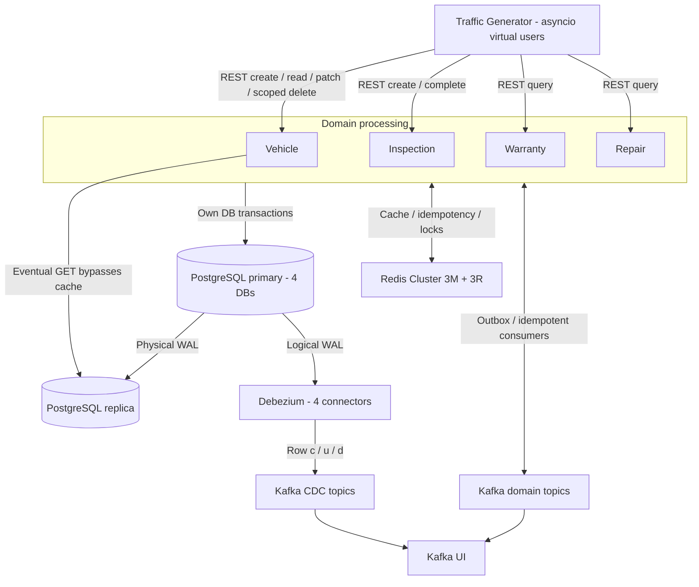
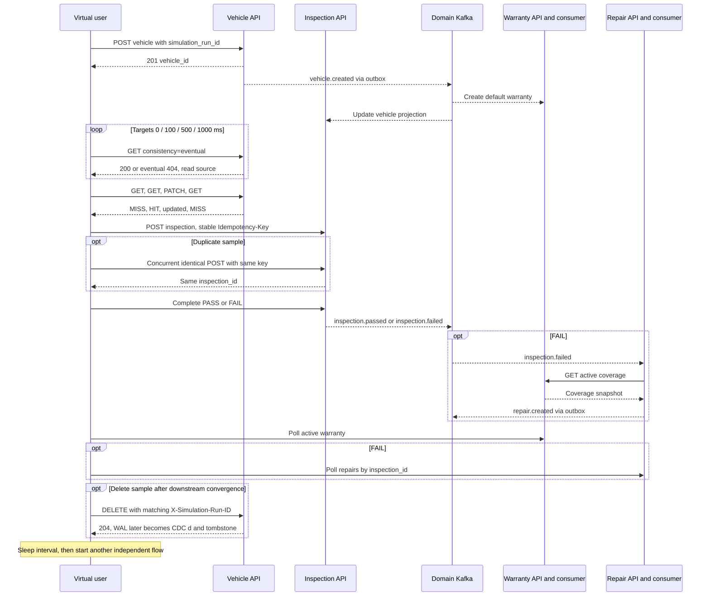
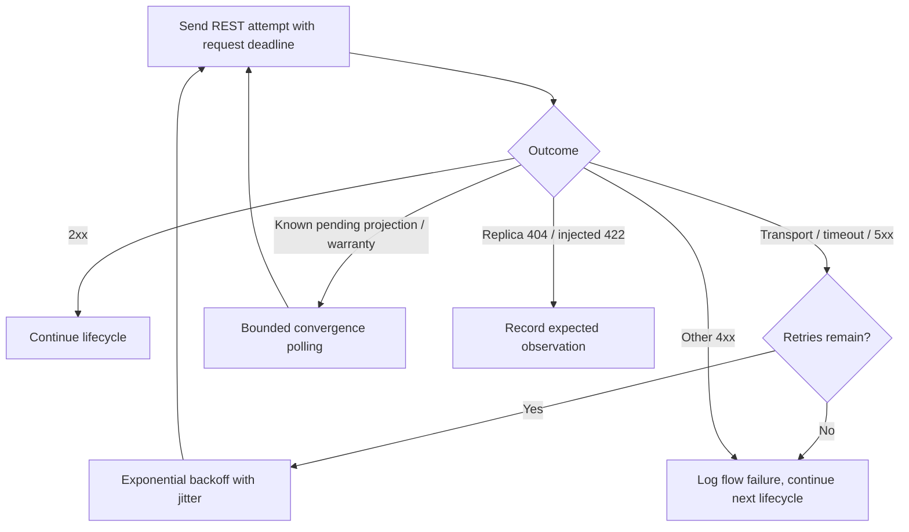

# Traffic Generator — thiết kế và hướng dẫn quan sát

[Mục lục](README.md) · [System Design](SYSTEM_DESIGN.md) · [API](API_CONTRACTS.md) · [Kết quả kiểm chứng](TRAFFIC_VALIDATION.md)

## 1. Mục tiêu và ranh giới

`traffic-generator` là process Python riêng mô phỏng client bằng `asyncio` và `httpx.AsyncClient`. Sau `docker compose up --build`, mặc định năm virtual users tạo dữ liệu liên tục qua REST của bốn service nghiệp vụ. Worker không có database credentials, Redis/Kafka clients, Docker socket hoặc port HTTP. Image chỉ cài HTTPX, Pydantic Settings và các dependency của chúng; không import shared platform runtime.

Bốn domain vẫn là Vehicle, Warranty, Inspection, Repair. Generator giữ trạng thái flow trong RAM và metrics trong file cục bộ; dừng rồi chạy lại tạo `run_id` mới, không resume flow dang dở. Đây là công cụ quan sát và kiểm thử workload, không phải workflow engine nghiệp vụ.



[Xem SVG](diagrams/traffic-architecture.svg). **Consumer nghiệp vụ hiện subscribe domain topics do outbox phát**. CDC là luồng quan sát row độc lập, không kích hoạt warranty/repair; subscribe cả hai để xử lý cùng side effect sẽ gây xử lý trùng.

## 2. Một lifecycle



[Xem SVG](diagrams/traffic-lifecycle.svg).

Mỗi virtual user chạy tuần tự một flow; nhiều user chạy đồng thời. Hai POST duplicate dùng `TaskGroup` đồng thời và kiểm cả ID trả về lẫn list inspection theo xe: phải đúng một row. `Idempotency-Key` giữ nguyên cho mọi attempt trong cùng ý định tạo inspection. Mỗi flow chỉ tạo một inspection, chỉ query Repair khi FAIL; Repair được tạo bởi Kafka consumer, không do generator POST `/repairs`.

Dữ liệu gồm VIN `TRF` + 14 ký tự random hợp lệ, manufacturer/model của VinFast/Toyota/Honda/Ford/Hyundai, year 2000–năm hiện tại, tên giả và owner mới sau PATCH. Unique constraint VIN là lớp bảo vệ cuối. Inspection dùng enum đang được API hỗ trợ: DELIVERY/PERIODIC/DIAGNOSTIC. FAIL chọn battery/brake/engine/sensor/tire issue; không thay enum nghiệp vụ chỉ để thêm các tên ví dụ.

`TRAFFIC_INTERVAL_MS` là thời gian nghỉ **sau mỗi flow**, không phải lịch phát request cố định. Throughput gần đúng trong trạng thái ổn định là `VIRTUAL_USERS / (thời gian flow + interval)`. Retry và chờ consumer làm giảm tốc độ tự nhiên; không tạo hàng đợi task vô hạn.

## 3. Retry, idempotency và timeout



[Xem SVG](diagrams/traffic-retry.svg). Sơ đồ giản lược; từng operation quyết định status nào là quan sát hợp lệ.

- Transport error, timeout, 5xx: tối đa `MAX_RETRIES` lần retry sau attempt đầu. Default 3 → tối đa 4 attempts. Backoff bắt đầu 200ms, tăng gấp đôi, capped 5s trước jitter ±20% (tối đa thực tế 6s).
- Deadline toàn attempt dùng `asyncio.timeout`; HTTPX đồng thời giới hạn các phase connect/read/write/pool. Latency ghi cho từng attempt không bao gồm backoff. [HTTPX timeout semantics](https://www.python-httpx.org/advanced/timeouts/) và [transport retry scope](https://www.python-httpx.org/advanced/transports/) giải thích vì sao worker tự điều phối retry.
- 400/401/422 và business 409 không retry chung. `vehicle_projection_not_ready` là 409 được polling có thời hạn vì projection phụ thuộc event. Warranty 404 `warranty_not_ready` và repair list rỗng cũng là trạng thái đang chờ consumer. Convergence deadline 45s; toàn flow tối đa 120s.
- POST vehicle giữ nguyên VIN/body qua retries. Nếu response bị mất sau commit hoặc gặp VIN conflict, tra `GET /vehicles?vin=...` trên primary rồi đối chiếu toàn bộ payload và `simulation_run_id`; chỉ nhận lại đúng xe của flow. Không tự đổi VIN và tạo xe thứ hai khi kết quả commit chưa rõ.
- PATCH giữ nguyên body; complete inspection cùng nội dung là idempotent theo API. DELETE retry có thể nhận 404 sau lần đầu đã commit; worker xác nhận VIN không còn trên primary.

Hết budget thì log `flow_failed`, virtual user nghỉ rồi tạo flow khác. Flow thất bại có thể để lại xe/inspection đã commit; không có distributed rollback. SIGTERM/SIGINT cancel tasks đang chạy, đóng HTTP pool và ghi `summary_final`. `scenario` thành công exit 0; flow lỗi exit 1. `restart: "no"` giữ scenario chạy đúng một lần; lỗi request không làm continuous process thoát.

## 4. Cấu hình

Giá trị mặc định có trong [.env.example](../.env.example), validation ở [config.py](../traffic_generator/config.py), wiring ở [Compose](../docker-compose.yml).

| Biến | Default | Ý nghĩa |
|---|---|---|
| TRAFFIC_ENABLED | true | false: continuous chỉ heartbeat/summary; scenario exit 0 không gọi API |
| TRAFFIC_MODE | continuous | continuous hoặc scenario; scenario luôn đúng một flow |
| VIRTUAL_USERS | 5 | 1–100 virtual users, chỉ áp dụng concurrency trong continuous |
| TRAFFIC_CONCURRENCY | 5 khi không có VIRTUAL_USERS | Alias; VIRTUAL_USERS được ưu tiên, kể cả khi lấy từ `.env` |
| TRAFFIC_INTERVAL_MS | 2000 | Nghỉ sau flow, 0–3600000ms |
| TRAFFIC_ERROR_RATE | 0.05 | Xác suất gửi thêm PATCH year=1800 để nhận 422; không sửa dữ liệu |
| REQUEST_TIMEOUT_SECONDS | 5 | Deadline mỗi attempt, >0 và ≤60s |
| MAX_RETRIES | 3 | 0–10; không tính attempt đầu |
| RETRY_BACKOFF_MS | 200 | Backoff ban đầu, 0–10000ms |
| DUPLICATE_REQUEST_RATE | 0.05 | Xác suất hai POST inspection đồng thời, cùng key |
| DELETE_RATE | 0.01 | Xác suất xóa xe mô phỏng cuối flow đã hoàn tất downstream |
| FAIL_INSPECTION_RATE | 0.30 | FAIL nghiệp vụ 30%, PASS 70%; khác lỗi HTTP |
| CONVERGENCE_TIMEOUT_SECONDS | 45 | Deadline mỗi bước chờ projection/warranty/repair, ≤300s |
| FLOW_TIMEOUT_SECONDS | 120 | Deadline toàn flow, ≤900s |
| SUMMARY_INTERVAL_SECONDS | 30 | Periodic summary, 1–300s |
| REPLICA_READ_DELAYS_MS | 0,100,500,1000 | Các mốc tính từ lúc bắt đầu quan sát sau POST; tối đa 10 mốc, ≤10000ms |
| VEHICLE_SERVICE_URL | http://vehicle-service:8000 | Base URL Vehicle trong Docker network |
| WARRANTY_SERVICE_URL | http://warranty-service:8000 | Base URL Warranty |
| INSPECTION_SERVICE_URL | http://inspection-service:8000 | Base URL Inspection |
| REPAIR_SERVICE_URL | http://repair-service:8000 | Base URL Repair |
| TRAFFIC_STATUS_FILE | /tmp/traffic-generator-status.json | File cục bộ; override qua `compose run -e` hoặc Compose override |

Các rate thuộc [0,1] và là xác suất **theo flow**, không bảo đảm đúng tỷ lệ trên mẫu nhỏ. Bốn service URL được gán trong Compose; dùng Compose override hoặc `run -e` khi đổi endpoint. Chạy với Docker DNS, không trỏ `localhost` trong container.

## 5. Start, stop và chạy một scenario

```sh
# Tự chạy continuous sau bốn API healthy và Debezium init thành công
docker compose up --build -d --wait
docker compose logs -f --tail=50 traffic-generator

# Dừng riêng generator; các service và dữ liệu vẫn còn
make traffic-stop
# Chạy lại riêng generator, áp dụng config mới
make traffic-start
# Xem heartbeat và counters của process hiện tại
make traffic-status

# Chạy một flow bên cạnh continuous, rồi exit
make traffic-scenario
# Kịch bản FAIL + duplicate + DELETE chắc chắn, hữu ích khi xem CDC
# Có thể dừng continuous trước nếu muốn logs dễ theo dõi hơn
docker compose run --rm --no-deps -e TRAFFIC_MODE=scenario \
  -e FAIL_INSPECTION_RATE=1 -e DUPLICATE_REQUEST_RATE=1 -e DELETE_RATE=1 traffic-generator

# Đổi concurrency/interval của continuous đang chạy
VIRTUAL_USERS=10 TRAFFIC_INTERVAL_MS=1000 docker compose up -d --no-deps traffic-generator
# Giữ container hoạt động nhưng không tạo traffic
TRAFFIC_ENABLED=false docker compose up -d --no-deps traffic-generator
# Khôi phục mặc định đã đặt trong .env/Compose
docker compose up -d --no-deps traffic-generator
```

`--no-deps` chỉ dùng sau khi stack đã khởi động. Khi `TRAFFIC_MODE=scenario` đặt cho toàn Compose, container sẽ thoát sau một flow; dùng `compose run` để kiểm exit code, tránh `up --wait` vốn dành cho service chạy dài. [Compose startup order](https://docs.docker.com/compose/how-tos/startup-order/) chỉ bảo đảm thứ tự khởi động, không tự dừng generator khi dependency mất readiness về sau.

Healthcheck generator đọc heartbeat mỗi giây, chấp nhận `running`/`disabled` và tuổi heartbeat <15s. Healthy chứng minh event loop còn sống; **không chứng minh flow đang thành công**. Kiểm thêm `flows_completed`, `flows_failed`, retries và consumer lag.

## 6. INSERT / UPDATE / DELETE qua REST

Create lưu nullable UUID `simulation_run_id` trên `vehicles`; xe có marker phải dùng VIN bắt đầu `TRF`. Marker không sửa được qua PATCH. DELETE yêu cầu cả persisted marker bằng `X-Simulation-Run-ID` lẫn prefix `TRF`; row thường hoặc run khác trả 403. Thiếu/sai UUID header trả 422; row không còn trả 404. API khóa row, xóa, commit và invalidate cache. Migration `0002_simulation_marker` chỉ thêm cột nullable, giữ dữ liệu hiện hữu.

Generator chỉ xóa xe vừa được chính run đó tạo, sau khi đã quan sát warranty và repair nếu FAIL. Tỷ lệ mặc định 1%. DELETE tạo WAL → CDC `op=d`, sau đó tombstone. Không phát `vehicle.deleted`, không cascade qua các database; warranty/inspection/repair/projection vẫn giữ lịch sử. Đây là endpoint dành cho dữ liệu mô phỏng của lab, không phải contract xóa xe nghiệp vụ hoàn chỉnh.

Marker/header chống xóa nhầm; **không phải authentication** vì lab chưa phân quyền và marker được trả trong API. Dữ liệu cũ không có marker nên được bảo vệ bởi endpoint này. Generator không tự dọn dữ liệu từ run trước.

## 7. Quan sát realtime

### Kafka UI và consumer

Mở [Kafka UI](http://localhost:8080) → Topics → Messages. Domain topics: `vehicle-events`, `warranty-events`, `inspection-events`, `repair-events`. CDC topics: `vehicle-cdc.public.vehicles`, `warranty-cdc.public.warranties`, `inspection-cdc.public.inspections`, `repair-cdc.public.repair_requests`. Xem partition/leader/ISR rồi Consumer Groups: `warranty-service-v1`, `inspection-service-v1`, `repair-service-v1`; đối chiếu lag với tốc độ traffic.

Lọc domain message theo `correlation_id` lấy từ `flow_completed`; tất cả domain events của flow giữ ID này qua middleware/outbox/consumers. CDC native envelope không có HTTP correlation ID: nối theo key row ID, `vehicle_id`, và `simulation_run_id` trên vehicle before/after. `source.lsn`, `source.db`, `source.table`, `op` giúp xác nhận thay đổi xuất phát từ WAL. DELETE_RATE thấp có thể chưa thấy `d` trong vài flow; chạy scenario ép DELETE=1 để quan sát chắc chắn.

```sh
docker compose exec kafka-1 /opt/kafka/bin/kafka-consumer-groups.sh \
  --bootstrap-server kafka-1:9092,kafka-2:9092,kafka-3:9092 --all-groups --describe
```

### PostgreSQL primary và replica

```sh
# Xe mới của generator; lấy run_id để lọc một phiên
docker compose exec postgres-primary psql -U platform_admin -d vehicle_db \
  -c 'SELECT id,vin,owner_name,simulation_run_id,created_at FROM vehicles WHERE simulation_run_id IS NOT NULL ORDER BY created_at DESC LIMIT 10;'
docker compose exec postgres-primary psql -U platform_admin -d warranty_db \
  -c 'SELECT id,vehicle_id,status FROM warranties ORDER BY created_at DESC LIMIT 10;'
docker compose exec postgres-primary psql -U platform_admin -d inspection_db \
  -c 'SELECT id,vehicle_id,result,status FROM inspections ORDER BY created_at DESC LIMIT 10;'
docker compose exec postgres-primary psql -U platform_admin -d repair_db \
  -c 'SELECT id,vehicle_id,inspection_id FROM repair_requests ORDER BY created_at DESC LIMIT 10;'
docker compose exec postgres-replica psql -U platform_admin -d vehicle_db \
  -c 'SELECT pg_is_in_recovery(),pg_last_wal_receive_lsn(),pg_last_wal_replay_lsn(); SELECT id,simulation_run_id FROM vehicles ORDER BY created_at DESC LIMIT 10;'
docker compose exec postgres-primary psql -U platform_admin -d postgres \
  -c 'SELECT application_name,state,sync_state,pg_wal_lsn_diff(pg_current_wal_lsn(),replay_lsn) AS lag_bytes FROM pg_stat_replication;'
```

So sánh cùng vehicle ID; hai query đếm tổng chạy ở hai thời điểm khác nhau khi traffic vẫn ghi không đủ để kết luận replication lỗi. Generator gọi GET `?consistency=eventual` ở bốn mốc, log `target_delay_ms`, `elapsed_ms`, `visible`, `read_source`. 404 sớm là `eventual_miss` hợp lệ; 200 `primary-fallback` khi replica lỗi không được tính là replica đã bắt kịp. Với tải nhỏ, cả bốn lần đều có thể thấy row ngay. Dùng bài pause replay trong [PostgreSQL runbook](POSTGRESQL_CDC.md) để tạo lag có chủ đích.

### Debezium

```sh
curl -fsS http://localhost:8083/connectors
for service in vehicle warranty inspection repair; do
  curl -fsS "http://localhost:8083/connectors/$service-postgres-connector/status"
done
docker compose logs -f --tail=40 debezium-connect
```

Connector và task đều phải RUNNING. Khi Connect down, business outbox vẫn chạy; sau restart connector đọc bù WAL còn trong slot. Xem retained bytes/LSN bằng SQL trong [runbook](POSTGRESQL_CDC.md); RUNNING tự nó không chứng minh không có backlog.

### Redis Cluster

```sh
docker compose exec redis-1 redis-cli cluster nodes
# SCAN chỉ duyệt một node; duyệt tất cả masters, kể cả role đã đổi sau failover
for node in redis-1 redis-2 redis-3 redis-4 redis-5 redis-6; do
  if docker compose exec -T "$node" redis-cli --raw role | head -n 1 | grep -q master; then
    docker compose exec -T "$node" redis-cli --scan --pattern 'vehicle:*'
    docker compose exec -T "$node" redis-cli --scan --pattern 'idem:*'
    docker compose exec -T "$node" redis-cli --scan --pattern 'lock:*'
  fi
done
```

Key thật là `vehicle:{UUID}` và `:generation`, `idem:inspection-service:…`, `lock:warranty-service:…`/`lock:repair-service:…`. Lock sống ngắn có thể biến mất trước SCAN. Dùng `redis-cli -c GET 'vehicle:{UUID}'` để follow MOVED tới node giữ slot. Mỗi flow log expected MISS → HIT → PATCH → MISS và observed `X-Cache`; Redis outage có thể làm lần mong HIT thành MISS. Header MISS cũng bao gồm fallback DB, nên đối chiếu Redis/service logs khi chẩn đoán. Value sau PATCH phải có owner mới; nếu stale sẽ có `cache_value_stale` riêng, không che mất quan sát failover.

### Logs và metrics

```sh
docker compose logs -f --tail=50 traffic-generator
docker compose logs -f --tail=50 vehicle-service warranty-service inspection-service repair-service
make traffic-status
```

JSON request logs có timestamp, run_id, flow_id, virtual_user, correlation_id, request_id, vehicle_id khi đã biết, target_service, endpoint, method, attempt, status_code, latency_ms, result, error, cache và read_source. Mỗi attempt có request ID mới, toàn flow giữ correlation ID. `response_request_id` cho phép kiểm middleware echo.

Summary mỗi 30s gồm `total_requests`, `successful_requests` (2xx), `failed_requests` (4xx/5xx/transport), `expected_error_responses` là **tập con** failed gồm injected422/pending404/409, retries, flows started/completed/failed/cancelled, vehicles/inspections/repairs, PASS/FAIL, duplicate verified, deleted vehicles, cache và replica counters. Counter chưa phát sinh có thể vắng mặt (=0). `created_repairs` nghĩa là repair do consumer tạo đã được worker quan sát qua API; không phải POST từ worker.

Average latency tính trên toàn process; p95 nearest-rank tính trên tối đa 10.000 attempts gần nhất để bộ nhớ có giới hạn. Latency không phải thời gian toàn lifecycle. Metrics reset khi process restart. Chưa có control API/Prometheus endpoint; dùng Compose start/stop/config và file status. Docker giới hạn JSON logs 3 files ×10MB, nhưng PostgreSQL rows/ledger/WAL và Kafka lưu trữ vẫn tăng theo traffic; DELETE 1% không phải retention policy cho toàn hệ thống.

## 8. Thử lỗi và kiểm chứng

```sh
make test             # Tự pause generator nếu đang chạy, restore sau khi xong
make lint
make traffic-test     # Hai scenario ép PASS/FAIL, duplicate, 422, CDC c/u/d
make traffic-drills   # Dừng từng dependency và chứng minh worker vẫn tiến triển
```

`scripts/traffic_drills.sh` là orchestrator bên ngoài worker. Nó chọn Kafka leader/Redis master đang thực sự giữ role, lần lượt dừng một node, replica, Connect, Warranty; bốn infrastructure outages được giữ ít nhất 10s; phục hồi từng container bằng trap rồi kiểm cluster/DB cuối bài. Không chạy đồng thời với những fault drills khác. Worker không có quyền và không tự shutdown infrastructure.

| Dependency bị dừng | Quan sát mong đợi |
|---|---|
| Một Kafka broker | Election/retry; domain events tiếp tục khi ISR đủ, worker còn hoàn tất flow |
| Một Redis master | Promotion, có thể MISS/retry/fallback; flow khác tiếp tục |
| PostgreSQL replica | `primary-fallback`, writes vẫn chạy |
| Debezium Connect | Business lifecycle tiếp tục; CDC bắt kịp sau recovery |
| Warranty Service | HTTP retries hết hạn → flow_failed; virtual user tiếp tục tạo xe/flow mới; sau recovery có flow hoàn tất |

Warranty outage có thể khiến Repair consumer retry rồi DLQ; generator không tự replay DLQ. Xem [Operations](OPERATIONS.md) để xử lý event cũ, không suy luận mọi flow lỗi tự hồi phục. Các drill cũ vốn chờ global outbox/lag về 0 nên dừng traffic trước; riêng `traffic-drills` cần worker đang chạy.

Code: [worker](../traffic_generator/worker.py), [metrics](../traffic_generator/metrics.py), [healthcheck](../traffic_generator/healthcheck.py), [Dockerfile](../Dockerfile.traffic), [scenario observer](../scripts/traffic_verify.py). Observer trong toolbox được phép đọc Kafka để kiểm bằng chứng; generator vẫn chỉ gọi REST.
