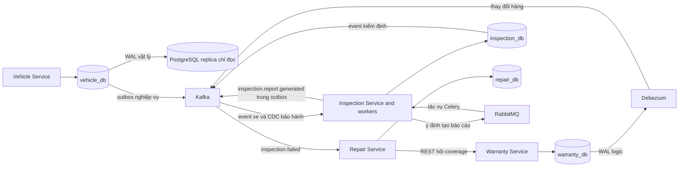

# Tổng quan hệ thống cơ sở dữ liệu

## 1. Topology và ownership

Ứng dụng dùng PostgreSQL với bốn database độc lập. Cả bốn cùng nằm trên một cụm gồm máy chủ chính và máy chủ sao lưu đọc. Mỗi service có một database và tài khoản ứng dụng riêng; service không được đọc trực tiếp database của service khác. Cách chia này đặt ranh giới sở hữu ở database, nhưng không tạo bốn failure domain độc lập vì các database vẫn dùng chung máy chủ PostgreSQL và Docker host.

| Database | Owner service | Source of truth |
|---|---|---|
| Database | Service sở hữu | Dữ liệu quyết định tại đây |
|---|---|---|
| `vehicle_db` | Vehicle Service | Xe và yêu cầu bền vững để gọi Warranty tạo bảo hành mặc định |
| `warranty_db` | Warranty Service | Bảo hành, trạng thái và kết quả kiểm tra coverage hiện tại |
| `inspection_db` | Inspection Service | Kiểm định, bản chiếu xe/bảo hành, yêu cầu phát hành báo cáo và tệp PDF |
| `repair_db` | Repair Service | Phiếu sửa chữa, ảnh chụp coverage lúc tạo phiếu và notification mô phỏng |

Mỗi database có ba bảng hỗ trợ giao tiếp được tạo chung: `outbox_events`, `processed_events`, `idempotency_records`. Ngoài ra có `alembic_version` để lưu revision schema và `cdc_heartbeat` để Debezium có thể ghi heartbeat. Các bảng dùng chung có cùng tên nhưng dữ liệu không dùng chung: mỗi bản ghi nằm trong database của service tạo ra nó. `cdc_heartbeat` không phải dữ liệu nghiệp vụ. Bảng và cột được giải thích trong [Bảng và chỉ mục](TABLES_AND_INDEXES.md).

**Ý nghĩa các đường dữ liệu:** máy chủ chính xử lý ghi và các lần đọc cần thấy dữ liệu mới nhất. Máy chủ sao lưu nhận bản sao WAL vật lý bất đồng bộ; độ trễ có thể khiến bản sao chưa thấy giao dịch vừa commit. Hệ thống hiện không tự nâng máy chủ sao lưu thành máy chủ chính khi máy chủ chính lỗi. Debezium đọc WAL logic qua bốn logical replication slot và phát thay đổi các bảng đã đăng ký. Kafka giữ stream event để nhiều consumer có thể đọc; RabbitMQ phân phối lệnh render báo cáo cho một worker nhận mỗi tác vụ.

Các database cùng trên một PostgreSQL cluster nghĩa là quyền truy cập và schema được tách, nhưng tài nguyên CPU, bộ nhớ, đĩa và sự cố máy chủ vẫn dùng chung. Replica hỗ trợ đọc một đường riêng và lưu bản sao; nó không thay thế backup hay failover tự động. Chi tiết: [PostgreSQL & CDC](../POSTGRESQL_CDC.md), [Cluster Infrastructure](../CLUSTER_INFRASTRUCTURE.md), [Background Tasks](../BACKGROUND_TASKS.md).

## 2. Kết nối và giao dịch

- Ứng dụng dùng SQLAlchemy để ánh xạ Python object thành SQL; API bất đồng bộ kết nối qua `asyncpg`. Pool giữ tối đa 5 kết nối thường và cho phép thêm tối đa 5 kết nối tạm khi đông tải. Thời gian chờ lấy kết nối và thời gian mở kết nối mặc định là 3 giây.
- PostgreSQL hủy câu SQL chạy quá 10 giây theo mặc định. Kết nối ở trạng thái transaction mở nhưng không hoạt động quá 30 giây cũng bị đóng. Mỗi lần đọc từ replica có deadline ứng dụng mặc định 3 giây.
- Mỗi request hoặc tác vụ nền mở session riêng. Lớp service sở hữu transaction; repository chỉ đọc/ghi trong session nhận được, không tự commit giữa workflow.
- Trước khi API chạy, Alembic áp dụng các migration còn thiếu đến revision mới nhất. Advisory lock của PostgreSQL ngăn hai replica chạy migration đồng thời trên cùng database. Ứng dụng không tự tạo bảng bằng `create_all()` khi khởi động.
- Celery report worker là tiến trình đồng bộ, dùng SQLAlchemy và psycopg với pool riêng: 1 kết nối thường và tối đa 1 kết nối bổ sung cho mỗi tiến trình worker.

Các giá trị cấu hình nằm trong [config.py](../../common/platform_common/config.py), cách tạo pool trong [db.py](../../common/platform_common/db.py), và khóa migration trong `services/<service>/migrations/env.py`. Đây là giới hạn mỗi tiến trình; khi scale số replica, tổng số kết nối có thể tăng theo số tiến trình.

## 3. Read/write routing

Mặc định cả kết nối đọc và ghi đều trỏ đến máy chủ chính qua `WRITE_DATABASE_URL`. Chỉ Vehicle GET có `consistency=eventual` dùng `READ_DATABASE_URL` để đọc replica. Ứng dụng đánh dấu transaction replica là chỉ đọc. Nếu kết nối hoặc truy vấn replica lỗi ở mức database/timeout, ứng dụng thử lại trên primary. Nếu truy vấn thành công nhưng không tìm thấy row, đó là kết quả hợp lệ của một replica chậm; ứng dụng trả 404 thay vì đọc lại primary. Đường đọc eventual bỏ qua Redis cache để không trộn freshness của cache với độ trễ replication.

| Operation | Nơi đọc/ghi | Lưu ý consistency |
|---|---|---|
| Tạo/cập nhật dữ liệu nghiệp vụ | Primary, trong database thuộc service | Row nghiệp vụ và event outbox cùng transaction nếu mutation phát event |
| Đọc thông thường | Primary; Vehicle có thể trả Redis cache | Các API khác không dùng replica cho request đọc |
| Vehicle eventual read | Replica; fallback primary nếu truy vấn/kết nối thất bại | Có thể trả dữ liệu cũ hoặc 404 cho row đã có trên primary |
| Đồng bộ warranty sang Inspection | WAL logic → Debezium → Kafka → database của Inspection | Độ trễ đồng bộ là eventual; bản chiếu không quyết định coverage Repair |
| Repair hỏi coverage | Repair gọi Warranty API | Kết quả tại thời điểm hỏi được lưu thành snapshot trên repair row |

Không có transaction xuyên database, khóa ngoại xuyên database, phép nối xuyên database hoặc cascade xuyên database. Nếu một thao tác cần dữ liệu service khác, hệ thống dùng REST để hỏi trực tiếp hoặc event/CDC để cập nhật bản chiếu cục bộ. Bản chiếu giúp tránh truy cập database của service sở hữu nhưng có thể trễ. Mô hình consistency và cửa sổ lỗi được giải thích ở [Consistency and Failures](../CONSISTENCY_AND_FAILURES.md).

## 4. Write path và reliability

Khi mutation cần phát event, service ghi dữ liệu nghiệp vụ và row PENDING trong `outbox_events` trong cùng transaction. Vì vậy không thể commit xe nhưng đánh mất ý định phát `vehicle.created` do process chết ngay sau commit. Worker chỉ chọn event đến hạn nếu không có event cũ hơn của cùng aggregate đang chờ, gửi đến Kafka, rồi đánh dấu row PUBLISHED. Nếu broker đã nhận nhưng ứng dụng chết trước khi commit trạng thái PUBLISHED, event có thể được gửi lần nữa.

Consumer trước tiên chèn `(event_id, consumer_name)` vào `processed_events`; sau đó chạy handler trong cùng transaction. Nếu handler lỗi thì marker cũng rollback. Kafka offset chỉ được commit sau khi transaction database kết thúc. Mô hình giao nhận là "ít nhất một lần": event có thể được giao lại, còn marker bền vững và khóa duy nhất nghiệp vụ ngăn lặp tác động. Đây không phải cam kết "đúng một lần" xuyên database, Kafka và HTTP.

Khi hoàn tất inspection, một transaction trong `inspection_db` cập nhật inspection, tạo row `inspection_reports` ở trạng thái PENDING và ghi event outbox. Dispatcher gửi tác vụ đến RabbitMQ bằng publisher confirm; worker render PDF ngoài transaction dài. Khi kết quả được tạo, một transaction mới lưu bytes PDF, mã SHA-256, metadata và event `inspection.report.generated` trong outbox. Repair consumer sau đó tìm repair theo inspection ID và gắn số báo cáo/hash vào phiếu. Báo cáo PASS không gắn vào repair; event báo cáo FAIL có thể đến khi Repair chưa có phiếu và khi đó handler ghi log, không tự retry tìm phiếu.

## 5. Đọc tiếp

- Table/column/index: [Tables and Indexes](TABLES_AND_INDEXES.md)
- Lifecycle và transaction behavior: [Behavior and Transactions](BEHAVIOR.md)
- Câu query và file thực thi: [Query Catalog](QUERY_CATALOG.md)
- ERD/state machine: [Data Model](../DATA_MODEL.md)