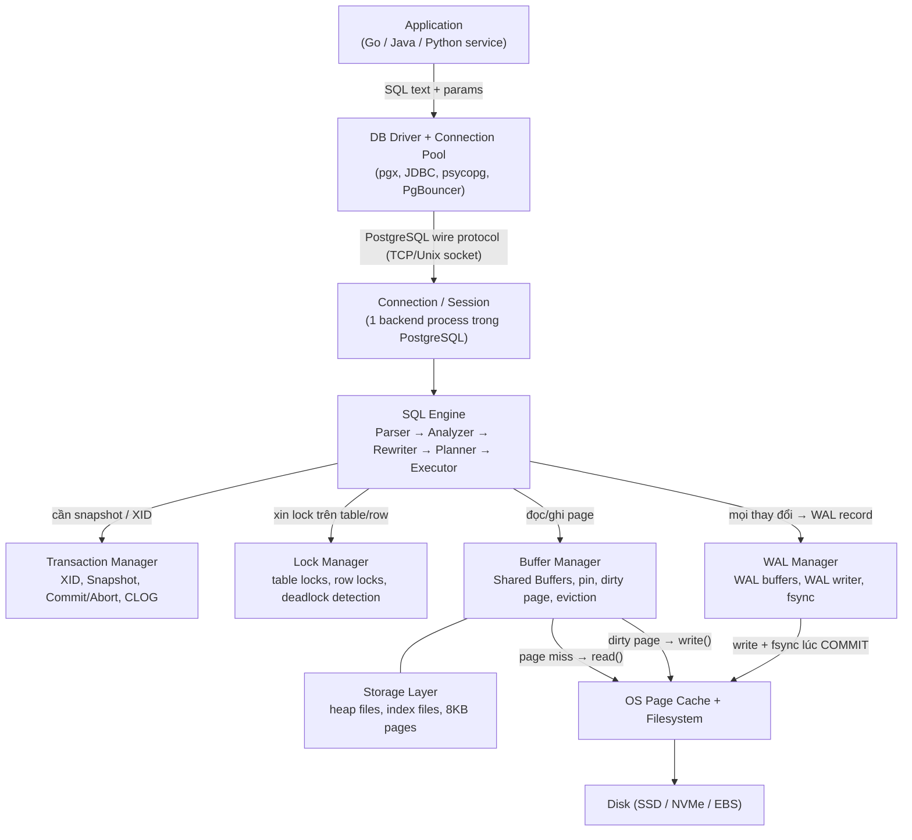
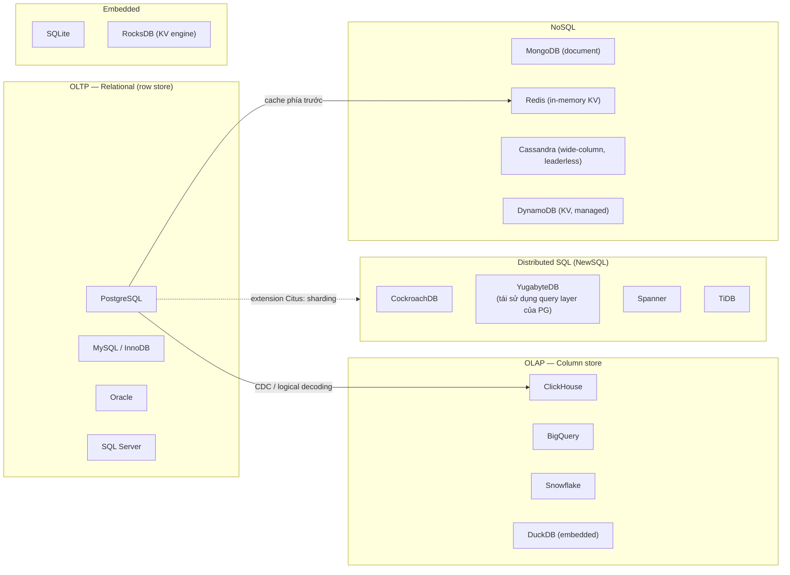
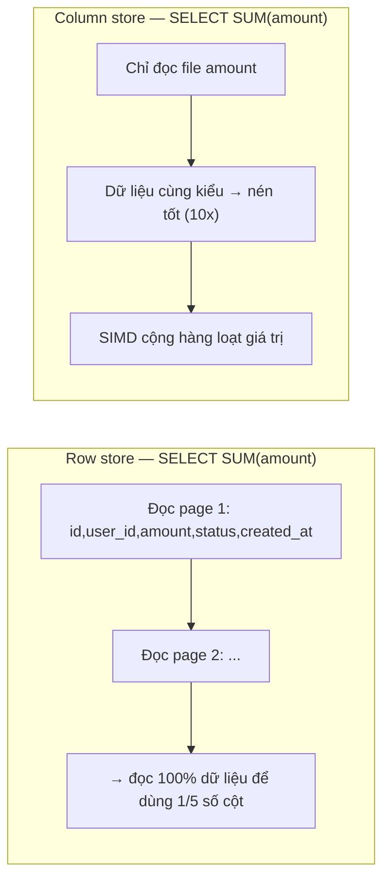
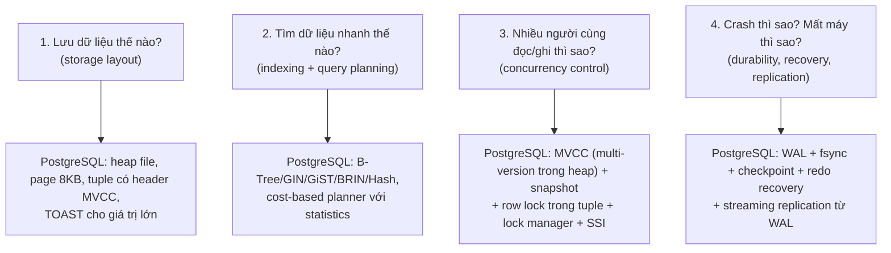

# PART 0 — DATABASE MENTAL MODEL

> **Vị trí trong handbook:** Chương mở đầu. Đọc trước mọi chương khác.
> **Tiếp theo:** [01 — Relational Database Fundamentals](01-relational-database.md)
> **Phiên bản tham chiếu:** PostgreSQL 18 (stable tại thời điểm viết). Khi behavior khác giữa các version, tài liệu sẽ ghi rõ.

---

## Mục lục

1. [Tại sao cần một mental model trước khi học PostgreSQL](#1-tại-sao-cần-một-mental-model-trước-khi-học-postgresql)
2. [Database, DBMS, Database Engine](#2-database-dbms-database-engine)
3. [Hành trình của một request: Application → Disk](#3-hành-trình-của-một-request-application--disk)
4. [Relational Database và SQL Database](#4-relational-database-và-sql-database)
5. [PostgreSQL nằm ở đâu trong hệ sinh thái](#5-postgresql-nằm-ở-đâu-trong-hệ-sinh-thái)
6. [OLTP vs OLAP](#6-oltp-vs-olap)
7. [Row-oriented vs Column-oriented](#7-row-oriented-vs-column-oriented)
8. [RDBMS vs NoSQL](#8-rdbms-vs-nosql)
9. [Disk-based, In-memory, Embedded, Distributed](#9-disk-based-in-memory-embedded-distributed)
10. [Bốn bài toán cốt lõi mà mọi database phải giải](#10-bốn-bài-toán-cốt-lõi-mà-mọi-database-phải-giải)
11. [Interview Questions](#11-interview-questions)
12. [Key Takeaways](#12-key-takeaways)

---

## 1. Tại sao cần một mental model trước khi học PostgreSQL

Phần lớn engineer tiếp xúc với database qua **SQL** và **ORM**. Ở tầng đó, database trông giống một "hộp đen": gửi câu query vào, nhận kết quả ra. Mental model "hộp đen" đủ dùng khi hệ thống nhỏ, nhưng sụp đổ ngay khi gặp các câu hỏi production:

- Tại sao cùng một câu query, hôm qua chạy 5ms, hôm nay chạy 30 giây?
- Tại sao table chỉ có 1 triệu row mà chiếm 40GB disk?
- Tại sao `UPDATE` một cột nhỏ lại sinh ra hàng GB WAL?
- Tại sao replica trả về dữ liệu cũ?
- Tại sao thêm index lại làm `INSERT` chậm?
- Tại sao một transaction "không làm gì" (idle) lại khiến cả database chậm dần?

Không câu nào trong số này trả lời được nếu chỉ biết SQL. Chúng chỉ trả lời được khi ta nhìn database như **một hệ thống gồm nhiều component có trách nhiệm riêng**, mỗi component có cấu trúc dữ liệu, có chi phí, có giới hạn và có failure mode riêng.

Mental model mà toàn bộ handbook này xây dựng là:

```
Application → Connection → SQL → Parser → Planner → Executor → Index → Buffer
→ Page → Tuple → Transaction → MVCC → Locks → WAL → Disk → Vacuum
→ Replication → HA → Scaling
```

Chương này dựng "khung xương" của mental model đó ở mức hệ thống. Các chương sau sẽ đào sâu từng khúc xương.

---

## 2. Database, DBMS, Database Engine

Ba thuật ngữ này hay bị dùng lẫn lộn. Tách bạch chúng là bước đầu tiên để suy nghĩ chính xác.

### 2.1 WHAT

| Thuật ngữ | Định nghĩa chính xác | Ví dụ |
|---|---|---|
| **Database** | Một tập hợp dữ liệu có tổ chức, có cấu trúc, được lưu trữ bền vững (persistent) và được quản lý như một đơn vị. | Database `shop` chứa các table `users`, `orders`, `products`. |
| **DBMS (Database Management System)** | Phần mềm quản lý database: cho phép định nghĩa cấu trúc, lưu trữ, truy vấn, cập nhật, bảo vệ tính toàn vẹn, xử lý đồng thời, phục hồi sau sự cố. | PostgreSQL, MySQL, Oracle, SQL Server, MongoDB. |
| **Database Engine / Storage Engine** | Phần lõi bên trong DBMS chịu trách nhiệm lưu trữ và truy xuất dữ liệu vật lý: page, buffer, index, log, transaction. | InnoDB (engine của MySQL), heap access method của PostgreSQL, WiredTiger (MongoDB). |

Một cách nhớ:

- **Database** là *dữ liệu*.
- **DBMS** là *toàn bộ phần mềm* bao quanh dữ liệu.
- **Engine** là *bộ phận bên trong DBMS* thực sự chạm vào byte trên disk.

### 2.2 WHY — Tại sao không lưu dữ liệu thẳng vào file?

Hãy tưởng tượng ta tự lưu dữ liệu người dùng vào một file JSON. Các vấn đề xuất hiện ngay:

1. **Concurrency:** Hai request cùng ghi file → một request ghi đè thay đổi của request kia (lost update), hoặc file bị hỏng vì hai process ghi xen kẽ.
2. **Atomicity:** Chuyển tiền cần trừ tài khoản A và cộng tài khoản B. Process crash sau khi trừ A nhưng trước khi cộng B → tiền "bốc hơi".
3. **Durability:** `write()` trả về thành công không có nghĩa dữ liệu đã nằm trên disk; nó có thể vẫn ở OS page cache. Mất điện → mất dữ liệu.
4. **Query:** Tìm user có `email = 'x'` phải đọc toàn bộ file. 100 triệu user → mỗi lần tìm đọc hàng chục GB.
5. **Integrity:** Không có gì ngăn ai đó ghi một order trỏ tới user không tồn tại.
6. **Recovery:** File bị hỏng giữa chừng → không có cách nào khôi phục về trạng thái nhất quán.

DBMS tồn tại để giải quyết *toàn bộ* những vấn đề này **một lần, một cách đúng đắn**, để application không phải tự giải lại. Mỗi vấn đề ở trên tương ứng với một subsystem trong PostgreSQL:

| Vấn đề | Subsystem trong PostgreSQL | Chương |
|---|---|---|
| Concurrency | MVCC, Lock Manager, Isolation | [11](11-mvcc.md), [12](12-isolation-level.md), [13](13-locking.md) |
| Atomicity | Transaction Manager, CLOG, WAL | [09](09-transaction.md), [10](10-acid.md) |
| Durability | WAL, fsync, Checkpoint | [20](20-wal.md), [21](21-checkpoint.md) |
| Query nhanh | Index, Query Planner | [15](15-index-internals.md), [17](17-query-planner.md) |
| Integrity | Constraints, Foreign Key | [01](01-relational-database.md) |
| Recovery | Crash Recovery, PITR | [22](22-crash-recovery.md), [31](31-backup-pitr.md) |

---

## 3. Hành trình của một request: Application → Disk

### 3.1 WHAT

Khi application gửi một câu SQL, câu SQL đó đi qua một chuỗi component. Hiểu chuỗi này là hiểu "database hoạt động như thế nào" ở mức hệ thống.



**Cách đọc diagram (từ trên xuống):**

1. **Application** tạo câu SQL, thường có tham số (`$1`, `$2`).
2. **Driver + Pool** giữ sẵn một số connection mở tới PostgreSQL; request mượn một connection, gửi SQL qua **PostgreSQL wire protocol** (giao thức nhị phân chạy trên TCP hoặc Unix domain socket).
3. Ở phía server, mỗi connection được phục vụ bởi **một backend process riêng** (PostgreSQL dùng mô hình *process-per-connection*, xem [Chương 04](04-postgresql-architecture.md)).
4. **SQL Engine** biến text thành một *plan* thực thi được: parse cú pháp → phân tích ngữ nghĩa → áp dụng rule/view → chọn plan rẻ nhất → thực thi.
5. Trong lúc thực thi, executor cần:
   - **Transaction Manager** để biết mình thuộc transaction nào, được "nhìn thấy" version nào của dữ liệu (snapshot).
   - **Lock Manager** để tránh xung đột với các transaction khác (ví dụ: không cho `DROP TABLE` khi đang đọc table).
   - **Buffer Manager** để lấy page dữ liệu. Page có sẵn trong RAM (shared buffers) → cache hit. Không có → đọc từ OS/disk.
6. Mọi thay đổi dữ liệu đều sinh ra **WAL record** (Write-Ahead Log). Lúc `COMMIT`, WAL phải được `fsync` xuống disk trước khi báo thành công cho client — đây là nền tảng của **durability**.
7. Dữ liệu thật (data page) được ghi xuống disk **muộn hơn**, bất đồng bộ, bởi background writer và checkpointer.

### 3.2 WHY — Tại sao phải chia nhiều tầng như vậy?

Mỗi tầng tách ra vì nó giải quyết một mối quan tâm (concern) độc lập, và có chi phí rất khác nhau:

| Tầng | Đơn vị làm việc | Chi phí điển hình |
|---|---|---|
| Network round-trip | 1 request/response | 0.1–1 ms (cùng datacenter) |
| Parse + Plan | 1 câu SQL | 0.05–vài ms (có thể lớn hơn với query phức tạp hoặc nhiều partition) |
| Buffer hit (RAM) | 1 page 8KB | ~ micro giây |
| OS page cache hit | 1 page 8KB | vài micro giây (thêm chi phí syscall + copy) |
| SSD random read | 1 page | ~50–150 µs |
| HDD random read | 1 page | ~5–10 ms |
| fsync WAL | 1 commit | ~vài chục µs (NVMe có power-loss protection) tới vài ms (cloud block storage) |

Khoảng cách giữa RAM và disk là **3–5 bậc độ lớn**. Toàn bộ kiến trúc database xoay quanh việc **giảm số lần chạm disk** (index, buffer cache) và **biến random write thành sequential write** (WAL), trong khi vẫn đảm bảo dữ liệu không bị mất.

### 3.3 Mental model then chốt: "Ghi log trước, ghi data sau"

Nếu chỉ nhớ một ý từ chương này, hãy nhớ ý sau:

> Khi bạn `COMMIT`, PostgreSQL **không** ghi các data page đã thay đổi xuống disk. Nó chỉ đảm bảo **WAL record mô tả thay đổi** đã nằm an toàn trên disk. Data page được ghi sau. Nếu crash xảy ra trước đó, PostgreSQL dùng WAL để **làm lại (redo)** các thay đổi.

Lý do:

- Một transaction có thể sửa 50 page nằm rải rác khắp các file → ghi 50 page là 50 random write.
- WAL là một file append-only → ghi WAL là **sequential write**, và nhiều transaction có thể được flush trong **một** lần `fsync` (group commit).

Ý tưởng này xuyên suốt: [WAL](20-wal.md) → [Checkpoint](21-checkpoint.md) → [Crash Recovery](22-crash-recovery.md) → [Replication](25-replication.md) (replica chính là "crash recovery chạy mãi không dừng").

---

## 4. Relational Database và SQL Database

### 4.1 WHAT

- **Relational Database** là database tổ chức dữ liệu theo **relational model** do Edgar F. Codd đề xuất năm 1970: dữ liệu là tập hợp các *relation* (bảng), mỗi relation là tập hợp các *tuple* (hàng) có cùng tập *attribute* (cột); quan hệ giữa các thực thể được biểu diễn bằng *giá trị* (key), không phải bằng con trỏ vật lý.
- **SQL (Structured Query Language)** là ngôn ngữ khai báo (declarative) để định nghĩa và truy vấn dữ liệu quan hệ. "SQL database" thường được dùng như đồng nghĩa với "relational database", dù về lý thuyết SQL không hoàn toàn trung thành với relational model (ví dụ: SQL cho phép row trùng lặp — *bag semantics* — và có `NULL` với logic ba giá trị).

### 4.2 WHY — Relational model giải quyết vấn đề gì?

Trước relational model, các database phổ biến là **hierarchical** (IBM IMS) và **network** (CODASYL). Ở đó, application phải *điều hướng* dữ liệu bằng con trỏ: "đi từ record khách hàng, theo con trỏ tới danh sách order, rồi theo con trỏ tới từng item". Hậu quả:

- Application gắn chặt với cấu trúc vật lý. Đổi cách lưu → phải sửa code.
- Truy vấn theo hướng không được thiết kế trước (ví dụ: "tìm mọi khách hàng đã mua sản phẩm X") rất khó.

Relational model đưa ra hai ý tưởng cách mạng:

1. **Data independence:** Application mô tả *cái gì* nó muốn (`WHERE product_id = X`), không mô tả *cách lấy*. Cách lấy (dùng index nào, join theo thứ tự nào) do **Query Planner** quyết định. Đổi index, đổi cách lưu → query không cần sửa.
2. **Declarative query:** Vì query là khai báo, DBMS có thể **tối ưu** nó — viết lại, chọn thuật toán — dựa trên thống kê dữ liệu. Đây chính là lý do [Query Planner](17-query-planner.md) tồn tại.

### 4.3 Hệ quả quan trọng

Chính vì SQL là declarative, **cùng một câu SQL có thể có hàng chục execution plan khác nhau**, với chênh lệch hiệu năng hàng nghìn lần. Hiểu database = hiểu tại sao planner chọn plan này mà không phải plan kia. Đây là chủ đề của [Chương 17](17-query-planner.md), [18](18-explain-analyze.md), [19](19-join-algorithms.md).

---

## 5. PostgreSQL nằm ở đâu trong hệ sinh thái

### 5.1 WHAT

PostgreSQL là một **object-relational DBMS** mã nguồn mở, bắt nguồn từ dự án POSTGRES tại UC Berkeley (Michael Stonebraker, 1986), trở thành PostgreSQL năm 1996. Đặc điểm định danh:

| Đặc điểm | Ý nghĩa |
|---|---|
| **Disk-based, row-oriented** | Dữ liệu lưu theo hàng trong các *heap file* chia thành page 8KB. Tối ưu cho OLTP. |
| **MVCC không dùng undo log** | Mỗi `UPDATE` tạo một tuple version mới ngay trong heap; version cũ ở lại cho đến khi `VACUUM` dọn. Đây là khác biệt kiến trúc lớn nhất so với MySQL/InnoDB và Oracle. Xem [Chương 11](11-mvcc.md). |
| **Process-per-connection** | Mỗi connection là một OS process. Xem [Chương 04](04-postgresql-architecture.md), [37](37-connection-management.md). |
| **Extensible** | Có thể thêm data type, operator, index access method, procedural language, extension (PostGIS, pg_stat_statements, Citus, TimescaleDB, pgvector...). |
| **Cost-based optimizer** | Planner chọn plan dựa trên thống kê và mô hình chi phí. |
| **Physical + logical replication** | Streaming replication dựa trên WAL, và logical replication dựa trên logical decoding. |
| **Strong SQL standard compliance** | CTE, window function, `MERGE` (từ PG 15), JSON/JSONB, range types, `LATERAL`, full-text search... |

### 5.2 Bản đồ hệ sinh thái database



**Cách đọc diagram:** Các nhóm là các "họ" database với mục tiêu thiết kế khác nhau. PostgreSQL nằm ở nhóm OLTP relational, nhưng thường được *kết hợp* với nhóm khác: Redis làm cache phía trước (đọc nhanh, giảm tải), ClickHouse/warehouse phía sau (nhận dữ liệu qua CDC để phân tích), hoặc mở rộng thành distributed qua Citus. YugabyteDB đáng chú ý vì tái sử dụng phần query layer của PostgreSQL trên một storage layer phân tán — minh họa rằng "PostgreSQL" có thể hiểu là *giao diện SQL + planner*, tách khỏi *storage engine*.

### 5.3 Khi nào PostgreSQL là lựa chọn mặc định hợp lý?

PostgreSQL là lựa chọn mặc định rất tốt cho hệ thống cần:
- transaction ACID, dữ liệu quan hệ, ràng buộc toàn vẹn;
- truy vấn linh hoạt (ad-hoc, join phức tạp);
- dữ liệu vừa trên một server lớn (từ vài GB đến vài TB, có khi hàng chục TB với partitioning tốt).

Nó **không phải** lựa chọn tốt nhất khi workload chủ yếu là: phân tích trên hàng tỷ row với aggregate trên vài cột (→ column store như ClickHouse), write throughput vượt khả năng một node (→ sharding / distributed SQL), latency dưới millisecond ở hàng triệu ops/giây với key-value (→ Redis). Chi tiết ở [Chương 42](42-backend-database-design.md).

---

## 6. OLTP vs OLAP

### 6.1 WHAT

| | **OLTP (Online Transaction Processing)** | **OLAP (Online Analytical Processing)** |
|---|---|---|
| Mục đích | Phục vụ nghiệp vụ hàng ngày | Phân tích, báo cáo, BI |
| Ví dụ query | `SELECT * FROM orders WHERE id = 123` | `SELECT region, SUM(amount) FROM orders GROUP BY region` trên 2 tỷ row |
| Số row mỗi query | Ít (1–100) | Rất nhiều (triệu–tỷ) |
| Số cột mỗi query | Nhiều cột của ít row | Ít cột của rất nhiều row |
| Tỉ lệ đọc/ghi | Đọc và ghi xen kẽ, ghi nhỏ, thường xuyên | Chủ yếu đọc; ghi theo batch lớn |
| Concurrency | Hàng nghìn transaction ngắn đồng thời | Ít query nhưng mỗi query nặng |
| Latency mục tiêu | ms | giây–phút chấp nhận được |
| Yêu cầu | ACID, lock chi tiết, index point lookup | Scan nhanh, nén, vector hóa, song song |
| Storage phù hợp | Row store | Column store |

### 6.2 WHY — Tại sao không có một database tốt cho cả hai?

Vì **cách tổ chức dữ liệu trên disk** tối ưu cho hai loại workload này mâu thuẫn nhau (xem mục 7). Row store đọc một row nhanh nhưng scan một cột chậm; column store scan một cột nhanh nhưng đọc/ghi một row chậm. Các hệ "HTAP" cố gắng làm cả hai bằng cách duy trì hai bản dữ liệu (row + column) và đồng bộ chúng — tức là trả giá bằng độ phức tạp.

### 6.3 PRODUCTION BEHAVIOR

Lỗi kinh điển: chạy query báo cáo nặng (OLAP) trực tiếp trên database OLTP production. Hậu quả:
- Query scan toàn table → đẩy dữ liệu "nóng" ra khỏi cache (dù PostgreSQL có *ring buffer* để giảm điều này, xem [Chương 08](08-memory-buffer-cache.md)).
- Query chạy hàng giờ → giữ snapshot cũ → **chặn VACUUM dọn dead tuple** trên *toàn bộ database* → bloat tăng (xem [Chương 23](23-vacuum.md)).
- Tốn CPU và I/O → latency của OLTP tăng.

Giải pháp thường gặp: chạy report trên **read replica** (nhưng cẩn thận với `hot_standby_feedback`, xem [Chương 25](25-replication.md)), hoặc đẩy dữ liệu sang warehouse qua **CDC** ([Chương 43](43-data-engineer-perspective.md)).

---

## 7. Row-oriented vs Column-oriented

### 7.1 WHAT

Giả sử table `orders(id, user_id, amount, status, created_at)`.

**Row-oriented (PostgreSQL, MySQL):** các giá trị của *cùng một row* nằm cạnh nhau trên disk.

```
Page 1: [1, 10, 99.5, 'paid', t1][2, 11, 20.0, 'new', t2][3, 10, 5.0, 'paid', t3] ...
```

**Column-oriented (ClickHouse, Parquet, Redshift):** các giá trị của *cùng một cột* nằm cạnh nhau.

```
File id:         [1, 2, 3, ...]
File user_id:    [10, 11, 10, ...]
File amount:     [99.5, 20.0, 5.0, ...]
File status:     ['paid', 'new', 'paid', ...]
File created_at: [t1, t2, t3, ...]
```

### 7.2 HOW — Hệ quả với từng loại query



**Cách đọc diagram:** Với query aggregate trên một cột, row store buộc phải đọc cả những cột không cần (vì chúng nằm chung page), còn column store chỉ đọc đúng cột cần. Thêm vào đó, các giá trị cùng kiểu nằm cạnh nhau nén rất tốt (run-length encoding, dictionary encoding, delta encoding) và xử lý được theo vector bằng SIMD.

Ngược lại, với `SELECT * FROM orders WHERE id = 123`:
- Row store: tìm qua index → đọc **1 page** → có đủ mọi cột.
- Column store: phải đọc giá trị từ **5 file khác nhau** rồi "ráp" lại row (tuple reconstruction). Update một row càng tệ: phải sửa 5 chỗ, mà dữ liệu thì đang nén theo block.

### 7.3 TRADE-OFF

| | Row store | Column store |
|---|---|---|
| Point lookup | Rất tốt | Kém |
| Insert/Update từng row | Rất tốt | Kém (thường ghi theo batch, merge sau) |
| Scan ít cột trên nhiều row | Kém (đọc thừa) | Rất tốt |
| Nén | Trung bình (PostgreSQL chỉ nén giá trị lớn qua TOAST) | Rất tốt |
| Transaction chi tiết | Tự nhiên | Khó, thường hạn chế |

### 7.4 COMMON MISUNDERSTANDINGS

- *"PostgreSQL không làm OLAP được."* — Sai một phần. PostgreSQL có parallel query, partitioning, BRIN index, và làm tốt analytics ở quy mô vừa (vài trăm triệu row). Nhưng nó không có storage dạng cột và execution dạng vector ở core; ở quy mô lớn, column store nhanh hơn nhiều bậc.
- *"Column store luôn nhanh hơn."* — Chỉ cho workload phân tích. Với OLTP nó chậm hơn nhiều.

---

## 8. RDBMS vs NoSQL

### 8.1 WHAT

"NoSQL" là một cái nhãn gom nhiều loại database rất khác nhau, điểm chung duy nhất là *không dùng relational model làm trung tâm*:

| Loại | Ví dụ | Mô hình dữ liệu | Truy vấn điển hình |
|---|---|---|---|
| Key-Value | Redis, DynamoDB, RocksDB | key → value | get/put theo key |
| Document | MongoDB, Couchbase | key → document (JSON/BSON) lồng nhau | query theo field trong document |
| Wide-column | Cassandra, HBase, ScyllaDB | partition key → sorted columns | query theo partition key + clustering key |
| Graph | Neo4j | node + edge | traversal |
| Search | Elasticsearch/OpenSearch | inverted index | full-text search |
| Time-series | InfluxDB, TimescaleDB (extension PG) | metric + timestamp | range theo thời gian, downsampling |

### 8.2 WHY — NoSQL ra đời để giải bài toán gì?

Vào giữa những năm 2000, các công ty web lớn (Google, Amazon, Facebook) gặp giới hạn của một RDBMS đơn node:
1. **Write scaling:** một node không chịu nổi write throughput.
2. **Availability đa vùng:** muốn tiếp tục nhận write ngay cả khi mạng giữa các datacenter bị chia cắt.
3. **Schema linh hoạt:** dữ liệu thay đổi cấu trúc liên tục.

Các hệ NoSQL thế hệ đầu (Bigtable, Dynamo) **đánh đổi** một phần tính năng RDBMS (join, transaction đa row, consistency mạnh) để lấy **khả năng scale ngang** và **availability**. Đây là trade-off có chủ đích, không phải "NoSQL tốt hơn".

### 8.3 TRADE-OFF và thực tế hiện nay

Ranh giới đã mờ đi đáng kể:
- PostgreSQL có **JSONB** + **GIN index** → làm document store tốt cho nhiều use case.
- MongoDB có **multi-document transaction** (từ 4.0) và schema validation.
- **Distributed SQL** (CockroachDB, Spanner, YugabyteDB) có cả SQL, ACID lẫn scale ngang — trả giá bằng latency (consensus mỗi lần ghi) và độ phức tạp.

Câu hỏi đúng không phải "SQL hay NoSQL" mà là: **access pattern là gì, consistency cần tới đâu, dữ liệu có vừa một node không, và team vận hành được gì.** Xem [Chương 42](42-backend-database-design.md).

### 8.4 COMMON MISUNDERSTANDINGS

- *"NoSQL nhanh hơn SQL."* — Tốc độ phụ thuộc vào access pattern và data model, không phụ thuộc vào nhãn. Một point lookup theo primary key trên PostgreSQL với dữ liệu trong cache mất vài chục micro giây ở phía server.
- *"NoSQL không có schema."* — Luôn có schema; chỉ là nó nằm ẩn trong code application (*schema-on-read*) thay vì được database kiểm tra (*schema-on-write*). Khi schema ẩn thay đổi, application phải xử lý mọi phiên bản cũ.
- *"MongoDB không có transaction."* — Sai với các version hiện đại.

---

## 9. Disk-based, In-memory, Embedded, Distributed

### 9.1 Disk-based database

**WHAT:** Nguồn sự thật (source of truth) là dữ liệu trên disk; RAM chỉ là cache. PostgreSQL, MySQL, Oracle thuộc loại này.

**HOW:** Dữ liệu được chia thành **page** kích thước cố định (PostgreSQL: 8KB). Mọi thao tác đọc/ghi đi qua **buffer pool** trong RAM. Thiết kế giả định: *dữ liệu lớn hơn RAM*, nên mọi cấu trúc (B-Tree, heap) đều tối ưu để **giảm số page phải đọc**.

**Hệ quả:** Có tầng buffer manager, có eviction, có dirty page, có checkpoint, có WAL. Toàn bộ các chương [06](06-storage-internals.md), [08](08-memory-buffer-cache.md), [20](20-wal.md), [21](21-checkpoint.md) tồn tại vì PostgreSQL là disk-based.

### 9.2 In-memory database

**WHAT:** Nguồn sự thật nằm trong RAM; disk (nếu có) chỉ dùng để persistence/recovery. Ví dụ: Redis, Memcached (không persistence), VoltDB, SAP HANA (hybrid).

**WHY nhanh hơn:** Không chỉ vì "RAM nhanh hơn disk" — một disk-based DB với toàn bộ dữ liệu nằm trong buffer pool vẫn chậm hơn in-memory DB, vì nó vẫn trả chi phí của: buffer manager (tra hash table, pin/unpin), latch trên page, định dạng page tối ưu cho disk, WAL. In-memory DB dùng cấu trúc dữ liệu tối ưu cho RAM (hash table, skip list, con trỏ trực tiếp) và bỏ hẳn các tầng đó.

**Trade-off:** Dữ liệu phải vừa RAM; durability yếu hơn hoặc tốn kém hơn (Redis: RDB snapshot + AOF với `appendfsync everysec` có thể mất ~1 giây dữ liệu).

### 9.3 Embedded database

**WHAT:** Database chạy **trong cùng process** với application, dưới dạng thư viện, không có server riêng. Ví dụ: SQLite, DuckDB, RocksDB, LevelDB, BoltDB.

**Trade-off:** Không có network round-trip, không có connection overhead, deploy cực đơn giản. Nhưng concurrency giữa nhiều process hạn chế (SQLite: một writer tại một thời điểm), không có replication built-in.

**Liên hệ:** RocksDB là storage engine của nhiều hệ phân tán (CockroachDB từng dùng RocksDB, nay dùng Pebble; TiKV dùng RocksDB). Nghĩa là "embedded engine" thường là viên gạch để xây "distributed database".

### 9.4 Distributed database

**WHAT:** Dữ liệu và/hoặc xử lý được phân tán trên nhiều node, nối với nhau qua mạng, nhưng (lý tưởng) trình bày ra ngoài như một database duy nhất.

**WHY:** Một node có giới hạn cứng: CPU, RAM, disk, băng thông, và *là một điểm lỗi duy nhất*. Phân tán cho phép:
- **Replication:** nhiều bản sao → chịu lỗi, scale đọc.
- **Partitioning/Sharding:** chia dữ liệu → scale dung lượng và scale ghi.

**Chi phí:** Mọi vấn đề của hệ phân tán xuất hiện: network partition, partial failure, clock skew, consensus, distributed transaction. Xem [Chương 33](33-sharding.md), [38](38-consistency.md), [39](39-distributed-database.md).

**PostgreSQL ở đâu?** PostgreSQL core là **single-node** về ghi: tại một thời điểm chỉ có một primary nhận write. Nó có replication (nhiều node, một writer) nhưng không có sharding tự động trong core. Sharding cần extension (Citus) hoặc làm ở tầng application.

---

## 10. Bốn bài toán cốt lõi mà mọi database phải giải

Mọi thiết kế database, dù là PostgreSQL, InnoDB hay Cassandra, đều là câu trả lời cho bốn câu hỏi. So sánh các database = so sánh cách chúng trả lời bốn câu hỏi này.



**Cách đọc diagram:** Bốn câu hỏi bên trên là bất biến với mọi database; bốn câu trả lời bên dưới là lựa chọn cụ thể của PostgreSQL. Để thấy tính "lựa chọn" của chúng, so sánh với InnoDB:

| Câu hỏi | PostgreSQL | MySQL / InnoDB |
|---|---|---|
| Storage layout | Heap không có thứ tự; mọi index (kể cả primary key) là secondary index trỏ tới vị trí vật lý (TID) | **Clustered index**: table chính là B-Tree sắp theo primary key; secondary index trỏ tới primary key |
| Version cũ lưu ở đâu | Ngay trong heap, cạnh version mới | Trong **undo log** (rollback segment) |
| Dọn version cũ | `VACUUM` / autovacuum | Purge thread |
| UPDATE | Ghi tuple mới (+ cập nhật mọi index nếu không phải HOT) | Update in-place trong clustered index, lưu before-image vào undo |
| Recovery | Chỉ có **redo** (WAL); không cần undo vì version chưa commit chỉ đơn giản là "vô hình" | Redo log + undo log (rollback transaction dang dở) |

Mỗi lựa chọn kéo theo hàng loạt hệ quả production. Ví dụ, "version cũ nằm trong heap" → cần VACUUM → long transaction gây bloat → autovacuum tuning trở thành kỹ năng bắt buộc của PostgreSQL DBA. Handbook này sẽ lần theo từng chuỗi hệ quả như vậy.

---

## 11. Interview Questions

**Q1. Database, DBMS và storage engine khác nhau thế nào?**
- *Short:* Database là dữ liệu; DBMS là phần mềm quản lý dữ liệu (query, transaction, security, recovery); storage engine là phần lõi của DBMS quản lý cách dữ liệu nằm trên disk và được đọc/ghi.
- *Deep:* MySQL tách rõ tầng SQL và storage engine (InnoDB, MyISAM có thể thay thế). PostgreSQL không có khái niệm "pluggable storage engine" ở mức tương tự lịch sử, nhưng từ PG 12 có **Table Access Method API** cho phép extension cung cấp cách lưu table khác (ví dụ các dự án columnar, OrioleDB); heap là access method mặc định.
- *Follow-up:* Tại sao InnoDB và PostgreSQL xử lý UPDATE khác nhau? (→ [Chương 11](11-mvcc.md))

**Q2. OLTP và OLAP khác nhau thế nào và tại sao không dùng chung một database?**
- *Short:* OLTP là nhiều transaction nhỏ, point lookup, ghi thường xuyên; OLAP là ít query lớn, scan và aggregate. Row store tối ưu cho OLTP, column store tối ưu cho OLAP.
- *Deep:* Ngoài storage layout, chạy OLAP trên OLTP PostgreSQL còn gây: giữ snapshot lâu → chặn vacuum → bloat; cạnh tranh I/O và CPU; nếu chạy trên replica thì hoặc bị cancel do replication conflict hoặc phải bật `hot_standby_feedback` → bloat trên primary.
- *Follow-up:* Bạn sẽ đưa dữ liệu từ PostgreSQL sang warehouse thế nào? (→ [Chương 43](43-data-engineer-perspective.md))

**Q3. Tại sao database dùng WAL thay vì ghi thẳng data page khi commit?**
- *Short:* Ghi WAL là sequential và có thể gộp nhiều commit trong một fsync; ghi data page là random. WAL đủ để redo khi crash.
- *Deep:* → [Chương 20](20-wal.md).

**Q4. NoSQL có thực sự "không có schema"?**
- *Short:* Không. Schema chuyển từ database sang application (schema-on-read).
- *Follow-up:* Hệ quả khi migrate schema là gì?

**Q5. Khi nào chọn embedded database?**
- *Short:* Khi dữ liệu thuộc về một process/thiết bị (mobile, desktop, edge), hoặc cần phân tích local (DuckDB), hoặc làm storage engine cho một hệ lớn hơn.

---

## 12. Key Takeaways

1. Database là tập hợp các subsystem: SQL engine, transaction manager, lock manager, buffer manager, WAL, storage. Mỗi subsystem giải một vấn đề cụ thể mà "ghi file" không giải được.
2. Toàn bộ kiến trúc disk-based database xoay quanh **khoảng cách 3–5 bậc độ lớn giữa RAM và disk**: dùng cache để tránh đọc disk, dùng WAL để biến random write thành sequential write.
3. **Commit = WAL đã được fsync**, không phải data page đã được ghi. Data page được ghi sau; crash thì redo từ WAL.
4. SQL là declarative → planner có quyền chọn plan → cùng một query có thể nhanh hoặc chậm hàng nghìn lần tùy plan.
5. Row store cho OLTP, column store cho OLAP. PostgreSQL là row store.
6. PostgreSQL là single-writer: scale đọc bằng replica, scale ghi phải partition/shard ở tầng trên hoặc dùng extension.
7. Đặc trưng kiến trúc quan trọng nhất của PostgreSQL: **MVCC lưu version cũ ngay trong heap** → cần VACUUM. Rất nhiều hành vi production bắt nguồn từ đây.

---

## Nguồn tham khảo

- PostgreSQL Documentation — *Architectural Fundamentals*: https://www.postgresql.org/docs/current/tutorial-arch.html
- PostgreSQL Documentation — *Overview of PostgreSQL Internals*: https://www.postgresql.org/docs/current/overview.html
- E. F. Codd, *A Relational Model of Data for Large Shared Data Banks*, CACM 1970.
- Stonebraker & Rowe, *The Design of POSTGRES*, SIGMOD 1986.
- Hellerstein, Stonebraker, Hamilton, *Architecture of a Database System*, Foundations and Trends in Databases, 2007.
- Abadi et al., *The Design and Implementation of Modern Column-Oriented Database Systems*, 2013.
