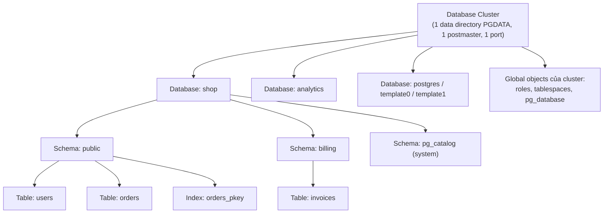
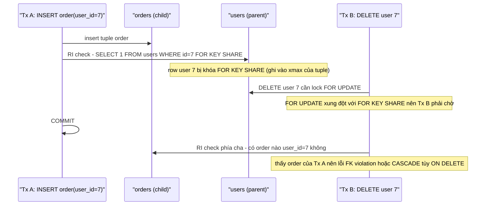

# PART 1 — RELATIONAL DATABASE FUNDAMENTALS

> **Trước:** [00 — Database Mental Model](00-database-mental-model.md) · **Tiếp:** [02 — Data Modeling](02-data-modeling.md)
> **Phiên bản tham chiếu:** PostgreSQL 18.

Chương này không chỉ định nghĩa các thuật ngữ quan hệ. Với mỗi khái niệm, ta sẽ nhìn nó từ ba góc: **lý thuyết quan hệ** (relational model), **SQL** (cách ngôn ngữ biểu diễn), và **PostgreSQL** (cách nó được hiện thực vật lý). Rất nhiều hiểu lầm trong production đến từ việc trộn lẫn ba góc nhìn này.

---

## Mục lục

1. [Ba tầng từ vựng: logical, SQL, physical](#1-ba-tầng-từ-vựng-logical-sql-physical)
2. [Relation, Tuple, Attribute, Domain](#2-relation-tuple-attribute-domain)
3. [Database, Schema, Table trong PostgreSQL](#3-database-schema-table-trong-postgresql)
4. [Page, Tuple, Record, Row — phân biệt vật lý và logic](#4-page-tuple-record-row--phân-biệt-vật-lý-và-logic)
5. [Catalog và Metadata](#5-catalog-và-metadata)
6. [Keys: Candidate, Primary, Composite, Surrogate, Natural](#6-keys)
7. [Constraints: NOT NULL, UNIQUE, CHECK, PRIMARY KEY](#7-constraints)
8. [Foreign Key và Referential Integrity](#8-foreign-key-và-referential-integrity)
9. [NULL và logic ba giá trị](#9-null-và-logic-ba-giá-trị)
10. [Interview Questions](#10-interview-questions)
11. [Key Takeaways](#11-key-takeaways)

---

## 1. Ba tầng từ vựng: logical, SQL, physical

| Relational model (lý thuyết) | SQL (ngôn ngữ) | PostgreSQL physical (hiện thực) |
|---|---|---|
| Relation | Table | Relation (một entry trong `pg_class`) + một hoặc nhiều file trên disk |
| Tuple | Row | Heap tuple (có header 23 byte + dữ liệu) nằm trong một page 8KB |
| Attribute | Column | Một entry trong `pg_attribute`; giá trị nằm trong phần data của tuple |
| Domain | Data type (+ constraint) | Entry trong `pg_type` |
| Relation schema | Table definition | Metadata trong system catalog |
| Database schema | Schema/Database | `pg_namespace`, `pg_database` |

Điểm cần nhớ: trong PostgreSQL, từ **"relation"** mang nghĩa rộng hơn lý thuyết. Trong source code và catalog, *relation* là bất kỳ thứ gì có entry trong `pg_class`: table, index, sequence, view, materialized view, TOAST table, composite type, foreign table, partitioned table. Cột `pg_class.relkind` cho biết loại: `r` (ordinary table), `i` (index), `S` (sequence), `v` (view), `m` (materialized view), `t` (TOAST table), `c` (composite type), `f` (foreign table), `p` (partitioned table), `I` (partitioned index).

Vì vậy khi đọc log `could not open relation with OID 16384`, "relation" có thể là table **hoặc** index.

---

## 2. Relation, Tuple, Attribute, Domain

### 2.1 WHAT

- **Domain**: tập các giá trị hợp lệ mà một attribute có thể nhận. Ví dụ domain "tuổi" = số nguyên từ 0 đến 150.
- **Attribute**: một tên gắn với một domain, ví dụ `age: Age`.
- **Tuple**: một tập các cặp (attribute, value), mỗi value thuộc domain của attribute tương ứng.
- **Relation**: một **tập hợp (set)** các tuple có cùng tập attribute. Vì là *tập hợp*:
  - không có tuple trùng lặp;
  - các tuple **không có thứ tự**;
  - các attribute (về lý thuyết) cũng không có thứ tự.

### 2.2 WHY — Tại sao lý thuyết lại quan trọng với engineer?

Vì hai tính chất "không trùng lặp" và "không có thứ tự" trực tiếp giải thích các hành vi mà nhiều engineer thấy "lạ":

1. **Không có thứ tự:** `SELECT * FROM t` **không có thứ tự đảm bảo** nếu không có `ORDER BY`. Trong PostgreSQL, kết quả thường *trông như* theo thứ tự chèn vì seq scan đọc page từ đầu file, nhưng:
   - `UPDATE` tạo tuple mới có thể nằm ở page khác → row "nhảy chỗ";
   - **synchronized sequential scans** (`synchronize_seqscans = on`, mặc định): khi một seq scan đang chạy trên table lớn, seq scan mới có thể *bắt đầu từ giữa table* để dùng chung I/O, rồi quay vòng lại đầu. Hai lần chạy cùng query có thể ra thứ tự khác nhau;
   - parallel seq scan trả kết quả xen kẽ từ nhiều worker.
   Kết luận: **thứ tự chỉ tồn tại khi có ORDER BY.** Pagination không có `ORDER BY` trên key duy nhất là bug.

2. **Không trùng lặp:** SQL **không** tuân thủ điều này — SQL dùng *bag semantics* (multiset). Một table không có primary key hay unique constraint có thể chứa hai row giống hệt nhau. Đó là lý do SQL có `DISTINCT` và `UNION` (loại trùng) vs `UNION ALL` (giữ trùng). Trong PostgreSQL, hai row giống hệt nhau về dữ liệu vẫn phân biệt được bằng **ctid** (vị trí vật lý) — đây là mẹo dùng để xóa bản ghi trùng.

### 2.3 Domain trong PostgreSQL

PostgreSQL có lệnh `CREATE DOMAIN`, hiện thực đúng tinh thần domain của lý thuyết: một data type nền + constraint.

```sql
CREATE DOMAIN email AS text
  CHECK (VALUE ~ '^[^@\s]+@[^@\s]+$');

CREATE TABLE users (id bigint PRIMARY KEY, contact email NOT NULL);
```

Ở đây `email` là một type mới trong `pg_type` (`typtype = 'd'`), mọi cột dùng domain này tự động có CHECK constraint. Đổi constraint của domain → áp cho mọi cột dùng nó.

---

## 3. Database, Schema, Table trong PostgreSQL

### 3.1 WHAT — Hệ thống phân cấp



**Cách đọc diagram (trên xuống):**

1. **Database cluster** (không phải "cluster nhiều máy"!) là *một* thư mục dữ liệu (`PGDATA`) được quản lý bởi *một* instance PostgreSQL, lắng nghe trên *một* port. Một cluster chứa nhiều database. Xem thêm sự nhầm lẫn về chữ "cluster" ở [Chương 35](35-database-cluster.md).
2. Một số đối tượng là **global** trong cluster: roles (user), tablespaces, danh sách database. Chúng nằm trong thư mục `global/` và được chia sẻ giữa mọi database.
3. **Database** là đơn vị cách ly mạnh: một connection chỉ kết nối tới **một** database; không thể join trực tiếp giữa hai database (phải dùng `postgres_fdw` hoặc `dblink`). Mỗi database có bộ system catalog riêng.
4. **Schema** là namespace bên trong một database. Có thể join thoải mái giữa các schema trong cùng database. Tên đầy đủ: `schema.table`.
5. **Table, index, view, sequence, function...** thuộc về một schema.

### 3.2 WHY — Tại sao có cả database lẫn schema?

- **Database** cách ly *vật lý và bảo mật* ở mức mạnh: catalog riêng, connection riêng, có thể `DROP DATABASE` một lần. Nhưng *không* cách ly tài nguyên: mọi database trong cluster chia sẻ shared buffers, WAL, background processes, và **XID space** (transaction ID). Một long transaction ở database A có thể... không chặn vacuum ở database B đối với table thường, nhưng một replication slot hoặc prepared transaction thì ảnh hưởng horizon của cả cluster đối với shared catalog. Và WAL là chung: một database ghi nhiều làm replication lag cho cả cluster.
- **Schema** cách ly *logic*: tổ chức object theo module, phân quyền theo schema, multi-tenant nhẹ (mỗi tenant một schema).

### 3.3 `search_path`

Khi viết `SELECT * FROM users` không có schema, PostgreSQL tra theo `search_path` (mặc định `"$user", public`). Luôn có `pg_catalog` được tìm (ngầm định ở đầu nếu không liệt kê). Hệ quả:

- Hai schema cùng có table `users` → table nào được dùng phụ thuộc `search_path` của session. Đây là nguồn bug khi dùng connection pool chia sẻ session state (xem [Chương 37](37-connection-management.md)).
- Security: function `SECURITY DEFINER` nên đặt `search_path` cố định để tránh bị "chèn" object giả vào schema có quyền ghi.

### 3.4 WHAT HAPPENS IF...

- **...tạo quá nhiều database (hàng nghìn) trong một cluster?** Mỗi database có catalog riêng → autovacuum phải duyệt qua từng database (autovacuum launcher cố gắng lần lượt vào mỗi database trong mỗi `autovacuum_naptime`), relcache/catcache được build riêng cho mỗi database mà backend kết nối, connection pool khó chia sẻ (pool thường theo cặp user+database).
- **...tạo quá nhiều schema/table (hàng trăm nghìn table)?** Catalog phình to (`pg_class`, `pg_attribute`), mỗi backend giữ cache catalog riêng trong memory local → memory tăng theo số connection × số object mà connection đã chạm; `pg_dump` chậm; autovacuum phải lập lịch cho rất nhiều relation. Đây là rủi ro thực tế của mô hình "schema-per-tenant" với hàng chục nghìn tenant.

---

## 4. Page, Tuple, Record, Row — phân biệt vật lý và logic

Đây là nhóm thuật ngữ bị dùng lẫn lộn nhiều nhất.

| Thuật ngữ | Tầng | Ý nghĩa trong PostgreSQL |
|---|---|---|
| **Row** | Logic (SQL) | Một hàng mà *người dùng* nhìn thấy trong kết quả query. |
| **Tuple** | Logic (lý thuyết) / Physical (PostgreSQL) | Trong PostgreSQL, *heap tuple* là **một phiên bản vật lý** của một row nằm trong page. Một row logic có thể tương ứng với **nhiều tuple vật lý** (các version do MVCC tạo ra). |
| **Record** | Mơ hồ | Thường dùng như "row". Trong PL/pgSQL, `record` là kiểu dữ liệu. Trong WAL, "WAL record" là một bản ghi log. Tránh dùng "record" khi cần chính xác. |
| **Page / Block** | Physical | Đơn vị I/O cố định 8KB. "Block" là số thứ tự của page trong file. Mọi đọc/ghi trên disk và trong buffer cache đều theo page. |
| **Item / Line pointer** | Physical | Mảng con trỏ ở đầu page, mỗi con trỏ 4 byte trỏ tới vị trí tuple trong page. |
| **TID / ctid** | Physical | Địa chỉ vật lý của tuple: `(block number, line pointer number)`, ví dụ `(42, 7)`. |

### 4.1 Minh họa: một row logic, ba tuple vật lý

```sql
CREATE TABLE accounts (id int PRIMARY KEY, balance int);
INSERT INTO accounts VALUES (1, 100);  -- tuple v1
UPDATE accounts SET balance = 90 WHERE id = 1;  -- tuple v2
UPDATE accounts SET balance = 80 WHERE id = 1;  -- tuple v3

SELECT ctid, xmin, xmax, * FROM accounts;
--  ctid  | xmin | xmax | id | balance
-- -------+------+------+----+---------
--  (0,3) |  745 |    0 |  1 |      80
```

Người dùng thấy **một row**. Trên page 0 có **ba tuple**: `(0,1)` balance=100, `(0,2)` balance=90, `(0,3)` balance=80. Hai tuple đầu là **dead tuple** (đã bị thay thế bởi transaction đã commit), vô hình với mọi transaction mới, nhưng vẫn chiếm chỗ cho đến khi được **pruning** hoặc **VACUUM** dọn. `xmin`/`xmax` là các system column cho biết transaction nào tạo/xóa tuple — chi tiết ở [Chương 06](06-storage-internals.md) và [Chương 11](11-mvcc.md).

Đây là lý do nói "PostgreSQL UPDATE = DELETE + INSERT" ở mức vật lý.

### 4.2 Hệ quả thực tế

- `COUNT(*)` phải đếm *row visible*, không phải đếm *tuple*. Không có con số "số row" nào được lưu sẵn chính xác, vì mỗi transaction có thể thấy số row khác nhau (xem [Chương 44](44-common-myths.md)).
- `ctid` **không ổn định**: thay đổi sau UPDATE, VACUUM FULL, CLUSTER. Không bao giờ dùng ctid làm định danh lâu dài trong application.

---

## 5. Catalog và Metadata

### 5.1 WHAT

**System catalog** là tập các table hệ thống nơi PostgreSQL lưu **metadata**: định nghĩa table, cột, kiểu, index, constraint, function, quyền, thống kê. Chúng nằm trong schema `pg_catalog`.

| Catalog | Lưu gì |
|---|---|
| `pg_class` | Mọi relation: table, index, sequence, view... (`relname`, `relkind`, `relpages`, `reltuples`, `relfilenode`, `relfrozenxid`) |
| `pg_attribute` | Mọi cột của mọi relation (`attname`, `atttypid`, `attnum`, `attnotnull`) |
| `pg_type` | Mọi data type |
| `pg_namespace` | Schema |
| `pg_index` | Thông tin bổ sung cho index (cột nào, unique không, `indisvalid`) |
| `pg_constraint` | Constraint: PK, FK, UNIQUE, CHECK, EXCLUDE |
| `pg_statistic` (view: `pg_stats`) | Thống kê cột cho planner |
| `pg_proc` | Function/procedure |
| `pg_database`, `pg_authid`, `pg_tablespace` | Shared catalog (global cho cả cluster) |

`information_schema` là tập **view chuẩn SQL** xây trên `pg_catalog`, tiện cho tính portable nhưng thường chậm hơn và thiếu thông tin PostgreSQL-specific.

### 5.2 WHY — Catalog là table thông thường, và điều đó có hệ quả lớn

Trong PostgreSQL, catalog **chính là các heap table bình thường** (có MVCC, WAL, VACUUM). Hệ quả:

1. **DDL là transactional.** `CREATE TABLE`, `ALTER TABLE`, `DROP TABLE` chỉ là INSERT/UPDATE/DELETE vào catalog. Vì vậy có thể:
   ```sql
   BEGIN;
   ALTER TABLE orders ADD COLUMN note text;
   CREATE INDEX ...;
   -- phát hiện lỗi
   ROLLBACK;  -- mọi thay đổi schema biến mất
   ```
   Đây là điểm mạnh lớn so với MySQL (DDL gây implicit commit). Migration có thể chạy trong một transaction và rollback sạch sẽ (ngoại trừ một số lệnh không chạy được trong transaction block như `CREATE INDEX CONCURRENTLY`, `VACUUM`, `CREATE DATABASE`).
2. **Catalog cũng bị bloat.** Workload tạo/xóa temp table liên tục → `pg_class`, `pg_attribute` sinh dead tuple → catalog bloat → mọi truy vấn catalog chậm. Đây là một anti-pattern production có thật.
3. **Logical decoding cần catalog history.** Để giải mã WAL cũ thành row, cần biết schema *tại thời điểm đó* → logical replication slot giữ `catalog_xmin` → ngăn vacuum dọn catalog (xem [Chương 25](25-replication.md)).

### 5.3 INTERNALS — Catalog cache và invalidation

Mỗi backend không tra catalog bằng SQL mỗi lần cần. Nó giữ các cache trong **memory local của process**:
- **syscache / catcache**: cache các row catalog, tra theo key (ví dụ tìm `pg_class` row theo OID).
- **relcache**: cấu trúc `RelationData` đầy đủ cho mỗi relation đã mở (descriptor, index list, trigger, constraint...).
- **plan cache**: plan của prepared statement.

Khi một session khác chạy DDL, làm sao các backend khác biết cache của mình đã cũ? PostgreSQL dùng **shared invalidation messages (sinval)**: transaction chạy DDL, lúc commit, ghi các message "relation X đã đổi" vào một hàng đợi trong shared memory. Mỗi backend kiểm tra hàng đợi này tại các điểm xác định (ví dụ khi bắt đầu transaction, khi lấy lock trên relation) và hủy cache tương ứng. Plan cache phụ thuộc relation đó cũng bị đánh dấu invalid và sẽ được replan.

Kết hợp với lock: DDL lấy `ACCESS EXCLUSIVE` lock, đảm bảo không ai đang dùng relation trong lúc đổi; sau khi DDL commit và nhả lock, backend khác lấy lock → xử lý invalidation → thấy schema mới.

### 5.4 OID

**OID (Object Identifier)** là số 32-bit định danh object trong catalog (table, type, function...). `pg_class.oid` là định danh logic của relation; `pg_class.relfilenode` là tên file vật lý — hai số này **ban đầu bằng nhau nhưng có thể khác nhau** sau `TRUNCATE`, `VACUUM FULL`, `CLUSTER`, `REINDEX`, vì các lệnh này tạo file mới. Chi tiết ở [Chương 06](06-storage-internals.md).

---

## 6. Keys

### 6.1 WHAT

| Khái niệm | Định nghĩa |
|---|---|
| **Superkey** | Tập attribute xác định duy nhất mỗi tuple. |
| **Candidate key** | Superkey *tối thiểu* (bỏ bất kỳ attribute nào thì mất tính duy nhất). Một relation có thể có nhiều candidate key. |
| **Primary key** | Candidate key được *chọn* làm định danh chính. Trong SQL: UNIQUE + NOT NULL, tối đa một mỗi table. |
| **Alternate key** | Candidate key không được chọn làm primary key; thường khai báo bằng UNIQUE constraint. |
| **Composite key** | Key gồm nhiều cột, ví dụ `(order_id, line_no)`. |
| **Natural key** | Key có ý nghĩa nghiệp vụ: email, mã số thuế, ISBN. |
| **Surrogate key** | Key nhân tạo không mang nghĩa nghiệp vụ: `bigint` identity, UUID. |

Ví dụ `users(id, email, national_id)`: candidate keys là `{id}`, `{email}`, `{national_id}`. Chọn `id` làm primary key; `email` và `national_id` là alternate key → khai báo UNIQUE.

### 6.2 WHY — Tại sao cần primary key?

- **Định danh:** không có key thì không có cách nào nói "cập nhật đúng row này" một cách đáng tin cậy.
- **Tham chiếu:** foreign key cần trỏ tới một cột (hoặc tập cột) unique.
- **Replication:** logical replication cần *replica identity* để xác định row nào bị UPDATE/DELETE ở phía subscriber; mặc định là primary key. Table không có PK → UPDATE/DELETE bị từ chối khi table nằm trong publication có publish update/delete (trừ khi đặt `REPLICA IDENTITY FULL`, rất tốn kém).
- **CDC:** Debezium cần key để tạo message key cho Kafka (phân partition, compaction).

### 6.3 INTERNALS — PostgreSQL hiện thực PRIMARY KEY thế nào?

`PRIMARY KEY (id)` trong PostgreSQL =
1. `NOT NULL` trên từng cột key;
2. một **unique B-Tree index** (tên mặc định `<table>_pkey`);
3. một entry trong `pg_constraint` với `contype = 'p'`.

Điểm quan trọng khác với InnoDB: **table PostgreSQL không được sắp xếp theo primary key.** Heap là không có thứ tự; primary key index chỉ là một index như mọi index khác, chứa `(key → TID)`. Tra theo PK = đi B-Tree index (thường 3–4 page) + đọc 1 heap page.

### 6.4 Surrogate key: `bigint` identity vs UUID

| | `bigint GENERATED ... AS IDENTITY` | UUIDv4 (random) | UUIDv7 (time-ordered) |
|---|---|---|---|
| Kích thước | 8 byte | 16 byte | 16 byte |
| Sinh ở đâu | Database (sequence) | Bất kỳ đâu | Bất kỳ đâu; PG 18 có `uuidv7()` built-in |
| Locality khi insert vào B-Tree | Tuyệt vời: luôn chèn vào page bên phải nhất | **Tệ**: chèn ngẫu nhiên khắp index → page split rải rác, working set của index = toàn bộ index, nhiều full page write trong WAL | Tốt: gần tuần tự theo thời gian |
| Lộ thông tin | Lộ số lượng/tốc độ tạo | Không | Lộ thời điểm tạo |
| Dùng trong hệ phân tán | Cần phối hợp (sequence đơn điểm) | Tốt | Tốt |

**Mechanism tại sao UUIDv4 làm index chậm:** B-Tree giữ key có thứ tự. Key tăng dần luôn rơi vào lá phải cùng → chỉ một vài page "nóng" cần ở trong cache, và PostgreSQL có tối ưu cho *rightmost split* (xem [Chương 15](15-index-internals.md)). Key ngẫu nhiên rơi vào lá bất kỳ → mỗi insert có thể chạm một page khác nhau → với index lớn hơn RAM, mỗi insert là một cache miss; ngoài ra lần đầu sửa mỗi page sau checkpoint sinh ra **full page image** trong WAL ([Chương 20](20-wal.md)) → WAL tăng mạnh.

### 6.5 Sequence và identity

`GENERATED ALWAYS AS IDENTITY` (chuẩn SQL, nên dùng thay `serial`) dựa trên một **sequence** object. Hai hành vi hay gây bất ngờ:

1. **Sequence không transactional.** `nextval()` không bị rollback. Transaction lấy id 101 rồi rollback → id 101 bị "mất". **Gap trong id là bình thường** và không được dùng id để đếm số row hay giả định liên tục.
2. **Sequence được cache và WAL-log theo lô**: PostgreSQL ghi WAL cho sequence theo từng lô 32 giá trị (`SEQ_LOG_VALS`) để giảm WAL. Sau crash, sequence có thể nhảy cách tới 32 giá trị. Trên replica, giá trị sequence nhìn thấy có thể "đi trước" giá trị thực tế đã dùng.

---

## 7. Constraints

### 7.1 WHAT & WHY

Constraint là **khai báo bất biến (invariant)** mà database cam kết luôn đúng. Tại sao để database kiểm tra thay vì application?

- Application có nhiều instance, nhiều service, nhiều script migration, nhiều người chạy SQL tay. Chỉ database là điểm duy nhất *mọi* write đều đi qua.
- Kiểm tra ở application có **race condition**: hai request cùng kiểm tra "email chưa tồn tại" → cả hai thấy chưa → cả hai insert → trùng. Chỉ có unique index (với cơ chế kiểm tra bên trong B-Tree, có lock) mới ngăn được triệt để.

### 7.2 NOT NULL

- **HOW:** Kiểm tra khi tạo tuple mới (INSERT, UPDATE). Rất rẻ.
- **INTERNALS:** Lưu ở `pg_attribute.attnotnull`. Ở PG 18, NOT NULL constraint cũng được ghi nhận trong `pg_constraint`, cho phép đặt tên và dùng `NOT VALID` với NOT NULL.
- **Lưu ý storage:** giá trị NULL không chiếm chỗ trong phần data của tuple; tuple có ít nhất một NULL mang một **null bitmap** (1 bit/cột) trong header.
- **ALTER TABLE ... SET NOT NULL** trên table lớn phải scan toàn table để kiểm tra, dưới `ACCESS EXCLUSIVE` lock. Nếu đã có `CHECK (col IS NOT NULL)` đã validate, PostgreSQL (từ PG 12) dùng nó để bỏ qua bước scan.

### 7.3 UNIQUE

**HOW (bên trong B-Tree):** Khi insert một key vào unique index, PostgreSQL (hàm `_bt_check_unique`):
1. Tìm vị trí key trong B-Tree.
2. Với mỗi index entry có cùng key, kiểm tra heap tuple tương ứng:
   - tuple đã dead với mọi transaction → bỏ qua;
   - tuple *live* và committed → lỗi `duplicate key value violates unique constraint`;
   - tuple được tạo bởi transaction **đang chạy** (chưa commit) → **chờ** transaction đó kết thúc (chờ trên lock của XID đó), rồi kiểm tra lại. Nếu nó commit → lỗi duplicate; nếu rollback → insert thành công.

Chính bước "chờ" này là lý do unique constraint an toàn dưới concurrency mà không cần khóa cả table.

**NULL trong UNIQUE:** Theo chuẩn SQL, `NULL ≠ NULL`, nên nhiều row có `email IS NULL` không vi phạm UNIQUE. PG 15 thêm `UNIQUE NULLS NOT DISTINCT` để coi NULL như bằng nhau.

**Deferrable:** `UNIQUE ... DEFERRABLE INITIALLY DEFERRED` cho phép vi phạm tạm thời trong transaction, chỉ kiểm tra lúc commit (hữu ích khi hoán đổi giá trị giữa hai row). Cái giá: index vẫn nhận entry trùng tạm thời, và kiểm tra lúc commit tốn thêm; `ON CONFLICT` không dùng được với deferrable unique constraint làm arbiter.

### 7.4 CHECK

- **WHAT:** Biểu thức boolean trên *một row*: `CHECK (amount > 0)`, `CHECK (start_date < end_date)`.
- **HOW:** Đánh giá khi INSERT/UPDATE row. Kết quả `NULL` được coi là **thỏa mãn** (chỉ `false` mới vi phạm) — một bẫy phổ biến.
- **Giới hạn:** CHECK không được tham chiếu row khác hay table khác. Dùng subquery trong CHECK không được phép; bọc trong function để "lách" là sai về ngữ nghĩa, vì PostgreSQL chỉ kiểm tra khi row *này* thay đổi, không kiểm tra lại khi table kia thay đổi.
- **Production:** Thêm CHECK vào table lớn:
  ```sql
  ALTER TABLE orders ADD CONSTRAINT amount_positive CHECK (amount > 0) NOT VALID;  -- chỉ áp cho row mới, lock ngắn
  ALTER TABLE orders VALIDATE CONSTRAINT amount_positive;  -- scan table, chỉ cần SHARE UPDATE EXCLUSIVE, không chặn read/write
  ```
  Tách hai bước để không giữ lock nặng trong lúc scan hàng trăm GB.

### 7.5 EXCLUDE (PostgreSQL-specific)

Tổng quát hóa của UNIQUE: "không có hai row nào mà *tất cả* các toán tử so sánh đều true". Ví dụ cấm đặt phòng trùng thời gian:

```sql
CREATE TABLE booking (
  room_id int,
  during tstzrange,
  EXCLUDE USING gist (room_id WITH =, during WITH &&)
);
```

Hiện thực bằng GiST index (cần extension `btree_gist` cho toán tử `=` trên int). PG 18 bổ sung **temporal constraints** (`PRIMARY KEY (room_id, during WITHOUT OVERLAPS)`) — cú pháp chuẩn hơn cho cùng loại bất biến.

---

## 8. Foreign Key và Referential Integrity

### 8.1 WHAT

**Foreign key** là constraint: giá trị của cột (hoặc tập cột) ở table con phải tồn tại ở cột unique/PK của table cha (hoặc là NULL). **Referential integrity** là tính chất "không có tham chiếu treo" (dangling reference).

```sql
CREATE TABLE orders (
  id bigint PRIMARY KEY,
  user_id bigint NOT NULL REFERENCES users(id) ON DELETE RESTRICT
);
```

### 8.2 WHY

Không có FK, việc xóa user có thể để lại order mồ côi; application phải tự kiểm tra ở mọi chỗ, và vẫn có race condition (kiểm tra user tồn tại → user bị xóa bởi request khác → insert order).

### 8.3 HOW — PostgreSQL kiểm tra FK thế nào?

FK trong PostgreSQL được hiện thực bằng **system trigger** (các trigger nội bộ `RI_ConstraintTrigger`, gọi các hàm trong `ri_triggers.c`). Chúng chạy ở cuối mỗi statement (hoặc cuối transaction nếu deferred).



**Cách đọc diagram:**
1. Khi insert/update row con, trigger RI chạy câu tương đương `SELECT 1 FROM users WHERE id = $1 FOR KEY SHARE`. Lock mode `FOR KEY SHARE` là mode yếu nhất: nó chỉ chặn *xóa row* hoặc *đổi giá trị key* của row cha, **không** chặn UPDATE các cột khác của user (như `last_login`). Đây là lý do PostgreSQL 9.3 thêm `FOR KEY SHARE`/`FOR NO KEY UPDATE`: trước đó FK check dùng `FOR SHARE` và thường xuyên gây blocking/deadlock với các UPDATE vô hại trên table cha.
2. Tx B muốn xóa user 7 → cần lock row mạnh (`FOR UPDATE`) → xung đột với `FOR KEY SHARE` của Tx A → chờ.
3. Khi xóa row cha, trigger RI phía cha tìm các row con tham chiếu: `SELECT 1 FROM orders WHERE user_id = $1 FOR KEY SHARE` (với `RESTRICT/NO ACTION`) hoặc chạy `DELETE`/`UPDATE` tương ứng (với `CASCADE`/`SET NULL`).

### 8.4 WHAT HAPPENS IF — Không có index trên cột FK ở table con

PostgreSQL **tự tạo index cho PK/UNIQUE ở table cha**, nhưng **không tự tạo index cho cột FK ở table con** (khác MySQL/InnoDB, nơi FK bắt buộc có index).

Hệ quả: mỗi lần `DELETE FROM users WHERE id = 7` (hoặc update key), trigger RI phải tìm `orders WHERE user_id = 7` → **seq scan toàn bộ `orders`**. Xóa 10.000 user = 10.000 lần seq scan table orders hàng trăm triệu row. Đây là một trong những nguyên nhân "DELETE chậm bất thường" phổ biến nhất. Kèm theo đó: trong lúc chờ, lock được giữ lâu → lock contention.

Quy tắc: **gần như luôn tạo index cho cột FK** ở table con, trừ khi table cha không bao giờ bị xóa/đổi key và bạn không bao giờ join theo cột đó.

### 8.5 ON DELETE / ON UPDATE actions

| Action | Hành vi |
|---|---|
| `NO ACTION` (mặc định) | Lỗi nếu còn row con; kiểm tra ở cuối statement (có thể deferred). |
| `RESTRICT` | Lỗi ngay, không thể defer. |
| `CASCADE` | Xóa/cập nhật row con theo. Cẩn thận: xóa một row cha có thể xóa hàng triệu row con trong một transaction → lock dài, WAL lớn, replication lag. |
| `SET NULL` / `SET DEFAULT` | Đặt cột FK con thành NULL/default. PG 15 cho phép chỉ định tập cột con cụ thể. |

### 8.6 PERFORMANCE IMPACT

- Mỗi INSERT vào table con = thêm một index lookup trên table cha + một row lock (ghi vào xmax của tuple cha → **làm dirty page của table cha** và sinh WAL!). Với workload insert rất cao vào table con cùng trỏ vào vài row cha "nóng" (ví dụ mọi event trỏ tới cùng một `tenant_id`), row cha liên tục bị nhiều transaction cùng khóa `FOR KEY SHARE` → PostgreSQL phải dùng **MultiXact** (một ID đại diện cho nhóm các transaction cùng giữ lock) → áp lực lên SLRU `pg_multixact`, có thể thành nút thắt. Xem [Chương 13](13-locking.md).
- Thêm FK vào table lớn: dùng `NOT VALID` rồi `VALIDATE CONSTRAINT` như CHECK.

### 8.7 TRADE-OFF & WHEN NOT TO USE

- Hệ sharded: FK không thể tham chiếu xuyên shard (các shard là database khác nhau). Integrity phải được đảm bảo bằng thiết kế (co-location theo shard key) hoặc ở application.
- Table log/event append-only với tốc độ ghi cực cao: đôi khi team bỏ FK để tránh chi phí lookup + lock trên table cha, chấp nhận kiểm tra bất đồng bộ. Đây là quyết định có chủ đích, phải ghi lại rõ ràng.

---

## 9. NULL và logic ba giá trị

### 9.1 WHAT

`NULL` biểu diễn "không biết" hoặc "không áp dụng". SQL dùng **three-valued logic**: TRUE, FALSE, UNKNOWN.

| Biểu thức | Kết quả |
|---|---|
| `NULL = NULL` | UNKNOWN (không phải TRUE) |
| `NULL <> 1` | UNKNOWN |
| `TRUE AND UNKNOWN` | UNKNOWN |
| `FALSE AND UNKNOWN` | FALSE |
| `TRUE OR UNKNOWN` | TRUE |
| `NOT UNKNOWN` | UNKNOWN |

`WHERE` chỉ giữ row có điều kiện **TRUE**; UNKNOWN bị loại như FALSE. `CHECK` thì ngược lại: chỉ FALSE mới vi phạm.

### 9.2 Các bẫy kinh điển

1. `WHERE col = NULL` luôn không trả row nào. Phải dùng `IS NULL`.
2. `WHERE status <> 'cancelled'` **loại bỏ** các row có `status IS NULL`.
3. **`NOT IN` với NULL:**
   ```sql
   SELECT * FROM users WHERE id NOT IN (SELECT user_id FROM banned);
   ```
   Nếu `banned.user_id` có một giá trị NULL, `id NOT IN (1, 2, NULL)` = `id<>1 AND id<>2 AND id<>NULL` = `... AND UNKNOWN` → không bao giờ TRUE → **query trả về 0 row**. Ngoài ra, vì ngữ nghĩa NULL này, planner **không thể** chuyển `NOT IN (subquery)` thành anti-join hiệu quả; nó thường dùng *hashed SubPlan* (nếu vừa `work_mem`) hoặc tệ hơn là SubPlan thực thi lặp lại. Dùng `NOT EXISTS` thay thế: đúng ngữ nghĩa hơn và planner biến thành **Anti Join**. Xem [Chương 03](03-sql.md), [19](19-join-algorithms.md).
4. `COUNT(col)` bỏ qua NULL; `COUNT(*)` đếm mọi row.
5. `IS DISTINCT FROM` so sánh "NULL-safe": `NULL IS DISTINCT FROM NULL` = FALSE.

### 9.3 NULL trong index

B-Tree của PostgreSQL **có lưu NULL** (khác Oracle), nên `WHERE col IS NULL` dùng được index. Có thể chọn `NULLS FIRST/LAST` khi tạo index để khớp với `ORDER BY`.

---

## 10. Interview Questions

**Q1. Primary key trong PostgreSQL khác gì với InnoDB?**
- *Short:* Trong InnoDB, table là clustered index theo PK; trong PostgreSQL, PK chỉ là một unique B-Tree index trỏ tới heap không có thứ tự.
- *Deep:* Hệ quả: InnoDB secondary index lưu PK value → tra secondary index = 2 lần đi B-Tree; PK lớn (UUID) làm phình mọi secondary index. PostgreSQL secondary index lưu TID (6 byte) → tra = 1 lần B-Tree + 1 heap fetch; nhưng khi tuple di chuyển (UPDATE không HOT) mọi index phải được cập nhật vì TID đổi.
- *Follow-up:* Vậy UPDATE ở PostgreSQL tốn kém hơn ở điểm nào? (→ [Chương 24 — HOT](24-hot-update.md))

**Q2. Tại sao nên đánh index cột foreign key?**
- *Short:* Để DELETE/UPDATE key ở table cha không phải seq scan table con, và để join nhanh.
- *Deep:* PostgreSQL không tự tạo index cho FK con. Trigger RI chạy lookup ở table con cho mỗi row cha bị xóa.

**Q3. Unique constraint đảm bảo tính duy nhất dưới concurrency thế nào?**
- *Short:* Trong lúc insert vào unique B-Tree, PostgreSQL tìm entry trùng; nếu entry đó thuộc transaction chưa kết thúc, nó chờ transaction đó commit/rollback rồi quyết định.
- *Follow-up:* `INSERT ... ON CONFLICT` hoạt động thế nào dưới concurrency? (→ [Chương 03](03-sql.md))

**Q4. Tại sao `NOT IN` với subquery nguy hiểm?**
- *Short:* NULL trong subquery làm kết quả rỗng; và planner không biến nó thành anti-join.

**Q5. DDL trong PostgreSQL có transactional không? Hệ quả?**
- *Short:* Có, vì catalog là table MVCC. Migration có thể rollback.
- *Follow-up:* Những lệnh nào không chạy được trong transaction? Tại sao `ALTER TABLE` có thể làm cả hệ thống đứng? (→ lock queue ở [Chương 13](13-locking.md))

**Q6. Tại sao id từ sequence có "lỗ hổng"?**
- *Short:* `nextval()` không rollback; sequence được WAL-log theo lô nên crash có thể nhảy số.

---

## 11. Key Takeaways

1. "Relation" trong PostgreSQL = mọi thứ có entry trong `pg_class` (table, index, sequence, view...).
2. Một row logic có thể là nhiều tuple vật lý (MVCC). `ctid` là vị trí vật lý, không ổn định.
3. Không có `ORDER BY` thì không có thứ tự — kể cả khi kết quả "trông" có thứ tự.
4. Catalog là table thường → DDL transactional, catalog có thể bloat, và cache catalog phải được invalidate qua shared invalidation messages.
5. PK = NOT NULL + unique B-Tree index. Heap không sắp theo PK.
6. Unique constraint an toàn dưới concurrency nhờ cơ chế chờ transaction đang insert key trùng.
7. FK hiện thực bằng system trigger + row lock `FOR KEY SHARE`. **Luôn cân nhắc index cho cột FK ở table con.**
8. NULL → logic ba giá trị; `NOT IN` + NULL là bẫy; ưu tiên `NOT EXISTS`.
9. Thêm constraint trên table lớn: `NOT VALID` + `VALIDATE CONSTRAINT` để tránh giữ lock nặng lâu.

---

## Nguồn tham khảo

- PostgreSQL Docs — *Constraints*: https://www.postgresql.org/docs/current/ddl-constraints.html
- PostgreSQL Docs — *System Catalogs*: https://www.postgresql.org/docs/current/catalogs.html
- PostgreSQL Docs — *pg_class*: https://www.postgresql.org/docs/current/catalog-pg-class.html
- PostgreSQL Docs — *Explicit Locking (row-level locks)*: https://www.postgresql.org/docs/current/explicit-locking.html
- PostgreSQL source: `src/backend/utils/adt/ri_triggers.c`, `src/backend/access/nbtree/nbtinsert.c` (`_bt_check_unique`), `src/backend/utils/cache/inval.c`.
- RFC 9562 — UUID versions (bao gồm UUIDv7).
