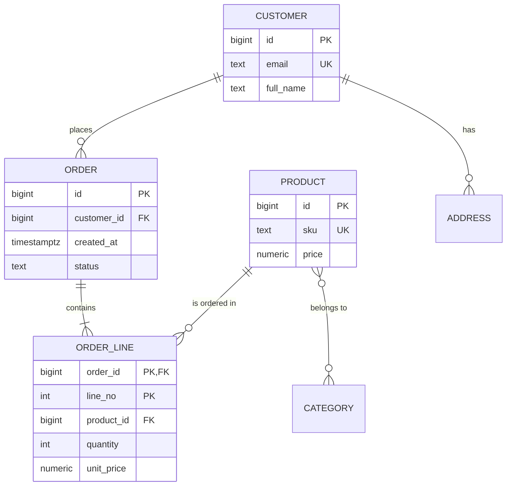
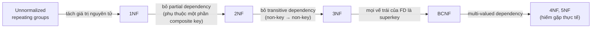

# PART 2 — DATA MODELING

> **Trước:** [01 — Relational Fundamentals](01-relational-database.md) · **Tiếp:** [03 — SQL Complete Theory](03-sql.md)

Data modeling là quyết định có ảnh hưởng dài hạn nhất trong một hệ thống dùng database. Index có thể thêm sau, query có thể viết lại, server có thể nâng cấp — nhưng thay đổi data model của một table hàng tỷ row đang chạy production là một dự án nhiều tuần. Chương này đi từ mô hình khái niệm (ER) xuống normalization, rồi tới lý do *vi phạm* normalization (denormalization) một cách có chủ đích, luôn gắn với chi phí vật lý trong PostgreSQL.

---

## Mục lục

1. [ER Model: Entity, Attribute, Relationship](#1-er-model)
2. [Cardinality: 1-1, 1-N, N-N, Junction Table](#2-cardinality)
3. [Tại sao normalization tồn tại: ba loại anomaly](#3-tại-sao-normalization-tồn-tại)
4. [Functional Dependency — nền tảng của normal forms](#4-functional-dependency)
5. [1NF, 2NF, 3NF, BCNF](#5-các-normal-form)
6. [Denormalization](#6-denormalization)
7. [Các pattern modeling đặc thù PostgreSQL](#7-các-pattern-modeling-đặc-thù-postgresql)
8. [Interview Questions](#8-interview-questions)
9. [Key Takeaways](#9-key-takeaways)

---

## 1. ER Model

### 1.1 WHAT

**Entity–Relationship (ER) Model** (Peter Chen, 1976) là mô hình *khái niệm* để mô tả dữ liệu của một nghiệp vụ trước khi nghĩ tới table:

- **Entity**: một "thứ" có định danh độc lập trong nghiệp vụ: Customer, Order, Product.
- **Entity set / type**: tập các entity cùng loại.
- **Attribute**: thuộc tính của entity: `name`, `email`. Có thể là *simple* hoặc *composite* (address = street + city), *single-valued* hoặc *multi-valued* (một người có nhiều số điện thoại), *derived* (age tính từ birth_date).
- **Relationship**: liên kết giữa các entity: Customer *places* Order. Relationship cũng có thể có attribute (ví dụ `quantity` của quan hệ Order *contains* Product).
- **Weak entity**: entity không có định danh riêng, phụ thuộc entity khác (OrderLine chỉ có nghĩa trong một Order; key = `(order_id, line_no)`).

### 1.2 WHY

Mô hình ER tách *"nghiệp vụ có những gì"* khỏi *"lưu thế nào"*. Nó buộc ta trả lời các câu hỏi quan trọng **trước** khi viết `CREATE TABLE`:
- Cái gì có định danh riêng?
- Quan hệ là 1-1, 1-N hay N-N?
- Quan hệ có bắt buộc không (participation)?
- Thuộc tính nào nhiều giá trị?

Trả lời sai những câu này là nguồn gốc của phần lớn các migration đau đớn (ví dụ: tưởng user chỉ có một địa chỉ → đặt cột `address` trong `users` → hai năm sau cần nhiều địa chỉ).

### 1.3 EXAMPLE — E-commerce



**Cách đọc diagram:** Ký hiệu crow's foot: `||` = đúng một, `o{` = không hoặc nhiều, `|{` = một hoặc nhiều.
- Một CUSTOMER đặt 0..N ORDER; mỗi ORDER thuộc đúng 1 CUSTOMER.
- Một ORDER có 1..N ORDER_LINE; ORDER_LINE là weak entity với key `(order_id, line_no)`.
- PRODUCT – CATEGORY là N-N → khi chuyển sang table sẽ cần junction table.
- `unit_price` nằm ở ORDER_LINE chứ không chỉ ở PRODUCT: giá tại *thời điểm đặt hàng* là một sự thật lịch sử khác với giá *hiện tại*. Đây không phải denormalization — nó là một attribute khác về mặt nghiệp vụ. Nhận ra điều này là kỹ năng modeling quan trọng.

---

## 2. Cardinality

### 2.1 One-to-One (1-1)

**Hiện thực:** FK + UNIQUE ở một phía, hoặc dùng chung PK.

```sql
CREATE TABLE users (id bigint PRIMARY KEY, email text NOT NULL UNIQUE);
CREATE TABLE user_profiles (
  user_id bigint PRIMARY KEY REFERENCES users(id),  -- PK cũng là FK → tối đa 1 profile/user
  bio text, avatar_url text
);
```

**Khi nào tách 1-1 thành hai table?**
- Dữ liệu lớn và ít đọc (bio dài, settings JSON) → tách để row chính nhỏ, nhiều row trên một page, cache hiệu quả. (Lưu ý: PostgreSQL đã tự đẩy giá trị lớn ra TOAST, nên lý do này yếu hơn ở PostgreSQL so với DB khác — xem [Chương 06](06-storage-internals.md).)
- Tần suất update khác nhau: `last_seen_at` cập nhật mỗi request → tách ra table riêng để UPDATE không tạo tuple version mới của cả row lớn (MVCC copy toàn bộ tuple, xem [Chương 07](07-read-write-behavior.md)).
- Quyền truy cập khác nhau (dữ liệu nhạy cảm).
- Optional: phần lớn user không có profile.

### 2.2 One-to-Many (1-N)

**Hiện thực:** FK ở phía "many".

```sql
CREATE TABLE orders (id bigint PRIMARY KEY, customer_id bigint NOT NULL REFERENCES customers(id));
CREATE INDEX ON orders (customer_id);  -- xem Chương 01: PostgreSQL không tự tạo
```

### 2.3 Many-to-Many (N-N) và Junction Table

Relational model không biểu diễn trực tiếp N-N: một cột chỉ chứa một giá trị (1NF). Giải pháp: **junction table** (còn gọi associative/bridge/link table).

```sql
CREATE TABLE product_categories (
  product_id  bigint REFERENCES products(id),
  category_id bigint REFERENCES categories(id),
  PRIMARY KEY (product_id, category_id)
);
CREATE INDEX ON product_categories (category_id, product_id);
```

**Tại sao cần hai index?** PK `(product_id, category_id)` phục vụ "category của product X" (leftmost prefix). Truy vấn ngược "product thuộc category Y" cần index bắt đầu bằng `category_id`. Index thứ hai `(category_id, product_id)` cho phép **index-only scan** theo cả hai chiều. Xem [Chương 16](16-composite-index.md).

**Junction table có attribute:** Khi quan hệ có dữ liệu riêng (ngày thêm vào, thứ tự hiển thị, vai trò của member trong group) — junction table trở thành entity thực thụ.

### 2.4 Mảng thay cho junction table?

PostgreSQL có kiểu `array`: `products.category_ids bigint[]`. Trade-off:

| | Junction table | Array column |
|---|---|---|
| Referential integrity | FK đảm bảo | **Không có FK trên phần tử mảng** |
| Truy vấn "product có category X" | B-Tree index | GIN index trên array (`@>`) |
| Thêm/bớt một phần tử | INSERT/DELETE một row nhỏ | UPDATE cả row product → tuple mới toàn bộ, index cập nhật |
| Concurrency | Hai transaction thêm hai category khác nhau không xung đột | Hai transaction cùng sửa mảng của một product → xung đột row lock, có nguy cơ lost update ở tầng application |
| Thống kê cho planner | Tốt | Hạn chế hơn (có `most_common_elems`) |

Array/JSONB phù hợp khi tập phần tử nhỏ, ít thay đổi, và đi cùng vòng đời của row cha (ví dụ tags).

---

## 3. Tại sao normalization tồn tại

### 3.1 WHAT

**Normalization** là quá trình tổ chức dữ liệu để **mỗi sự thật (fact) được lưu đúng một lần**. Mục tiêu là loại bỏ **redundancy** (dư thừa), vì redundancy dẫn đến **anomaly** — trạng thái dữ liệu mâu thuẫn.

### 3.2 WHY — Ba loại anomaly

Xét table chưa normalize:

```
order_items(order_id, customer_id, customer_email, product_id, product_name, product_price, quantity)
```

| order_id | customer_id | customer_email | product_id | product_name | product_price | quantity |
|---|---|---|---|---|---|---|
| 1 | 7 | a@x.com | 100 | Keyboard | 50 | 1 |
| 1 | 7 | a@x.com | 101 | Mouse | 20 | 2 |
| 2 | 7 | a@x.com | 100 | Keyboard | 50 | 1 |
| 3 | 8 | b@x.com | 102 | Monitor | 200 | 1 |

**Update anomaly:** Customer 7 đổi email. Email của họ nằm ở 3 row. Nếu update chỉ thành công ở 2 row (bug, hoặc `WHERE order_id = 1`), database chứa **hai email khác nhau cho cùng một customer**. Database không còn biết đâu là sự thật.

**Insert anomaly:** Muốn thêm sản phẩm mới "Webcam" chưa ai mua. Không thể — mọi row cần `order_id`. Hoặc phải chèn row với `order_id = NULL`, phá vỡ ý nghĩa của table.

**Delete anomaly:** Xóa order 3 (đơn duy nhất có Monitor) → mất luôn thông tin rằng sản phẩm Monitor tồn tại và có giá 200. Xóa một sự thật (order) vô tình xóa sự thật khác (product).

### 3.3 Chi phí vật lý của redundancy trong PostgreSQL

Ngoài tính đúng đắn, redundancy còn đắt về vật lý:
- **Storage:** mỗi row lặp lại `customer_email`, `product_name` → table lớn hơn → ít row trên một page → nhiều I/O hơn, cache kém hiệu quả.
- **Write amplification:** đổi email = UPDATE N row. Mỗi UPDATE trong PostgreSQL tạo N **tuple mới** (MVCC), N dead tuple chờ VACUUM, N WAL record, có thể N×(số index) index entry mới. Một thay đổi logic nhỏ → khuếch đại thành khối lượng I/O lớn. Xem [Chương 07](07-read-write-behavior.md), [23](23-vacuum.md).
- **Lock footprint:** update N row → giữ N row lock → tăng khả năng lock contention và deadlock.

---

## 4. Functional Dependency

### 4.1 WHAT

**Functional dependency (FD)** `X → Y` nghĩa là: với mọi hai tuple, nếu chúng bằng nhau trên X thì chúng bằng nhau trên Y. Nói cách khác, *X quyết định Y*.

Từ ví dụ trên:
- `customer_id → customer_email`
- `product_id → product_name, product_price`
- `(order_id, product_id) → quantity`
- `order_id → customer_id`

### 4.2 WHY

Mọi normal form đều được định nghĩa bằng FD. Redundancy xuất hiện đúng khi có FD `X → Y` mà **X không phải là key** của table: khi đó cùng một giá trị X xuất hiện ở nhiều row, kéo theo Y lặp lại.

Normalization, về bản chất: **tách table sao cho vế trái của mọi FD không tầm thường đều là (super)key.**

### 4.3 Liên hệ PostgreSQL: planner cũng biết FD

- PostgreSQL biết FD từ primary key: nếu `GROUP BY users.id`, bạn có thể `SELECT users.email` mà không cần đưa `email` vào GROUP BY (vì `id → email`). PG 18 còn tận dụng điều này để **bỏ các cột GROUP BY dư thừa** phụ thuộc hàm vào cột khác.
- `CREATE STATISTICS ... (dependencies)` cho phép planner biết FD "mềm" giữa các cột (ví dụ `zip_code → city`) để ước lượng selectivity chính xác hơn. Xem [Chương 17](17-query-planner.md).

---

## 5. Các normal form

### 5.1 1NF — First Normal Form

**Định nghĩa:** Mọi attribute chứa giá trị **nguyên tử (atomic)**; không có nhóm lặp (repeating groups).

**Vi phạm:**
```
users(id, name, phones)  -- phones = '0901..., 0902...'
orders(id, item1, qty1, item2, qty2, item3, qty3)  -- repeating group
```

**Tại sao vi phạm là vấn đề:** Không truy vấn/index/constraint được từng phần tử ("tìm user có số điện thoại X" phải `LIKE '%X%'` → seq scan), không giới hạn được số phần tử một cách tự nhiên, cập nhật một phần tử phải parse chuỗi.

**Sắc thái hiện đại:** "Atomic" là tương đối. PostgreSQL có `array`, `jsonb`, `tsvector`, range types — với GIN/GiST index có thể truy vấn bên trong. Dùng chúng *có chủ đích* (dữ liệu bán cấu trúc, tags, thuộc tính mở rộng) là hợp lý; dùng chúng để né thiết kế quan hệ cho dữ liệu cần integrity và cập nhật độc lập là sai.

### 5.2 2NF — Second Normal Form

**Định nghĩa:** Đạt 1NF, và mọi attribute không thuộc key phụ thuộc vào **toàn bộ** candidate key, không phụ thuộc vào *một phần* của composite key (không có **partial dependency**).

**Vi phạm:** `order_items(order_id, product_id, quantity, product_name)` với key `(order_id, product_id)`. `product_name` chỉ phụ thuộc `product_id` (một phần key).

**Sửa:** tách `products(product_id, product_name)`.

2NF chỉ liên quan khi key là composite. Table có key đơn cột mà đạt 1NF thì tự động đạt 2NF.

### 5.3 3NF — Third Normal Form

**Định nghĩa:** Đạt 2NF, và không có **transitive dependency**: attribute không-key không phụ thuộc vào attribute không-key khác. Chính xác hơn (định nghĩa của Zaniolo): với mọi FD `X → A` không tầm thường, hoặc X là superkey, hoặc A là thành phần của một candidate key (*prime attribute*).

**Vi phạm:** `orders(id, customer_id, customer_email)`. `id → customer_id → customer_email`: email phụ thuộc bắc cầu qua `customer_id`.

**Sửa:** `customer_email` chỉ ở `customers`.

### 5.4 BCNF — Boyce–Codd Normal Form

**Định nghĩa:** Với mọi FD `X → Y` không tầm thường, **X là superkey**. (Chặt hơn 3NF: bỏ ngoại lệ "A là prime attribute".)

**Ví dụ kinh điển đạt 3NF nhưng không đạt BCNF:**
`teaching(student, course, instructor)` với quy tắc:
- mỗi instructor chỉ dạy một course: `instructor → course`;
- mỗi student học mỗi course với một instructor: `(student, course) → instructor`.

Candidate keys: `(student, course)` và `(student, instructor)`. FD `instructor → course`: `instructor` không phải superkey, nhưng `course` là prime attribute (thuộc candidate key) → vẫn đạt 3NF, **không** đạt BCNF. Anomaly: nếu instructor đổi course, phải cập nhật nhiều row.

**Tách BCNF:** `instructor_course(instructor, course)` + `student_instructor(student, instructor)`. Cái giá: FD `(student, course) → instructor` **không còn được bảo toàn** trong một table đơn lẻ → không thể enforce bằng một unique constraint; cần trigger hoặc kiểm tra khác. Đây là trade-off lý thuyết nổi tiếng: **BCNF không phải lúc nào cũng bảo toàn được mọi dependency; 3NF thì luôn có một phép tách bảo toàn dependency.**

### 5.5 Tổng kết normal forms



**Cách đọc diagram:** Mỗi mũi tên là một loại redundancy bị loại bỏ. Thực tế production, mục tiêu hợp lý là **3NF/BCNF cho dữ liệu nguồn (source of truth)**, rồi denormalize có chủ đích ở các chỗ cần hiệu năng đọc.

---

## 6. Denormalization

### 6.1 WHAT

**Denormalization** là cố ý đưa redundancy trở lại — lưu một sự thật ở nhiều nơi, hoặc lưu dữ liệu dẫn xuất (derived) — để **giảm chi phí đọc**.

Các dạng phổ biến:
1. **Sao chép cột** từ table cha sang con: `orders.customer_country` để lọc không cần join.
2. **Counter/aggregate lưu sẵn:** `posts.comment_count`, `accounts.balance`.
3. **Pre-joined table / read model:** một table phẳng phục vụ màn hình cụ thể.
4. **Materialized view.**
5. **JSONB snapshot:** `orders.shipping_address_snapshot`.

### 6.2 WHY

Join và aggregate có chi phí. Với workload đọc rất nhiều, chi phí đó bị nhân lên hàng triệu lần. Ví dụ hiển thị số comment của 50 post trên feed:
- Normalized: `COUNT(*) ... GROUP BY post_id` trên table comments hàng tỷ row mỗi lần tải feed.
- Denormalized: đọc cột `comment_count` — 50 lookup theo PK.

### 6.3 HOW — Cách giữ dữ liệu denormalized đồng bộ

| Cơ chế | Consistency | Chi phí |
|---|---|---|
| Cập nhật trong **cùng transaction** (application hoặc trigger) | Strong | Thêm write + row lock trên row "nóng" |
| **Trigger** | Strong | Ẩn logic, khó debug, chạy per-row |
| **Materialized view** + `REFRESH` | Stale giữa hai lần refresh | Refresh tính lại toàn bộ; `CONCURRENTLY` cần unique index và tốn gấp đôi |
| **Async qua queue/CDC** | Eventual | Phức tạp hạ tầng, nhưng không làm chậm write path |

### 6.4 WHAT HAPPENS IF — Counter nóng (hot row)

`UPDATE posts SET comment_count = comment_count + 1 WHERE id = 42` cho mỗi comment mới trên một post viral:
- Mọi transaction thêm comment phải lấy **row lock** trên cùng row post 42 → **xếp hàng tuần tự**. Throughput bị giới hạn bởi thời gian giữ lock (= thời gian còn lại của transaction, bao gồm cả fsync lúc commit).
- Mỗi UPDATE tạo một **tuple version mới** → hàng nghìn dead tuple/giây trên một page → nếu HOT update được ([Chương 24](24-hot-update.md)) thì page pruning giúp, nếu không thì index cũng phình.
- Nếu transaction dài giữ lock → lock contention lan rộng.

**Giải pháp:** counter sharding (N row con, cộng lúc đọc), gom cập nhật theo batch bất đồng bộ, hoặc chấp nhận số gần đúng.

### 6.5 TRADE-OFF

| | Normalized | Denormalized |
|---|---|---|
| Đọc | Cần join/aggregate | Nhanh, ít join |
| Ghi | Một chỗ, nhỏ | Nhiều chỗ, write amplification (MVCC nhân lên) |
| Consistency | Tự nhiên | Phải chủ động duy trì |
| Schema evolution | Dễ | Khó (nhiều bản sao phải đổi cùng) |
| Storage | Nhỏ | Lớn hơn |

### 6.6 WHEN TO USE / WHEN NOT TO USE

**Nên denormalize khi:**
- Đã đo và thấy join/aggregate là nút thắt thật sự;
- Tỉ lệ đọc/ghi rất cao;
- Dữ liệu được sao chép hiếm khi thay đổi (ví dụ tên quốc gia);
- Dữ liệu là **snapshot lịch sử** — thực ra đây không phải denormalization (giá lúc đặt hàng, địa chỉ giao hàng lúc đặt).

**Không nên khi:**
- Dữ liệu thay đổi thường xuyên và phải luôn nhất quán (số dư tài khoản ở nhiều nơi);
- Chưa đo — "denormalize sớm" là tối ưu hóa sớm với chi phí consistency trọn đời.

### 6.7 COMMON MISUNDERSTANDINGS

- *"Join luôn chậm."* — Join trên cột có index giữa table cha và con, với hash join hoặc nested loop + index, là cực kỳ nhanh. Join chậm thường do thiếu index, estimate sai, hoặc join trên kết quả trung gian khổng lồ.
- *"NoSQL không cần normalize."* — MongoDB vẫn gặp anomaly y hệt khi nhúng (embed) dữ liệu dùng chung; nó chỉ chuyển trách nhiệm cho application.
- *"Denormalize = bỏ FK."* — Không liên quan. Có thể vừa denormalize vừa giữ FK.

---

## 7. Các pattern modeling đặc thù PostgreSQL

### 7.1 Column order và alignment padding

PostgreSQL căn chỉnh (align) mỗi cột theo `typalign` của kiểu (int8/timestamptz: 8 byte, int4: 4 byte, int2: 2 byte, bool/char: 1 byte). Thứ tự cột ảnh hưởng kích thước tuple:

```
(bool, bigint, bool, bigint)  → 1 + 7 padding + 8 + 1 + 7 padding + 8 = 32 byte data
(bigint, bigint, bool, bool)  → 8 + 8 + 1 + 1 = 18 byte data
```

Với table hàng tỷ row, sắp cột theo kích thước giảm dần (fixed-width lớn trước, variable-length sau) tiết kiệm đáng kể. Chi tiết tuple layout ở [Chương 06](06-storage-internals.md).

### 7.2 JSONB — khi nào hợp lý

- **Hợp lý:** thuộc tính mở rộng khác nhau theo loại entity (product attributes), payload event, cấu hình, dữ liệu từ API bên ngoài.
- **Không hợp lý:** các field dùng để join, filter thường xuyên với range, hay cần constraint/FK.
- **Chi phí ẩn:** thống kê planner cho biểu thức bên trong JSONB rất hạn chế (mặc định selectivity cố định) → estimate sai → plan tệ. Có thể giảm bằng expression index (PostgreSQL thu thập thống kê cho biểu thức của expression index khi ANALYZE) hoặc extended statistics trên expression (PG 14+). JSONB lớn → TOAST → mỗi lần đọc một field phải detoast (giải nén) cả document; UPDATE một field = ghi lại cả document.

### 7.3 Soft delete

`deleted_at timestamptz` thay vì DELETE:
- Mọi query phải nhớ `WHERE deleted_at IS NULL` → dễ bug.
- UNIQUE constraint phải thành partial: `CREATE UNIQUE INDEX ON users(email) WHERE deleted_at IS NULL`.
- Table phình mãi; row "đã xóa" vẫn chiếm cache.
- Thay thế: chuyển row sang table archive, hoặc partition theo trạng thái/thời gian.

### 7.4 Enum: `ENUM` type vs lookup table vs `text + CHECK`

| | PostgreSQL `ENUM` | Lookup table + FK | `text` + CHECK |
|---|---|---|---|
| Kích thước | 4 byte | Kích thước key | Độ dài chuỗi |
| Thêm giá trị | `ALTER TYPE ... ADD VALUE` (nhanh) | INSERT | ALTER constraint |
| Xóa giá trị | Không hỗ trợ trực tiếp | DELETE (nếu không còn tham chiếu) | ALTER constraint |
| Thứ tự | Theo thứ tự khai báo | Tùy | Theo collation |

### 7.5 Multi-tenant

| Mô hình | Cách ly | Chi phí vận hành | Scale |
|---|---|---|---|
| Shared table + `tenant_id` | Thấp (dựa vào `WHERE`, có thể dùng Row-Level Security) | Thấp | Tốt; shard theo `tenant_id` dễ (Citus) |
| Schema-per-tenant | Trung bình | Catalog phình với nhiều tenant (xem [Chương 01](01-relational-database.md)) | Hạn chế ở hàng chục nghìn tenant |
| Database-per-tenant | Cao | Connection pool phân mảnh, vận hành nặng | Hạn chế |

Với shared table, **đưa `tenant_id` làm cột đầu tiên của hầu hết index và PK composite** — vừa tăng locality (dữ liệu một tenant gần nhau trong index), vừa sẵn sàng cho sharding sau này.

---

## 8. Interview Questions

**Q1. Normalization giải quyết vấn đề gì? Cho ví dụ ba loại anomaly.**
- *Short:* Loại bỏ redundancy để tránh update/insert/delete anomaly.
- *Deep:* Kèm theo chi phí vật lý trong PostgreSQL: redundancy làm UPDATE khuếch đại thành nhiều tuple version mới, nhiều WAL, nhiều dead tuple.
- *Follow-up:* Khi nào bạn chủ động denormalize? Làm sao giữ đồng bộ?

**Q2. 3NF khác BCNF thế nào?**
- *Short:* BCNF yêu cầu vế trái mọi FD là superkey; 3NF cho phép ngoại lệ khi vế phải là prime attribute.
- *Deep:* Ví dụ student/course/instructor; BCNF có thể không bảo toàn dependency.

**Q3. Thiết kế quan hệ N-N thế nào? Index ra sao?**
- *Short:* Junction table với composite PK + index ngược chiều.

**Q4. Có nên dùng JSONB thay cho các cột?**
- *Short:* Cho thuộc tính mở rộng/bán cấu trúc; không cho field quan trọng cần filter/join/constraint.
- *Follow-up:* Planner ước lượng selectivity cho điều kiện trên JSONB thế nào?

**Q5. Counter `like_count` trên post viral gây vấn đề gì trong PostgreSQL?**
- *Short:* Hot row: row lock tuần tự hóa write, mỗi update tạo tuple mới, dead tuple tăng nhanh.
- *Deep:* Giải pháp counter sharding, batch async, HOT update + fillfactor.

**Q6. UUID hay bigint làm primary key?**
- *Short:* bigint nhỏ và tuần tự; UUIDv4 phân tán tốt nhưng làm B-Tree insert ngẫu nhiên, WAL tăng; UUIDv7 dung hòa.

---

## 9. Key Takeaways

1. Model ER trước, table sau. Sai cardinality là nguồn migration đắt nhất.
2. Normalization = mỗi sự thật lưu một lần; định nghĩa qua functional dependency.
3. Anomaly không chỉ là vấn đề đúng/sai — trong PostgreSQL, redundancy còn khuếch đại write (MVCC tạo tuple mới, WAL, dead tuple, index entry).
4. Mục tiêu thực tế: 3NF/BCNF cho source of truth; denormalize có chủ đích, có cơ chế đồng bộ rõ ràng.
5. "Snapshot lịch sử" (giá lúc mua) không phải denormalization — đó là một sự thật khác.
6. Junction table cần index cho cả hai chiều truy vấn.
7. Chi tiết vật lý PostgreSQL (alignment, TOAST, MVCC) nên ảnh hưởng tới quyết định modeling ở quy mô lớn.

---

## Nguồn tham khảo

- E. F. Codd, *Further Normalization of the Data Base Relational Model*, 1971.
- Peter Chen, *The Entity-Relationship Model — Toward a Unified View of Data*, ACM TODS 1976.
- Silberschatz, Korth, Sudarshan, *Database System Concepts* (chương Relational Database Design).
- PostgreSQL Docs — *Data Types*, *JSON Types*, *Row Security Policies*: https://www.postgresql.org/docs/current/datatype.html
