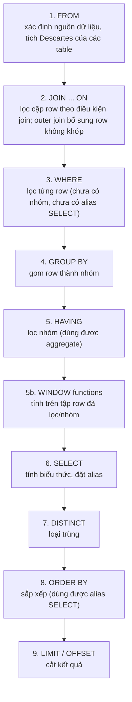
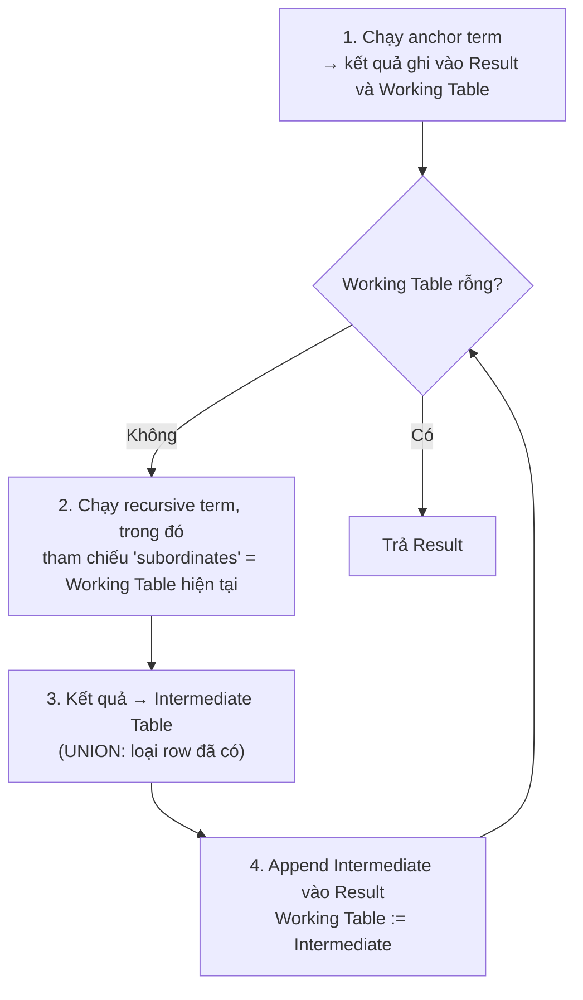
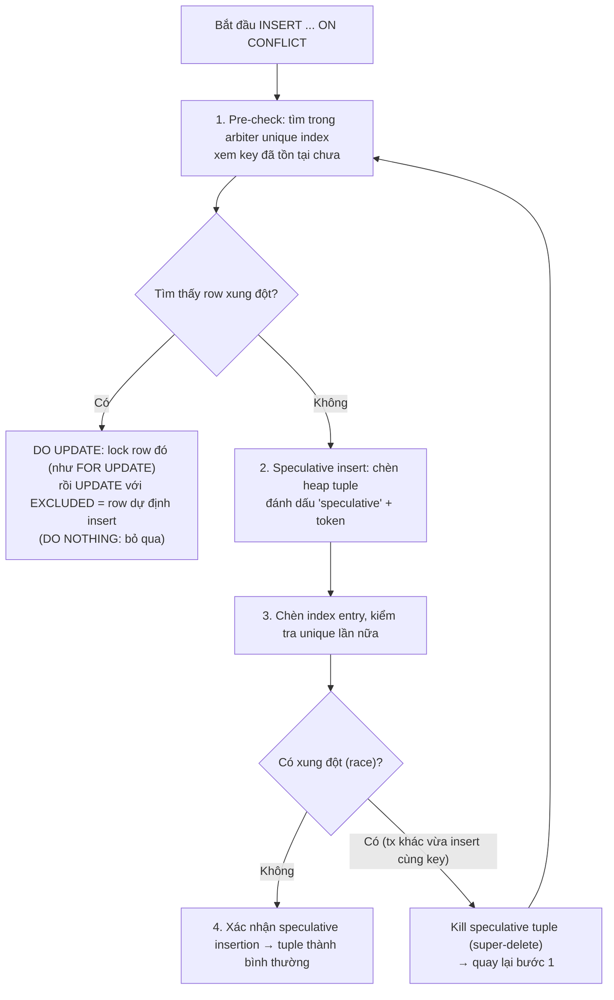

# PART 3 — SQL COMPLETE THEORY

> **Trước:** [02 — Data Modeling](02-data-modeling.md) · **Tiếp:** [04 — PostgreSQL Architecture](04-postgresql-architecture.md)

Chương này dạy SQL như một **ngôn ngữ có ngữ nghĩa chính xác**, không phải tập cú pháp. Với mỗi cấu trúc, ta trả lời: *nó có nghĩa gì về mặt logic*, *PostgreSQL thực thi nó bằng physical operator nào*, và *bẫy hiệu năng/đúng đắn nằm ở đâu*. SQL ở đây chỉ để minh họa ngữ nghĩa và hành vi.

---

## Mục lục

- [Phần A — Logical Query Processing Order (đọc trước)](#phần-a--logical-query-processing-order)
- [Phần B — Basic](#phần-b--basic)
- [Phần C — JOIN: logical vs physical](#phần-c--join)
- [Phần D — Aggregation](#phần-d--aggregation)
- [Phần E — Subquery](#phần-e--subquery)
- [Phần F — CTE](#phần-f--cte)
- [Phần G — Window Function](#phần-g--window-function)
- [Phần H — Set Operations](#phần-h--set-operations)
- [Phần I — DML: INSERT, UPDATE, DELETE, UPSERT, MERGE](#phần-i--dml)
- [Phần J — DDL: CREATE, ALTER, DROP, TRUNCATE](#phần-j--ddl)
- [Interview Questions](#interview-questions)
- [Key Takeaways](#key-takeaways)

---

## Phần A — Logical Query Processing Order

### A.1 WHAT

SQL được **viết** theo thứ tự:

```sql
SELECT DISTINCT ... FROM ... JOIN ... WHERE ... GROUP BY ... HAVING ... ORDER BY ... LIMIT ...
```

Nhưng **ngữ nghĩa logic** được định nghĩa như thể các mệnh đề được đánh giá theo thứ tự:



**Cách đọc diagram (trên xuống):** Mỗi bước nhận một "bảng trung gian" từ bước trước và tạo ra bảng trung gian mới. Window function được tính **sau** WHERE/GROUP BY/HAVING nhưng **trước** DISTINCT/ORDER BY/LIMIT, về mặt logic nằm cùng pha với SELECT.

### A.2 WHY — Tại sao viết một thứ tự, ngữ nghĩa theo thứ tự khác?

SQL được thiết kế (SEQUEL, 1974) để đọc gần với tiếng Anh: *"SELECT these columns FROM this table WHERE ..."* — câu bắt đầu bằng cái người dùng muốn thấy. Nhưng để định nghĩa ngữ nghĩa một cách nhất quán, cần một thứ tự trong đó mỗi bước chỉ phụ thuộc vào kết quả bước trước. Thứ tự logic trả lời chính xác các câu hỏi "cái gì nhìn thấy cái gì":

| Câu hỏi | Trả lời theo thứ tự logic |
|---|---|
| Tại sao `WHERE` không dùng được alias trong `SELECT`? | WHERE (bước 3) chạy trước SELECT (bước 6), alias chưa tồn tại. |
| Tại sao `WHERE COUNT(*) > 5` lỗi? | Aggregate chỉ có nghĩa sau GROUP BY (bước 4). Dùng HAVING. |
| Tại sao `ORDER BY` dùng được alias? | ORDER BY (bước 8) chạy sau SELECT. |
| Tại sao không lọc được theo kết quả window function trong WHERE? | Window tính sau WHERE. Phải bọc subquery/CTE. |
| `LEFT JOIN ... ON b.x = 1` khác `LEFT JOIN ... WHERE b.x = 1`? | ON là điều kiện join (row trái vẫn giữ); WHERE lọc sau join (loại row có `b.x` NULL → biến LEFT JOIN thành INNER JOIN). |

### A.3 Logical order ≠ Physical execution order

Đây là điểm mà rất nhiều người nhầm: **thứ tự logic chỉ định nghĩa kết quả phải là gì, không quy định PostgreSQL phải thực thi theo thứ tự đó.** Planner được phép biến đổi bất cứ điều gì miễn kết quả giống hệt:

- **Predicate pushdown:** điều kiện WHERE được đẩy xuống ngay lúc scan table (thậm chí vào index condition), không đợi JOIN xong.
- **Join reordering:** `A JOIN B JOIN C` có thể thực thi `(A ⋈ C) ⋈ B`.
- **LIMIT pushdown:** `ORDER BY created_at LIMIT 10` với index trên `created_at` → đọc 10 entry đầu của index, không sắp xếp toàn bộ.
- **Subquery flattening:** subquery trong FROM được "kéo lên" (pull up) hợp nhất với query ngoài.

Xem [Chương 05](05-query-lifecycle.md) (rewrite/plan) và [Chương 17](17-query-planner.md).

---

## Phần B — Basic

### B.1 SELECT, FROM, WHERE

- `FROM` tạo nguồn row. Không có `FROM` vẫn hợp lệ trong PostgreSQL: `SELECT now()` (thực thi bằng node `Result`).
- `WHERE` là predicate trên *từng row*; kết quả UNKNOWN bị loại (xem NULL ở [Chương 01](01-relational-database.md#9-null-và-logic-ba-giá-trị)).

**Physical:** WHERE trở thành *filter* gắn vào scan node (`Filter:` trong EXPLAIN) hoặc *index condition* (`Index Cond:`) nếu dùng được index. Khác biệt quan trọng: `Index Cond` giới hạn phạm vi đọc; `Filter` đọc rồi mới loại (thể hiện qua `Rows Removed by Filter`).

**Sargable predicate** (Search ARGument ABLE): predicate có dạng `column op constant` mà index dùng được. Biến đổi cột làm mất tính sargable:

| Không sargable | Sargable tương đương |
|---|---|
| `WHERE date(created_at) = '2025-01-01'` | `WHERE created_at >= '2025-01-01' AND created_at < '2025-01-02'` |
| `WHERE amount * 1.1 > 100` | `WHERE amount > 100 / 1.1` |
| `WHERE lower(email) = 'a@x.com'` | Tạo expression index `ON users (lower(email))` |
| `WHERE id::text = '42'` | `WHERE id = 42` |

Lý do: B-Tree sắp theo *giá trị cột*, không theo *giá trị hàm của cột*; planner không thể suy ngược để dùng thứ tự của index.

### B.2 ORDER BY

- Không có ORDER BY → không có thứ tự (xem [Chương 01](01-relational-database.md)).
- **Physical:** hoặc dùng thứ tự sẵn có của index (Index Scan trả row đã sắp), hoặc node `Sort`:
  - vừa `work_mem` → quicksort trong memory;
  - có LIMIT nhỏ → **top-N heapsort** (chỉ giữ N row tốt nhất trong heap, bộ nhớ O(N));
  - vượt `work_mem` → **external merge sort** (ghi các run ra temp file rồi merge) — thấy trong EXPLAIN là `Sort Method: external merge  Disk: ...`.
  - **Incremental Sort** (PG 13): nếu input đã sắp theo tiền tố `(a)` và cần `(a, b)`, chỉ sắp từng nhóm cùng `a`.
- Collation: sắp xếp text theo locale (ICU hoặc libc) đắt hơn nhiều so với so sánh byte (`COLLATE "C"`). Đổi version thư viện collation (glibc 2.28) có thể **làm hỏng thứ tự index text** — một sự cố production có thật khi nâng cấp OS.

### B.3 GROUP BY, HAVING

Trình bày ở [Phần D](#phần-d--aggregation).

### B.4 LIMIT, OFFSET — và tại sao OFFSET lớn chậm

`LIMIT 20 OFFSET 100000`: PostgreSQL **phải tạo ra 100.020 row rồi bỏ đi 100.000 row đầu**. Không có cách "nhảy" tới row thứ 100.000 trong B-Tree (B-Tree không lưu số thứ tự/rank của entry). Chi phí tăng tuyến tính theo OFFSET.

**Keyset pagination (seek method):**

```sql
-- Trang đầu
SELECT id, created_at, title FROM posts
ORDER BY created_at DESC, id DESC LIMIT 20;

-- Trang sau: truyền giá trị của row cuối trang trước
SELECT id, created_at, title FROM posts
WHERE (created_at, id) < ('2025-06-01 10:00', 98765)
ORDER BY created_at DESC, id DESC LIMIT 20;
```

Với index `(created_at DESC, id DESC)` (hoặc `(created_at, id)` scan ngược), mỗi trang là một **index range scan bắt đầu từ vị trí xác định** → chi phí hằng số, không phụ thuộc trang thứ mấy. Row comparison `(a, b) < (x, y)` được B-Tree hiểu như một điều kiện đa cột. Thêm `id` để thứ tự **ổn định** khi `created_at` trùng.

Cái giá: không nhảy được tới "trang 500" tùy ý; và OFFSET còn có vấn đề **không nhất quán** khi dữ liệu thay đổi giữa hai trang (row bị đẩy/trùng giữa các trang).

### B.5 DISTINCT và DISTINCT ON

- `DISTINCT` loại trùng trên toàn bộ các cột trong SELECT. Physical: `Unique` (trên input đã sắp) hoặc `HashAggregate`.
- `DISTINCT ON (expr)` (PostgreSQL-specific): giữ **row đầu tiên** của mỗi nhóm theo `ORDER BY`. Rất tiện cho "bản ghi mới nhất mỗi user":
  ```sql
  SELECT DISTINCT ON (user_id) user_id, created_at, status
  FROM orders ORDER BY user_id, created_at DESC;
  ```
  ORDER BY phải bắt đầu bằng biểu thức DISTINCT ON.
- **Bẫy:** `DISTINCT` thường là dấu hiệu join sai tạo ra row nhân bản (join 1-N rồi dùng DISTINCT để "sửa"). Chi phí: sắp xếp/hash cả tập kết quả lớn. Thường nên dùng `EXISTS`.

### B.6 CASE WHEN, COALESCE, NULLIF

- `CASE WHEN cond THEN a ... ELSE b END`: đánh giá theo thứ tự, dừng ở nhánh đầu tiên TRUE. Không có ELSE → NULL.
  - **Lưu ý:** PostgreSQL có thể đánh giá sớm biểu thức hằng (constant folding) trong nhánh không được chọn lúc planning. Ví dụ `CASE WHEN x > 0 THEN 1/0 END` có thể lỗi chia cho 0 ngay lúc plan nếu `1/0` là hằng. Documentation có ghi nhận ngoại lệ này.
- `COALESCE(a, b, c)`: giá trị non-NULL đầu tiên; chỉ đánh giá đối số cần thiết.
- `NULLIF(a, b)`: NULL nếu `a = b`, ngược lại `a`. Mẫu dùng: `x / NULLIF(y, 0)` tránh chia 0.

### B.7 IN, EXISTS, BETWEEN

- `x IN (1, 2, 3)` → planner chuyển thành `x = ANY('{1,2,3}')` — một **ScalarArrayOpExpr**. B-Tree hỗ trợ trực tiếp: index scan lặp qua từng giá trị (PG 17 cải tiến lớn: xử lý nhiều giá trị trong một lần duyệt index thay vì một lần descent mỗi giá trị). PG 18 còn biến đổi chuỗi `OR` trên cùng cột thành mảng `= ANY` để dùng index tốt hơn.
- `x IN (SELECT ...)` → semi-join (xem Phần C).
- `EXISTS (subquery)` → semi-join; `NOT EXISTS` → anti-join. Subquery chỉ cần tồn tại row, danh sách SELECT trong subquery bị bỏ qua (`SELECT 1` hay `SELECT *` như nhau).
- `BETWEEN a AND b` = `>= a AND <= b` (bao gồm hai đầu). Với timestamp, dùng `>= start AND < end` để tránh lỗi biên (ví dụ `BETWEEN '2025-01-01' AND '2025-01-31'` bỏ sót mọi thời điểm sau 00:00 ngày 31).

### B.8 LIKE, ILIKE

- `LIKE 'abc%'` (anchored prefix): dùng được B-Tree **chỉ khi** collation là `C` hoặc index được tạo với operator class `text_pattern_ops`/`varchar_pattern_ops`. Lý do: với collation ngôn ngữ (en_US.UTF-8...), thứ tự sắp xếp không phải thứ tự byte, nên "các chuỗi bắt đầu bằng abc" không nằm liên tiếp trong index theo cách planner có thể suy ra một range an toàn. Planner biến `LIKE 'abc%'` thành `col >= 'abc' AND col < 'abd'` chỉ khi thứ tự đảm bảo.
- `LIKE '%abc%'` (không anchored): B-Tree vô dụng. Dùng **GIN/GiST với `pg_trgm`** (trigram index): tách chuỗi thành các bộ 3 ký tự, index inverted.
- `ILIKE`: không phân biệt hoa thường; không dùng B-Tree thường. Dùng `pg_trgm` hoặc expression index `lower(col)` + `LIKE`.

---

## Phần C — JOIN

### C.1 Logical JOIN vs Physical JOIN

Đây là phân biệt quan trọng nhất của phần này:

| Logical join (ngữ nghĩa — *cái gì*) | Physical join (thuật toán — *bằng cách nào*) |
|---|---|
| INNER, LEFT, RIGHT, FULL OUTER, CROSS, SEMI, ANTI | Nested Loop, Hash Join, Merge Join |
| Do người viết SQL quyết định | Do **planner** quyết định |
| Quyết định *kết quả* | Quyết định *hiệu năng* |

Mọi logical join (trừ một số giới hạn) có thể được thực thi bằng bất kỳ physical join nào: EXPLAIN có thể ghi `Hash Left Join`, `Nested Loop Anti Join`, `Merge Full Join`... Giới hạn chính: Hash Join và Merge Join chỉ dùng được cho **equi-join** (điều kiện `=`); `FULL JOIN` chỉ thực thi được bằng Hash hoặc Merge (không Nested Loop). Chi tiết thuật toán ở [Chương 19](19-join-algorithms.md).

### C.2 Các logical join

Cho hai table:

```
users:  id | name          orders: id | user_id | amount
        1  | An                    10 | 1       | 50
        2  | Binh                  11 | 1       | 20
        3  | Chi                   12 | 4       | 99   (user 4 không tồn tại)
```

| Join | Ngữ nghĩa | Kết quả |
|---|---|---|
| `INNER JOIN ON u.id = o.user_id` | Chỉ cặp khớp | (An,10), (An,11) |
| `LEFT JOIN` | Mọi row trái + khớp phải, không khớp → NULL | (An,10), (An,11), (Binh,NULL), (Chi,NULL) |
| `RIGHT JOIN` | Mọi row phải | (An,10), (An,11), (NULL,12) |
| `FULL OUTER JOIN` | Mọi row hai bên | 5 row |
| `CROSS JOIN` | Tích Descartes, không điều kiện | 3 × 3 = 9 row |
| Self join | Table join với chính nó (alias khác nhau) | ví dụ nhân viên – quản lý |
| **Semi join** (`EXISTS`/`IN`) | Row trái có *ít nhất một* khớp, mỗi row trái xuất hiện **tối đa một lần** | An |
| **Anti join** (`NOT EXISTS`) | Row trái *không có* khớp | Binh, Chi |

### C.3 Semi join và Anti join — tại sao đáng chú ý

SQL không có cú pháp `SEMI JOIN`; nó được biểu diễn qua `EXISTS`, `IN`, `= ANY`. Khác biệt với INNER JOIN:

```sql
-- INNER JOIN: An xuất hiện 2 lần (vì có 2 order)
SELECT u.* FROM users u JOIN orders o ON o.user_id = u.id;

-- SEMI JOIN: An xuất hiện 1 lần
SELECT u.* FROM users u WHERE EXISTS (SELECT 1 FROM orders o WHERE o.user_id = u.id);
```

**Physical advantage:** Semi join có thể **dừng ngay khi tìm thấy khớp đầu tiên** cho mỗi row trái. Nested Loop Semi Join dừng inner scan sớm; Hash Semi Join chỉ cần biết có tồn tại. Viết `JOIN` + `DISTINCT` thay cho `EXISTS` buộc database tạo toàn bộ cặp rồi mới loại trùng.

**Anti join và NULL:** `NOT EXISTS` → `Anti Join`. `NOT IN (subquery)` **không** được biến thành anti join vì ngữ nghĩa NULL khác (xem [Chương 01](01-relational-database.md#92-các-bẫy-kinh-điển)). Luôn ưu tiên `NOT EXISTS`, hoặc `LEFT JOIN ... WHERE right.id IS NULL` (cũng được nhận diện thành anti join).

### C.4 Điều kiện trong ON vs WHERE với OUTER JOIN

```sql
-- (1) Giữ mọi user; chỉ ghép order > 30
SELECT u.name, o.id FROM users u LEFT JOIN orders o ON o.user_id = u.id AND o.amount > 30;
-- An,10 | Binh,NULL | Chi,NULL

-- (2) Lọc sau khi join: loại row có o.amount NULL → trở thành INNER JOIN
SELECT u.name, o.id FROM users u LEFT JOIN orders o ON o.user_id = u.id WHERE o.amount > 30;
-- An,10
```

Planner nhận ra trường hợp (2): điều kiện WHERE *strict* (NULL input → không TRUE) trên cột phía nullable → **outer join reduction** → biến LEFT JOIN thành INNER JOIN, mở thêm lựa chọn thứ tự join.

### C.5 LATERAL

`LATERAL` cho phép subquery trong FROM tham chiếu cột của các table đứng trước — giống "for each row, chạy subquery này":

```sql
-- 3 order mới nhất của mỗi user
SELECT u.id, o.*
FROM users u
CROSS JOIN LATERAL (
  SELECT * FROM orders o WHERE o.user_id = u.id ORDER BY created_at DESC LIMIT 3
) o;
```

Physical: gần như luôn là **Nested Loop** với inner là index scan có tham số `u.id`. Rất hiệu quả khi có index `(user_id, created_at)`, thường vượt trội so với window function `ROW_NUMBER()` trên toàn table khi số user cần lấy nhỏ.

### C.6 Join explosion

Join nhiều quan hệ 1-N cùng lúc tạo **tích** thay vì tổng:

```sql
SELECT u.id, COUNT(o.id), COUNT(r.id)
FROM users u
LEFT JOIN orders o ON o.user_id = u.id     -- 100 order
LEFT JOIN reviews r ON r.user_id = u.id    -- 50 review
GROUP BY u.id;
-- Mỗi user tạo 100 × 50 = 5000 row trung gian; COUNT sai (5000, 5000)
```

Sửa: aggregate từng nhánh riêng (subquery/LATERAL) rồi mới join.

---

## Phần D — Aggregation

### D.1 WHAT

Aggregate function gom nhiều row thành một giá trị: `COUNT`, `SUM`, `AVG`, `MIN`, `MAX`, `string_agg`, `array_agg`, `jsonb_agg`, `bool_and`, `percentile_cont`...

Ngữ nghĩa với NULL:
- `COUNT(*)` đếm row; `COUNT(col)` đếm giá trị non-NULL; `COUNT(DISTINCT col)` đếm giá trị khác nhau non-NULL.
- `SUM`, `AVG`, `MIN`, `MAX` bỏ qua NULL; trên tập rỗng (hoặc toàn NULL) trả **NULL**, không phải 0. `SUM` của nhóm không có row → NULL → dùng `COALESCE(SUM(x), 0)`.
- `FILTER (WHERE ...)`: aggregate có điều kiện, sạch hơn `SUM(CASE WHEN ...)`:
  ```sql
  SELECT COUNT(*) FILTER (WHERE status = 'paid') AS paid, COUNT(*) AS total FROM orders;
  ```

### D.2 HOW — Aggregate được tính bằng state machine

Mỗi aggregate trong PostgreSQL được định nghĩa (trong `pg_aggregate`) bởi:
- **state type** + **initial state**;
- **transition function** `sfunc(state, value) → state` gọi cho mỗi row;
- **final function** `ffunc(state) → result` (tùy chọn);
- **combine function** (cho parallel aggregation): gộp hai partial state.

Ví dụ `AVG(int)`: state = (count, sum); sfunc cộng dồn; ffunc = sum/count. Nhờ combine function, parallel worker tính partial state riêng, leader gộp lại (`Partial Aggregate` → `Gather` → `Finalize Aggregate` trong EXPLAIN).

### D.3 Physical: GroupAggregate vs HashAggregate

| | **GroupAggregate** | **HashAggregate** |
|---|---|---|
| Input | Đã sắp theo GROUP BY key (sort hoặc index) | Bất kỳ |
| Cách làm | Duyệt tuần tự, khi key đổi → xuất nhóm | Hash table: key → state |
| Memory | O(1) (một nhóm tại một thời điểm) | O(số nhóm) |
| Output | Có thứ tự | Không thứ tự |
| Khi vượt memory | Không áp dụng (sort có thể spill) | Từ PG 13: **spill ra disk** theo partition (trước PG 13 có thể vượt `work_mem` và gây OOM) |

Memory limit cho hash = `work_mem × hash_mem_multiplier` (mặc định 2.0 từ PG 15).

### D.4 HAVING

Lọc **nhóm** sau aggregate. Điều kiện không chứa aggregate nên đặt ở WHERE (lọc sớm, giảm số row vào aggregate) — planner tự đẩy điều kiện HAVING không phụ thuộc aggregate xuống WHERE khi an toàn.

### D.5 Advanced grouping

`GROUPING SETS`, `ROLLUP`, `CUBE`: nhiều mức gom trong một query. Physical: `MixedAggregate` hoặc nhiều lần sort.

---

## Phần E — Subquery

### E.1 Các loại

| Loại | Ví dụ | Đặc điểm |
|---|---|---|
| **Scalar subquery** | `SELECT (SELECT max(amount) FROM orders) AS m` | Trả đúng 1 giá trị (0 row → NULL; >1 row → lỗi) |
| **Correlated subquery** | `SELECT u.*, (SELECT count(*) FROM orders o WHERE o.user_id = u.id) FROM users u` | Tham chiếu cột của query ngoài → về logic chạy lại mỗi row ngoài |
| **Derived table** | `FROM (SELECT ...) AS t` | Subquery trong FROM |
| **EXISTS / NOT EXISTS** | xem Phần C | Semi/anti join |
| **IN / NOT IN / ANY / ALL** | `WHERE id IN (SELECT ...)` | IN → semi join; NOT IN → bẫy NULL |

### E.2 HOW — Planner xử lý subquery thế nào

1. **Pull-up (flattening):** Derived table đơn giản và `IN/EXISTS` subquery được *kéo lên* thành join ở query ngoài trong giai đoạn planning (`pull_up_subqueries`, `pull_up_sublinks`). Sau đó chúng tham gia join reordering như table bình thường. Đây là lý do `EXISTS`, `IN`, và `JOIN` viết khác nhau có thể ra cùng plan.
2. **InitPlan:** Subquery không correlated được tính **một lần** trước, kết quả dùng như tham số (`InitPlan 1 (returns $0)` trong EXPLAIN).
3. **SubPlan:** Subquery correlated không pull-up được → thực thi lại cho mỗi row ngoài (`SubPlan 1`, `loops=N`). Có thể là **hashed SubPlan** nếu kết quả đủ nhỏ để hash một lần.

Những gì cản pull-up: subquery có `LIMIT`, aggregate, window function, `DISTINCT`, set operation, volatile function... (với derived table); `OR` kết hợp với EXISTS; NOT IN.

### E.3 WHAT HAPPENS IF — Correlated scalar subquery trên table lớn

`SELECT u.*, (SELECT count(*) FROM orders o WHERE o.user_id = u.id) FROM users u` với 1 triệu user: SubPlan chạy 1 triệu lần. Có index trên `orders.user_id` → mỗi lần là index scan nhỏ, tổng có thể chấp nhận. Không có index → 1 triệu lần seq scan → không bao giờ xong. Viết lại bằng `LEFT JOIN (SELECT user_id, count(*) ... GROUP BY user_id)` cho phép Hash Join một lần.

---

## Phần F — CTE

### F.1 WHAT

**Common Table Expression** (`WITH`) đặt tên cho một subquery, dùng được nhiều lần trong query:

```sql
WITH recent AS (
  SELECT * FROM orders WHERE created_at > now() - interval '7 days'
)
SELECT user_id, sum(amount) FROM recent GROUP BY user_id;
```

### F.2 Materialized vs Inlined — thay đổi quan trọng ở PG 12

- **Trước PG 12:** CTE luôn là **optimization fence**: được tính toàn bộ và lưu (materialize) vào một tuplestore, query ngoài đọc từ đó. Điều kiện ở query ngoài **không** được đẩy vào CTE. Nhiều người dùng CTE vô tình làm query chậm (hoặc cố ý dùng để "ép" planner).
- **Từ PG 12:** CTE **không đệ quy, không có side effect (không phải DML, không volatile function), và chỉ được tham chiếu một lần** được **inline** như subquery → planner tối ưu xuyên qua nó. Có thể điều khiển:
  ```sql
  WITH x AS MATERIALIZED (...)      -- ép tính một lần, làm fence
  WITH x AS NOT MATERIALIZED (...)  -- ép inline (kể cả khi tham chiếu nhiều lần)
  ```
- CTE tham chiếu **nhiều lần** mặc định vẫn materialize (để không tính lại).

**Khi nào MATERIALIZED có lợi:** CTE đắt, tham chiếu nhiều lần; hoặc muốn ngăn planner chọn plan tệ do estimate sai (một "hint" thô). **Khi nào hại:** CTE trả kết quả lớn mà query ngoài chỉ cần một phần (không push-down được filter), và tuplestore vượt `work_mem` → ghi temp file.

### F.3 Data-modifying CTE

```sql
WITH moved AS (
  DELETE FROM orders WHERE created_at < '2020-01-01' RETURNING *
)
INSERT INTO orders_archive SELECT * FROM moved;
```

Tất cả sub-statement dùng **cùng một snapshot**; chúng *không* thấy thay đổi của nhau qua table (chỉ qua `RETURNING`). Mọi data-modifying CTE được thực thi đầy đủ kể cả khi query chính không đọc hết kết quả.

### F.4 Recursive CTE

```sql
WITH RECURSIVE subordinates AS (
  SELECT id, manager_id, name, 1 AS depth FROM employees WHERE id = 1   -- anchor (non-recursive term)
  UNION ALL
  SELECT e.id, e.manager_id, e.name, s.depth + 1
  FROM employees e JOIN subordinates s ON e.manager_id = s.id             -- recursive term
)
SELECT * FROM subordinates;
```

**HOW (thuật toán thực thi — thực ra là lặp, không phải đệ quy):**



**Cách đọc diagram:** Mỗi vòng lặp, recursive term chỉ nhìn thấy các row **mới sinh ra ở vòng trước** (working table), không phải toàn bộ kết quả. Vòng lặp dừng khi một vòng không sinh thêm row nào. Với `UNION` (không ALL), row trùng với row đã có bị loại → giúp dừng trên đồ thị có chu trình; với `UNION ALL`, đồ thị có chu trình → **vòng lặp vô hạn**. PG 14 thêm mệnh đề `CYCLE` và `SEARCH DEPTH/BREADTH FIRST` để phát hiện chu trình và kiểm soát thứ tự duyệt.

**Physical:** node `Recursive Union` với `WorkTable Scan`. Mỗi vòng recursive term có thể dùng index (ví dụ index trên `employees.manager_id`) — thiếu index thì mỗi vòng là một seq scan.

---

## Phần G — Window Function

### G.1 WHAT

Window function tính một giá trị cho **mỗi row** dựa trên một **tập row liên quan (window frame)** — không gom row lại như GROUP BY.

```sql
SELECT user_id, created_at, amount,
       SUM(amount) OVER (PARTITION BY user_id ORDER BY created_at) AS running_total,
       ROW_NUMBER() OVER (PARTITION BY user_id ORDER BY created_at DESC) AS rn
FROM orders;
```

### G.2 Ba thành phần của OVER

1. **PARTITION BY**: chia row thành các nhóm độc lập (window partition). Không có → toàn bộ kết quả là một partition.
2. **ORDER BY**: thứ tự trong partition; quyết định ý nghĩa của ranking, LAG/LEAD, running aggregate.
3. **Frame clause**: tập row trong partition mà aggregate "nhìn thấy" từ row hiện tại:
   - `ROWS BETWEEN 6 PRECEDING AND CURRENT ROW` — theo số row vật lý;
   - `RANGE BETWEEN interval '7 days' PRECEDING AND CURRENT ROW` — theo giá trị ORDER BY (PG 11+ hỗ trợ offset);
   - `GROUPS BETWEEN ...` — theo nhóm peer (các row có cùng giá trị ORDER BY).

**Frame mặc định (bẫy lớn):** khi có ORDER BY mà không ghi frame, frame là `RANGE BETWEEN UNBOUNDED PRECEDING AND CURRENT ROW` — **bao gồm cả các peer** (row có cùng giá trị ORDER BY). Hệ quả:
- `SUM(...) OVER (ORDER BY day)` với nhiều row cùng `day` → các row cùng ngày có **cùng** running total (đã cộng hết cả ngày), không tăng dần từng row.
- `LAST_VALUE(x) OVER (ORDER BY t)` trả về **giá trị của row hiện tại (hoặc peer cuối)**, không phải giá trị cuối partition. Phải ghi rõ `ROWS BETWEEN UNBOUNDED PRECEDING AND UNBOUNDED FOLLOWING`.

### G.3 Các hàm phổ biến

| Hàm | Ý nghĩa | Với giá trị trùng (peer) |
|---|---|---|
| `ROW_NUMBER()` | 1, 2, 3, 4 | Số khác nhau, thứ tự giữa các peer **không xác định** |
| `RANK()` | 1, 2, 2, 4 | Peer cùng rank, có lỗ |
| `DENSE_RANK()` | 1, 2, 2, 3 | Peer cùng rank, không lỗ |
| `LAG(x, n)` / `LEAD(x, n)` | Giá trị của row trước/sau n vị trí | Không phụ thuộc frame |
| `FIRST_VALUE`, `LAST_VALUE`, `NTH_VALUE` | Theo **frame** | Bẫy frame mặc định |
| `NTILE(n)` | Chia thành n nhóm | |
| Aggregate `OVER` | Running sum, moving average | Theo frame |

**Moving average 7 ngày:**
```sql
AVG(amount) OVER (ORDER BY day ROWS BETWEEN 6 PRECEDING AND CURRENT ROW)
```
(`ROWS` giả định mỗi ngày đúng một row; nếu có ngày thiếu, dùng `RANGE BETWEEN interval '6 days' PRECEDING AND CURRENT ROW`.)

### G.4 HOW — Physical execution

Node `WindowAgg` yêu cầu input **đã sắp theo (PARTITION BY, ORDER BY)** → thường có `Sort` phía dưới (hoặc index cung cấp sẵn thứ tự). Nhiều window với định nghĩa khác nhau → nhiều lần sort. `WindowAgg` duyệt từng partition, giữ các row của frame trong một tuplestore (có thể spill ra disk nếu partition lớn).

PG 15 tối ưu: `WHERE rn <= 10` bên ngoài trên `ROW_NUMBER()`/`RANK()`/`COUNT(*)` được dùng làm **run condition** → `WindowAgg` dừng sớm cho mỗi partition, không tính tiếp các row sẽ bị lọc.

### G.5 Top-N per group: window vs LATERAL

```sql
-- Window: tính rank cho MỌI row rồi lọc
SELECT * FROM (
  SELECT *, ROW_NUMBER() OVER (PARTITION BY user_id ORDER BY created_at DESC) rn FROM orders
) t WHERE rn <= 3;
```
Phải sort toàn bộ `orders` (hoặc đọc toàn bộ index). Tốt khi cần cho *mọi* user. Khi chỉ cần cho một tập user nhỏ, `LATERAL ... LIMIT 3` với index `(user_id, created_at)` đọc đúng ~3 entry mỗi user.

---

## Phần H — Set Operations

| Toán tử | Ngữ nghĩa | Physical |
|---|---|---|
| `UNION` | Hợp, **loại trùng** | `Append` + `HashAggregate`/`Unique` (sort) |
| `UNION ALL` | Hợp, giữ trùng | Chỉ `Append` — rẻ, streaming |
| `INTERSECT [ALL]` | Giao | `HashSetOp` hoặc `SetOp` trên input đã sắp |
| `EXCEPT [ALL]` | Hiệu | như trên |

Quy tắc: cột tương ứng phải cùng số lượng và kiểu tương thích; tên cột lấy từ query đầu.

**Bẫy hiệu năng:** Dùng `UNION` khi biết chắc không trùng (ví dụ hai nhánh lọc theo điều kiện loại trừ nhau) → trả chi phí loại trùng vô ích (sort/hash toàn bộ). Mặc định nghĩ `UNION ALL`, chỉ dùng `UNION` khi thật sự cần loại trùng.

**Mẹo OR → UNION ALL:** `WHERE a = 1 OR b = 2` với index riêng trên a và b: PostgreSQL thường dùng **BitmapOr** kết hợp hai bitmap index scan — tức là nó đã tự làm "union" ở mức TID. Viết tay `UNION` chỉ cần thiết khi bitmap không phù hợp (ví dụ cần ORDER BY + LIMIT theo index).

---

## Phần I — DML

### I.1 INSERT

```sql
INSERT INTO users (email, name) VALUES ('a@x.com', 'An') RETURNING id, created_at;
INSERT INTO archive SELECT * FROM orders WHERE ...;
```

- `RETURNING` trả dữ liệu của row vừa ghi (bao gồm giá trị default, identity) trong cùng round-trip. PG 18: `RETURNING OLD.*, NEW.*` cho UPDATE/DELETE/MERGE/INSERT.
- Multi-row `VALUES (...), (...), ...` hoặc `COPY` nhanh hơn nhiều so với N câu INSERT riêng: ít round-trip, ít parse/plan, và nếu cùng transaction thì chỉ **một** lần fsync lúc commit thay vì N lần. `COPY` còn dùng bulk-write ring buffer và đường insert nhiều tuple cùng lúc (`heap_multi_insert`, sinh ít WAL record hơn).
- Chuyện gì xảy ra bên trong (tìm page trống qua FSM, ghi tuple, WAL, cập nhật index) → [Chương 07](07-read-write-behavior.md).

### I.2 UPDATE

```sql
UPDATE accounts SET balance = balance - 100 WHERE id = 1;
UPDATE orders o SET status = 'vip' FROM users u WHERE o.user_id = u.id AND u.tier = 'gold';  -- UPDATE ... FROM (PostgreSQL)
```

Ghi nhớ trước khi đọc chi tiết ở [Chương 07](07-read-write-behavior.md): **UPDATE trong PostgreSQL không ghi đè row cũ.** Nó đánh dấu tuple cũ (đặt `xmax`) và ghi một tuple mới. Hệ quả: dead tuple, bloat, VACUUM, cập nhật index (trừ HOT).

**Read-modify-write an toàn:** `SET balance = balance - 100` tính trên **phiên bản mới nhất** của row tại thời điểm lấy row lock (ở Read Committed, cơ chế EvalPlanQual sẽ đánh giá lại trên version mới nếu row bị transaction khác cập nhật trong lúc chờ). Ngược lại, pattern "SELECT balance ở application → tính → UPDATE SET balance = <giá trị tính sẵn>" có thể gây **lost update**. Xem [Chương 12](12-isolation-level.md).

**UPDATE ... FROM bẫy:** nếu một row đích khớp nhiều row nguồn, row đích bị cập nhật bằng **một** row nguồn bất kỳ (không xác định), không báo lỗi.

### I.3 DELETE

```sql
DELETE FROM sessions WHERE expires_at < now();
DELETE FROM orders o USING users u WHERE o.user_id = u.id AND u.deleted;  -- DELETE ... USING
```

DELETE chỉ đặt `xmax` trên tuple; không trả chỗ trống ngay cho OS. Xóa hàng loạt:
- Xóa 100 triệu row trong một câu: transaction khổng lồ, giữ lock lâu, WAL lớn, replication lag, và tạo 100 triệu dead tuple cùng lúc.
- Tốt hơn: xóa theo batch nhỏ (theo khoảng PK), để autovacuum theo kịp.
- Tốt nhất cho dữ liệu theo thời gian: **partition theo thời gian và `DROP`/`DETACH` partition** — xóa cả file trong O(1), không dead tuple. Xem [Chương 32](32-partitioning.md).

### I.4 UPSERT: INSERT ... ON CONFLICT

```sql
INSERT INTO counters (key, value) VALUES ('page:1', 1)
ON CONFLICT (key) DO UPDATE SET value = counters.value + EXCLUDED.value;

INSERT INTO users (email) VALUES ('a@x.com') ON CONFLICT (email) DO NOTHING;
```

**WHY:** Pattern "SELECT xem có chưa → INSERT hoặc UPDATE" ở application có race condition: hai request cùng thấy "chưa có" → cả hai INSERT → một cái lỗi duplicate. Retry loop thì phức tạp.

**HOW — Speculative insertion (PostgreSQL 9.5+):**



**Cách đọc diagram:** PostgreSQL trước tiên kiểm tra nhanh trong unique index. Nếu chưa có, nó chèn tuple theo kiểu "dự đoán" (speculative). Khi chèn vào index, nếu phát hiện một transaction đồng thời vừa chèn cùng key, tuple dự đoán bị hủy ngay (*super-delete*, không để lại dead tuple ảnh hưởng người khác theo cách thông thường) và vòng lặp chạy lại — lần này sẽ thấy row xung đột và đi nhánh UPDATE/NOTHING. Kết quả: **UPSERT luôn hoặc insert, hoặc update, không bao giờ lỗi duplicate key** trên arbiter index, ở mọi isolation level (ở Repeatable Read/Serializable vẫn có thể lỗi serialization).

**Lưu ý:**
- `ON CONFLICT DO UPDATE` không thể cập nhật cùng một row hai lần trong một câu (`VALUES` chứa hai key trùng) → lỗi "command cannot affect row a second time".
- Mỗi lần xung đột theo nhánh UPDATE vẫn tạo tuple version mới → counter nóng vẫn là hot row.
- `DO NOTHING` với nhiều xung đột vẫn có thể "đốt" giá trị sequence (nextval được gọi trước khi biết có xung đột).

### I.5 MERGE (PG 15+)

`MERGE` (chuẩn SQL) đồng bộ một nguồn vào đích với nhiều nhánh `WHEN MATCHED`/`WHEN NOT MATCHED` (PG 17 thêm `WHEN NOT MATCHED BY SOURCE` và `RETURNING`).

```sql
MERGE INTO inventory t
USING incoming s ON t.sku = s.sku
WHEN MATCHED AND s.qty = 0 THEN DELETE
WHEN MATCHED THEN UPDATE SET qty = s.qty
WHEN NOT MATCHED THEN INSERT (sku, qty) VALUES (s.sku, s.qty);
```

**Khác biệt quan trọng với ON CONFLICT:** `MERGE` thực hiện join giữa nguồn và đích rồi quyết định nhánh; nó **không** dùng speculative insertion. Nếu transaction đồng thời chèn cùng key sau khi MERGE đã quyết định "NOT MATCHED", MERGE sẽ **lỗi unique violation**. Documentation khuyến nghị: khi cần UPSERT an toàn đồng thời theo unique key, dùng `INSERT ... ON CONFLICT`. MERGE phù hợp cho đồng bộ batch/ETL.

---

## Phần J — DDL

### J.1 CREATE

`CREATE TABLE`, `CREATE INDEX`, `CREATE VIEW`... là INSERT vào catalog + tạo file vật lý (với table/index). DDL transactional (xem [Chương 01](01-relational-database.md#52-why--catalog-là-table-thông-thường-và-điều-đó-có-hệ-quả-lớn)).

`CREATE INDEX` thường lấy lock `SHARE` trên table → **chặn INSERT/UPDATE/DELETE** trong suốt thời gian build (đọc vẫn được). Trên table lớn production, dùng `CREATE INDEX CONCURRENTLY` — cơ chế ở [Chương 15](15-index-internals.md).

### J.2 ALTER — rewrite hay metadata-only?

Câu hỏi quan trọng nhất với mọi `ALTER TABLE` production: **nó có rewrite toàn bộ table không, và giữ lock gì, bao lâu?** Hầu hết `ALTER TABLE` lấy `ACCESS EXCLUSIVE` lock (chặn cả SELECT). Nếu nó chỉ sửa catalog, lock giữ vài ms; nếu nó rewrite table 500GB, lock giữ hàng giờ → downtime.

| Thao tác | Hành vi (PG 11+) |
|---|---|
| `ADD COLUMN` không default hoặc default **non-volatile** (`DEFAULT 0`, `DEFAULT 'x'`) | **Metadata-only** (PG 11+): default lưu trong `pg_attribute.attmissingval`, tuple cũ thiếu cột sẽ được đọc với giá trị này. Nhanh. |
| `ADD COLUMN ... DEFAULT now()` / `random()` (volatile) | Rewrite toàn table |
| `DROP COLUMN` | Metadata-only: cột bị đánh dấu dropped, dữ liệu vẫn nằm trong tuple cho đến khi row được ghi lại |
| `ALTER COLUMN TYPE` | Thường rewrite (trừ các đổi kiểu binary-compatible như `varchar(10)` → `varchar(20)` hoặc → `text`) + rebuild index |
| `SET NOT NULL` | Scan kiểm tra (không rewrite) dưới ACCESS EXCLUSIVE; bỏ qua nếu có CHECK đã validate chứng minh |
| `ADD CONSTRAINT ... CHECK/FK` | Scan kiểm tra; dùng `NOT VALID` + `VALIDATE` để tách |
| `ADD PRIMARY KEY` | Build index dưới lock nặng; cách an toàn: `CREATE UNIQUE INDEX CONCURRENTLY` rồi `ADD PRIMARY KEY USING INDEX` |

**Lock queue hazard (cực kỳ quan trọng):** `ALTER TABLE` cần `ACCESS EXCLUSIVE`. Nếu đang có một query dài giữ `ACCESS SHARE`, ALTER phải chờ. Trong lúc ALTER chờ, **mọi query mới** muốn `ACCESS SHARE` (SELECT thường!) cũng phải xếp hàng **sau** ALTER (vì lock queue công bằng, request mới xung đột với request đang chờ). Kết quả: một câu ALTER "chỉ sửa metadata" có thể làm toàn bộ traffic đứng im. Luôn dùng `SET lock_timeout = '3s'` trước DDL và retry. Chi tiết [Chương 13](13-locking.md).

### J.3 DROP

`DROP TABLE` xóa entry catalog và **unlink file lúc commit** (file vật lý chỉ bị xóa khi transaction commit; rollback thì file còn). Giải phóng disk ngay (khác DELETE). Lấy `ACCESS EXCLUSIVE`. Với shared buffers rất lớn, drop relation phải quét buffer để hủy các page của relation đó (tối ưu hóa ở các version gần đây cho relation nhỏ).

### J.4 TRUNCATE

- **WHAT:** Xóa toàn bộ row nhanh bằng cách **gán file mới (relfilenode mới) rỗng** cho table, file cũ bị xóa lúc commit.
- **Khác DELETE:**

| | DELETE (không WHERE) | TRUNCATE |
|---|---|---|
| Cơ chế | Đặt xmax cho từng tuple | Đổi sang file rỗng |
| Chi phí | O(số row), WAL mỗi row | O(1) |
| Dead tuple | Có, cần VACUUM | Không |
| Giải phóng disk | Không (đến khi VACUUM FULL) | Ngay khi commit |
| Lock | ROW EXCLUSIVE | **ACCESS EXCLUSIVE** |
| Trigger | ON DELETE per-row | ON TRUNCATE (statement) |
| Transactional | Có | **Có** trong PostgreSQL (rollback được, khác MySQL) |
| MVCC-safe | Có | **Không**: transaction khác có snapshot cũ (Repeatable Read) sẽ thấy table rỗng sau khi TRUNCATE commit |
| Sequence | Không đổi | `RESTART IDENTITY` tùy chọn |

---

## Interview Questions

**Q1. Thứ tự logic của câu SELECT là gì? Tại sao WHERE không dùng được alias?**
- *Short:* FROM → JOIN → WHERE → GROUP BY → HAVING → window → SELECT → DISTINCT → ORDER BY → LIMIT. WHERE chạy trước SELECT.
- *Deep:* Thứ tự logic định nghĩa kết quả; planner tự do đổi thứ tự vật lý (pushdown, reorder).
- *Follow-up:* Tại sao `LEFT JOIN` kèm `WHERE right.col = x` thành INNER JOIN?

**Q2. Logical join vs physical join?**
- *Short:* Logical (INNER/LEFT/SEMI/ANTI...) là ngữ nghĩa do người viết chọn; physical (Nested Loop/Hash/Merge) là thuật toán do planner chọn.

**Q3. `NOT IN` vs `NOT EXISTS`?**
- *Short:* NULL làm NOT IN trả rỗng; NOT EXISTS thành Anti Join còn NOT IN thì không.

**Q4. Tại sao OFFSET lớn chậm? Giải pháp?**
- *Short:* Phải sinh và bỏ đi OFFSET row; B-Tree không hỗ trợ nhảy theo vị trí. Dùng keyset pagination.

**Q5. `INSERT ON CONFLICT` khác `MERGE` thế nào về concurrency?**
- *Short:* ON CONFLICT dùng speculative insertion, đảm bảo không lỗi duplicate trên arbiter index; MERGE có thể lỗi unique violation khi có insert đồng thời.

**Q6. CTE có phải optimization fence không?**
- *Short:* Trước PG 12: có. Từ PG 12: CTE không đệ quy, không side effect, tham chiếu một lần được inline; điều khiển bằng `MATERIALIZED`/`NOT MATERIALIZED`.

**Q7. `LAST_VALUE() OVER (ORDER BY x)` trả kết quả "sai" — tại sao?**
- *Short:* Frame mặc định kết thúc ở CURRENT ROW (kèm peer). Phải chỉ định frame tới `UNBOUNDED FOLLOWING`.

**Q8. TRUNCATE khác DELETE thế nào?**
- *Short:* TRUNCATE đổi file mới, O(1), ACCESS EXCLUSIVE, không dead tuple, không MVCC-safe; DELETE per-row, tạo dead tuple.

**Q9. Tại sao `ALTER TABLE ADD COLUMN` đôi khi làm cả hệ thống treo dù chỉ mất vài ms?**
- *Short:* Lock queue: ALTER chờ ACCESS EXCLUSIVE sau một query dài, và mọi SELECT mới xếp hàng sau ALTER. Dùng `lock_timeout`.

---

## Key Takeaways

1. SQL có **thứ tự logic** khác thứ tự viết; nó định nghĩa kết quả, không định nghĩa cách thực thi.
2. Logical join ≠ physical join. EXISTS → semi join; NOT EXISTS → anti join; NOT IN là bẫy.
3. Predicate phải **sargable** để dùng index; biến đổi cột → mất index (trừ expression index).
4. OFFSET lớn là O(OFFSET); dùng keyset pagination.
5. CTE được inline từ PG 12; `MATERIALIZED` để làm fence có chủ đích.
6. Recursive CTE là vòng lặp trên working table; `UNION ALL` + chu trình = vô hạn.
7. Window function: frame mặc định là `RANGE UNBOUNDED PRECEDING → CURRENT ROW` (kèm peer).
8. UPDATE/DELETE không ghi đè/xóa vật lý ngay (→ MVCC, VACUUM).
9. UPSERT an toàn đồng thời: `INSERT ... ON CONFLICT` (speculative insertion), không phải MERGE.
10. Mọi DDL production: hỏi "rewrite hay metadata-only? lock gì? bao lâu?" và luôn đặt `lock_timeout`.

---

## Nguồn tham khảo

- PostgreSQL Docs — *Queries*: https://www.postgresql.org/docs/current/queries.html
- PostgreSQL Docs — *WITH Queries (CTE)*: https://www.postgresql.org/docs/current/queries-with.html
- PostgreSQL Docs — *Window Functions*: https://www.postgresql.org/docs/current/tutorial-window.html và https://www.postgresql.org/docs/current/sql-expressions.html#SYNTAX-WINDOW-FUNCTIONS
- PostgreSQL Docs — *INSERT (ON CONFLICT)*: https://www.postgresql.org/docs/current/sql-insert.html
- PostgreSQL Docs — *MERGE*: https://www.postgresql.org/docs/current/sql-merge.html
- PostgreSQL Docs — *ALTER TABLE (Notes)*: https://www.postgresql.org/docs/current/sql-altertable.html
- PostgreSQL Wiki — *Don't Do This*: https://wiki.postgresql.org/wiki/Don%27t_Do_This
- Markus Winand, *Use The Index, Luke* — chương về pagination (seek method).
