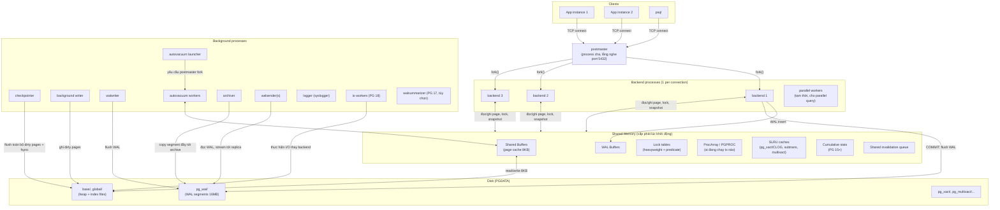
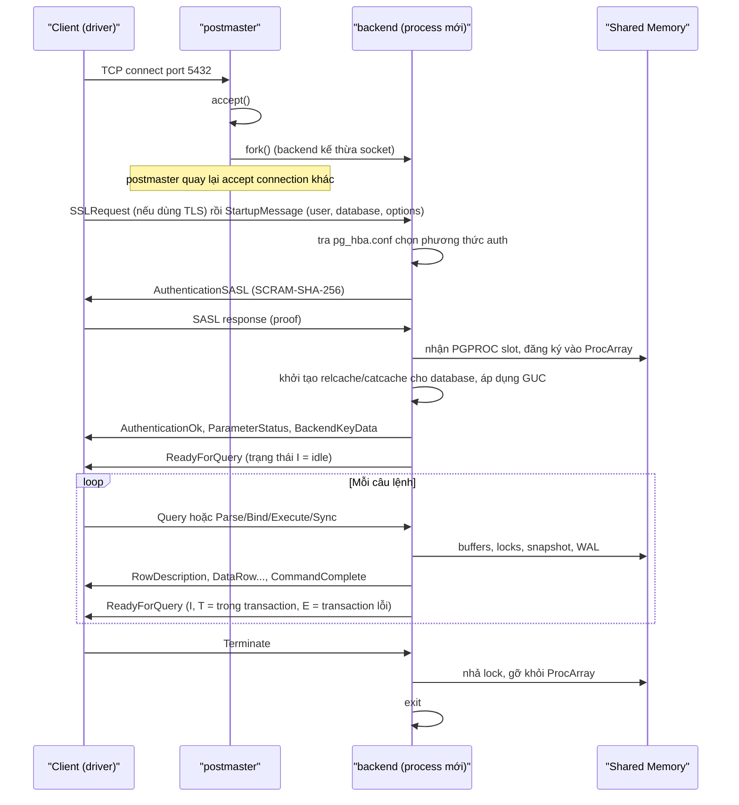
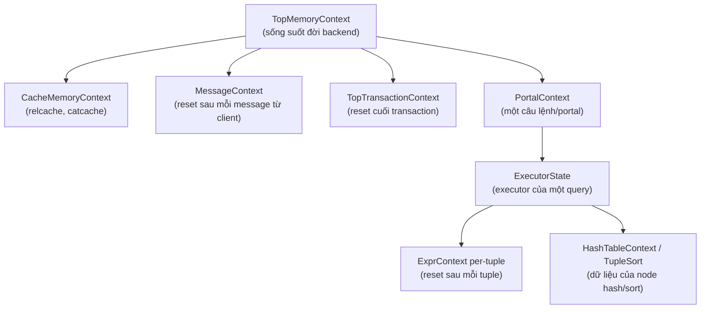
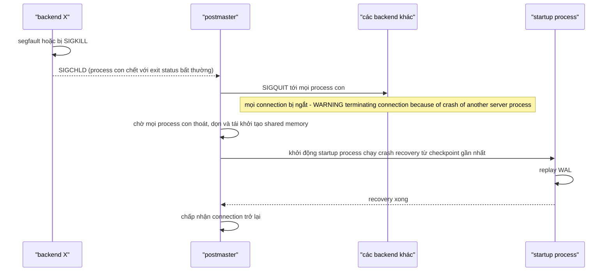

# PART 4 — POSTGRESQL ARCHITECTURE

> **Trước:** [03 — SQL](03-sql.md) · **Tiếp:** [05 — Query Lifecycle](05-query-lifecycle.md)
> **Độ ưu tiên:** Rất cao. Mọi chương sau đều giả định bạn đã nắm bức tranh process + memory ở đây.
> **Phiên bản tham chiếu:** PostgreSQL 18. Các thay đổi kiến trúc theo version được ghi chú rõ (PG 15: bỏ stats collector; PG 17: WAL summarizer, `pg_stat_checkpointer`; PG 18: asynchronous I/O với IO workers).

---

## Mục lục

1. [Simple mental model](#1-simple-mental-model)
2. [Bức tranh tổng thể](#2-bức-tranh-tổng-thể)
3. [Concept: Process-per-connection architecture](#3-concept-process-per-connection-architecture)
4. [Postmaster](#4-postmaster)
5. [Backend process và vòng đời một connection](#5-backend-process-và-vòng-đời-một-connection)
6. [Background processes](#6-background-processes)
7. [Concept: Shared Memory](#7-concept-shared-memory)
8. [Concept: Local (backend-private) Memory](#8-concept-local-backend-private-memory)
9. [Ba loại lock nội bộ: spinlock, LWLock, heavyweight lock](#9-ba-loại-lock-nội-bộ)
10. [What happens if... (failure scenarios)](#10-what-happens-if)
11. [Performance impact & Production behavior](#11-performance-impact--production-behavior)
12. [Trade-off & so sánh với MySQL](#12-trade-off--so-sánh-với-mysql)
13. [Common misunderstandings](#13-common-misunderstandings)
14. [Interview Questions](#14-interview-questions)
15. [Key Takeaways](#15-key-takeaways)

---

## 1. Simple mental model

Hãy hình dung PostgreSQL như một **văn phòng**:

- **Postmaster** là lễ tân: đứng ở cửa (port 5432), mỗi khi có khách (client) đến thì gọi một nhân viên riêng phục vụ khách đó, nhưng bản thân lễ tân không xử lý nghiệp vụ.
- **Backend process** là nhân viên phục vụ riêng cho *một* khách: nhận yêu cầu (SQL), thực hiện, trả kết quả. Khách về thì nhân viên nghỉ.
- **Shared memory** là cái bàn lớn chung ở giữa văn phòng: chứa hồ sơ đang dùng (shared buffers), sổ ghi chép thay đổi (WAL buffers), bảng ai đang giữ hồ sơ nào (lock table), danh sách ai đang làm việc gì (ProcArray).
- **Local memory** là bàn riêng của từng nhân viên: giấy nháp để sắp xếp, tính toán (work_mem).
- **Background processes** là các bộ phận hậu cần: người mang hồ sơ đã sửa về kho (background writer, checkpointer), người ghi sổ nhật ký vào két sắt (WAL writer), người dọn rác (autovacuum), người gửi bản sao sang chi nhánh (WAL sender).

Mental model này đúng ở mức cao. Phần còn lại của chương biến nó thành mô tả kỹ thuật chính xác.

---

## 2. Bức tranh tổng thể



**Cách đọc diagram (từ trên xuống, trái sang phải):**

1. **Clients** mở TCP (hoặc Unix socket) tới **postmaster**.
2. **Postmaster** `fork()` một **backend process** cho mỗi connection. Từ đó client nói chuyện trực tiếp với backend của mình; postmaster không còn tham gia.
3. Mọi backend **chia sẻ** vùng **shared memory**: shared buffers (dữ liệu), WAL buffers (log), lock tables, ProcArray (danh sách transaction đang chạy — dùng để tạo snapshot MVCC), SLRU caches (trạng thái commit của transaction), cumulative statistics, hàng đợi invalidation.
4. Khi backend sửa dữ liệu, nó sửa page trong shared buffers (thành **dirty page**) và chèn **WAL record** vào WAL buffers. Khi COMMIT, backend (hoặc walwriter đã làm trước) **flush WAL xuống `pg_wal/`**.
5. Dirty page không được ghi ngay. **Background writer** và **checkpointer** ghi chúng xuống data file sau đó.
6. **Autovacuum launcher** định kỳ quyết định table nào cần vacuum và nhờ postmaster fork **autovacuum worker**.
7. **Walsender** đọc WAL và stream tới replica; **archiver** sao chép segment WAL đã đầy sang nơi lưu trữ lâu dài (cho PITR).
8. PG 18: **io workers** thực hiện I/O bất đồng bộ thay cho backend khi `io_method = worker` (mặc định).

---

## 3. Concept: Process-per-connection architecture

### 3.1 WHAT

PostgreSQL phục vụ mỗi client connection bằng **một OS process riêng** (backend), không phải một thread. Mỗi backend là **single-threaded**: tại một thời điểm, nó chỉ thực thi một câu lệnh cho một client. (Ngoại lệ: parallel query sinh thêm *process* worker, không phải thread.)

### 3.2 WHY

Quyết định này có từ thiết kế POSTGRES những năm 1980–1990, với các lý do:

1. **Portability:** thời đó thư viện thread trên các Unix khác nhau không ổn định và không nhất quán; `fork()` thì có ở mọi nơi.
2. **Isolation & robustness:** mỗi backend có address space riêng. Một bug làm hỏng con trỏ trong backend A không thể ghi đè bộ nhớ local của backend B. (Nhưng *shared memory* thì vẫn chung — xem mục 10 về lý do postmaster reset toàn bộ khi một backend crash.)
3. **Đơn giản hóa code:** hầu hết code chỉ phải lo concurrency ở các cấu trúc trong shared memory, còn mọi thứ local (memory context, cache) không cần lock.

### 3.3 HOW — Nếu không có mô hình này (thread-per-connection) thì sao?

MySQL dùng **thread-per-connection** (và thread pool ở bản enterprise/Percona/MariaDB). Ưu điểm: tạo thread rẻ hơn tạo process, context switch rẻ hơn, chia sẻ cache (ví dụ dictionary cache) giữa connection dễ. Nhược điểm: một bug memory corruption ảnh hưởng toàn bộ server trong cùng address space.

Cộng đồng PostgreSQL đã thảo luận nghiêm túc về việc chuyển sang multi-threaded (từ 2023), nhưng đây là thay đổi cực lớn và chưa có trong bất kỳ bản phát hành nào (tính tới PG 18/19).

### 3.4 INTERNALS — Chi phí thực sự của một connection

Một backend process mới cần:
- `fork()` từ postmaster (copy-on-write, nhanh — vài trăm micro giây đến vài ms tùy hệ thống, vì postmaster đã khởi tạo sẵn phần lớn trạng thái);
- xác thực (SCRAM-SHA-256 tính toán hash lặp nhiều vòng — có chủ đích tốn CPU), TLS handshake nếu có;
- nạp dần **catalog cache / relcache** cho database đó khi truy cập các object — lần đầu chạm vào mỗi table phải đọc catalog;
- mỗi process có page table riêng: nếu `shared_buffers` lớn mà **không dùng huge pages**, mỗi backend chạm vào nhiều page của shared memory sẽ tạo page table entries riêng → với hàng nghìn connection, page table có thể chiếm hàng GB RAM.

Ngoài ra, một số thao tác có chi phí tỉ lệ với **số connection**:
- **Tạo snapshot** (`GetSnapshotData`) phải duyệt ProcArray. PG 14 đã cải tiến lớn (Andres Freund) để giảm chi phí này, nhưng số backend active vẫn ảnh hưởng.
- Lock manager, ProcArray lock contention tăng theo số backend đồng thời hoạt động.

### 3.5 EXAMPLE

Service có 50 pod, mỗi pod pool 20 connection → 1000 connection tới một PostgreSQL 16 core. Phần lớn thời gian 900 connection ở trạng thái `idle`. Mỗi connection idle vẫn là một process với vài MB đến hàng chục MB memory (tùy lượng catalog cache đã nạp). Khi traffic tăng, 300 connection cùng active trên 16 core → CPU phải context-switch liên tục, lock contention tăng, latency tăng vọt thay vì throughput tăng. Đây là lý do cần **connection pooler** (PgBouncer) — xem [Chương 37](37-connection-management.md).

### 3.6 WHAT HAPPENS IF

- **...số connection vượt `max_connections`?** Connection mới bị từ chối: `FATAL: sorry, too many clients already`. `max_connections` là tham số cần restart để đổi, vì nó quyết định kích thước các cấu trúc shared memory (PGPROC array, lock table).
- **...một backend bị treo trong vòng lặp CPU?** Chỉ connection đó bị ảnh hưởng về CPU; có thể `pg_cancel_backend(pid)` (gửi SIGINT, hủy câu lệnh hiện tại) hoặc `pg_terminate_backend(pid)` (SIGTERM, đóng connection).
- **...dùng `kill -9` lên một backend?** Postmaster coi đó là crash → **reset toàn bộ server** (xem mục 10). Không bao giờ `kill -9` backend.

### 3.7 PERFORMANCE IMPACT

- Connection ngắn (mở-đóng mỗi request) cực kỳ tốn kém: fork + auth + nạp catalog mỗi lần.
- Số connection *active* tối ưu thường xấp xỉ vài lần số CPU core; vượt quá thì throughput giảm do contention.

### 3.8 PRODUCTION BEHAVIOR

- `ps aux | grep postgres` cho thấy mỗi connection một dòng, với tiêu đề process được cập nhật: `postgres: app_user shop 10.0.0.5(51234) idle in transaction`.
- `pg_stat_activity` là view chính để nhìn các backend: `pid`, `state` (`active`, `idle`, `idle in transaction`, `idle in transaction (aborted)`), `wait_event_type`/`wait_event`, `query`, `xact_start`, `backend_xmin`, `backend_type`.

### 3.9 TRADE-OFF

| Lợi ích | Chi phí |
|---|---|
| Cách ly lỗi bộ nhớ local | Mỗi connection đắt (memory, fork, catalog cache) |
| Code đơn giản hơn | Cần connection pooler bên ngoài để scale số client |
| Portability | Không chia sẻ cache local (catalog cache, plan cache) giữa connection |

### 3.10 WHEN TO USE / WHEN NOT TO USE

Đây là kiến trúc cố định của PostgreSQL; câu hỏi thực tế là *thiết kế application phù hợp với nó*: dùng pool nhỏ, connection sống lâu, pooler ở giữa khi có nhiều client instance.

### 3.11 COMMON MISUNDERSTANDINGS

- *"Tăng `max_connections` lên 5000 để giải quyết lỗi too many clients."* — Thường làm tình hình tệ hơn: nhiều process active tranh CPU/lock; memory tăng (mỗi connection có thể dùng nhiều lần `work_mem`).
- *"PostgreSQL multi-threaded khi chạy parallel query."* — Không; parallel worker là process riêng, giao tiếp qua dynamic shared memory.

### 3.12 INTERVIEW QUESTIONS

Xem [mục 14](#14-interview-questions).

### 3.13 KEY TAKEAWAYS

- 1 connection = 1 process; process đắt; phải pool.
- Chi phí tăng theo số connection không chỉ ở memory mà còn ở snapshot, lock, page table.

---

## 4. Postmaster

### 4.1 WHAT

**Postmaster** là process đầu tiên được khởi động (binary `postgres`, PID ghi trong `postmaster.pid` trong PGDATA). Nó là **process cha** của mọi process khác trong instance.

### 4.2 Trách nhiệm

1. **Khởi tạo**: đọc cấu hình, tạo shared memory và semaphore, khởi động startup process để chạy recovery nếu cần (xem [Chương 22](22-crash-recovery.md)).
2. **Lắng nghe connection**: accept trên TCP port và Unix socket; với mỗi connection, `fork()` một backend.
3. **Khởi động và giám sát** các background process; khởi động lại những process chết (một số).
4. **Xử lý crash**: nếu một process con chết bất thường, thực hiện "crash-and-restart" (mục 10).
5. **Xử lý tín hiệu**: `SIGHUP` → reload config (và chuyển tiếp cho các process con); `SIGTERM` (smart shutdown), `SIGINT` (fast shutdown), `SIGQUIT` (immediate shutdown).

### 4.3 INTERNALS — Postmaster cố ý *không* chạm vào shared memory nhiều

Postmaster được thiết kế để **tối thiểu hóa việc truy cập shared memory** và không lấy lock trong đó. Lý do: nếu shared memory bị hỏng (do một backend bị lỗi), postmaster vẫn phải sống sót để dọn dẹp và khởi động lại. Nếu postmaster cũng đọc cấu trúc hỏng rồi crash, không còn ai khôi phục hệ thống.

### 4.4 Các chế độ shutdown

| Mode | Tín hiệu | Hành vi | Khi khởi động lại |
|---|---|---|---|
| **Smart** | SIGTERM | Không nhận connection mới, chờ mọi session hiện tại tự đóng | Không cần recovery |
| **Fast** (mặc định của `pg_ctl stop`) | SIGINT | Hủy mọi transaction đang chạy, ngắt client, chạy **shutdown checkpoint** rồi thoát | Không cần recovery |
| **Immediate** | SIGQUIT | Thoát ngay, không checkpoint | **Cần crash recovery** (replay WAL) |

Hiểu điều này quan trọng khi bảo trì: fast shutdown trên server có nhiều dirty buffer có thể mất thời gian vì phải checkpoint; immediate thì nhanh nhưng lần start sau chạy recovery.

---

## 5. Backend process và vòng đời một connection

### 5.1 Sequence: từ TCP connect tới ReadyForQuery



**Cách đọc diagram (trên xuống):**

1. Client kết nối; postmaster chỉ `accept` rồi `fork` — toàn bộ phần xác thực nặng diễn ra trong **backend con**, để một client xác thực chậm không làm nghẽn postmaster.
2. Backend đọc `pg_hba.conf` (đã được postmaster nạp) để chọn phương thức xác thực theo (loại kết nối, database, user, địa chỉ IP).
3. Sau khi xác thực, backend **đăng ký vào ProcArray** — từ lúc này các backend khác "nhìn thấy" nó khi tạo snapshot.
4. `BackendKeyData` chứa PID + secret key: client dùng để gửi **CancelRequest** qua một connection riêng (đó là cách `Ctrl+C` trong psql hoạt động).
5. Mỗi `ReadyForQuery` mang **transaction status indicator**: `I` (idle, ngoài transaction), `T` (đang trong transaction block), `E` (transaction bị lỗi, mọi lệnh sẽ bị từ chối cho đến `ROLLBACK`). Driver và pooler dùng chỉ báo này — PgBouncer ở transaction mode biết lúc nào trả connection về pool nhờ nó.

### 5.2 Simple Query vs Extended Query protocol

| | Simple Query (`Query` message) | Extended Query (`Parse`/`Bind`/`Execute`/`Sync`) |
|---|---|---|
| Nhiều câu lệnh trong một message | Có (`SELECT 1; SELECT 2`) | Không |
| Tham số | Nhúng vào text (nguy cơ SQL injection nếu tự nối chuỗi) | Tách riêng, gửi dạng binary/text |
| Prepared statement | Không | Có: `Parse` tạo (named hoặc unnamed) prepared statement; `Bind` tạo portal |
| Plan cache | Không | Named prepared statement có thể dùng generic plan (xem [Chương 05](05-query-lifecycle.md)) |
| Pipelining | Không | Có thể gửi nhiều Parse/Bind/Execute trước một Sync |

Hầu hết driver hiện đại (pgx, JDBC, psycopg3) dùng extended protocol.

### 5.3 Vòng đời bên trong backend

Một backend lặp vô hạn trong `PostgresMain()`: đọc message → xử lý → gửi kết quả → chờ message tiếp. Khi xử lý một câu SQL, nó đi qua **Parser → Analyzer → Rewriter → Planner → Executor** — toàn bộ chuỗi này chạy trong *cùng một process*, không có "query engine process" riêng. Chi tiết ở [Chương 05](05-query-lifecycle.md).

---

## 6. Background processes

Với mỗi process, ta nói: *nó làm gì, tại sao cần, nếu nó chậm/chết thì sao*.

### 6.1 Checkpointer

- **Làm gì:** Thực hiện **checkpoint**: ghi *mọi* dirty buffer xuống data file, `fsync` các file, ghi checkpoint record vào WAL, cập nhật `pg_control`. Cũng là process duy nhất thực hiện `fsync` cho data file (backend và bgwriter gửi "fsync request" cho checkpointer thay vì tự fsync).
- **Tại sao:** Giới hạn lượng WAL cần replay khi crash, và cho phép tái sử dụng/xóa WAL segment cũ.
- **Khi nào chạy:** mỗi `checkpoint_timeout` (mặc định 5 phút), hoặc khi WAL sinh ra kể từ checkpoint trước tiến gần `max_wal_size` (mặc định 1GB), hoặc `CHECKPOINT` thủ công, shutdown, bắt đầu base backup.
- **Nếu chậm:** checkpoint kéo dài; WAL tích lũy; recovery sau crash lâu hơn.
- Chi tiết: [Chương 21](21-checkpoint.md). Từ PG 17, thống kê checkpoint nằm ở `pg_stat_checkpointer` (trước đó trong `pg_stat_bgwriter`).

### 6.2 Background Writer (bgwriter)

- **Làm gì:** Định kỳ (mỗi `bgwriter_delay`, mặc định 200ms) quét shared buffers *phía trước* clock sweep và ghi một số dirty buffer có khả năng sắp bị evict (`bgwriter_lru_maxpages`, `bgwriter_lru_multiplier`).
- **Tại sao:** Khi backend cần một buffer trống mà buffer nạn nhân lại dirty, **backend phải tự ghi page đó** trước khi dùng → latency của query tăng. Bgwriter ghi trước để backend thường tìm được buffer sạch.
- **Khác checkpointer:** bgwriter không đảm bảo gì về recovery; nó chỉ giảm việc backend phải tự ghi. Checkpointer ghi *tất cả* dirty page tại một thời điểm logic.
- **Dấu hiệu thiếu:** `pg_stat_io` (PG 16+) cho thấy writes do `client backend` với context `normal` cao → backend đang tự ghi.

### 6.3 WAL Writer

- **Làm gì:** Định kỳ (mỗi `wal_writer_delay`, mặc định 200ms, hoặc khi đã tích `wal_writer_flush_after`) ghi và flush WAL buffers xuống disk.
- **Tại sao:** Với commit đồng bộ, backend tự flush WAL lúc COMMIT. Nhưng: (1) transaction dài sinh nhiều WAL, không nên đợi tới commit mới ghi; (2) với `synchronous_commit = off`, **walwriter là thứ đảm bảo WAL cuối cùng cũng xuống disk** — cửa sổ mất dữ liệu tối đa khoảng 3 × `wal_writer_delay`.
- Chi tiết: [Chương 20](20-wal.md).

### 6.4 Autovacuum Launcher và Autovacuum Workers

- **Launcher:** process thường trực; mỗi `autovacuum_naptime` (mặc định 1 phút) chia cho số database, nó chọn một database và yêu cầu postmaster fork một **worker** cho database đó.
- **Worker:** kết nối vào database, duyệt các table, quyết định table nào vượt ngưỡng (dead tuples, inserted tuples, tuổi XID) → chạy VACUUM và/hoặc ANALYZE. Tối đa `autovacuum_max_workers` worker cùng lúc (mặc định 3). PG 18 thêm `autovacuum_worker_slots` để có thể tăng `autovacuum_max_workers` mà không cần restart. PG 19 (đang beta tại thời điểm viết) bổ sung parallel index vacuum cho autovacuum và hệ thống tính điểm ưu tiên table.
- **Tại sao:** MVCC của PostgreSQL để lại dead tuple trong heap; không dọn → bloat và, nghiêm trọng hơn, **transaction ID wraparound**. Chi tiết: [Chương 23](23-vacuum.md).
- **Nếu tắt autovacuum:** hệ thống vẫn *bắt buộc* chạy anti-wraparound autovacuum khi tuổi XID vượt `autovacuum_freeze_max_age` — PostgreSQL không cho phép tắt hoàn toàn việc bảo vệ này.

### 6.5 WAL Sender và WAL Receiver

- **WAL sender (walsender):** một process trên primary cho mỗi replica (hoặc client replication như `pg_basebackup`, `pg_receivewal`, logical subscriber). Đọc WAL (từ WAL buffers hoặc file) và gửi qua connection replication.
- **WAL receiver (walreceiver):** process trên standby, nhận WAL, ghi vào `pg_wal/` của standby, flush, báo vị trí lại cho primary.
- **Startup process (trên standby):** replay WAL liên tục vào data file. Đây chính là process thực hiện crash recovery trên primary lúc khởi động; trên standby nó chạy mãi.
- Chi tiết: [Chương 25](25-replication.md), [28](28-replication-lag.md).

### 6.6 Archiver

- **Làm gì:** Khi một WAL segment hoàn tất (đầy 16MB hoặc bị switch), một file `.ready` được tạo trong `pg_wal/archive_status/`. Archiver gọi `archive_command` (hoặc module `archive_library`, PG 15+) để sao chép segment đi nơi khác (S3, NFS, backup server). Thành công → đổi thành `.done` và segment có thể được recycle.
- **Nếu archive_command liên tục lỗi:** segment **không bao giờ được xóa** → `pg_wal/` phình → **disk đầy** → PostgreSQL PANIC khi không ghi được WAL. Một trong các sự cố disk-full phổ biến nhất. Xem [Chương 40](40-production-behavior.md).

### 6.7 Logger (syslogger)

Khi `logging_collector = on`, process này nhận stderr của mọi process qua pipe và ghi vào file log (xoay vòng theo thời gian/kích thước).

### 6.8 Statistics: stats collector (≤ PG 14) → shared memory (PG 15+)

- **Trước PG 15:** có process **stats collector** riêng. Backend gửi thống kê (số tuple insert/update/delete, block đọc...) qua **UDP socket** tới collector; collector ghi định kỳ ra file tạm, backend đọc file để trả lời `pg_stat_*`. Vấn đề: UDP có thể mất gói (thống kê thiếu), file stats lớn với nhiều table ghi liên tục gây I/O.
- **Từ PG 15:** bỏ stats collector. **Cumulative statistics được lưu trong shared memory**; backend tích lũy local rồi flush vào shared memory định kỳ; khi shutdown sạch, ghi ra `pg_stat/` để giữ qua restart (sau crash thì thống kê bị reset).
- **Tại sao quan trọng:** autovacuum quyết định dựa trên các số này (`n_dead_tup`, `n_ins_since_vacuum`...). Thống kê bị reset sau crash/failover → autovacuum tạm thời "mù" cho đến khi số liệu tích lũy lại. (Đây là lý do nên chạy `ANALYZE` sau khi promote hoặc restore.)

### 6.9 Các process khác

| Process | Vai trò |
|---|---|
| **startup** | Chạy recovery (crash recovery hoặc standby replay). |
| **logical replication launcher** | Khởi động **apply worker** cho mỗi subscription (phía subscriber). |
| **parallel worker** | Worker tạm thời cho parallel query, fork theo yêu cầu, giới hạn bởi `max_worker_processes`, `max_parallel_workers`, `max_parallel_workers_per_gather`. |
| **walsummarizer** (PG 17) | Khi `summarize_wal = on`, ghi tóm tắt block nào thay đổi trong WAL → phục vụ **incremental backup** (`pg_basebackup --incremental`). |
| **io worker** (PG 18) | Thực hiện I/O bất đồng bộ khi `io_method = worker` (mặc định PG 18). Với `io_method = io_uring` (Linux), I/O được gửi trực tiếp qua io_uring; `sync` là hành vi cũ. |
| **custom background workers** | Extension có thể đăng ký worker riêng (ví dụ `pg_cron`, TimescaleDB jobs). |

`pg_stat_activity.backend_type` liệt kê mọi loại này.

---

## 7. Concept: Shared Memory

### 7.1 WHAT

Vùng bộ nhớ được postmaster cấp phát **một lần lúc khởi động** (qua `mmap` anonymous shared memory trên Linux; có thể dùng huge pages), được mọi process con kế thừa và truy cập ở cùng địa chỉ. Kích thước chủ yếu **cố định** — đó là lý do nhiều tham số (`shared_buffers`, `max_connections`, `max_locks_per_transaction`, `wal_buffers`) cần restart để đổi.

Ngoài ra có **Dynamic Shared Memory (DSM)** — cấp phát động khi cần, chủ yếu cho parallel query (trao đổi tuple giữa worker và leader qua shared memory queue, shared hash table cho parallel hash join) và một số cấu trúc khác.

### 7.2 WHY

Các process cần **cùng một nguồn sự thật** cho:
- dữ liệu đang được cache (không thì mỗi process có bản cache riêng, lãng phí và không nhất quán);
- ai đang giữ lock gì (lock phải thấy được giữa các process);
- transaction nào đang chạy (để tạo snapshot MVCC);
- WAL đang được ghi tới đâu.

### 7.3 Các thành phần chính

| Thành phần | Kích thước/tham số | Mục đích | Chương |
|---|---|---|---|
| **Shared Buffers** | `shared_buffers` (mặc định 128MB; production thường ~25% RAM làm điểm khởi đầu) | Cache page 8KB của table/index | [08](08-memory-buffer-cache.md) |
| **Buffer descriptors + buffer mapping hash table** | Tỉ lệ với số buffer | Metadata mỗi buffer (tag, pin count, usage count, dirty flag, content lock); hash `(relation, fork, block) → buffer id` chia 128 partition | [08](08-memory-buffer-cache.md) |
| **WAL Buffers** | `wal_buffers` (mặc định -1 = 1/32 shared_buffers, tối thiểu 64kB, tối đa một WAL segment 16MB) | Đệm WAL record trước khi ghi file | [20](20-wal.md) |
| **Heavyweight lock table** | `max_locks_per_transaction × (max_connections + max_prepared_transactions)` slot | Lock trên table/object/XID | [13](13-locking.md) |
| **Predicate lock table** | `max_pred_locks_per_transaction × ...` | SIRead locks cho Serializable | [12](12-isolation-level.md) |
| **ProcArray + PGPROC** | Tỉ lệ `max_connections` + worker | Mỗi process một PGPROC: XID, xmin, lock đang chờ, semaphore. ProcArray là danh sách PGPROC đang active — dùng để tạo snapshot | [09](09-transaction.md), [11](11-mvcc.md) |
| **SLRU buffers** | Nhỏ; PG 17 cho phép cấu hình (`transaction_buffers`, `multixact_*_buffers`, `subtransaction_buffers`...) | Cache các file `pg_xact` (trạng thái commit 2 bit/XID), `pg_subtrans`, `pg_multixact`, `pg_commit_ts`, `pg_serial`, notify | [09](09-transaction.md) |
| **Shared invalidation queue** | Cố định | Thông báo catalog đã đổi | [01](01-relational-database.md) |
| **Cumulative stats** (PG 15+) | Động | Thống kê `pg_stat_*` | |
| **Replication slot state, WAL sender state, checkpointer state, ...** | Nhỏ | Trạng thái điều phối | |

### 7.4 INTERNALS — Tại sao shared memory cần LWLock

Vì nhiều process cùng đọc/ghi cấu trúc trong shared memory, mỗi cấu trúc được bảo vệ bởi **LWLock** (lightweight lock) hoặc **spinlock**/atomic operation. Ví dụ: buffer mapping table chia 128 partition, mỗi partition một LWLock → hai backend tra hai page khác partition không cản nhau. Khi contention trên một LWLock cao, `pg_stat_activity.wait_event_type = 'LWLock'` với `wait_event` như `BufferMapping`, `WALInsert`, `ProcArray`, `LockManager`, `SubtransSLRU`... — đây là tín hiệu chẩn đoán quan trọng.

### 7.5 Huge pages

Với `shared_buffers` lớn (hàng chục GB), dùng page 4KB thường của OS nghĩa là hàng triệu page table entry **cho mỗi process**. Huge pages (2MB) giảm số entry 512 lần → tiết kiệm RAM đáng kể và giảm TLB miss. Tham số `huge_pages = try` (mặc định) / `on`; cần cấu hình `vm.nr_hugepages` ở OS. PG 15+ có `shared_memory_size_in_huge_pages` để tính số huge page cần.

### 7.6 WHAT HAPPENS IF

- **...`shared_buffers` quá nhỏ?** Cache hit ratio trong shared buffers thấp → nhiều read từ OS page cache (vẫn có thể nhanh, nhưng tốn syscall + copy) hoặc disk; dirty page bị evict sớm → backend tự ghi.
- **...`shared_buffers` quá lớn (ví dụ 80% RAM)?** Không đủ RAM cho OS page cache, work_mem, process; **double buffering** vẫn xảy ra ở mức nào đó; checkpoint phải ghi nhiều dirty page hơn; nguy cơ OOM. Xem [Chương 08](08-memory-buffer-cache.md).
- **...lock table hết chỗ?** `ERROR: out of shared memory` kèm gợi ý tăng `max_locks_per_transaction`. Thường gặp khi một transaction chạm hàng nghìn partition/table (mỗi relation một lock).

---

## 8. Concept: Local (backend-private) Memory

### 8.1 WHAT

Bộ nhớ riêng của mỗi backend, cấp phát động qua hệ thống **memory context** của PostgreSQL (`palloc`/`pfree`). Không process nào khác thấy.

### 8.2 Các thành phần

| Thành phần | Tham số | Dùng cho | Ghi chú |
|---|---|---|---|
| **work_mem** | mặc định 4MB | Mỗi **node** sort/hash trong plan (Sort, Hash Join, HashAggregate, Bitmap, Memoize...) | **Không phải giới hạn per-query hay per-connection.** Một query có 5 node hash/sort có thể dùng ~5 × work_mem; với parallel query, mỗi worker dùng riêng. Hash node dùng `work_mem × hash_mem_multiplier` (mặc định 2.0 từ PG 15). |
| **maintenance_work_mem** | mặc định 64MB | `VACUUM` (lưu danh sách dead TID), `CREATE INDEX` (sort), `ALTER TABLE ADD FOREIGN KEY` | Autovacuum dùng `autovacuum_work_mem` (mặc định -1 = dùng maintenance_work_mem), **nhân với số autovacuum worker**. Trước PG 17, VACUUM không dùng được quá 1GB cho TID dù đặt cao hơn; PG 17 dùng cấu trúc TidStore (radix tree) hiệu quả hơn nhiều và bỏ giới hạn này. |
| **temp_buffers** | mặc định 8MB | Cache cho **temporary table** (local buffers — temp table không đi qua shared buffers) | |
| **Catalog caches** | Không giới hạn trực tiếp | syscache, relcache | Phình theo số object đã chạm |
| **Plan cache** | | Plan của prepared statement | Nhiều prepared statement × nhiều partition → lớn |
| **Memory contexts khác** | | Parse tree, plan tree, executor state, tuple tạm | Giải phóng khi context bị reset/delete |

### 8.3 INTERNALS — Memory Contexts

PostgreSQL không dùng `malloc/free` trực tiếp khắp nơi. Nó dùng cây **memory context**:



**Cách đọc diagram:** Mỗi context là một vùng cấp phát; context con thuộc context cha. **Xóa/reset một context giải phóng toàn bộ bộ nhớ của nó và mọi context con trong một thao tác**, không cần `pfree` từng object. Ví dụ, sau mỗi tuple, `ExprContext` per-tuple được reset → mọi giá trị tạm tính cho tuple đó được thu hồi. Khi query xong, `ExecutorState` bị xóa → toàn bộ hash table, sort buffer biến mất.

**Tại sao thiết kế này?** (1) Tránh memory leak trong code C phức tạp (quên `free` một object tạm trong vòng lặp hàng tỷ tuple); (2) cấp phát nhanh (bump allocator trong block lớn); (3) khi transaction lỗi (`ereport(ERROR)` dùng `longjmp`), chỉ cần reset các context liên quan là dọn sạch — không cần mỗi hàm tự dọn.

**Quan sát:** PG 14+ có view `pg_backend_memory_contexts` (cho backend hiện tại) và hàm `pg_log_backend_memory_contexts(pid)` để dump memory context của backend khác ra log — công cụ chính khi điều tra "backend dùng 10GB RAM".

### 8.4 WHAT HAPPENS IF — work_mem đặt quá cao

Giả sử `work_mem = 256MB`, `max_connections = 500`. Một query báo cáo có 4 node hash + 2 sort, chạy với 2 parallel worker → tiềm năng (4×2 + 2) × 256MB × 3 process ≈ 7.5GB **cho một query**. 20 query như vậy đồng thời → vượt RAM → Linux **OOM killer** giết một backend → postmaster **reset toàn bộ server** (mục 10). Một thay đổi tham số "tối ưu hiệu năng" trở thành outage toàn hệ thống.

Nguyên tắc: `work_mem` toàn cục đặt thận trọng (vd 16–64MB tùy RAM và số connection), tăng **theo session/role/transaction** cho các job cụ thể: `SET LOCAL work_mem = '512MB'`.

### 8.5 WHAT HAPPENS IF — work_mem quá thấp

Sort/hash vượt giới hạn → **spill ra temp file** (`base/pgsql_tmp/`): external merge sort, hash join nhiều batch, hash aggregate spill. Query chậm vì I/O; EXPLAIN ANALYZE thấy `Sort Method: external merge Disk: ...`, `Batches: 16`. Theo dõi `pg_stat_database.temp_files/temp_bytes` và `log_temp_files`. Xem [Chương 18](18-explain-analyze.md).

### 8.6 Memory sizing tổng thể (công thức tư duy)

```
RAM ≈ shared_buffers
    + Σ(các backend) [ overhead cơ bản (vài MB) + catalog/plan cache
                       + (số node sort/hash đang chạy × work_mem hoặc work_mem × hash_mem_multiplier) ]
    + autovacuum_max_workers × autovacuum_work_mem (hoặc maintenance_work_mem)
    + maintenance jobs (CREATE INDEX...) × maintenance_work_mem
    + OS page cache (phần còn lại — rất quan trọng với PostgreSQL)
```

Linux: nên đặt `vm.overcommit_memory = 2` (strict overcommit, với ratio phù hợp) để khi thiếu memory thì `malloc` trả lỗi (PostgreSQL xử lý thành `ERROR: out of memory` cho một query) thay vì OOM killer giết process (gây reset toàn server). Documentation PostgreSQL khuyến nghị điều này.

---

## 9. Ba loại lock nội bộ

PostgreSQL có ba tầng cơ chế đồng bộ, khác nhau về chi phí và mục đích. Nhầm lẫn giữa chúng khiến việc đọc `wait_event` trở nên khó hiểu.

| | **Spinlock** | **LWLock (Lightweight Lock)** | **Heavyweight Lock (Regular lock)** |
|---|---|---|---|
| Bảo vệ | Vài lệnh CPU trên cấu trúc cực nhỏ | Cấu trúc dữ liệu trong shared memory (buffer content, WAL insert, ProcArray...) | **Đối tượng logic**: table, row (gián tiếp), transaction ID, advisory lock |
| Thời gian giữ | Nano giây | Micro giây – ms | Có thể tới hết transaction |
| Mode | Exclusive | Shared / Exclusive | 8 mode table-level, conflict matrix |
| Deadlock detection | Không (không được giữ lâu) | Không (code phải tránh) | **Có** |
| Tự nhả khi lỗi | — | Có (khi abort) | Cuối transaction |
| Thấy ở đâu | Hiếm khi thấy trực tiếp (spin delay) | `wait_event_type = LWLock` | `pg_locks`, `wait_event_type = Lock` |

**Ví dụ:** Khi hai transaction UPDATE cùng một row:
- Để đọc/sửa page chứa row, mỗi backend lấy **LWLock** (content lock) trên buffer trong khoảnh khắc ngắn.
- Row lock thực chất được ghi vào tuple header (`xmax`); transaction thứ hai phát hiện row đã bị khóa và **chờ trên heavyweight lock của transaction ID** của transaction đầu (`wait_event = transactionid`).

Chi tiết: [Chương 13](13-locking.md).

---

## 10. What happens if...

### 10.1 Một backend crash (segfault, bị `kill -9`, bị OOM killer)



**Cách đọc diagram:**
1. Backend X chết bất thường. Postmaster nhận `SIGCHLD` và thấy exit status bất thường.
2. Postmaster **không thể biết** backend X có đang giữ spinlock/LWLock hoặc đang sửa dở một cấu trúc trong shared memory lúc chết hay không. Shared memory **có thể đã bị hỏng**. Tiếp tục chạy là đánh cược tính toàn vẹn dữ liệu.
3. Vì vậy postmaster chọn phương án an toàn: **giết mọi backend**, xóa shared memory, khởi tạo lại, và chạy **crash recovery** từ WAL — như thể toàn server vừa mất điện.
4. Dữ liệu đã commit an toàn (nhờ WAL). Nhưng mọi connection bị ngắt, mọi transaction đang chạy bị abort, và có downtime vài giây tới vài phút (tùy lượng WAL cần replay).

Đây là lý do: **không bao giờ `kill -9` một backend**, và tại sao OOM killer trên host PostgreSQL là thảm họa. (Tham số `restart_after_crash = on` mặc định; trong môi trường HA có cluster manager, đôi khi tắt để manager quyết định failover.)

### 10.2 Postmaster chết

Các backend định kỳ kiểm tra postmaster còn sống không (qua một pipe "postmaster death"). Khi postmaster chết, các process con tự thoát. Không có process nào nhận connection mới. Phải start lại instance (và sẽ chạy crash recovery).

### 10.3 Checkpointer chậm / disk chậm

Dirty page tích lũy trong shared buffers, WAL tích lũy trong `pg_wal/` (vì chưa checkpoint thì chưa được recycle), backend phải tự ghi page khi evict → latency tăng. Xem [Chương 21](21-checkpoint.md).

### 10.4 Autovacuum không đủ worker

Table lớn chiếm worker hàng giờ; các table khác chờ → dead tuple tích tụ → bloat → query chậm dần; tệ nhất là tiến tới XID wraparound. Xem [Chương 23](23-vacuum.md).

---

## 11. Performance impact & Production behavior

### 11.1 Các tín hiệu quan sát theo từng component

| Component | Nhìn ở đâu | Tín hiệu xấu |
|---|---|---|
| Backends | `pg_stat_activity` | Nhiều `idle in transaction`; nhiều `active` hơn số core; `wait_event` tập trung vào một loại |
| Shared buffers | `pg_stat_database.blks_hit/blks_read`, `pg_stat_io` (PG 16+), extension `pg_buffercache` | Hit ratio thấp bất thường trên OLTP |
| Checkpointer | `pg_stat_checkpointer` (PG 17+), log khi `log_checkpoints = on` (mặc định on từ PG 15) | Checkpoint do `max_wal_size` (requested) thay vì theo thời gian (timed) quá thường xuyên |
| bgwriter | `pg_stat_bgwriter`, `pg_stat_io` | `maxwritten_clean` cao; backend tự ghi nhiều |
| WAL | `pg_stat_wal` (PG 14+) | `wal_buffers_full` tăng (WAL buffers quá nhỏ) |
| Autovacuum | `pg_stat_user_tables`, `pg_stat_progress_vacuum` | `n_dead_tup` cao, `last_autovacuum` cũ |
| Replication | `pg_stat_replication`, `pg_replication_slots` | lag tăng; slot inactive giữ WAL |
| Memory | `pg_backend_memory_contexts`, OS metrics | RSS backend tăng liên tục |

### 11.2 Tham số kiến trúc cốt lõi (điểm khởi đầu, không phải công thức)

| Tham số | Mặc định | Hướng dẫn tư duy |
|---|---|---|
| `max_connections` | 100 | Giữ thấp (vài trăm); dùng pooler |
| `shared_buffers` | 128MB | ~25% RAM làm điểm khởi đầu; đo rồi điều chỉnh |
| `effective_cache_size` | 4GB | Chỉ là **gợi ý cho planner** về tổng cache (shared_buffers + OS cache); không cấp phát gì |
| `work_mem` | 4MB | Tính theo công thức mục 8.6 |
| `maintenance_work_mem` | 64MB | Vài trăm MB–vài GB cho vacuum/create index |
| `wal_buffers` | -1 (auto) | Auto thường đủ |
| `max_wal_size` | 1GB | Tăng (vd 8–64GB) để checkpoint thưa hơn |
| `autovacuum_max_workers` | 3 | Tăng nếu có nhiều table lớn |

---

## 12. Trade-off & so sánh với MySQL

| Khía cạnh | PostgreSQL | MySQL (InnoDB) |
|---|---|---|
| Mô hình connection | Process-per-connection | Thread-per-connection (thread pool tùy bản) |
| Buffer pool | shared_buffers + **dựa nhiều vào OS page cache** (buffered I/O) | InnoDB buffer pool, thường dùng `O_DIRECT` → buffer pool lớn (70–80% RAM), không double buffering |
| Log | WAL (redo) duy nhất | Redo log (InnoDB) + binlog (tầng server, cho replication) + undo log |
| Dọn version cũ | VACUUM (autovacuum workers) | Purge threads |
| Cache catalog | Per-backend | Chia sẻ (data dictionary) |
| Crash một connection | Reset toàn server | Chỉ ảnh hưởng thread (nhưng memory corruption có thể ảnh hưởng toàn bộ) |

---

## 13. Common misunderstandings

1. **"shared_buffers là toàn bộ cache của PostgreSQL."** — Sai. PostgreSQL dùng buffered I/O; OS page cache là tầng cache thứ hai rất quan trọng. `effective_cache_size` tồn tại chính vì điều này.
2. **"work_mem là giới hạn memory của một connection."** — Sai. Là giới hạn *mỗi node* sort/hash; một query có thể dùng nhiều lần.
3. **"Một connection crash chỉ ảnh hưởng connection đó."** — Sai. Crash bất thường của bất kỳ backend nào → postmaster reset toàn bộ.
4. **"PostgreSQL có stats collector process."** — Đúng với ≤ PG 14; từ PG 15 thống kê nằm trong shared memory.
5. **"Background writer đảm bảo durability."** — Sai. Durability đến từ WAL flush lúc commit. Bgwriter chỉ giảm việc backend phải tự ghi dirty page.
6. **"Idle connection không tốn gì."** — Tốn memory (process, catalog cache), tốn slot `max_connections`, và `idle in transaction` còn giữ snapshot/lock.

---

## 14. Interview Questions

**Q1. Mô tả kiến trúc process của PostgreSQL.**
- *Short:* Postmaster lắng nghe và fork một backend cho mỗi connection; các background process (checkpointer, bgwriter, walwriter, autovacuum, walsender, archiver...) làm việc hậu cần; tất cả chia sẻ shared memory (shared buffers, WAL buffers, lock tables, ProcArray, SLRU).
- *Deep:* Nêu vai trò từng background process, lý do process-per-connection, hậu quả với connection pooling, chi phí snapshot theo số backend.
- *Follow-up:* Chuyện gì xảy ra khi một backend segfault? Tại sao postmaster reset toàn bộ?

**Q2. Checkpointer và background writer khác nhau thế nào?**
- *Short:* Checkpointer ghi *mọi* dirty page tại một điểm để giới hạn recovery và cho phép recycle WAL; bgwriter ghi *một số* dirty page sắp bị evict để backend không phải tự ghi.
- *Follow-up:* Nếu tắt bgwriter thì sao? (Backend tự ghi nhiều hơn, latency tăng; durability không đổi.)

**Q3. work_mem là gì, đặt bao nhiêu?**
- *Short:* Memory cho mỗi node sort/hash; vượt thì spill ra disk. Đặt dựa trên RAM, số connection active, số node mỗi query; tăng cục bộ cho job nặng.
- *Follow-up:* Tại sao đặt work_mem = 1GB có thể làm sập server?

**Q4. Tại sao PostgreSQL cần connection pooler mà MySQL ít cần hơn?**
- *Short:* Mỗi connection là process nặng; chi phí snapshot, lock, memory tăng theo số backend.

**Q5. Shared memory chứa gì? Tại sao nhiều tham số cần restart?**
- *Short:* Shared buffers, WAL buffers, lock table, ProcArray/PGPROC, SLRU, stats... cấp phát cố định lúc start nên đổi kích thước cần restart.

**Q6. `wait_event_type = LWLock` và `= Lock` khác nhau thế nào?**
- *Short:* LWLock là lock nội bộ bảo vệ cấu trúc shared memory (thường ngắn, contention do tải cao); Lock là heavyweight lock trên object logic (table, transaction), thường do transaction khác giữ lâu.

**Q7. (Senior) Vì sao OOM killer nguy hiểm đặc biệt với PostgreSQL và cấu hình OS nào nên dùng?**
- *Short:* Backend bị SIGKILL → reset toàn server. Dùng `vm.overcommit_memory = 2`, huge pages, kiểm soát work_mem, và (nếu cần) điều chỉnh `oom_score_adj` cho postmaster.

---

## 15. Key Takeaways

1. **Postmaster** fork **một backend process cho mỗi connection**; backend single-threaded; client nói chuyện trực tiếp với backend.
2. **Shared memory** (cố định lúc start) chứa shared buffers, WAL buffers, lock tables, ProcArray, SLRU, stats — mọi backend dùng chung, bảo vệ bằng LWLock/spinlock.
3. **Local memory** (work_mem, maintenance_work_mem, temp_buffers, caches) là riêng từng backend, quản lý bằng memory context; `work_mem` là *per node*, không per query.
4. **Background processes**: checkpointer (flush tất cả + fsync), bgwriter (flush trước khi evict), walwriter (flush WAL định kỳ), autovacuum (dọn dead tuple, chống wraparound), walsender/walreceiver/startup (replication), archiver (WAL archive), io workers (PG 18).
5. **Crash của bất kỳ backend nào → reset toàn server + crash recovery.** Đừng `kill -9`; tránh OOM killer.
6. Connection đắt → pool nhỏ, pooler ở giữa.
7. PostgreSQL dựa vào **OS page cache** như tầng cache thứ hai.

---

## Nguồn tham khảo

- PostgreSQL Docs — *Server Setup and Operation*, *Managing Kernel Resources* (overcommit, huge pages): https://www.postgresql.org/docs/current/kernel-resources.html
- PostgreSQL Docs — *Resource Consumption* (work_mem, shared_buffers, io_method): https://www.postgresql.org/docs/current/runtime-config-resource.html
- PostgreSQL Docs — *The Cumulative Statistics System*: https://www.postgresql.org/docs/current/monitoring-stats.html
- PostgreSQL Docs — *Frontend/Backend Protocol*: https://www.postgresql.org/docs/current/protocol-flow.html
- PostgreSQL 15 / 17 / 18 Release Notes.
- PostgreSQL source: `src/backend/postmaster/postmaster.c`, `src/backend/tcop/postgres.c`, `src/backend/utils/mmgr/README` (memory contexts), `src/backend/storage/lmgr/README` (locking).
- Hironobu Suzuki, *The Internals of PostgreSQL* (interdb.jp), chương 2.
