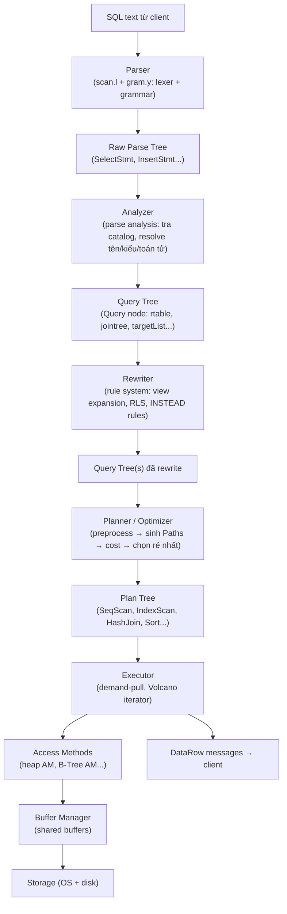
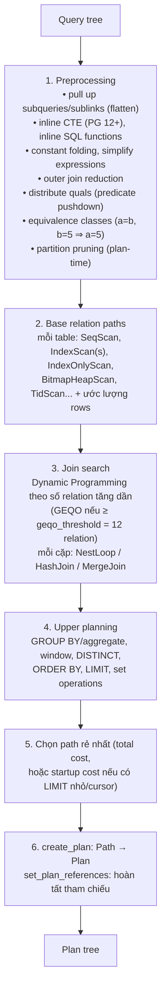
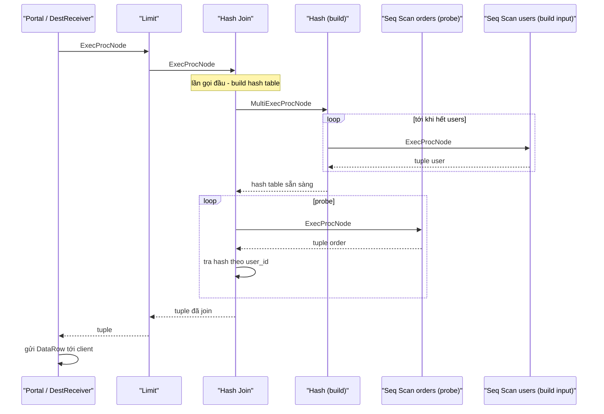
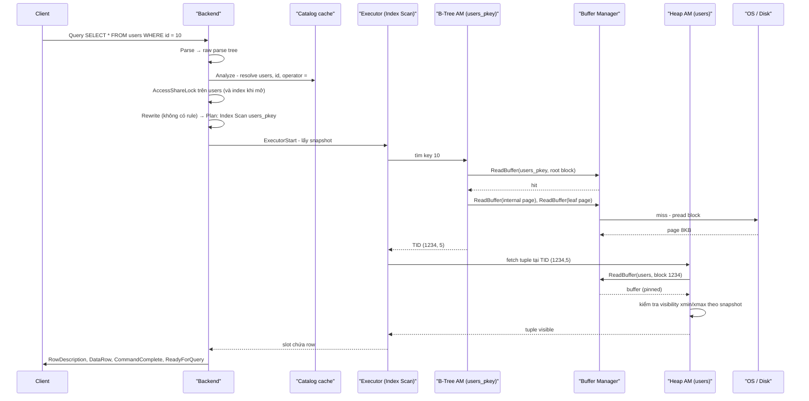

# PART 5 — POSTGRESQL QUERY LIFECYCLE

> **Trước:** [04 — Architecture](04-postgresql-architecture.md) · **Tiếp:** [06 — Storage Internals](06-storage-internals.md)
> **Độ ưu tiên:** Rất cao.

Chương này lần theo **một câu SQL** từ lúc rời khỏi application đến lúc từng row quay về, đi qua mọi stage trong backend process. Mục tiêu: khi nhìn một query chậm, bạn biết thời gian có thể đang bị tiêu ở **stage nào** và **tại sao**.

---

## Mục lục

1. [Simple mental model](#1-simple-mental-model)
2. [Toàn cảnh pipeline](#2-toàn-cảnh-pipeline)
3. [Stage 0 — Client gửi query (protocol)](#3-stage-0--client-gửi-query)
4. [Stage 1 — Parser: text → raw parse tree](#4-stage-1--parser)
5. [Stage 2 — Analyzer: raw parse tree → Query tree](#5-stage-2--analyzer)
6. [Stage 3 — Rewriter: rules, views, RLS](#6-stage-3--rewriter)
7. [Stage 4 — Planner/Optimizer: Query tree → Plan tree](#7-stage-4--planner--optimizer)
8. [Stage 5 — Executor: Plan tree → rows](#8-stage-5--executor)
9. [Stage 6 — Access Method → Buffer Manager → Storage](#9-stage-6--access-method--buffer-manager--storage)
10. [Utility commands (DDL) đi đường khác](#10-utility-commands)
11. [Prepared statements & plan cache: generic vs custom plan](#11-prepared-statements--plan-cache)
12. [JIT compilation](#12-jit-compilation)
13. [What happens if...](#13-what-happens-if)
14. [Performance impact & production behavior](#14-performance-impact--production-behavior)
15. [Common misunderstandings](#15-common-misunderstandings)
16. [Interview Questions](#16-interview-questions)
17. [Key Takeaways](#17-key-takeaways)

---

## 1. Simple mental model

Câu SQL giống một **đơn đặt hàng viết bằng ngôn ngữ tự nhiên**:

1. **Parser** kiểm tra chính tả/ngữ pháp: câu có đúng cấu trúc SQL không? (Chưa quan tâm table có tồn tại không.)
2. **Analyzer** kiểm tra ý nghĩa: `users` là table nào? Cột `id` có không? Kiểu gì? `=` ở đây là toán tử nào?
3. **Rewriter** biến đổi theo luật: `users_view` thực ra là câu SELECT nào? User này bị giới hạn row nào (RLS)?
4. **Planner** lập kế hoạch: đọc qua index hay quét cả table? Join theo thứ tự nào, thuật toán nào? Chọn kế hoạch rẻ nhất *ước lượng*.
5. **Executor** làm theo kế hoạch: gọi từng bước, kéo từng row lên.
6. **Access method + Buffer manager** là kho: lấy đúng page, đúng tuple.

---

## 2. Toàn cảnh pipeline



**Cách đọc diagram (trên xuống):** Mỗi stage nhận một cấu trúc dữ liệu (text → raw parse tree → query tree → plan tree) và biến đổi nó thành cấu trúc tiếp theo, giàu thông tin hơn. Chỉ **executor** thực sự chạm vào dữ liệu người dùng, thông qua access method và buffer manager. Toàn bộ pipeline chạy **trong một backend process**, tuần tự, cho một câu lệnh.

Thời gian của một query = **parse + analyze + rewrite + plan** (thể hiện là `Planning Time` trong EXPLAIN ANALYZE, gần đúng) + **execute** (`Execution Time`) + **network** (gửi kết quả; không nằm trong `Execution Time` trừ khi dùng `EXPLAIN (ANALYZE, SERIALIZE)` từ PG 17).

---

## 3. Stage 0 — Client gửi query

Hai con đường (xem [Chương 04](04-postgresql-architecture.md#52-simple-query-vs-extended-query-protocol)):

- **Simple Query:** một message `Query` chứa text (có thể nhiều câu cách nhau bởi `;`). Backend chạy parse → analyze → rewrite → plan → execute cho từng câu ngay lập tức.
- **Extended Query:**
  - `Parse`: parse + analyze + rewrite, lưu thành **prepared statement** (có tên hoặc unnamed).
  - `Bind`: gắn giá trị tham số → tạo **portal**; **planning xảy ra ở đây** (có thể dùng plan cache).
  - `Execute`: chạy portal, có thể giới hạn số row (cursor-like fetch).
  - `Sync`: kết thúc chuỗi; nếu không trong transaction block tường minh thì commit implicit transaction.

Hệ quả thực tế: với driver dùng unnamed statement mỗi lần, mỗi câu vẫn parse + plan lại. Với named prepared statement tái sử dụng, parse/analyze được làm một lần; planning có thể được cache (mục 11).

---

## 4. Stage 1 — Parser

### 4.1 WHAT

Biến **chuỗi SQL** thành **raw parse tree** — cây cú pháp phản ánh cấu trúc câu lệnh.

### 4.2 HOW

1. **Lexer** (`scan.l`, sinh bằng flex) tách text thành token: keyword (`SELECT`), identifier (`users`), literal (`10`), operator (`=`).
2. **Grammar** (`gram.y`, sinh bằng bison — một LALR parser) ghép token thành cây theo văn phạm SQL. Mỗi loại câu lệnh có node gốc riêng: `SelectStmt`, `InsertStmt`, `UpdateStmt`, `CreateStmt`...

Với `SELECT * FROM users WHERE id = 10;`, raw parse tree (đơn giản hóa):

```
SelectStmt
├── targetList: [ResTarget(val = ColumnRef(*))]
├── fromClause: [RangeVar(relname = "users")]
└── whereClause: A_Expr(kind = OP, name = "=",
                        lexpr = ColumnRef("id"),
                        rexpr = A_Const(10))
```

### 4.3 INTERNALS — Tại sao parser không tra catalog?

Parser **cố ý không truy cập catalog** (không biết `users` có tồn tại không, `id` là cột gì). Lý do: parser phải chạy được ngay cả khi transaction đang ở trạng thái **aborted** (sau một lỗi, mọi lệnh bị từ chối trừ `ROLLBACK`/`COMMIT`). Để nhận ra câu lệnh là `ROLLBACK`, nó phải parse được — mà trong trạng thái aborted thì không được phép đọc catalog (cần transaction hợp lệ). Vì vậy parse thuần cú pháp, tách khỏi phân tích ngữ nghĩa.

### 4.4 Lỗi ở stage này

`ERROR: syntax error at or near "FORM"` — lỗi cú pháp, được báo với vị trí ký tự.

---

## 5. Stage 2 — Analyzer

### 5.1 WHAT

**Parse analysis** (`analyze.c`, `parse_*.c`) biến raw parse tree thành **Query tree** (struct `Query`) — biểu diễn ngữ nghĩa đầy đủ, đã được "giải quyết" mọi tên và kiểu.

### 5.2 HOW — Analyzer làm những gì

1. **Name resolution:** `users` → tra `search_path` → OID của relation `public.users`. `id` → cột thứ 1 của relation đó, kiểu `bigint`.
2. **Mở relation và lấy lock:** Analyzer mở các relation được tham chiếu và lấy **heavyweight lock** phù hợp: `AccessShareLock` cho table được đọc, `RowExclusiveLock` cho target của INSERT/UPDATE/DELETE, `RowShareLock` cho `SELECT FOR UPDATE`. **Lock này giữ đến cuối transaction.** Đây là lý do một câu SELECT đã chạy xong (trong transaction chưa commit) vẫn chặn được `ALTER TABLE`.
3. **Type resolution & coercion:** `id = 10` — hằng `10` có kiểu `integer`; cột `bigint`. Analyzer tìm toán tử `=` phù hợp theo luật **operator resolution** của PostgreSQL (tìm toán tử `bigint = bigint`, `bigint = integer`... ưu tiên khớp chính xác, rồi tới implicit cast). Ở đây có toán tử cross-type `int8 = int4` trong operator family `integer_ops` của B-Tree → index vẫn dùng được.
4. **Function resolution:** chọn overload phù hợp.
5. **Expand `*`** thành danh sách cột cụ thể **tại thời điểm analyze**. (Hệ quả: view định nghĩa bằng `SELECT *` sẽ *không* tự có cột mới thêm vào table sau đó.)
6. Kiểm tra ngữ nghĩa: cột trong SELECT không nằm trong GROUP BY và không phải aggregate → lỗi; aggregate trong WHERE → lỗi.

Query tree (đơn giản hóa):

```
Query (commandType = SELECT)
├── rtable (range table): [RTE_RELATION relid=16384 (users), rellockmode=AccessShareLock]
├── jointree: FromExpr(fromlist=[RangeTblRef 1],
│                      quals = OpExpr(opno = int84eq, args=[Var(rt=1, attno=1, type=int8), Const(10::int4)]))
└── targetList: [TargetEntry(Var 1.1 "id"), TargetEntry(Var 1.2 "email"), ...]
```

**Range table** là khái niệm then chốt: danh sách mọi "nguồn row" (table, subquery, function, join, CTE) mà query dùng; mọi tham chiếu cột (`Var`) chỉ vào một entry trong range table bằng số thứ tự.

### 5.3 Lỗi ở stage này

`ERROR: relation "userz" does not exist`, `column "idd" does not exist`, `operator does not exist: bigint = text`, `column "x" must appear in the GROUP BY clause`.

---

## 6. Stage 3 — Rewriter

### 6.1 WHAT

**Rewrite system** (`rewriteHandler.c`) áp dụng các **rule** được lưu trong `pg_rewrite` lên Query tree, sinh ra một hoặc nhiều Query tree mới.

### 6.2 WHY

Rewriter là cơ chế chung để hiện thực:
1. **View:** Trong PostgreSQL, view **chính là một table rỗng + rule `ON SELECT DO INSTEAD <query>`**. Khi query tham chiếu view, rewriter thay entry của view trong range table bằng subquery định nghĩa view.
2. **Row-Level Security (RLS):** policy được thêm vào như điều kiện WHERE (security barrier qual) tại stage rewrite.
3. **Rules do người dùng tạo** (`CREATE RULE`): ví dụ `ON INSERT TO v DO INSTEAD INSERT INTO t ...`. Rule rất khó dùng đúng; documentation khuyến nghị dùng trigger (hoặc `INSTEAD OF` trigger cho view) trong hầu hết trường hợp.
4. **Updatable views** tự động: rewriter biến `UPDATE simple_view` thành `UPDATE base_table`.

### 6.3 EXAMPLE — View expansion

```sql
CREATE VIEW active_users AS SELECT id, email FROM users WHERE deleted_at IS NULL;
SELECT email FROM active_users WHERE id = 10;
```

Sau rewrite, về mặt logic:

```sql
SELECT email FROM (SELECT id, email FROM users WHERE deleted_at IS NULL) active_users WHERE id = 10;
```

Sau đó planner sẽ **pull up** subquery này (flatten) → thành `SELECT email FROM users WHERE deleted_at IS NULL AND id = 10` → có thể dùng index trên `id`. Vì thế **view đơn giản không tốn chi phí hiệu năng** — nó biến mất sau rewrite + planning. (Ngoại lệ: view có `security_barrier`, `LIMIT`, aggregate, `DISTINCT`... có thể cản pull-up/push-down.)

### 6.4 Bảo mật: security_barrier và leakproof

Với RLS hoặc view `security_barrier`, planner **không được** đẩy một điều kiện do user viết (có thể chứa function "rò rỉ" dữ liệu qua lỗi hoặc `RAISE NOTICE`) xuống dưới điều kiện bảo mật, trừ khi function đó được đánh dấu `LEAKPROOF`. Hệ quả hiệu năng: đôi khi RLS làm mất khả năng dùng index với điều kiện của user. Đây là lý do query trên table có RLS đôi khi chậm bất ngờ.

---

## 7. Stage 4 — Planner / Optimizer

Đây là stage phức tạp nhất; [Chương 17](17-query-planner.md) dành riêng cho nó. Ở đây ta mô tả **luồng tổng thể**.

### 7.1 WHAT

Nhận Query tree, sinh ra **Plan tree** — cây các node thực thi — có **chi phí ước lượng thấp nhất** trong không gian các plan mà planner xem xét.

### 7.2 HOW — Các pha của planner



**Cách đọc diagram (trên xuống):**
1. **Preprocessing** đơn giản hóa và chuẩn hóa query, mở rộng không gian lựa chọn (ví dụ subquery được kéo lên thành join để có thể đổi thứ tự join). **Equivalence class** cho phép suy diễn: `a.x = b.y AND b.y = 5` ⇒ có thể dùng index trên `a.x = 5`.
2. Với **mỗi table**, planner sinh các **Path** (cách đọc khả dĩ) cùng chi phí ước lượng, dựa trên **statistics** (`pg_class.reltuples/relpages`, `pg_statistic`). Path bị "trội" (đắt hơn và không có ưu điểm gì như thứ tự sắp xếp hữu ích) bị loại sớm.
3. **Join search**: xây dần các tập relation đã join, mỗi cấp thử các thuật toán join và thứ tự. Số tổ hợp tăng theo giai thừa, nên PostgreSQL dùng dynamic programming và các giới hạn `join_collapse_limit`/`from_collapse_limit` (mặc định 8); vượt `geqo_threshold` (12 relation) thì dùng **GEQO** (genetic algorithm) — nhanh hơn nhưng không đảm bảo tối ưu và có yếu tố ngẫu nhiên (seed cố định mặc định).
4. **Upper planning**: thêm các bước aggregate/sort/limit lên trên.
5. Chọn path rẻ nhất. Nếu query có `LIMIT` hoặc là cursor, planner quan tâm **startup cost** (chi phí tới row đầu tiên) nhiều hơn — đó là lý do `LIMIT` có thể đổi hẳn plan.
6. Chuyển Path (cấu trúc nhẹ dùng để so sánh) thành Plan (cấu trúc đầy đủ cho executor).

### 7.3 Plan tree cho ví dụ

```
Index Scan using users_pkey on users  (cost=0.43..8.45 rows=1 width=72)
  Index Cond: (id = 10)
```

Plan tree là cây: node lá là scan, node trong là join/sort/aggregate. Mỗi node có ước lượng `cost=startup..total`, `rows`, `width`. Xem [Chương 18](18-explain-analyze.md).

### 7.4 Planning có thể đắt

- Query join 10–15 table: không gian tìm kiếm lớn → planning hàng chục/trăm ms.
- Table có hàng nghìn partition mà query không prune được lúc plan → planner phải xét từng partition (cải thiện nhiều từ PG 12+, nhưng vẫn tốn), mở và lock từng partition.
- Hệ quả: với query nhỏ chạy rất thường xuyên, **Planning Time có thể lớn hơn Execution Time** — lý do nên dùng prepared statement/plan cache.

---

## 8. Stage 5 — Executor

### 8.1 WHAT

Executor (`execMain.c`, `execProcnode.c`, `node*.c`) thực thi Plan tree và sinh ra các tuple kết quả.

### 8.2 HOW — Mô hình Volcano (iterator, demand-pull)

Mỗi node plan hiện thực giao diện:
- `ExecInitNode`: khởi tạo state (mở relation, cấp phát hash table...);
- `ExecProcNode`: **trả về tuple tiếp theo** (hoặc NULL khi hết);
- `ExecEndNode`: dọn dẹp.

Node cha gọi `ExecProcNode` của node con để **kéo (pull)** từng tuple một. Row chảy từ lá lên gốc.



**Cách đọc diagram:** Top node (portal) xin một tuple từ `Limit`; `Limit` xin từ `Hash Join`. Lần đầu, Hash Join phải **build** toàn bộ hash table từ input bên trong (users) — đây là **startup cost** của Hash Join. Sau đó mỗi lần được gọi, nó kéo tuple từ input ngoài (orders), probe hash table, và trả tuple khớp. Khi `Limit` đủ N row, nó ngừng gọi — **phần còn lại của plan không bao giờ được thực thi**. Đó là lý do plan có `LIMIT` với Nested Loop + Index Scan (startup thấp) có thể trả về trong vài ms dù table cực lớn.

### 8.3 Các pha của executor

1. **ExecutorStart:** kiểm tra quyền (`ExecCheckPermissions` — quyền SELECT/INSERT... trên table/cột), khởi tạo cây PlanState, lấy/chụp **snapshot** cho câu lệnh (ở Read Committed, mỗi câu lệnh một snapshot mới; xem [Chương 11](11-mvcc.md)).
2. **ExecutorRun:** vòng lặp kéo tuple từ node gốc, gửi mỗi tuple tới **DestReceiver** (gửi cho client, ghi vào tuplestore cho cursor, hoặc bỏ đi trong EXPLAIN ANALYZE).
3. **ExecutorFinish:** chạy AFTER trigger được xếp hàng, xử lý data-modifying CTE còn lại.
4. **ExecutorEnd:** giải phóng tài nguyên (xóa memory context `ExecutorState`).

### 8.4 DML trong executor

Với INSERT/UPDATE/DELETE, node gốc là **ModifyTable**. Node con cung cấp các row cần sửa (với UPDATE/DELETE: kèm `ctid` của tuple cũ). ModifyTable gọi `table_tuple_insert/update/delete` của table access method, cập nhật index (`ExecInsertIndexTuples`), kích hoạt trigger, kiểm tra constraint. Chuyện gì xảy ra ở mức page/WAL: [Chương 07](07-read-write-behavior.md).

### 8.5 Tuple format trong executor

Executor làm việc với **TupleTableSlot** — một lớp trừu tượng có thể chứa: tuple heap nằm nguyên trong buffer (chỉ giữ con trỏ + pin buffer), tuple "virtual" (mảng Datum + isnull), hoặc tuple đã copy. Việc **deform** tuple (tách các cột từ định dạng on-disk thành mảng Datum) là chi phí CPU đáng kể — và là một trong các thứ JIT tối ưu. PostgreSQL chỉ deform tới cột cuối cùng cần dùng.

---

## 9. Stage 6 — Access Method → Buffer Manager → Storage

### 9.1 Table Access Method (Table AM)

Từ PG 12, executor không gọi trực tiếp hàm heap, mà gọi qua **Table AM API** (`tableam.h`): `scan_begin`, `scan_getnextslot`, `tuple_insert`, `tuple_update`, `index_fetch_tuple`... Heap là implementation mặc định (`heapam`). API này cho phép extension cung cấp cách lưu trữ khác.

### 9.2 Index Access Method

Mỗi loại index (btree, hash, gist, gin, brin, spgist) hiện thực **Index AM API** (`amgettuple`, `amgetbitmap`, `aminsert`, `ambulkdelete`...). Index scan: AM trả về **TID**, executor dùng TID để lấy heap tuple (qua table AM `index_fetch_tuple`), rồi kiểm tra **visibility** theo snapshot.

### 9.3 Buffer Manager

AM không đọc file trực tiếp. Nó gọi `ReadBuffer(relation, blockNumber)`:
1. Tính **buffer tag** `(tablespace, database, relfilenumber, fork, block)`.
2. Tra **buffer mapping hash table** trong shared memory.
3. Có → **cache hit**: pin buffer, trả về.
4. Không → **cache miss**: chọn buffer nạn nhân (clock sweep), nếu dirty thì ghi ra (sau khi đảm bảo WAL tới page LSN đã flush), đọc page từ file (qua OS) vào buffer, pin, trả về.

Sau đó AM lấy **content lock** (LWLock shared để đọc, exclusive để sửa) trên buffer trong lúc thao tác với nội dung page. Chi tiết [Chương 08](08-memory-buffer-cache.md).

### 9.4 Storage manager (smgr/md.c)

Dịch `(relation, fork, block)` thành `(file segment, offset)`: file `base/<dboid>/<relfilenode>[.N]`, mỗi segment 1GB → block `b` nằm ở segment `b / 131072`, offset `(b % 131072) × 8192`. Gọi `pread`/`pwrite` (hoặc qua AIO ở PG 18). Chi tiết [Chương 06](06-storage-internals.md).

### 9.5 Toàn bộ đường đi của `SELECT * FROM users WHERE id = 10`



**Cách đọc diagram:** Hãy chú ý các điểm chi phí: tra catalog (thường hit cache local), lock (fast-path, rất rẻ), đi B-Tree 3–4 page (thường hit), một heap page (có thể miss → I/O), kiểm tra visibility (CPU, có thể phải tra CLOG nếu hint bit chưa được đặt — xem [Chương 11](11-mvcc.md)). Toàn bộ thường tốn vài chục micro giây phía server nếu mọi page đều trong cache.

---

## 10. Utility commands

DDL và các lệnh như `VACUUM`, `COPY`, `SET`, `BEGIN`, `CREATE INDEX` là **utility statement**: sau parse, chúng **không đi qua planner/executor thông thường** mà được xử lý bởi `ProcessUtility()` — gọi thẳng hàm hiện thực tương ứng (ví dụ `DefineRelation` cho `CREATE TABLE`). Một số utility bên trong vẫn chạy query (ví dụ `CREATE TABLE AS SELECT`, `REFRESH MATERIALIZED VIEW`, FK validation).

Extension có thể "hook" vào `ProcessUtility_hook`, `planner_hook`, `ExecutorStart_hook`... — đây là cách `pg_stat_statements`, `auto_explain`, `pg_hint_plan` hoạt động.

---

## 11. Prepared statements & plan cache

### 11.1 WHAT

Prepared statement lưu kết quả **parse + analyze + rewrite** (không phải plan, ban đầu) để tái sử dụng với các giá trị tham số khác nhau. Plan có thể được cache dưới dạng **generic plan**.

### 11.2 HOW — Custom plan vs Generic plan

- **Custom plan:** plan được lập **với giá trị tham số cụ thể** (`$1 = 10`) → planner dùng giá trị thật để ước lượng selectivity (ví dụ tra MCV). Chính xác nhưng phải plan lại mỗi lần.
- **Generic plan:** plan lập **không biết giá trị tham số** → dùng selectivity trung bình. Plan một lần, dùng mãi.

**Heuristic mặc định (`plan_cache_mode = auto`):**
1. 5 lần thực thi đầu: luôn dùng custom plan, ghi lại chi phí trung bình.
2. Từ lần thứ 6: lập generic plan một lần, so chi phí ước lượng của generic plan với chi phí trung bình của các custom plan (cộng chi phí planning). Nếu generic plan không đắt hơn đáng kể → chuyển sang dùng generic plan từ đó.

### 11.3 WHAT HAPPENS IF — Data skew làm generic plan tệ

Table `orders` có `status`: 99% là `'done'`, 0.01% là `'pending'`. Query `WHERE status = $1`:
- Custom plan với `'pending'` → Index Scan (rất ít row).
- Custom plan với `'done'` → Seq Scan.
- 5 lần đầu đều là `'pending'` → chi phí trung bình thấp → generic plan (ước lượng với selectivity trung bình, có thể chọn Index Scan hoặc Bitmap) được so và chấp nhận.
- Sau đó một lần `'done'` chạy với generic plan index scan trên 99% table → cực chậm.

Đây là phiên bản PostgreSQL của **"parameter sniffing"**. Cách xử lý: `plan_cache_mode = force_custom_plan` cho session/role/function cụ thể; tách query cho giá trị đặc biệt; hoặc partial index. Chẩn đoán: `pg_prepared_statements` (cột `generic_plans`, `custom_plans` từ PG 14), `EXPLAIN (GENERIC_PLAN)` (PG 16).

### 11.4 Plan invalidation

Plan cache tự bị **invalidate** khi: DDL trên relation liên quan, `ANALYZE` cập nhật statistics của table liên quan, thay đổi `search_path`... (qua shared invalidation messages). Lần dùng sau sẽ replan. Vì vậy sau khi autovacuum chạy ANALYZE, plan của prepared statement có thể **đổi đột ngột** — một nguyên nhân của "plan flip" ([Chương 40, Scenario 17](40-production-behavior.md)).

### 11.5 Liên hệ connection pooler

Prepared statement tồn tại **trong một backend (session)**. PgBouncer ở transaction mode chuyển transaction tiếp theo sang backend khác → prepared statement "biến mất" → lỗi `prepared statement "S_1" does not exist`. PgBouncer 1.21+ hỗ trợ theo dõi prepared statement ở mức protocol (`max_prepared_statements`). Xem [Chương 37](37-connection-management.md).

---

## 12. JIT compilation

### 12.1 WHAT & WHY

Từ PG 11 (bật mặc định từ PG 12 khi build có LLVM), PostgreSQL có thể **biên dịch JIT** (qua LLVM) các phần nóng của executor: đánh giá biểu thức (WHERE, target list), **tuple deforming**. Mục đích: giảm overhead của việc thông dịch cây biểu thức cho query xử lý hàng triệu row.

### 12.2 HOW

Nếu tổng cost của plan > `jit_above_cost` (mặc định 100000) → JIT; > `jit_inline_above_cost` (500000) → inline function; > `jit_optimize_above_cost` (500000) → optimize LLVM mạnh. Thời gian compile hiện trong EXPLAIN ANALYZE (`JIT: Functions: 12, Timing: Generation ..., Optimization ..., Emission ...`).

### 12.3 Production behavior và trade-off

JIT là con dao hai lưỡi: chi phí compile hàng chục đến hàng trăm ms. Với query OLTP mà planner **ước lượng sai** cost lớn (estimate thổi phồng), JIT kích hoạt → query vốn 5ms tốn thêm 200ms compile. Đây là sự cố phổ biến tới mức nhiều team tắt JIT trên OLTP. **PG 19 (đang beta tại thời điểm viết) đổi mặc định `jit = off`**, với lý do được nêu trong release notes là cách tính chi phí kích hoạt JIT không đáng tin cậy.

---

## 13. What happens if...

| Tình huống | Chuyện gì xảy ra |
|---|---|
| **Client ngắt kết nối giữa lúc query đang chạy** | Backend thường chỉ phát hiện khi cố gửi dữ liệu hoặc đọc message tiếp. Query nặng có thể tiếp tục chạy tốn tài nguyên. PG 14 thêm `client_connection_check_interval` để định kỳ kiểm tra socket và hủy query sớm. |
| **`statement_timeout` hết** | Timer gửi tín hiệu; backend kiểm tra cờ interrupt tại các điểm `CHECK_FOR_INTERRUPTS()` rải khắp code executor → hủy với `ERROR: canceling statement due to statement timeout` → transaction ở trạng thái aborted. |
| **Cancel request (Ctrl+C / pg_cancel_backend)** | Tương tự: cờ interrupt, hủy tại điểm kiểm tra tiếp theo. Một số thao tác không kiểm tra interrupt thường xuyên (ví dụ chờ I/O bị treo) → cancel có vẻ "không ăn". |
| **Lỗi giữa chừng executor** (vi phạm constraint, chia 0) | `ereport(ERROR)` → `longjmp` về vòng lặp chính → abort transaction (hoặc subtransaction), reset memory context, nhả lock. Client nhận `ErrorResponse`. |
| **Planner mất quá lâu** | Planning không bị giới hạn riêng; `statement_timeout` bao gồm cả planning. Giảm bằng: ít join hơn, partition pruning, prepared statements, `join_collapse_limit`. |
| **Relation bị DROP giữa Parse và Execute của prepared statement** | Lock đã giải phóng sau transaction trước → lần Execute sau, plan cache bị invalidate → replan → analyze lại → lỗi "relation does not exist". |
| **Kết quả rất lớn** (hàng chục triệu row) | Backend gửi liên tục qua socket; nếu client đọc chậm, socket buffer đầy → backend **block** khi gửi (wait event `ClientWrite`) — trong thời gian đó vẫn giữ snapshot và lock. Driver mặc định có thể buffer toàn bộ kết quả trong RAM client (OOM phía app). Dùng cursor/`Execute` với row limit. |

---

## 14. Performance impact & production behavior

### 14.1 Ở đâu thời gian bị tiêu?

| Stage | Khi nào đáng kể | Cách thấy |
|---|---|---|
| Network/protocol | Nhiều query nhỏ, round-trip xa | Latency app ≫ `Execution Time` |
| Parse/Analyze | Hiếm khi đáng kể; query khổng lồ (IN list hàng chục nghìn phần tử) | Planning Time |
| Plan | Nhiều join, nhiều partition, query ngắn chạy rất thường xuyên | `Planning Time` trong EXPLAIN ANALYZE; `pg_stat_statements.total_plan_time` (khi `pg_stat_statements.track_planning = on`) |
| Execute — CPU | Scan lớn, deform, expression, sort trong memory | `Execution Time`, CPU cao |
| Execute — I/O | Cache miss | `Buffers: shared read=...`, `I/O Timings` (`track_io_timing = on`) |
| Execute — chờ lock | Contention | `wait_event_type = Lock` |
| Gửi kết quả | Kết quả lớn, client chậm | `wait_event = ClientWrite` |

### 14.2 `pg_stat_statements`

Extension quan trọng nhất cho phân tích query production: gom thống kê theo **query đã normalize** (hằng số thay bằng `$1`) — số lần gọi, tổng/trung bình/max thời gian thực thi và planning, số row, shared blocks hit/read/dirtied/written, temp blocks, WAL bytes. Tìm query tốn tài nguyên nhất theo *tổng* thời gian (không chỉ theo thời gian từng lần).

---

## 15. Common misunderstandings

1. **"SQL được thực thi theo thứ tự viết."** — Không; planner biến đổi tự do.
2. **"View làm query chậm vì phải tính view trước."** — View đơn giản bị rewrite + flatten, không tốn gì. View phức tạp (aggregate, LIMIT, security_barrier) mới có thể cản tối ưu.
3. **"Prepared statement luôn nhanh hơn."** — Tiết kiệm parse/plan, nhưng generic plan có thể tệ với data skew.
4. **"EXPLAIN ANALYZE Execution Time = thời gian client chờ."** — Không bao gồm network và serialize kết quả (trừ `SERIALIZE` ở PG 17+), không bao gồm planning.
5. **"Parser kiểm tra table có tồn tại."** — Không; đó là việc của analyzer.
6. **"Lock của SELECT được nhả khi SELECT xong."** — Heavyweight lock (AccessShareLock) giữ tới cuối **transaction**.

---

## 16. Interview Questions

**Q1. Mô tả vòng đời của một câu query trong PostgreSQL.**
- *Short:* Parser (cú pháp → raw parse tree) → Analyzer (ngữ nghĩa, catalog → Query tree) → Rewriter (view, rule, RLS) → Planner (chọn plan rẻ nhất theo cost) → Executor (Volcano pull model) → Access method → Buffer manager → Storage.
- *Deep:* Kể thêm: lock lấy ở analyze và giữ tới cuối transaction; snapshot lấy khi bắt đầu thực thi; plan cache generic/custom; demand-pull cho phép LIMIT dừng sớm.
- *Follow-up:* Tại sao parser không tra catalog? Chuyện gì xảy ra khi query có LIMIT?

**Q2. View có ảnh hưởng hiệu năng không?**
- *Short:* View là rule rewrite; view đơn giản được flatten nên không tốn chi phí.

**Q3. Generic plan và custom plan khác nhau thế nào? Khi nào gây vấn đề?**
- *Short:* Custom plan dùng giá trị tham số thật; generic plan dùng ước lượng trung bình. Heuristic chuyển sau 5 lần. Data skew → generic plan tệ.
- *Follow-up:* Chẩn đoán và xử lý thế nào?

**Q4. Mô hình executor của PostgreSQL là gì?**
- *Short:* Volcano/iterator: mỗi node trả từng tuple khi được gọi; node cha kéo từ node con. Startup cost vs total cost.

**Q5. Tại sao một câu `SELECT` đã chạy xong vẫn chặn `ALTER TABLE`?**
- *Short:* AccessShareLock giữ tới cuối transaction; nếu session đang `idle in transaction`, lock còn đó.

**Q6. (Senior) Làm sao phân biệt query chậm do planning, do I/O, do lock, hay do network?**
- *Short:* So `Planning Time`/`Execution Time`, xem `Buffers`/`I/O Timings`, `wait_event` trong `pg_stat_activity`, so latency phía app với execution time.

---

## 17. Key Takeaways

1. Pipeline: **Parse → Analyze → Rewrite → Plan → Execute → AM → Buffer → Storage**, tất cả trong một backend process.
2. Parser thuần cú pháp; analyzer tra catalog, resolve kiểu/toán tử, **lấy lock giữ tới cuối transaction**.
3. View = rule; rewriter thay view bằng subquery; planner flatten → view đơn giản miễn phí.
4. Planner: preprocess → paths cho từng table → join search (DP/GEQO) → upper → chọn rẻ nhất theo **ước lượng**.
5. Executor Volcano pull-based: `LIMIT` có thể dừng sớm; Hash Join có startup cost build.
6. Prepared statement: custom plan 5 lần đầu rồi có thể chuyển generic → rủi ro data skew.
7. ANALYZE/DDL invalidate plan cache → plan có thể đổi đột ngột.
8. JIT có thể gây hại cho OLTP khi estimate sai; PG 19 (beta) tắt mặc định.

---

## Nguồn tham khảo

- PostgreSQL Docs — *Overview of PostgreSQL Internals* (The Path of a Query, Parser Stage, Rule System, Planner/Optimizer, Executor): https://www.postgresql.org/docs/current/overview.html
- PostgreSQL Docs — *The Rule System*: https://www.postgresql.org/docs/current/rules.html
- PostgreSQL Docs — *PREPARE* (generic vs custom plans): https://www.postgresql.org/docs/current/sql-prepare.html
- PostgreSQL Docs — *JIT Compilation*: https://www.postgresql.org/docs/current/jit.html
- PostgreSQL Docs — *pg_stat_statements*: https://www.postgresql.org/docs/current/pgstatstatements.html
- PostgreSQL source: `src/backend/parser/README`, `src/backend/optimizer/README`, `src/backend/executor/README`, `src/backend/tcop/postgres.c`.
- Goetz Graefe, *Volcano — An Extensible and Parallel Query Evaluation System*, IEEE TKDE 1994.
