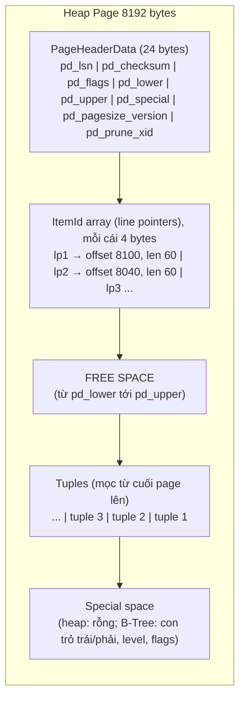
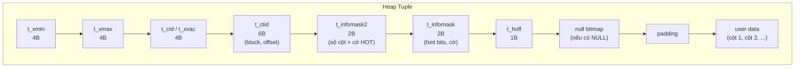
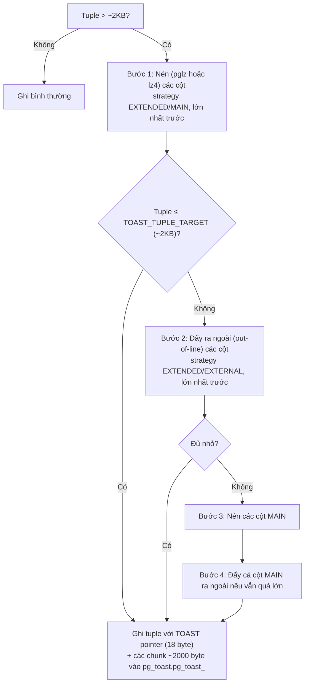

# PART 6 — POSTGRESQL STORAGE INTERNALS

> **Trước:** [05 — Query Lifecycle](05-query-lifecycle.md) · **Tiếp:** [07 — Read/Write Behavior](07-read-write-behavior.md)
> **Độ ưu tiên:** Rất cao. MVCC, VACUUM, HOT, index, WAL đều được xây trên các cấu trúc ở chương này.

---

## Mục lục

1. [Simple mental model](#1-simple-mental-model)
2. [Concept: Cấu trúc thư mục của một Database Cluster](#2-concept-cấu-trúc-thư-mục-của-database-cluster)
3. [Concept: Relation files, Fork, Segment](#3-concept-relation-files-fork-segment)
4. [Concept: Page (Block) layout](#4-concept-page-block-layout)
5. [Concept: Heap Tuple layout](#5-concept-heap-tuple-layout)
6. [Concept: TOAST](#6-concept-toast)
7. [Concept: Free Space Map (FSM)](#7-concept-free-space-map-fsm)
8. [Concept: Visibility Map (VM)](#8-concept-visibility-map-vm)
9. [Init fork và unlogged table](#9-init-fork-và-unlogged-table)
10. [Giới hạn kích thước](#10-giới-hạn-kích-thước)
11. [What happens if...](#11-what-happens-if)
12. [Performance impact & Production behavior](#12-performance-impact--production-behavior)
13. [Common misunderstandings](#13-common-misunderstandings)
14. [Interview Questions](#14-interview-questions)
15. [Key Takeaways](#15-key-takeaways)

---

## 1. Simple mental model

Hãy tưởng tượng một table là một **cuốn sổ đóng gáy lò xo**:

- Mỗi **trang giấy** là một **page 8KB** — không bao giờ xé nửa trang; đọc hay ghi luôn theo cả trang.
- Ở **đầu mỗi trang** là **mục lục nhỏ** (line pointers): "dòng 1 ở vị trí X, dòng 2 ở vị trí Y".
- Nội dung (tuple) được viết **từ cuối trang ngược lên**; mục lục mọc **từ đầu trang xuống**; khoảng trắng ở giữa là chỗ trống.
- Muốn tìm một dòng, bạn cần "trang số mấy, mục số mấy" — đó là **TID/ctid** `(block, item)`.
- Khi sửa một dòng, bạn **không tẩy** dòng cũ; bạn gạch nó (ghi "đã bị thay bởi transaction X") và viết dòng mới — đó là MVCC.
- Cuốn sổ quá dày thì tách thành **tập 1GB** (segment).
- Có một **sổ phụ ghi trang nào còn trống bao nhiêu** (FSM) và một **sổ phụ ghi trang nào "sạch"** (mọi dòng đều ai cũng thấy) (VM).
- Nội dung quá dài (ví dụ một bài viết 1MB) không nhét vừa trang → được **cắt thành mảnh và cất vào một cuốn sổ riêng** (TOAST), ở trang chính chỉ ghi "xem sổ TOAST, mã số N".

---

## 2. Concept: Cấu trúc thư mục của Database Cluster

### 2.1 WHAT

Một **database cluster** (một instance PostgreSQL) lưu toàn bộ trạng thái trong một thư mục gọi là **PGDATA**.

```
$PGDATA/
├── PG_VERSION               ← major version
├── postgresql.conf, pg_hba.conf, pg_ident.conf, postgresql.auto.conf
├── postmaster.pid           ← PID + port + socket dir + shared memory key
├── global/                  ← shared catalogs (pg_database, pg_authid, pg_tablespace...) + pg_control
│   └── pg_control           ← trạng thái cluster: vị trí checkpoint gần nhất, trạng thái (in production / shut down / in recovery), timeline...
├── base/                    ← mỗi database một thư mục con, tên = OID database
│   ├── 1/                   ← template1
│   ├── 5/                   ← postgres
│   └── 16384/               ← database "shop"
│       ├── 16385            ← main fork của một table (tên = relfilenode)
│       ├── 16385_fsm        ← free space map fork
│       ├── 16385_vm         ← visibility map fork
│       ├── 16385.1          ← segment thứ 2 (khi table > 1GB)
│       └── pgsql_tmp/       ← (thực ra temp file mặc định ở base/pgsql_tmp)
├── pg_wal/                  ← WAL segments (16MB mỗi file) + archive_status/
├── pg_xact/                 ← commit log (CLOG): 2 bit trạng thái cho mỗi XID
├── pg_subtrans/             ← parent XID của mỗi subtransaction
├── pg_multixact/            ← MultiXact (nhiều transaction cùng khóa một row)
├── pg_commit_ts/            ← commit timestamp (nếu track_commit_timestamp = on)
├── pg_serial/               ← thông tin SSI của transaction serializable đã commit
├── pg_snapshots/            ← exported snapshots (pg_export_snapshot)
├── pg_twophase/             ← prepared transactions (2PC)
├── pg_replslot/             ← trạng thái replication slot
├── pg_logical/              ← dữ liệu logical decoding
├── pg_stat/                 ← cumulative stats lưu khi shutdown sạch
├── pg_tblspc/               ← symlink tới các tablespace khác
└── pg_wal_summary/ (PG 17)  ← WAL summaries cho incremental backup
```

### 2.2 WHY — Tại sao tách nhiều thư mục như vậy?

Mỗi thư mục có **pattern truy cập** và **yêu cầu durability** khác nhau:
- `pg_wal/`: ghi tuần tự, fsync mỗi commit → nhạy cảm latency. Có thể đặt trên disk riêng (qua `initdb --waldir` hoặc symlink) để không tranh I/O với data.
- `base/`: đọc/ghi random theo page.
- `pg_xact/`: rất nhỏ nhưng truy cập liên tục khi kiểm tra visibility → cache trong SLRU buffers.
- `global/pg_control`: file cực nhỏ nhưng **quan trọng nhất**: nói cho startup process biết bắt đầu recovery từ đâu.

### 2.3 Tablespace

**Tablespace** là một thư mục khác trên filesystem (ví dụ disk NVMe riêng) mà PostgreSQL có thể đặt relation vào. `pg_tblspc/<oid>` là symlink tới đó. Bên trong: `PG_<version>_<catversion>/<db_oid>/<relfilenode>`.

Lưu ý: tablespace **không phải** đơn vị backup/restore độc lập, không phải cơ chế cách ly an toàn — mất một tablespace là cluster hỏng. Trên cloud với volume co giãn được, tablespace ít còn cần thiết.

---

## 3. Concept: Relation files, Fork, Segment

### 3.1 WHAT

Mỗi relation (table, index, sequence, materialized view, TOAST table) được lưu thành **một tập file**:

| Fork | Hậu tố | Nội dung | Có ở |
|---|---|---|---|
| **Main fork** | (không) | Dữ liệu thật: heap page hoặc index page | Mọi relation có storage |
| **FSM fork** | `_fsm` | Free Space Map | Heap và index (index dùng FSM để ghi nhận page trống tái sử dụng) |
| **VM fork** | `_vm` | Visibility Map | Chỉ heap |
| **Init fork** | `_init` | Bản "rỗng" của relation | Chỉ unlogged relation |

Mỗi fork được chia thành **segment** tối đa **1GB** (`RELSEG_SIZE`, cấu hình lúc compile): `16385`, `16385.1`, `16385.2`, ...

### 3.2 WHY — Tại sao chia segment 1GB?

Lịch sử: nhiều filesystem cũ giới hạn kích thước file (2GB). Ngày nay lý do chính là tiện quản lý (backup từng file, truncate cuối table). Hệ quả: table 500GB = 500 file main fork; mở nhiều file → số file descriptor (PostgreSQL tự quản lý bằng một cache file descriptor ảo, giới hạn bởi `max_files_per_process`).

### 3.3 INTERNALS — OID vs relfilenode

- `pg_class.oid`: định danh **logic**, không đổi suốt đời relation.
- `pg_class.relfilenode`: tên file **vật lý** hiện tại. Ban đầu thường bằng OID.

Các lệnh tạo **file mới** cho relation (đổi relfilenode): `TRUNCATE`, `VACUUM FULL`, `CLUSTER`, `REINDEX` (index), `ALTER TABLE` có rewrite, `ALTER TABLE SET TABLESPACE`. Cơ chế "viết file mới, commit thì đổi con trỏ trong catalog, file cũ bị xóa" làm cho các thao tác này **transactional**: rollback → catalog vẫn trỏ file cũ, file mới bị xóa.

Tìm file của một table:

```sql
SELECT pg_relation_filepath('orders');   -- base/16384/16385
SELECT pg_relation_size('orders');        -- chỉ main fork
SELECT pg_table_size('orders');           -- main + fsm + vm + TOAST (không gồm index)
SELECT pg_total_relation_size('orders');  -- table + TOAST + mọi index
```

### 3.4 Buffer tag

Buffer manager định danh một page bằng **buffer tag** = `(tablespace OID, database OID, relfilenumber, fork number, block number)`. Mọi page trong shared buffers, mọi WAL record tham chiếu block đều dùng định danh vật lý này — chứ không phải tên table. Đó là lý do replication vật lý không cần biết "table" là gì.

---

## 4. Concept: Page (Block) layout

### 4.1 WHAT

**Page** (còn gọi là **block**) là đơn vị lưu trữ và I/O cơ bản: **8KB** mặc định (`BLCKSZ`, chỉ đổi được lúc compile). Mọi thứ — heap, B-Tree, GIN, FSM, VM, sequence — đều là chuỗi page cùng kích thước. "Page" thường dùng khi nói nội dung/cấu trúc; "block" khi nói vị trí (block number).

### 4.2 WHY — Tại sao cần page cố định?

1. **Quản lý buffer đơn giản:** mọi buffer cùng kích thước → buffer pool là mảng slot đồng nhất, thay thế page nào vào slot nào cũng được.
2. **Khớp với I/O:** disk và OS làm việc theo block; đọc 8KB một lần hiệu quả hơn đọc từng tuple.
3. **Địa chỉ ổn định:** `(block number, item number)` định danh tuple; block number × 8KB = offset trong file.
4. **Đơn vị cho WAL/recovery:** mỗi page có LSN riêng → recovery biết page đã được áp dụng WAL record nào chưa.

### 4.3 HOW — Bố cục của một heap page



**Cách đọc diagram (từ đầu page tới cuối page):**

1. **Page header (24 byte)** ở offset 0.
2. **Mảng line pointer** bắt đầu ngay sau header và **mọc xuống** (thêm tuple → thêm một ItemId 4 byte). `pd_lower` trỏ tới cuối mảng này.
3. **Free space** ở giữa.
4. **Tuple data** được đặt từ **cuối page mọc lên**. `pd_upper` trỏ tới đầu tuple thấp nhất.
5. **Special space** ở cuối cùng, `pd_special` trỏ tới nó: heap page không dùng (special = 8192); index page (B-Tree) dùng để lưu `btpo_prev`, `btpo_next` (con trỏ anh em trái/phải), level, cờ.

Page đầy khi `pd_upper - pd_lower` nhỏ hơn kích thước tuple + 4 byte line pointer mới.

### 4.4 INTERNALS — Các trường của PageHeaderData

| Trường | Kích thước | Ý nghĩa |
|---|---|---|
| `pd_lsn` | 8 byte | **LSN của WAL record cuối cùng đã sửa page này.** Hai công dụng: (1) *WAL rule* — trước khi ghi page ra disk, buffer manager đảm bảo WAL đã flush tới ít nhất `pd_lsn`; (2) *recovery* — khi replay một WAL record có LSN ≤ `pd_lsn`, record đã được áp dụng rồi, bỏ qua. |
| `pd_checksum` | 2 byte | Checksum của page nếu bật data checksums (**PG 18: `initdb` bật mặc định**). Tính khi ghi ra disk, kiểm tra khi đọc vào. |
| `pd_flags` | 2 byte | `PD_HAS_FREE_LINES` (có line pointer unused tái dùng được), `PD_PAGE_FULL` (lần UPDATE trước không tìm được chỗ trong page — gợi ý pruning), `PD_ALL_VISIBLE` (mọi tuple visible với mọi người — song hành với bit trong VM). |
| `pd_lower` | 2 byte | Offset tới cuối mảng line pointer = đầu free space. |
| `pd_upper` | 2 byte | Offset tới đầu vùng tuple = cuối free space. |
| `pd_special` | 2 byte | Offset tới special space. |
| `pd_pagesize_version` | 2 byte | Kích thước page + phiên bản layout. |
| `pd_prune_xid` | 4 byte | XID cũ nhất có thể đã tạo ra tuple dead có thể prune trên page này — gợi ý cho **opportunistic pruning** (xem [Chương 24](24-hot-update.md)). |

### 4.5 INTERNALS — Line pointer (ItemIdData, 4 byte)

```
lp_off  : 15 bit  → offset của tuple trong page
lp_flags:  2 bit  → trạng thái
lp_len  : 15 bit  → độ dài tuple
```

`lp_flags` có 4 giá trị — then chốt để hiểu pruning, HOT và VACUUM:

| Flag | Ý nghĩa |
|---|---|
| `LP_UNUSED` (0) | Slot trống, có thể tái dùng cho tuple mới. |
| `LP_NORMAL` (1) | Trỏ tới một tuple bình thường (có storage). |
| `LP_REDIRECT` (2) | Không có storage; `lp_off` chứa **số của line pointer khác** — dùng trong **HOT chain** sau khi prune: index trỏ tới line pointer gốc, gốc redirect tới tuple sống hiện tại. |
| `LP_DEAD` (3) | Tuple đã chết; storage có thể đã bị thu hồi; nhưng slot chưa được giải phóng vì **index có thể vẫn trỏ tới nó**. Chỉ VACUUM (sau khi xóa index entry) mới đổi thành `LP_UNUSED`. |

### 4.6 WHY — Tại sao có tầng line pointer (indirection)?

Nếu index trỏ thẳng tới *byte offset* của tuple, thì mỗi khi tuple di chuyển trong page (để dồn chỗ trống — *defragmentation*), mọi index phải được cập nhật. Với line pointer, index chỉ trỏ tới **số thứ tự slot** (`(block, 7)`); tuple có thể được dời đi trong page, chỉ cần sửa `lp_off` của slot 7. Pruning dùng đúng điều này: xóa tuple dead, dồn các tuple còn lại, **không đụng tới index**.

Nhưng line pointer **không thể di chuyển** hay bị xóa tùy ý khi còn index trỏ tới → line pointer chết (`LP_DEAD`) chiếm 4 byte cho tới khi VACUUM dọn index. Page với rất nhiều update có thể tích tụ hàng trăm line pointer — một dạng bloat nhỏ nhưng có thật (PG 14 cho phép VACUUM truncate mảng line pointer ở cuối).

### 4.7 EXAMPLE — Bao nhiêu row vừa một page?

Table `events(id bigint, user_id bigint, type int, created_at timestamptz)`:
- Tuple header: 23 byte → căn thành **24 byte** (MAXALIGN 8 trên 64-bit).
- Data: 8 + 8 + 4 + (padding 4 để căn timestamptz theo 8) + 8 = **32 byte**. (Nếu đổi thứ tự cột để `type int` ở cuối: 8+8+8+4 = 28 byte.)
- Tổng tuple: 24 + 32 = 56 byte (đã căn 8).
- Mỗi tuple cần thêm 4 byte line pointer → 60 byte.
- Chỗ dùng được: 8192 − 24 (header) = 8168 byte → **~136 tuple/page**.
- 100 triệu row → ~735.000 page → **~5.6GB** (chưa tính bloat, fillfactor, index).

Nhận xét: với row nhỏ, **header 24 byte + line pointer 4 byte** chiếm tới ~50% dung lượng. Đây là cái giá của MVCC trong heap (InnoDB cũng có overhead per-row nhưng cấu trúc khác: ~13 byte + con trỏ undo).

### 4.8 Fillfactor

`fillfactor` (heap mặc định 100, B-Tree mặc định 90) là % page được lấp đầy khi **INSERT**. Phần còn lại dành cho **UPDATE** đặt tuple mới cùng page → cho phép **HOT update** (không cập nhật index). Table update nhiều nên đặt `fillfactor = 70–90`. Xem [Chương 24](24-hot-update.md).

---

## 5. Concept: Heap Tuple layout

### 5.1 WHAT

Mỗi tuple = **HeapTupleHeaderData** (23 byte cố định) + **null bitmap** (tùy chọn) + padding + **dữ liệu các cột**.



**Cách đọc diagram (trái sang phải):** 23 byte đầu là header chứa toàn bộ thông tin MVCC; `t_hoff` cho biết dữ liệu người dùng bắt đầu ở offset nào (sau header + bitmap + padding).

### 5.2 INTERNALS — Từng trường

| Trường | Ý nghĩa | Liên hệ |
|---|---|---|
| **`t_xmin`** | XID của transaction **đã tạo** (INSERT/UPDATE) tuple này. | [MVCC](11-mvcc.md): tuple visible nếu xmin đã commit và "trước" snapshot. |
| **`t_xmax`** | XID của transaction **đã xóa hoặc thay thế** tuple (DELETE/UPDATE), **hoặc đã khóa row** (SELECT FOR UPDATE...). 0 nếu chưa. | Nếu xmax là của lock-only, cờ `HEAP_XMAX_LOCK_ONLY` được đặt. Nếu nhiều transaction cùng khóa → xmax là một **MultiXactId**, cờ `HEAP_XMAX_IS_MULTI`. |
| **`t_cid`** | **Command ID** trong transaction đã tạo/xóa (cmin/cmax) — để một câu lệnh sau trong cùng transaction thấy thay đổi của câu lệnh trước, nhưng một câu lệnh không thấy thay đổi của chính nó. Nếu cùng transaction vừa tạo vừa xóa tuple, dùng **combo command ID** (bảng ánh xạ trong memory backend). | [Chương 09](09-transaction.md) |
| **`t_ctid`** | TID của **chính nó** (nếu là version mới nhất) hoặc TID của **version mới hơn** (nếu đã bị UPDATE). Tạo thành **update chain**. | EvalPlanQual ở Read Committed đi theo chuỗi này để tìm version mới nhất. |
| **`t_infomask2`** | 11 bit: số attribute. Cờ: `HEAP_HOT_UPDATED` (tuple này đã được HOT update), `HEAP_ONLY_TUPLE` (tuple này là heap-only, không có index entry), `HEAP_KEYS_UPDATED` (update đã đổi cột key — ảnh hưởng row lock với FK). | [Chương 24](24-hot-update.md) |
| **`t_infomask`** | Cờ: `HEAP_HASNULL`, `HEAP_HASVARWIDTH`, `HEAP_HASEXTERNAL` (có giá trị TOAST), và các **hint bit**: `HEAP_XMIN_COMMITTED`, `HEAP_XMIN_INVALID` (xmin đã abort), `HEAP_XMAX_COMMITTED`, `HEAP_XMAX_INVALID`; `HEAP_XMIN_FROZEN` (= COMMITTED + INVALID cùng lúc — tuple đã freeze); `HEAP_XMAX_LOCK_ONLY`, `HEAP_XMAX_IS_MULTI`... | Mục 5.3 |
| **`t_hoff`** | Offset tới user data. | |

**System columns** có thể SELECT: `ctid`, `xmin`, `xmax`, `cmin`, `cmax`, `tableoid` (OID table chứa row — hữu ích với partition/inheritance).

### 5.3 INTERNALS — Hint bits: tại sao SELECT có thể ghi disk

Để biết tuple có visible không, cần biết xmin **đã commit, abort, hay đang chạy**. Nguồn sự thật là **CLOG** (`pg_xact`, 2 bit/XID). Tra CLOG mỗi lần đọc tuple thì đắt (phải qua SLRU buffer, có thể I/O).

Giải pháp: lần đầu tiên một backend xác định được xmin đã commit (hoặc abort), nó **ghi cache kết quả vào chính tuple header** bằng cách đặt hint bit `HEAP_XMIN_COMMITTED` (hoặc `HEAP_XMIN_INVALID`). Lần sau, ai đọc tuple chỉ cần nhìn bit, không tra CLOG.

Hệ quả bất ngờ:
- **Một câu SELECT có thể làm page thành dirty** → page phải được ghi ra disk sau đó. Sau một đợt bulk load lớn, lần SELECT/VACUUM đầu tiên trên dữ liệu mới sẽ "ghi lại" gần như toàn bộ table chỉ để đặt hint bit.
- Hint bit **không được WAL-log** trong trường hợp bình thường (mất cũng không sao — có thể tính lại từ CLOG). **Nhưng** khi bật data checksums hoặc `wal_log_hints = on`, lần đầu đặt hint bit trên một page sau mỗi checkpoint phải ghi **full page image** vào WAL (vì checksum thay đổi — nếu page bị ghi rách giữa chừng thì checksum sai). Đây là chi phí WAL của checksum, và là yêu cầu để `pg_rewind` hoạt động.
- Hint bit chỉ được đặt khi transaction đã kết thúc *và* WAL commit record đã được flush (với async commit, phải chờ).

### 5.4 Null bitmap và NULL

Nếu tuple có ít nhất một NULL (`HEAP_HASNULL`), sau header có bitmap 1 bit/cột. Giá trị NULL **không chiếm chỗ** trong phần data. Table 200 cột thưa thớt → bitmap 25 byte, nhưng các cột NULL miễn phí.

### 5.5 Data layout và alignment

Các cột được lưu **theo thứ tự khai báo**, mỗi cột căn theo `typalign`:

| Kiểu | Kích thước | Căn |
|---|---|---|
| `boolean`, `"char"` | 1 | 1 |
| `smallint` | 2 | 2 |
| `integer`, `real`, `date` | 4 | 4 |
| `bigint`, `double precision`, `timestamp(tz)` | 8 | 8 |
| `uuid` | 16 | 1 (không cần padding) |
| `text`, `varchar`, `bytea`, `jsonb`, `numeric` (varlena) | biến đổi | 1 byte header ngắn không cần căn; header 4 byte căn 4 |

**Varlena** (variable-length): giá trị ≤ 126 byte dùng **header 1 byte** (short varlena, không cần căn); lớn hơn dùng header 4 byte. Hai bit trong header cho biết giá trị có bị **nén** không, có được lưu **ngoài dòng (TOAST)** không.

Sắp cột theo thứ tự: 8-byte fixed → 4-byte → 2-byte → 1-byte → varlena để giảm padding (ví dụ ở [Chương 02](02-data-modeling.md#71-column-order-và-alignment-padding)).

### 5.6 Deforming chi phí

Để lấy cột thứ 20, PostgreSQL phải duyệt qua 19 cột trước (vì cột varlena có độ dài biến đổi, không biết offset trước) — trừ khi mọi cột trước đều fixed-width và non-null (khi đó offset được cache: `attcacheoff`). Đặt cột hay dùng và fixed-width lên trước cũng giảm CPU deform.

---

## 6. Concept: TOAST

### 6.1 WHAT

**TOAST (The Oversized-Attribute Storage Technique)** là cơ chế lưu **giá trị lớn** (varlena) bằng cách **nén** và/hoặc **cắt thành chunk** lưu ở một **TOAST table** riêng.

### 6.2 WHY

Một tuple phải nằm trọn trong một page 8KB (tuple không được trải qua nhiều heap page). Nếu không có TOAST, không thể lưu một `text` 1MB. Ngoài ra, giữ giá trị lớn ngoài heap chính giúp:
- row chính nhỏ → nhiều row/page → scan và cache hiệu quả cho query không cần cột lớn;
- UPDATE các cột khác không phải copy lại giá trị lớn.

### 6.3 HOW

Khi một tuple sắp ghi vượt **`TOAST_TUPLE_THRESHOLD`** (~2KB, cụ thể 2032 byte với page 8KB — thiết kế để ~4 tuple vừa một page), PostgreSQL chạy "toaster":



**Cách đọc diagram:** Toaster ưu tiên **nén trong dòng** trước (rẻ khi đọc: không cần truy cập table khác), rồi mới **đẩy ra ngoài**. Mỗi cột có một **storage strategy**:

| Strategy | Nén? | Out-of-line? | Mặc định cho |
|---|---|---|---|
| `PLAIN` | Không | Không | Kiểu fixed-width (int, timestamp) |
| `EXTENDED` | Có | Có (sau khi nén vẫn lớn) | Hầu hết varlena: text, bytea, jsonb |
| `EXTERNAL` | **Không** | Có | Dùng cho dữ liệu cần truy cập substring nhanh (không phải giải nén cả giá trị) |
| `MAIN` | Có | Chỉ khi bắt buộc | `numeric` |

### 6.4 INTERNALS — TOAST table và TOAST pointer

- Mỗi table có cột TOAST-able có một TOAST table `pg_toast.pg_toast_<table_oid>` với 3 cột: `chunk_id` (OID định danh giá trị), `chunk_seq` (thứ tự chunk), `chunk_data` (bytea, tối đa ~1996 byte mỗi chunk). Kèm một unique B-Tree index trên `(chunk_id, chunk_seq)`.
- Trong heap chính, giá trị được thay bằng **TOAST pointer** (18 byte): OID TOAST table, `chunk_id`, kích thước gốc, kích thước lưu, phương thức nén.
- **Nén:** `pglz` (mặc định tới PG 18) hoặc `lz4` (PG 14+, `default_toast_compression` hoặc `ALTER TABLE ... SET COMPRESSION`). lz4 nhanh hơn đáng kể khi nén và giải nén. **PG 19 (beta) đổi mặc định sang `lz4`.**
- Giới hạn một giá trị: **1GB**.

### 6.5 EXAMPLE

`documents(id bigint, title text, body text)` với `body` trung bình 50KB:
- Heap chính: `id` + `title` + TOAST pointer 18 byte → rất nhiều row/page.
- `SELECT id, title FROM documents WHERE ...` → **không chạm** TOAST table.
- `SELECT body FROM documents WHERE id = 1` → tra TOAST index theo `chunk_id` → đọc ~25 chunk → ghép → giải nén (**detoast**).
- `UPDATE documents SET title = 'x' WHERE id = 1` → tuple mới trong heap **dùng lại TOAST pointer cũ**; body không bị copy. (Nhưng nếu UPDATE `body`, toàn bộ giá trị mới được TOAST lại, chunk cũ trở thành dead trong TOAST table.)

### 6.6 WHAT HAPPENS IF / PERFORMANCE IMPACT

- **`SELECT *` trên table có cột lớn:** detoast mọi giá trị → tốn I/O + CPU dù application không dùng. Chỉ SELECT cột cần.
- **Đọc một field trong JSONB lớn:** `doc->>'status'` phải detoast (và giải nén) **toàn bộ** document. Trên JSONB 100KB, filter theo một field là đắt. Cân nhắc tách field hay dùng thành cột thường.
- **Update thường xuyên một JSONB lớn:** mỗi update ghi lại toàn bộ giá trị vào TOAST → TOAST table bloat nhanh; autovacuum trên TOAST table chạy riêng (có tham số `toast.autovacuum_*`).
- **Chunk_id là OID 32-bit:** table có > vài tỷ giá trị TOAST có thể gặp va chạm OID khiến insert chậm (phải tìm OID chưa dùng) — vấn đề hiếm nhưng có thật ở quy mô cực lớn.
- **Row lớn nhưng nhiều cột nhỏ không TOAST được:** table 1000 cột `bigint` → tuple 8KB+ → `ERROR: row is too big: size ..., maximum size 8160`.

---

## 7. Concept: Free Space Map (FSM)

### 7.1 WHAT

Fork `_fsm` ghi nhận **lượng chỗ trống xấp xỉ của mỗi page** trong relation.

### 7.2 WHY

Khi INSERT (hoặc UPDATE không vừa page cũ), PostgreSQL cần một page có đủ chỗ. Không có FSM thì hoặc phải quét các page (quá chậm), hoặc luôn ghi vào cuối file (table phình mãi, chỗ trống do VACUUM thu hồi không bao giờ được dùng lại).

### 7.3 HOW / INTERNALS

- Mỗi heap page được đại diện bằng **1 byte** = "category" chỗ trống (free space / 32 byte, tức độ phân giải 32 byte).
- Các byte được tổ chức thành **cây nhị phân max** bên trong mỗi FSM page (mỗi node = max của hai con), và nhiều FSM page tạo thành cây 3 tầng. Tìm "page nào có ≥ N byte trống" = đi từ gốc xuống nhánh có max ≥ N → O(log).
- FSM được cập nhật chủ yếu bởi **VACUUM** (sau khi dọn page) và khi một backend thấy page nó định dùng không còn đủ chỗ (sửa lại giá trị). **FSM không được WAL-log đầy đủ** — nó là thông tin gợi ý; sai lệch nhỏ chỉ khiến backend phải thử page khác.
- Backend có cache "page đích" hiện tại (`rd_targblock`) để các insert liên tiếp dồn vào cùng page.

### 7.4 Production implication

Sau khi xóa hàng loạt, **chỉ khi VACUUM chạy** thì chỗ trống mới được ghi vào FSM và tái sử dụng. Nếu autovacuum không theo kịp, INSERT tiếp tục mở rộng file dù table đầy "lỗ" → **bloat**.

---

## 8. Concept: Visibility Map (VM)

### 8.1 WHAT

Fork `_vm` lưu **2 bit cho mỗi heap page**:
- **all-visible:** mọi tuple trên page đều visible với *mọi* transaction hiện tại và tương lai (không có dead tuple, không có tuple do transaction chưa đủ cũ tạo ra).
- **all-frozen:** mọi tuple trên page đều đã được **freeze** (xem [Chương 23](23-vacuum.md)).

### 8.2 WHY

1. **VACUUM bỏ qua page all-visible**: không có gì để dọn → vacuum một table lớn ít thay đổi rất nhanh.
2. **Anti-wraparound (aggressive) VACUUM bỏ qua page all-frozen** (PG 9.6+): trước đó, freeze vacuum phải đọc *toàn bộ* table dù không đổi gì — ác mộng với table multi-TB.
3. **Index-Only Scan**: index không chứa thông tin visibility. Để trả kết quả chỉ từ index, executor kiểm tra VM: nếu page chứa tuple là all-visible → không cần đọc heap. Nếu không → phải đọc heap (thể hiện là `Heap Fetches` trong EXPLAIN). Xem [Chương 15](15-index-internals.md).

### 8.3 HOW

- **Đặt bit:** chỉ VACUUM (và một số đường COPY FREEZE) đặt bit all-visible/all-frozen, sau khi kiểm tra từng tuple.
- **Xóa bit:** **bất kỳ** INSERT/UPDATE/DELETE/lock nào trên page xóa bit all-visible (và all-frozen) — thao tác này **được WAL-log** (vì nếu mất việc xóa bit sau crash, index-only scan sẽ trả dữ liệu sai).
- Kích thước tí hon: 2 bit/page → 1 VM page (8KB) đại diện ~32.000 heap page (~256MB heap).

### 8.4 Production implication

Table ghi liên tục (mọi page đều bị đụng) → VM ít bit → index-only scan thực chất vẫn đọc heap, vacuum phải quét nhiều. Table append-only lớn trước PG 13 thường không bao giờ được autovacuum (không có dead tuple) → VM không được đặt → index-only scan kém; **PG 13 thêm autovacuum trigger theo số insert** (`autovacuum_vacuum_insert_threshold/scale_factor`) chính vì lý do này.

---

## 9. Init fork và unlogged table

**Unlogged table** (`CREATE UNLOGGED TABLE`): thay đổi **không ghi WAL** → ghi nhanh hơn nhiều, nhưng:
- sau crash (không phải shutdown sạch), table bị **truncate về rỗng** — thay main fork bằng bản sao của **init fork** (`_init`, bản rỗng);
- **không replicate** sang standby (standby thấy table nhưng không có dữ liệu);
- không an toàn cho dữ liệu cần giữ.

Dùng cho: staging ETL, cache tạm có thể tái tạo. Temporary table cũng không ghi WAL cho dữ liệu, và dùng **local buffers** (`temp_buffers`) thay vì shared buffers.

---

## 10. Giới hạn kích thước

| Giới hạn | Giá trị (page 8KB) |
|---|---|
| Kích thước table tối đa | **32 TB** (2³² block × 8KB) |
| Kích thước một segment file | 1 GB |
| Kích thước một giá trị (field) | 1 GB |
| Số cột tối đa | 1600 (và tuple phải vừa một page sau TOAST) |
| Số row | Không giới hạn trực tiếp (bị giới hạn bởi kích thước table) |
| Line pointer mỗi heap page | `MaxHeapTuplesPerPage` = 291 |

32TB/table nghe lớn nhưng từng là giới hạn thực tế ở vài hệ thống — thêm một lý do cho **partitioning** (mỗi partition là một relation riêng, có giới hạn riêng).

---

## 11. What happens if...

### 11.1 Page bị hỏng (corruption) trên disk

- Có data checksums: khi đọc page, checksum không khớp → `ERROR: invalid page in block 1234 of relation base/16384/16385` (hoặc WARNING nếu `ignore_checksum_failure`). Query đó lỗi; phần còn lại của table vẫn dùng được. `pg_stat_database.checksum_failures` tăng.
- Không có checksums: có thể không phát hiện; dữ liệu sai được đọc ra, hoặc backend crash khi parse page hỏng (→ reset toàn server).
- Công cụ: extension `amcheck` (kiểm tra cấu trúc B-Tree và heap), `pg_checksums` (bật/kiểm tra checksums offline).
- Khôi phục: từ replica (nếu hỏng do disk cục bộ), từ backup + WAL.

### 11.2 Torn page (ghi rách)

Page 8KB nhưng disk/OS chỉ đảm bảo ghi nguyên tử 512 byte hoặc 4KB. Mất điện giữa lúc ghi → nửa page mới, nửa page cũ. PostgreSQL chống lại bằng **full page writes**: lần sửa đầu tiên của mỗi page sau checkpoint ghi **toàn bộ ảnh page** vào WAL; khi recovery, ảnh này ghi đè page rách. Xem [Chương 20](20-wal.md).

### 11.3 Disk đầy khi table cần mở rộng

Mở rộng relation (thêm page mới) cần ghi file → `ERROR: could not extend file ... No space left on device`. Câu lệnh đó lỗi, transaction abort — dữ liệu hiện có an toàn. Nhưng nếu **WAL** không ghi được → **PANIC** → server dừng. Xem [Chương 40](40-production-behavior.md#scenario-9--disk-gần-full).

### 11.4 Ai đó xóa nhầm file trong `base/`

Relation đó hỏng vĩnh viễn (`could not open file`); không có cơ chế tự phục hồi ngoài backup. **Không bao giờ thao tác tay trong PGDATA.**

### 11.5 Table tiến tới 32TB

INSERT lỗi khi không thể cấp block mới. Cần partition.

---

## 12. Performance impact & Production behavior

1. **Kích thước tuple quyết định mật độ page** → quyết định số I/O cho scan, hiệu quả cache. Giảm padding, chọn kiểu đúng (không dùng `text` cho số, `timestamp` 8 byte thay vì `text`), tránh cột dư thừa.
2. **Header 24 byte/tuple** là chi phí cố định — table có hàng tỷ row rất hẹp (ví dụ `(a int, b int)`) có overhead header > dữ liệu.
3. **TOAST** giúp row chính nhỏ nhưng làm đọc cột lớn đắt; `SELECT *` là anti-pattern.
4. **Hint bits** khiến lần đọc đầu sau bulk load gây ghi; có thể chạy `VACUUM (FREEZE)` hoặc `COPY ... FREEZE` (trên table vừa tạo/truncate trong cùng transaction) để tránh ghi lại nhiều lần.
5. **Quan sát:** extension `pageinspect` (`page_header`, `heap_page_items`, `bt_page_items`) cho phép nhìn trực tiếp page — công cụ học tập tuyệt vời; `pgstattuple` cho biết tỉ lệ dead tuple/free space thực tế.

```sql
-- Minh họa (cần extension pageinspect): xem line pointer và header tuple của block 0
SELECT lp, lp_flags, lp_off, lp_len, t_xmin, t_xmax, t_ctid, t_infomask2, t_infomask
FROM heap_page_items(get_raw_page('accounts', 0));
```

---

## 13. Common misunderstandings

1. **"Table được lưu theo thứ tự primary key."** — Heap không có thứ tự; `CLUSTER` sắp một lần nhưng không duy trì.
2. **"DELETE giải phóng disk."** — Không; chỉ đánh dấu tuple. VACUUM làm chỗ trống tái sử dụng được *trong* file; chỉ VACUUM FULL/pg_repack (hoặc VACUUM truncate page trống ở cuối) trả disk cho OS.
3. **"ctid là định danh row."** — ctid là vị trí vật lý của một *version*; thay đổi khi UPDATE/VACUUM FULL.
4. **"SELECT không bao giờ ghi disk."** — Hint bits, pruning trong lúc đọc (HOT pruning), temp files đều có thể ghi.
5. **"TOAST chỉ dành cho giá trị > 8KB."** — Toaster kích hoạt khi *tuple* > ~2KB, và bắt đầu bằng nén.
6. **"Page 8KB nên row tối đa 8KB."** — Row có thể lớn hơn nhiều nhờ TOAST; giới hạn là *phần trong dòng* sau TOAST.

---

## 14. Interview Questions

**Q1. Mô tả cấu trúc một heap page trong PostgreSQL.**
- *Short:* Header 24 byte (pd_lsn, checksum, pd_lower/pd_upper...), mảng line pointer mọc xuống, tuple mọc lên từ cuối page, free space ở giữa, special space ở cuối (dùng cho index).
- *Deep:* Giải thích vai trò pd_lsn (WAL rule + recovery idempotency), lý do có line pointer (indirection cho phép dồn page không cập nhật index), 4 trạng thái line pointer.
- *Follow-up:* LP_DEAD khác LP_UNUSED thế nào? Tại sao pruning không thể biến LP_DEAD thành LP_UNUSED?

**Q2. Tuple header chứa gì? xmin/xmax/ctid dùng để làm gì?**
- *Short:* xmin = XID tạo, xmax = XID xóa/khóa, ctid = TID của chính nó hoặc version mới hơn, infomask chứa hint bits và cờ.
- *Follow-up:* Tại sao SELECT có thể làm page dirty?

**Q3. TOAST hoạt động thế nào? Hệ quả với JSONB lớn?**
- *Short:* Tuple > ~2KB → nén, rồi cắt chunk vào TOAST table, thay bằng pointer 18 byte. Đọc field trong JSONB lớn phải detoast cả document.

**Q4. Visibility Map dùng để làm gì?**
- *Short:* 2 bit/page (all-visible, all-frozen): vacuum bỏ qua page, freeze bỏ qua page, index-only scan tránh đọc heap.

**Q5. OID và relfilenode khác nhau thế nào?**
- *Short:* OID là định danh logic cố định; relfilenode là tên file hiện tại, đổi sau TRUNCATE/VACUUM FULL/CLUSTER/REINDEX/rewrite — giúp các thao tác này transactional.

**Q6. (Senior) Checksums có chi phí gì?**
- *Short:* CPU tính checksum khi ghi/đọc page (nhỏ), và quan trọng hơn: thay đổi hint bit lần đầu sau checkpoint phải ghi full page image vào WAL → WAL tăng. PG 18 bật mặc định.

---

## 15. Key Takeaways

1. PGDATA gồm nhiều thư mục có vai trò khác nhau; `pg_wal`, `pg_xact`, `global/pg_control` là tối quan trọng.
2. Relation = các fork (main, fsm, vm, init) × segment 1GB; file đặt tên theo **relfilenode**, không phải OID.
3. Page 8KB: header 24 byte (có **pd_lsn**), line pointer 4 byte mọc xuống, tuple mọc lên.
4. Line pointer là tầng indirection: index trỏ `(block, slot)`, tuple có thể dời trong page. `LP_REDIRECT` phục vụ HOT, `LP_DEAD` chờ VACUUM dọn index.
5. Tuple header 23 byte chứa **xmin, xmax, cid, ctid, infomask** — toàn bộ MVCC nằm ở đây. Hint bits cache trạng thái commit, khiến đọc có thể gây ghi.
6. TOAST: tuple > ~2KB → nén → out-of-line chunk; `SELECT *` và JSONB lớn trả giá detoast.
7. FSM (1 byte/page) giúp tái dùng chỗ trống — chỉ sau VACUUM. VM (2 bit/page) cho vacuum skip và index-only scan.
8. Unlogged table: không WAL, mất sau crash, không replicate.

---

## Nguồn tham khảo

- PostgreSQL Docs — *Database Physical Storage* (File Layout, TOAST, FSM, VM, Init Fork, Page Layout): https://www.postgresql.org/docs/current/storage.html
- PostgreSQL Docs — *pageinspect*, *pgstattuple*, *amcheck*.
- PostgreSQL source: `src/include/storage/bufpage.h`, `src/include/storage/itemid.h`, `src/include/access/htup_details.h`, `src/backend/access/heap/README.tuplock`, `src/backend/storage/freespace/README`.
- Hironobu Suzuki, *The Internals of PostgreSQL*, chương 1 (Database Cluster, Databases, and Tables).
