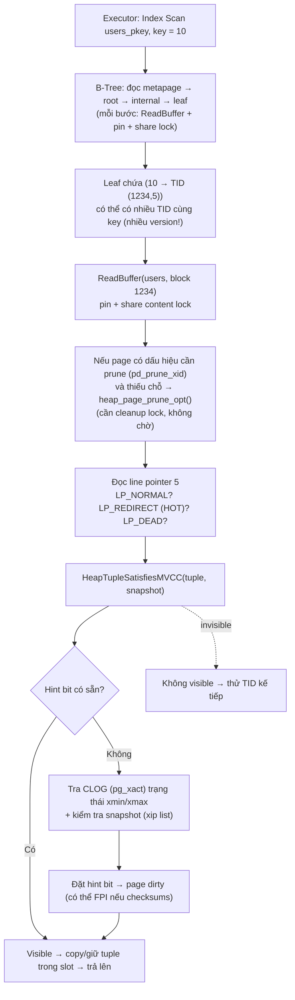
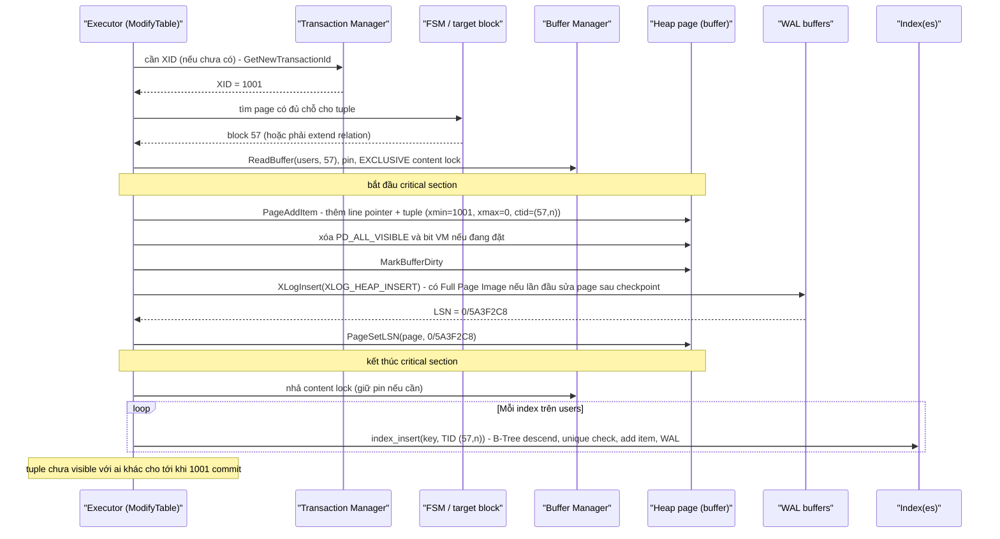
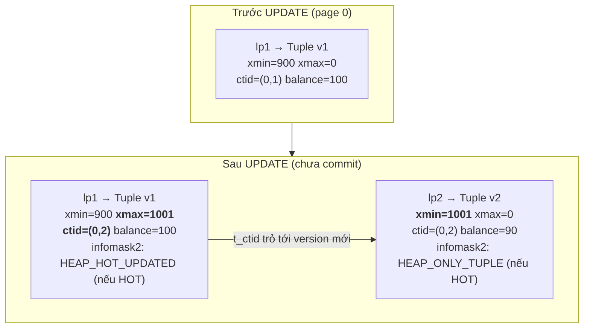
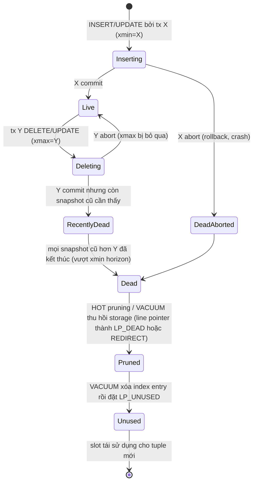

# PART 7 — READ / WRITE BEHAVIOR

> **Trước:** [06 — Storage Internals](06-storage-internals.md) · **Tiếp:** [08 — Memory & Buffer Cache](08-memory-buffer-cache.md)

Chương này ghép [Query Lifecycle](05-query-lifecycle.md) và [Storage Internals](06-storage-internals.md) lại: với từng loại câu lệnh — SELECT, INSERT, UPDATE, DELETE — PostgreSQL **thực sự chạm vào những page nào, ghi những gì, theo thứ tự nào**. Hiểu chương này là hiểu vì sao "UPDATE ở PostgreSQL đắt", "DELETE không giải phóng disk", và vì sao VACUUM tồn tại.

---

## Mục lục

1. [Simple mental model](#1-simple-mental-model)
2. [SELECT — từ query đến tuple](#2-select)
3. [INSERT — step by step](#3-insert)
4. [UPDATE — không overwrite, mà là version mới](#4-update)
5. [DELETE — đánh dấu, không xóa](#5-delete)
6. [Vòng đời của một tuple: live → dead → reclaimed](#6-vòng-đời-của-một-tuple)
7. [Write amplification: một UPDATE tốn bao nhiêu I/O?](#7-write-amplification)
8. [What happens if...](#8-what-happens-if)
9. [So sánh với MySQL/InnoDB](#9-so-sánh-với-mysqlinnodb)
10. [Common misunderstandings](#10-common-misunderstandings)
- [Concept card — khung 13 điểm](#concept-card--)
11. [Interview Questions](#11-interview-questions)
12. [Key Takeaways](#12-key-takeaways)

---

## 1. Simple mental model

- **SELECT:** tìm page → kiểm tra từng tuple "mình có được phép thấy version này không?" → trả về.
- **INSERT:** tìm page còn chỗ → viết tuple mới ghi tên người tạo (xmin) → ghi nhật ký (WAL) → thêm mục vào mọi index.
- **UPDATE:** tìm version hiện tại → *gạch* nó (ghi xmax) → viết **version mới** (xmin mới) → ghi nhật ký → nếu không HOT: thêm mục mới vào **mọi** index.
- **DELETE:** tìm version hiện tại → *gạch* nó (ghi xmax) → ghi nhật ký. Không đụng index, không giải phóng chỗ.
- **COMMIT:** không động vào tuple nào; chỉ ghi "transaction X đã commit" vào WAL (flush) và vào CLOG. Từ đó mọi version do X tạo ra trở thành "có hiệu lực", mọi version X gạch trở thành "đã chết".
- **Dọn dẹp:** các version đã chết mà không ai còn cần → pruning/VACUUM thu hồi chỗ.

---

## 2. SELECT

### 2.1 Ví dụ: `SELECT * FROM users WHERE id = 10;`

Luồng đầy đủ đã có ở [Chương 05 §9.5](05-query-lifecycle.md#95-toàn-bộ-đường-đi-của-select--from-users-where-id--10). Ở đây tập trung vào **những gì xảy ra ở mức page/tuple**:

**Cách đọc diagram (trên xuống):**

1. **Index lookup:** đi từ gốc B-Tree xuống lá (thường 3–4 page). Mỗi page được pin và khóa share trong khoảnh khắc đọc.
2. Lá có thể chứa **nhiều TID cho cùng key 10**: mỗi lần UPDATE không-HOT tạo một index entry mới trỏ tới version mới; entry cũ vẫn còn cho tới khi VACUUM (hoặc cơ chế xóa entry index — mục 6) dọn. **Index không biết version nào visible.**
3. Với mỗi TID, đọc heap page, đọc line pointer.
4. Trước khi đọc, PostgreSQL có thể **opportunistically prune** page (xem [Chương 24](24-hot-update.md)) — nghĩa là một SELECT có thể dọn dead tuple và ghi page.
5. **Visibility check** (`HeapTupleSatisfiesMVCC`) so xmin/xmax với snapshot (chi tiết [Chương 11](11-mvcc.md)). Nếu hint bit chưa có → tra CLOG → đặt hint bit.
6. Tuple visible → trả về. Với index scan trên unique index, sau khi tìm được một version visible thì dừng.
7. Nếu executor phát hiện một tuple **dead với mọi transaction**, nó đánh dấu index entry tương ứng là **LP_DEAD trong index page** ("kill_prior_tuple") → lần sau các scan khác bỏ qua entry đó mà không đọc heap. Đây là một cơ chế tự làm sạch index trong lúc đọc.

### 2.2 Seq Scan khác gì?

Seq Scan đọc **mọi page** của table theo thứ tự block (với table lớn hơn 1/4 shared_buffers: dùng **ring buffer 256KB** để không đẩy dữ liệu nóng ra khỏi cache — [Chương 08](08-memory-buffer-cache.md)), kiểm tra **mọi tuple** (kể cả dead) với snapshot, áp filter. Chi phí tỉ lệ với **kích thước vật lý** của table (kể cả bloat), không phải số row live. Table bloat 10× → seq scan chậm 10×.

PG 17+ dùng **read stream** (gộp đọc nhiều block liền kề, prefetch), PG 18 dùng **asynchronous I/O** cho seq scan, bitmap heap scan, vacuum — giảm thời gian chờ I/O.

---

## 3. INSERT

### 3.1 Ví dụ: `INSERT INTO users (id, email) VALUES (10, 'a@x.com');`

**Cách đọc diagram (trên xuống):**

1. **XID được cấp lười (lazy):** transaction chỉ read thì không bao giờ được cấp XID (chỉ có *virtual transaction ID*). XID được cấp ở lần ghi đầu tiên — giúp tiết kiệm không gian XID 32-bit (liên quan wraparound, [Chương 23](23-vacuum.md)).
2. **Chọn page:** thử page đích backend đang cache → FSM → nếu không có, **mở rộng relation** (thêm page mới ở cuối file; cần *relation extension lock* — một điểm contention khi nhiều backend insert đồng thời; PG 16 cải thiện đáng kể bằng cách mở rộng nhiều page một lần).
3. **Critical section:** sửa page và ghi WAL phải là một khối "không được lỗi giữa chừng" — nếu lỗi xảy ra trong critical section, PostgreSQL **PANIC** (vì trạng thái memory và WAL có thể không khớp).
4. **Tuple mới:** `xmin = 1001`, `xmax = 0` (invalid), `ctid` trỏ chính nó, `t_cid` = command ID hiện tại.
5. **WAL record** `XLOG_HEAP_INSERT` mô tả thay đổi (block, offset, dữ liệu tuple). Nếu đây là **lần đầu page 57 bị sửa kể từ checkpoint gần nhất**, và `full_page_writes = on`, record kèm **Full Page Image** (toàn bộ 8KB page) — xem [Chương 20](20-wal.md).
6. **Page LSN** được đặt = LSN của WAL record → sau này buffer manager không được ghi page ra disk trước khi WAL tới LSN này đã flush.
7. **Mỗi index** nhận một entry mới `(key → TID)`. Unique index kiểm tra trùng (có thể phải *chờ* transaction khác, xem [Chương 01](01-relational-database.md#73-unique)). Mỗi index insert cũng sinh WAL record riêng. **Có N index = N lần đi B-Tree + N WAL record.**
8. Tuple đã nằm trong page nhưng **invisible** với transaction khác: xmin 1001 đang chạy (có trong danh sách in-progress của snapshot người khác).

### 3.2 Constraint và trigger

Thứ tự đại khái cho mỗi row: BEFORE ROW trigger → kiểm tra NOT NULL/CHECK → heap insert → index insert (unique check tại đây) → AFTER ROW trigger được **xếp hàng** (FK check là AFTER trigger chạy cuối statement).

### 3.3 COMMIT (của transaction chứa INSERT)

Commit không động vào page 57. Nó: ghi WAL record commit → flush WAL tới LSN đó (`fsync`) → đặt 2 bit "committed" cho XID 1001 trong CLOG → gỡ XID khỏi ProcArray (từ giờ snapshot mới thấy 1001 đã xong) → nhả lock. Chi tiết [Chương 09](09-transaction.md), [20](20-wal.md).

### 3.4 ROLLBACK

Cũng không động vào page 57. Chỉ đánh dấu XID 1001 là **aborted** trong CLOG. Tuple vẫn nằm trong page, nhưng mọi visibility check sẽ thấy "xmin aborted → invisible" → nó là **dead tuple** ngay lập tức, chờ dọn. **Rollback trong PostgreSQL là O(1)** bất kể transaction đã insert bao nhiêu row — trái ngược với InnoDB, nơi rollback phải áp undo log cho từng row (rollback 10 triệu row có thể lâu hơn cả lúc insert).

---

## 4. UPDATE

### 4.1 Câu hỏi then chốt: UPDATE có overwrite row cũ không?

**Không.** PostgreSQL UPDATE = "đánh dấu version cũ là đã bị thay thế" + "ghi version mới đầy đủ". Mọi cột được copy sang tuple mới, kể cả cột không đổi (trừ giá trị TOAST out-of-line, được tái dùng qua pointer).

### 4.2 HOW — `UPDATE accounts SET balance = 90 WHERE id = 1;`

Giả sử version hiện tại nằm ở `(0,1)`, xmin=900 (đã commit), transaction hiện tại XID=1001.

**Cách đọc diagram:** Version cũ không bị xóa; nó được đặt `xmax = 1001` và `t_ctid` trỏ sang version mới `(0,2)`. Version mới có `xmin = 1001`. Một transaction khác đang đọc với snapshot cũ vẫn thấy v1 (vì 1001 chưa commit hoặc không có trong snapshot của nó); transaction 1001 và các snapshot sau commit của nó thấy v2. Đây chính là **MVCC** — [Chương 11](11-mvcc.md).

### 4.3 Step by step (hàm `heap_update`)

1. **Tìm tuple cần update** (qua scan/index), lấy ctid.
2. **Pin + exclusive lock** page chứa tuple cũ.
3. **Kiểm tra tuple có thể update không** (`HeapTupleSatisfiesUpdate`):
   - xmax = 0 hoặc xmax thuộc transaction đã abort → OK.
   - xmax thuộc transaction **đang chạy** khác (đang update/delete/lock row) → **phải chờ**: nhả content lock, chờ trên lock của XID đó (`wait_event = transactionid`). Khi nó kết thúc:
     - nếu nó **abort** → thử lại;
     - nếu nó **commit** (row đã bị update/delete): ở **Read Committed** → **EvalPlanQual**: đi theo `t_ctid` tới version mới nhất, đánh giá lại điều kiện WHERE trên version đó, nếu vẫn thỏa thì update version mới đó; ở **Repeatable Read/Serializable** → `ERROR: could not serialize access due to concurrent update`. Chi tiết [Chương 12](12-isolation-level.md).
4. **Quyết định HOT hay không:**
   - Không có cột nào được index (kể cả cột trong expression/partial predicate) bị đổi giá trị, **và** page cũ còn đủ chỗ cho version mới → **HOT update**.
   - Ngược lại → non-HOT: version mới đặt ở page khác (tìm qua FSM) hoặc cùng page nhưng vẫn cần index entry.
5. **Ghi thay đổi** (critical section): đặt `xmax` + cờ `HEAP_KEYS_UPDATED` (nếu cột key đổi) trên tuple cũ; `t_ctid` cũ → TID mới; ghi tuple mới với `xmin` = XID hiện tại; set cờ HOT nếu có; xóa bit all-visible của các page liên quan; MarkBufferDirty.
6. **WAL:** `XLOG_HEAP_UPDATE` hoặc `XLOG_HEAP_HOT_UPDATE`. Nếu hai tuple cùng page, một record; khác page, record tham chiếu hai block (có thể hai FPI!). PostgreSQL có tối ưu WAL: chỉ ghi phần khác biệt tiền tố/hậu tố giữa tuple cũ và mới khi cùng page (prefix/suffix compression).
7. **Index:**
   - HOT → **không** thêm index entry nào.
   - Non-HOT → thêm entry mới vào **mọi** index của table (kể cả index trên cột không đổi!), vì TID mới khác TID cũ. Ngoại lệ PG 16+: index loại "summarizing" (BRIN) không chặn HOT.

### 4.4 Tại sao PostgreSQL chọn thiết kế này?

- **Rollback O(1)**, không cần undo log.
- **Reader không bao giờ bị writer chặn và ngược lại** — reader chỉ đọc version phù hợp snapshot.
- **Recovery chỉ cần redo.**
- Cái giá: dead tuple trong heap, bloat, cần VACUUM, write amplification cho index (giảm nhờ HOT).

### 4.5 UPDATE không đổi giá trị cũng tạo version mới

`UPDATE users SET status = status WHERE ...` hoặc ORM "save" mọi cột dù không đổi → **vẫn tạo tuple mới**, vẫn WAL, vẫn dead tuple. PostgreSQL không tự bỏ qua update "no-op". Có trigger dựng sẵn `suppress_redundant_updates_trigger()` để bỏ qua, hoặc thêm `WHERE status IS DISTINCT FROM 'x'`.

---

## 5. DELETE

### 5.1 DELETE có xóa row khỏi disk ngay không?

**Không.** `DELETE` chỉ:
1. Tìm tuple, kiểm tra như UPDATE (chờ nếu có transaction khác đang giữ).
2. Đặt `xmax = XID hiện tại`, cờ `HEAP_KEYS_UPDATED`; `t_ctid` giữ nguyên (trỏ chính nó).
3. Xóa bit all-visible của page.
4. WAL record `XLOG_HEAP_DELETE`.
5. **Không đụng index.** Index entry vẫn trỏ tới tuple.

Sau khi transaction commit, tuple là **dead** với mọi snapshot mới, nhưng vẫn chiếm chỗ trên page, index vẫn trỏ tới nó.

### 5.2 Dead tuple là gì?

**Dead tuple** = tuple không còn visible với **bất kỳ** transaction nào hiện tại hoặc tương lai. Nguồn:
- version cũ bị UPDATE thay thế (xmax đã commit);
- tuple bị DELETE (xmax đã commit);
- tuple được INSERT/UPDATE bởi transaction **abort** (xmin aborted);

Nhưng: tuple bị xóa bởi transaction đã commit **chưa chắc** đã dead — nếu còn một transaction cũ (snapshot lấy trước khi xóa commit) còn chạy, nó vẫn có thể thấy tuple. Tuple như vậy là "**recently dead**" — không được dọn. Ranh giới này được quyết định bởi **xmin horizon** (XID cũ nhất mà bất kỳ snapshot nào còn cần) — xem [Chương 11](11-mvcc.md), [23](23-vacuum.md).

---

## 6. Vòng đời của một tuple

**Cách đọc diagram:**
1. Tuple mới sinh ở trạng thái "đang được tạo" — chỉ transaction tạo ra nó thấy.
2. Commit → **Live**; abort → chết ngay.
3. Khi bị DELETE/UPDATE, nó ở trạng thái "đang bị xóa" — vẫn visible với người khác cho tới khi Y commit.
4. Y commit nhưng **còn snapshot cũ** → **recently dead** — vẫn phải giữ. Đây là trạng thái mà **long-running transaction** kéo dài vô hạn.
5. Khi không ai cần nữa → **dead**.
6. **Pruning** (xảy ra trong lúc đọc/ghi page, chỉ trong một page) hoặc **VACUUM** thu hồi *storage* của tuple; line pointer còn lại ở trạng thái LP_DEAD (hoặc LP_REDIRECT với HOT chain).
7. Chỉ **VACUUM** (sau khi đã xóa các index entry trỏ tới) mới đặt line pointer thành **LP_UNUSED** — slot sẵn sàng tái sử dụng.

---

## 7. Write amplification

### 7.1 Một UPDATE non-HOT trên table có 5 index tốn gì?

Giả sử update 1 cột (không indexed nhưng page đầy nên không HOT được) của 1 row:

| Thao tác | Page bị làm dirty | WAL |
|---|---|---|
| Đánh dấu tuple cũ | heap page A | 1 record (cả 2 block) |
| Ghi tuple mới | heap page B | (chung record) — có thể 2 FPI nếu lần đầu sau checkpoint |
| Xóa bit VM | VM page(s) | WAL cho VM |
| 5 index insert | 5 leaf page (có thể page split) | 5 record (có thể 5 FPI) |
| Commit | — | 1 commit record + fsync |
| Sau này: VACUUM | heap page A, 5 index page (xóa entry cũ), VM, FSM | thêm WAL |

Một thay đổi logic vài byte → hàng chục KB WAL (nhất là ngay sau checkpoint khi FPI dày đặc), 7+ page dirty, và công việc dọn dẹp tương lai. Đây là lý do:
- **Số index trên table ghi nhiều cần được kiểm soát** — index không dùng tới là chi phí thuần.
- **HOT update** cực kỳ quan trọng ([Chương 24](24-hot-update.md)).
- Uber đã nêu write amplification này là một lý do chuyển từ PostgreSQL sang MySQL năm 2016 (bài "Why Uber Engineering Switched from Postgres to MySQL") — các cải tiến sau đó (HOT đã có từ 8.3, B-Tree deduplication PG 13, bottom-up index deletion PG 14) giảm đáng kể vấn đề nhưng nguyên lý vẫn còn.

### 7.2 Bottom-up index deletion (PG 14)

Khi một leaf B-Tree page sắp phải split vì nhiều version của cùng key (do non-HOT update liên tục), PostgreSQL trước hết thử **xóa các index entry trỏ tới tuple đã dead** trên page đó (kiểm tra heap) — "bottom-up deletion". Nếu dọn được đủ chỗ, không cần split → index không phình vì version churn. Đây là giải pháp cho "index bloat do update" mà không cần chờ VACUUM.

---

## 8. What happens if...

| Tình huống | Hành vi |
|---|---|
| **Hai transaction cùng UPDATE một row** | Người thứ hai chờ trên XID lock của người thứ nhất. RC: sau khi người thứ nhất commit, người thứ hai re-evaluate WHERE trên version mới (EvalPlanQual) và update version đó. RR/Serializable: lỗi serialization. Xem [Chương 12](12-isolation-level.md), [13](13-locking.md). |
| **Transaction chết giữa chừng (backend crash)** | Server reset + crash recovery. Tuple đã ghi (nằm trong WAL) được replay nhưng xmin không có commit record → coi như aborted → dead tuple. |
| **UPDATE 100 triệu row trong một câu** | 100 triệu tuple mới (table ~×2 kích thước), WAL khổng lồ (replication lag), 100 triệu dead tuple sau commit; nếu có long transaction đồng thời, không thể dọn. Nên batch. |
| **INSERT khi disk gần đầy** | Extend relation lỗi → câu lệnh lỗi; nếu WAL không ghi được → PANIC. |
| **DELETE toàn bộ table rồi INSERT lại** | Table gấp đôi (dead + mới) cho tới khi VACUUM; TRUNCATE tốt hơn nếu được. |
| **Update nhiều lần cùng một row trong một transaction** | Mỗi lần một tuple mới; các tuple trung gian dead ngay khi commit (xmin = xmax = cùng XID → combo CID). |

---

## 9. So sánh với MySQL/InnoDB

| | PostgreSQL | InnoDB |
|---|---|---|
| INSERT | Heap (vị trí bất kỳ theo FSM) + mỗi index một entry trỏ TID | Clustered index (theo PK) + secondary index entry chứa PK |
| UPDATE | Tuple mới trong heap; index entry mới cho mọi index (trừ HOT) | **In-place** trong clustered index (nếu kích thước cho phép); before-image vào **undo log**; chỉ secondary index có cột đổi mới được cập nhật |
| DELETE | Đặt xmax | Đánh dấu delete-mark; purge thread xóa sau |
| Old versions | Trong heap | Trong undo log (rollback segment) |
| Rollback | O(1) (CLOG) | O(số thay đổi) (áp undo) |
| Đọc version cũ | Đọc trực tiếp tuple cũ trong heap | Dựng lại từ undo chain (đọc lâu nếu chain dài) |
| Dọn dẹp | VACUUM | Purge; long transaction làm **history list length** tăng |

Cả hai đều bị long-running transaction làm hại — chỉ là hại ở chỗ khác nhau (PostgreSQL: heap/index bloat; InnoDB: undo log phình, đọc chậm vì chain dài).

---

## 10. Common misunderstandings

1. **"UPDATE sửa row tại chỗ."** — Không; tạo version mới.
2. **"DELETE giải phóng disk."** — Không; đánh dấu xmax; VACUUM làm chỗ trống tái dùng được *trong file*.
3. **"UPDATE một cột không indexed thì không đụng index."** — Chỉ đúng khi HOT; non-HOT thì mọi index đều nhận entry mới.
4. **"Rollback một transaction lớn tốn thời gian như lúc làm."** — Trong PostgreSQL rollback là O(1); cái tốn là dead tuple để lại.
5. **"SELECT chỉ đọc."** — Có thể đặt hint bit, prune page, đánh dấu index entry LP_DEAD.

---

## Concept card — "Đường ghi của UPDATE" theo khung 13 điểm

| # | Khía cạnh | Tóm tắt |
|---|---|---|
| 1 | **WHAT** | UPDATE = đặt `xmax` trên version cũ + ghi **version mới đầy đủ** (`xmin` mới) + (non-HOT) entry mới cho **mọi** index + WAL. DELETE = chỉ đặt `xmax`. |
| 2 | **WHY** | Giữ version cũ cho snapshot khác (MVCC): reader không bị chặn, rollback O(1), recovery chỉ cần redo, không cần undo log. |
| 3 | **HOW** | Tìm tuple → kiểm tra/chờ lock → quyết định HOT → ghi tuple mới, nối `t_ctid` → WAL → index insert (non-HOT) — §4.3. |
| 4 | **INTERNALS** | `heap_update`, cờ `HEAP_HOT_UPDATED`/`HEAP_ONLY_TUPLE`, `XLOG_HEAP_UPDATE`/`HOT_UPDATE`, xóa bit VM, FSM khi cần page khác, EvalPlanQual khi xung đột (RC). |
| 5 | **EXAMPLE** | `UPDATE accounts SET balance = 90` → page 0 có v1 (xmax=1001) và v2 (xmin=1001) — §4.2. |
| 6 | **WHAT HAPPENS IF** | Hai transaction cùng update → chờ XID; crash giữa chừng → redo rồi coi là aborted; update 100 triệu row → WAL khổng lồ, bloat — §8. |
| 7 | **PERFORMANCE IMPACT** | Write amplification: heap + N index + WAL (+FPI) + VM; chi phí vacuum sau đó — §7. |
| 8 | **PRODUCTION BEHAVIOR** | `n_tup_upd` vs `n_tup_hot_upd`, `n_dead_tup` tăng, WAL rate, replication lag sau batch update, bloat khi vacuum không kịp. |
| 9 | **TRADE-OFF** | Đọc không chặn + rollback rẻ ↔ dead tuple, index write, VACUUM bắt buộc. |
| 10 | **WHEN TO USE / NOT** | Update có kiểm soát trên table OLTP (fillfactor + HOT). Tránh no-op update, "touch" hàng loạt, dùng append-only + partition cho dữ liệu sự kiện. |
| 11 | **MISUNDERSTANDINGS** | "UPDATE ghi đè", "DELETE giải phóng disk", "rollback lớn thì chậm" — §10. |
| 12 | **INTERVIEW** | "Chuyện gì xảy ra khi UPDATE?", "Vì sao UPDATE đắt hơn InnoDB?" — §11. |
| 13 | **KEY TAKEAWAYS** | Không overwrite; version mới + index entry; dọn bằng pruning/VACUUM khi vượt xmin horizon — §12. |

---

## 11. Interview Questions

**Q1. Chuyện gì xảy ra khi chạy UPDATE trong PostgreSQL?**
- *Short:* Tìm tuple, kiểm tra/chờ lock, đặt xmax trên version cũ, ghi version mới với xmin mới, ctid cũ trỏ sang mới, WAL, và (nếu không HOT) thêm entry vào mọi index.
- *Deep:* Điều kiện HOT; EvalPlanQual ở RC; FPI sau checkpoint; bottom-up deletion; dead tuple → VACUUM.
- *Follow-up:* Vì sao UPDATE ở PostgreSQL đắt hơn InnoDB trong một số workload?

**Q2. DELETE có giải phóng disk không? Làm sao lấy lại disk?**
- *Short:* Không. VACUUM cho tái dùng; VACUUM FULL/pg_repack (hoặc REPACK ở PG 19 beta) rewrite để trả disk; partition + DROP là cách tốt nhất cho dữ liệu theo thời gian.

**Q3. Tại sao ROLLBACK trong PostgreSQL nhanh?**
- *Short:* Chỉ đánh dấu XID aborted trong CLOG; tuple tự động invisible.

**Q4. Tại sao thêm index có thể làm INSERT/UPDATE chậm?**
- *Short:* Mỗi index là một B-Tree insert + WAL + page dirty; với UPDATE non-HOT mọi index đều bị ghi; index trên cột hay update còn phá HOT.

**Q5. Dead tuple là gì? "Recently dead" là gì?**
- *Short:* Tuple không visible với ai nữa. Recently dead: đã bị xóa bởi tx commit nhưng vẫn có snapshot cũ có thể thấy → chưa dọn được.

**Q6. (Senior) Một job cập nhật `updated_at = now()` cho mọi row mỗi đêm. Hệ quả?**
- *Short:* Mỗi row một version mới (table gấp đôi), WAL lớn, replication lag, dead tuple khổng lồ, index trên `updated_at` phá HOT; nên xem lại nhu cầu, batch, hoặc thiết kế lại.

---

## 12. Key Takeaways

1. **SELECT** = tìm page + kiểm tra visibility từng tuple; có thể ghi (hint bits, pruning, kill index entries).
2. **INSERT** = chọn page (FSM) → tuple với xmin → WAL (có thể FPI) → entry cho **mọi** index.
3. **UPDATE** = xmax trên cũ + tuple mới + WAL + (non-HOT) entry mới cho **mọi** index. Không overwrite.
4. **DELETE** = xmax; không đụng index; không giải phóng chỗ.
5. **COMMIT/ROLLBACK** chỉ ghi trạng thái XID (WAL + CLOG); không đụng tuple → rollback O(1).
6. Dead tuple chỉ dọn được khi vượt **xmin horizon**; long transaction giữ mọi thứ ở trạng thái recently dead.
7. Write amplification là chi phí cốt lõi của thiết kế MVCC-in-heap; HOT, fillfactor, ít index, bottom-up deletion là các vũ khí giảm nó.

---

## Nguồn tham khảo

- PostgreSQL Docs — *Concurrency Control* (MVCC introduction), *Heap-Only Tuples (HOT)*: https://www.postgresql.org/docs/current/storage-hot.html
- PostgreSQL source: `src/backend/access/heap/heapam.c` (`heap_insert`, `heap_update`, `heap_delete`), `src/backend/access/heap/README.HOT`, `src/backend/access/nbtree/README` (bottom-up deletion).
- PostgreSQL 14 Release Notes (bottom-up index deletion), PostgreSQL 16 Release Notes (relation extension, HOT with BRIN).
- Uber Engineering, *Why Uber Engineering Switched from Postgres to MySQL* (2016) và các phản hồi của cộng đồng PostgreSQL.
