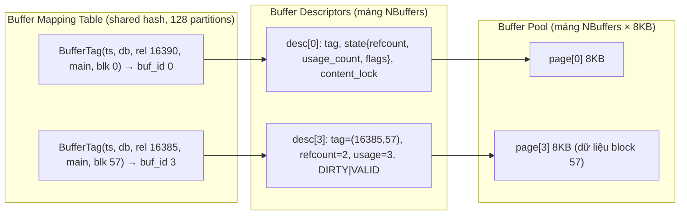
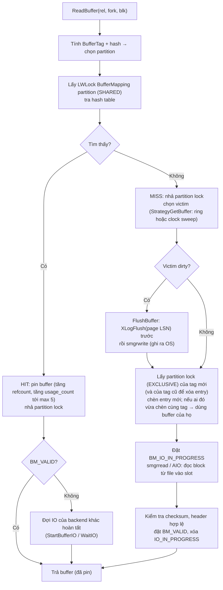
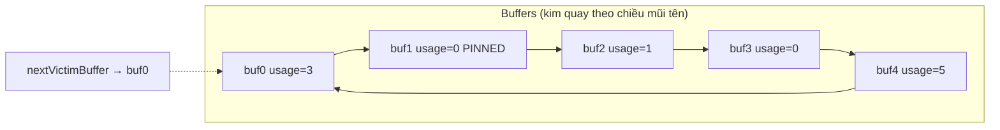
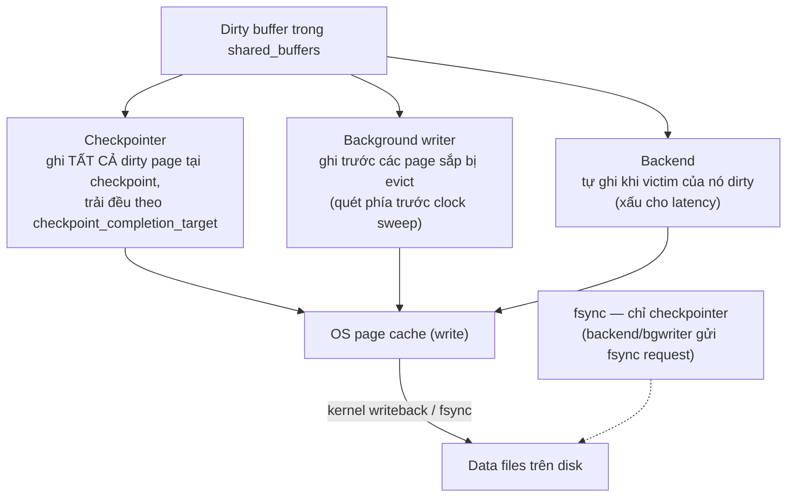
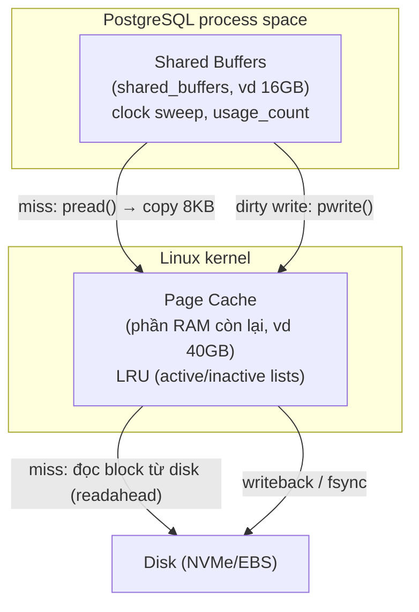

# PART 8 — BUFFER CACHE & MEMORY

> **Trước:** [07 — Read/Write Behavior](07-read-write-behavior.md) · **Tiếp:** [09 — Transaction](09-transaction.md)
> **Độ ưu tiên:** Rất cao.

---

## Mục lục

1. [Simple mental model](#1-simple-mental-model)
2. [Concept: Shared Buffers & Buffer Manager](#2-concept-shared-buffers--buffer-manager)
3. [Internals: Buffer Descriptor, Buffer Mapping Table](#3-internals-buffer-descriptor-buffer-mapping-table)
4. [Đọc một page: hit, miss, eviction](#4-đọc-một-page-hit-miss-eviction)
5. [Pin, Content Lock, Cleanup Lock](#5-pin-content-lock-cleanup-lock)
6. [Concept: Clock Sweep](#6-concept-clock-sweep)
7. [Concept: Ring Buffers (Buffer Access Strategy) và Sequential Scan](#7-concept-ring-buffers-và-sequential-scan)
8. [Concept: Dirty Page — ai ghi, khi nào](#8-concept-dirty-page--ai-ghi-khi-nào)
9. [Concept: Shared Buffers vs OS Page Cache vs Disk](#9-concept-shared-buffers-vs-os-page-cache-vs-disk)
10. [Asynchronous I/O (PG 18)](#10-asynchronous-io-pg-18)
11. [Local buffers (temp tables)](#11-local-buffers)
12. [Cache hit ratio: đo gì và hiểu sai gì](#12-cache-hit-ratio)
13. [What happens if...](#13-what-happens-if)
14. [Performance impact, Production, Trade-off](#14-performance-impact-production-trade-off)
15. [Common misunderstandings](#15-common-misunderstandings)
16. [Interview Questions](#16-interview-questions)
17. [Key Takeaways](#17-key-takeaways)

---

## 1. Simple mental model

- **Disk** là nhà kho khổng lồ ở ngoại thành: chứa mọi thứ, lấy hàng mất nhiều thời gian.
- **OS page cache** là kho trung chuyển trong thành phố do chính quyền (kernel) quản lý: mọi thứ PostgreSQL đọc/ghi đều đi qua đây.
- **Shared buffers** là quầy hàng ngay trong cửa hàng (PostgreSQL), có số ô cố định (mỗi ô vừa đúng một page 8KB).
- Nhân viên (backend) cần một page → nhìn quầy (hash table) → có thì lấy ngay (hit) → không có thì chọn một ô ít được dùng (clock sweep), nếu ô đó chứa hàng đã sửa chưa cất (dirty) thì phải cất về kho trước, rồi đi lấy page mới về đặt vào ô.
- Khi đang dùng một ô, nhân viên **ghim** (pin) nó để không ai dọn đi; khi đang viết lên hàng thì **khóa** (content lock) để không ai đọc lúc đang viết dở.

---

## 2. Concept: Shared Buffers & Buffer Manager

### 2.1 WHAT

**Shared buffers** là vùng shared memory chứa một mảng `NBuffers` slot, mỗi slot 8KB, cache các page của mọi relation (table, index, FSM, VM...) của mọi database trong cluster. Kích thước = `shared_buffers` (mặc định 128MB).

**Buffer Manager** (`src/backend/storage/buffer/`) là subsystem quản lý: tìm page trong cache, nạp page vào, chọn page để đẩy ra, theo dõi dirty page, phối hợp với WAL để ghi page an toàn.

### 2.2 WHY

1. **Giảm I/O:** tránh đọc lại disk (hoặc gọi syscall) cho page dùng thường xuyên.
2. **Điểm phối hợp concurrency:** mọi backend đọc/sửa **cùng một bản** page trong shared memory. Nếu mỗi backend đọc page vào memory riêng rồi sửa, sẽ có nhiều bản không nhất quán. Buffer là nơi content lock được áp dụng.
3. **Thực thi WAL rule:** buffer manager là nơi duy nhất ghi data page ra disk, nên là nơi đảm bảo "WAL tới `pd_lsn` phải flush trước khi page được ghi" ([Chương 20](20-wal.md)).
4. **Trì hoãn ghi:** page bị sửa nhiều lần giữa hai lần ghi ra disk chỉ cần ghi một lần — gom nhiều thay đổi thành một I/O.

Nếu không có buffer manager: mỗi lần đọc tuple phải `pread` page từ file (syscall + copy từ page cache), mỗi lần sửa phải `pwrite` ngay (random write), không có chỗ để áp dụng content lock, và không thể đảm bảo thứ tự WAL-trước-data.

---

## 3. Internals: Buffer Descriptor, Buffer Mapping Table

### 3.1 Ba cấu trúc chính



**Cách đọc diagram (trái sang phải):**
1. **Buffer mapping table**: hash table `BufferTag → buf_id`. `BufferTag = (tablespace, database, relfilenumber, fork, block)`. Chia thành **128 partition** (`NUM_BUFFER_PARTITIONS`), mỗi partition có LWLock riêng (`BufferMapping`) để giảm contention.
2. **Buffer descriptor**: metadata cho mỗi slot, cùng chỉ số với slot trong buffer pool.
3. **Buffer pool**: dữ liệu page thật.

### 3.2 Buffer descriptor chứa gì

| Trường | Ý nghĩa |
|---|---|
| `tag` | Page nào đang nằm trong slot này. |
| `buf_id` | Chỉ số slot. |
| `state` (một biến **atomic 32-bit** gộp) | **refcount** (số backend đang pin — 18 bit), **usage_count** (0–5, cho clock sweep — 4 bit), **flags**: `BM_VALID` (dữ liệu hợp lệ), `BM_TAG_VALID`, `BM_DIRTY`, `BM_IO_IN_PROGRESS` (đang đọc/ghi), `BM_JUST_DIRTIED`, `BM_PERMANENT` (relation có WAL), `BM_CHECKPOINT_NEEDED` (phải ghi trong checkpoint hiện tại), `BM_LOCKED` (header spinlock)... |
| `content_lock` | **LWLock** bảo vệ *nội dung* page (shared cho đọc, exclusive cho sửa). |
| `wait_backend_pgprocno` | Backend đang chờ để lấy cleanup lock. |

Việc gộp refcount/usage/flags vào một atomic cho phép **pin/unpin bằng một phép compare-and-swap** không cần lock — tối ưu quan trọng cho scalability đa core (từ PG 9.6).

---

## 4. Đọc một page: hit, miss, eviction

### 4.1 HOW — `ReadBuffer(rel, blockNum)` step by step



**Cách đọc diagram (trên xuống):**

1. **Hit path** (phần lớn các lần đọc trong OLTP khỏe mạnh): tra hash dưới lock shared của một partition → tăng refcount + usage_count bằng atomic → xong. Chi phí: vài trăm nano giây.
2. Có thể "hit" nhưng page **chưa hợp lệ** vì backend khác đang đọc nó từ disk → chờ IO đó xong thay vì đọc trùng.
3. **Miss path:** chọn **victim buffer** bằng clock sweep (hoặc ring buffer nếu có strategy).
4. Nếu victim **dirty**: **backend phải tự ghi page đó ra** — và trước khi ghi, phải đảm bảo WAL đã flush tới `pd_lsn` của page (**WAL rule**). Nếu WAL chưa flush tới đó → backend phải flush WAL (có thể tốn một fsync!). Đây là lý do backend tự ghi dirty page làm tăng latency, và vì sao bgwriter tồn tại.
5. Cập nhật mapping table dưới lock exclusive; xử lý race khi hai backend cùng miss cùng page.
6. Đọc block từ file (qua OS page cache — có thể là "hit" ở tầng OS, không cần disk).
7. Kiểm tra checksum (nếu bật). Sai → lỗi `invalid page`.

### 4.2 Sau khi có buffer

Caller lấy **content lock** (shared/exclusive) khi truy cập nội dung, nhả khi xong thao tác trên page; và **unpin** (`ReleaseBuffer`) khi không còn cần giữ page trong cache.

---

## 5. Pin, Content Lock, Cleanup Lock

Ba khái niệm hay bị nhầm:

| | **Pin** | **Content lock** (LWLock) | **Cleanup lock** |
|---|---|---|---|
| Là gì | Tăng refcount | LWLock trên nội dung page | Content lock exclusive **và** refcount = 1 (chỉ mình mình pin) |
| Mục đích | Ngăn buffer bị **evict/thay thế** trong lúc đang dùng | Ngăn đọc thấy page **đang sửa dở**; tuần tự hóa ghi | Cho phép **di chuyển/xóa tuple vật lý** trong page (pruning, vacuum) |
| Thời gian giữ | Có thể lâu (vd scan đang đứng ở page này) | Rất ngắn (chỉ trong lúc đọc/sửa bytes) | Ngắn |
| Nhiều backend cùng giữ? | Có | Shared: có; Exclusive: không | Không |

### 5.1 WHY — Tại sao pruning/vacuum cần cleanup lock?

Một backend đang pin page có thể đang giữ **con trỏ trực tiếp** tới tuple trong buffer (executor giữ tuple "trong chỗ" để tránh copy). Nếu pruning dồn page (di chuyển tuple) trong lúc đó, con trỏ trỏ vào rác. Vì vậy chỉ được dồn page khi **không ai khác đang pin**.

**Hệ quả production:** VACUUM gặp page đang bị pin lâu (ví dụ một cursor mở đang dừng ở page đó) phải **chờ** hoặc (với vacuum thường, trên page không cần freeze bắt buộc) **bỏ qua** page đó. Pruning cơ hội trong lúc đọc chỉ thử lấy cleanup lock theo kiểu *conditional* — không được thì bỏ qua.

---

## 6. Concept: Clock Sweep

### 6.1 WHAT

Thuật toán chọn **victim** (buffer bị thay thế) khi cần slot trống. Là một xấp xỉ của LRU.

### 6.2 WHY — Tại sao không dùng LRU chính xác?

LRU chuẩn cần một danh sách liên kết, và **mỗi lần truy cập** buffer phải di chuyển nó lên đầu danh sách → mỗi lần hit phải lấy lock trên danh sách toàn cục → **nút thắt contention** với hàng chục core cùng đọc. Clock sweep chỉ cần **tăng một bộ đếm** (atomic) khi hit — không có cấu trúc toàn cục phải sửa.

### 6.3 HOW

- Mỗi buffer có **usage_count** 0..5 (`BM_MAX_USAGE_COUNT = 5`).
- Mỗi lần pin (hit) → `usage_count = min(usage_count + 1, 5)`.
- Có một **"kim đồng hồ"** (`nextVictimBuffer`, atomic) quay vòng qua mảng buffer. Khi cần victim:
  1. Nhìn buffer tại kim, tăng kim.
  2. Nếu buffer đang bị pin (`refcount > 0`) → bỏ qua.
  3. Nếu `usage_count > 0` → **giảm 1**, bỏ qua.
  4. Nếu `usage_count = 0` và không pin → **chọn làm victim**.



**Cách đọc diagram (một lượt tìm victim bắt đầu ở buf0):**
- buf0: usage 3 → giảm còn 2, bỏ qua.
- buf1: đang bị pin → bỏ qua (không giảm).
- buf2: usage 1 → giảm còn 0, bỏ qua.
- buf3: usage 0, không pin → **victim**. Kim dừng ở buf4 cho lần sau.

Page "nóng" (hit liên tục) giữ usage_count cao → sống sót nhiều vòng quét. Page chỉ dùng một lần rơi về 0 sau vài lượt → bị thay.

(Tùy version, có thêm một **freelist** các buffer chưa dùng/bị vô hiệu hóa được ưu tiên trước clock sweep; ngay sau khởi động, mọi buffer nằm trong freelist.)

### 6.4 PERFORMANCE / Production

- Shared buffers rất lớn (hàng trăm GB) + tỉ lệ miss cao → mỗi lần tìm victim có thể phải quét nhiều buffer; đồng thời bgwriter phải theo kịp.
- Không có cách "pin" một table trong cache (có extension `pg_prewarm` để **nạp trước** sau restart, và `autoprewarm` để ghi lại danh sách buffer định kỳ và nạp lại khi khởi động — rất hữu ích để tránh "cold cache" sau restart/failover).

---

## 7. Concept: Ring Buffers và Sequential Scan

### 7.1 WHAT

**Buffer Access Strategy** giới hạn một thao tác lớn chỉ được dùng một **vòng (ring) nhỏ** buffer và tái sử dụng chúng, thay vì chiếm cả shared buffers.

| Strategy | Dùng cho | Kích thước ring |
|---|---|---|
| `BAS_BULKREAD` | Seq scan (và một số thao tác đọc lớn) trên relation **lớn hơn 1/4 shared_buffers** | 256KB |
| `BAS_BULKWRITE` | `COPY FROM`, `CREATE TABLE AS`, `CREATE MATERIALIZED VIEW`, `ALTER TABLE` rewrite | 16MB |
| `BAS_VACUUM` | VACUUM, ANALYZE | `vacuum_buffer_usage_limit` (PG 16+; mặc định **2MB** ở PG 17/18; giới hạn tối đa 1/8 shared_buffers) |

### 7.2 WHY — Chống "cache pollution"

Nếu một report `SELECT sum(amount) FROM orders` (table 500GB) đi qua clock sweep bình thường, mỗi page đọc vào chiếm một buffer với usage_count 1, đẩy dần các page nóng của OLTP ra ngoài. Sau khi report chạy, cache toàn page vô dụng; OLTP phải đọc lại disk. Ring buffer đảm bảo scan lớn chỉ "xoay" trong 256KB.

### 7.3 Hệ quả thú vị

- **Seq scan trên table lớn gần như không làm "ấm" shared buffers** — chạy lại query lần hai vẫn đọc từ OS page cache/disk. Đây là lý do "tôi chạy query 2 lần mà lần 2 không nhanh hơn ở shared hit" — phần lớn cải thiện (nếu có) đến từ OS cache.
- **Bulk write ring:** khi ring quay lại một buffer dirty, backend phải ghi nó (và flush WAL tới đó) → COPY lớn tự ghi dữ liệu thay vì dồn cho checkpointer.
- **Vacuum ring nhỏ** → vacuum phải flush WAL thường xuyên khi tái dùng buffer dirty; PG 16 cho phép tăng `vacuum_buffer_usage_limit` (hoặc `VACUUM (BUFFER_USAGE_LIMIT ...)`) để vacuum nhanh hơn khi cần (ví dụ vacuum khẩn cấp chống wraparound), đổi lại tranh cache nhiều hơn.

### 7.4 Synchronized sequential scans

`synchronize_seqscans = on` (mặc định): khi một seq scan lớn đang chạy trên table, seq scan mới trên cùng table **bắt đầu tại vị trí hiện tại** của scan kia, đọc tới cuối rồi quay về đầu. Hai scan "đi cùng nhau" → page đọc vào được dùng bởi cả hai trước khi bị ring thay thế → giảm I/O. Hệ quả: thứ tự row trả về không cố định (xem [Chương 01](01-relational-database.md#22-why--tại-sao-lý-thuyết-lại-quan-trọng-với-engineer)).

---

## 8. Concept: Dirty Page — ai ghi, khi nào

### 8.1 WHAT

**Dirty page** là buffer có nội dung đã bị sửa trong memory nhưng **chưa ghi ra data file** (cờ `BM_DIRTY`). Việc sửa đã được ghi lại trong WAL (nên an toàn trước crash), nhưng data file đang giữ phiên bản cũ.

### 8.2 Ba con đường ghi dirty page



**Cách đọc diagram:** Cả ba đường đều chỉ `write()` vào **OS page cache**; dữ liệu thực sự xuống disk khi kernel tự writeback hoặc khi **checkpointer gọi `fsync`** ở cuối checkpoint. Chỉ sau fsync thành công, checkpoint mới hoàn tất và WAL cũ mới được phép recycle.

Mục tiêu tuning: **phần lớn** dirty page được ghi bởi checkpointer (hiệu quả nhất: mỗi page một lần mỗi chu kỳ), một phần bởi bgwriter, **rất ít** bởi backend. Quan sát bằng `pg_stat_io` (PG 16+): cột `writes` theo `backend_type` (`checkpointer`, `background writer`, `client backend`) và `context`.

### 8.3 Checkpoint và dirty page

Khi checkpoint bắt đầu, mọi buffer đang dirty được đánh dấu `BM_CHECKPOINT_NEEDED`; checkpointer ghi chúng (sắp xếp theo file/block để ghi tuần tự hơn), trải đều trong khoảng `checkpoint_completion_target × checkpoint_timeout` (mặc định 0.9 × 5 phút) để tránh I/O spike. Chi tiết [Chương 21](21-checkpoint.md).

### 8.4 `*_flush_after`

`backend_flush_after`, `bgwriter_flush_after` (512kB trên Linux), `checkpoint_flush_after` (256kB): sau khi `write()` một lượng dữ liệu, PostgreSQL gợi ý kernel bắt đầu writeback sớm (`sync_file_range`) để tránh kernel tích lũy hàng GB dirty page rồi xả một lần làm nghẽn I/O (và làm `fsync` cuối checkpoint cực chậm).

---

## 9. Concept: Shared Buffers vs OS Page Cache vs Disk

### 9.1 WHAT — PostgreSQL dùng buffered I/O

PostgreSQL đọc/ghi file bằng `pread`/`pwrite` **thông thường** (không `O_DIRECT` trong production; PG 16 có `debug_io_direct` chỉ để phát triển). Mọi page đi qua **OS page cache**. Hệ quả: một page có thể nằm ở **hai nơi** cùng lúc — shared buffers và OS page cache (**double buffering**).



**Cách đọc diagram:** Một lần "miss" ở shared buffers chưa chắc là I/O disk — rất thường là "hit" ở page cache (tốn syscall + copy 8KB, vài micro giây). Chỉ khi miss cả hai tầng mới thực sự chạm disk.

### 9.2 WHY — Tại sao PostgreSQL không dùng O_DIRECT như InnoDB?

Lịch sử + thiết kế:
- Dựa vào kernel cho **readahead** (đọc trước khi seq scan), **write combining**, **I/O scheduling** — PostgreSQL không phải tự làm.
- Portable trên nhiều OS.
- Bù lại: double buffering lãng phí RAM; kernel không biết page nào quan trọng với database; `fsync` semantics phức tạp (sự cố "fsyncgate" 2018: trên Linux, nếu `fsync` báo lỗi rồi được gọi lại, lần sau có thể báo thành công dù dữ liệu đã mất — PostgreSQL từ đó chọn **PANIC khi fsync lỗi** thay vì retry, tham số `data_sync_retry = off`).

Dự án AIO (PG 18) là bước đầu hướng tới việc có thể dùng direct I/O trong tương lai.

### 9.3 Sizing shared_buffers — suy luận

- Quá nhỏ: nhiều miss → nhiều syscall/copy; dirty page bị evict sớm → backend tự ghi, ghi cùng page nhiều lần (không gom được).
- Quá lớn: RAM còn lại cho page cache, work_mem, OS ít → double buffering tốn kém hơn; checkpoint phải ghi nhiều hơn; thời gian quét buffer khi DROP/TRUNCATE relation lớn hơn; khởi động sau crash cache lạnh lâu hơn.
- Quy tắc kinh nghiệm phổ biến: **~25% RAM** làm điểm xuất phát; workload có working set vừa khít shared buffers có thể hưởng lợi từ giá trị lớn hơn. Luôn đo (`pg_buffercache`, `pg_stat_io`, hit ratio theo từng table).

### 9.4 `effective_cache_size`

Chỉ là **gợi ý cho planner**: "tổng cache (shared_buffers + page cache) mà một query có thể trông đợi". Không cấp phát gì. Planner dùng nó trong công thức chi phí index scan (ước lượng bao nhiêu lần đọc heap lặp lại sẽ trúng cache). Đặt thấp quá → planner nghĩ index scan đắt → ưu tiên seq scan. Thường đặt 50–75% RAM.

---

## 10. Asynchronous I/O (PG 18)

### 10.1 WHAT

PG 18 thêm subsystem **AIO**: backend có thể **phát lệnh đọc nhiều block cùng lúc** và tiếp tục làm việc khác trong khi chờ, thay vì đọc từng block một và ngồi chờ mỗi lần (`pread` đồng bộ).

- `io_method = worker` (mặc định): các process **io worker** (mặc định `io_workers = 3`) thực hiện I/O thay backend.
- `io_method = io_uring` (Linux, build có liburing): gửi qua io_uring của kernel.
- `io_method = sync`: hành vi cũ.

Ở PG 18, AIO được dùng cho **đọc**: sequential scan, bitmap heap scan, vacuum... (qua *read stream* API có từ PG 17, gộp các block liền kề thành một I/O lớn tối đa `io_combine_limit`, mặc định 128kB). `effective_io_concurrency` và `maintenance_io_concurrency` mặc định tăng lên **16** ở PG 18.

### 10.2 WHY

Trên cloud block storage (EBS, persistent disk), mỗi I/O có latency cao (~0.5–2ms) nhưng thông lượng song song lớn. Đọc đồng bộ từng block không bao giờ khai thác được thông lượng đó. AIO cho phép có nhiều I/O "đang bay" cùng lúc.

---

## 11. Local buffers

**Temporary table** chỉ visible trong session tạo ra nó → không cần chia sẻ → dùng **local buffers** trong memory riêng của backend (`temp_buffers`, mặc định 8MB), không cần lock, không WAL. Hệ quả:
- Temp table không đi qua shared buffers, không hưởng cache chung.
- Autovacuum **không** xử lý temp table (không truy cập được memory của backend khác) — phải tự `ANALYZE` temp table lớn trước khi dùng trong query phức tạp.
- Tạo/xóa temp table liên tục → catalog bloat ([Chương 01](01-relational-database.md#52-why--catalog-là-table-thông-thường-và-điều-đó-có-hệ-quả-lớn)).

---

## 12. Cache hit ratio

### 12.1 Đo gì

```sql
SELECT datname, blks_hit, blks_read,
       round(100.0 * blks_hit / nullif(blks_hit + blks_read, 0), 2) AS hit_pct
FROM pg_stat_database;
```

`blks_hit` = số lần tìm thấy trong shared buffers. `blks_read` = số lần phải gọi đọc từ OS — **có thể** là OS cache hit hoặc disk read; PostgreSQL không phân biệt được (trừ khi bật `track_io_timing` và nhìn thời gian đọc).

### 12.2 Hiểu sai thường gặp

- *"Hit ratio 99% nghĩa là mọi thứ tốt."* — Tỉ lệ trung bình che giấu: 1% miss trên 1 triệu lần đọc/giây = 10.000 lần đọc OS/giây. Và hit ratio cao có thể do query đang đọc lặp lại **quá nhiều** page (ví dụ nested loop tệ đọc cùng page hàng triệu lần) — hit cao nhưng vẫn là vấn đề.
- *"Hit ratio thấp là do shared_buffers nhỏ."* — Có thể do seq scan lớn (ring buffer) hoặc workload analytics tự nhiên; cần phân tích theo table (`pg_statio_user_tables`) và theo query (`pg_stat_statements.shared_blks_read`).

---

## 13. What happens if...

| Tình huống | Chuyện gì xảy ra |
|---|---|
| **Restart / failover** | Shared buffers trống (cold cache). Latency cao trong vài phút tới vài giờ cho tới khi working set được nạp lại. OS page cache có thể còn (restart process) hoặc cũng trống (failover sang máy khác). Giảm bằng `pg_prewarm`/autoprewarm. |
| **Một backend pin buffer rất lâu** | Vacuum không lấy được cleanup lock trên page đó → bỏ qua (dead tuple ở lại) hoặc chờ (aggressive vacuum). |
| **Toàn bộ buffer bị pin** (cực hiếm, số connection × pin lớn so với NBuffers nhỏ) | `ERROR: no unpinned buffers available`. |
| **Workload ghi nặng, bgwriter không theo kịp** | Backend tự ghi dirty page → latency p99 tăng. Tăng `bgwriter_lru_maxpages`, `bgwriter_lru_multiplier`, giảm `bgwriter_delay`. |
| **Checkpoint trong lúc có rất nhiều dirty page** | I/O spike; WAL tăng do FPI ngay sau checkpoint. [Chương 21](21-checkpoint.md). |
| **Kernel tích quá nhiều dirty page** | `fsync` cuối checkpoint tốn hàng chục giây, I/O stall toàn hệ thống. Điều chỉnh `vm.dirty_background_bytes`/`vm.dirty_bytes` và dùng `*_flush_after`. |
| **fsync trả lỗi (disk hỏng)** | PostgreSQL PANIC (từ PG 12, `data_sync_retry = off`), khởi động lại và recovery từ WAL — vì không thể tin page cache nữa. |

---

## 14. Performance impact, Production, Trade-off

### 14.1 Các chỉ số quan sát

| Mục tiêu | View / công cụ |
|---|---|
| I/O theo loại process, context (normal, bulkread, bulkwrite, vacuum), object | `pg_stat_io` (PG 16+) |
| Hit/read theo table và index | `pg_statio_user_tables`, `pg_statio_user_indexes` |
| Buffer nào đang cache table nào, bao nhiêu dirty | extension `pg_buffercache` |
| I/O theo query | `pg_stat_statements` (`shared_blks_hit/read/dirtied/written`) và `EXPLAIN (ANALYZE, BUFFERS)` |
| Thời gian I/O | `track_io_timing = on` → `I/O Timings` trong EXPLAIN, `blk_read_time` |

### 14.2 Trade-off tổng hợp

| Quyết định | Lợi | Hại |
|---|---|---|
| shared_buffers lớn | Nhiều hit hơn, gom ghi tốt hơn | Ít RAM cho OS cache/work_mem; checkpoint nặng hơn |
| Buffered I/O | Readahead, đơn giản, portable | Double buffering, phụ thuộc hành vi kernel |
| Clock sweep | Scalable, không lock khi hit | Xấp xỉ, không chính xác như LRU/ARC |
| Ring buffers | Chống cache pollution | Scan lớn không được cache; bulk ops tự ghi |

---

## 15. Common misunderstandings

1. **"shared_buffers càng lớn càng tốt; đặt 80% RAM như InnoDB."** — Sai với PostgreSQL vì buffered I/O.
2. **"`blks_read` là số lần đọc disk."** — Là số lần gọi đọc từ OS; có thể trúng page cache.
3. **"Chạy query 2 lần, lần 2 sẽ nhanh vì đã cache trong shared_buffers."** — Seq scan table lớn dùng ring buffer 256KB; lần 2 nhanh (nếu có) là nhờ OS cache.
4. **"Checkpoint là lúc dữ liệu được đảm bảo an toàn."** — Durability đến từ WAL lúc commit; checkpoint chỉ giới hạn thời gian recovery.
5. **"effective_cache_size cấp phát memory."** — Chỉ là tham số của planner.
6. **"Background writer làm checkpoint nhẹ đi đáng kể."** — Nó ghi page sắp bị evict; checkpoint vẫn phải ghi mọi dirty page còn lại.

---

## 16. Interview Questions

**Q1. Buffer manager của PostgreSQL hoạt động thế nào khi đọc một page?**
- *Short:* Tra hash `BufferTag → buf_id`; hit → pin; miss → clock sweep chọn victim, nếu dirty thì flush WAL tới page LSN rồi ghi page, đọc page mới vào, pin.
- *Deep:* 128 partition lock, atomic state, BM_IO_IN_PROGRESS, checksum verify.
- *Follow-up:* Tại sao backend tự ghi dirty page là xấu? Bgwriter giúp thế nào?

**Q2. Pin khác lock thế nào? Cleanup lock là gì?**
- *Short:* Pin ngăn evict; content lock ngăn đọc/sửa đồng thời nội dung; cleanup lock = exclusive + chỉ mình pin, cần để di chuyển tuple (prune/vacuum).

**Q3. Clock sweep là gì, tại sao không dùng LRU?**
- *Short:* Usage_count 0–5 và kim quay giảm dần; LRU cần sửa list toàn cục mỗi lần hit → contention.

**Q4. Shared buffers và OS page cache tương tác thế nào? Đặt shared_buffers bao nhiêu?**
- *Short:* Buffered I/O → double buffering; ~25% RAM khởi điểm, phần còn lại cho OS cache; effective_cache_size báo planner tổng cache.

**Q5. Tại sao một seq scan lớn không làm "nóng" cache?**
- *Short:* Ring buffer (BAS_BULKREAD 256KB) cho relation > 1/4 shared_buffers.

**Q6. (Senior) Sau failover, latency tăng vọt trong 30 phút. Vì sao, xử lý thế nào?**
- *Short:* Cold cache ở cả shared buffers và OS cache của máy mới; dùng autoprewarm, đảm bảo replica có đọc traffic (cache ấm) trước khi promote, capacity dự phòng.

**Q7. (Senior) PostgreSQL xử lý lỗi fsync thế nào và tại sao?**
- *Short:* PANIC và crash recovery từ WAL, vì sau lỗi fsync trên Linux, page cache có thể đã bỏ dirty page — retry fsync có thể "thành công" giả.

---

## 17. Key Takeaways

1. Shared buffers = mảng slot 8KB + descriptor (tag, atomic state, content lock) + hash table 128 partition.
2. Hit = tra hash + atomic pin; miss = clock sweep → (flush WAL + ghi victim nếu dirty) → đọc từ OS.
3. **Pin** (chống evict) ≠ **content lock** (chống sửa đồng thời) ≠ **cleanup lock** (để dời/xóa tuple).
4. **Clock sweep** với usage_count 0–5 thay cho LRU để scale đa core.
5. **Ring buffers** bảo vệ cache khỏi seq scan lớn, bulk write, vacuum.
6. Dirty page được ghi bởi checkpointer (tốt nhất), bgwriter, hoặc backend (xấu cho latency); chỉ checkpointer fsync.
7. PostgreSQL dùng **buffered I/O** → OS page cache là tầng cache thứ hai; shared_buffers ~25% RAM; `effective_cache_size` chỉ là gợi ý planner.
8. PG 18 AIO + read streams giúp khai thác thông lượng I/O song song.

---

## Nguồn tham khảo

- PostgreSQL Docs — *Resource Consumption* (shared_buffers, bgwriter, io_method, vacuum_buffer_usage_limit): https://www.postgresql.org/docs/current/runtime-config-resource.html
- PostgreSQL Docs — *pg_stat_io*, *pg_buffercache*, *pg_prewarm*.
- PostgreSQL source: `src/backend/storage/buffer/README`, `bufmgr.c`, `freelist.c` (clock sweep, strategies).
- PostgreSQL Wiki — *Fsync Errors* (fsyncgate): https://wiki.postgresql.org/wiki/Fsync_Errors
- Hironobu Suzuki, *The Internals of PostgreSQL*, chương 8 (Buffer Manager).
