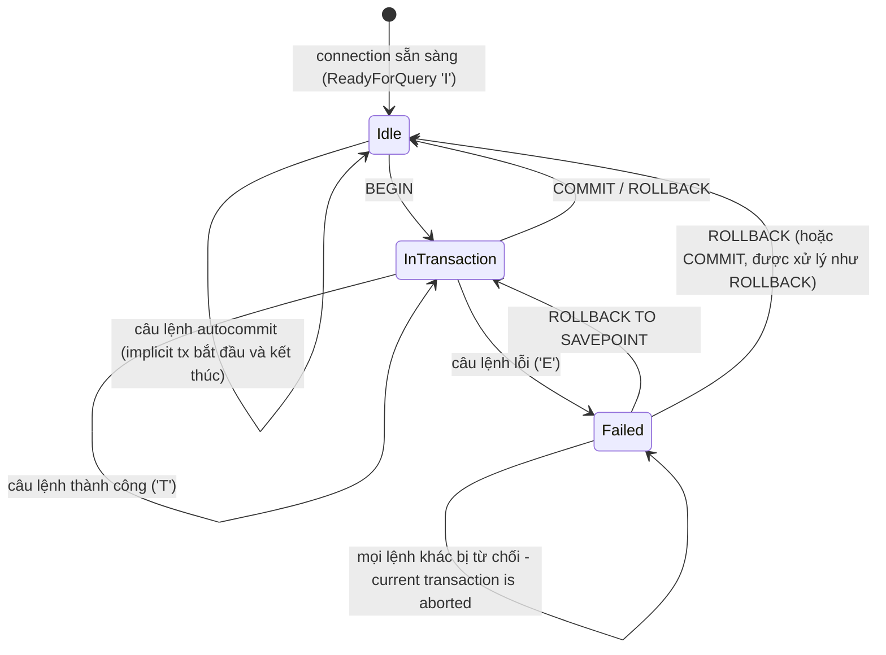
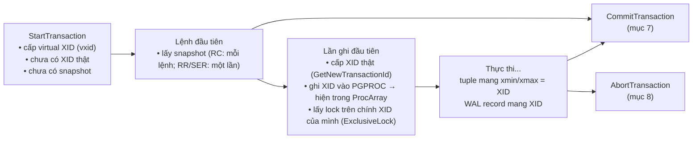
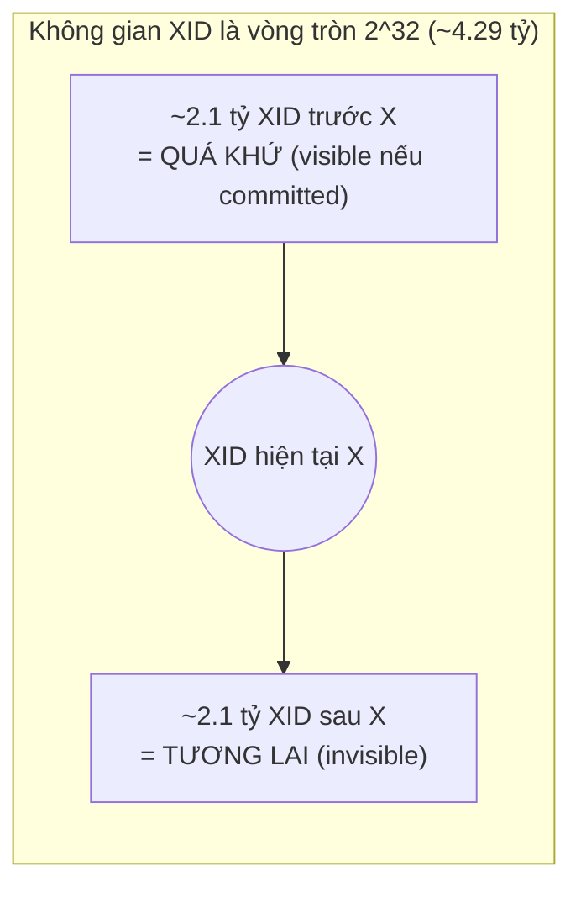
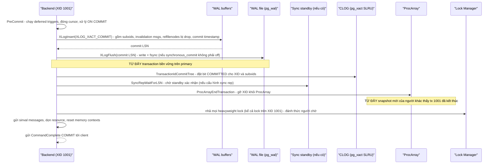

# PART 9 — TRANSACTION

> **Trước:** [08 — Memory & Buffer Cache](08-memory-buffer-cache.md) · **Tiếp:** [10 — ACID](10-acid.md)
> **Độ ưu tiên:** Rất cao. Transaction là "đơn vị công việc" mà MVCC, lock, WAL, replication đều xoay quanh.

---

## Mục lục

1. [Simple mental model](#1-simple-mental-model)
2. [Concept: Transaction](#2-concept-transaction)
3. [BEGIN, COMMIT, ROLLBACK, Autocommit, Implicit transaction](#3-begin-commit-rollback-autocommit)
4. [Transaction lifecycle (state machine)](#4-transaction-lifecycle)
5. [Concept: Transaction ID (XID)](#5-concept-transaction-id-xid)
6. [Concept: Transaction status — CLOG (pg_xact)](#6-concept-transaction-status--clog)
7. [COMMIT từ bên trong: thứ tự chính xác](#7-commit-từ-bên-trong)
8. [ROLLBACK/ABORT từ bên trong](#8-rollback-từ-bên-trong)
9. [Command ID: visibility bên trong cùng một transaction](#9-command-id)
10. [Concept: Savepoint & Subtransaction](#10-concept-savepoint--subtransaction)
11. [Transaction visibility (cầu nối sang MVCC)](#11-transaction-visibility)
12. [Two-Phase Commit (PREPARE TRANSACTION)](#12-two-phase-commit)
13. [What happens if...](#13-what-happens-if)
14. [Performance impact & Production behavior](#14-performance-impact--production-behavior)
15. [Common misunderstandings](#15-common-misunderstandings)
16. [Interview Questions](#16-interview-questions)
17. [Key Takeaways](#17-key-takeaways)

---

## 1. Simple mental model

Transaction giống một **phiên giao dịch tại quầy ngân hàng có biên lai**:

- Nhân viên mở phiên (**BEGIN**), nhận số phiếu (**XID**) khi bắt đầu thực sự thay đổi sổ sách.
- Mọi thay đổi được ghi bằng **mực chì mang số phiếu** — người khác nhìn vào sổ thấy dòng chì và biết "phiếu này chưa chốt, bỏ qua".
- **COMMIT**: nhân viên ghi vào **sổ nhật ký chống cháy** (WAL, fsync) "phiếu 1001 đã chốt", rồi đánh dấu trong **bảng trạng thái phiếu** (CLOG). Ngay lập tức, mọi dòng chì mang số 1001 trở thành "mực thật" trong mắt mọi người mới đến — **không cần tô lại từng dòng**.
- **ROLLBACK**: đánh dấu trong bảng trạng thái "phiếu 1001 hủy". Mọi dòng chì 1001 trở thành vô nghĩa — cũng không cần tẩy từng dòng.

Điểm then chốt: **commit/rollback là thay đổi trạng thái của một con số (XID), không phải thay đổi từng row.** Đây là lý do commit và rollback trong PostgreSQL có chi phí gần như cố định.

---

## 2. Concept: Transaction

### 2.1 WHAT

**Transaction** là một chuỗi thao tác đọc/ghi được database đối xử như **một đơn vị logic duy nhất**: hoặc mọi thay đổi có hiệu lực (commit), hoặc không thay đổi nào có hiệu lực (abort); và trong lúc chạy, nó được cô lập khỏi các transaction khác ở mức độ do isolation level quy định.

### 2.2 WHY

Nghiệp vụ thực tế hiếm khi là một thao tác đơn lẻ:

```sql
BEGIN;
UPDATE accounts SET balance = balance - 100 WHERE id = 'A';
UPDATE accounts SET balance = balance + 100 WHERE id = 'B';
INSERT INTO transfers (from_id, to_id, amount) VALUES ('A', 'B', 100);
COMMIT;
```

Không có transaction:
- **Crash giữa chừng** (sau lệnh 1, trước lệnh 2) → tiền biến mất.
- **Lỗi logic giữa chừng** (lệnh 2 vi phạm constraint) → trạng thái nửa vời.
- **Người khác đọc giữa chừng** → thấy tổng tiền hệ thống thiếu 100.
- **Hai người cùng chuyển từ A** → cả hai đọc balance = 150, cả hai trừ 100 → âm.

Transaction biến các vấn đề đó thành đảm bảo có tên: Atomicity, Consistency, Isolation, Durability ([Chương 10](10-acid.md)).

### 2.3 HOW (tổng quan) — PostgreSQL hiện thực transaction bằng các mảnh ghép

| Đảm bảo | Cơ chế chính | Chương |
|---|---|---|
| Nhận diện thay đổi thuộc về ai | **XID** ghi vào `xmin`/`xmax` của tuple | [06](06-storage-internals.md), mục 5 |
| Commit/abort "một phát ăn ngay" | **CLOG** (2 bit/XID) + ProcArray | mục 6, 7 |
| Không mất khi crash | **WAL** + fsync commit record | [20](20-wal.md) |
| Ai thấy gì | **Snapshot** + visibility rules (MVCC) | [11](11-mvcc.md) |
| Chống ghi đè lẫn nhau | **Row lock** (trong xmax) + **heavyweight lock** trên XID | [13](13-locking.md) |
| Rollback một phần | **Subtransaction** (savepoint) | mục 10 |

---

## 3. BEGIN, COMMIT, ROLLBACK, Autocommit

### 3.1 Các lệnh

| Lệnh | Ý nghĩa |
|---|---|
| `BEGIN` / `START TRANSACTION [ISOLATION LEVEL ...] [READ ONLY] [DEFERRABLE]` | Mở **transaction block** tường minh. |
| `COMMIT` / `END` | Kết thúc và áp dụng. Nếu transaction đang ở trạng thái lỗi, `COMMIT` thực chất là **ROLLBACK** (PostgreSQL báo `ROLLBACK`). |
| `ROLLBACK` / `ABORT` | Hủy toàn bộ. |
| `SAVEPOINT name` / `ROLLBACK TO SAVEPOINT name` / `RELEASE SAVEPOINT name` | Subtransaction (mục 10). |
| `COMMIT AND CHAIN` / `ROLLBACK AND CHAIN` (PG 12) | Kết thúc và mở ngay transaction mới cùng đặc tính. |

### 3.2 Autocommit và implicit transaction

PostgreSQL **không có chế độ "không transaction"**. Mọi câu lệnh đều chạy trong một transaction:
- Nếu không có `BEGIN`, mỗi câu lệnh chạy trong một **implicit transaction** tự commit khi câu lệnh thành công (hoặc rollback khi lỗi). Đây là cái mà driver/psql gọi là **autocommit**.
- Trong **Simple Query protocol**, một chuỗi nhiều câu lệnh gửi trong **một message** (`UPDATE ...; UPDATE ...;`) chạy trong **một** implicit transaction (trừ khi chuỗi chứa BEGIN/COMMIT tường minh) — lỗi ở câu thứ hai rollback cả câu thứ nhất.
- Trong **Extended protocol**, implicit transaction kéo dài tới message `Sync`.

**Hệ quả:** Autocommit từng câu = mỗi câu một commit = **mỗi câu một lần fsync WAL**. Chèn 10.000 row bằng 10.000 câu INSERT autocommit tốn 10.000 fsync; bọc trong một transaction chỉ tốn 1.

### 3.3 Autocommit trong driver

Autocommit thực chất được điều khiển ở **phía client**: driver quyết định có gửi `BEGIN` hay không. JDBC `setAutoCommit(false)` → driver tự gửi `BEGIN` trước câu lệnh đầu. ORM/framework (Spring `@Transactional`, Go `db.BeginTx`) cũng vậy. Hiểu điều này giúp debug "tại sao connection ở trạng thái `idle in transaction`": application đã mở transaction (gửi BEGIN) rồi quên commit, hoặc làm việc khác (gọi HTTP bên ngoài) trong khi transaction còn mở.

---

## 4. Transaction lifecycle

### 4.1 State machine (góc nhìn client)



**Cách đọc diagram:**
1. `I`, `T`, `E` là **transaction status indicator** trong message `ReadyForQuery` mà server gửi sau mỗi lệnh ([Chương 04](04-postgresql-architecture.md#51-sequence-từ-tcp-connect-tới-readyforquery)).
2. Khi một lệnh lỗi trong transaction block, transaction chuyển sang **Failed**: PostgreSQL không cho chạy tiếp (`ERROR: current transaction is aborted, commands ignored until end of transaction block`). Đây là khác biệt với một số database cho phép "bỏ qua lỗi và đi tiếp". Muốn tiếp tục sau lỗi, phải dùng savepoint.
3. Từ Failed, chỉ có `ROLLBACK` (về Idle) hoặc `ROLLBACK TO SAVEPOINT` (về trạng thái trước savepoint).

### 4.2 Lifecycle bên trong (góc nhìn server)



**Cách đọc diagram:**
- Một transaction **chỉ đọc** không bao giờ đi qua bước "cấp XID thật"; nó chỉ có **virtual transaction ID** `backendID/localXID` (ví dụ `3/1542`), không tốn gì trong không gian XID toàn cục, không ghi commit record vào WAL. Đây là tối ưu quan trọng: phần lớn transaction của hệ thống web là read-only.
- Khi được cấp XID, transaction lấy một **ExclusiveLock trên chính XID của nó** trong lock manager. Transaction khác muốn chờ nó kết thúc (ví dụ để update cùng row) sẽ xin **ShareLock trên XID đó** → bị chặn cho tới khi transaction kết thúc và nhả lock. Đây là cơ chế "chờ transaction" (`wait_event = transactionid`).

---

## 5. Concept: Transaction ID (XID)

### 5.1 WHAT

**XID** là số nguyên **32-bit không dấu** tăng dần, cấp cho mỗi transaction (và subtransaction) có ghi dữ liệu. XID đặc biệt:

| XID | Tên | Ý nghĩa |
|---|---|---|
| 0 | `InvalidTransactionId` | "Không có" (vd xmax = 0 nghĩa là chưa bị xóa) |
| 1 | `BootstrapTransactionId` | Dùng khi initdb |
| 2 | `FrozenTransactionId` | "Cũ hơn mọi transaction" — luôn visible |
| ≥ 3 | Normal XID | |

### 5.2 WHY — Tại sao lại là 32-bit?

XID nằm trong **header mỗi tuple** (xmin, xmax). Tăng lên 64-bit = thêm 8 byte mỗi tuple — với hàng tỷ tuple là hàng chục GB và giảm mật độ page. Lựa chọn 32-bit tiết kiệm chỗ nhưng tạo ra vấn đề **wraparound**.

### 5.3 HOW — So sánh XID theo vòng tròn (modulo 2³²)

Vì XID quay vòng, PostgreSQL không so sánh XID bằng `<` thông thường mà bằng **số học modulo 2³²**: với một XID bất kỳ, **2³¹ XID "phía sau" nó được coi là quá khứ, 2³¹ XID "phía trước" là tương lai** (`TransactionIdPrecedes` tính hiệu có dấu 32-bit).



**Cách đọc diagram:** Một tuple có `xmin = 100` là "quá khứ" chừng nào XID hiện tại còn cách nó dưới 2³¹. Nếu hệ thống tiêu thêm hơn ~2.1 tỷ XID mà tuple đó chưa được **freeze**, xmin 100 đột nhiên rơi vào nửa "tương lai" → tuple **biến mất** (invisible) — dữ liệu cũ "mất" dù vẫn nằm trên disk. Đây là **transaction ID wraparound**. PostgreSQL phòng chống bằng **freezing** (VACUUM đánh dấu tuple cũ là "frozen" — luôn visible, không phụ thuộc so sánh XID) và sẽ **từ chối cấp XID mới** khi tiến quá gần giới hạn. Chi tiết: [Chương 23](23-vacuum.md).

### 5.4 INTERNALS — FullTransactionId và epoch

Bên trong, PostgreSQL theo dõi **FullTransactionId 64-bit** = `(epoch << 32) | xid` cho các mục đích không nằm trên tuple (ví dụ `pg_current_xact_id()` từ PG 13 trả `xid8`). Nhưng tuple vẫn chỉ lưu 32 bit.

### 5.5 Quan sát

```sql
SELECT pg_current_xact_id_if_assigned();  -- NULL nếu transaction chưa được cấp XID
SELECT pg_current_xact_id();              -- CẤP XID nếu chưa có (có side effect!)
SELECT age(datfrozenxid), datname FROM pg_database;  -- tuổi XID cũ nhất chưa freeze
```

Lưu ý: gọi `txid_current()`/`pg_current_xact_id()` chỉ để "xem" **tiêu thụ một XID** — nếu làm trong mọi request thì đẩy nhanh tốc độ tiến tới wraparound.

---

## 6. Concept: Transaction status — CLOG

### 6.1 WHAT

**CLOG (Commit Log)**, thư mục `pg_xact/` (trước PG 10 tên `pg_clog`), lưu **2 bit trạng thái cho mỗi XID**:

| Bit | Trạng thái |
|---|---|
| `00` | IN_PROGRESS (hoặc chưa biết — transaction chưa kết thúc, hoặc crash trước khi kết thúc) |
| `01` | COMMITTED |
| `10` | ABORTED |
| `11` | SUB_COMMITTED (trạng thái trung gian khi commit cây subtransaction trải trên nhiều page CLOG) |

Một page CLOG 8KB = 32.768 XID. Được cache trong **SLRU buffers** (Simple LRU) trong shared memory; PG 17 cho phép cấu hình kích thước (`transaction_buffers`).

### 6.2 WHY

Đây là **nguồn sự thật** về việc một XID đã commit hay chưa — thứ MVCC cần cho mọi visibility check. Nó cực kỳ nhỏ gọn (1 tỷ transaction ≈ 256MB) và được WAL-protect (commit record trong WAL; khi recovery, CLOG được cập nhật lại từ WAL).

### 6.3 Hint bits giảm tải cho CLOG

Như ở [Chương 06 §5.3](06-storage-internals.md#53-internals--hint-bits-tại-sao-select-có-thể-ghi-disk): sau lần đầu tra CLOG, kết quả được ghi thành hint bit trong tuple. CLOG cũ được **truncate** khi mọi tuple tham chiếu các XID đó đã được freeze (datfrozenxid tiến lên).

### 6.4 CLOG không đủ — cần ProcArray

CLOG nói "đã commit chưa", nhưng MVCC cần câu hỏi tinh tế hơn: "**tại thời điểm snapshot của tôi**, transaction đó đã commit chưa?". Cho câu hỏi đó, PostgreSQL dùng **snapshot** — được chụp từ **ProcArray** (danh sách transaction đang chạy). Mục 7 giải thích thứ tự cập nhật CLOG và ProcArray để hai nguồn này không mâu thuẫn.

---

## 7. COMMIT từ bên trong

### 7.1 Sequence



**Cách đọc diagram (trên xuống), và tại sao thứ tự này quan trọng:**

1. **Pre-commit**: các việc có thể lỗi (deferred constraint trigger, FK deferred) phải chạy **trước** khi ghi commit record — vì sau điểm đó không được phép lỗi nữa.
2. **Commit record vào WAL** rồi **flush**. Đây là **điểm commit thực sự (durability point)**: nếu crash sau bước này, recovery sẽ replay commit record → transaction được coi là committed. Nếu crash trước → transaction coi như chưa từng commit.
3. **CLOG**: đặt bit committed.
4. **Sync replication wait** (nếu có): transaction đã commit cục bộ và *bền vững* trên primary nhưng **chưa visible** với người khác (vì vẫn trong ProcArray). Nếu client hủy lúc đang chờ, PostgreSQL cảnh báo: `WARNING: canceling wait for synchronous replication... The transaction has already committed locally, but might not have been replicated to the standby.`
5. **Gỡ khỏi ProcArray**: đây là **visibility point** — snapshot chụp sau thời điểm này sẽ không liệt kê 1001 là đang chạy → thấy thay đổi của nó.
6. **Nhả lock**: transaction đang chờ row lock của 1001 (chờ trên lock XID 1001) được đánh thức.

**Tại sao CLOG trước ProcArray?** Một backend khác kiểm tra visibility theo thứ tự: "XID có trong snapshot (danh sách đang chạy) không? — nếu không, tra CLOG". Nếu gỡ khỏi ProcArray *trước* khi CLOG được đặt, sẽ có khoảnh khắc XID không còn "đang chạy" nhưng CLOG vẫn nói IN_PROGRESS → backend kia hiểu sai (coi như aborted). Thứ tự CLOG → ProcArray loại trừ khe hở đó.

### 7.2 Commit tốn bao nhiêu?

Chi phí chủ yếu = **một lần fsync WAL** (nếu WAL chưa được flush tới LSN đó bởi ai khác). Trên NVMe có power-loss protection: vài chục micro giây; trên cloud block storage: 0.5–2ms+. Đó là giới hạn trên của commit/giây cho **một** connection tuần tự. Nhiều connection đồng thời được hưởng **group commit**: một lần fsync có thể flush commit record của nhiều transaction (backend thấy WAL đã được người khác flush vượt quá LSN của mình thì không cần fsync). `commit_delay`/`commit_siblings` cố ý chờ một chút để gom thêm.

### 7.3 `synchronous_commit`

| Giá trị | Chờ gì trước khi báo COMMIT cho client | Rủi ro |
|---|---|---|
| `off` | **Không chờ** flush WAL (walwriter flush sau, tối đa ~3× `wal_writer_delay`) | Crash → mất vài trăm ms transaction gần nhất đã "commit". **Không** gây hỏng dữ liệu/không nhất quán — chỉ như thể các transaction đó chưa từng xảy ra. |
| `local` | Flush WAL cục bộ | Không chờ standby |
| `remote_write` | Local flush + standby đã **ghi** WAL vào OS (chưa fsync) | Mất nếu primary chết và standby mất điện cùng lúc |
| `on` (mặc định) | Local flush + (nếu có sync standby) standby đã **flush** | |
| `remote_apply` | Local flush + standby đã **replay** (thấy được khi query standby) | Latency cao nhất; cho read-your-writes trên standby |

Có thể đặt theo **từng transaction**: `SET LOCAL synchronous_commit = off` cho dữ liệu kém quan trọng (log, analytics event) để giảm latency mà không ảnh hưởng transaction tiền bạc. Chi tiết [Chương 27](27-sync-async-replication.md).

---

## 8. ROLLBACK từ bên trong

1. Ghi WAL record `XLOG_XACT_ABORT` (**không cần flush**: nếu crash mất record này, transaction không có commit record → vẫn được coi là aborted).
2. Đặt CLOG = ABORTED cho XID và mọi subxid.
3. Gỡ khỏi ProcArray, nhả lock, dọn memory, đóng file tạm, hủy relation vừa tạo (file của table tạo trong transaction bị xóa).
4. **Không** động vào bất kỳ tuple nào đã ghi. Chúng trở thành dead tuple (xmin aborted), chờ pruning/VACUUM.

Hệ quả: rollback **O(1)** về thời gian nhưng để lại **dead tuple O(số row đã ghi)**. Một job insert 50 triệu row rồi lỗi ở cuối → rollback tức thì nhưng table có 50 triệu dead tuple chiếm chỗ.

---

## 9. Command ID

### 9.1 WHAT & WHY

Bên trong một transaction, các câu lệnh sau phải thấy thay đổi của câu lệnh trước, nhưng **một câu lệnh không được thấy thay đổi do chính nó tạo ra** trong lúc đang chạy. Ví dụ kinh điển:

```sql
UPDATE t SET x = x + 1;          -- nếu scan thấy cả tuple mới do chính nó vừa tạo,
                                 -- nó sẽ update lại tuple mới → vòng lặp vô hạn (Halloween problem)
INSERT INTO t SELECT * FROM t;   -- tương tự: không được đọc row vừa insert
```

**Command ID (CID)** là bộ đếm 32-bit trong transaction, tăng sau mỗi câu lệnh có ghi dữ liệu. Tuple ghi nhận `cmin` (CID tạo) / `cmax` (CID xóa) trong trường `t_cid`. Snapshot của câu lệnh có `curcid`; tuple do chính transaction tạo chỉ visible nếu `cmin < curcid`.

### 9.2 Combo CID

Nếu cùng transaction vừa tạo vừa xóa một tuple, cần cả cmin và cmax nhưng header chỉ có một trường 4 byte → PostgreSQL dùng **combo command ID**: một số đại diện cho cặp (cmin, cmax), ánh xạ lưu trong memory của backend (không cần lưu lâu dài vì chỉ transaction đó quan tâm).

### 9.3 Giới hạn

Tối đa 2³² − 1 command mỗi transaction (`ERROR: cannot have more than 2^32-2 commands in a transaction`) — chỉ gặp với vòng lặp PL/pgSQL cực dài.

---

## 10. Concept: Savepoint & Subtransaction

### 10.1 WHAT

**Savepoint** đánh dấu một điểm trong transaction mà ta có thể rollback về mà không hủy toàn bộ transaction. PostgreSQL hiện thực savepoint bằng **subtransaction**.

```sql
BEGIN;
INSERT INTO orders ...;
SAVEPOINT before_optional;
INSERT INTO promo_usage ...;      -- có thể lỗi unique
-- nếu lỗi:
ROLLBACK TO SAVEPOINT before_optional;  -- hủy INSERT promo, giữ INSERT orders
COMMIT;
```

**Subtransaction ẩn:** Khối `BEGIN ... EXCEPTION WHEN ... END` trong PL/pgSQL **tạo một subtransaction mỗi lần vào khối** (để có thể rollback phần trong khối khi bắt exception). Một số driver/ORM tự dùng savepoint cho mỗi câu lệnh (ví dụ JDBC `autosave=always`, một số cấu hình Django/Rails khi dùng nested transaction).

### 10.2 HOW / INTERNALS

- Mỗi subtransaction **có ghi dữ liệu** được cấp **XID riêng** (subxid). Tuple do nó ghi mang xmin = subxid.
- **`pg_subtrans`** (SLRU) lưu **parent XID** của mỗi subxid → cho phép từ subxid tìm ra transaction cha.
- **Rollback to savepoint**: đánh dấu subxid là ABORTED trong CLOG → mọi tuple nó ghi trở thành invisible; nhả lock nó đã lấy (lock lấy trong subtransaction được nhả).
- **Commit transaction cha**: mọi subxid chưa abort được đánh dấu COMMITTED **nguyên tử cùng** cha (qua trạng thái SUB_COMMITTED trung gian nếu trải nhiều page CLOG).
- **ProcArray cache subxid:** mỗi PGPROC có chỗ cache tối đa **64 subxid** (`PGPROC_MAX_CACHED_SUBXIDS`). Snapshot chụp danh sách XID đang chạy bao gồm cả subxid đã cache.

### 10.3 WHAT HAPPENS IF — Subtransaction overflow

Nếu một transaction có **hơn 64 subxid** (ví dụ vòng lặp PL/pgSQL 1000 lần, mỗi lần có khối EXCEPTION và có ghi dữ liệu), cache **tràn (overflow)**. Khi đó:
- Snapshot của *mọi* backend khác bị đánh dấu **suboverflowed**: danh sách XID đang chạy không còn đầy đủ.
- Khi kiểm tra visibility của một XID không có trong danh sách, backend phải tra **`pg_subtrans`** để tìm XID cha rồi mới so với snapshot.
- `pg_subtrans` là SLRU nhỏ → dưới tải cao, hàng trăm backend cùng tra → contention nặng trên LWLock `SubtransSLRU` (tên wait event thay đổi theo version) → **throughput sụp đổ toàn hệ thống**, đặc biệt trên **standby** (nơi thông tin subxid đến qua WAL và thường bị overflow).

Đây là một sự cố production kinh điển (GitLab đã mô tả chi tiết năm 2021). Kết luận: **tránh dùng savepoint/khối EXCEPTION trong vòng lặp nóng; tránh driver tự tạo savepoint cho mỗi câu; giữ subtransaction ≤ 64 mỗi transaction.**

### 10.4 TRADE-OFF

| Lợi ích | Chi phí |
|---|---|
| Xử lý lỗi cục bộ mà không hủy cả transaction | Mỗi subxid có ghi tiêu thụ một XID (đẩy nhanh wraparound) |
| Cần thiết cho EXCEPTION trong PL/pgSQL | Overflow > 64 → contention toàn cục |
| | Mỗi savepoint có overhead (resource owner, memory context) |

---

## 11. Transaction visibility

Câu hỏi "transaction T có thấy thay đổi của transaction X không?" được trả lời bằng **snapshot** của T:

- Snapshot = `(xmin, xmax, xip[])`: mọi XID < `xmin` đã kết thúc; mọi XID ≥ `xmax` chưa bắt đầu tại thời điểm chụp; `xip[]` là danh sách XID đang chạy trong khoảng giữa.
- X "đã commit theo snapshot của T" ⇔ X < snapshot.xmax **và** X không nằm trong xip[] **và** CLOG nói X committed.

**Read Committed** chụp snapshot mới mỗi câu lệnh; **Repeatable Read/Serializable** chụp một lần ở câu lệnh đầu tiên (không phải lúc `BEGIN`!). Toàn bộ quy tắc ở [Chương 11 — MVCC](11-mvcc.md).

---

## 12. Two-Phase Commit

### 12.1 WHAT

`PREPARE TRANSACTION 'gid'` chuyển transaction hiện tại sang trạng thái **prepared**: mọi thay đổi và lock được lưu bền vững (WAL + `pg_twophase/`), session được tách khỏi transaction. Sau đó, **bất kỳ session nào** có thể `COMMIT PREPARED 'gid'` hoặc `ROLLBACK PREPARED 'gid'` — kể cả sau khi server restart.

### 12.2 WHY

Để làm **participant** trong giao thức 2PC do một **transaction manager bên ngoài** điều phối (XA, Citus, `postgres_fdw` với 2PC, hệ phân tán). Xem [Chương 39](39-distributed-database.md).

### 12.3 WHAT HAPPENS IF — Prepared transaction bị bỏ quên

Mặc định `max_prepared_transactions = 0` (tắt) — có lý do. Một prepared transaction bị bỏ quên (coordinator chết, bug):
- **giữ lock** vô thời hạn → chặn DDL, chặn row;
- **giữ xmin horizon** → VACUUM không dọn được dead tuple ở *mọi* table → bloat toàn cluster;
- tiến tới **XID wraparound** nếu kéo dài đủ lâu.

Nó sống sót qua restart. Kiểm tra `pg_prepared_xacts`. Đây là một nguồn "vacuum không dọn được gì" hay bị bỏ sót khi chẩn đoán.

---

## 13. What happens if...

| Tình huống | Hành vi |
|---|---|
| **Client crash / mất mạng giữa transaction** | Backend phát hiện khi đọc socket (EOF) hoặc TCP keepalive hết hạn → abort transaction, nhả lock. Nếu mạng "treo" mà không đóng socket, backend có thể ngồi `idle in transaction` rất lâu cho tới khi keepalive (`tcp_keepalives_*`) hoặc `idle_in_transaction_session_timeout` kích hoạt. |
| **Server crash giữa transaction** | Transaction không có commit record trong WAL → sau recovery coi như aborted. Tuple của nó là dead. |
| **Server crash sau khi commit record flush nhưng trước khi báo client** | Transaction **đã commit**. Client không nhận được phản hồi → không biết. Application phải có cơ chế **idempotency** (ví dụ idempotency key) để retry an toàn — không thể phân biệt "commit rồi" và "chưa commit" chỉ từ phía client. |
| **Lỗi trong transaction block** | Transaction vào trạng thái aborted; mọi lệnh bị từ chối tới khi ROLLBACK. |
| **Transaction chạy hàng giờ** | Giữ snapshot → giữ xmin horizon → VACUUM toàn cluster không dọn được tuple chết sau thời điểm đó → bloat; giữ lock → chặn DDL; nếu có XID thì XID của nó giữ tuổi datfrozenxid. [Chương 40, Scenario 14](40-production-behavior.md). |
| **`idle in transaction`** | Như trên nhưng tệ hơn vì không làm gì cả. Đặt `idle_in_transaction_session_timeout`. PG 17 thêm `transaction_timeout` giới hạn tổng thời gian transaction. |
| **Hai transaction cùng sửa một row** | Người sau chờ lock XID của người trước. [Chương 13](13-locking.md). |

---

## 14. Performance impact & Production behavior

1. **Commit = fsync.** Batching (nhiều thao tác mỗi transaction) giảm số fsync. Nhưng transaction quá lớn giữ lock lâu, dead tuple nhiều khi rollback, WAL lớn một cục → cân bằng (thường vài trăm đến vài nghìn row/transaction cho job batch).
2. **Transaction ngắn là nguyên tắc vàng:** không gọi network bên ngoài (HTTP, message queue) trong khi transaction đang mở.
3. **Read-only transaction không tốn XID** — nhưng vẫn giữ snapshot (ảnh hưởng vacuum) nếu kéo dài.
4. **Quan sát:**
   ```sql
   SELECT pid, state, xact_start, now() - xact_start AS xact_age,
          backend_xid, backend_xmin, wait_event_type, wait_event, left(query, 80)
   FROM pg_stat_activity
   WHERE xact_start IS NOT NULL
   ORDER BY xact_start;
   ```
   `backend_xmin` cũ nhất là thủ phạm giữ xmin horizon.
5. **`pg_stat_database.xact_commit / xact_rollback`**: tỉ lệ rollback cao bất thường là dấu hiệu bug application hoặc serialization failure.

---

## 15. Common misunderstandings

1. **"BEGIN chụp snapshot."** — Không. Ở RR/Serializable, snapshot chụp ở **câu lệnh đầu tiên** sau BEGIN.
2. **"Mọi transaction đều có XID."** — Chỉ transaction có ghi. Read-only chỉ có virtual XID.
3. **"Rollback phải hoàn tác từng row."** — Không, chỉ đổi trạng thái XID.
4. **"Không có BEGIN thì không có transaction."** — Mỗi câu lệnh là một implicit transaction.
5. **"COMMIT trong transaction lỗi sẽ commit phần đã chạy thành công."** — COMMIT trên transaction aborted = ROLLBACK.
6. **"Savepoint miễn phí."** — Tiêu thụ XID, overhead, và nguy cơ subtransaction overflow.
7. **"`synchronous_commit = off` có thể làm hỏng database."** — Không; chỉ có thể mất các transaction gần nhất, database vẫn nhất quán.

---

## 16. Interview Questions

**Q1. Chuyện gì xảy ra khi COMMIT?**
- *Short:* Chạy deferred triggers, ghi commit record vào WAL và fsync, đặt CLOG committed, (chờ sync standby), gỡ khỏi ProcArray (visible), nhả lock.
- *Deep:* Giải thích durability point vs visibility point, lý do thứ tự CLOG trước ProcArray, group commit, synchronous_commit levels.
- *Follow-up:* Nếu crash sau fsync nhưng trước khi client nhận OK? (Đã commit — cần idempotency.)

**Q2. Tại sao XID là 32-bit và hệ quả là gì?**
- *Short:* Tiết kiệm chỗ trong tuple header; hệ quả là wraparound → cần freeze bằng VACUUM.

**Q3. Transaction read-only có XID không?**
- *Short:* Không, chỉ có virtual XID; XID cấp lười ở lần ghi đầu tiên.

**Q4. Savepoint hoạt động thế nào? Rủi ro?**
- *Short:* Subtransaction với subxid riêng, pg_subtrans lưu cha; >64 subxid → snapshot overflow → contention SubtransSLRU.

**Q5. `idle in transaction` nguy hiểm thế nào?**
- *Short:* Giữ lock và snapshot → chặn DDL, chặn VACUUM toàn cluster → bloat.

**Q6. Tại sao ROLLBACK nhanh mà hậu quả vẫn tốn kém?**
- *Short:* O(1) nhờ CLOG, nhưng để lại dead tuple phải VACUUM.

**Q7. (Senior) Làm sao đảm bảo "exactly-once" cho API chuyển tiền khi client có thể timeout sau khi server đã commit?**
- *Short:* Idempotency key lưu trong cùng transaction với thay đổi (unique constraint); retry với cùng key trả kết quả cũ.

---

## 17. Key Takeaways

1. Mọi câu lệnh chạy trong transaction; autocommit = implicit transaction mỗi câu.
2. XID 32-bit, **cấp lười** khi ghi; read-only chỉ có virtual XID.
3. **CLOG** (2 bit/XID) là nguồn sự thật commit/abort; **hint bits** cache nó trong tuple; **ProcArray** + snapshot quyết định "đã commit *theo góc nhìn của tôi*".
4. COMMIT: WAL commit record + **fsync** (durability point) → CLOG → (sync rep wait) → gỡ ProcArray (**visibility point**) → nhả lock.
5. ROLLBACK: O(1), đánh dấu aborted, để lại dead tuple.
6. **Command ID** giải quyết visibility bên trong một transaction (Halloween problem).
7. Savepoint = subtransaction; tránh > 64 subxid/transaction.
8. Prepared transaction bị bỏ quên và `idle in transaction` là kẻ giữ xmin horizon nguy hiểm.

---

## Nguồn tham khảo

- PostgreSQL Docs — *Transactions* tutorial, *BEGIN*, *SAVEPOINT*, *PREPARE TRANSACTION*: https://www.postgresql.org/docs/current/tutorial-transactions.html
- PostgreSQL Docs — *Transaction Processing* (internals chapter): https://www.postgresql.org/docs/current/transactions.html
- PostgreSQL Docs — *Asynchronous Commit*: https://www.postgresql.org/docs/current/wal-async-commit.html
- PostgreSQL source: `src/backend/access/transam/README`, `xact.c`, `clog.c`, `subtrans.c`, `procarray.c`.
- GitLab Engineering, *Why we spent the last month eliminating PostgreSQL subtransactions* (2021).
