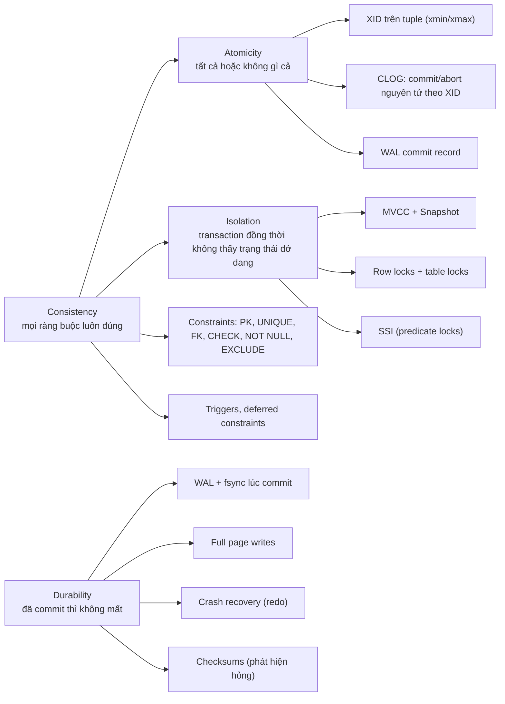
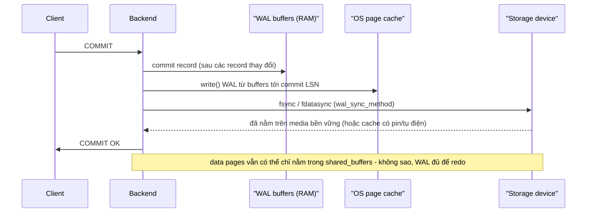
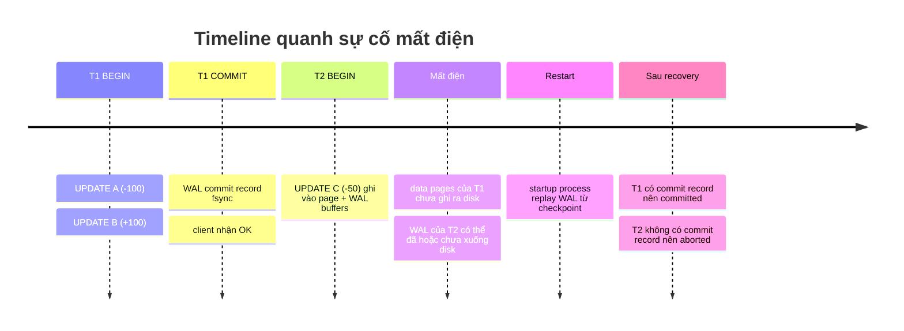

# PART 10 — ACID

> **Trước:** [09 — Transaction](09-transaction.md) · **Tiếp:** [11 — MVCC](11-mvcc.md)

ACID thường được dạy như bốn định nghĩa. Chương này làm ngược lại: với mỗi chữ cái, ta hỏi **PostgreSQL dùng cơ chế vật lý nào để đảm bảo nó**, **điều gì có thể phá vỡ đảm bảo đó**, và **đảm bảo đó *không* bao gồm những gì** (vì phần lớn sự cố xuất phát từ việc tin rằng ACID đảm bảo nhiều hơn thực tế).

---

## Mục lục

1. [Bản đồ ACID → cơ chế PostgreSQL](#1-bản-đồ-acid--cơ-chế-postgresql)
2. [Atomicity](#2-atomicity)
3. [Consistency](#3-consistency)
4. [Isolation](#4-isolation)
5. [Durability](#5-durability)
6. [ACID xuyên suốt một kịch bản crash](#6-acid-xuyên-suốt-một-kịch-bản-crash)
7. [Cấu hình có thể làm yếu ACID](#7-cấu-hình-có-thể-làm-yếu-acid)
8. [ACID trong hệ có replica](#8-acid-trong-hệ-có-replica)
9. [So sánh: ACID của MongoDB, Redis, InnoDB](#9-so-sánh)
10. [Common misunderstandings](#10-common-misunderstandings)
11. [Interview Questions](#11-interview-questions)
12. [Key Takeaways](#12-key-takeaways)

---

## 1. Bản đồ ACID → cơ chế PostgreSQL



**Cách đọc diagram (trái sang phải):** Mỗi thuộc tính ACID được đảm bảo bởi một nhóm cơ chế. Chú ý **Consistency phụ thuộc vào ba chữ còn lại**: constraint chỉ có ý nghĩa nếu transaction được áp dụng trọn vẹn (A), không bị xen ngang sai (I), và không mất sau crash (D).

---

## 2. Atomicity

### 2.1 WHAT

Mọi thay đổi của một transaction **cùng có hiệu lực hoặc cùng không có hiệu lực** — kể cả khi có lỗi, rollback tường minh, hay crash.

### 2.2 WHY

Nếu không có, mọi thao tác nhiều bước (chuyển tiền, tạo đơn hàng + trừ kho) phải tự viết logic bù trừ cho mọi điểm thất bại khả dĩ — và vẫn không xử lý được crash.

### 2.3 HOW — PostgreSQL đảm bảo Atomicity thế nào

PostgreSQL **không** làm atomicity bằng cách "ghi tất cả hoặc không ghi gì" ở mức page. Nó ghi thay đổi **ngay** vào page (và WAL) trong lúc transaction chạy, nhưng **gắn mọi thay đổi với XID**, và biến quyết định commit/abort thành **một thao tác nguyên tử duy nhất trên XID**:

1. Mọi tuple được tạo mang `xmin = XID`; mọi tuple bị xóa/thay mang `xmax = XID`.
2. Visibility của **tất cả** các tuple đó phụ thuộc duy nhất vào **trạng thái của XID**.
3. Trạng thái XID chuyển từ "đang chạy" sang "đã commit" tại **một điểm duy nhất**: commit record được flush vào WAL (bền vững) và CLOG được đặt (trong memory).
4. Trước điểm đó: mọi thay đổi invisible với người khác. Sau điểm đó: tất cả visible. **Không có trạng thái "một nửa".**

Với subtransaction: commit transaction cha đánh dấu mọi subxid committed **nguyên tử** (dùng trạng thái SUB_COMMITTED làm bước trung gian khi các subxid nằm trên nhiều page CLOG — để không có khoảnh khắc một số subxid committed còn cha chưa).

### 2.4 INTERNALS — Tại sao không cần undo?

Hệ thống như InnoDB/Oracle ghi đè dữ liệu tại chỗ, nên atomicity cần **undo log** để khôi phục giá trị cũ khi rollback hoặc sau crash. PostgreSQL **không ghi đè** — giá trị cũ vẫn nằm nguyên trong tuple cũ. Rollback = đánh dấu XID aborted; tuple mới tự động invisible, tuple cũ tự động còn visible (vì xmax của nó là XID aborted → bị bỏ qua). Sau crash: transaction không có commit record → coi như aborted → cùng hiệu ứng. **Atomicity trong PostgreSQL là hệ quả của MVCC + CLOG, không phải của undo.**

### 2.5 WHAT HAPPENS IF

- **Lỗi constraint ở câu lệnh thứ 5 trong transaction:** transaction vào trạng thái aborted; ROLLBACK → 4 câu trước cũng bị hủy.
- **Crash sau khi 1 triệu row đã được ghi vào page và WAL, nhưng chưa commit:** recovery replay 1 triệu thay đổi (physical redo) nhưng không có commit record → XID coi như aborted → 1 triệu dead tuple, dữ liệu logic không đổi. [Chương 22](22-crash-recovery.md).
- **Câu lệnh đơn lẻ ngoài transaction block lỗi giữa chừng** (ví dụ UPDATE 1000 row, row thứ 500 vi phạm CHECK): implicit transaction abort → 499 row đã sửa cũng bị hủy. **Một câu lệnh luôn nguyên tử.**

### 2.6 Atomicity KHÔNG bao gồm

- **Tác dụng phụ bên ngoài database:** gửi email, gọi API, publish Kafka trong transaction — rollback không thu hồi được. Đây là lý do có **transactional outbox pattern**: ghi message vào table `outbox` trong cùng transaction, một tiến trình khác (hoặc CDC) đọc và publish sau khi commit.
- **Sequence:** `nextval()` không rollback.
- **Một số thao tác không transactional:** `pg_advisory_lock` (session-level), `NOTIFY` chỉ gửi khi commit (đây thì đúng atomic), thay đổi tham số bằng `SET` (có rollback nếu trong transaction), ghi file qua `COPY TO` file server-side.

---

## 3. Consistency

### 3.1 WHAT

Transaction đưa database từ **một trạng thái hợp lệ sang một trạng thái hợp lệ khác**, trong đó "hợp lệ" = mọi **bất biến (invariant)** được khai báo đều đúng.

Có hai lớp consistency:
1. **Database-enforced**: các ràng buộc mà database biết và kiểm tra (PK, UNIQUE, FK, CHECK, NOT NULL, EXCLUDE, trigger).
2. **Application-level**: bất biến nghiệp vụ mà database không biết ("tổng số dư toàn hệ thống không đổi sau chuyển tiền", "một bác sĩ trực tối thiểu một người mỗi ca"). Database chỉ đảm bảo những bất biến này **nếu** application viết transaction đúng **và** isolation đủ mạnh.

### 3.2 WHY

"C" là thuộc tính khác biệt nhất: A, I, D là **thuộc tính của database**; C phần lớn là **thuộc tính của application**, được database *hỗ trợ*. Jim Gray và các tác giả sau (Kleppmann) nhận xét rằng chữ C được thêm vào ACID phần nào để đọc cho thuận.

### 3.3 HOW — PostgreSQL kiểm tra constraint khi nào

| Constraint | Thời điểm kiểm tra | Cơ chế |
|---|---|---|
| NOT NULL, CHECK | Ngay khi tạo tuple mới (INSERT/UPDATE) | Đánh giá biểu thức |
| UNIQUE, PK (non-deferrable) | Ngay khi chèn index entry | `_bt_check_unique`, có thể chờ transaction khác |
| UNIQUE/PK DEFERRABLE | Cuối câu lệnh hoặc cuối transaction (INITIALLY DEFERRED) | Kiểm tra lại qua trigger |
| FK | Cuối **câu lệnh** (mặc định) hoặc cuối transaction (DEFERRABLE INITIALLY DEFERRED) | System trigger + `FOR KEY SHARE` |
| EXCLUDE | Khi chèn index GiST/SP-GiST | |
| Trigger | BEFORE/AFTER, row/statement | Code tùy ý |

### 3.4 Consistency phụ thuộc Isolation — ví dụ write skew

Bất biến: "mỗi ca phải có ít nhất 1 bác sĩ trực". Hai bác sĩ đang trực cùng xin nghỉ đồng thời:

```sql
-- Tx A (Alice)                                   -- Tx B (Bob)
BEGIN ISOLATION LEVEL REPEATABLE READ;            BEGIN ISOLATION LEVEL REPEATABLE READ;
SELECT count(*) FROM oncall WHERE shift=1;  -- 2  SELECT count(*) FROM oncall WHERE shift=1;  -- 2
DELETE FROM oncall WHERE doctor='alice';          DELETE FROM oncall WHERE doctor='bob';
COMMIT;                                            COMMIT;
-- Kết quả: 0 bác sĩ trực. Không constraint nào bị vi phạm theo góc nhìn của từng transaction.
```

Mỗi transaction riêng lẻ đều "đúng" dựa trên snapshot của nó; kết hợp lại phá vỡ bất biến. Đây là **write skew** — được Repeatable Read (Snapshot Isolation) cho phép. Chỉ **Serializable** (SSI) phát hiện và abort một trong hai. Hoặc application khóa tường minh (`SELECT ... FOR UPDATE` trên các row liên quan, hoặc khóa một row đại diện cho "shift 1"). [Chương 12](12-isolation-level.md).

### 3.5 Consistency trong ACID ≠ Consistency trong CAP

| | ACID Consistency | CAP Consistency |
|---|---|---|
| Nghĩa | Bất biến dữ liệu được giữ | **Linearizability**: mọi read thấy write gần nhất như thể chỉ có một bản dữ liệu |
| Phạm vi | Một database | Hệ phân tán nhiều node |
| Chương | Chương này | [38](38-consistency.md) |

---

## 4. Isolation

### 4.1 WHAT

Transaction đồng thời không ảnh hưởng lẫn nhau **quá mức cho phép bởi isolation level**. Mức lý tưởng (**serializability**): kết quả giống như các transaction chạy **tuần tự** theo *một thứ tự nào đó*.

### 4.2 HOW — Ba cơ chế

1. **MVCC + snapshot** ([Chương 11](11-mvcc.md)): reader thấy trạng thái nhất quán tại thời điểm snapshot; không thấy dữ liệu chưa commit (**không bao giờ có dirty read** trong PostgreSQL, kể cả khi yêu cầu Read Uncommitted).
2. **Lock** ([Chương 13](13-locking.md)): writer–writer trên cùng row được tuần tự hóa (người sau chờ). Không có **dirty write** ở bất kỳ level nào.
3. **SSI** ([Chương 12](12-isolation-level.md)): ở Serializable, theo dõi quan hệ đọc–ghi giữa các transaction bằng predicate lock (SIRead), phát hiện cấu trúc nguy hiểm và abort.

### 4.3 Isolation level là trade-off

Mức cao hơn → ít anomaly hơn → nhiều transaction phải chờ hoặc bị abort (serialization failure) hơn → application **phải có retry logic**. Mặc định PostgreSQL: **Read Committed** — hiệu năng tốt, nhưng cho phép non-repeatable read, phantom, lost update (ở dạng read-modify-write trong application), write skew.

---

## 5. Durability

### 5.1 WHAT

Khi COMMIT đã báo thành công cho client, thay đổi **không bị mất** kể cả khi process crash, OS crash, hay mất điện.

### 5.2 HOW — Chuỗi đảm bảo



**Cách đọc diagram:** Durability dựa trên một chuỗi giả định: (1) PostgreSQL gọi fsync; (2) OS thực sự đẩy dữ liệu xuống device; (3) **device thực sự ghi xuống media bền vững trước khi báo xong** — hoặc có cache được bảo vệ bằng pin/tụ điện (power-loss protection). Nếu bất kỳ mắt xích nào "nói dối", durability mất.

Các cơ chế cụ thể:

| Cơ chế | Chống lại |
|---|---|
| **WAL + fsync lúc commit** | Mất điện/crash làm mất data page chưa ghi |
| **Full page writes** | **Torn page** — page 8KB bị ghi rách khi mất điện ([Chương 20](20-wal.md)) |
| **WAL record CRC** | Record WAL bị ghi dở/hỏng → recovery dừng đúng chỗ, không áp dụng rác |
| **Data checksums** | Phát hiện hỏng page do disk/firmware (không sửa được, nhưng không âm thầm trả dữ liệu sai) |
| **Crash recovery (redo)** | Đưa data file về trạng thái khớp với WAL |
| **Replication + backup + WAL archive** | Mất *cả máy/disk* — durability "cục bộ" không chống được |

### 5.3 WHAT HAPPENS IF

- **Disk có write cache không được bảo vệ (consumer SSD, RAID controller không có BBU) và báo fsync xong khi dữ liệu còn trong cache:** mất điện → mất các commit "đã xác nhận", thậm chí WAL và data không nhất quán → **corruption**. Công cụ `pg_test_fsync` đo tốc độ fsync: nếu nhanh bất thường (hàng trăm nghìn/giây trên disk quay) → nghi ngờ cache nói dối.
- **`fsync = off`:** PostgreSQL không bao giờ gọi fsync. Nhanh, nhưng **crash OS/mất điện có thể làm hỏng toàn bộ cluster không phục hồi được** (không chỉ mất dữ liệu gần nhất). Chỉ dùng cho môi trường có thể tạo lại từ đầu (bulk load ban đầu, test).
- **`full_page_writes = off`:** an toàn chỉ nếu filesystem/device đảm bảo ghi nguyên tử 8KB (ví dụ ZFS copy-on-write). Ngược lại, torn page → corruption sau crash.
- **Máy chết hẳn (disk hỏng):** durability cục bộ vô nghĩa; cần replica/backup. Với **async replication**, failover có thể mất các transaction đã commit trên primary nhưng chưa tới replica ([Chương 27](27-sync-async-replication.md)).

### 5.4 Durability KHÔNG bao gồm

- Bảo vệ khỏi `DELETE` nhầm của con người → cần PITR ([Chương 31](31-backup-pitr.md)).
- Bảo vệ khỏi hỏng phần cứng không phát hiện được (nếu không có checksums).
- Với `synchronous_commit = off`: durability được nới lỏng *có chủ đích* (mất tối đa ~vài trăm ms giao dịch gần nhất khi crash).

---

## 6. ACID xuyên suốt một kịch bản crash

Kịch bản: transaction chuyển tiền đã COMMIT (client nhận OK); transaction thứ hai đang giữa chừng; mất điện.



**Cách đọc timeline:**
- **Durability (T1):** data page của A, B chưa ghi — không sao; WAL có đủ record UPDATE + commit → redo → A, B có giá trị mới.
- **Atomicity (T2):** thay đổi của C có thể được redo (nếu WAL đã xuống disk), nhưng XID T2 không có commit record → tuple mới của C invisible; tuple cũ vẫn visible. Không có trạng thái nửa vời.
- **Consistency:** tổng A + B + C không đổi so với trước T1 (T1 trọn vẹn, T2 không có hiệu lực).
- **Isolation:** không liên quan trực tiếp đến crash; sau restart mọi snapshot mới thấy trạng thái nhất quán.

---

## 7. Cấu hình có thể làm yếu ACID

| Tham số | Mặc định | Nếu đổi | Ảnh hưởng |
|---|---|---|---|
| `fsync` | on | off | **D mất hoàn toàn + nguy cơ corruption** |
| `full_page_writes` | on | off | Torn page → corruption (trừ FS đảm bảo) |
| `synchronous_commit` | on | off | D nới lỏng: mất giao dịch gần nhất, **không** corruption |
| `wal_sync_method` | fdatasync (Linux) | open_datasync... | Phải là phương thức thực sự bền vững trên nền tảng |
| `default_transaction_isolation` | read committed | serializable | I mạnh hơn, cần retry |
| `data_checksums` | on (initdb PG 18) | off | Mất khả năng phát hiện hỏng page |
| Unlogged table | — | dùng | D mất cho table đó (truncate sau crash) |

---

## 8. ACID trong hệ có replica

ACID theo định nghĩa là thuộc tính **của một database node**. Khi thêm replica:
- **D qua failover:** async replication → commit trên primary có thể chưa tới replica → promote replica = mất commit. Sync replication (`synchronous_commit = on` + `synchronous_standby_names`) đảm bảo WAL đã flush trên standby trước khi báo commit.
- **I trên replica:** query trên hot standby thấy một **snapshot nhất quán** của primary tại một thời điểm trong quá khứ (theo WAL đã replay). Nhưng có thể **cũ** (stale) — ACID không nói gì về "đọc từ node khác thấy dữ liệu mới nhất" (đó là câu chuyện consistency của hệ phân tán, [Chương 38](38-consistency.md)).
- Serializable **không** được hỗ trợ trên hot standby: đặt `ISOLATION LEVEL SERIALIZABLE` trên standby bị từ chối (`ERROR: cannot use serializable mode in a hot standby`), mức cao nhất dùng được là `REPEATABLE READ`. Query đọc cần đảm bảo serializable phải chạy trên primary (read-only + `DEFERRABLE` để không bao giờ bị abort).

---

## 9. So sánh

| | PostgreSQL | MySQL/InnoDB | MongoDB | Redis |
|---|---|---|---|---|
| Atomicity | Đa row, đa table, DDL transactional | Đa row; DDL gây implicit commit | Document đơn luôn atomic; multi-document transaction từ 4.0 (replica set) / 4.2 (sharded) | `MULTI/EXEC` atomic nhưng **không rollback** khi một lệnh lỗi runtime; Lua script atomic |
| Isolation mặc định | Read Committed | Repeatable Read (có gap lock/next-key lock) | Snapshot (trong transaction) | Tuần tự (single-threaded) |
| Durability | WAL fsync mỗi commit | Redo log (`innodb_flush_log_at_trx_commit=1`) + binlog (`sync_binlog=1`) | Journal (`j: true`), write concern `majority` | AOF `appendfsync always` (chậm) / `everysec` (mất ≤1s) / RDB |

---

## 10. Common misunderstandings

1. **"ACID nghĩa là không bao giờ có anomaly."** — Isolation mặc định (Read Committed) cho phép nhiều anomaly.
2. **"Consistency = dữ liệu giống nhau ở mọi replica."** — Đó là consistency của CAP/replication, không phải ACID.
3. **"Commit xong là dữ liệu đã nằm trong data file."** — Chỉ WAL đã xuống disk; data file ghi sau.
4. **"Atomicity cần undo log."** — PostgreSQL đạt atomicity mà không có undo, nhờ MVCC + CLOG.
5. **"synchronous_commit = off làm database có thể hỏng."** — Không; chỉ mất giao dịch gần nhất.
6. **"Có replica là durability tuyệt đối."** — Async replica có thể thiếu commit gần nhất khi failover.

---

## 11. Interview Questions

**Q1. PostgreSQL đảm bảo atomicity thế nào mà không có undo log?**
- *Short:* Mọi thay đổi gắn XID; visibility phụ thuộc trạng thái XID trong CLOG; commit/abort là một thao tác trên XID.
- *Follow-up:* Vậy dữ liệu của transaction bị abort đi đâu? (Dead tuple, VACUUM dọn.)

**Q2. PostgreSQL đảm bảo durability thế nào? Điều gì có thể phá vỡ?**
- *Short:* WAL + fsync lúc commit, full page writes, redo recovery. Phá vỡ: fsync=off, disk cache nói dối, full_page_writes=off, mất máy khi chỉ có async replica.

**Q3. Consistency trong ACID là gì? Khác gì CAP?**
- *Short:* Bất biến dữ liệu được giữ; phụ thuộc constraint + A + I. CAP consistency = linearizability giữa các node.

**Q4. Cho ví dụ constraint không đủ để giữ consistency.**
- *Short:* Write skew (ca trực) ở Repeatable Read; cần Serializable hoặc lock tường minh.

**Q5. Nếu `synchronous_commit = off` và server crash, chuyện gì xảy ra?**
- *Short:* Mất các transaction commit trong ~vài trăm ms cuối; database vẫn nhất quán.

**Q6. (Senior) Làm sao đảm bảo gửi event ra Kafka "atomic" với thay đổi DB?**
- *Short:* Transactional outbox + CDC/poller; consumer idempotent (at-least-once).

---

## 12. Key Takeaways

1. **A**: XID + CLOG + WAL commit record — commit/abort là thay đổi trạng thái một XID; không có undo.
2. **C**: constraint do database kiểm tra + bất biến nghiệp vụ do application giữ; phụ thuộc A, I, D.
3. **I**: MVCC (không dirty read), row lock (không dirty write), SSI (Serializable). Mặc định Read Committed.
4. **D**: WAL fsync lúc commit, full page writes, CRC, checksums, redo recovery — và giả định storage không nói dối về fsync.
5. ACID là thuộc tính một node; replica/failover đặt ra câu hỏi durability và consistency mới.
6. Tác dụng phụ bên ngoài database không nằm trong atomicity → outbox pattern.

---

## Nguồn tham khảo

- PostgreSQL Docs — *Reliability and the Write-Ahead Log*: https://www.postgresql.org/docs/current/wal.html (Reliability, WAL, Asynchronous Commit)
- PostgreSQL Docs — *Transaction Isolation*: https://www.postgresql.org/docs/current/transaction-iso.html
- Jim Gray & Andreas Reuter, *Transaction Processing: Concepts and Techniques*, 1992.
- Martin Kleppmann, *Designing Data-Intensive Applications*, chương 7 (Transactions).
- Theo Härder & Andreas Reuter, *Principles of Transaction-Oriented Database Recovery*, 1983 (bài báo đặt ra thuật ngữ ACID).
