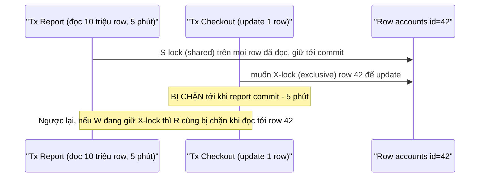
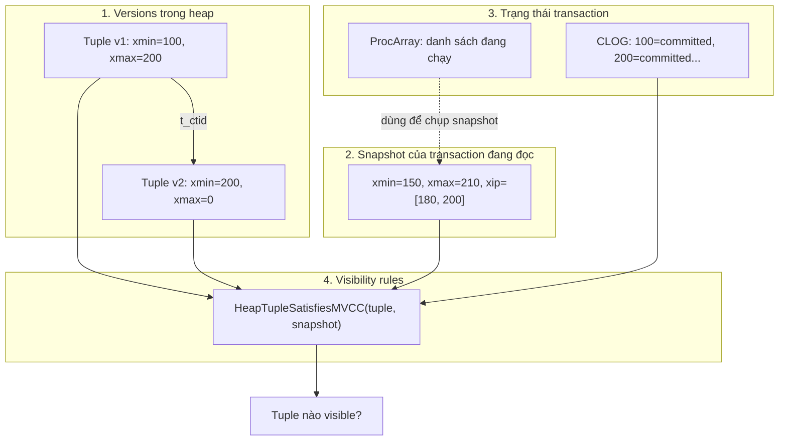
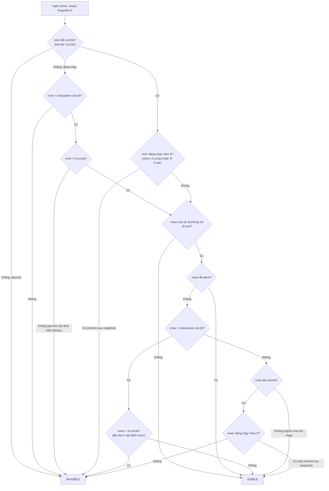
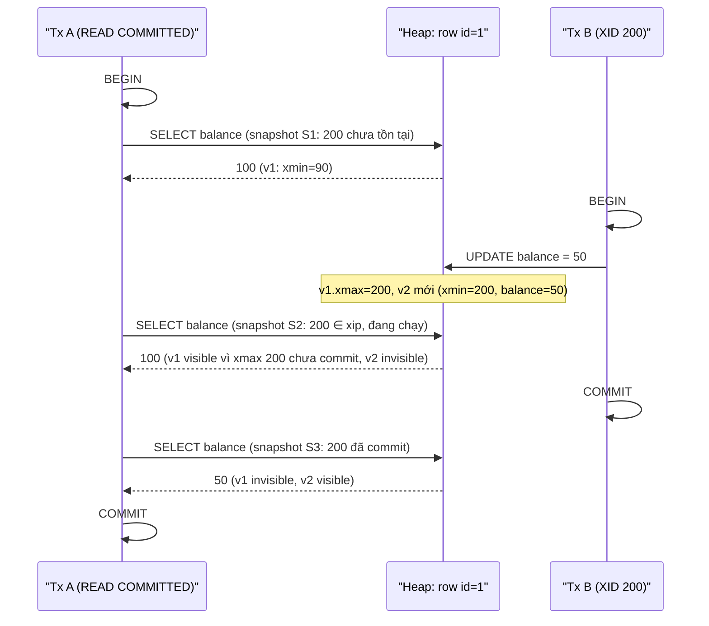
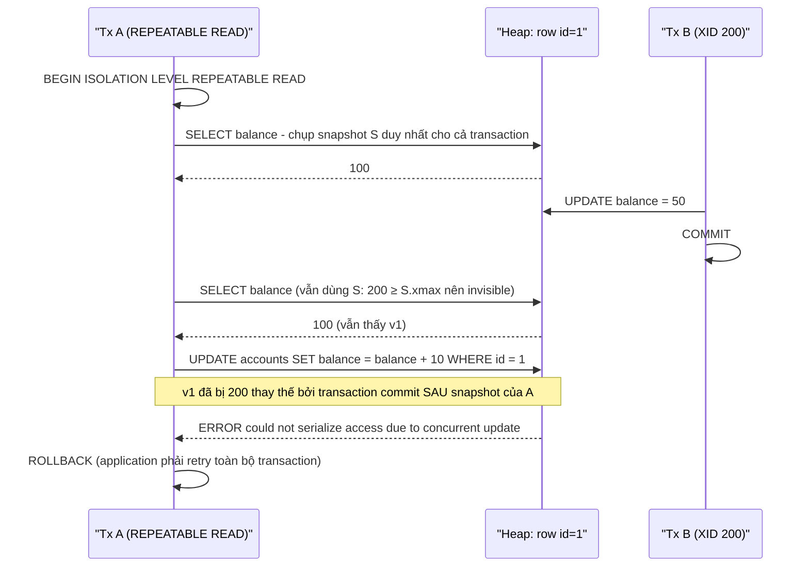
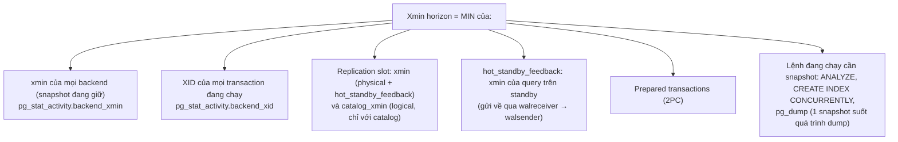
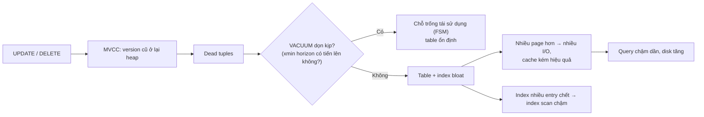

# PART 11 — MVCC (Multi-Version Concurrency Control)

> **Trước:** [10 — ACID](10-acid.md) · **Tiếp:** [12 — Isolation Level](12-isolation-level.md)
> **Độ ưu tiên:** Cao nhất. Đây là chương trung tâm của handbook: storage, UPDATE/DELETE, VACUUM, bloat, isolation, index-only scan, replication conflict đều là hệ quả của MVCC.

---

## Mục lục

1. [Simple mental model](#1-simple-mental-model)
2. [WHAT — MVCC là gì](#2-what--mvcc-là-gì)
3. [WHY — Tại sao PostgreSQL cần MVCC; nếu không có thì sao](#3-why--tại-sao-cần-mvcc)
4. [HOW — Ý tưởng cốt lõi: versions + snapshots + visibility rules](#4-how--ý-tưởng-cốt-lõi)
5. [INTERNALS 1 — Tuple version, xmin, xmax, ctid](#5-internals-1--tuple-version-xmin-xmax-ctid)
6. [INTERNALS 2 — Snapshot](#6-internals-2--snapshot)
7. [INTERNALS 3 — Visibility rules (HeapTupleSatisfiesMVCC)](#7-internals-3--visibility-rules)
8. [INTERNALS 4 — Committed, aborted, in-progress: nguồn thông tin](#8-internals-4--committed-aborted-in-progress)
9. [EXAMPLE — Transaction A đọc, B update, A đọc lại (RC vs RR vs Serializable)](#9-example--a-đọc-b-update-a-đọc-lại)
10. [UPDATE, DELETE và dead tuple dưới góc nhìn MVCC](#10-update-delete-và-dead-tuple)
11. [Xmin horizon: khi nào version cũ được phép biến mất](#11-xmin-horizon)
12. [VACUUM và MVCC](#12-vacuum-và-mvcc)
13. [WHAT HAPPENS IF — Long-running transaction và các edge case](#13-what-happens-if)
14. [PERFORMANCE IMPACT — MVCC ảnh hưởng storage và hiệu năng](#14-performance-impact)
15. [PRODUCTION BEHAVIOR — các tình huống thực tế](#15-production-behavior)
16. [TRADE-OFF & so sánh với MySQL/InnoDB, Oracle](#16-trade-off--so-sánh)
17. [WHEN TO USE / NOT — Làm việc thuận với MVCC](#17-làm-việc-thuận-với-mvcc)
18. [COMMON MISUNDERSTANDINGS](#18-common-misunderstandings)
19. [INTERVIEW QUESTIONS](#19-interview-questions)
20. [KEY TAKEAWAYS](#20-key-takeaways)

---

## 1. Simple mental model

Hãy tưởng tượng một **Google Doc có lịch sử phiên bản**, nhưng mỗi người mở tài liệu sẽ được **"đóng băng" ở phiên bản tại thời điểm họ bắt đầu nhìn**:

- Khi bạn sửa một đoạn, hệ thống **không xóa đoạn cũ**; nó giữ đoạn cũ kèm ghi chú "bị thay thế bởi phiên bản của bạn", và thêm đoạn mới kèm ghi chú "tạo bởi bạn".
- Người khác đang đọc (đã đóng băng trước khi bạn lưu) **vẫn thấy đoạn cũ** — không phải chờ bạn sửa xong, cũng không thấy bản sửa dở của bạn.
- Người mở tài liệu **sau khi bạn lưu** thấy đoạn mới.
- Khi **không còn ai** đang đóng băng ở thời điểm cần đoạn cũ, một "người dọn dẹp" (VACUUM) xóa đoạn cũ đi.

Ba mảnh ghép: **nhiều phiên bản** (versions) + **ảnh chụp thời điểm** (snapshot) + **luật ai thấy phiên bản nào** (visibility rules). Cộng thêm một người dọn dẹp.

---

## 2. WHAT — MVCC là gì

**Multi-Version Concurrency Control** là kỹ thuật điều khiển truy cập đồng thời trong đó database **giữ nhiều phiên bản của cùng một dữ liệu logic**, và mỗi transaction đọc **phiên bản phù hợp với snapshot của nó**, thay vì mọi transaction phải tranh nhau khóa trên một bản duy nhất.

Hệ quả nổi tiếng nhất, như PostgreSQL documentation diễn đạt: **reading never blocks writing and writing never blocks reading** — đọc không bao giờ chặn ghi, và ghi không bao giờ chặn đọc.

Lưu ý: MVCC **không** loại bỏ mọi xung đột. Hai transaction **cùng ghi** một row vẫn phải tuần tự hóa (người sau chờ người trước) — đó là việc của row lock ([Chương 13](13-locking.md)).

---

## 3. WHY — Tại sao cần MVCC

### 3.1 Nếu không có MVCC: Two-Phase Locking thuần

Cách cổ điển để đảm bảo isolation là **Two-Phase Locking (2PL)**: đọc phải lấy **shared lock**, ghi phải lấy **exclusive lock**, giữ tới cuối transaction.



**Cách đọc diagram:** Với 2PL thuần, một report dài giữ shared lock trên hàng triệu row → mọi giao dịch ghi đụng vào các row đó phải chờ. Ngược lại, một giao dịch ghi đang giữ exclusive lock chặn mọi reader. Trong hệ thống OLTP có cả đọc dài và ghi ngắn, throughput và latency sụp đổ. Deadlock giữa reader và writer cũng trở nên phổ biến.

### 3.2 Các cách khác để tránh reader chặn writer

- **Read Uncommitted (đọc bẩn):** reader không lấy lock, đọc bất cứ gì đang có — kể cả dữ liệu chưa commit có thể bị rollback. Nhanh nhưng sai.
- **MVCC:** reader đọc **bản đã commit phù hợp với thời điểm của nó**, writer tạo **bản mới**. Không ai chờ ai (trừ writer–writer). Đây là lựa chọn của hầu hết database hiện đại: PostgreSQL, Oracle, MySQL/InnoDB, SQL Server (khi bật snapshot isolation), CockroachDB...

### 3.3 Lợi ích bổ sung của MVCC trong PostgreSQL

- **Snapshot nhất quán cho query dài** mà không khóa gì: `pg_dump` lấy một snapshot và dump toàn bộ database nhất quán trong khi hệ thống vẫn nhận ghi.
- **Rollback O(1)** và **không cần undo** ([Chương 10](10-acid.md#24-internals--tại-sao-không-cần-undo)).
- **Hot standby** trả lời query trên dữ liệu đang được replay.

---

## 4. HOW — Ý tưởng cốt lõi

PostgreSQL hiện thực MVCC bằng bốn thành phần:



**Cách đọc diagram (trên xuống):**
1. **Versions:** mỗi lần UPDATE sinh một tuple mới trong heap; tuple ghi lại XID tạo (`xmin`) và XID xóa (`xmax`); version cũ trỏ tới version mới qua `t_ctid`.
2. **Snapshot:** khi transaction cần đọc, nó chụp danh sách "transaction nào đang chạy lúc này" từ ProcArray.
3. **Trạng thái transaction:** CLOG cho biết XID nào đã commit/abort.
4. **Visibility rules:** kết hợp ba thứ trên để quyết định với *từng tuple*: transaction này có được thấy nó không. Ở ví dụ: snapshot coi 200 là "đang chạy" (nằm trong xip) → v1 visible (người xóa 200 chưa commit theo snapshot), v2 invisible (người tạo 200 chưa commit theo snapshot) — dù CLOG hiện tại nói 200 đã commit.

---

## 5. INTERNALS 1 — Tuple version, xmin, xmax, ctid

### 5.1 Tuple version là gì

Một **row logic** (xác định bởi primary key, ví dụ `id = 1`) có thể tồn tại dưới dạng **nhiều tuple vật lý** trong heap — mỗi tuple là một **version**. Chúng **không** được liên kết bởi primary key mà bởi:
- **`t_ctid`**: version cũ trỏ tới version kế tiếp → tạo thành **update chain** (cũ → mới).
- Index: có thể có entry trỏ tới nhiều version (non-HOT) hoặc chỉ tới root của HOT chain.

### 5.2 xmin

- XID của transaction **tạo** ra tuple (INSERT, hoặc UPDATE sinh version mới).
- "Tuple chỉ tồn tại (với một snapshot) nếu transaction tạo ra nó đã commit *trước* snapshot đó."

### 5.3 xmax

- XID của transaction **xóa** tuple (DELETE) hoặc **thay thế** nó (UPDATE) — hoặc chỉ **khóa** nó (SELECT FOR UPDATE/SHARE, FK check), phân biệt bằng cờ `HEAP_XMAX_LOCK_ONLY`.
- `xmax = 0` (invalid): chưa ai xóa.
- xmax của một transaction **đã abort** → coi như chưa bị xóa.
- Nếu nhiều transaction cùng khóa row (ví dụ nhiều FK check `FOR KEY SHARE`, hoặc một người khóa + một người update), xmax chứa **MultiXactId** — một ID đại diện cho *tập* (XID, lock mode), lưu trong `pg_multixact`.

### 5.4 Minh họa đầy đủ một chuỗi version

```sql
-- XID 100
INSERT INTO accounts VALUES (1, 100);
-- XID 200
UPDATE accounts SET balance = 90 WHERE id = 1;
-- XID 300 (bị ROLLBACK)
UPDATE accounts SET balance = 0 WHERE id = 1;
-- XID 400
UPDATE accounts SET balance = 80 WHERE id = 1;
```

| ctid | xmin | xmax | t_ctid | balance | Trạng thái |
|---|---|---|---|---|---|
| (0,1) | 100 ✔ | 200 ✔ | (0,2) | 100 | dead (sau khi mọi snapshot cũ hơn 200 kết thúc) |
| (0,2) | 200 ✔ | 400 ✔ | (0,4) | 90 | dead (xmax 300 đã bị ghi đè bởi 400 khi 400 update — vì 300 abort, xmax cũ không có hiệu lực, người sau đặt xmax mới) |
| (0,3) | 300 ✘ | 0 | (0,3) | 0 | dead ngay khi 300 abort |
| (0,4) | 400 ✔ | 0 | (0,4) | 80 | **live** |

(✔ committed, ✘ aborted.) Một row logic, bốn tuple vật lý, ba trong số đó là rác chờ dọn.

---

## 6. INTERNALS 2 — Snapshot

### 6.1 WHAT

**Snapshot** là cấu trúc dữ liệu mô tả **"tập các transaction đã commit mà tôi được phép thấy"** tại một thời điểm. Nó không chứa dữ liệu — chỉ chứa thông tin về transaction.

### 6.2 Cấu trúc (`SnapshotData`, đơn giản hóa)

| Trường | Ý nghĩa |
|---|---|
| `xmin` | XID nhỏ nhất **vẫn đang chạy** lúc chụp. Mọi XID < xmin chắc chắn đã kết thúc (commit hoặc abort) trước snapshot → quyết định bằng CLOG. |
| `xmax` | XID **chưa được cấp** đầu tiên lúc chụp (= latestCompletedXid + 1). Mọi XID ≥ xmax bắt đầu *sau* snapshot → **luôn invisible**. |
| `xip[]` | Danh sách XID **đang chạy** trong khoảng [xmin, xmax) lúc chụp → coi như invisible dù sau đó có commit. |
| `subxip[]`, `suboverflowed` | Subtransaction XID đang chạy; cờ overflow ([Chương 09](09-transaction.md#103-what-happens-if--subtransaction-overflow)). |
| `curcid` | Command ID hiện tại — cho visibility trong cùng transaction. |

Ví dụ: `xmin=150, xmax=210, xip=[180, 200]` có nghĩa:
- XID < 150: đã kết thúc → tra CLOG xem commit hay abort.
- XID 150..209, trừ 180 và 200: đã kết thúc trước snapshot → tra CLOG.
- XID 180, 200: đang chạy lúc chụp → **invisible với snapshot này mãi mãi** (dù sau đó commit).
- XID ≥ 210: chưa tồn tại lúc chụp → invisible.

Quan sát trực tiếp: `SELECT pg_current_snapshot();` → `150:210:180,200` (định dạng `xmin:xmax:xip_list`).

### 6.3 HOW — Chụp snapshot (`GetSnapshotData`)

Duyệt **ProcArray** (danh sách PGPROC của mọi backend), thu thập XID đang chạy, tính xmin/xmax. Chi phí tỉ lệ số backend — lý do PG 14 tối ưu mạnh (dùng mảng XID dày đặc, cache snapshot khi không có gì thay đổi). Việc chụp cũng **cập nhật `MyProc->xmin`** — "tôi cần thấy mọi thứ từ XID này trở đi" — chính giá trị này tạo nên **xmin horizon** (mục 11).

### 6.4 Khi nào chụp snapshot

| Isolation level | Snapshot |
|---|---|
| Read Committed | **Mỗi câu lệnh** một snapshot mới (thực ra mỗi lần executor bắt đầu một statement; function `VOLATILE` bên trong cũng lấy snapshot mới cho mỗi câu) |
| Repeatable Read | **Một snapshot cho cả transaction**, chụp ở câu lệnh đầu tiên cần snapshot (không phải lúc BEGIN) |
| Serializable | Như Repeatable Read + theo dõi SSI |

### 6.5 Các loại snapshot khác (bên trong PostgreSQL)

| Loại | Dùng cho |
|---|---|
| **MVCC snapshot** | Query của người dùng |
| **Catalog snapshot** | Đọc system catalog (luôn mới nhất tương đối) |
| **SnapshotDirty** | Kiểm tra unique/FK: thấy cả tuple **chưa commit** của người khác để biết phải chờ ai |
| **SnapshotSelf** | Thấy thay đổi của chính câu lệnh hiện tại |
| **SnapshotAny** | Thấy mọi tuple, kể cả dead (VACUUM, một số công cụ) |
| **SnapshotToast** | Đọc TOAST: đã biết tuple chính visible |
| **Historic snapshot** | Logical decoding: nhìn catalog *như tại thời điểm trong quá khứ* |
| **Exported snapshot** | `pg_export_snapshot()`: chia sẻ snapshot giữa nhiều session (parallel `pg_dump`, CDC initial snapshot) |

---

## 7. INTERNALS 3 — Visibility rules

### 7.1 Thuật toán (đơn giản hóa từ `HeapTupleSatisfiesMVCC`)



**Cách đọc diagram (trên xuống), hai câu hỏi lớn:**

**Câu hỏi 1 — "Người tạo (xmin) đã có hiệu lực với tôi chưa?"**
- xmin abort → tuple không bao giờ tồn tại → INVISIBLE.
- xmin là chính tôi → visible nếu được tạo ở *câu lệnh trước* (cmin < curcid).
- xmin của người khác, chưa commit → INVISIBLE (**không dirty read**).
- xmin đã commit nhưng **sau** snapshot của tôi (xmin ≥ S.xmax hoặc nằm trong S.xip) → INVISIBLE.
- Ngược lại: người tạo có hiệu lực → sang câu hỏi 2.

**Câu hỏi 2 — "Người xóa (xmax) đã có hiệu lực với tôi chưa?"**
- Không có xmax, hoặc xmax chỉ là row lock → VISIBLE.
- xmax abort → việc xóa không có hiệu lực → VISIBLE.
- xmax là chính tôi → invisible nếu tôi đã xóa ở câu lệnh trước.
- xmax của người khác chưa commit → VISIBLE (người ta xóa chưa xong).
- xmax commit **sau** snapshot của tôi → VISIBLE (với tôi, việc xóa chưa xảy ra).
- xmax commit **trước** snapshot → INVISIBLE (đã bị xóa).

### 7.2 Hàm phụ `XidInMVCCSnapshot(xid, S)` — "xid có đang chạy theo S không?"

```
if xid < S.xmin            → false  (đã kết thúc trước snapshot)
if xid >= S.xmax           → true   (bắt đầu sau snapshot → coi như đang chạy)
if xid ∈ S.xip (hoặc subxip, hoặc suboverflowed → tra pg_subtrans tìm XID cha) → true
else                        → false
```

### 7.3 Bảng ví dụ

Snapshot S: `xmin=150, xmax=210, xip=[180, 200]`. Transaction của tôi: XID 205 (đang chạy; lưu ý 205 < 210 nhưng không nằm trong xip của chính nó — PostgreSQL xử lý XID của chính mình riêng qua `TransactionIdIsCurrentTransactionId`).

| Tuple | xmin | xmax | CLOG hiện tại | Visible với S? | Lý do |
|---|---|---|---|---|---|
| A | 120 ✔ | 0 | | **Có** | Tạo trước snapshot, chưa bị xóa |
| B | 120 ✔ | 170 ✔ | | **Không** | Bị xóa bởi 170, commit trước snapshot |
| C | 120 ✔ | 200 ✔ | 200 commit sau khi S chụp | **Có** | 200 ∈ xip → việc xóa chưa có hiệu lực với S |
| D | 200 ✔ | 0 | | **Không** | Người tạo 200 ∈ xip |
| E | 190 ✘ | 0 | | **Không** | Người tạo abort |
| F | 120 ✔ | 190 ✘ | | **Có** | Người xóa abort |
| G | 215 ✔ | 0 | | **Không** | 215 ≥ xmax → tương lai |
| H | 205 (tôi, cmin=2) | 0 | | Có nếu curcid > 2 | Visibility trong cùng transaction |
| I | 120 ✔ | 180 (đang chạy) | | **Có** | Người xóa chưa commit |

Tuple C và D minh họa bản chất của snapshot: **cùng một transaction 200 đã commit**, nhưng với S nó "chưa xảy ra" — S tiếp tục thấy phiên bản cũ (C) và không thấy phiên bản mới (D).

---

## 8. INTERNALS 4 — Committed, aborted, in-progress

| Trạng thái | Nguồn sự thật | Cache |
|---|---|---|
| **In-progress** | ProcArray (có trong danh sách PGPROC đang chạy) | Snapshot chụp lại danh sách này |
| **Committed** | CLOG bit `01` | Hint bit `HEAP_XMIN_COMMITTED`/`HEAP_XMAX_COMMITTED` trong tuple |
| **Aborted** | CLOG bit `10`, **hoặc** XID không còn chạy mà CLOG không nói committed (ví dụ crash trước khi kết thúc — CLOG vẫn là `00`) | Hint bit `HEAP_XMIN_INVALID`/`HEAP_XMAX_INVALID` |
| **Frozen** | Hint `HEAP_XMIN_FROZEN` (tuple đã được VACUUM freeze) | Luôn visible với mọi snapshot, bỏ qua so sánh XID |

**Chi tiết tinh tế — tại sao "không chạy + không committed = aborted":** Sau crash, transaction đang dở không có cơ hội ghi abort vào CLOG (bit vẫn `00`). Nhưng nó cũng không có trong ProcArray (ProcArray là memory, bị reset). Khi kiểm tra: `TransactionIdIsInProgress` → false; `TransactionIdDidCommit` → false → coi là aborted. Không cần bước "undo" nào.

**Thứ tự kiểm tra** khi hint bit chưa có: PostgreSQL gọi `TransactionIdIsInProgress()` (tra ProcArray) **trước** `TransactionIdDidCommit()` (tra CLOG) — vì thứ tự commit là "CLOG trước, ProcArray sau" ([Chương 09 §7](09-transaction.md#7-commit-từ-bên-trong)): nếu tra CLOG trước có thể thấy committed trong khi transaction vẫn đang trong ProcArray chưa "công bố". Và hint bit chỉ được đặt khi chắc chắn trạng thái là cuối cùng.

---

## 9. EXAMPLE — A đọc, B update, A đọc lại

Setup: `accounts(id=1, balance=100)`, tạo bởi XID 90 (đã commit).

### 9.1 Read Committed (mặc định)



**Cách đọc diagram:** Ở Read Committed, **mỗi câu SELECT có snapshot mới**. Câu thứ hai chạy khi B chưa commit → vẫn thấy 100 (không dirty read). Câu thứ ba chạy sau khi B commit → thấy 50. Trong cùng một transaction A, hai lần đọc cùng row trả kết quả khác nhau → **non-repeatable read** — được cho phép ở Read Committed.

### 9.2 Repeatable Read



**Cách đọc diagram:** Ở Repeatable Read, A dùng **một snapshot** suốt transaction → đọc lại vẫn thấy 100 dù B đã commit. Khi A cố **ghi** lên row mà một transaction commit sau snapshot của A đã sửa, PostgreSQL không thể "ghi đè lên một version mà A không nhìn thấy" mà vẫn giữ đảm bảo snapshot → **serialization failure** (SQLSTATE `40001`). Đây là cách RR của PostgreSQL chặn **lost update**.

### 9.3 Read Committed khi A cũng UPDATE — EvalPlanQual

Nếu ở Read Committed, A chạy `UPDATE accounts SET balance = balance + 10 WHERE id = 1` **trong lúc B đang giữ row** (B đã update nhưng chưa commit):
1. A tìm v1 (visible với snapshot của A), thấy xmax = 200 đang chạy → **chờ** B.
2. B commit.
3. A không báo lỗi; thay vào đó thực hiện **EvalPlanQual (EPQ)**: đi theo `t_ctid` từ v1 tới **version mới nhất** v2 (balance=50), **đánh giá lại điều kiện WHERE** trên v2 (`id = 1` vẫn đúng) → update v2 → balance = 60.
4. Kết quả đúng về số học (không lost update) vì phép tính `balance + 10` được áp lên version mới nhất.

Cái giá: câu lệnh của A **thấy một trạng thái "lai"**: v2 là dữ liệu mà snapshot của A lẽ ra không thấy. Nếu điều kiện WHERE không còn đúng trên version mới (ví dụ `WHERE status = 'pending'` mà B đã đổi thành 'done'), row bị **bỏ qua** — không lỗi, không update. Chi tiết và các anomaly ở [Chương 12](12-isolation-level.md).

### 9.4 Serializable

Giống Repeatable Read về snapshot, cộng thêm **SSI**: ngay cả khi A và B không ghi cùng row, nếu mẫu đọc–ghi giữa chúng có thể tạo ra kết quả không tương đương bất kỳ thứ tự tuần tự nào, một transaction bị abort với `40001`. Xem [Chương 12](12-isolation-level.md).

### 9.5 Tổng hợp

| Tình huống | Read Committed | Repeatable Read | Serializable |
|---|---|---|---|
| A đọc lại sau khi B commit | Thấy giá trị **mới** | Thấy giá trị **cũ** | Thấy giá trị **cũ** |
| A update row B đã sửa và commit sau snapshot của A | Chờ B, rồi **EPQ trên version mới** | **ERROR 40001** | **ERROR 40001** |
| A đọc dữ liệu B chưa commit | Không bao giờ | Không bao giờ | Không bao giờ |
| Write skew (A, B đọc chung, ghi row khác nhau) | Cho phép | Cho phép | **Phát hiện, abort một bên** |

---

## 10. UPDATE, DELETE và dead tuple

### 10.1 UPDATE có thực sự update row cũ không?

**Không.** Nó (1) đặt `xmax` của version cũ = XID của mình, (2) ghi version mới với `xmin` = XID của mình, (3) nối `t_ctid`. Version cũ **vẫn nguyên dữ liệu** — nhờ đó transaction khác với snapshot cũ vẫn đọc được. Chi tiết vật lý: [Chương 07 §4](07-read-write-behavior.md#4-update).

### 10.2 DELETE thực sự làm gì?

Chỉ đặt `xmax`. Không xóa byte nào, không đụng index. Row "biến mất" hoàn toàn thông qua visibility rules: snapshot chụp sau khi DELETE commit thấy xmax committed-before-snapshot → invisible.

### 10.3 Dead tuple sinh ra như thế nào?

Một tuple trở thành **dead** khi nó **không thể visible với bất kỳ snapshot nào còn tồn tại hoặc sẽ tồn tại**:

| Nguồn | Điều kiện dead |
|---|---|
| Version cũ sau UPDATE | xmax committed **và** xmax < xmin horizon |
| Tuple bị DELETE | như trên |
| Tuple do transaction abort tạo ra | Ngay khi xmin aborted |
| Version trung gian trong cùng transaction | xmin = xmax cùng transaction đã commit (và vượt horizon) |

Tỉ lệ sinh dead tuple ≈ **tốc độ UPDATE + DELETE + rollback**. Table queue có 5.000 update/giây sinh 5.000 dead tuple/giây.

---

## 11. Xmin horizon

### 11.1 WHAT

**Xmin horizon** (trong code: `GetOldestNonRemovableTransactionId`, trước đây `OldestXmin`) là XID sao cho: **mọi tuple bị xóa bởi transaction đã commit có XID < horizon thì không còn snapshot nào có thể thấy nó** → an toàn để dọn.

Nó bằng **min** của nhiều nguồn:



**Cách đọc diagram:** Bất kỳ nguồn nào ở dưới "già" đi sẽ **kéo horizon lùi về quá khứ**. Mọi tuple chết *sau* thời điểm đó đều phải được giữ — **trên mọi table** (của database đó với snapshot thường; với replication slot và hot_standby_feedback thì ảnh hưởng mọi database trong cluster), không chỉ table mà transaction già đang đọc.

(PG 14 có tinh chỉnh: horizon được tính riêng cho catalog, cho table thường của database hiện tại, và cho temp table — transaction ở database khác không giữ horizon của table thường ở database này; nhưng replication slot và `hot_standby_feedback` vẫn là toàn cluster.)

### 11.2 WHY — Tại sao phải giữ?

Nếu VACUUM xóa một tuple trong khi một snapshot cũ vẫn có thể cần nó, snapshot đó sẽ đọc thiếu dữ liệu → vi phạm isolation. PostgreSQL chọn **đúng đắn thay vì dọn dẹp**.

(PostgreSQL từng có tham số `old_snapshot_threshold` cho phép dọn và trả lỗi "snapshot too old" cho transaction quá cũ; nó bị **xóa ở PG 17** vì có nhiều vấn đề hiệu năng và đúng đắn.)

---

## 12. VACUUM và MVCC

VACUUM là "nửa còn lại" của MVCC — không có nó, MVCC chỉ là bộ máy sinh rác.

| MVCC tạo ra | VACUUM xử lý |
|---|---|
| Dead tuple trong heap | Xóa, đặt line pointer LP_DEAD → (sau khi dọn index) LP_UNUSED |
| Index entry trỏ tới dead tuple | Xóa (bulk delete trên mỗi index) |
| Chỗ trống | Ghi vào FSM để tái sử dụng |
| Page không còn dead tuple | Đặt bit all-visible trong VM (cho index-only scan) |
| XID cũ trong tuple (nguy cơ wraparound) | **Freeze** |
| Thống kê lỗi thời | ANALYZE (tùy chọn) |

Ngoài VACUUM, **HOT pruning** dọn dead tuple trong một page ngay trong lúc truy cập page ([Chương 24](24-hot-update.md)). Chi tiết VACUUM: [Chương 23](23-vacuum.md).

Chuỗi hệ quả cần thuộc lòng:



**Cách đọc diagram:** UPDATE/DELETE → dead tuple là không thể tránh (thiết kế). Câu hỏi duy nhất là VACUUM có dọn kịp không — phụ thuộc cấu hình autovacuum **và** xmin horizon. Không kịp → bloat → I/O → latency.

---

## 13. WHAT HAPPENS IF

### 13.1 Transaction chạy hàng giờ

Giả sử một job analytics mở transaction REPEATABLE READ lúc 08:00 (snapshot xmin = XID 1.000.000) và chạy tới 14:00. Hệ thống xử lý 2.000 UPDATE/giây trên table `orders`.

- 6 giờ × 3600 × 2000 = **43,2 triệu** dead tuple trên `orders` tích lũy, **không thể dọn** (tất cả xóa sau XID 1.000.000).
- Autovacuum vẫn chạy (tốn CPU/I/O) nhưng báo "X dead row versions cannot be removed yet" (`VACUUM VERBOSE`: `tuples: 0 removed, ... 43200000 are dead but not yet removable`).
- Table và index phình; HOT pruning cũng không dọn được (cùng horizon).
- Query quét index gặp nhiều entry trỏ tới tuple dead → phải đọc heap để kiểm tra → chậm dần.
- 14:00 job kết thúc → horizon nhảy lên → autovacuum dọn được → **nhưng chỗ trống chỉ được tái sử dụng**, file không co lại → table giữ kích thước "đỉnh" lâu dài.

### 13.2 `idle in transaction`

Tệ hơn long query vì không có ích gì: application mở transaction, SELECT một lần (giữ snapshot), rồi quên (hoặc đợi HTTP call bên ngoài). Cùng hậu quả như 13.1. Phòng: `idle_in_transaction_session_timeout`.

### 13.3 Replication slot bị bỏ rơi

Physical slot với `hot_standby_feedback`, hoặc logical slot (CDC connector chết) → `xmin`/`catalog_xmin` của slot đứng yên → horizon đứng yên **toàn cluster** + WAL tích lũy. Hai sự cố cùng lúc: bloat và disk full. [Chương 25](25-replication.md), [43](43-data-engineer-perspective.md).

### 13.4 Hai transaction update cùng row

Không phải việc của snapshot — là việc của row lock (xmax). Người sau chờ lock XID của người trước. RC → EPQ; RR/SER → lỗi nếu người trước commit.

### 13.5 Transaction bị abort

Mọi tuple nó tạo → dead ngay; mọi xmax nó đặt → bị bỏ qua. Không cần dọn gì ngoài dead tuple.

### 13.6 Hot standby cần tuple mà primary muốn dọn

Query dài trên standby đang đọc snapshot cũ; primary VACUUM xóa tuple (không biết standby cần) → WAL cleanup record tới standby → **conflict**: standby hoặc tạm dừng replay (tối đa `max_standby_streaming_delay`, mặc định 30s) rồi **hủy query** (`ERROR: canceling statement due to conflict with recovery`), hoặc (với `hot_standby_feedback = on`) standby báo xmin của nó về primary → primary giữ tuple → bloat trên primary. Không có lựa chọn miễn phí. [Chương 25](25-replication.md).

### 13.7 XID wraparound

MVCC so sánh XID 32-bit theo vòng tròn. Tuple không được freeze trước khi XID tiêu thụ thêm ~2 tỷ → rủi ro "tuple cũ trở thành tương lai" → PostgreSQL buộc anti-wraparound vacuum và cuối cùng từ chối cấp XID. [Chương 23](23-vacuum.md).

---

## 14. PERFORMANCE IMPACT

| Khía cạnh | Ảnh hưởng của MVCC-in-heap |
|---|---|
| **Storage** | Mỗi tuple mang header 23 byte; version cũ chiếm chỗ tới khi dọn; bloat nếu VACUUM không theo kịp. |
| **UPDATE** | Ghi cả tuple mới (không chỉ cột đổi); non-HOT → mọi index nhận entry mới → write amplification. |
| **Đọc** | Mỗi tuple phải kiểm tra visibility (CPU); index không có visibility → phải đọc heap (trừ index-only scan với VM). Dead tuple làm scan đọc nhiều page hơn. |
| **Hint bits** | Lần đọc đầu sau commit ghi lại page (dirty, có thể FPI). |
| **COUNT(*)** | Không có counter chính xác vì mỗi snapshot thấy số khác nhau → phải đếm (có thể index-only scan nếu VM tốt). |
| **Không block reader/writer** | Lợi ích lớn: đọc dài không chặn OLTP, OLTP không chặn đọc. |
| **Rollback** | O(1). |

---

## 15. PRODUCTION BEHAVIOR

### 15.1 Queue table trên PostgreSQL

Table `jobs` với worker `SELECT ... FOR UPDATE SKIP LOCKED` → `UPDATE status='done'` → `DELETE`. Mỗi job tạo 2–3 dead tuple. Với vài nghìn job/giây và một long transaction ở đâu đó (ví dụ report), table `jobs` chỉ vài nghìn row live nhưng phình thành hàng triệu dead tuple → `SELECT ... LIMIT 1` phải lướt qua hàng triệu tuple dead ở đầu index → latency từ 1ms thành 500ms. Giải pháp: giữ horizon tươi (không long tx), autovacuum aggressive cho table này (scale_factor rất nhỏ), partition theo thời gian và drop, hoặc dùng hệ queue chuyên dụng.

### 15.2 pg_dump trên primary lớn

`pg_dump` giữ một snapshot REPEATABLE READ trong suốt thời gian dump (có thể hàng giờ) → giữ horizon → bloat toàn database trong lúc backup. Chạy pg_dump trên replica (lưu ý conflict/feedback) hoặc dùng physical backup.

### 15.3 Chẩn đoán "vacuum chạy mà dead tuple không giảm"

```sql
-- Ai đang giữ horizon?
SELECT pid, datname, usename, state, backend_xmin, age(backend_xmin) AS xmin_age,
       now() - xact_start AS xact_age, left(query, 60)
FROM pg_stat_activity WHERE backend_xmin IS NOT NULL ORDER BY age(backend_xmin) DESC LIMIT 5;

SELECT slot_name, slot_type, active, xmin, catalog_xmin, age(xmin), age(catalog_xmin)
FROM pg_replication_slots;

SELECT gid, prepared, owner, age(transaction) FROM pg_prepared_xacts;
```

Và trên standby có `hot_standby_feedback`: query dài trên standby.

---

## 16. TRADE-OFF & so sánh

### 16.1 Ba cách hiện thực MVCC

| | **PostgreSQL** (append-only trong heap) | **InnoDB / Oracle** (in-place + undo) | **SQL Server** (snapshot isolation: version store trong tempdb) |
|---|---|---|---|
| Version mới nằm ở | Tuple mới trong heap | Tại chỗ (row hiện tại) | Tại chỗ |
| Version cũ nằm ở | Tuple cũ trong heap | Undo log / rollback segment | Version store (tempdb) |
| Đọc version cũ | Đọc thẳng tuple cũ | Dựng lại từ undo chain (đắt nếu chain dài) | Đọc chain trong tempdb |
| Đọc version mới | Có thể phải bỏ qua các tuple cũ (dead) | Trực tiếp | Trực tiếp |
| Rollback | O(1) | O(thay đổi) — áp undo | O(thay đổi) |
| Dọn rác | VACUUM (quét heap + index) | Purge (dọn undo, dọn delete-mark) | Cleanup version store |
| Index khi update | Non-HOT: mọi index nhận entry mới (TID đổi) | Chỉ secondary index có cột đổi | Chỉ index có cột đổi |
| Long transaction gây | Heap/index bloat | Undo phình, history list length tăng, đọc chậm | tempdb phình |
| Crash recovery | Redo only | Redo + undo | Redo + undo |

### 16.2 Tại sao PostgreSQL không chuyển sang undo?

Đã có nỗ lực: **zheap** (EnterpriseDB, 2017–2020) — storage engine dùng undo, dừng phát triển. **OrioleDB** — storage engine dùng undo và row-level WAL, cung cấp qua Table AM (cần vài patch core), vẫn là dự án ngoài core. Chuyển đổi đòi hỏi viết lại lượng lớn code phụ thuộc giả định "version cũ nằm trong heap". Cộng đồng đã chọn cải tiến dần: HOT (8.3), VM + index-only scan (9.2), all-frozen (9.6), dedup + bottom-up deletion (13, 14), TidStore cho vacuum (17), eager freezing (18)...

### 16.3 TRADE-OFF tóm tắt

| Lợi ích | Chi phí |
|---|---|
| Reader không chặn writer và ngược lại | Dead tuple, bloat, cần VACUUM |
| Snapshot nhất quán cho query dài | Query dài giữ horizon → bloat toàn hệ thống |
| Rollback O(1), recovery chỉ redo | UPDATE ghi nhiều (tuple + index) |
| Không có undo log để quản lý | XID 32-bit → wraparound → freeze |

---

## 17. Làm việc thuận với MVCC

MVCC không phải thứ "bật/tắt" — nó luôn có. Câu hỏi là thiết kế application **thuận** với nó:

**Nên:**
- Transaction **ngắn**; không gọi dịch vụ ngoài trong transaction.
- Đặt `idle_in_transaction_session_timeout`, `statement_timeout`, (PG 17) `transaction_timeout`.
- Theo dõi `age(backend_xmin)`, slot inactive, prepared xacts.
- Tránh update không cần thiết (no-op update, "touch" updated_at hàng loạt).
- Tận dụng HOT: fillfactor < 100 cho table update nhiều; không index cột hay đổi.
- Dữ liệu vòng đời ngắn (log, event, session) → partition theo thời gian, `DROP PARTITION` thay vì `DELETE`.
- Autovacuum tuning theo table cho table "nóng".

**Không nên:**
- Dùng PostgreSQL làm queue throughput rất cao mà không có chiến lược dọn dẹp.
- Chạy analytics nặng hàng giờ trên primary OLTP.
- Để CDC connector chết mà logical slot vẫn tồn tại.

---

## 18. COMMON MISUNDERSTANDINGS

1. **"MVCC nghĩa là không bao giờ có lock."** — Writer–writer vẫn dùng row lock; DDL dùng table lock; reader vẫn lấy `AccessShareLock` trên table.
2. **"UPDATE sửa row tại chỗ."** — Tạo version mới.
3. **"Snapshot chụp lúc BEGIN."** — Chụp ở câu lệnh đầu tiên (RR/SER) hoặc mỗi câu lệnh (RC).
4. **"Transaction dài chỉ ảnh hưởng table nó đọc."** — Giữ horizon cho mọi table (trong database; toàn cluster với slot/feedback).
5. **"VACUUM chạy thì dead tuple sẽ giảm."** — Chỉ khi horizon cho phép.
6. **"Read Uncommitted trong PostgreSQL cho dirty read."** — Không; được xử lý như Read Committed.
7. **"COUNT(*) có thể lấy từ metadata."** — `pg_class.reltuples` chỉ là ước lượng; con số chính xác phụ thuộc snapshot.
8. **"Hint bits là tối ưu không có tác dụng phụ."** — Gây ghi (và FPI nếu có checksums) khi đọc lần đầu.

---

## 19. INTERVIEW QUESTIONS

**Q1. MVCC hoạt động thế nào trong PostgreSQL?**
- *Short:* Mỗi UPDATE/DELETE không ghi đè mà tạo/đánh dấu version: tuple có xmin (tạo) và xmax (xóa). Mỗi transaction có snapshot (xmin, xmax, danh sách XID đang chạy). Visibility rules so sánh xmin/xmax với snapshot và trạng thái commit (CLOG/hint bits). Version cũ được VACUUM dọn khi vượt xmin horizon.
- *Deep:* Trình bày thuật toán visibility (hai câu hỏi: người tạo có hiệu lực? người xóa có hiệu lực?), snapshot theo isolation level, EPQ ở RC, serialization failure ở RR, hint bits, xmin horizon và các nguồn giữ nó.
- *Follow-up:* So sánh với InnoDB? Tại sao PostgreSQL cần VACUUM còn InnoDB có purge?

**Q2. Transaction A đọc row, B update và commit, A đọc lại. A thấy gì?**
- *Short:* RC: giá trị mới (snapshot mới mỗi câu). RR/Serializable: giá trị cũ (một snapshot).
- *Follow-up:* Nếu A cố update row đó ở RR thì sao? (40001.) Ở RC? (Chờ + EPQ.)

**Q3. Snapshot gồm những gì? Được chụp khi nào?**
- *Short:* xmin, xmax, xip[] (+ subxip, curcid); RC mỗi câu, RR/SER câu đầu tiên.

**Q4. Tại sao long-running transaction nguy hiểm?**
- *Short:* Giữ xmin horizon → VACUUM không dọn được dead tuple phát sinh sau đó → bloat mọi table; giữ lock; tiến tới wraparound nếu có XID.

**Q5. Dead tuple được tạo ra khi nào và bị dọn khi nào?**
- *Short:* UPDATE/DELETE commit hoặc transaction abort; dọn bởi HOT pruning/VACUUM khi xmax < horizon.

**Q6. Tại sao index-only scan vẫn có "Heap Fetches"?**
- *Short:* Index không có thông tin visibility; chỉ bỏ qua heap khi VM đánh dấu page all-visible.

**Q7. (Senior) Thiết kế queue trên PostgreSQL có vấn đề gì liên quan MVCC?**
- *Short:* Churn tạo dead tuple liên tục; long tx bất kỳ làm table queue bloat → latency tăng; cần SKIP LOCKED, autovacuum aggressive, partition, giữ horizon tươi.

**Q8. (Staff) Nếu thiết kế lại storage của PostgreSQL với undo log, bạn được và mất gì?**
- *Short:* Được: update in-place, ít bloat, index ít bị ghi, không cần vacuum heap kiểu hiện tại. Mất: rollback đắt, cần undo recovery, đọc version cũ đắt, phải quản lý undo space (vẫn bị long tx làm hại), độ phức tạp code rất lớn.

---

## 20. KEY TAKEAWAYS

1. **MVCC = versions + snapshot + visibility rules (+ VACUUM).**
2. UPDATE = xmax trên cũ + tuple mới (xmin); DELETE = xmax. Không có gì bị ghi đè hay xóa ngay.
3. **Snapshot** = (xmin, xmax, xip[]) chụp từ ProcArray; RC mỗi câu, RR/SER một lần.
4. **Visibility** = "người tạo có hiệu lực với snapshot không?" + "người xóa có hiệu lực với snapshot không?"; trạng thái commit từ CLOG, cache bằng hint bits.
5. Không bao giờ có dirty read/dirty write trong PostgreSQL.
6. RC: A thấy dữ liệu mới giữa các câu; update đụng độ → chờ + **EvalPlanQual**. RR: dữ liệu cố định; update đụng độ → **40001**.
7. **Xmin horizon** quyết định cái gì được dọn; long transaction, idle in transaction, slot, hot_standby_feedback, prepared xact giữ nó lại.
8. Chuỗi nhân quả phải thuộc: **UPDATE → MVCC → dead tuple → VACUUM → (không kịp) bloat → I/O → query chậm**.
9. So với InnoDB: PostgreSQL đổi rollback O(1) + không undo lấy dead tuple trong heap + write amplification cho index.

---

## Nguồn tham khảo

- PostgreSQL Docs — *Concurrency Control* (Introduction, Transaction Isolation): https://www.postgresql.org/docs/current/mvcc.html
- PostgreSQL Docs — *Routine Vacuuming*: https://www.postgresql.org/docs/current/routine-vacuuming.html
- PostgreSQL source: `src/backend/access/heap/heapam_visibility.c` (`HeapTupleSatisfiesMVCC`), `src/backend/storage/ipc/procarray.c` (`GetSnapshotData`, `GetOldestNonRemovableTransactionId`), `src/backend/utils/time/snapmgr.c`, `src/backend/executor/README` (EvalPlanQual).
- Bruce Momjian, *MVCC Unmasked* (slides): https://momjian.us/main/presentations/internals.html
- Hironobu Suzuki, *The Internals of PostgreSQL*, chương 5 (Concurrency Control).
- Philip A. Bernstein & Nathan Goodman, *Multiversion Concurrency Control — Theory and Algorithms*, ACM TODS 1983.
