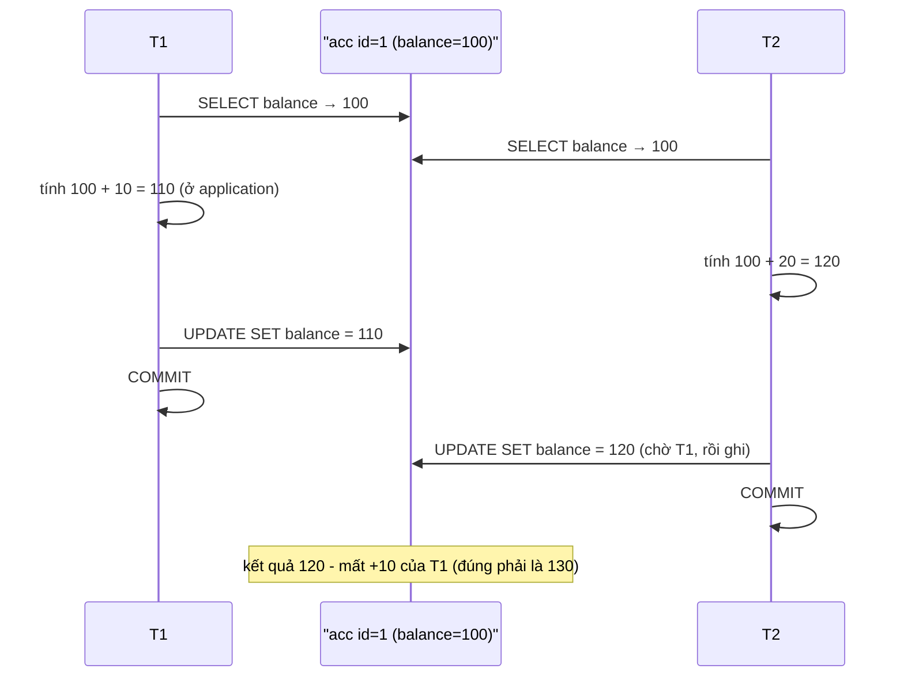
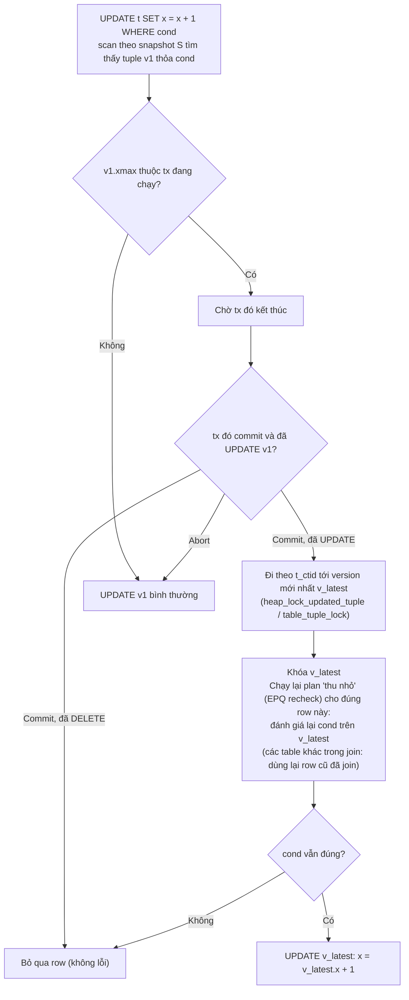
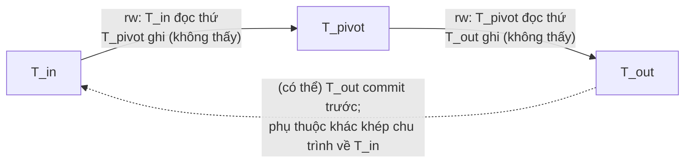

# PART 12 — ISOLATION LEVEL

> **Trước:** [11 — MVCC](11-mvcc.md) · **Tiếp:** [13 — Locking](13-locking.md)
> **Độ ưu tiên:** Rất cao.

---

## Mục lục

1. [Simple mental model](#1-simple-mental-model)
2. [Concept: Isolation Level — WHAT & WHY](#2-concept-isolation-level)
3. [Danh mục anomaly (có ví dụ)](#3-danh-mục-anomaly)
4. [Chuẩn SQL vs PostgreSQL thực tế](#4-chuẩn-sql-vs-postgresql-thực-tế)
5. [Read Uncommitted trong PostgreSQL](#5-read-uncommitted)
6. [Read Committed — cơ chế và EvalPlanQual](#6-read-committed)
7. [Repeatable Read — Snapshot Isolation](#7-repeatable-read--snapshot-isolation)
8. [Serializable — Serializable Snapshot Isolation (SSI)](#8-serializable--ssi)
9. [Lost Update: bốn cách chống](#9-lost-update-bốn-cách-chống)
10. [What happens if...](#10-what-happens-if)
11. [Performance impact & Production behavior](#11-performance-impact--production-behavior)
12. [So sánh MySQL/InnoDB, Oracle, SQL Server](#12-so-sánh)
13. [When to use which level](#13-when-to-use-which-level)
14. [Common misunderstandings](#14-common-misunderstandings)
- [Concept card — khung 13 điểm](#concept-card--)
15. [Interview Questions](#15-interview-questions)
16. [Key Takeaways](#16-key-takeaways)

---

## 1. Simple mental model

- **Read Committed:** mỗi lần bạn nhìn vào bảng, bạn thấy **ảnh chụp mới nhất** của những gì đã được chốt. Nhìn hai lần có thể thấy hai cảnh khác nhau.
- **Repeatable Read:** bạn được phát **một tấm ảnh** ở lần nhìn đầu tiên và dùng nó suốt phiên làm việc. Nếu bạn định sửa một thứ mà người khác đã sửa sau khi ảnh của bạn được chụp, bạn bị yêu cầu làm lại từ đầu.
- **Serializable:** như Repeatable Read, cộng thêm một **trọng tài** theo dõi ai đọc gì và ai ghi gì; nếu tổng hợp các phiên làm việc đồng thời tạo ra kết quả **không thể có** nếu mọi người làm lần lượt, trọng tài hủy một người.

---

## 2. Concept: Isolation Level

### 2.1 WHAT

**Isolation level** quy định **mức độ một transaction được phép bị ảnh hưởng bởi các transaction đồng thời**, được định nghĩa qua các **anomaly** (hiện tượng bất thường) mà level đó cho phép hay cấm.

### 2.2 WHY

Serializability hoàn hảo có chi phí: nhiều chờ đợi (lock) hoặc nhiều abort (optimistic). Nhiều ứng dụng chấp nhận một số anomaly để đổi lấy hiệu năng. Isolation level là **núm vặn** cho trade-off đó.

Nếu không có khái niệm này, chỉ có hai lựa chọn cực đoan: chạy tuần tự (chậm) hoặc không cô lập (sai).

### 2.3 HOW (tổng quan PostgreSQL)

| Level | Snapshot | Xung đột ghi | Theo dõi thêm |
|---|---|---|---|
| Read Uncommitted | = Read Committed | | |
| **Read Committed** (mặc định) | Mới mỗi câu lệnh | Chờ, rồi **EvalPlanQual** trên version mới nhất | |
| **Repeatable Read** | Một snapshot/transaction | Chờ, rồi **ERROR 40001** nếu người kia commit | |
| **Serializable** | Một snapshot/transaction | Như RR | **Predicate locks (SIRead)** + phát hiện dangerous structure → 40001 |

---

## 3. Danh mục anomaly

Mỗi anomaly: định nghĩa, ví dụ, và level nào của PostgreSQL ngăn được.

### 3.1 Dirty Write

T2 ghi đè dữ liệu T1 đã ghi nhưng chưa commit. **Không level nào của PostgreSQL cho phép** (row lock trong xmax buộc T2 chờ).

### 3.2 Dirty Read

T1 đọc dữ liệu T2 đã ghi **nhưng chưa commit** (và T2 có thể rollback). **PostgreSQL không bao giờ cho phép** — visibility rules không bao giờ trả tuple có xmin chưa commit của người khác.

### 3.3 Non-repeatable Read (Fuzzy Read)

T1 đọc một row hai lần, giữa hai lần T2 **update/delete** row đó và commit → T1 thấy giá trị khác.

```sql
-- T1                                   -- T2
SELECT balance FROM acc WHERE id=1; -- 100
                                        UPDATE acc SET balance=50 WHERE id=1; COMMIT;
SELECT balance FROM acc WHERE id=1; -- RC: 50 | RR: 100
```

Có ở RC; không có ở RR/SER.

### 3.4 Phantom Read

T1 chạy một truy vấn theo **điều kiện** (predicate) hai lần; giữa hai lần T2 **insert** (hoặc update khiến row mới thỏa điều kiện) và commit → lần hai có thêm/bớt row.

```sql
-- T1                                           -- T2
SELECT count(*) FROM orders WHERE user_id=7; -- 3
                                                INSERT INTO orders(user_id) VALUES (7); COMMIT;
SELECT count(*) FROM orders WHERE user_id=7; -- RC: 4 | RR: 3
```

Chuẩn SQL **cho phép** phantom ở Repeatable Read, nhưng **Repeatable Read của PostgreSQL không có phantom** (vì dùng snapshot cho cả transaction).

### 3.5 Lost Update

Hai transaction cùng **đọc–sửa–ghi** một giá trị; update của một bên bị ghi đè mất.



**Cách đọc diagram:** Cả hai đọc 100, tính ở application, ghi giá trị tuyệt đối. Ở **Read Committed**, T2 chờ T1 rồi ghi đè bằng 120 → mất update. Ở **Repeatable Read/Serializable**, UPDATE của T2 gặp row đã bị T1 sửa sau snapshot → **ERROR 40001** → T2 retry, đọc 110, ghi 130. Cách chống ở RC: mục 9.

### 3.6 Read Skew

T1 đọc hai giá trị liên quan tại hai thời điểm; giữa đó T2 cập nhật **cả hai** → T1 thấy trạng thái không nhất quán (ví dụ tổng hai tài khoản sai).

```sql
-- T1 (RC)                                  -- T2
SELECT balance FROM acc WHERE id='A'; -- 50
                                            BEGIN; UPDATE acc SET balance=0  WHERE id='A';
                                                   UPDATE acc SET balance=100 WHERE id='B'; COMMIT;
SELECT balance FROM acc WHERE id='B'; -- 100 → T1 thấy tổng 150 thay vì 100
```

Có ở RC (vì mỗi câu một snapshot). Không có ở RR/SER. Chú ý: **một câu lệnh đơn** ở RC luôn nhất quán (`SELECT sum(balance) FROM acc` dùng một snapshot).

### 3.7 Write Skew

T1 và T2 **cùng đọc một tập dữ liệu chồng lấn**, rồi mỗi bên **ghi vào phần khác nhau** dựa trên những gì đã đọc; kết hợp lại phá vỡ bất biến. Không có row nào bị ghi bởi cả hai → không có xung đột ghi → RR không phát hiện.

Ví dụ ca trực ở [Chương 10 §3.4](10-acid.md#34-consistency-phụ-thuộc-isolation--ví-dụ-write-skew). Một ví dụ khác: đặt phòng họp — cả hai kiểm tra "không có booking trùng giờ" rồi cùng insert booking.

Có ở RC và RR. **Chỉ Serializable ngăn được** (hoặc lock tường minh / constraint như EXCLUDE).

### 3.8 Serialization Anomaly (tổng quát) và Read-only anomaly

Bất kỳ kết quả nào của một nhóm transaction thành công mà **không tương đương với bất kỳ thứ tự thực thi tuần tự nào**. Write skew là một dạng. Một dạng tinh vi hơn là **read-only transaction anomaly** (Fekete et al. 2004): ngay cả một transaction *chỉ đọc* cũng có thể thấy trạng thái không thể xảy ra trong mọi thứ tự tuần tự, với ba transaction:

```
T1 (batch): đọc "batch hiện tại = X", ghi receipt vào batch X
T2 (close batch): đổi "batch hiện tại = X+1"
T3 (report, read-only): đọc "batch = X+1" rồi đọc receipts của batch X (coi như đã đóng)
Nếu T2 commit trước, T3 chạy, rồi T1 commit: T3 thấy batch X đã đóng nhưng thiếu receipt của T1 — receipt "xuất hiện" sau khi report đã coi batch đóng.
```

Serializable của PostgreSQL phát hiện được cả trường hợp này.

---

## 4. Chuẩn SQL vs PostgreSQL thực tế

### 4.1 Bảng chính thức (theo PostgreSQL documentation)

| Isolation Level | Dirty Read | Non-repeatable Read | Phantom Read | Serialization Anomaly |
|---|---|---|---|---|
| Read Uncommitted | Chuẩn cho phép, **PG không** | Có thể | Có thể | Có thể |
| Read Committed | Không | Có thể | Có thể | Có thể |
| Repeatable Read | Không | Không | Chuẩn cho phép, **PG không** | Có thể |
| Serializable | Không | Không | Không | Không |

### 4.2 Tại sao định nghĩa chuẩn SQL bị coi là không đủ

Chuẩn SQL-92 định nghĩa level qua ba "phenomena" (dirty read, non-repeatable read, phantom). Bài báo **"A Critique of ANSI SQL Isolation Levels"** (Berenson, Bernstein, Gray, Melton, O'Neil, O'Neil — 1995) chỉ ra:
- Định nghĩa mơ hồ, có thể hiểu theo nhiều cách;
- Không đề cập lost update, read skew, write skew;
- **Snapshot Isolation** (thứ mà nhiều database gọi là "Repeatable Read" hoặc thậm chí "Serializable") không khớp với bất kỳ level chuẩn nào: nó chặn phantom (mạnh hơn RR chuẩn) nhưng cho phép write skew (yếu hơn Serializable).

**PostgreSQL Repeatable Read chính là Snapshot Isolation.** Trước PG 9.1, "Serializable" của PostgreSQL cũng chỉ là Snapshot Isolation (Oracle "SERIALIZABLE" đến nay vẫn là SI). Từ **PG 9.1**, Serializable được hiện thực bằng **SSI** — serializable thật sự.

---

## 5. Read Uncommitted

PostgreSQL chấp nhận cú pháp `SET TRANSACTION ISOLATION LEVEL READ UNCOMMITTED` nhưng **xử lý hoàn toàn như Read Committed**. Lý do kiến trúc: với MVCC, không có cách tự nhiên và rẻ nào để "đọc dữ liệu chưa commit" — visibility rules luôn loại tuple có xmin chưa commit. Chuẩn SQL chỉ quy định level tối thiểu (được phép mạnh hơn), nên hành vi này hợp lệ.

---

## 6. Read Committed

### 6.1 HOW

1. **Mỗi câu lệnh** (không phải mỗi transaction) chụp snapshot mới lúc bắt đầu.
2. Trong một câu lệnh, dữ liệu nhất quán tại thời điểm snapshot của câu đó (không đổi giữa chừng — ngoại trừ EPQ, xem dưới).
3. **UPDATE / DELETE / SELECT FOR UPDATE / FOR SHARE / MERGE** gặp row đã bị transaction khác sửa:
   - Nếu transaction kia **đang chạy** → chờ.
   - Nếu nó **abort** → tiếp tục với row gốc.
   - Nếu nó **commit** và row bị **xóa** → bỏ qua row.
   - Nếu nó **commit** và row bị **update** → **EvalPlanQual**.

### 6.2 INTERNALS — EvalPlanQual (EPQ)



**Cách đọc diagram:** EPQ cho phép câu lệnh ở RC "cập nhật dữ liệu mới nhất" thay vì báo lỗi. Điều kiện WHERE được **đánh giá lại** chỉ trên row bị ảnh hưởng, với version mới nhất của nó. Các row khác (của các table khác trong join) **không** được đọc lại theo snapshot mới.

### 6.3 Hệ quả: RC có thể cho kết quả "lai" (ví dụ trong documentation)

```sql
-- table website: hits = 9 và hits = 10 ở hai row
-- T1:
BEGIN;
UPDATE website SET hits = hits + 1;     -- 9→10, 10→11 (chưa commit)
-- T2:
DELETE FROM website WHERE hits = 10;    -- snapshot của T2 thấy row hits=10 (bản cũ); chờ T1
-- T1: COMMIT
-- T2: EPQ: row cũ hits=10 giờ là 11 → cond sai → bỏ qua.
--     row cũ hits=9 → theo snapshot T2 không thỏa (9≠10) nên chưa từng được chọn, dù giờ nó là 10.
-- Kết quả: T2 không xóa gì, dù trước và sau T1 đều tồn tại một row hits=10.
```

Đây là ví dụ documentation đưa ra để minh họa: **RC không phù hợp với câu lệnh có điều kiện tìm kiếm phức tạp trên dữ liệu đang bị sửa đồng thời.**

### 6.4 Tại sao RC là mặc định?

- Không bao giờ có serialization failure do xung đột ghi thông thường → application đơn giản (không cần retry cho phần lớn trường hợp).
- Snapshot ngắn (mỗi câu) → giảm giữ xmin horizon so với RR khi transaction có nhiều câu.
- Đủ tốt cho phần lớn thao tác đơn lẻ, atomic update (`SET x = x + 1`), và các pattern có `SELECT ... FOR UPDATE`.

### 6.5 Khi nào RC nguy hiểm

- Read-modify-write tính ở application → lost update.
- Kiểm tra điều kiện bằng SELECT rồi ghi dựa trên kết quả (check-then-act) → write skew/race.
- Report nhiều câu lệnh cần nhất quán với nhau → read skew (dùng RR cho transaction report).

---

## 7. Repeatable Read — Snapshot Isolation

### 7.1 HOW

1. Snapshot chụp **một lần** ở câu lệnh đầu tiên (cần snapshot) của transaction.
2. Mọi câu đọc dùng snapshot đó → không non-repeatable read, không phantom, không read skew.
3. Khi UPDATE/DELETE/lock một row mà version visible với snapshot **đã bị một transaction commit sau snapshot sửa/xóa/khóa độc quyền** → `ERROR: could not serialize access due to concurrent update` (SQLSTATE `40001`).
   - Nếu transaction kia còn đang chạy → chờ trước; nó abort → tiếp tục bình thường; nó commit → lỗi.
4. Không có EPQ: RR **không bao giờ** tự nhảy sang version mà snapshot không thấy.

### 7.2 Đảm bảo và giới hạn

- **Transaction read-only ở RR không bao giờ bị serialization failure.**
- **Chặn lost update** (theo nghĩa hai transaction cùng sửa một row: người commit sau bị lỗi).
- **Không chặn write skew** — vì hai bên ghi các row *khác nhau*.

### 7.3 Chi phí

- Application **phải retry** khi nhận 40001 (retry **cả transaction**, không chỉ câu lỗi — vì các quyết định trước đó dựa trên snapshot cũ).
- Transaction dài giữ snapshot → giữ xmin horizon lâu.

---

## 8. Serializable — SSI

### 8.1 WHAT

**Serializable Snapshot Isolation** (Cahill, Röhm, Fekete — SIGMOD 2008; hiện thực trong PostgreSQL 9.1 bởi Dan Ports & Kevin Grittner — VLDB 2012): chạy các transaction trên snapshot như RR, **đồng thời theo dõi các phụ thuộc đọc–ghi**, và abort transaction khi phát hiện một mẫu có thể dẫn tới kết quả không serializable.

Đảm bảo: **mọi tập transaction serializable commit thành công đều cho kết quả tương đương với một thứ tự thực thi tuần tự nào đó.**

### 8.2 WHY không dùng Strict 2PL?

2PL đạt serializability bằng cách **khóa** (reader chặn writer). SSI là **optimistic**: không chặn thêm gì so với SI — reader không chờ writer — chỉ **abort** khi cần. Với workload ít xung đột thực sự, SSI cho throughput gần RR.

### 8.3 HOW — Lý thuyết: rw-antidependency và dangerous structure

Trong Snapshot Isolation, các phụ thuộc giữa transaction có ba loại: wr (T2 đọc thứ T1 ghi), ww (T2 ghi đè thứ T1 ghi), **rw-antidependency** (T1 đọc một version, T2 ghi version mới hơn mà T1 **không thấy** — nghĩa là trong thứ tự tuần tự tương đương, T1 phải đứng trước T2).

Định lý (Fekete et al. 2005): mọi chu trình trong đồ thị phụ thuộc của lịch thực thi SI (tức mọi anomaly) đều chứa **hai rw-antidependency liên tiếp** giữa các transaction đồng thời:



**Cách đọc diagram:** Transaction ở giữa (**pivot**) vừa có rw-antidependency *đi vào* (ai đó đọc mà không thấy thứ pivot ghi) vừa *đi ra* (pivot đọc mà không thấy thứ người khác ghi). SSI của PostgreSQL phát hiện cấu trúc "hai cạnh rw liên tiếp" này — với điều kiện bổ sung là T_out commit đầu tiên — và abort một transaction (ưu tiên abort sao cho retry có khả năng thành công, thường là pivot hoặc transaction chưa commit). Đây là điều kiện **đủ nhưng không cần** cho anomaly → có **false positive** (abort cả khi không thực sự có anomaly), nhưng **không có false negative**.

### 8.4 INTERNALS — Predicate locks (SIRead locks)

Để biết "T1 đọc thứ mà T2 sau đó ghi", PostgreSQL phải ghi lại **những gì T1 đã đọc** — kể cả những thứ **không tồn tại** (phantom: T1 đọc `WHERE user_id = 7` thấy 3 row; T2 insert row thứ 4 thỏa điều kiện).

- **SIRead lock** được lấy khi đọc ở Serializable, ở các granularity:
  - **tuple** (đọc một row cụ thể);
  - **page** (index page đã quét — đại diện cho "khoảng key" đã đọc → bắt được phantom insert vào khoảng đó);
  - **relation** (seq scan → khóa cả table: mọi insert vào table tạo rw-conflict).
- SIRead lock **không chặn ai** — chỉ là ghi chép. Hiện trong `pg_locks` với `mode = SIReadLock`.
- Khi một transaction **ghi** (insert/update/delete), nó kiểm tra SIRead lock của người khác trên tuple/page/relation tương ứng → nếu có, ghi nhận một rw-conflict.
- SIRead lock phải được **giữ sau khi transaction commit**, cho tới khi mọi transaction chồng lấn thời gian với nó kết thúc.
- **Lock promotion:** nhiều tuple lock trên một page → gộp thành page lock; nhiều page → relation lock (`max_pred_locks_per_page`, `max_pred_locks_per_relation`, `max_pred_locks_per_transaction`). Promotion giảm memory nhưng **tăng false positive**.
- Transaction serializable đã commit mà cần giữ thông tin xung đột lâu → tóm tắt vào `pg_serial` (SLRU).

### 8.5 EXAMPLE — Write skew bị chặn

```sql
-- oncall(doctor, shift) với Alice, Bob trong shift 1
-- T1                                                -- T2
BEGIN ISOLATION LEVEL SERIALIZABLE;                  BEGIN ISOLATION LEVEL SERIALIZABLE;
SELECT count(*) FROM oncall WHERE shift=1; -- 2      SELECT count(*) FROM oncall WHERE shift=1; -- 2
-- (SIRead lock trên phần đã đọc)                    -- (SIRead lock)
DELETE FROM oncall WHERE doctor='alice';             DELETE FROM oncall WHERE doctor='bob';
-- rw: T2 đọc thứ T1 ghi                              -- rw: T1 đọc thứ T2 ghi
COMMIT;  -- OK                                       COMMIT;
                                                     -- ERROR: could not serialize access due to
                                                     --   read/write dependencies among transactions
                                                     -- (SQLSTATE 40001) → retry → thấy count=1 → từ chối nghỉ
```

### 8.6 Read-only optimization và DEFERRABLE

- Transaction khai báo `READ ONLY` giúp SSI loại bỏ một số conflict (read-only transaction không thể là T_out có hiệu lực theo cách của writer) → ít abort hơn.
- **"Safe snapshot":** SSI có thể chứng minh một snapshot là an toàn (không transaction read-only nào dùng nó có thể dính anomaly) → transaction không cần theo dõi SIRead nữa.
- `BEGIN ISOLATION LEVEL SERIALIZABLE READ ONLY DEFERRABLE`: **chờ** (có thể vài giây) tới khi có được safe snapshot, sau đó chạy **không bao giờ bị abort** và **không tốn chi phí SSI**. Lý tưởng cho report/backup dài cần nhất quán serializable (pg_dump có `--serializable-deferrable`).

### 8.7 Điều kiện để SSI hoạt động đúng

**Mọi** transaction tham gia phải chạy ở Serializable. Một transaction RC ghi dữ liệu không để lại dấu vết SSI → không bảo vệ được. Documentation khuyến nghị đặt `default_transaction_isolation = 'serializable'` nếu dùng.

### 8.8 Chi phí và best practices

- Retry logic bắt buộc (SQLSTATE `40001`; cũng nên retry `40P01` deadlock).
- Transaction ngắn → ít chồng lấn → ít conflict.
- Seq scan → relation-level SIRead → conflict với mọi insert → **index tốt giảm false positive**.
- Tăng `max_pred_locks_per_transaction` nếu thấy promotion nhiều.
- Không dùng trên hot standby (không hỗ trợ).
- Theo dõi tỉ lệ rollback do 40001.

---

## 9. Lost Update: bốn cách chống

| Cách | Ví dụ | Cơ chế | Khi nào dùng |
|---|---|---|---|
| **1. Atomic update** | `UPDATE acc SET balance = balance + 10 WHERE id=1` | Phép tính thực hiện trên version mới nhất (RC: EPQ) | Phép tính diễn đạt được trong SQL |
| **2. Pessimistic lock** | `SELECT balance FROM acc WHERE id=1 FOR UPDATE;` → tính → `UPDATE` | Row lock từ lúc đọc tới commit; người khác chờ | Logic phức tạp ở application; xung đột thường xuyên |
| **3. Optimistic (version column)** | `UPDATE acc SET balance=110, version=6 WHERE id=1 AND version=5` → nếu 0 row → retry | Compare-and-set | Xung đột hiếm; không muốn giữ lock qua round-trip |
| **4. Isolation cao hơn** | RR/Serializable | 40001 → retry | Nhiều row/logic phức tạp |

Cách 3 ở RC có một tinh tế: UPDATE có `WHERE version = 5` bị chặn chờ transaction khác; sau khi nó commit (version=6), EPQ đánh giá lại `version = 5` trên version mới → false → 0 row → application biết phải retry. Đúng như mong muốn.

---

## 10. What happens if...

| Tình huống | Hành vi |
|---|---|
| **Hai transaction RR cùng update một row** | Người thứ hai chờ; người thứ nhất commit → người thứ hai lỗi 40001; người thứ nhất rollback → người thứ hai tiếp tục. |
| **Transaction RR bắt đầu, SELECT, rồi idle 2 giờ** | Snapshot giữ 2 giờ → giữ xmin horizon → bloat. |
| **Serializable với seq scan trên table lớn + insert đồng thời** | Relation SIRead → mọi insert tạo conflict → tỉ lệ abort cao. |
| **Mix RC writer với Serializable transaction** | Serializable không phát hiện anomaly liên quan đến writer RC. |
| **Application không retry 40001** | Người dùng thấy lỗi ngẫu nhiên dưới tải. |
| **SET TRANSACTION ISOLATION sau khi đã chạy query** | Lỗi: phải đặt trước câu lệnh đầu tiên của transaction. |
| **Serializable trên hot standby** | Bị từ chối; dùng RR trên standby. |

---

## 11. Performance impact & Production behavior

| Level | Chi phí | Dấu hiệu production |
|---|---|---|
| RC | Snapshot mỗi câu (rẻ sau tối ưu PG 14); EPQ khi xung đột | Bug logic kiểu race condition, lost update ở code read-modify-write |
| RR | Như RC + retry | `xact_rollback` tăng, log `could not serialize access due to concurrent update` |
| Serializable | Quản lý SIRead lock (memory, CPU), `pg_serial`, abort + retry | Log `...read/write dependencies among transactions`; wait/contention trên `SerializableXactHash`... ở tải rất cao |

Theo dõi: `pg_stat_database.xact_rollback`, log lỗi SQLSTATE 40001, `pg_locks` với `SIReadLock`.

---

## 12. So sánh

| | PostgreSQL | MySQL/InnoDB | Oracle | SQL Server |
|---|---|---|---|---|
| Mặc định | Read Committed | **Repeatable Read** | Read Committed | Read Committed (locking; RCSI tùy chọn) |
| RR là gì | Snapshot Isolation, không phantom, lỗi khi xung đột ghi | Consistent read (snapshot) cho SELECT thường; **locking read (current read)** cho UPDATE/DELETE/`FOR UPDATE` đọc version mới nhất + **next-key/gap lock** chống phantom insert | (Không có RR) | Lock-based RR (giữ S lock) |
| Serializable | **SSI** (optimistic, thật sự serializable) | RR + mọi SELECT thành `LOCK IN SHARE MODE` (2PL) | **Thực chất là Snapshot Isolation** (cho phép write skew) | Lock-based (range lock) hoặc SNAPSHOT (SI) |
| Xung đột ghi ở RR | Lỗi 40001 | Không lỗi: UPDATE đọc version mới nhất (có thể gây hành vi khó đoán: SELECT thấy snapshot cũ, UPDATE thấy dữ liệu mới) | — | Lock chờ / deadlock |

Điểm quan trọng khi di chuyển giữa MySQL và PostgreSQL: **"REPEATABLE READ" cùng tên nhưng khác hành vi**. InnoDB RR không báo lỗi khi update row đã bị người khác sửa (nó update version mới nhất — gần với RC + EPQ của PostgreSQL cho phần ghi), và dùng gap lock (có thể chặn insert, gây deadlock). PostgreSQL RR báo lỗi và không dùng gap lock.

---

## 13. When to use which level

| Tình huống | Khuyến nghị |
|---|---|
| CRUD thông thường, câu lệnh đơn, atomic update | **Read Committed** |
| Read-modify-write ở application trên một row | RC + `SELECT FOR UPDATE`, hoặc optimistic version, hoặc RR + retry |
| Report nhiều câu cần nhất quán | **Repeatable Read** (read-only → không bao giờ lỗi) |
| Bất biến trải trên nhiều row/điều kiện (không có constraint diễn đạt được) | **Serializable** + retry, hoặc lock tường minh trên row đại diện, hoặc constraint (UNIQUE, EXCLUDE) |
| Hệ tài chính, nhiều quy tắc phức tạp, team muốn "đúng mặc định" | Serializable toàn hệ thống + retry framework |
| Report dài cần serializable | `SERIALIZABLE READ ONLY DEFERRABLE` |

Nguyên tắc: **nếu có thể biểu diễn bất biến bằng constraint của database, hãy làm thế** — constraint đúng ở mọi isolation level.

---

## 14. Common misunderstandings

1. **"Serializable nghĩa là transaction chạy lần lượt."** — Không; chúng chạy song song, kết quả *tương đương* một thứ tự tuần tự. SSI abort khi không đảm bảo được.
2. **"Repeatable Read chặn mọi anomaly trừ phantom."** — PG RR chặn phantom nhưng cho phép write skew.
3. **"Read Uncommitted nhanh hơn."** — Trong PostgreSQL nó giống hệt RC.
4. **"RC có lost update khi dùng `SET x = x + 1`."** — Không; EPQ tính trên version mới nhất. Lost update xảy ra khi tính ở application.
5. **"Serializable có deadlock nhiều hơn."** — SSI không thêm lock chặn; nó thêm *abort*. Deadlock vẫn có thể do row lock như mọi level.
6. **"Chỉ cần chạy transaction quan trọng ở Serializable."** — Mọi transaction liên quan phải ở Serializable.
7. **"REPEATABLE READ trong MySQL và PostgreSQL giống nhau."** — Khác nhiều (xem mục 12).

---

## Concept card — Isolation Level theo khung 13 điểm

| # | Khía cạnh | Tóm tắt |
|---|---|---|
| 1 | **WHAT** | Mức độ một transaction bị ảnh hưởng bởi transaction đồng thời, định nghĩa qua anomaly được phép. |
| 2 | **WHY** | Serializability hoàn hảo tốn chờ đợi hoặc abort; isolation level là núm vặn giữa đúng đắn và hiệu năng. |
| 3 | **HOW** | RC: snapshot mỗi câu + EvalPlanQual; RR: một snapshot + lỗi 40001 khi xung đột ghi; Serializable: RR + SSI — §6–8. |
| 4 | **INTERNALS** | Snapshot từ ProcArray; row lock trong xmax; EPQ đi theo `t_ctid`; SIRead predicate lock (tuple/page/relation), rw-antidependency, `pg_serial` — §6.2, §8.4. |
| 5 | **EXAMPLE** | Lost update (§3.5), write skew ca trực (§8.5), ví dụ `website.hits` của documentation (§6.3). |
| 6 | **WHAT HAPPENS IF** | Hai RR update cùng row → 40001; seq scan dưới Serializable → nhiều false positive; mix RC với Serializable → mất bảo vệ — §10. |
| 7 | **PERFORMANCE IMPACT** | RC rẻ nhất; RR/Serializable thêm abort + retry; SSI tốn memory/CPU cho predicate lock — §11. |
| 8 | **PRODUCTION BEHAVIOR** | Log `could not serialize access...`, `xact_rollback` tăng, bug race condition ở code read-modify-write trên RC. |
| 9 | **TRADE-OFF** | Mức cao hơn → ít anomaly, nhiều abort/retry, snapshot dài hơn (giữ horizon); mức thấp → application phải tự chống lost update/write skew. |
| 10 | **WHEN TO USE / NOT** | RC cho CRUD + atomic update; RR cho report nhiều câu; Serializable cho bất biến đa row không diễn đạt được bằng constraint — §13. |
| 11 | **MISUNDERSTANDINGS** | "Serializable = chạy lần lượt", "RU cho dirty read", "RR của MySQL = RR của PostgreSQL" — §14. |
| 12 | **INTERVIEW** | Các level và anomaly, SSI, EPQ, lost update — §15. |
| 13 | **KEY TAKEAWAYS** | Không dirty read/write; RR = Snapshot Isolation; Serializable = SSI cần retry — §16. |

---

## 15. Interview Questions

**Q1. PostgreSQL có những isolation level nào và thực sự hiện thực thế nào?**
- *Short:* RU (= RC), RC (snapshot mỗi câu + EPQ), RR (snapshot mỗi transaction = Snapshot Isolation, lỗi 40001 khi xung đột ghi), Serializable (SSI với SIRead locks).
- *Follow-up:* Phantom có xảy ra ở RR của PostgreSQL không? (Không.) Write skew? (Có.)

**Q2. Write skew là gì? Làm sao chống?**
- *Short:* Hai transaction đọc chung, ghi riêng, cùng phá bất biến. Serializable, lock tường minh, hoặc constraint.

**Q3. SSI hoạt động thế nào?**
- *Short:* Snapshot như RR + predicate lock ghi lại những gì đã đọc; phát hiện hai rw-antidependency liên tiếp (pivot) → abort. Optimistic, có false positive, cần retry.
- *Follow-up:* Tại sao seq scan làm tăng serialization failure? DEFERRABLE dùng để làm gì?

**Q4. Lost update là gì? Ở RC có xảy ra không?**
- *Short:* Có nếu read-modify-write ở application. Chống bằng atomic update, FOR UPDATE, optimistic version, hoặc RR.

**Q5. EvalPlanQual là gì?**
- *Short:* Ở RC, khi UPDATE/DELETE/FOR UPDATE gặp row đã bị transaction khác update và commit, PostgreSQL đi tới version mới nhất, đánh giá lại WHERE và áp dụng thay đổi trên version đó.

**Q6. Tại sao Serializable yêu cầu retry logic?**
- *Short:* Nó abort (40001) thay vì chặn; retry toàn bộ transaction.

**Q7. (Senior) Di chuyển từ MySQL sang PostgreSQL, code dựa vào REPEATABLE READ của InnoDB. Rủi ro gì?**
- *Short:* PG RR sẽ ném 40001 ở chỗ InnoDB âm thầm update version mới; không có gap lock; hành vi SELECT … FOR UPDATE khác. Cần retry logic hoặc chuyển sang RC + lock tường minh.

---

## 16. Key Takeaways

1. PostgreSQL **không bao giờ** có dirty read/dirty write; RU = RC.
2. **RC**: snapshot mỗi câu; xung đột ghi → chờ + **EvalPlanQual** (không lỗi); cho phép non-repeatable read, phantom, read skew, write skew, lost update (dạng application).
3. **RR** = **Snapshot Isolation**: một snapshot; không phantom; xung đột ghi → **40001**; vẫn cho phép **write skew**; read-only không bao giờ fail.
4. **Serializable** = **SSI**: SIRead predicate locks + phát hiện dangerous structure; optimistic; false positive; phải retry; mọi transaction phải cùng level.
5. Constraint là cách mạnh nhất để giữ bất biến — đúng ở mọi level.
6. Cùng tên level, khác database, khác hành vi (MySQL RR, Oracle Serializable).

---

## Nguồn tham khảo

- PostgreSQL Docs — *Transaction Isolation*: https://www.postgresql.org/docs/current/transaction-iso.html
- PostgreSQL Wiki — *SSI*: https://wiki.postgresql.org/wiki/SSI
- Berenson, Bernstein, Gray, Melton, O'Neil, O'Neil, *A Critique of ANSI SQL Isolation Levels*, SIGMOD 1995.
- Fekete, Liarokapis, O'Neil, O'Neil, Shasha, *Making Snapshot Isolation Serializable*, ACM TODS 2005.
- Cahill, Röhm, Fekete, *Serializable Isolation for Snapshot Databases*, SIGMOD 2008.
- Ports & Grittner, *Serializable Snapshot Isolation in PostgreSQL*, VLDB 2012.
- Fekete, O'Neil, O'Neil, *A Read-Only Transaction Anomaly Under Snapshot Isolation*, SIGMOD Record 2004.
- PostgreSQL source: `src/backend/storage/lmgr/README-SSI`, `predicate.c`.
