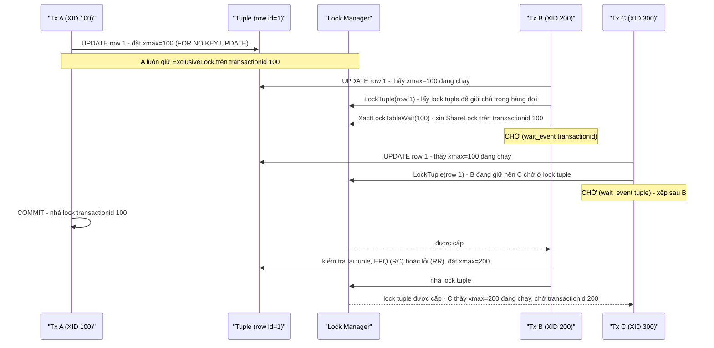
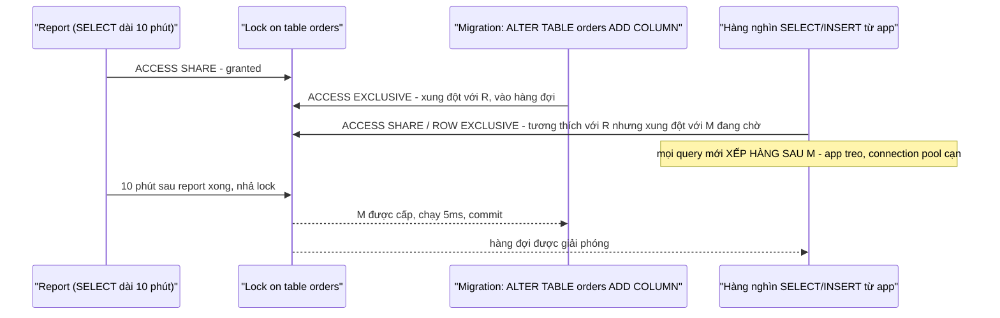

# PART 13 — LOCKING

> **Trước:** [12 — Isolation Level](12-isolation-level.md) · **Tiếp:** [14 — Deadlock](14-deadlock.md)
> **Độ ưu tiên:** Rất cao. Phần lớn sự cố "database treo" trong production là vấn đề lock, không phải CPU hay I/O.

---

## Mục lục

1. [Simple mental model](#1-simple-mental-model)
2. [Locks vs MVCC: MVCC loại bỏ lock nào, lock nào vẫn cần](#2-locks-vs-mvcc)
3. [Kiến trúc lock trong PostgreSQL: các loại lock tag](#3-kiến-trúc-lock)
4. [Concept: Table-level locks (8 mode)](#4-concept-table-level-locks)
5. [Concept: Row-level locks (4 mode)](#5-concept-row-level-locks)
6. [Row lock được lưu và chờ như thế nào (internals)](#6-row-lock-internals)
7. [NOWAIT và SKIP LOCKED](#7-nowait-và-skip-locked)
8. [Concept: Blocking và Wait Queue](#8-concept-blocking-và-wait-queue)
9. [Fast-path locking và giới hạn lock table](#9-fast-path-locking)
10. [Predicate Locks](#10-predicate-locks)
11. [Concept: Advisory Locks](#11-concept-advisory-locks)
12. [Timeouts: lock_timeout, statement_timeout, deadlock_timeout...](#12-timeouts)
13. [What happens if...](#13-what-happens-if)
14. [Production: chẩn đoán blocking và migration an toàn](#14-production)
15. [Trade-off & so sánh](#15-trade-off--so-sánh)
16. [Common misunderstandings](#16-common-misunderstandings)
17. [Interview Questions](#17-interview-questions)
18. [Key Takeaways](#18-key-takeaways)

---

## 1. Simple mental model

- **Table lock** là tấm biển treo ở **cửa phòng**: "đang có người đọc" (nhiều người cùng treo được), "đang có người sửa đồ trong phòng" (nhiều người sửa *các đồ khác nhau* cùng lúc được), "đang sửa chữa cấu trúc phòng — cấm vào" (một mình).
- **Row lock** là **dấu tên dán trên từng món đồ**: "tôi đang sửa món này". Người khác muốn sửa cùng món phải đợi. Người chỉ nhìn (đọc) không cần đợi — MVCC cho họ nhìn phiên bản trước khi sửa.
- **Wait queue** là **hàng đợi ở cửa**: ai đến trước xếp trước; và một người đang đợi để "đóng cửa sửa chữa" sẽ khiến mọi người đến sau — kể cả người chỉ muốn nhìn — phải xếp hàng phía sau anh ta.

---

## 2. Locks vs MVCC

### 2.1 MVCC loại bỏ được gì

Với MVCC, **reader không cần lock dữ liệu** để đọc nhất quán, và **writer không chặn reader**. Không có "shared lock trên row khi SELECT" như 2PL.

### 2.2 Lock vẫn cần cho

| Nhu cầu | Cơ chế |
|---|---|
| Hai writer sửa **cùng một row** | Row lock (trong xmax) + chờ XID |
| Bảo vệ **cấu trúc** table khi đang dùng (không cho DROP/ALTER khi có query đang chạy) | Table lock (heavyweight) |
| DDL/maintenance loại trừ lẫn nhau (hai VACUUM trên cùng table, CREATE INDEX vs INSERT) | Table lock |
| Application muốn khóa một **row để quyết định dựa trên nó** (check-then-act) | `SELECT ... FOR UPDATE` |
| FK: không cho xóa row cha đang được tham chiếu | `FOR KEY SHARE` |
| Serializable | Predicate lock (không chặn) |
| Điều phối logic ở application (mutex phân tán) | Advisory lock |
| Mở rộng file relation | Relation extension lock |

---

## 3. Kiến trúc lock

### 3.1 Ba tầng (nhắc lại từ [Chương 04](04-postgresql-architecture.md#9-ba-loại-lock-nội-bộ))

Spinlock và LWLock bảo vệ cấu trúc shared memory trong thời gian cực ngắn. Chương này nói về **heavyweight lock** (còn gọi "regular lock") — lock trên **đối tượng logic**, được quản lý bởi **lock manager**, có mode, có hàng đợi, có deadlock detection, hiện trong `pg_locks`.

### 3.2 Lock tag — đối tượng nào có thể bị khóa

| `pg_locks.locktype` | Đối tượng | Ví dụ |
|---|---|---|
| `relation` | Table, index, sequence, view | Mọi query lấy lock trên relation nó dùng |
| `tuple` | Một tuple cụ thể | Tạm thời, khi **chờ** row lock (mục 6) |
| `transactionid` | Một XID | Mỗi transaction giữ ExclusiveLock trên XID của mình; người muốn chờ nó lấy ShareLock |
| `virtualxid` | Virtual XID | Chờ transaction (kể cả read-only) kết thúc — dùng bởi `CREATE INDEX CONCURRENTLY` |
| `extend` | Mở rộng relation | Khi thêm page mới |
| `page` | Một page | Hiếm; nội bộ của hash/GIN |
| `object` | Object catalog khác (schema, type...) | DDL |
| `advisory` | Khóa do application định nghĩa | `pg_advisory_lock(42)` |
| `spectoken` | Speculative insertion token | `INSERT ... ON CONFLICT` |

### 3.3 Lock manager internals (tóm lược)

- Bảng lock chính: hash table trong shared memory, key = LOCKTAG, value = LOCK (mode đã được cấp, hàng đợi chờ), cộng bảng PROCLOCK (ai giữ gì). Chia **16 partition** (`NUM_LOCK_PARTITIONS`), mỗi partition một LWLock (`LockManager` wait event khi contention).
- Kích thước tối đa bảng: `max_locks_per_transaction × (max_connections + max_prepared_transactions)` (con số là *trung bình*, một transaction có thể dùng nhiều hơn nếu người khác dùng ít).
- Lock được nhả ở **cuối transaction** (trừ advisory session lock và một số lock nội bộ). Không có "UNLOCK TABLE".

---

## 4. Concept: Table-level locks

### 4.1 WHAT — 8 mode

| Mode | Được lấy bởi (điển hình) |
|---|---|
| **ACCESS SHARE** | `SELECT` (mọi query chỉ đọc table) |
| **ROW SHARE** | `SELECT ... FOR UPDATE / FOR NO KEY UPDATE / FOR SHARE / FOR KEY SHARE` |
| **ROW EXCLUSIVE** | `INSERT`, `UPDATE`, `DELETE`, `MERGE` (và `COPY FROM`) |
| **SHARE UPDATE EXCLUSIVE** | `VACUUM` (không FULL), `ANALYZE`, `CREATE INDEX CONCURRENTLY`, `REINDEX CONCURRENTLY`, `CREATE STATISTICS`, `COMMENT ON`, một số `ALTER TABLE` (`VALIDATE CONSTRAINT`, `SET STATISTICS`, một số storage parameter), `ALTER TABLE ... ATTACH PARTITION` (trên table cha, PG 12+), `DETACH PARTITION CONCURRENTLY` |
| **SHARE** | `CREATE INDEX` (không CONCURRENTLY) |
| **SHARE ROW EXCLUSIVE** | `CREATE TRIGGER`, `ALTER TABLE ... ADD FOREIGN KEY` (trên cả hai table) |
| **EXCLUSIVE** | `REFRESH MATERIALIZED VIEW CONCURRENTLY` |
| **ACCESS EXCLUSIVE** | `DROP TABLE`, `TRUNCATE`, `REINDEX` (thường), `CLUSTER`, `VACUUM FULL`, `REFRESH MATERIALIZED VIEW` (thường), `LOCK TABLE` (mặc định), **đa số `ALTER TABLE`** |

Tên mode mang tính lịch sử và **gây hiểu lầm**: "ROW EXCLUSIVE" là **lock trên table**, không phải row lock; nó chỉ có nghĩa "tôi sẽ sửa một số row".

### 4.2 Conflict matrix

✗ = xung đột (người yêu cầu phải chờ).

| Yêu cầu \ Đang giữ | ACCESS SHARE | ROW SHARE | ROW EXCL | SHARE UPD EXCL | SHARE | SHARE ROW EXCL | EXCL | ACCESS EXCL |
|---|---|---|---|---|---|---|---|---|
| **ACCESS SHARE** | | | | | | | | ✗ |
| **ROW SHARE** | | | | | | | ✗ | ✗ |
| **ROW EXCLUSIVE** | | | | | ✗ | ✗ | ✗ | ✗ |
| **SHARE UPDATE EXCL** | | | | ✗ | ✗ | ✗ | ✗ | ✗ |
| **SHARE** | | | ✗ | ✗ | | ✗ | ✗ | ✗ |
| **SHARE ROW EXCL** | | | ✗ | ✗ | ✗ | ✗ | ✗ | ✗ |
| **EXCLUSIVE** | | ✗ | ✗ | ✗ | ✗ | ✗ | ✗ | ✗ |
| **ACCESS EXCLUSIVE** | ✗ | ✗ | ✗ | ✗ | ✗ | ✗ | ✗ | ✗ |

### 4.3 Đọc matrix bằng các câu hỏi thực tế

| Câu hỏi | Trả lời từ matrix |
|---|---|
| SELECT có chặn INSERT/UPDATE không? | Không (ACCESS SHARE vs ROW EXCLUSIVE không xung đột). |
| Hai UPDATE trên cùng table có chặn nhau ở mức table không? | Không (ROW EXCLUSIVE tự tương thích). Chặn nhau chỉ nếu cùng row (row lock). |
| `CREATE INDEX` có chặn ghi không? | **Có** (SHARE vs ROW EXCLUSIVE). Chặn đọc? Không. |
| `CREATE INDEX CONCURRENTLY` có chặn ghi không? | Không (SHARE UPDATE EXCLUSIVE vs ROW EXCLUSIVE). Nhưng tự xung đột: không chạy song song hai CIC/VACUUM trên cùng table. |
| VACUUM có chặn đọc/ghi không? | Không. Chỉ xung đột với DDL và maintenance khác. |
| `ALTER TABLE ADD COLUMN` có chặn SELECT không? | **Có** — ACCESS EXCLUSIVE chặn tất cả, dù chỉ giữ vài ms. |
| Autovacuum có chặn `ALTER TABLE` không? | Có (SUE vs AE). Autovacuum thường (không phải anti-wraparound) sẽ **tự hủy** khi phát hiện nó đang chặn người khác xin lock xung đột (sau `deadlock_timeout`); anti-wraparound autovacuum thì **không tự hủy** → DDL có thể bị kẹt sau nó. |

### 4.4 WHY có nhiều mode như vậy?

Để tối đa hóa concurrency: mỗi thao tác chỉ loại trừ đúng những gì thực sự xung đột với nó. Ví dụ VACUUM cần không bị DDL đổi cấu trúc, và không có VACUUM khác cùng lúc — nhưng hoàn toàn chạy được song song với đọc/ghi. Một hệ thống chỉ có "shared/exclusive" sẽ buộc VACUUM chọn giữa chặn mọi ghi hoặc không được bảo vệ.

---

## 5. Concept: Row-level locks

### 5.1 WHAT — 4 mode

| Mode | Lấy bởi | Ý nghĩa |
|---|---|---|
| **FOR KEY SHARE** | FK check (tự động) , `SELECT ... FOR KEY SHARE` | "Đừng xóa row này và đừng đổi key của nó" |
| **FOR SHARE** | `SELECT ... FOR SHARE` | "Đừng sửa/xóa row này" |
| **FOR NO KEY UPDATE** | `UPDATE` không đổi cột key; `SELECT ... FOR NO KEY UPDATE` | "Tôi sẽ sửa row nhưng không đổi key" |
| **FOR UPDATE** | `DELETE`; `UPDATE` đổi cột thuộc unique index (có thể được FK dùng); `SELECT ... FOR UPDATE` | "Tôi sẽ sửa/xóa row, kể cả key" |

"Key" ở đây = cột nằm trong **unique index** (không partial, không expression) có thể được FK tham chiếu.

### 5.2 Conflict matrix

| Yêu cầu \ Đang giữ | FOR KEY SHARE | FOR SHARE | FOR NO KEY UPDATE | FOR UPDATE |
|---|---|---|---|---|
| **FOR KEY SHARE** | | | | ✗ |
| **FOR SHARE** | | | ✗ | ✗ |
| **FOR NO KEY UPDATE** | | ✗ | ✗ | ✗ |
| **FOR UPDATE** | ✗ | ✗ | ✗ | ✗ |

### 5.3 WHY — Tại sao tách KEY SHARE / NO KEY UPDATE (PG 9.3)?

Trước 9.3, FK check lấy `FOR SHARE` trên row cha, và mọi UPDATE lấy `FOR UPDATE`. Hệ quả: một transaction insert order (FK → user 7) chặn **mọi UPDATE** trên user 7, kể cả `UPDATE users SET last_login = now()` — hoàn toàn vô hại với FK. Kết quả là blocking và deadlock tràn lan trong hệ thống có FK. Tách mode yếu hơn cho phép: FK check (KEY SHARE) và update cột thường (NO KEY UPDATE) **không xung đột**.

### 5.4 Row lock không chặn reader

`SELECT` thường (không FOR ...) **không bao giờ** bị row lock chặn — nó đọc version phù hợp snapshot. Chỉ các thao tác **lock/ghi** mới tranh nhau.

---

## 6. Row lock internals

### 6.1 Row lock được lưu **trong tuple**, không trong bộ nhớ

PostgreSQL **không** lưu row lock trong lock table (shared memory). Nó ghi thông tin lock vào **header của tuple**:
- `xmax` = XID của transaction khóa;
- cờ trong `t_infomask`: `HEAP_XMAX_LOCK_ONLY` (chỉ khóa, không xóa), `HEAP_XMAX_KEYSHR_LOCK`, `HEAP_XMAX_SHR_LOCK`, `HEAP_XMAX_EXCL_LOCK`, và `HEAP_KEYS_UPDATED` (trong infomask2) để phân biệt 4 mode.
- Nhiều transaction cùng giữ lock tương thích (vd nhiều FK check `FOR KEY SHARE`, hoặc KEY SHARE + NO KEY UPDATE) → `xmax` chứa **MultiXactId** (`HEAP_XMAX_IS_MULTI`), thành viên lưu trong `pg_multixact/members`.

**WHY:** Số row bị khóa không giới hạn bởi memory. SQL Server phải làm **lock escalation** (nâng hàng nghìn row lock thành table lock) để tiết kiệm memory; PostgreSQL không cần — `SELECT ... FOR UPDATE` trên 10 triệu row không tốn shared memory.

**Cái giá:** Khóa một row = **sửa tuple header** → page dirty → **WAL record** (`XLOG_HEAP_LOCK`) → có thể FPI. `SELECT FOR UPDATE` trên nhiều row là một thao tác **ghi**. Và MultiXact có SLRU riêng, có thể là nút thắt; MultiXact ID cũng 32-bit và cần **freeze** như XID (`autovacuum_multixact_freeze_max_age`).

### 6.2 Chờ row lock diễn ra thế nào



**Cách đọc diagram:**
1. A khóa row bằng cách ghi xmax. Không có gì trong lock manager ngoài lock trên XID của chính A (luôn có).
2. B muốn khóa cùng row: thấy xmax = 100 đang chạy. B lấy **heavyweight lock trên tuple** (để xác lập thứ tự hàng đợi giữa những người cùng chờ row này) rồi **chờ trên transactionid 100**.
3. C đến sau: bị chặn ngay ở **tuple lock** do B giữ → xếp sau B. Nhờ vậy khi A xong, B (đến trước) được ưu tiên — tránh starvation.
4. A commit → lock XID 100 được nhả → B tỉnh dậy, kiểm tra lại tuple (RC: EPQ trên version mới; RR: lỗi 40001 nếu A đã update), đặt xmax = 200, nhả tuple lock → C tiến lên và giờ chờ XID 200.

Trong `pg_locks`, người đang chờ row lock thường hiện là `locktype = transactionid, mode = ShareLock, granted = false` — nghĩa là "chờ transaction kia kết thúc", không phải "chờ một row cụ thể". Dùng `pg_blocking_pids(pid)` để biết ai đang chặn.

---

## 7. NOWAIT và SKIP LOCKED

| Tùy chọn | Hành vi khi row đã bị khóa |
|---|---|
| (mặc định) | Chờ |
| `NOWAIT` | Lỗi ngay: `could not obtain lock on row in relation ...` (SQLSTATE `55P03`) |
| `SKIP LOCKED` | **Bỏ qua** row đó, trả các row còn lại |

**SKIP LOCKED — pattern job queue:**

```sql
BEGIN;
SELECT id, payload FROM jobs
WHERE status = 'pending'
ORDER BY priority, id
LIMIT 10
FOR UPDATE SKIP LOCKED;
-- xử lý ...
UPDATE jobs SET status = 'done' WHERE id = ANY(...);
COMMIT;
```

Nhiều worker chạy song song, mỗi worker lấy 10 job **khác nhau** mà không chờ nhau. Lưu ý: SKIP LOCKED cho **góc nhìn không nhất quán** (bỏ qua row có thật) — phù hợp cho queue, không phù hợp cho truy vấn cần kết quả chính xác. Và nhớ các vấn đề MVCC của queue table ([Chương 11 §15.1](11-mvcc.md#151-queue-table-trên-postgresql)).

---

## 8. Concept: Blocking và Wait Queue

### 8.1 WHAT

Khi một yêu cầu lock xung đột với lock **đang được giữ** hoặc với yêu cầu **đang chờ trước nó** (ở một số trường hợp), backend được đưa vào **wait queue** của lock đó và ngủ (trên semaphore) cho tới khi được cấp, hết `lock_timeout`, bị cancel, hoặc bị chọn làm nạn nhân deadlock.

### 8.2 HOW — Luật hàng đợi và "lock queue hazard"

Lock manager của PostgreSQL xét yêu cầu mới đối với **cả những người đang giữ lẫn những người đang chờ**: nếu yêu cầu mới xung đột với một yêu cầu **đang chờ** phía trước, nó thường phải xếp hàng sau, dù nó tương thích với mọi người đang giữ. Mục đích: **tránh starvation** cho lock mạnh (nếu không, luồng SELECT liên tục sẽ khiến `ALTER TABLE` không bao giờ lấy được ACCESS EXCLUSIVE).

Hệ quả nổi tiếng:



**Cách đọc diagram:** ALTER TABLE chỉ cần 5ms, nhưng vì phải chờ report 10 phút, và **mọi query sau nó phải chờ nó**, toàn bộ table `orders` bị "đóng băng" 10 phút. Connection pool của application cạn, request timeout, có thể dẫn tới cascading failure. Đây là **sự cố migration phổ biến nhất** với PostgreSQL.

**Phòng chống:**
```sql
SET lock_timeout = '2s';
ALTER TABLE orders ADD COLUMN note text;   -- thất bại nhanh nếu không lấy được lock trong 2s
-- retry với backoff; hoặc chờ thời điểm ít tải; hoặc kill query dài trước
```

### 8.3 Lock upgrade — lấy lock yếu rồi lấy lock mạnh

Transaction giữ ACCESS SHARE (đã SELECT) rồi muốn ACCESS EXCLUSIVE (ALTER) trên cùng table → nếu có người khác cũng giữ ACCESS SHARE, phải chờ họ; nếu họ lại chờ mình → deadlock. Pattern "đọc rồi nâng cấp lock" là nguồn deadlock kinh điển ([Chương 14](14-deadlock.md)).

---

## 9. Fast-path locking

### 9.1 WHAT

Hầu hết lock là **lock yếu trên relation** (ACCESS SHARE, ROW SHARE, ROW EXCLUSIVE) — cực kỳ phổ biến (mọi query) và hầu như không bao giờ xung đột. Đưa tất cả vào lock table chung (với LWLock partition) sẽ là nút thắt. **Fast-path**: mỗi backend có một mảng nhỏ trong PGPROC lưu các lock yếu này **cục bộ**, không đụng lock table chung.

### 9.2 HOW

- Trước PG 18: tối đa **16** fast-path slot mỗi backend (`FP_LOCK_SLOTS_PER_BACKEND`). PG 18: số slot **tăng theo `max_locks_per_transaction`** (release notes nhắc tới cải tiến fast-path; cơ chế cấu hình theo `max_locks_per_transaction`).
- Khi ai đó muốn lock **mạnh** (SHARE trở lên) trên một relation, nó tăng "strong lock count" của relation đó và **chuyển** các fast-path lock của người khác trên relation đó vào lock table chung để kiểm tra xung đột.

### 9.3 WHAT HAPPENS IF — Vượt fast-path

Query chạm vào **nhiều relation** (table + mọi index của nó — mỗi index cũng một lock!; table partition với hàng trăm partition không được prune; view join nhiều table) vượt quá số slot → phần dư đi vào lock table chung → dưới tải cao, contention trên LWLock `LockManager` (wait event `LWLock:LockManager`) → throughput sụp đổ dù CPU chưa đầy. Đây là vấn đề thực tế với partitioned table nhiều partition + query không prune được lúc plan, hoặc table có rất nhiều index. PG 18 giảm đáng kể vấn đề này; PG 19 (beta) còn nâng mặc định `max_locks_per_transaction` từ 64 lên 128.

---

## 10. Predicate Locks

`SIReadLock` của Serializable ([Chương 12 §8.4](12-isolation-level.md#84-internals--predicate-locks-siread-locks)). Chúng có trong `pg_locks` nhưng **không bao giờ gây chờ** — chỉ dùng để phát hiện xung đột đọc–ghi. Được giữ cả sau khi transaction commit cho tới khi mọi transaction chồng lấn kết thúc.

---

## 11. Concept: Advisory Locks

### 11.1 WHAT

Lock mà **ý nghĩa do application quyết định**: key là một số `bigint` (hoặc cặp `int, int`). PostgreSQL chỉ đảm bảo loại trừ lẫn nhau theo key.

| Hàm | Phạm vi | Hành vi |
|---|---|---|
| `pg_advisory_lock(key)` | **Session** | Chờ; giữ tới khi `pg_advisory_unlock` hoặc session kết thúc; **không** nhả khi transaction kết thúc; có thể lấy nhiều lần (đếm reentrant) |
| `pg_try_advisory_lock(key)` | Session | Không chờ; trả true/false |
| `pg_advisory_xact_lock(key)` | **Transaction** | Nhả tự động cuối transaction |
| `pg_try_advisory_xact_lock(key)` | Transaction | Không chờ |
| `..._shared` biến thể | | Shared mode |

### 11.2 WHY / Use cases

- **Leader election nhẹ** cho cron job chạy trên nhiều instance: chỉ instance lấy được `pg_try_advisory_lock(12345)` mới chạy job.
- **Serialize migration** (nhiều công cụ migration dùng advisory lock để hai pod không chạy migration cùng lúc).
- Khóa một **khái niệm không phải row**: "đang xử lý thanh toán cho user 7" (`pg_advisory_xact_lock(7)`), "đang tạo báo cáo ngày X".
- Tránh race trong "check-then-insert" khi không có unique constraint phù hợp.

### 11.3 WHAT HAPPENS IF / Pitfalls

- **Session-level lock + connection pool transaction mode (PgBouncer):** lock gắn với *backend*, nhưng transaction tiếp theo của bạn có thể đi vào backend khác → không unlock được; lock "rò rỉ" ở backend kia, được giữ bởi một connection mà application khác đang dùng. **Dùng xact-level lock với transaction pooling.**
- Quên unlock session lock → giữ tới khi connection đóng (pool giữ connection sống nhiều ngày).
- Key collision giữa các module dùng chung không gian số → dùng dạng hai tham số `(namespace_int, id_int)` hoặc hash có quy ước.
- Advisory lock tham gia deadlock detection như lock thường.
- `pg_locks.locktype = 'advisory'` để quan sát.

---

## 12. Timeouts

| Tham số | Ý nghĩa | Khuyến nghị |
|---|---|---|
| `lock_timeout` | Thời gian tối đa **chờ một lock** (bất kỳ lock heavyweight nào) trong một câu lệnh | Đặt ngắn (vài giây) cho DDL/migration; có thể đặt ở mức role cho app |
| `statement_timeout` | Thời gian tối đa của một câu lệnh (bao gồm chờ lock) | Đặt ở mức role/app phù hợp SLA |
| `idle_in_transaction_session_timeout` | Ngắt session `idle in transaction` quá lâu | Bắt buộc có trong production (vd 30s–5 phút tùy app) |
| `transaction_timeout` (PG 17) | Thời gian tối đa của cả transaction | Chặn transaction dài |
| `deadlock_timeout` | Chờ bao lâu trước khi **chạy deadlock detection**; cũng là ngưỡng log khi `log_lock_waits = on` | Mặc định 1s thường ổn |
| `log_lock_waits` | Log khi một lần chờ lock vượt `deadlock_timeout` | **Nên bật** (PG 19 beta bật mặc định) |

---

## 13. What happens if...

| Tình huống | Hành vi |
|---|---|
| **Hai transaction UPDATE cùng row** | Người sau chờ trên XID của người trước (mục 6). |
| **Transaction giữ row lock rồi `idle in transaction`** | Mọi người muốn update row đó chờ vô thời hạn → pool cạn. |
| **`SELECT ... FOR UPDATE` trên 1 triệu row** | Không tốn shared memory, nhưng ghi 1 triệu tuple header → WAL + page dirty; các row bị khóa tới commit. |
| **Nhiều transaction cùng FK tới một row cha "nóng"** | Mỗi FK check `FOR KEY SHARE` → nhiều locker → MultiXact được tạo/mở rộng liên tục → áp lực `pg_multixact`, có thể contention `MultiXactOffset/MemberSLRU`. |
| **DDL chờ sau query dài** | Lock queue hazard (mục 8.2). |
| **Anti-wraparound autovacuum đang chạy trên table, bạn chạy ALTER TABLE** | ALTER chờ (autovacuum loại này không tự nhường) → mọi query sau ALTER chờ theo. |
| **Hết slot lock table** | `ERROR: out of shared memory — HINT: You might need to increase max_locks_per_transaction.` |
| **Advisory session lock + PgBouncer transaction mode** | Lock rò rỉ sang session khác. |

---

## 14. Production

### 14.1 Chẩn đoán blocking

```sql
-- Ai đang chờ ai
SELECT a.pid, a.usename, a.state, a.wait_event_type, a.wait_event,
       pg_blocking_pids(a.pid) AS blocked_by,
       now() - a.query_start AS query_age, left(a.query, 80) AS query
FROM pg_stat_activity a
WHERE cardinality(pg_blocking_pids(a.pid)) > 0;

-- Kẻ chặn gốc (không bị ai chặn nhưng đang chặn người khác)
SELECT pid, state, now() - xact_start AS xact_age, left(query, 80)
FROM pg_stat_activity
WHERE pid IN (SELECT unnest(pg_blocking_pids(pid)) FROM pg_stat_activity)
  AND cardinality(pg_blocking_pids(pid)) = 0;
```

Logic chẩn đoán:
1. `wait_event_type = 'Lock'` hàng loạt → blocking chain. Tìm **gốc** (thường là `idle in transaction` hoặc query/DDL dài).
2. `wait_event = 'transactionid'` → chờ row lock (người khác đang sửa row).
3. `wait_event = 'relation'` → chờ table lock (thường do DDL/maintenance).
4. `wait_event = 'tuple'` → nhiều người cùng xếp hàng trên một row (hot row).
5. `wait_event_type = 'LWLock'`, `LockManager` → contention lock manager (fast-path overflow).
6. Quyết định: `pg_cancel_backend` (hủy câu lệnh) hay `pg_terminate_backend` (ngắt session — cần cho `idle in transaction`).

### 14.2 Checklist migration an toàn (zero-downtime)

1. `SET lock_timeout = '2s'` (và retry có backoff).
2. `CREATE INDEX CONCURRENTLY` thay `CREATE INDEX`.
3. Constraint: `ADD ... NOT VALID` → `VALIDATE CONSTRAINT` riêng.
4. `ADD COLUMN` với default non-volatile (metadata-only, PG 11+).
5. Đổi kiểu cột lớn: thêm cột mới, backfill theo batch, đổi app, drop cột cũ.
6. PK/UNIQUE trên table lớn: `CREATE UNIQUE INDEX CONCURRENTLY` → `ADD CONSTRAINT ... USING INDEX`.
7. Tránh chạy khi có anti-wraparound vacuum hoặc report dài trên table đó.
8. Partition: `ATTACH PARTITION` (SUE trên cha, PG 12+) — tạo trước CHECK constraint khớp partition bound để tránh scan; `DETACH PARTITION CONCURRENTLY` (PG 14).

---

## 15. Trade-off & so sánh

| | PostgreSQL | MySQL/InnoDB | SQL Server |
|---|---|---|---|
| Row lock lưu ở đâu | Tuple header (xmax) | Lock system trong memory (bitmap theo page) | Lock manager memory |
| Giới hạn số row lock | Không (disk) | Memory | Memory → **lock escalation** thành table lock |
| Gap/next-key lock | **Không** (dùng SSI cho serializable) | **Có** ở RR (chặn insert vào khoảng) | Range lock ở Serializable |
| Reader bị writer chặn | Không (MVCC) | Không cho consistent read; có cho locking read | Có (trừ khi bật RCSI/snapshot) |
| DDL lock | ACCESS EXCLUSIVE, transactional DDL | Metadata lock (MDL), online DDL (INSTANT/INPLACE) | Sch-M lock |
| Chi phí lock một row | Ghi page + WAL | Memory | Memory |

---

## 16. Common misunderstandings

1. **"ROW EXCLUSIVE là row lock."** — Là table lock mode mà DML lấy.
2. **"SELECT FOR UPDATE chỉ tốn memory."** — Nó ghi vào tuple → I/O + WAL.
3. **"MVCC nghĩa là không có blocking."** — Writer–writer và DDL vẫn blocking.
4. **"ALTER TABLE ADD COLUMN nhanh nên an toàn."** — Nhanh khi đã có lock; có thể chờ và làm nghẽn mọi query.
5. **"VACUUM khóa table."** — VACUUM thường chỉ lấy SHARE UPDATE EXCLUSIVE, không chặn đọc/ghi. (VACUUM FULL thì khóa toàn bộ.)
6. **"Lock được nhả khi câu lệnh xong."** — Heavyweight lock nhả cuối transaction.
7. **"PostgreSQL có lock escalation."** — Không (với row lock). Predicate lock có "promotion" nhưng không gây chặn.

---

## 17. Interview Questions

**Q1. Liệt kê các table lock mode và cho ví dụ lệnh nào lấy mode nào.**
- *Short:* 8 mode từ ACCESS SHARE (SELECT) → ACCESS EXCLUSIVE (DROP, ALTER TABLE); ROW EXCLUSIVE cho DML; SHARE UPDATE EXCLUSIVE cho VACUUM/CIC; SHARE cho CREATE INDEX.
- *Follow-up:* Tại sao CREATE INDEX chặn ghi còn CREATE INDEX CONCURRENTLY thì không?

**Q2. Row lock trong PostgreSQL được lưu ở đâu? Hệ quả?**
- *Short:* Trong xmax + infomask của tuple (MultiXact khi nhiều locker). Không giới hạn số lượng, không escalation, nhưng khóa row là thao tác ghi.

**Q3. Tại sao một `ALTER TABLE` nhỏ có thể làm treo toàn bộ ứng dụng?**
- *Short:* Chờ ACCESS EXCLUSIVE sau query dài; mọi query mới xếp hàng sau nó. Dùng lock_timeout + retry.

**Q4. FOR UPDATE vs FOR NO KEY UPDATE vs FOR KEY SHARE?**
- *Short:* Mức độ độc quyền giảm dần; tách để FK check không xung đột với update cột không phải key.

**Q5. SKIP LOCKED dùng khi nào?**
- *Short:* Job queue — nhiều worker lấy việc không chồng chéo, không chờ nhau.

**Q6. Advisory lock là gì? Rủi ro với PgBouncer?**
- *Short:* Lock theo key do app định nghĩa; session-level lock không tương thích với transaction pooling.

**Q7. (Senior) `wait_event = LockManager` tăng vọt, CPU không cao. Nguyên nhân khả dĩ?**
- *Short:* Fast-path overflow: query chạm quá nhiều relation (partition không prune, nhiều index) → lock table chung contention. Giảm số relation mỗi query, prune tốt hơn, nâng cấp PG 18.

**Q8. (Senior) Làm sao tìm "root blocker"?**
- *Short:* `pg_blocking_pids`, tìm pid chặn người khác mà không bị ai chặn; thường là idle in transaction.

---

## 18. Key Takeaways

1. MVCC loại bỏ lock giữa reader và writer; **writer–writer, DDL, maintenance** vẫn dùng lock.
2. **8 table lock mode**; DML lấy ROW EXCLUSIVE (không xung đột lẫn nhau); đa số ALTER TABLE lấy ACCESS EXCLUSIVE (xung đột tất cả).
3. **4 row lock mode**; UPDATE thường lấy FOR NO KEY UPDATE; FK check lấy FOR KEY SHARE → không xung đột.
4. Row lock **lưu trong tuple (xmax)** → không giới hạn, không escalation, nhưng là thao tác ghi; nhiều locker → MultiXact.
5. Chờ row lock = chờ **transactionid** của người đang giữ (+ tuple lock để xếp hàng).
6. **Lock queue hazard**: request mạnh đang chờ chặn mọi request sau → luôn `lock_timeout` cho DDL.
7. Fast-path cho lock yếu; vượt quá → LockManager contention.
8. Advisory lock: dùng xact-level với pooler.
9. Bật `log_lock_waits`, đặt `idle_in_transaction_session_timeout`.

---

## Nguồn tham khảo

- PostgreSQL Docs — *Explicit Locking*: https://www.postgresql.org/docs/current/explicit-locking.html
- PostgreSQL Docs — *pg_locks*: https://www.postgresql.org/docs/current/view-pg-locks.html
- PostgreSQL Docs — *ALTER TABLE* (lock level của từng subcommand): https://www.postgresql.org/docs/current/sql-altertable.html
- PostgreSQL source: `src/backend/storage/lmgr/README`, `lock.c`, `src/backend/access/heap/README.tuplock`.
- PostgreSQL 9.3 Release Notes (FOR KEY SHARE / FOR NO KEY UPDATE), PG 18/19 Release Notes (fast-path, max_locks_per_transaction, log_lock_waits).
