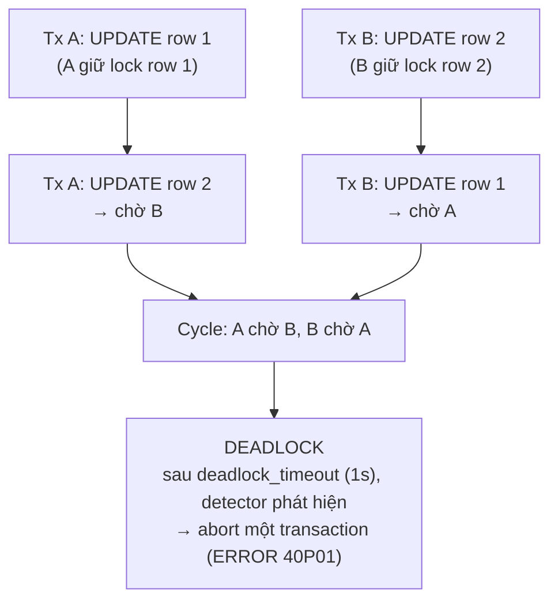
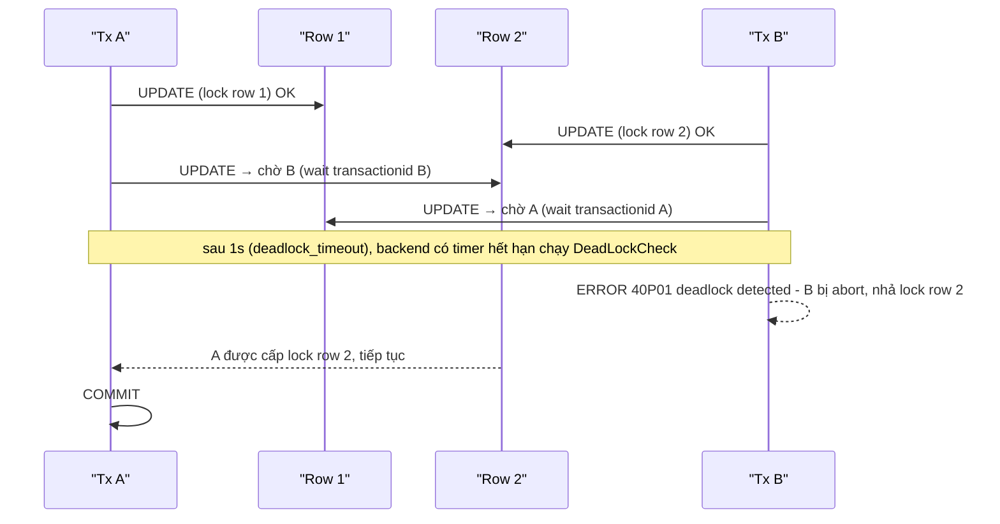
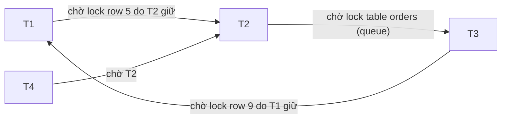

# PART 14 — DEADLOCK

> **Trước:** [13 — Locking](13-locking.md) · **Tiếp:** [15 — Index Internals](15-index-internals.md)

---

## Mục lục

1. [Simple mental model](#1-simple-mental-model)
2. [WHAT — Deadlock là gì](#2-what)
3. [WHY — Tại sao database phải phát hiện deadlock](#3-why)
4. [HOW — Wait-for graph](#4-how--wait-for-graph)
5. [INTERNALS — PostgreSQL phát hiện deadlock thế nào](#5-internals)
6. [EXAMPLE — Các mẫu deadlock thường gặp](#6-example--các-mẫu-deadlock-thường-gặp)
7. [WHAT HAPPENS IF...](#7-what-happens-if)
8. [PERFORMANCE IMPACT](#8-performance-impact)
9. [PRODUCTION — Debugging deadlock](#9-production--debugging-deadlock)
10. [Prevention](#10-prevention)
11. [TRADE-OFF](#11-trade-off)
12. [COMMON MISUNDERSTANDINGS](#12-common-misunderstandings)
13. [INTERVIEW QUESTIONS](#13-interview-questions)
14. [KEY TAKEAWAYS](#14-key-takeaways)

---

## 1. Simple mental model

Hai xe gặp nhau trên cây cầu một làn: mỗi xe đã đi được nửa cầu, mỗi xe chờ xe kia lùi. Không ai lùi thì cả hai chờ mãi. Cần một **cảnh sát** (deadlock detector) nhận ra tình huống và bắt **một** xe lùi (abort), để xe kia đi.

---

## 2. WHAT

**Deadlock** là tình trạng một tập transaction **chờ lẫn nhau theo vòng tròn**: mỗi transaction giữ một tài nguyên mà transaction kế tiếp cần, và chờ một tài nguyên do transaction trước đó giữ. Không transaction nào có thể tiến lên.

Bốn điều kiện cần (Coffman, 1971) — deadlock chỉ xảy ra khi **cả bốn** cùng đúng:
1. **Mutual exclusion:** tài nguyên không chia sẻ được (exclusive lock).
2. **Hold and wait:** giữ tài nguyên này trong khi chờ tài nguyên khác.
3. **No preemption:** không thể giật tài nguyên từ người đang giữ.
4. **Circular wait:** có chu trình trong quan hệ chờ.

Database không thể loại bỏ 1–3 (lock phải exclusive, transaction phải giữ lock tới commit để đảm bảo isolation, không thể giật lock giữa chừng mà không abort). Nên database **phát hiện** chu trình (4) và **phá** nó bằng abort.

### Diagram bắt buộc



**Cách đọc diagram (trên xuống):** A khóa row 1, B khóa row 2 (song song, không xung đột). Sau đó A cần row 2 (B giữ) → A chờ. B cần row 1 (A giữ) → B chờ. Hai cạnh chờ tạo thành chu trình → không ai tự thoát được → deadlock. PostgreSQL phát hiện sau khi một bên đã chờ quá `deadlock_timeout` và abort một bên.



---

## 3. WHY

Nếu không phát hiện: các transaction trong chu trình **chờ vĩnh viễn**, giữ lock → những transaction khác cần các lock đó cũng chờ → hiệu ứng lan truyền → connection pool cạn → hệ thống ngừng phục vụ. Chỉ có timeout (statement_timeout/lock_timeout) mới cứu — nhưng timeout không phân biệt chờ lâu vì tải với chờ vô vọng vì deadlock.

---

## 4. HOW — Wait-for graph

**Wait-for graph (WFG):** đồ thị có hướng, mỗi node là một transaction (process), cạnh `P → Q` nghĩa là "P đang chờ một lock mà Q giữ (hoặc Q đứng trước P trong hàng đợi và yêu cầu xung đột)". **Deadlock ⇔ WFG có chu trình.**



**Cách đọc diagram:** T1 → T2 → T3 → T1 là chu trình → deadlock giữa ba transaction. T4 chờ T2 nhưng không thuộc chu trình — T4 là "nạn nhân phụ": sẽ được giải phóng khi chu trình bị phá (nếu T2 được tiếp tục) hoặc tiếp tục chờ. Deadlock không nhất thiết chỉ hai bên.

---

## 5. INTERNALS

### 5.1 Phát hiện "lười" (lazy detection)

PostgreSQL **không** kiểm tra deadlock mỗi lần một backend bắt đầu chờ lock. Thay vào đó:
1. Backend bắt đầu chờ → đặt timer `deadlock_timeout` (mặc định **1s**) → ngủ.
2. Nếu được cấp lock trước khi timer hết → không kiểm tra gì cả.
3. Nếu timer hết → backend thức dậy và chạy `DeadLockCheck()`.

**WHY lazy?** Kiểm tra deadlock đòi hỏi **khóa toàn bộ lock table** (mọi partition LWLock) và duyệt đồ thị — đắt. Hầu hết lần chờ lock kết thúc trong mili giây (người kia commit). Giả định lạc quan: đa số chờ không phải deadlock → chỉ kiểm tra khi đã chờ "khá lâu". Cái giá: một deadlock thật tồn tại ít nhất 1 giây trước khi bị phá.

### 5.2 DeadLockCheck làm gì

1. Lấy mọi partition lock của lock manager (tạm "đóng băng" lock table).
2. Duyệt WFG bắt đầu từ chính mình, tìm chu trình quay về mình. Có hai loại cạnh:
   - **Hard edge:** P chờ lock mà Q **đang giữ** ở mode xung đột.
   - **Soft edge:** P chờ vì Q **đứng trước P trong hàng đợi** với yêu cầu xung đột (Q cũng đang chờ).
3. Nếu chu trình chỉ gồm được qua **soft edge**, PostgreSQL thử **sắp xếp lại hàng đợi** (đưa một yêu cầu lên trước) để phá chu trình mà **không cần abort ai**.
4. Nếu có chu trình **hard** không phá được → **backend đang chạy kiểm tra tự abort** với:
   ```
   ERROR:  deadlock detected
   DETAIL:  Process 12345 waits for ShareLock on transaction 1001; blocked by process 12346.
            Process 12346 waits for ShareLock on transaction 1002; blocked by process 12345.
   HINT:  See server log for query details.
   CONTEXT: while updating tuple (0,2) in relation "accounts"
   ```
   SQLSTATE **`40P01`**.
5. Nếu không có chu trình → tiếp tục chờ (và nếu `log_lock_waits = on`, ghi log "still waiting for ... after 1000 ms").

### 5.3 Transaction nào bị kill?

**Không phải theo "chi phí" hay "tuổi"** như một số database khác (SQL Server chọn theo `DEADLOCK_PRIORITY` và chi phí rollback). Trong PostgreSQL, nạn nhân là **transaction có timer deadlock_timeout hết hạn trước và phát hiện chu trình** — thường là transaction **bắt đầu chờ sớm nhất** trong chu trình. Trên thực tế gần như ngẫu nhiên từ góc nhìn application. Hệ quả: **mọi transaction có thể là nạn nhân → mọi code path cần retry cho 40P01**.

Vì rollback trong PostgreSQL là O(1), không có lý do mạnh để chọn "transaction ít việc nhất" làm nạn nhân như database có undo.

### 5.4 Deadlock mà PostgreSQL KHÔNG phát hiện được

- **Chờ ngoài database:** Tx A giữ row lock rồi gọi HTTP tới service X; service X mở Tx B cần cùng row → B chờ A, A chờ HTTP response, HTTP chờ B. Detector chỉ thấy "B chờ A" (không chu trình trong DB). Chỉ timeout cứu.
- **Deadlock giữa nhiều database/shard:** Tx trên shard 1 chờ Tx trên shard 2 và ngược lại (distributed deadlock) — mỗi node chỉ thấy một nửa đồ thị.
- **Deadlock với application-level mutex** (Redis lock + DB lock).
- **LWLock deadlock:** bug trong code (không phải kịch bản người dùng).

---

## 6. EXAMPLE — Các mẫu deadlock thường gặp

### 6.1 Thứ tự cập nhật ngược nhau (kinh điển)

Chuyển tiền A→B và B→A đồng thời, mỗi transaction update tài khoản nguồn trước:
```sql
-- T1: transfer(A → B)          -- T2: transfer(B → A)
UPDATE acc ... WHERE id='A';    UPDATE acc ... WHERE id='B';
UPDATE acc ... WHERE id='B';    UPDATE acc ... WHERE id='A';   -- deadlock
```
**Sửa:** luôn khóa theo **thứ tự xác định** (ví dụ id nhỏ trước): `SELECT ... FROM acc WHERE id IN ('A','B') ORDER BY id FOR UPDATE;` rồi mới update.

### 6.2 Batch UPDATE không có thứ tự

Hai job cùng chạy `UPDATE items SET ... WHERE category = 5` — mỗi câu khóa row theo thứ tự **scan** (có thể khác nhau nếu plan khác nhau, hoặc nếu một bên dùng index, một bên seq scan; hoặc synchronized seqscan bắt đầu ở vị trí khác). Hai câu chạm các row chung theo thứ tự khác → deadlock. **Sửa:** khóa trước với `ORDER BY` + `FOR UPDATE`, hoặc chia batch không chồng lấn.

### 6.3 Lock upgrade

```sql
-- T1 và T2 cùng:
SELECT * FROM acc WHERE id = 1 FOR SHARE;   -- cả hai giữ FOR SHARE (tương thích)
UPDATE acc SET ... WHERE id = 1;            -- cả hai cần FOR NO KEY UPDATE → chờ nhau → deadlock
```
Tương tự ở mức table: hai transaction `SELECT` (ACCESS SHARE) rồi cùng `LOCK TABLE ... IN EXCLUSIVE MODE`. **Sửa:** lấy lock mạnh ngay từ đầu (`FOR UPDATE`).

### 6.4 Unique index insert

T1 insert key 1 rồi key 2; T2 insert key 2 rồi key 1 (cả hai chưa commit). T1 insert key 2 → thấy entry key 2 của T2 chưa commit → chờ T2. T2 insert key 1 → chờ T1 → deadlock. Xảy ra với batch upsert có thứ tự khác nhau. **Sửa:** sắp xếp dữ liệu theo key trước khi insert.

### 6.5 Foreign key

T1 insert order (FK → user 7, lấy FOR KEY SHARE trên user 7) rồi update user 7 cột... thường không xung đột (NO KEY UPDATE vs KEY SHARE tương thích). Nhưng: T1 và T2 cùng insert child (cả hai giữ KEY SHARE trên user 7), sau đó cả hai muốn **xóa** hoặc **đổi key** của user 7 (FOR UPDATE) → deadlock. Hoặc các mẫu phức tạp với `ON DELETE CASCADE` xóa row con theo thứ tự khác nhau.

### 6.6 Deadlock giữa DDL và DML

T1 (migration): `BEGIN; ALTER TABLE a ...; ALTER TABLE b ...;` — T2 (app): transaction đọc b rồi ghi a. T1 giữ AE trên a, chờ b (T2 giữ ACCESS SHARE); T2 chờ a → deadlock. **Sửa:** migration khóa các table theo thứ tự cố định, lock_timeout ngắn, tách migration thành transaction nhỏ.

---

## 7. WHAT HAPPENS IF...

| Tình huống | Hành vi |
|---|---|
| **Deadlock xảy ra** | Sau ≥ `deadlock_timeout`, một transaction nhận 40P01 và bị abort; các transaction còn lại tiếp tục. |
| **`deadlock_timeout` đặt quá thấp (vd 10ms)** | Detector chạy thường xuyên cho các lần chờ bình thường → tốn CPU, contention trên lock manager (lấy mọi partition lock). |
| **`deadlock_timeout` đặt quá cao (vd 60s)** | Deadlock thật giữ lock 60s → blocking lan rộng. |
| **`lock_timeout` < `deadlock_timeout`** | Lock timeout kích hoạt trước → lỗi `55P03 lock_not_available` thay vì 40P01; deadlock vẫn được "phá" nhưng qua timeout. |
| **Deadlock trong transaction đã làm nhiều việc** | Toàn bộ transaction rollback (O(1) nhưng mất công việc); retry phải làm lại từ đầu. |
| **Application nuốt lỗi 40P01 không retry** | Mất thao tác nghiệp vụ. |

---

## 8. PERFORMANCE IMPACT

- Mỗi deadlock = một transaction bị hủy + retry → lãng phí công việc + latency tăng ≥ `deadlock_timeout`.
- Trong lúc chờ (trước khi phát hiện), các lock bị giữ → blocking lan rộng.
- `DeadLockCheck` khóa toàn bộ lock table trong lúc chạy → nhiều kiểm tra đồng thời (khi có rất nhiều backend chờ lâu) gây contention.
- Deadlock tăng đột biến thường là **triệu chứng của contention** (hot row, batch job trùng thời điểm, thay đổi plan làm đổi thứ tự khóa), không chỉ bug logic.

---

## 9. PRODUCTION — Debugging deadlock

### 9.1 Thu thập dữ liệu

1. **Server log**: message `deadlock detected` với DETAIL liệt kê process, lock chờ, và (trong log server) **query của từng process**. Đây là nguồn chính.
2. **`pg_stat_database.deadlocks`**: bộ đếm tích lũy → vẽ theo thời gian để thấy xu hướng.
3. **`log_lock_waits = on`**: log các lần chờ > `deadlock_timeout` → thấy các "gần deadlock" và blocking dài.
4. Application log: stack trace nơi nhận 40P01.

### 9.2 Logic phân tích

1. Từ DETAIL, xác định **tài nguyên**: `ShareLock on transaction N` (row lock — chờ transaction), `relation` (table lock), `tuple`, `advisory`.
2. Từ CONTEXT (`while updating tuple (0,2) in relation "accounts"`) và query → biết row/table.
3. Tái dựng **thứ tự khóa** của mỗi transaction: code path nào, khóa gì trước, gì sau.
4. Tìm nguyên nhân gốc: thứ tự ngược, lock upgrade, batch không sắp xếp, cascade, trigger ẩn khóa thêm table khác, FK.
5. Sửa bằng thứ tự nhất quán hoặc giảm phạm vi khóa; thêm retry.

### 9.3 Deadlock tăng đột ngột sau deploy/thay đổi dữ liệu

Nguyên nhân thường gặp: code mới đổi thứ tự thao tác; plan thay đổi (index mới → thứ tự scan khác → thứ tự khóa row khác); job batch mới chạy trùng giờ cao điểm; tăng concurrency (thêm worker).

---

## 10. Prevention

| Kỹ thuật | Cơ chế | Ghi chú |
|---|---|---|
| **Thứ tự khóa nhất quán** | Loại bỏ circular wait | Quy tắc số 1: sắp theo PK; khóa table theo thứ tự cố định |
| **Khóa trước tất cả những gì cần** | `SELECT ... WHERE id IN (...) ORDER BY id FOR UPDATE` ở đầu transaction | Giảm hold-and-wait rải rác |
| **Lấy lock mạnh ngay từ đầu** | Tránh upgrade | `FOR UPDATE` thay vì `FOR SHARE` rồi `UPDATE` |
| **Transaction ngắn** | Giảm cửa sổ chồng lấn | Không gọi dịch vụ ngoài trong transaction |
| **Batch nhỏ, sắp xếp theo key** | Giảm số lock và giữ thứ tự | Upsert hàng loạt: `ORDER BY key` |
| **Dùng atomic operation** | `UPDATE ... SET x = x + 1` thay vì đọc-rồi-ghi | Ít bước giữ lock |
| **SKIP LOCKED cho queue** | Không chờ lock của nhau | |
| **Retry với backoff + jitter** | Xử lý phần deadlock không tránh được | Bắt buộc cho 40P01 và 40001 |
| **lock_timeout** | Giới hạn thời gian chờ | Đặc biệt cho DDL |
| **Advisory lock "gác cổng"** | Tuần tự hóa một luồng nghiệp vụ theo key | `pg_advisory_xact_lock(account_id)` trước khi thao tác nhiều row liên quan |

---

## 11. TRADE-OFF

| Lựa chọn | Lợi | Hại |
|---|---|---|
| Phát hiện lười (deadlock_timeout 1s) | Không tốn chi phí cho lần chờ ngắn | Deadlock tồn tại ≥ 1s |
| Nạn nhân = người phát hiện | Đơn giản, rollback O(1) | Không kiểm soát được ai chết → mọi path cần retry |
| Phòng ngừa bằng thứ tự khóa | Loại bỏ tận gốc | Kỷ luật code; khó với code phân tán nhiều module |
| Khóa thô (advisory lock theo entity) | Đơn giản, không deadlock trong luồng đó | Giảm concurrency |

---

## 12. COMMON MISUNDERSTANDINGS

1. **"Deadlock = chờ lock lâu."** — Chờ lâu (blocking) khác deadlock: blocking tự hết khi người giữ commit; deadlock không bao giờ tự hết.
2. **"PostgreSQL kill transaction trẻ nhất/ít việc nhất."** — Kill transaction chạy detector và phát hiện chu trình.
3. **"Serializable gây nhiều deadlock hơn."** — SSI không thêm lock chặn; nó gây *serialization failure* (40001), không phải deadlock (40P01).
4. **"Chỉ có row lock mới gây deadlock."** — Table lock, advisory lock, transaction lock, lock của unique index insertion đều có thể.
5. **"Giảm deadlock_timeout giúp phát hiện nhanh hơn nên tốt hơn."** — Tăng chi phí kiểm tra cho mọi lần chờ bình thường.
6. **"Database phát hiện mọi deadlock."** — Không phát hiện deadlock xuyên hệ thống (HTTP, nhiều DB).

---

## 13. INTERVIEW QUESTIONS

**Q1. Deadlock là gì? PostgreSQL phát hiện thế nào?**
- *Short:* Chu trình chờ lock. Backend chờ quá deadlock_timeout chạy DeadLockCheck trên wait-for graph; có chu trình cứng → tự abort (40P01).
- *Deep:* Hard/soft edge, sắp xếp lại hàng đợi, khóa toàn bộ lock table khi kiểm tra, lý do lazy.
- *Follow-up:* Transaction nào bị kill? Tại sao không kill transaction ít việc nhất?

**Q2. Cho một ví dụ deadlock và cách sửa.**
- *Short:* Chuyển tiền hai chiều; sửa bằng khóa theo thứ tự id.

**Q3. Blocking khác deadlock thế nào? Chẩn đoán mỗi loại ra sao?**
- *Short:* Blocking: chuỗi chờ không có chu trình, tìm root blocker bằng pg_blocking_pids. Deadlock: chu trình, xem log `deadlock detected`, pg_stat_database.deadlocks.

**Q4. `deadlock_timeout` nên đặt bao nhiêu?**
- *Short:* Mặc định 1s hợp lý; cao hơn khi thấy chi phí detector; không nên quá thấp.

**Q5. (Senior) Deadlock tăng sau khi thêm một index. Tại sao?**
- *Short:* Plan đổi → thứ tự quét và khóa row đổi → các câu lệnh đồng thời khóa cùng tập row theo thứ tự khác nhau.

**Q6. (Senior) Làm sao xử lý deadlock trong hệ nhiều shard?**
- *Short:* Không có detector toàn cục: dùng timeout, thứ tự khóa toàn cục, tránh transaction xuyên shard, hoặc hệ distributed SQL có phát hiện (hoặc dùng wound-wait/wait-die).

---

## 14. KEY TAKEAWAYS

1. Deadlock = chu trình trong wait-for graph; không tự hết.
2. PostgreSQL phát hiện **lười**: chỉ sau `deadlock_timeout` (1s); backend phát hiện chu trình **tự abort** với `40P01`.
3. Soft edge (thứ tự hàng đợi) có thể được giải bằng sắp xếp lại hàng đợi, không cần abort.
4. Không phát hiện được deadlock liên quan hệ thống ngoài hoặc nhiều database.
5. Phòng ngừa: **thứ tự khóa nhất quán**, khóa sớm và mạnh, transaction ngắn, batch sắp xếp; và **luôn retry** 40P01/40001.
6. Debug bằng server log (`deadlock detected` + query), `pg_stat_database.deadlocks`, `log_lock_waits`.

---

## Nguồn tham khảo

- PostgreSQL Docs — *Explicit Locking: Deadlocks*: https://www.postgresql.org/docs/current/explicit-locking.html#LOCKING-DEADLOCKS
- PostgreSQL Docs — *Lock Management* (deadlock_timeout, max_locks_per_transaction): https://www.postgresql.org/docs/current/runtime-config-locks.html
- PostgreSQL source: `src/backend/storage/lmgr/README` (phần "Deadlock Detection"), `deadlock.c`.
- E. G. Coffman, M. Elphick, A. Shoshani, *System Deadlocks*, ACM Computing Surveys 1971.
