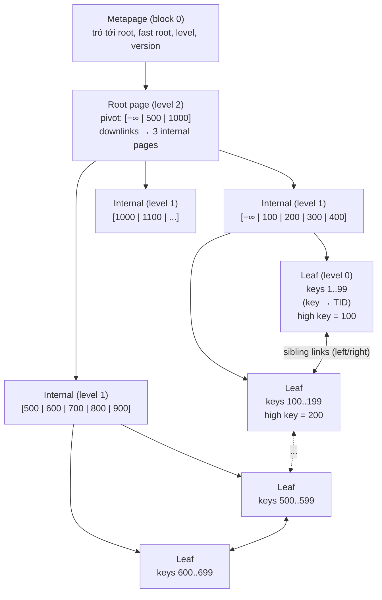
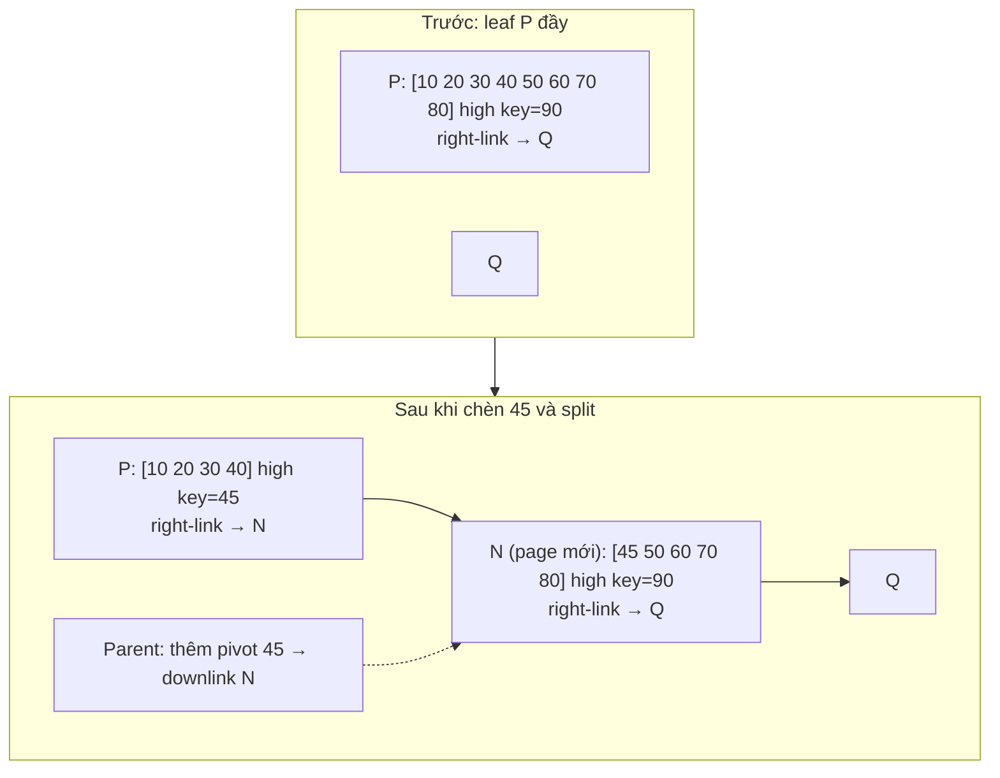
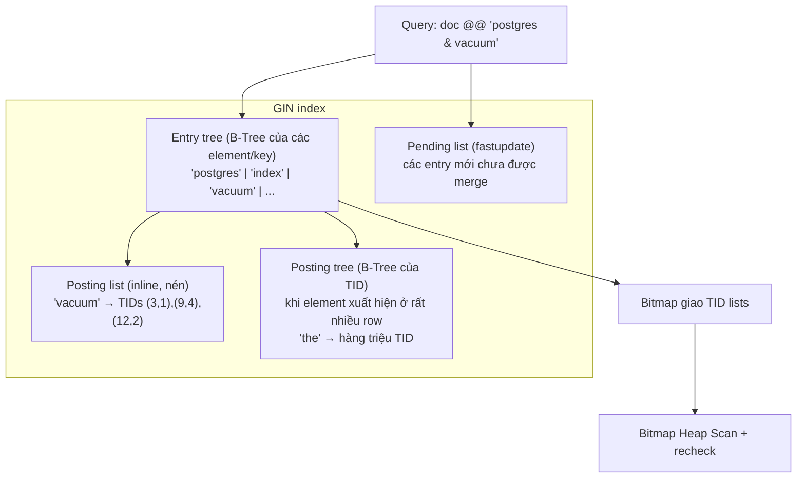
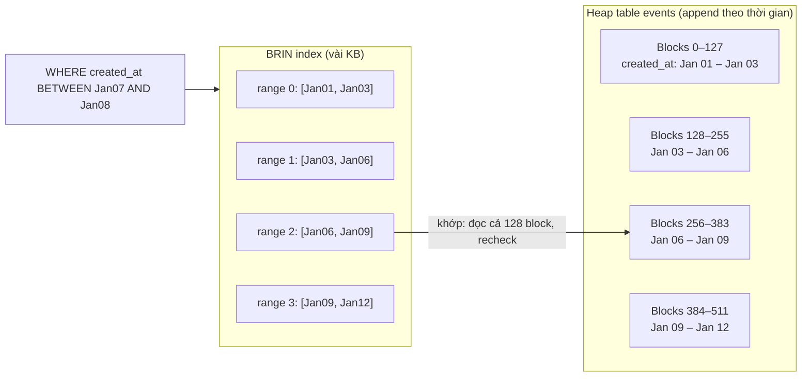
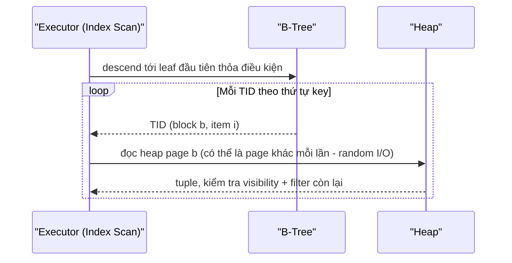
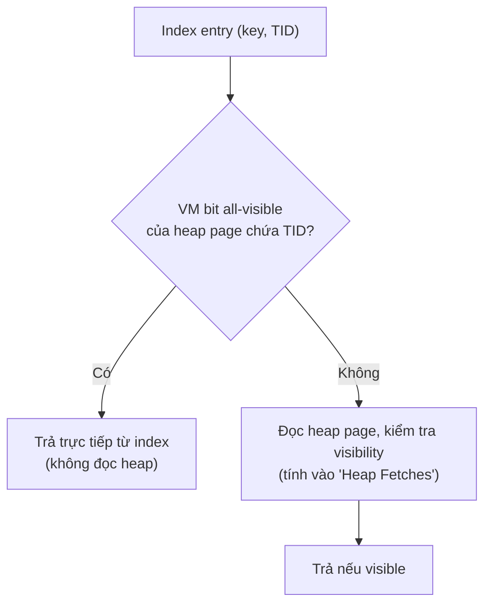
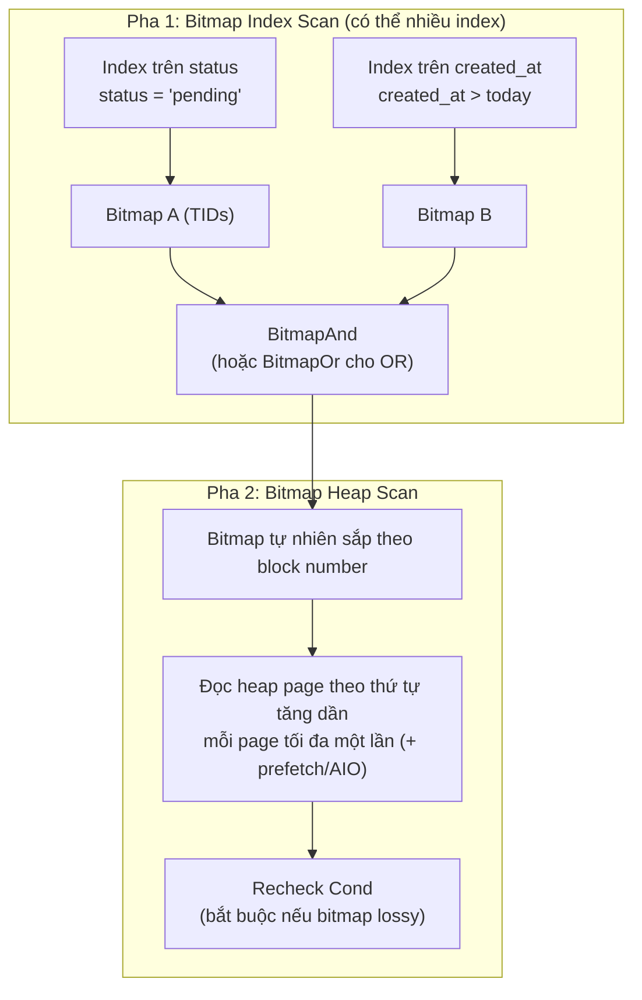
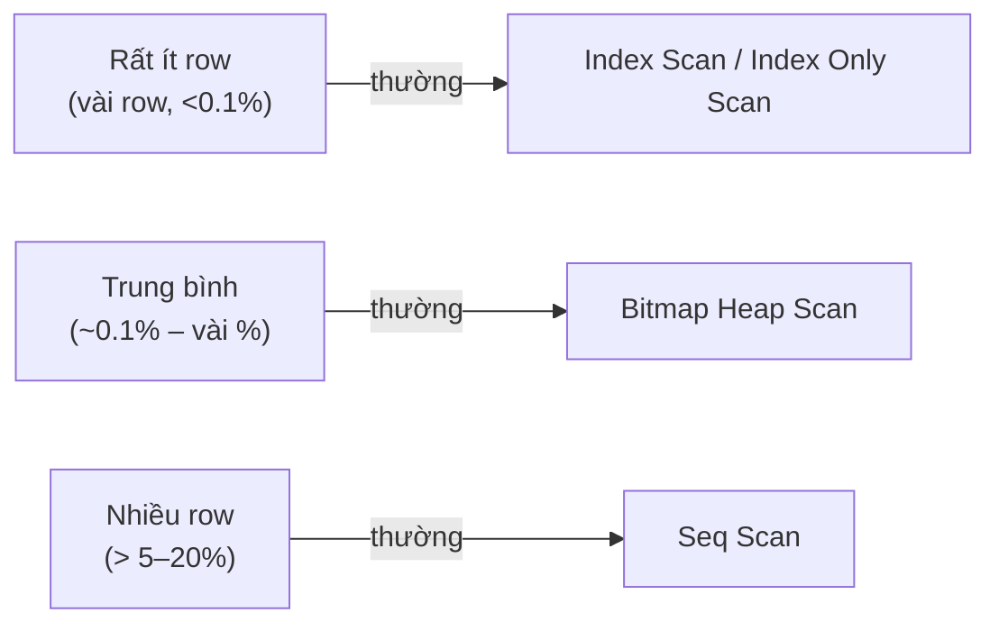
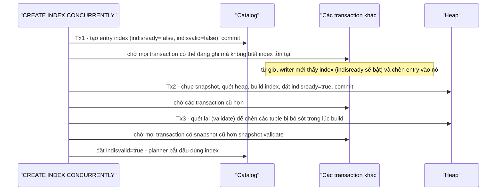

# PART 15 — INDEX INTERNALS

> **Trước:** [14 — Deadlock](14-deadlock.md) · **Tiếp:** [16 — Composite Index](16-composite-index.md)
> **Độ ưu tiên:** Rất cao.

---

## Mục lục

1. [Simple mental model](#1-simple-mental-model)
2. [Concept: Index — WHAT, WHY, chi phí](#2-concept-index)
3. [Concept: B-Tree](#3-concept-b-tree)
   - [3.1 Cấu trúc: metapage, root, internal, leaf](#31-cấu-trúc)
   - [3.2 Chiều cao cây và fanout](#32-chiều-cao-cây-và-fanout)
   - [3.3 Lookup](#33-lookup)
   - [3.4 Range scan](#34-range-scan)
   - [3.5 Insert và page split](#35-insert-và-page-split)
   - [3.6 Update và Delete](#36-update-và-delete)
   - [3.7 Deduplication, suffix truncation, bottom-up deletion](#37-deduplication-suffix-truncation-bottom-up-deletion)
   - [3.8 Index bloat](#38-index-bloat)
   - [3.9 Concurrency: Lehman–Yao](#39-concurrency-lehmanyao)
4. [Hash Index](#4-hash-index)
5. [GiST](#5-gist)
6. [SP-GiST](#6-sp-gist)
7. [GIN](#7-gin)
8. [BRIN](#8-brin)
9. [Các kiểu scan: Index Scan, Index Only Scan, Bitmap Index/Heap Scan](#9-các-kiểu-scan)
10. [Các biến thể index: Unique, Partial, Expression, Covering (INCLUDE), Composite](#10-các-biến-thể-index)
11. [CREATE INDEX vs CREATE INDEX CONCURRENTLY](#11-create-index-vs-create-index-concurrently)
12. [So sánh tổng hợp các loại index](#12-so-sánh-tổng-hợp)
13. [What happens if...](#13-what-happens-if)
14. [Production behavior](#14-production-behavior)
15. [Common misunderstandings](#15-common-misunderstandings)
16. [Interview Questions](#16-interview-questions)
17. [Key Takeaways](#17-key-takeaways)

---

## 1. Simple mental model

- **Heap** là một cuốn sách **không có thứ tự**. Muốn tìm "user id 42" phải lật từng trang (seq scan).
- **B-Tree index** là **mục lục sắp xếp ở cuối sách**: tra "42" → "trang 1234, dòng 5". Mục lục có nhiều tầng: trang mục lục tổng → trang mục lục chi tiết → dòng cụ thể.
- **Mục lục không biết** dòng đó còn hiệu lực không (có thể đã bị gạch — MVCC). Luôn phải lật tới trang thật để kiểm tra, trừ khi có sổ ghi "trang này sạch" (visibility map).
- **GIN** là **chỉ mục từ khóa** kiểu cuối sách giáo khoa: "PostgreSQL → trang 3, 17, 42, 108".
- **BRIN** là **ghi chú trên gáy từng tập**: "tập 1 chứa ngày 1/1–31/1, tập 2 chứa 1/2–28/2". Rất nhỏ, chỉ hữu ích khi sách được xếp theo thứ tự thời gian.
- Mỗi lần thêm/sửa nội dung sách (non-HOT), **mọi mục lục** đều phải cập nhật.

---

## 2. Concept: Index

### 2.1 WHAT

Index là một **cấu trúc dữ liệu phụ (secondary structure)**, lưu trong relation riêng (file riêng), ánh xạ **giá trị khóa → vị trí tuple (TID)** trong heap, được tổ chức để tìm kiếm theo khóa nhanh hơn quét toàn bộ heap.

Trong PostgreSQL, **mọi index đều là secondary** — kể cả primary key. Không có clustered index như InnoDB/SQL Server.

### 2.2 WHY

Không có index: tìm theo điều kiện = đọc **mọi page** của table (O(N)). Table 100GB → đọc 100GB cho một lookup. Với B-Tree: O(log N) — đọc 3–4 page index + 1 page heap.

Index còn dùng để:
- **Cung cấp thứ tự** (ORDER BY không cần sort; merge join; LIMIT dừng sớm).
- **Đảm bảo unique** (unique constraint chỉ hiện thực được qua index).
- **Index-only scan** (trả kết quả từ index không đọc heap).
- **Exclusion constraint** (GiST).

### 2.3 Chi phí — index không miễn phí

| Chi phí | Chi tiết |
|---|---|
| **Write amplification** | Mỗi INSERT và mỗi UPDATE non-HOT phải chèn entry vào **mọi** index ([Chương 07 §7](07-read-write-behavior.md#7-write-amplification)). |
| **Phá HOT** | Index trên cột hay đổi → UPDATE cột đó không thể HOT ([Chương 24](24-hot-update.md)). |
| **Storage + cache** | Index chiếm disk và cạnh tranh shared buffers với dữ liệu. |
| **WAL** | Mỗi index insert là WAL record; page split sinh nhiều WAL; FPI sau checkpoint. |
| **VACUUM** | Mỗi lần vacuum phải quét **toàn bộ** mỗi index để xóa entry chết (trừ khi bỏ qua index cleanup). |
| **Planning** | Nhiều index → planner xét nhiều path hơn. |
| **Lock** | Mỗi index là một relation cần lock khi query → nhiều index góp phần vượt fast-path ([Chương 13 §9](13-locking.md#9-fast-path-locking)). |

### 2.4 Index không chứa thông tin visibility

Index entry chỉ có `(key, TID)`, **không có xmin/xmax**. Lý do: nếu index chứa visibility, mỗi UPDATE/DELETE phải sửa mọi index entry của row (đắt gấp bội). Hệ quả:
- Index scan **luôn phải kiểm tra heap** (trừ index-only scan với VM).
- Index có thể chứa nhiều entry cho cùng key trỏ tới nhiều version (một số đã chết).
- `COUNT(*)` không thể đếm trực tiếp từ index (trừ index-only scan trên page all-visible).

---

## 3. Concept: B-Tree

B-Tree là loại index mặc định (`CREATE INDEX` không chỉ định `USING` → btree) và phổ biến nhất. Hiện thực của PostgreSQL (`nbtree`) dựa trên **Lehman & Yao (1981)** "B-link tree" với các cải tiến của Lanin & Shasha.

### 3.1 Cấu trúc



**Cách đọc diagram (trên xuống):**

1. **Metapage** (block 0 của file index) cho biết root nằm ở block nào. Root có thể thay đổi khi cây cao thêm (root split).
2. **Root** và **internal pages** chứa **pivot tuples**: mỗi pivot là một "biên" key + **downlink** (block number của page con). Để tìm key 150: ở root, 150 nằm trong khoảng [−∞, 500) → xuống I1; ở I1, 150 ∈ [100, 200) → xuống L2.
3. **Leaf pages** (level 0) chứa các **index tuple thật**: `(key, heap TID)`, sắp xếp theo key. Từ PG 13, nhiều TID của cùng key có thể gộp thành **posting list**.
4. Mỗi page (mọi level) có **right-link** và **left-link** tới anh em cùng level (trong special space: `btpo_prev`, `btpo_next`) và một **high key** — cận trên của các key mà page này được phép chứa. Right-link + high key là cốt lõi của thuật toán Lehman–Yao (mục 3.9).

**Cấu trúc một leaf page:** page header chuẩn (24 byte) → line pointers → index tuples (mỗi tuple: `IndexTupleData` 8 byte = TID 6 byte + t_info 2 byte, rồi key) → special space (`BTPageOpaqueData`: prev, next, level, flags). Item đầu tiên của page không phải rightmost là **high key**.

### 3.2 Chiều cao cây và fanout

**Fanout** = số con của một internal page ≈ số pivot vừa một page. Ví dụ index trên `bigint`:
- Leaf tuple: 8 (header) + 8 (key) = 16 byte + 4 byte line pointer = **20 byte** → ~407 entry/page; với leaf fillfactor 90 → ~366.
- Internal: tương tự, ~400 downlink/page (nhờ suffix truncation, pivot có thể còn ngắn hơn với key nhiều cột).

| Chiều cao (số level) | Số key tối đa xấp xỉ |
|---|---|
| 2 (root + leaf) | 400 × 366 ≈ 146 nghìn |
| 3 | 400² × 366 ≈ 58 triệu |
| 4 | 400³ × 366 ≈ 23 tỷ |

**Hệ quả:** Tra 1 key trong index 23 tỷ entry = đọc **4 page**. Root và internal page được truy cập liên tục nên gần như luôn nằm trong cache → thực tế thường chỉ **leaf** (và heap) có thể miss. **Chiều cao hiếm khi là vấn đề; kích thước leaf so với cache mới là vấn đề.**

Key lớn (text dài, UUID 16 byte, composite nhiều cột) → ít entry/page → fanout thấp → cây cao hơn và to hơn.

### 3.3 Lookup

`WHERE id = 42`:
1. Đọc metapage (cache) → root.
2. Ở mỗi page không phải leaf: **binary search** trên pivot tuples → chọn downlink → đọc page con. (Pin + share lock page con, nhả page cha — "lock coupling" nhẹ; thực ra nbtree chỉ giữ một page lock mỗi lúc nhờ right-link.)
3. Tại page con, nếu key tìm > **high key** của page (do page vừa bị split sau khi đọc downlink ở cha) → **đi theo right-link** sang phải ("move right") cho tới khi đúng page.
4. Ở leaf: binary search tìm vị trí đầu tiên ≥ 42; trả lần lượt các TID có key = 42 (có thể nhiều: nhiều version hoặc non-unique).
5. Với mỗi TID → heap fetch → visibility check.

Chi phí so sánh: O(log N) so sánh key, cộng số page = chiều cao.

### 3.4 Range scan

`WHERE created_at BETWEEN t1 AND t2 ORDER BY created_at`:
1. Descend tới leaf chứa key đầu tiên ≥ t1.
2. Duyệt **tuần tự trong leaf**, rồi **theo right-link** sang leaf kế tiếp, cho tới khi key > t2.
3. Kết quả tự nhiên **đã sắp xếp** → không cần Sort. Scan ngược (DESC) theo left-link.

Chi phí ≈ chiều cao + số leaf page chứa khoảng + **số heap page phải đọc** (có thể là 1 heap page cho mỗi TID nếu dữ liệu không correlated — đây mới là phần đắt).

### 3.5 Insert và page split

#### 3.5.1 Insert bình thường

1. Descend tới leaf đúng vị trí (với key trùng: vị trí xác định bởi heap TID, vì từ PG 12 TID là "cột key ẩn" cuối cùng — mục 3.7).
2. Unique index: kiểm tra trùng ([Chương 01 §7.3](01-relational-database.md#73-unique)).
3. Page còn chỗ → chèn item (dịch line pointers), WAL record `XLOG_BTREE_INSERT_LEAF`.
4. Page đầy → trước khi split, thử **giải phóng chỗ**:
   - **Simple deletion:** xóa các item đã được đánh dấu `LP_DEAD` (bởi index scan trước đó phát hiện tuple dead — "kill_prior_tuple").
   - **Bottom-up deletion** (PG 14): nếu page đầy vì nhiều version của cùng key (do non-HOT update), kiểm tra heap để xóa các entry trỏ tới tuple đã dead.
   - **Deduplication** (PG 13): gộp các item cùng key thành posting list.
   - Nếu đủ chỗ → chèn, không split.

#### 3.5.2 Page split



**Cách đọc diagram:**
1. Cấp page mới N (từ FSM của index — page đã bị xóa trước đó và có thể tái dùng — hoặc mở rộng file).
2. Chia các item giữa P (trái) và N (phải) theo **điểm split** được chọn; P giữ các key nhỏ, N nhận các key lớn. High key của P = key đầu của N (thực tế được "rút gọn" nhờ suffix truncation).
3. Nối right-link: P → N → Q.
4. **Chèn pivot + downlink cho N vào page cha.** Nếu page cha cũng đầy → split cha → có thể lan tới root. **Root split** tạo root mới → cây cao thêm 1 level. Đây là cách *duy nhất* B-Tree tăng chiều cao — từ trên đỉnh, nên cây luôn cân bằng.
5. Toàn bộ split được WAL-log (`XLOG_BTREE_SPLIT_L/R` + insert vào cha) — thường kèm FPI → split là thao tác ghi tốn kém.

**Chọn điểm split:**
- Mặc định: chọn điểm cân bằng không gian trống hai bên, ưu tiên điểm cho phép **suffix truncation** tốt nhất.
- **Rightmost split:** nếu chèn vào page ngoài cùng bên phải (key tăng dần — sequence, timestamp), PostgreSQL để page trái đầy tới **fillfactor** (leaf mặc định 90%) và chuyển phần còn lại sang page mới → index của key tăng dần có mật độ ~90%, không phải 50%.
- Nhiều key trùng: có chiến lược riêng ("many duplicates") để dồn duplicate vào một bên.

**Key ngẫu nhiên (UUIDv4):** chèn khắp nơi → split 50/50 khắp nơi → page trung bình ~70% đầy → index to hơn; working set là toàn bộ index; mỗi split sinh WAL/FPI.

### 3.6 Update và Delete

- **UPDATE** trên heap không bao giờ "sửa" index entry. Non-HOT update → **thêm entry mới** (key mới hoặc cùng key, TID mới). Entry cũ vẫn còn, trỏ tới version cũ.
- **DELETE** trên heap **không động vào index**.
- Entry cũ/chết được dọn bởi:
  1. **kill_prior_tuple**: một index scan đọc heap, thấy tuple dead với mọi transaction → đánh dấu item index là `LP_DEAD` (chỉ là hint, không WAL); lần sau scan bỏ qua, và insert có thể xóa hẳn khi cần chỗ.
  2. **Bottom-up deletion** (PG 14) khi page sắp split.
  3. **VACUUM**: với danh sách TID chết từ heap, gọi `ambulkdelete` → **quét toàn bộ index** và xóa mọi entry trỏ tới các TID đó.
- **Page deletion:** VACUUM xóa **leaf page rỗng hoàn toàn** khỏi cây (hai giai đoạn: half-dead → deleted), page chỉ được **tái sử dụng** sau khi không scan nào có thể còn tham chiếu nó (dựa trên XID lúc xóa). **PostgreSQL không merge hai page thưa** — page còn 1 item vẫn tồn tại.
- File index **không bao giờ co lại** (trừ REINDEX).

### 3.7 Deduplication, suffix truncation, bottom-up deletion

| Tối ưu | Version | Cơ chế | Lợi ích |
|---|---|---|---|
| **Heap TID là key tiebreaker** | PG 12 (index version 4) | Mọi entry là duy nhất nhờ TID coi như cột cuối; duplicate được sắp theo TID | Tìm entry cụ thể nhanh (VACUUM, bottom-up), là nền cho các tối ưu dưới |
| **Suffix truncation** | PG 12 | Pivot tuple ở internal page chỉ giữ **tiền tố đủ phân biệt** (bỏ cột cuối/TID nếu không cần) | Internal page chứa nhiều pivot hơn → fanout cao, cây nhỏ |
| **Deduplication** | PG 13 | Nhiều entry cùng key → một **posting list tuple**: key một lần + mảng TID | Index trên cột ít giá trị khác nhau (status, boolean, FK) nhỏ đi nhiều lần; giảm split do version churn |
| **Bottom-up index deletion** | PG 14 | Khi page sắp split do nhiều version, kiểm tra heap xóa entry chết | Chống index bloat do UPDATE non-HOT mà không cần chờ VACUUM |
| **Skip scan** | PG 18 | Dùng index nhiều cột dù thiếu điều kiện trên cột đầu, bằng cách "nhảy" qua từng giá trị cột đầu | Xem [Chương 16](16-composite-index.md) |

Deduplication không dùng được với một số kiểu (ví dụ `numeric` có thể hiển thị khác nhau dù bằng nhau, nondeterministic collation) và bị tắt với unique index theo cách thông thường (unique index chỉ dedup các version của cùng key khi cần).

### 3.8 Index bloat

#### WHAT
Index chiếm nhiều page hơn cần thiết cho số entry live: page thưa, entry chết chưa dọn, page rỗng chưa tái dùng.

#### WHY xảy ra
1. **Không merge page:** xóa 90% key trong một khoảng → các leaf còn 10% dữ liệu vẫn chiếm chỗ đầy đủ.
2. **Split 50/50 với key ngẫu nhiên** → mật độ ~70%.
3. **Version churn** (non-HOT update) → nhiều entry cho cùng key → split (giảm nhiều nhờ PG 13/14).
4. **VACUUM chậm/bị chặn** (xmin horizon) → entry chết tích tụ.
5. **Pattern "queue"**: insert ở đầu phải, delete ở đầu trái → phần trái cây toàn page thưa/rỗng; scan tìm key nhỏ nhất phải lướt qua nhiều page trống/entry chết.

#### Đo
- Extension `pgstattuple`: `pgstatindex('idx')` → `avg_leaf_density`, `leaf_fragmentation`.
- So kích thước thực với ước lượng (số row × kích thước entry / fillfactor).

#### Xử lý
- `REINDEX INDEX CONCURRENTLY idx` (PG 12+): build index mới song song rồi hoán đổi, không chặn ghi.
- Tìm và sửa nguyên nhân gốc (long transaction, autovacuum cấu hình yếu, UUIDv4, pattern queue).

### 3.9 Concurrency: Lehman–Yao

**Vấn đề:** Reader đang descend: đọc page cha → lấy downlink tới P → (trong khoảnh khắc chưa kịp đọc P) một writer split P, dời key cần tìm sang page mới N. Reader đọc P → không thấy key → trả kết quả sai.

**Giải pháp cổ điển:** khóa từ root xuống (lock coupling) — nghẽn cổ chai ở root.

**Lehman–Yao:** mỗi page có **high key** và **right-link**. Reader tới P, thấy key tìm > high key của P → biết P đã bị split → đi theo right-link sang N. Nhờ vậy:
- Reader **không cần giữ lock page cha** khi xuống con;
- Split chỉ khóa page đang split (và sau đó page cha khi chèn downlink) — không khóa cả nhánh;
- Scan không bao giờ lạc.

PostgreSQL mở rộng thêm để hỗ trợ scan ngược và xóa page an toàn (half-dead, xóa có trì hoãn recycle).

---

## 4. Hash Index

### 4.1 WHAT & HOW

Hash index lưu **mã băm 32-bit** của key (không lưu key!) trong các **bucket**:
- **Metapage** (block 0): số bucket, mask, thông tin split.
- **Bucket pages** + **overflow pages** (khi bucket đầy) + **bitmap pages** (theo dõi overflow page trống).
- Lookup: `hash(key)` → bucket → đọc bucket page (+ overflow chain) → so hash code → heap fetch → **recheck** key trên heap (vì va chạm hash).
- Số bucket tăng dần bằng **linear hashing** (split từng bucket một khi mật độ vượt ngưỡng), không rehash toàn bộ.

### 4.2 Lịch sử quan trọng

**Trước PG 10, hash index không được WAL-log** → không crash-safe, không replicate → documentation khuyên không dùng. **Từ PG 10**: WAL-logged, crash-safe, replicate được, hiệu năng cải thiện. Nhiều bài viết cũ vẫn nói "đừng dùng hash index" dựa trên thông tin trước PG 10.

### 4.3 Giới hạn

- Chỉ hỗ trợ `=`. Không range, không ORDER BY, không prefix LIKE.
- Không unique, không multi-column, không index-only scan (không lưu key), không INCLUDE.

### 4.4 Khi nào hash tốt hơn B-Tree

Key **dài** chỉ tra bằng `=` (URL, token, hash string dài): hash index lưu 4 byte mỗi entry bất kể key dài bao nhiêu → nhỏ hơn B-Tree nhiều. Với key ngắn (int, uuid), B-Tree (có dedup) thường ngang hoặc tốt hơn và linh hoạt hơn.

---

## 5. GiST

### 5.1 WHAT

**Generalized Search Tree** (Hellerstein, Naughton, Pfeffer 1995): một **khung (framework)** cây cân bằng mà mỗi node chứa các **predicate** mô tả mọi thứ trong nhánh con (ví dụ: "mọi hình trong nhánh này nằm trong hình chữ nhật R"). Người viết operator class chỉ cần cung cấp các hàm: `consistent`, `union`, `penalty`, `picksplit`, `same` (và tùy chọn `distance`, `fetch`, `compress`...).

### 5.2 HOW

- **Search:** tại mỗi node, gọi `consistent(predicate, query)` cho từng entry; **có thể phải đi xuống nhiều nhánh** (bounding box chồng lấn) — khác B-Tree chỉ một đường.
- **Insert:** chọn nhánh có `penalty` nhỏ nhất (ví dụ bounding box phải mở rộng ít nhất), cập nhật predicate của cha (`union`).
- **Split:** `picksplit` chia entry thành hai nhóm tốt.
- Thường **lossy**: predicate chỉ là xấp xỉ → phải **recheck** trên heap.
- **KNN search:** `ORDER BY location <-> point '(x,y)' LIMIT 10` — GiST duyệt theo khoảng cách bằng hàng đợi ưu tiên, trả nearest neighbors mà không sort toàn bộ.

### 5.3 Dùng cho

- Geometry/geography (**PostGIS** — R-tree trên GiST), `point`, `box`, `circle`.
- **Range types** (`tstzrange`, `int4range`): overlap `&&`, contains `@>`.
- **Exclusion constraint** (không đặt phòng trùng giờ) — [Chương 01 §7.5](01-relational-database.md#75-exclude-postgresql-specific).
- Full-text search (`tsvector`, lossy signature — GIN thường nhanh hơn khi đọc).
- `pg_trgm` (similarity, `%`, KNN theo similarity).
- `btree_gist`: cho phép kiểu scalar vào GiST (để kết hợp trong exclusion constraint).

---

## 6. SP-GiST

**Space-Partitioned GiST:** khung cho các cấu trúc **phân hoạch không gian không chồng lấn, không cân bằng**: quad-tree, k-d tree, radix tree (trie). Mỗi điểm dữ liệu thuộc đúng một nhánh → search thường theo một đường duy nhất (không như GiST).

Dùng cho: `point` (quad-tree/k-d tree), `inet`/`cidr` (radix), `text` với prefix (`^@`, radix trie), range types. Tốt khi dữ liệu có phân bố "tự nhiên" chia được theo không gian, ít chồng lấn.

---

## 7. GIN

### 7.1 WHAT

**Generalized Inverted Index**: index cho giá trị **phức hợp** (composite) — một row chứa **nhiều phần tử** (element), và truy vấn hỏi "row nào chứa phần tử X (và Y...)". Cấu trúc: **element → danh sách TID của các row chứa element**.

Dùng cho: `array` (`@>`, `&&`), **`jsonb`** (`@>`, `?`, `?|`, `?&`, jsonpath `@?`, `@@`), **`tsvector`** full-text (`@@`), `pg_trgm` (`LIKE '%abc%'`, `ILIKE`, regex, similarity), `hstore`.

### 7.2 HOW / INTERNALS



**Cách đọc diagram:**
1. **Entry tree** là một B-Tree trên các *element* (từ khóa, key JSON, trigram...).
2. Mỗi element trỏ tới danh sách TID chứa nó: **posting list** nén ngay trong entry (khi ít), hoặc **posting tree** (B-Tree riêng của TID) khi element phổ biến.
3. Query nhiều element (`postgres & vacuum`) → lấy TID list của từng element → **giao/hợp** → bitmap → **Bitmap Heap Scan** (GIN chỉ hỗ trợ bitmap scan, không trả kết quả có thứ tự) → recheck nếu operator lossy.
4. **Pending list (`fastupdate = on`, mặc định):** insert vào GIN rất đắt (một row `tsvector` 200 từ = 200 lần cập nhật entry tree). Để tăng tốc insert, entry mới được **append vào pending list** (danh sách tuần tự chưa sắp xếp). Pending list được **merge hàng loạt** vào cấu trúc chính khi: vượt `gin_pending_list_limit` (mặc định 4MB), khi VACUUM/autovacuum (hoặc autoanalyze) chạy, hoặc gọi `gin_clean_pending_list()`. **Search phải quét cả pending list tuần tự** → pending list lớn làm search chậm; và một insert "không may" chạm ngưỡng phải tự merge → latency spike.

### 7.3 jsonb_ops vs jsonb_path_ops

| | `jsonb_ops` (mặc định) | `jsonb_path_ops` |
|---|---|---|
| Element | Mỗi key và mỗi value riêng | Hash của cả **đường dẫn + value** |
| Operator | `@>`, `?`, `?|`, `?&`, jsonpath | Chỉ `@>` và jsonpath |
| Kích thước | Lớn hơn | Nhỏ hơn nhiều |
| Precision cho `@>` | Kém hơn (key/value phổ biến tạo danh sách lớn) | Tốt hơn |

### 7.4 Trade-off

- **Đọc:** rất nhanh cho truy vấn chứa phần tử.
- **Ghi:** đắt (nhiều element/row); pending list giảm nhưng dời chi phí.
- **Kích thước:** có thể lớn hơn table (tsvector, trigram).
- Không hỗ trợ ORDER BY, không index-only scan.

---

## 8. BRIN

### 8.1 WHAT

**Block Range INdex**: chia heap thành các **block range** liên tiếp (mặc định `pages_per_range = 128` page = 1MB) và lưu **một bản tóm tắt nhỏ cho mỗi range** — với opclass `minmax`: `(min, max)` của cột trong range đó.

### 8.2 HOW



**Cách đọc diagram:** Query hỏi khoảng Jan 07–08. BRIN kiểm tra 4 bản tóm tắt; chỉ range 2 có [min,max] giao với khoảng → tạo bitmap **lossy** gồm toàn bộ 128 block của range 2 → Bitmap Heap Scan đọc 128 block và **recheck** từng tuple. 384 block còn lại bị bỏ qua.

### 8.3 Điều kiện hiệu quả: physical correlation

BRIN chỉ hữu ích khi **giá trị cột tương quan với vị trí vật lý** (`pg_stats.correlation` gần ±1): dữ liệu append theo thời gian (log, event, IoT), id tăng dần. Nếu giá trị rải ngẫu nhiên, mỗi range có min/max phủ gần toàn miền → mọi range đều "khớp" → BRIN vô dụng (đọc toàn table + chi phí bitmap).

UPDATE/DELETE + tái sử dụng chỗ trống phá correlation dần theo thời gian.

### 8.4 INTERNALS

- **Summarization:** range mới (block được thêm sau lần tóm tắt cuối) **chưa có tóm tắt** → luôn bị coi là "khớp". Tóm tắt được tạo bởi VACUUM/autovacuum, `brin_summarize_new_values()`, hoặc tự động khi `autosummarize = on` (range trước đầy thì yêu cầu tóm tắt).
- Opclass PG 14+: **`minmax-multi`** (nhiều khoảng min/max mỗi range — chịu được outlier), **`bloom`** (bloom filter cho `=` trên dữ liệu không tương quan), `inclusion` (cho range/geometry).
- PG 16: BRIN là index "summarizing" → **không chặn HOT update** (vẫn được cập nhật tóm tắt).

### 8.5 Trade-off

| | BRIN | B-Tree |
|---|---|---|
| Kích thước cho table 1TB | Vài chục MB hoặc nhỏ hơn | Hàng chục–trăm GB |
| Insert overhead | Gần như không | Mỗi row một entry |
| Point lookup | Kém (đọc ≥ 1 range) | Tuyệt vời |
| Range lớn trên dữ liệu tương quan | Rất tốt | Tốt nhưng index to |
| Dữ liệu không tương quan | Vô dụng | Tốt |

---

## 9. Các kiểu scan

### 9.1 Index Scan



**Cách đọc diagram:** Index Scan xen kẽ **một bước index → một bước heap**. Kết quả **có thứ tự theo key** (hữu ích cho ORDER BY/LIMIT/merge join). Nhược điểm: nếu các TID liên tiếp trỏ tới heap page ngẫu nhiên (correlation thấp), mỗi row là một **random I/O** và cùng một heap page có thể bị đọc nhiều lần. Planner mô hình hóa điều này bằng `random_page_cost` và `correlation` ([Chương 17](17-query-planner.md)).

**Tốt khi:** lấy ít row (selectivity thấp), cần thứ tự, có LIMIT.

### 9.2 Index Only Scan

Nếu **mọi cột query cần đều nằm trong index** (key hoặc INCLUDE), executor có thể trả kết quả **từ index** mà không đọc heap — **với điều kiện** page heap chứa tuple đó được đánh dấu **all-visible trong Visibility Map**:



**Cách đọc diagram:** Index không biết visibility → VM là "giấy chứng nhận" rằng mọi tuple trên page đều visible với mọi người → an toàn để trả từ index. Page vừa bị sửa (bit VM bị xóa) → phải đọc heap. `EXPLAIN ANALYZE` hiện `Heap Fetches: N` — N lớn nghĩa là index-only scan không hiệu quả (table ghi nhiều, VACUUM chưa chạy để đặt lại bit VM). Đây là lý do PG 13 thêm autovacuum theo số insert: table append-only cũng cần vacuum để VM được cập nhật.

### 9.3 Bitmap Index Scan + Bitmap Heap Scan



**Cách đọc diagram:**
1. **Pha 1:** quét một hoặc nhiều index, thu **tất cả TID** thỏa điều kiện vào một **TID bitmap** trong memory (không đọc heap). Nhiều bitmap có thể kết hợp bằng **BitmapAnd/BitmapOr** — cách PostgreSQL dùng **nhiều index riêng lẻ** cho một query (`WHERE a = 1 AND b = 2` với index trên a và index trên b).
2. **Pha 2:** duyệt bitmap theo **thứ tự block** → mỗi heap page đọc **đúng một lần**, theo thứ tự tăng dần (gần tuần tự hơn, prefetch được qua `effective_io_concurrency`/AIO).
3. **Lossy bitmap:** bitmap lưu từng TID (exact) cho tới khi vượt `work_mem`; sau đó chuyển một số page sang chế độ **lossy** (chỉ nhớ "page này có kết quả", không nhớ tuple nào) → phải **recheck điều kiện trên mọi tuple của page đó**. EXPLAIN: `Heap Blocks: exact=1200 lossy=34000` và `Rows Removed by Index Recheck`.
4. **Mất thứ tự:** kết quả theo thứ tự vật lý, không theo key → nếu cần ORDER BY phải Sort.

**Tốt khi:** selectivity trung bình (quá nhiều cho Index Scan random, quá ít cho Seq Scan), kết hợp nhiều index, OR trên nhiều cột.

### 9.4 Seq Scan vs Index Scan vs Bitmap — theo selectivity



**Cách đọc diagram:** Ngưỡng thực tế phụ thuộc: kích thước row, correlation, `random_page_cost`, dữ liệu có trong cache không, có cần thứ tự/LIMIT không. Seq scan đọc tuần tự (rẻ mỗi page) và không có overhead index; index scan đọc random (đắt mỗi page). Khi phải đọc phần lớn các heap page anyway, seq scan thắng. **Đây là lý do "planner bỏ qua index" thường là đúng.**

---

## 10. Các biến thể index

### 10.1 Unique Index

Đảm bảo không có hai entry **live** cùng key (NULL mặc định được coi là khác nhau; `NULLS NOT DISTINCT` từ PG 15). Cơ chế kiểm tra và chờ: [Chương 01 §7.3](01-relational-database.md#73-unique). Unique index còn giúp planner: biết một lookup trả tối đa 1 row (join removal, ước lượng chính xác).

### 10.2 Partial Index

```sql
CREATE INDEX ON orders (created_at) WHERE status = 'pending';
```
Chỉ index các row thỏa predicate. **WHY:** table 500 triệu order, chỉ 10 nghìn 'pending' → index vài trăm KB thay vì hàng chục GB; insert/update row không thỏa predicate **không chạm index**. **Điều kiện dùng:** planner phải **chứng minh được** WHERE của query suy ra predicate của index (`WHERE status = 'pending' AND ...`). Với tham số (`status = $1`) ở generic plan, planner không chứng minh được → không dùng. Partial unique index: `UNIQUE (email) WHERE deleted_at IS NULL`.

**Lưu ý HOT:** cột trong predicate của partial index được tính là "cột được index" → update cột đó chặn HOT.

### 10.3 Expression Index

```sql
CREATE INDEX ON users (lower(email));
-- dùng được cho: WHERE lower(email) = 'a@x.com'
```
Index lưu **kết quả biểu thức**. Hàm phải `IMMUTABLE`. Query phải viết **đúng biểu thức** đó. ANALYZE thu thập **thống kê cho biểu thức** của expression index → planner ước lượng tốt hơn cho điều kiện trên biểu thức (kể cả khi không dùng index để scan). Chi phí: tính biểu thức mỗi lần insert/update.

### 10.4 Covering Index (INCLUDE)

```sql
CREATE INDEX ON orders (user_id) INCLUDE (status, total);
SELECT status, total FROM orders WHERE user_id = 7;   -- index-only scan
```
Cột INCLUDE chỉ nằm ở **leaf**, không phải phần key (không dùng để tìm kiếm/sắp xếp, không ảnh hưởng uniqueness), không có trong pivot tuple → internal page không phình. Hỗ trợ: B-Tree (PG 11), GiST (PG 12), SP-GiST (PG 14).

**Trade-off:** index to hơn; cột INCLUDE bị update → không HOT; chỉ có lợi khi index-only scan thực sự xảy ra (VM tốt).

**Vì sao không thêm cột vào key luôn?** Unique constraint trên `(user_id)` INCLUDE `(status)` vẫn đảm bảo unique theo user_id; thêm vào key sẽ đổi ngữ nghĩa unique. Và pivot tuple nhỏ hơn.

### 10.5 Composite Index

Index nhiều cột `(a, b, c)` sắp theo a, rồi b, rồi c. Chi tiết leftmost prefix, skip scan: [Chương 16](16-composite-index.md).

---

## 11. CREATE INDEX vs CREATE INDEX CONCURRENTLY

### 11.1 CREATE INDEX thường

- Lock **SHARE** trên table → **chặn INSERT/UPDATE/DELETE** suốt quá trình (đọc vẫn được).
- Một lần quét heap, sort (dùng `maintenance_work_mem`, có thể song song — `max_parallel_maintenance_workers`, PG 11 cho B-Tree), build cây từ dưới lên (rất hiệu quả, page đầy theo fillfactor).
- Nhanh nhất, nhưng downtime ghi.

### 11.2 CREATE INDEX CONCURRENTLY (CIC)



**Cách đọc diagram:** CIC chia thành nhiều transaction và **nhiều lần chờ** để đảm bảo mọi tuple — kể cả tuple được insert trong lúc build — đều có mặt trong index, mà không bao giờ chặn writer. Lock chỉ là **SHARE UPDATE EXCLUSIVE**.

**Chi phí và rủi ro:**
- Quét heap **hai lần** → chậm hơn 2–3 lần.
- **Phải chờ mọi transaction đang chạy** (kể cả transaction ở table khác, và read-only — qua virtualxid) tại mỗi giai đoạn → một long transaction làm CIC treo rất lâu.
- **Không chạy được trong transaction block.**
- **Thất bại giữa chừng** (unique violation, deadlock, cancel) → để lại index **INVALID**: planner không dùng, nhưng **vẫn được cập nhật khi ghi** (tốn chi phí) → phải `DROP INDEX CONCURRENTLY` rồi tạo lại. Kiểm tra: `SELECT indexrelid::regclass FROM pg_index WHERE NOT indisvalid;`
- Với partitioned table: CIC trên table cha không hỗ trợ trực tiếp (tính tới PG 18) — tạo CIC trên từng partition rồi `CREATE INDEX ON ONLY parent` + `ALTER INDEX ... ATTACH PARTITION`.

`REINDEX CONCURRENTLY` (PG 12) dùng cơ chế tương tự để build lại index bị bloat.

---

## 12. So sánh tổng hợp

| | B-Tree | Hash | GiST | SP-GiST | GIN | BRIN |
|---|---|---|---|---|---|---|
| Cấu trúc | Cây cân bằng có thứ tự | Bảng băm (linear hashing) | Cây cân bằng của predicate (chồng lấn) | Cây phân hoạch không chồng lấn | Inverted index (element → TIDs) | Tóm tắt theo block range |
| Toán tử | `= < <= > >= BETWEEN IN`, `IS NULL`, prefix LIKE (C/pattern_ops) | `=` | overlap, contain, KNN `<->`, geometric | point, inet, text prefix, KNN | `@> <@ && ? ?& ?|` `@@`, trigram LIKE | `= < >` (minmax), bloom `=` |
| ORDER BY | Có | Không | KNN | KNN | Không | Không |
| Unique | Có | Không | Không (dùng EXCLUDE) | Không | Không | Không |
| Multi-column | Có | Không | Có | Không | Có | Có |
| Index-only scan | Có | Không | Có (nếu opclass hỗ trợ fetch) | Có | Không | Không |
| Kích thước | Trung bình | Nhỏ (key dài) | Trung bình | Trung bình | Lớn | **Rất nhỏ** |
| Chi phí ghi | Trung bình | Thấp | Trung bình–cao | Trung bình | **Cao** (pending list giảm) | **Rất thấp** |
| Dùng điển hình | Mọi thứ scalar | Equality trên key dài | GIS, range, exclusion | IP, prefix, point | JSONB, array, full-text, trigram | Time-series append-only |

---

## 13. What happens if...

| Tình huống | Chuyện gì xảy ra |
|---|---|
| **Index quá lớn so với RAM** | Leaf page thường xuyên cache miss → mỗi lookup/insert là random I/O. Chiều cao cây vẫn chỉ 4–5, nhưng mỗi level dưới có thể miss. Dấu hiệu: `shared_blks_read` cao trên index. |
| **Quá nhiều index trên table ghi nhiều** | INSERT chậm, WAL tăng, HOT giảm, vacuum lâu (quét mọi index). |
| **Index không bao giờ được dùng** | `pg_stat_user_indexes.idx_scan = 0` lâu dài (nhớ kiểm tra cả replica!) → chi phí thuần. Drop (sau khi xác minh không phục vụ unique constraint và không được dùng trên replica). |
| **Index bị INVALID sau CIC lỗi** | Không dùng để đọc nhưng vẫn tốn khi ghi. |
| **Index hỏng (corruption)** | Kết quả sai hoặc lỗi. `amcheck` (`bt_index_check`, `bt_index_parent_check`) để phát hiện; `REINDEX` để sửa. Collation thay đổi do nâng cấp glibc là nguồn corruption logic phổ biến cho index text. |
| **UUIDv4 làm PK trên table ghi nhiều** | Insert rải rác → nhiều split, working set = toàn index, WAL tăng (FPI). |
| **Pattern queue (insert phải, delete trái)** | Phần trái cây nhiều page rỗng/entry chết → `ORDER BY id LIMIT 1` phải lướt qua → chậm; VACUUM + bottom-up giúp, REINDEX định kỳ nếu cần. |
| **GIN pending list lớn** | Search chậm; insert "xui" phải merge → latency spike. |
| **BRIN trên dữ liệu không tương quan** | Đọc gần như toàn bộ table. |

---

## 14. Production behavior

- **Theo dõi:** `pg_stat_user_indexes` (idx_scan, idx_tup_read, idx_tup_fetch), `pg_statio_user_indexes` (hit/read), kích thước (`pg_relation_size(indexrelid)`), `pg_stat_progress_create_index` (tiến độ CREATE INDEX/REINDEX).
- **Chiến lược index:**
  1. Bắt đầu từ **query thực tế** (`pg_stat_statements`), không từ "cột nào cũng index".
  2. Ưu tiên composite index phục vụ nhiều query (leftmost prefix) thay vì nhiều index đơn cột.
  3. Partial index cho tập con nóng.
  4. INCLUDE cho query nóng cần index-only scan.
  5. Xóa index trùng lặp (index `(a)` thừa khi đã có `(a, b)` — trừ khi `(a)` nhỏ hơn đáng kể và phục vụ query nóng, hoặc unique).
  6. Mọi thao tác index trên production: `CONCURRENTLY`.

---

## 15. Common misunderstandings

1. **"Index luôn làm query nhanh hơn."** — Với selectivity cao, seq scan nhanh hơn; index làm chậm ghi.
2. **"Planner bỏ qua index là bug."** — Thường là đúng (selectivity cao, table nhỏ, estimate) — hoặc do statistics sai, kiểu dữ liệu không khớp, biểu thức trên cột.
3. **"Index-only scan không bao giờ đọc heap."** — Đọc heap cho page không all-visible.
4. **"Hash index không an toàn."** — Đúng trước PG 10; từ PG 10 an toàn.
5. **"B-Tree tự cân bằng nên không bao giờ bloat."** — Cân bằng về chiều cao, nhưng page có thể thưa; không merge page.
6. **"Primary key là clustered index."** — Không trong PostgreSQL.
7. **"Thêm cột vào index luôn tốt (covering)."** — Index to hơn, mất HOT, chỉ lợi khi index-only scan thực sự xảy ra.
8. **"DELETE xóa entry khỏi index."** — Không; VACUUM (hoặc kill/bottom-up) mới xóa.

---

## 16. Interview Questions

**Q1. B-Tree trong PostgreSQL hoạt động thế nào?**
- *Short:* Cây cân bằng; metapage → root → internal (pivot + downlink) → leaf (key + TID) liên kết anh em; lookup O(log N) với fanout hàng trăm → 3–4 level.
- *Deep:* Page split, rightmost split theo fillfactor, Lehman–Yao (high key + right-link), dedup, suffix truncation, bottom-up deletion, không merge page, LP_DEAD hint.
- *Follow-up:* Tại sao UUIDv4 làm index kém? Tại sao index bloat?

**Q2. Index Scan, Index Only Scan, Bitmap Scan khác nhau thế nào?**
- *Short:* Index Scan: index→heap từng TID, có thứ tự. Index Only: trả từ index nếu VM all-visible. Bitmap: gom TID vào bitmap, đọc heap theo thứ tự block, kết hợp được nhiều index, có thể lossy.

**Q3. Tại sao thêm index có thể làm INSERT chậm?**
- *Short:* Mỗi index một lần descend + insert + WAL + có thể split; non-HOT update cũng vậy; index trên cột hay đổi phá HOT.

**Q4. B-Tree vs Hash vs BRIN?**
- *Short:* B-Tree đa năng; Hash chỉ `=`, nhỏ với key dài, không unique/order; BRIN cực nhỏ, chỉ hiệu quả khi dữ liệu tương quan vật lý (time-series).

**Q5. GIN dùng khi nào? Nhược điểm?**
- *Short:* JSONB, array, full-text, trigram. Ghi đắt, pending list, không ORDER BY.

**Q6. CREATE INDEX CONCURRENTLY hoạt động thế nào? Rủi ro?**
- *Short:* Nhiều pha, quét heap hai lần, chờ transaction cũ, SHARE UPDATE EXCLUSIVE; lỗi để lại index INVALID; long transaction làm nó treo.

**Q7. (Senior) Index-only scan có Heap Fetches cao. Vì sao, xử lý?**
- *Short:* VM không được đặt (table ghi nhiều, vacuum chưa chạy/bị chặn horizon). Tune autovacuum (insert threshold), giải quyết long transaction.

**Q8. (Senior) Một index 200GB trên table 300GB. Làm sao đánh giá có bloat không và xử lý?**
- *Short:* `pgstatindex` (avg_leaf_density), so sánh ước lượng; nguyên nhân (UUIDv4, churn, horizon); `REINDEX CONCURRENTLY`; sửa gốc.

---

## 17. Key Takeaways

1. Mọi index PostgreSQL là **secondary**, lưu `(key → TID)`, **không có visibility** → phải kiểm tra heap (trừ index-only scan với VM).
2. **B-Tree**: fanout hàng trăm → 3–4 level cho hàng tỷ key; split lan lên trên; Lehman–Yao cho concurrency; không merge page → bloat có thể xảy ra.
3. PG 12–14: TID tiebreaker, suffix truncation, **deduplication**, **bottom-up deletion** giảm mạnh bloat do version churn. PG 18: **skip scan**.
4. **Hash** (an toàn từ PG 10): chỉ `=`, tốt cho key dài. **GiST/SP-GiST**: không gian, range, KNN, exclusion. **GIN**: inverted cho JSONB/array/full-text/trigram, ghi đắt. **BRIN**: tóm tắt block range, cực nhỏ, cần correlation.
5. Scan: Index Scan (random, có thứ tự) / Index Only Scan (VM) / Bitmap (gom TID, đọc theo block, AND/OR, lossy) / Seq Scan (khi đọc phần lớn table).
6. Index **có chi phí**: write amplification, mất HOT, WAL, vacuum, cache. Index phải được biện minh bằng query thực.
7. Production: luôn `CONCURRENTLY`; kiểm tra INVALID index; theo dõi idx_scan.

---

## Nguồn tham khảo

- PostgreSQL Docs — *Indexes* (Index Types, Multicolumn, Partial, Expression, Index-Only Scans): https://www.postgresql.org/docs/current/indexes.html
- PostgreSQL Docs — *B-Tree Indexes* (implementation: deduplication, bottom-up deletion): https://www.postgresql.org/docs/current/btree.html
- PostgreSQL Docs — *GiST*, *SP-GiST*, *GIN*, *BRIN*, *Hash* chapters.
- PostgreSQL Docs — *CREATE INDEX* (Building Indexes Concurrently): https://www.postgresql.org/docs/current/sql-createindex.html
- PostgreSQL source: `src/backend/access/nbtree/README`, `src/backend/access/gin/README`, `src/backend/access/hash/README`.
- Lehman & Yao, *Efficient Locking for Concurrent Operations on B-Trees*, ACM TODS 1981.
- Hellerstein, Naughton, Pfeffer, *Generalized Search Trees for Database Systems*, VLDB 1995.
- Peter Geoghegan — các bài nói về nbtree (deduplication, bottom-up deletion, skip scan).
