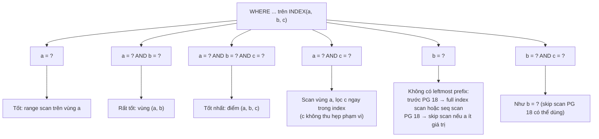
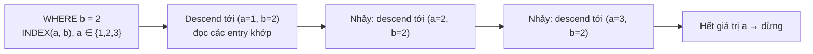

# PART 16 — COMPOSITE INDEX

> **Trước:** [15 — Index Internals](15-index-internals.md) · **Tiếp:** [17 — Query Planner](17-query-planner.md)

---

## Mục lục

1. [Simple mental model](#1-simple-mental-model)
2. [WHAT — Composite index được sắp xếp thế nào](#2-what)
3. [WHY — Tại sao cần composite index](#3-why)
4. [HOW — INDEX(a, b, c) phục vụ những query nào](#4-how--indexa-b-c-phục-vụ-những-query-nào)
5. [INTERNALS — Boundary condition vs Filter trong index](#5-internals--boundary-condition-vs-index-filter)
6. [Skip scan (PG 18)](#6-skip-scan-pg-18)
7. [Composite index và ORDER BY](#7-composite-index-và-order-by)
8. [Thứ tự cột: quy tắc chọn](#8-thứ-tự-cột-quy-tắc-chọn)
9. [Composite index vs nhiều index đơn cột (BitmapAnd)](#9-composite-vs-nhiều-index-đơn-cột)
10. [What happens if... / Performance / Production](#10-what-happens-if--performance--production)
11. [Common misunderstandings](#11-common-misunderstandings)
- [Concept card — khung 13 điểm](#concept-card--)
12. [Interview Questions](#12-interview-questions)
13. [Key Takeaways](#13-key-takeaways)

---

## 1. Simple mental model

Danh bạ điện thoại sắp xếp theo **(Họ, Tên, Tên đệm)**:
- Tìm mọi người họ "Nguyễn" → dễ: mở tới vùng "Nguyễn".
- Tìm "Nguyễn Văn An" → dễ hơn nữa: vùng "Nguyễn", trong đó vùng "An"...
- Tìm mọi người **tên** "An" (không biết họ) → phải lật **từng vùng họ** — "Nguyễn An", "Trần An", "Lê An"... Nếu chỉ có 10 họ, lật 10 chỗ vẫn nhanh (đó là **skip scan**). Nếu có 10.000 họ, gần như phải đọc cả cuốn.
- Tìm "họ Nguyễn, tên đệm Văn" (bỏ qua tên) → mở vùng "Nguyễn", rồi **đọc lướt** toàn vùng đó để chọn người có tên đệm "Văn".

---

## 2. WHAT

`CREATE INDEX idx ON t (a, b, c);` tạo **một** B-Tree mà key là **bộ (a, b, c)**, sắp theo **thứ tự từ điển (lexicographic)**: so sánh a trước; nếu a bằng nhau so b; nếu b bằng nhau so c (và cuối cùng là heap TID).

```
(1, 1, 5)
(1, 1, 9)
(1, 2, 3)
(1, 2, 7)
(1, 3, 1)
(2, 1, 4)
(2, 1, 8)
(2, 5, 2)
(3, 1, 6)
...
```

Nhìn danh sách: **a được sắp toàn cục**; **b chỉ được sắp bên trong mỗi nhóm a bằng nhau**; **c chỉ được sắp bên trong mỗi nhóm (a, b) bằng nhau**. Toàn bộ chương này là hệ quả của quan sát đó.

---

## 3. WHY

- Query thực tế thường lọc theo **nhiều cột**: `WHERE tenant_id = ? AND status = ? AND created_at > ?`.
- Một index đơn cột trên `tenant_id` trả mọi row của tenant (có thể hàng triệu) rồi phải lọc tiếp ở heap.
- Composite index thu hẹp phạm vi **ngay trong index** và có thể cung cấp **thứ tự** (`ORDER BY created_at`) + **index-only scan**.

---

## 4. HOW — INDEX(a, b, c) phục vụ những query nào



**Cách đọc diagram:** Hiệu quả phụ thuộc vào việc điều kiện có ràng buộc được **tiền tố bên trái (leftmost prefix)** của index hay không.

### 4.1 Bảng chi tiết

| Điều kiện | Dùng index? | Phạm vi scan được giới hạn bởi | Ghi chú |
|---|---|---|---|
| `a = 1` | Có | a | Mọi entry có a=1 nằm liên tiếp |
| `a = 1 AND b = 2` | Có | (a, b) | Vùng liên tiếp nhỏ hơn |
| `a = 1 AND b = 2 AND c = 3` | Có | (a, b, c) | Hẹp nhất |
| `a = 1 AND c = 3` | Có | **chỉ a** | c được kiểm tra trên từng entry trong vùng a=1 (không cần đọc heap cho entry không khớp c), nhưng không thu hẹp vùng |
| `b = 2` | Trước PG 18: chỉ khi full index scan rẻ hơn seq scan (ví dụ index-only scan trên index nhỏ hơn nhiều table). PG 18: **skip scan** | — / từng giá trị a | Entry có b=2 rải khắp index |
| `b = 2 AND c = 3` | Như `b = 2` | — | |
| `a > 5 AND b = 2` | Có | **chỉ a > 5** | Sau cột có điều kiện range, các cột sau không thu hẹp vùng (b kiểm tra trong index). PG 18 skip scan có thể "nhảy" qua từng giá trị a > 5 nếu ít giá trị |
| `a = 1 AND b > 2 AND c = 3` | Có | (a = 1, b > 2) | c lọc trong index |
| `a IN (1, 2) AND b = 5` | Có | Mỗi giá trị a: (a, b) | ScalarArrayOp — nhiều vùng nhỏ; PG 17 xử lý hiệu quả hơn nhiều |
| `a = 1 OR b = 2` | Hạn chế | | Thường BitmapOr của hai index khác nhau |

### 4.2 Tại sao `a = 1 AND c = 3` chỉ thu hẹp theo a?

Trong vùng `a = 1`, các entry sắp theo `(b, c)`: `(1,1,5) (1,1,9) (1,2,3) (1,2,7) (1,3,1)...`. Các entry có `c = 3` **không liên tiếp** (vì chúng xen kẽ theo b). B-Tree không thể nhảy thẳng tới "mọi c = 3" — nó phải duyệt toàn bộ vùng a=1 và lọc. Lợi ích so với index chỉ trên `(a)`: việc lọc c diễn ra **trên index entry**, không phải đọc heap cho từng row → tiết kiệm heap fetch.

### 4.3 Tại sao sau cột range thì các cột sau không thu hẹp?

Vùng `a > 5` gồm `(6,1,..), (6,2,..), (7,1,..), (7,2,..)...`. Các entry `b = 2` nằm rải rác trong từng nhóm a — không liên tiếp. Nên B-Tree chỉ dùng `a > 5` làm **biên** để bắt đầu/kết thúc scan.

---

## 5. INTERNALS — Boundary condition vs index filter

Khi planner dùng B-Tree, các điều kiện trong `Index Cond` được chia (trong executor, `_bt_preprocess_keys`) thành:

- **Boundary / required keys**: dùng để xác định **điểm bắt đầu** (descend tới leaf đầu tiên) và **điểm dừng** của scan. Chỉ các điều kiện trên tiền tố liên tục các cột có `=`, cộng tối đa một cột range tiếp theo.
- **Non-required keys**: điều kiện trên cột sau đó; được đánh giá trên từng index tuple trong lúc duyệt, không dừng scan sớm.

**EXPLAIN** hiển thị cả hai trong cùng `Index Cond:` — không phân biệt! Ví dụ:

```
Index Scan using idx_abc on t  (cost=0.43..5021.10 rows=12 width=40)
  Index Cond: ((a = 1) AND (c = 3))
```

Nhìn giống như index được dùng "hoàn hảo", nhưng thực tế scan toàn bộ vùng a=1. Dấu hiệu: `Buffers` cao so với số row trả về. PG 18 bổ sung trong EXPLAIN ANALYZE số lần **index searches** (descents) cho mỗi index scan node, giúp thấy skip scan hoặc IN-list tạo bao nhiêu lần descend.

---

## 6. Skip scan (PG 18)

### 6.1 WHAT

PG 18 cho phép B-Tree nhiều cột được dùng **khi không có điều kiện (hoặc chỉ có điều kiện không phải equality) trên cột đầu**, bằng cách **tự sinh các giá trị cho cột đầu** và thực hiện một lần descend cho mỗi giá trị.

### 6.2 HOW

`WHERE b = 2` trên INDEX(a, b), với a chỉ có 3 giá trị {1, 2, 3}:
- Không có skip scan: phải đọc toàn bộ index (hoặc seq scan).
- Có skip scan: coi như `a = ANY(mọi giá trị a) AND b = 2` → descend tới `(1, 2)`, đọc các entry khớp, rồi **nhảy** tới giá trị a tiếp theo → descend tới `(2, 2)`... Tổng cộng ~3 lần descend + các entry khớp.



**Cách đọc diagram:** Skip scan biến một query "không có leftmost prefix" thành nhiều lần tìm kiếm "có prefix". Nó không cần biết trước tập giá trị a: mỗi lần nhảy, nó tìm giá trị a kế tiếp lớn hơn trong index.

### 6.3 Khi nào hiệu quả

Chỉ khi cột đầu có **ít giá trị khác nhau** (low cardinality — vd `status`, `tenant_id` với ít tenant, `country`). Nếu cột đầu có hàng triệu giá trị, skip scan = hàng triệu lần descend → tệ hơn full scan; planner ước lượng chi phí dựa trên `n_distinct` của cột đầu để quyết định.

### 6.4 Hệ quả thiết kế

Skip scan **không** thay thế việc thiết kế đúng thứ tự cột — nó giúp các query "phụ" dùng được index sẵn có mà không cần tạo thêm index, nhất là khi cột đầu low-cardinality.

---

## 7. Composite index và ORDER BY

B-Tree trả entry theo thứ tự key → có thể thỏa `ORDER BY` mà không cần Sort, **nếu** thứ tự yêu cầu khớp với thứ tự index sau khi "cố định" các cột có equality:

| Query | INDEX(a, b) dùng cho ORDER BY? |
|---|---|
| `ORDER BY a` | Có |
| `ORDER BY a, b` | Có |
| `WHERE a = 1 ORDER BY b` | **Có** (a cố định → trong vùng a=1, b đã sắp) |
| `ORDER BY a DESC, b DESC` | Có (scan ngược) |
| `ORDER BY a ASC, b DESC` | **Không** — cần INDEX(a ASC, b DESC) (hoặc Incremental Sort trên a) |
| `ORDER BY b` | Không (trừ khi `a` cố định bằng equality) |
| `WHERE a > 1 ORDER BY b` | Không — vùng a > 1 không sắp theo b toàn cục |
| `ORDER BY a, c` trên INDEX(a, b, c) | Không trực tiếp; **Incremental Sort** (PG 13) có thể dùng thứ tự theo a rồi sort từng nhóm a theo c |

**Pattern quan trọng — "equality rồi sort":** `WHERE user_id = ? ORDER BY created_at DESC LIMIT 20` → INDEX(user_id, created_at) → descend tới cuối vùng user_id, đọc ngược 20 entry, dừng. Chi phí **hằng số** bất kể user có bao nhiêu row. Đây là index quan trọng nhất cho feed/timeline/lịch sử.

---

## 8. Thứ tự cột: quy tắc chọn

### 8.1 Quy tắc thực dụng (ESR: Equality → Sort → Range)

1. **Cột dùng với `=`** (hoặc IN) trong query quan trọng → đặt trước.
2. **Cột dùng để sắp xếp** (ORDER BY) → tiếp theo.
3. **Cột dùng với range** (`>`, `<`, BETWEEN) → cuối.
4. **Cột chỉ để trả về** → INCLUDE (không phải key).

Ví dụ query: `WHERE tenant_id = ? AND status = ? AND created_at > ? ORDER BY created_at` → INDEX(tenant_id, status, created_at). Ở đây sort và range cùng cột nên gộp.

### 8.2 "Cột selective nhất đặt trước" — đúng hay sai?

**Thường là hiểu lầm.** Với điều kiện equality trên *tất cả* các cột, thứ tự các cột equality **không ảnh hưởng** kích thước vùng scan (giao của các equality là như nhau). Điều quyết định là:
- **Chia sẻ index giữa nhiều query:** cột xuất hiện trong nhiều query (với equality) nên đứng đầu để nhiều query dùng được leftmost prefix.
- **Cột range phải đứng sau** cột equality.
- Với PG 18 skip scan, đặt cột **low-cardinality** trước đôi khi giúp các query không lọc cột đó vẫn dùng được index.
- Locality: `tenant_id` đứng đầu gom dữ liệu một tenant vào cùng vùng index (cache hiệu quả, sẵn sàng cho sharding theo tenant).

### 8.3 Ví dụ phân tích

Hai query:
- Q1: `WHERE user_id = ? AND status = ?`
- Q2: `WHERE user_id = ? ORDER BY created_at DESC LIMIT 20`

Lựa chọn:
- INDEX(user_id, status) + INDEX(user_id, created_at): mỗi query tối ưu; hai index (chi phí ghi gấp đôi).
- INDEX(user_id, created_at) INCLUDE (status): Q2 tối ưu; Q1 scan vùng user_id và lọc status trong index (tốt nếu mỗi user ít row).
- Quyết định dựa trên: phân bố số row mỗi user, tần suất Q1/Q2, tỉ lệ ghi.

---

## 9. Composite vs nhiều index đơn cột

`WHERE a = 1 AND b = 2`:

| | INDEX(a, b) | INDEX(a) + INDEX(b) |
|---|---|---|
| Cách thực thi | Một index scan, vùng (a, b) | BitmapAnd: hai bitmap index scan → giao TID → bitmap heap scan |
| Chi phí đọc | Chỉ entry khớp cả hai | Đọc mọi entry a=1 **và** mọi entry b=2 (có thể rất nhiều) |
| Thứ tự kết quả | Có (theo a, b) | Không |
| Index-only scan | Có thể | Không (bitmap) |
| Linh hoạt | Chỉ query có prefix a | Mỗi index phục vụ query riêng trên a hoặc b; kết hợp OR tốt |
| Chi phí ghi | 1 index | 2 index |

Composite thắng khi query đó nóng. Nhiều index đơn cột linh hoạt hơn khi pattern truy vấn đa dạng và mỗi điều kiện đã khá selective.

---

## 10. What happens if / Performance / Production

| Tình huống | Hệ quả |
|---|---|
| **Thứ tự cột sai** (range trước equality) | Scan vùng lớn, lọc nhiều trong index; EXPLAIN vẫn ghi `Index Cond` → dễ bị đánh lừa. |
| **Quá nhiều composite index "cho chắc"** | Ghi chậm, mất HOT, cache bị chia nhỏ. |
| **Composite index rất rộng (5–6 cột, text dài)** | Fanout giảm, index to, split nhiều. |
| **Planner ước lượng sai cho điều kiện nhiều cột tương quan** | Ví dụ `city = 'Hanoi' AND country = 'VN'` — planner nhân selectivity như độc lập → underestimate → chọn plan tệ. Giải: `CREATE STATISTICS (dependencies) ON city, country FROM t` ([Chương 17](17-query-planner.md)). |
| **Index (a) và (a, b) cùng tồn tại** | (a) thường thừa (trừ unique hoặc khác biệt kích thước lớn) → xóa để giảm chi phí ghi. |

Production: dùng `pg_stat_statements` để lấy query nóng, gom theo "pattern điều kiện", thiết kế ít composite index phục vụ nhiều pattern nhất; kiểm tra bằng `EXPLAIN (ANALYZE, BUFFERS)` với dữ liệu thật (Buffers cho biết số page thực sự đọc).

---

## 11. Common misunderstandings

1. **"INDEX(a, b, c) dùng được cho mọi điều kiện trên a, b, c."** — Chỉ hiệu quả với leftmost prefix (PG 18 skip scan giảm nhẹ giới hạn này khi cột đầu ít giá trị).
2. **"`Index Cond` chứa cả a và c nghĩa là cả hai thu hẹp scan."** — Không nhất thiết.
3. **"Cột selective nhất luôn đặt đầu."** — Thứ tự nên theo equality/sort/range và khả năng chia sẻ.
4. **"Hai index đơn cột tương đương một composite."** — BitmapAnd đọc nhiều hơn và mất thứ tự.
5. **"ORDER BY a, b DESC dùng được index (a, b)."** — Hướng hỗn hợp cần index khai báo tương ứng.

---

## Concept card — Composite Index theo khung 13 điểm

| # | Khía cạnh | Tóm tắt |
|---|---|---|
| 1 | **WHAT** | Một B-Tree với key là bộ nhiều cột, sắp theo thứ tự từ điển. |
| 2 | **WHY** | Query thật lọc/sắp theo nhiều cột; composite thu hẹp phạm vi ngay trong index, cung cấp thứ tự và index-only scan. |
| 3 | **HOW** | Thu hẹp theo leftmost prefix các cột equality + tối đa một cột range; cột sau lọc trong index — §4. |
| 4 | **INTERNALS** | `_bt_preprocess_keys` tách required (boundary) và non-required keys; PG 18 skip scan descend lặp theo từng giá trị cột đầu — §5, §6. |
| 5 | **EXAMPLE** | INDEX(a,b,c) với các tổ hợp a / a,b / a,b,c / b / b,c / a,c — §4.1. |
| 6 | **WHAT HAPPENS IF** | Thứ tự cột sai, quá nhiều composite index, cột tương quan làm estimate sai — §10. |
| 7 | **PERFORMANCE IMPACT** | Đúng thứ tự: chạm ít page, không Sort, LIMIT dừng sớm; sai thứ tự: scan vùng lớn mà EXPLAIN vẫn ghi `Index Cond`. |
| 8 | **PRODUCTION BEHAVIOR** | Kiểm tra bằng `EXPLAIN (ANALYZE, BUFFERS)` (Buffers, PG 18 index searches); gom query theo pattern từ `pg_stat_statements`. |
| 9 | **TRADE-OFF** | Một composite phục vụ nhiều query nhưng tốn ghi, to hơn index đơn; nhiều index đơn linh hoạt nhưng BitmapAnd đọc nhiều hơn — §9. |
| 10 | **WHEN TO USE / NOT** | Dùng cho query nóng đa điều kiện/"equality rồi sort"; không thêm "cho chắc" trên table ghi nhiều — §8. |
| 11 | **MISUNDERSTANDINGS** | "Dùng được cho mọi tổ hợp cột", "cột selective nhất luôn đứng đầu" — §11. |
| 12 | **INTERVIEW** | Bài toán INDEX(a,b,c) kinh điển — §12. |
| 13 | **KEY TAKEAWAYS** | Equality → Sort → Range, INCLUDE cho cột trả về — §13. |

---

## 12. Interview Questions

**Q1. Cho INDEX(a, b, c). Query nào dùng được: a; a,b; a,b,c; b; b,c; a,c? Tại sao?**
- *Short:* a, (a,b), (a,b,c): có, thu hẹp theo prefix. (a,c): có nhưng chỉ thu hẹp theo a, c lọc trong index. b, (b,c): không có leftmost prefix — trước PG 18 phải full index scan/seq scan; PG 18 skip scan nếu a ít giá trị.
- *Deep:* Giải thích thứ tự từ điển, boundary vs non-boundary key, range stop rule.
- *Follow-up:* `WHERE a > 5 AND b = 2`? `WHERE a = 1 ORDER BY b`?

**Q2. Leftmost prefix là gì?**
- *Short:* Composite index chỉ thu hẹp scan hiệu quả khi điều kiện ràng buộc các cột từ trái sang, liên tục, với equality cho tới cột range đầu tiên.

**Q3. Chọn thứ tự cột cho `WHERE tenant_id = ? AND status = ? AND created_at BETWEEN ? AND ? ORDER BY created_at`?**
- *Short:* (tenant_id, status, created_at).

**Q4. Skip scan là gì? Khi nào có ích?**
- *Short:* PG 18: dùng index nhiều cột khi thiếu điều kiện trên cột đầu bằng cách descend lần lượt từng giá trị cột đầu; có ích khi cột đầu low-cardinality.

**Q5. Composite index vs hai index đơn cột?**
- *Short:* Composite: một vùng scan chính xác, có thứ tự, index-only; đơn cột: linh hoạt, BitmapAnd đọc nhiều hơn.

---

## 13. Key Takeaways

1. Composite index sắp theo **thứ tự từ điển**: cột sau chỉ có thứ tự trong nhóm cột trước bằng nhau.
2. Thu hẹp scan theo **leftmost prefix** các cột equality + tối đa một cột range; cột sau range chỉ lọc trong index.
3. `Index Cond` trong EXPLAIN không cho biết điều kiện nào thực sự thu hẹp — xem Buffers.
4. PG 18 **skip scan**: dùng được index khi thiếu cột đầu nếu cột đầu ít giá trị.
5. ORDER BY dùng index khi thứ tự khớp sau khi cố định các cột equality; hướng hỗn hợp cần index tương ứng.
6. Quy tắc thứ tự cột: **Equality → Sort → Range**, INCLUDE cho cột chỉ trả về; ưu tiên chia sẻ giữa các query.

---

## Nguồn tham khảo

- PostgreSQL Docs — *Multicolumn Indexes*: https://www.postgresql.org/docs/current/indexes-multicolumn.html
- PostgreSQL Docs — *Indexes and ORDER BY*: https://www.postgresql.org/docs/current/indexes-ordering.html
- PostgreSQL 18 Release Notes (B-tree skip scan; EXPLAIN index searches).
- PostgreSQL source: `src/backend/access/nbtree/nbtutils.c` (`_bt_preprocess_keys`), `src/backend/access/nbtree/README`.
- Markus Winand, *Use The Index, Luke* — chương "Concatenated Keys".
