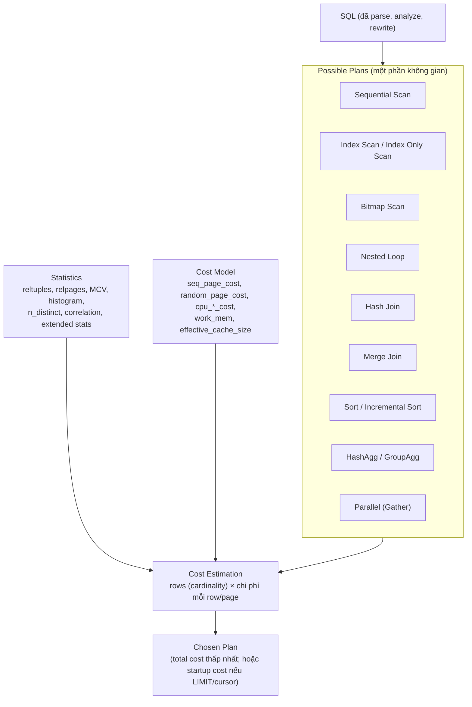
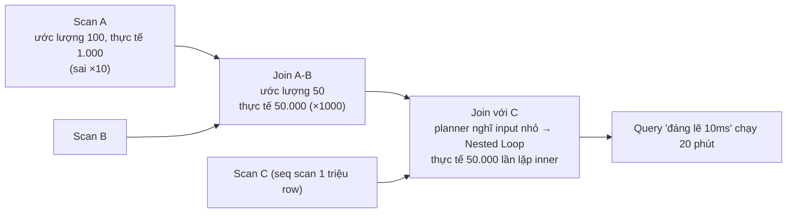
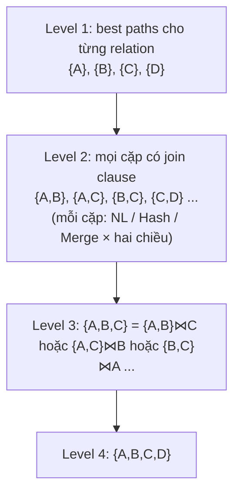
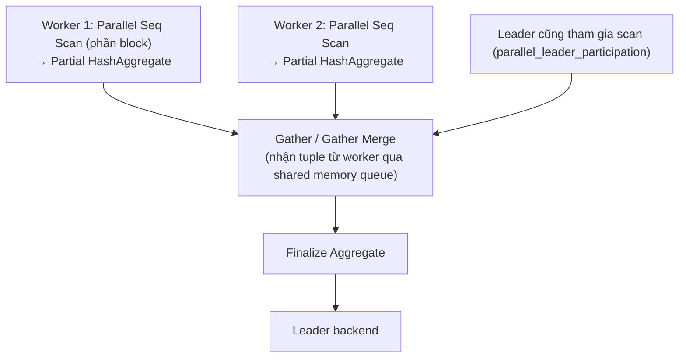

# PART 17 — QUERY PLANNER & OPTIMIZER

> **Trước:** [16 — Composite Index](16-composite-index.md) · **Tiếp:** [18 — EXPLAIN / EXPLAIN ANALYZE](18-explain-analyze.md)
> **Độ ưu tiên:** Rất cao. "Query đột nhiên chậm" gần như luôn là câu chuyện của planner.

---

## Mục lục

1. [Simple mental model](#1-simple-mental-model)
2. [Thuật ngữ: Parser, Planner, Optimizer](#2-thuật-ngữ)
3. [Concept: Cost-Based Optimization — WHAT & WHY](#3-concept-cost-based-optimization)
4. [Không gian plan: các lựa chọn khả dĩ](#4-không-gian-plan)
5. [Statistics: planner biết gì về dữ liệu](#5-statistics)
6. [Selectivity & Cardinality Estimation](#6-selectivity--cardinality-estimation)
7. [Join cardinality và lan truyền sai số](#7-join-cardinality-và-lan-truyền-sai-số)
8. [Extended Statistics](#8-extended-statistics)
9. [Cost Model: các hằng số và công thức](#9-cost-model)
10. [Path generation, pathkeys, join search](#10-path-generation-pathkeys-join-search)
11. [Sort, Aggregate, Parallel Query](#11-sort-aggregate-parallel-query)
12. [Tại sao planner chọn sai](#12-tại-sao-planner-chọn-sai)
13. [Điều khiển planner: GUC, hints, advice](#13-điều-khiển-planner)
14. [What happens if... / Production behavior](#14-what-happens-if--production-behavior)
15. [Trade-off](#15-trade-off)
16. [Common misunderstandings](#16-common-misunderstandings)
- [Concept card — khung 13 điểm](#concept-card--)
17. [Interview Questions](#17-interview-questions)
18. [Key Takeaways](#18-key-takeaways)

---

## 1. Simple mental model

Planner giống **ứng dụng chỉ đường** không có dữ liệu giao thông thời gian thực:
- Nó biết **bản đồ** (schema, index).
- Nó có **số liệu thống kê cũ** về lưu lượng từng tuyến (statistics — được cập nhật khi ANALYZE).
- Với mỗi tuyến khả dĩ, nó **ước lượng** thời gian dựa trên số liệu đó và các giả định (đường cao tốc nhanh gấp 4 lần đường trong phố = `random_page_cost`...), rồi chọn tuyến có thời gian ước lượng thấp nhất.
- Nếu số liệu sai (đường mới xây sau lần khảo sát cuối), hoặc giả định sai (hai tuyến có kẹt xe liên quan nhau nhưng nó coi là độc lập), nó chọn tuyến tệ — một cách **tự tin**.

Planner **không đo**, planner **đoán có hệ thống**. Hiểu nó đoán thế nào là hiểu tại sao nó sai.

---

## 2. Thuật ngữ

| Thuật ngữ | Trong PostgreSQL |
|---|---|
| **Parser** | Chuyển text → parse tree (cú pháp). Không liên quan tối ưu. [Chương 05](05-query-lifecycle.md). |
| **Planner** | Module `optimizer/` biến Query tree → Plan tree. Trong PostgreSQL, "planner" và "optimizer" gần như đồng nghĩa. |
| **Optimizer** | Phần của planner **chọn** giữa các lựa chọn dựa trên chi phí (cost-based) — cùng với các biến đổi dựa trên luật (rule-based rewrites như pull-up subquery, constant folding). |
| **Plan** | Cây node thực thi, mỗi node có cost ước lượng. |
| **Path** | Biểu diễn nhẹ của một cách thực hiện một phần query, dùng để so sánh; path thắng được biến thành plan. |

---

## 3. Concept: Cost-Based Optimization

### 3.1 WHAT

Planner liệt kê (một phần) các cách thực thi khả dĩ, **ước lượng chi phí** mỗi cách bằng một **mô hình chi phí** dựa trên **thống kê**, rồi chọn cách rẻ nhất.

### 3.2 WHY

SQL là declarative ([Chương 00](00-database-mental-model.md#4-relational-database-và-sql-database)). Cùng một query có thể thực thi theo hàng nghìn cách với chênh lệch hiệu năng hàng triệu lần. Ví dụ join 3 table: 3! = 6 thứ tự × 3 thuật toán cho mỗi join × nhiều cách scan mỗi table. Rule-based ("luôn dùng index nếu có") không đủ: đôi khi seq scan tốt hơn index scan, hash join tốt hơn nested loop — tùy **dữ liệu**.

Nếu không có optimizer, người viết SQL phải tự chỉ định cách thực thi (như viết code thủ tục) — mất data independence, và plan không thích nghi khi dữ liệu thay đổi.

### 3.3 HOW — Tổng quan



**Cách đọc diagram (trên xuống):** Planner sinh các khả năng thực thi (scan methods cho từng table, join methods và thứ tự, sort/aggregate...). Mỗi khả năng được gán **cost** = f(số row ước lượng, số page ước lượng, hằng số chi phí). Số row đến từ **statistics** qua **selectivity estimation**. Plan có cost thấp nhất được chọn. **Chất lượng quyết định = chất lượng ước lượng số row** — cost model chỉ là phép nhân trên số row đó.

---

## 4. Không gian plan

| Lựa chọn | Các phương án |
|---|---|
| **Scan method** mỗi table | Seq Scan, Index Scan, Index Only Scan, Bitmap Heap Scan (+ BitmapAnd/Or), TID Scan, TID Range Scan (PG 14), Parallel variants, Function/Values/CTE/Subquery Scan |
| **Join method** | Nested Loop (có thể parameterized — inner là index scan với tham số từ outer; Memoize PG 14), Hash Join (+ parallel hash), Merge Join |
| **Join order** | Thứ tự kết hợp các relation (cây trái sâu và cây bụi — bushy) |
| **Join type** | inner/left/semi/anti... (có thể đổi vai trò inner/outer, ví dụ semi join thành inner join + unique) |
| **Sort** | Không sort (dùng thứ tự index), Sort, Incremental Sort, Top-N |
| **Aggregate** | HashAggregate, GroupAggregate, MixedAggregate, Partial + Finalize (parallel) |
| **Parallelism** | Số worker, Gather vs Gather Merge |
| **Partition** | Pruning, partition-wise join/aggregate |

Planner **không** duyệt toàn bộ không gian — nó dùng dynamic programming có cắt tỉa (mục 10).

---

## 5. Statistics

### 5.1 Hai nguồn thống kê

**(1) Thống kê mức relation — `pg_class`:**
- `reltuples`: ước lượng số tuple live.
- `relpages`: số page lúc thống kê.
- Được cập nhật bởi VACUUM, ANALYZE, CREATE INDEX.
- **Điều chỉnh động:** lúc planning, planner đọc **số page thực tế hiện tại** của file (cheap syscall) và tính `rows ≈ reltuples/relpages × current_pages` — giả định mật độ tuple không đổi. Nhờ vậy table lớn nhanh giữa hai lần ANALYZE vẫn được ước lượng hợp lý về tổng số row.

**(2) Thống kê mức cột — `pg_statistic` (xem qua view `pg_stats`):**

| Cột `pg_stats` | Ý nghĩa | Dùng cho |
|---|---|---|
| `null_frac` | Tỉ lệ NULL | `IS NULL`, loại NULL khỏi các ước lượng khác |
| `avg_width` | Kích thước trung bình (byte) | Ước lượng `width`, memory cho hash/sort |
| `n_distinct` | Số giá trị khác nhau; **số âm = tỉ lệ** so với số row (vd −0.5 nghĩa là số distinct = 50% số row, sẽ tăng theo table); −1 = unique | Equality ngoài MCV, GROUP BY, join |
| `most_common_vals` (MCV) | Danh sách các giá trị phổ biến nhất | Equality chính xác cho giá trị phổ biến |
| `most_common_freqs` | Tần suất tương ứng | |
| `histogram_bounds` | Biên các bucket **cùng số row** (equi-depth), **không gồm** các giá trị MCV | Range (`<`, `>`, BETWEEN) |
| `correlation` | Tương quan (−1..1) giữa thứ tự giá trị và thứ tự vật lý | Chi phí index scan |
| `most_common_elems`, `elem_count_histogram` | Cho array/tsvector | `@>`, `&&`, `@@` |
| `range_*_histogram` | Cho range types | |

### 5.2 ANALYZE thu thập thế nào

1. **Sampling hai giai đoạn:** chọn ngẫu nhiên một tập **block**, rồi chọn ngẫu nhiên **row** trong các block đó — kích thước mẫu = **300 × `default_statistics_target`** (mặc định target 100 → **30.000 row**), bất kể table 1 nghìn hay 10 tỷ row.
2. Từ mẫu, tính null_frac, avg_width, n_distinct (dùng ước lượng Haas–Stokes), MCV (tối đa `target` giá trị — mặc định 100), histogram (tối đa `target` bucket), correlation.
3. Ghi vào `pg_statistic`, cập nhật `reltuples/relpages`.

**Tăng độ chính xác cho cột quan trọng:** `ALTER TABLE t ALTER COLUMN c SET STATISTICS 1000;` (tối đa 10000) → mẫu lớn hơn, MCV/histogram chi tiết hơn; ANALYZE lâu hơn, planning đọc nhiều thống kê hơn.

**Autoanalyze** chạy khi số row thay đổi kể từ lần ANALYZE trước > `autovacuum_analyze_threshold` (50) + `autovacuum_analyze_scale_factor` (0.1) × reltuples. Table 1 tỷ row → phải thay đổi 100 triệu row mới autoanalyze → thống kê có thể **lỗi thời lâu**, đặc biệt với cột tăng dần (timestamp): giá trị mới nhất **nằm ngoài histogram** (mục 12.2).

---

## 6. Selectivity & Cardinality Estimation

**Selectivity** = tỉ lệ row thỏa điều kiện (0..1). **Cardinality (rows)** = selectivity × số row đầu vào.

### 6.1 Equality: `col = const`

```
Nếu const ∈ MCV:          sel = most_common_freqs[i]
Nếu const ∉ MCV:          sel = (1 − null_frac − Σ mcv_freqs) / (n_distinct − số_MCV)
```

Tức là: phần tỉ lệ không thuộc MCV được **chia đều** cho các giá trị không phổ biến còn lại.

**Ví dụ:** `orders` 10 triệu row, cột `status`:
- `null_frac = 0`, `n_distinct = 6`
- MCV: `{done: 0.90, shipped: 0.06, pending: 0.03}`
- `WHERE status = 'pending'` → sel = 0.03 → rows = **300.000**.
- `WHERE status = 'refunded'` (không trong MCV): còn lại 1 − 0.99 = 0.01, chia cho 6 − 3 = 3 giá trị → sel ≈ 0.00333 → rows ≈ **33.333**.

Với tham số chưa biết (generic plan): dùng selectivity "trung bình" ≈ 1/n_distinct (có điều chỉnh MCV).

### 6.2 Range: `col < const` (histogram)

Histogram equi-depth: mỗi bucket chứa cùng số row (của phần không thuộc MCV).

```
histogram_bounds = {0, 100, 250, 400, 600, 1000}   -- 5 bucket, mỗi bucket 20% (phần non-MCV)
WHERE amount < 300
```
- Bucket 1 [0,100) và 2 [100,250) nằm trọn: 2 × 20% = 40%.
- Bucket 3 [250,400): 300 nằm ở (300−250)/(400−250) = 1/3 → **nội suy tuyến tính** 1/3 × 20% ≈ 6.7%.
- Tổng phần histogram ≈ 46.7%, nhân với tỉ lệ non-MCV non-null; cộng thêm phần các giá trị MCV < 300 (tính chính xác từ MCV).

### 6.3 Kết hợp điều kiện

| Biểu thức | Công thức | Giả định |
|---|---|---|
| `A AND B` | sel(A) × sel(B) | **Độc lập** |
| `A OR B` | sel(A) + sel(B) − sel(A)×sel(B) | Độc lập |
| `NOT A` | 1 − sel(A) (trừ NULL) | |
| `x BETWEEN a AND b` | Được nhận diện là range pair, tính trên histogram cho cả khoảng | |

### 6.4 Khi không có thống kê / không hiểu biểu thức

Planner dùng **hằng số mặc định** (trong `selfuncs.h`):

| Loại | Selectivity mặc định |
|---|---|
| Equality (`DEFAULT_EQ_SEL`) | 0.005 |
| Inequality `<`, `>` (`DEFAULT_INEQ_SEL`) | 0.3333 |
| Range cặp (`DEFAULT_RANGE_INEQ_SEL`) | 0.005 |
| Pattern match LIKE (`DEFAULT_MATCH_SEL`) | 0.005 |
| Biểu thức boolean không biết | 0.5 hoặc tùy |

Ví dụ `WHERE lower(email) = 'x'` (không có expression index/statistics trên biểu thức) → 0.5%; `WHERE (data->>'age')::int > 30` → 33%. Các "số ma thuật" này là nguồn estimate sai lớn với JSONB và function.

---

## 7. Join cardinality và lan truyền sai số

### 7.1 Equi-join selectivity

Với `a.x = b.y`, cơ bản (không MCV):

```
sel_join ≈ 1 / max(n_distinct(a.x), n_distinct(b.y))
rows_join ≈ rows_a × rows_b × sel_join
```

Nếu cả hai phía có MCV, planner (`eqjoinsel`) so khớp MCV hai bên để tính chính xác phần giá trị phổ biến, phần còn lại dùng công thức trên. Với FK từ `orders.user_id` → `users.id` (unique): rows ≈ rows_orders (mỗi order khớp đúng 1 user) — PG 9.6+ còn dùng **thông tin foreign key** để cải thiện ước lượng join nhiều cột.

### 7.2 Lan truyền sai số (error propagation)

Sai số **nhân lên qua mỗi join**. Nếu mỗi bước ước lượng sai 10 lần, query 4 join có thể sai 10.000 lần ở tầng trên cùng.



**Cách đọc diagram:** Underestimate ở lá (thường do điều kiện tương quan hoặc thống kê cũ) → join phía trên nghĩ input rất nhỏ → chọn **Nested Loop** (rẻ khi outer nhỏ) → thực tế outer lớn → inner bị thực thi hàng chục nghìn lần. **Underestimate + Nested Loop là mẫu plan thảm họa kinh điển.** Overestimate thường ít nguy hiểm hơn (dẫn tới hash join/seq scan "thừa", chậm hơn nhưng có giới hạn).

---

## 8. Extended Statistics

### 8.1 WHY

Giả định **độc lập** sai với dữ liệu thực: `city = 'Hanoi' AND country = 'VN'` — nếu 5% row là Hanoi và 10% là VN, planner ước lượng 0.5%, nhưng thực tế ~5% (Hanoi ⇒ VN). Underestimate 10 lần.

### 8.2 WHAT

`CREATE STATISTICS` (PG 10+) thu thập thống kê **nhiều cột**:

```sql
CREATE STATISTICS st_city_country (dependencies, ndistinct, mcv) ON city, country FROM addresses;
ANALYZE addresses;
```

| Kind | Version | Giúp gì |
|---|---|---|
| `ndistinct` | PG 10 | Số giá trị khác nhau của **tổ hợp** cột → GROUP BY nhiều cột |
| `dependencies` | PG 10 | Functional dependency mềm (city → country) → điều chỉnh AND |
| `mcv` | PG 12 | Danh sách tổ hợp giá trị phổ biến → chính xác nhất cho AND/OR trên các cột |
| Trên **biểu thức** | PG 14 | `CREATE STATISTICS ... ON (lower(email)), ...` |

Xem kết quả: `pg_stats_ext`. Lưu ý: extended statistics **không được pg_upgrade giữ lại** (PG 18 giữ statistics thường, nhưng không giữ extended) → cần ANALYZE sau upgrade.

---

## 9. Cost Model

### 9.1 Đơn vị và hằng số

Cost là **đơn vị tùy ý**, quy ước **1.0 = chi phí đọc tuần tự một page**.

| Tham số | Mặc định | Ý nghĩa |
|---|---|---|
| `seq_page_cost` | 1.0 | Đọc một page trong chuỗi tuần tự |
| `random_page_cost` | 4.0 | Đọc một page ngẫu nhiên |
| `cpu_tuple_cost` | 0.01 | Xử lý một row |
| `cpu_index_tuple_cost` | 0.005 | Xử lý một index entry |
| `cpu_operator_cost` | 0.0025 | Đánh giá một toán tử/hàm |
| `parallel_setup_cost` | 1000 | Khởi động parallel workers |
| `parallel_tuple_cost` | 0.1 | Chuyển một tuple từ worker về leader |
| `effective_cache_size` | 4GB | Tổng cache kỳ vọng (ảnh hưởng ước lượng I/O lặp lại của index scan) |
| `work_mem` | 4MB | Quyết định sort/hash có spill không (ảnh hưởng cost) |
| `jit_above_cost` | 100000 | Ngưỡng JIT |

**`random_page_cost = 4`** được chọn cho HDD với giả định phần lớn random read trúng cache (random read thực trên HDD đắt hơn ~40 lần, nhưng ~90% trúng cache). Với **SSD/NVMe** và dữ liệu phần lớn trong RAM, giá trị 1.1–2.0 phản ánh thực tế tốt hơn → planner sẵn lòng dùng index scan hơn. Đặt sai tham số này là nguyên nhân phổ biến của "planner thích seq scan quá mức".

### 9.2 Seq Scan cost

```
cost = relpages × seq_page_cost
     + reltuples × cpu_tuple_cost
     + reltuples × cpu_operator_cost × (số toán tử trong filter)
```

Ví dụ: 10.000 page, 1.000.000 row, filter `status = 'x'` (1 toán tử):
`10.000 × 1 + 1.000.000 × 0.01 + 1.000.000 × 0.0025 = 10.000 + 10.000 + 2.500 = 22.500`.

### 9.3 Index Scan cost (đơn giản hóa `cost_index` + `btcostestimate`)

```
index cost  ≈ (số index page đọc) × random_page_cost + (số index tuple) × (cpu_index_tuple_cost + cpu_operator_cost × quals)
heap cost   ≈ interpolate(max_IO_cost, min_IO_cost, correlation²) + (số heap tuple) × cpu_tuple_cost
   max_IO_cost = pages_fetched × random_page_cost       (khi hoàn toàn không tương quan;
                  pages_fetched ước lượng bằng công thức Mackert–Lohman có xét effective_cache_size)
   min_IO_cost = pages cần đọc nếu dữ liệu hoàn toàn tương quan: 1 × random_page_cost + (pages − 1) × seq_page_cost
   heap IO     = max_IO_cost + correlation² × (min_IO_cost − max_IO_cost)
```

**Ý nghĩa của `correlation`:** nếu thứ tự giá trị cột trùng thứ tự vật lý (correlation ≈ 1, ví dụ `id` tăng dần insert tuần tự), các TID liên tiếp trỏ tới cùng/kế tiếp heap page → gần như đọc tuần tự → index scan rẻ ngay cả khi lấy nhiều row. Nếu correlation ≈ 0 (ví dụ `email`), mỗi row có thể là một page khác → random I/O → index scan chỉ rẻ khi lấy rất ít row.

**Ví dụ:** table trên, `WHERE customer_id = 42` trả 100 row, correlation ≈ 0:
- index: ~3 page × 4 + 100 × (0.005 + 0.0025) ≈ 12.75
- heap: ~100 page random × 4 = 400 + 100 × 0.01 = 401
- tổng ≈ **414** ≪ 22.500 → index scan.

Nếu trả 200.000 row (20%): heap ≈ min(200.000, số page...) → ~10.000 page random × 4 = 40.000 + ... > 22.500 → **seq scan**. Bitmap scan (đọc page theo thứ tự, mỗi page một lần) nằm giữa: cost heap giảm dần từ random về sequential khi tỉ lệ page cần đọc tăng.

### 9.4 Startup cost vs Total cost

Mỗi path có hai số: **startup cost** (chi phí trước khi trả row đầu tiên) và **total cost** (trả hết). Ví dụ Sort: startup = gần như toàn bộ (phải đọc hết input); Index Scan: startup ≈ 0. Với `LIMIT 10`, planner ước lượng cost = startup + (total − startup) × (10 / rows) → ưu tiên path có startup thấp.

**Bẫy LIMIT:** `SELECT * FROM orders WHERE status = 'rare' ORDER BY created_at LIMIT 10` — planner có thể chọn "scan index created_at từ đầu, lọc status, dừng khi đủ 10" vì nghĩ (giả định phân bố đều) sẽ gặp 10 row 'rare' sớm. Nếu các row 'rare' đều nằm ở cuối (hoặc không có), scan phải đi gần hết index → cực chậm. Một mẫu plan tệ rất phổ biến.

---

## 10. Path generation, pathkeys, join search

### 10.1 RelOptInfo và Path

- Mỗi relation cơ sở và mỗi tập relation đã join có một **RelOptInfo** chứa danh sách các **Path** còn "sống sót".
- `add_path()` loại path bị **trội (dominated)**: path A trội B nếu A không tệ hơn B về *mọi* tiêu chí: total cost, startup cost, **pathkeys** (thứ tự sắp xếp hữu ích), số row, parallel safety, **parameterization**. Nhờ vậy một path đắt hơn nhưng cho **thứ tự hữu ích** (ví dụ index scan theo cột join) vẫn được giữ, vì nó có thể giúp merge join/ORDER BY phía trên tránh Sort.

### 10.2 Pathkeys

"Thứ tự sắp xếp" của output một path. Index scan trên `(created_at)` có pathkey `created_at ASC`. Planner dùng pathkey để: bỏ Sort cho ORDER BY, dùng Merge Join, GroupAggregate, Incremental Sort.

### 10.3 Parameterized paths

Path của inner relation dùng giá trị từ outer: `Index Scan on orders (user_id = u.id)` — chỉ có nghĩa bên trong Nested Loop. Đây là cách PostgreSQL biểu diễn "index nested loop join".

### 10.4 Join search — dynamic programming



**Cách đọc diagram:** Ở mỗi level, planner xây các RelOptInfo cho tập relation kích thước k từ các tập nhỏ hơn, giữ lại path tốt nhất (và các path có pathkey/parameterization hữu ích) cho mỗi tập. Tránh tích Descartes khi có thể (chỉ ghép tập có join clause, trừ khi buộc phải).

**Giới hạn:**
- `from_collapse_limit` (8) và `join_collapse_limit` (8): số relation tối đa được "trộn" để tìm thứ tự; vượt quá thì giữ nguyên cấu trúc lồng nhau như viết trong SQL. `join_collapse_limit = 1` → **ép thứ tự join theo đúng thứ tự JOIN viết tường minh** (một kiểu "hint" có sẵn).
- `geqo_threshold` (12): từ 12 relation trở lên (sau khi collapse), dùng **GEQO** — genetic algorithm, nhanh hơn nhưng không tối ưu, plan có thể khác nhau nếu đổi `geqo_seed`.

### 10.5 Outer join ordering

Outer join hạn chế việc đổi thứ tự (không phải mọi phép đổi đều giữ ngữ nghĩa). Planner biết các định lý đổi thứ tự hợp lệ (outer join identities) và outer join reduction (LEFT → INNER khi WHERE strict).

---

## 11. Sort, Aggregate, Parallel Query

### 11.1 Sort

- Cost ~ `2 × cpu_operator_cost × N × log2(N)` + I/O nếu vượt `work_mem` (external merge).
- Có LIMIT N nhỏ → top-N heapsort (rẻ).
- Incremental Sort (PG 13) khi input đã sắp theo tiền tố.

### 11.2 HashAggregate vs GroupAggregate

- HashAgg: không cần input sắp; memory ~ số nhóm × kích thước state; có thể spill (PG 13+).
- GroupAgg: cần input sắp (Sort hoặc index); memory O(1).
- Planner ước lượng **số nhóm** (từ n_distinct / extended ndistinct) — ước lượng sai số nhóm → chọn sai (hoặc HashAgg spill nhiều).

### 11.3 Parallel Query



**Cách đọc diagram:** Parallel Seq Scan chia các block của table cho các process (qua một bộ đếm block chung). Mỗi process tính **partial aggregate**; Gather thu về leader; Finalize Aggregate gộp các partial state (dùng combine function). Gather Merge giữ thứ tự khi mỗi worker trả kết quả đã sắp.

Điều kiện và chi phí:
- Table ≥ `min_parallel_table_scan_size` (8MB), index ≥ `min_parallel_index_scan_size` (512kB).
- Số worker theo kích thước table (logarit), tối đa `max_parallel_workers_per_gather` (2), tổng bị giới hạn bởi `max_parallel_workers` và `max_worker_processes`.
- Cost cộng `parallel_setup_cost` (1000) + `parallel_tuple_cost` (0.1) × số tuple chuyển qua Gather → parallel chỉ lợi khi xử lý nhiều, trả ít.
- Hàm dùng trong query phải `PARALLEL SAFE`; query ghi dữ liệu (trừ một số `CREATE TABLE AS`/`SELECT INTO`), cursor, một số trường hợp khác → không parallel.
- Nếu lúc chạy không đủ worker trống → chạy với ít worker hơn (hoặc chỉ leader) — EXPLAIN ANALYZE: `Workers Planned: 2, Workers Launched: 0`.

Parallel join: parallel hash join (PG 11, hash table chia sẻ), parallel-aware append cho partition.

---

## 12. Tại sao planner chọn sai

| Nguyên nhân | Cơ chế | Dấu hiệu / Cách xử lý |
|---|---|---|
| **Thống kê cũ** | Table thay đổi nhiều từ lần ANALYZE cuối | `last_autoanalyze` cũ; `ANALYZE`; giảm `autovacuum_analyze_scale_factor` cho table lớn |
| **Giá trị ngoài histogram** (cột tăng dần) | Query `created_at > now() - 1h` → giá trị lớn hơn biên histogram cuối → ước lượng ~0 row | PostgreSQL có cơ chế tra index để lấy min/max thực tế cho giá trị ngoài biên (`get_actual_variable_range`) giúp giảm vấn đề; vẫn nên ANALYZE thường xuyên |
| **Cột tương quan** | Giả định độc lập → underestimate | `CREATE STATISTICS` |
| **Data skew + generic plan** | Plan cache dùng selectivity trung bình | `plan_cache_mode = force_custom_plan` cho query đó ([Chương 05 §11](05-query-lifecycle.md#11-prepared-statements--plan-cache)) |
| **Biểu thức/JSONB/function** | Selectivity mặc định (0.5%, 33%) | Expression index (có stats), extended stats trên expression, tách cột |
| **LIMIT + filter + ORDER BY** | Giả định phân bố đều → nghĩ sẽ tìm đủ row sớm | Index phù hợp cả filter lẫn sort; viết lại query; MATERIALIZED CTE |
| **Hằng số cost không khớp phần cứng** | `random_page_cost = 4` trên NVMe | Đặt 1.1–2; `effective_cache_size` thực tế |
| **work_mem quá nhỏ trong ước lượng** | Hash/sort bị coi là đắt | Tăng cho session/query |
| **Quá nhiều join** | GEQO / collapse limit | Tách query, CTE MATERIALIZED, `join_collapse_limit` |
| **n_distinct sai** (sample nhỏ trên table rất lớn, phân bố lệch) | Ước lượng GROUP BY/join sai | `ALTER COLUMN ... SET (n_distinct = ...)` thủ công; tăng statistics target |
| **Sau pg_upgrade / restore** | Chưa có statistics (PG 18 giữ stats thường qua pg_upgrade, nhưng không extended) | `ANALYZE` (vacuumdb --analyze-in-stages) |

---

## 13. Điều khiển planner

1. **Sửa đầu vào (ưu tiên):** thống kê (ANALYZE, statistics target, extended statistics), index phù hợp, viết lại query (sargable, EXISTS thay vì IN khi hợp lý...), cost constants đúng phần cứng.
2. **`enable_*` GUCs** (`enable_seqscan`, `enable_nestloop`, `enable_hashjoin`...): không "cấm" hẳn mà làm phương án đó cực kỳ kém hấp dẫn. PG 18 thay đổi cách thể hiện: planner **đếm số node bị disable** và ưu tiên plan có ít node disable hơn (thay vì cộng một hằng số cost khổng lồ), EXPLAIN đánh dấu node bị disable. Dùng để **chẩn đoán** ("nếu cấm nested loop thì plan có nhanh hơn không?"), tránh đặt toàn cục trong production.
3. **`join_collapse_limit = 1`** + JOIN tường minh: ép thứ tự join.
4. **CTE MATERIALIZED:** tạo optimization fence.
5. **Hints:** PostgreSQL core **không có** optimizer hints (chính sách lâu dài của dự án: sửa planner/thống kê thay vì hint). Extension **`pg_hint_plan`** (bên ngoài) cung cấp hint dạng comment.
6. **PG 19 (beta tại thời điểm viết):** extension **`pg_plan_advice`** (và `pg_stash_advice`) trong contrib để "ổn định và điều khiển quyết định của planner" — một thay đổi đáng chú ý về chính sách. Theo dõi khi PG 19 chính thức phát hành.

---

## 14. What happens if... / Production behavior

### 14.1 Plan đột nhiên thay đổi (plan flip)

Triệu chứng: query ổn định hàng tháng, đột nhiên chậm 100×, không có deploy. Nguyên nhân thường gặp:
1. **Autoanalyze** chạy → thống kê mới đẩy ước lượng qua ngưỡng → plan khác (ví dụ index scan → seq scan, hash → nested loop).
2. Dữ liệu tăng trưởng vượt ngưỡng (table nhỏ → lớn).
3. Plan cache chuyển custom → generic.
4. Tham số server đổi (work_mem, random_page_cost), nâng cấp version.
5. Index mới/bị xóa/INVALID.

Chẩn đoán: so EXPLAIN hiện tại với plan cũ (lưu plan bằng `auto_explain` với `log_min_duration`), so estimate vs actual (EXPLAIN ANALYZE), xem `pg_stat_user_tables.last_autoanalyze`, `pg_stats` thay đổi. Chi tiết: [Chương 40, Scenario 17](40-production-behavior.md).

### 14.2 Planning chậm

Nhiều partition không prune được, nhiều join, nhiều index (mỗi index một path để xét), extended stats nhiều. Đo bằng `Planning Time` và `pg_stat_statements.total_plan_time`.

---

## 15. Trade-off

| Lựa chọn thiết kế | Lợi | Hại |
|---|---|---|
| Cost-based với thống kê mẫu | Thích nghi dữ liệu, không cần người dùng chỉ định | Sai khi thống kê sai/giả định sai; plan có thể đổi bất ngờ |
| Không có hint trong core | Buộc sửa gốc (thống kê, planner) | Khó "cứu cháy" nhanh trong production |
| DP đầy đủ tới 8–12 relation | Plan tốt cho query vừa | Planning đắt cho query lớn |
| Giả định độc lập | Đơn giản, rẻ | Underestimate với cột tương quan |
| Thống kê cố định kích thước mẫu | ANALYZE nhanh trên table khổng lồ | Kém chính xác với phân bố đuôi dài |

---

## 16. Common misunderstandings

1. **"Planner luôn chọn plan tối ưu."** — Chọn plan rẻ nhất *theo ước lượng*; ước lượng có thể sai nhiều bậc.
2. **"Cost là mili giây."** — Cost là đơn vị tùy ý tương đối (1 = đọc tuần tự một page).
3. **"Có index mà không dùng là planner lỗi."** — Thường là đúng; hoặc do thống kê/kiểu dữ liệu/biểu thức.
4. **"ANALYZE đọc toàn bộ table."** — Lấy mẫu 300 × target row.
5. **"`enable_seqscan = off` cấm seq scan."** — Chỉ làm nó kém hấp dẫn; không có lựa chọn khác thì vẫn dùng.
6. **"Thêm RAM thì planner tự biết."** — Planner biết qua `effective_cache_size`, không tự đo.
7. **"PostgreSQL có hint."** — Không trong core (extension pg_hint_plan; PG 19 beta có pg_plan_advice).

---

## Concept card — Query Planner theo khung 13 điểm

| # | Khía cạnh | Tóm tắt |
|---|---|---|
| 1 | **WHAT** | Module chọn plan có chi phí ước lượng thấp nhất trong không gian plan khả dĩ. |
| 2 | **WHY** | SQL là declarative; chênh lệch giữa các plan có thể hàng triệu lần và phụ thuộc dữ liệu — §3.2. |
| 3 | **HOW** | Preprocess → paths cho từng relation → join search (DP/GEQO) → upper planning → chọn rẻ nhất → create_plan — §7 (Ch 05) và §10. |
| 4 | **INTERNALS** | `pg_class.reltuples/relpages`, `pg_statistic` (MCV, histogram, n_distinct, correlation), selectivity functions, cost constants, `add_path` dominance, pathkeys, parameterized paths — §5–§10. |
| 5 | **EXAMPLE** | Tính selectivity `status = 'pending'` và histogram range (§6.1–6.2); cost seq vs index scan (§9.2–9.3). |
| 6 | **WHAT HAPPENS IF** | Thống kê cũ, cột tương quan, generic plan với data skew, LIMIT + filter → plan tệ — §12, §14. |
| 7 | **PERFORMANCE IMPACT** | Sai ước lượng nhân qua join → sai thuật toán/thứ tự join; planning time lớn với nhiều join/partition. |
| 8 | **PRODUCTION BEHAVIOR** | Plan flip sau autoanalyze/tăng trưởng dữ liệu; theo dõi bằng `auto_explain`, `pg_stat_statements` (plan time). |
| 9 | **TRADE-OFF** | Thích nghi dữ liệu ↔ không ổn định tuyệt đối; không có hint trong core ↔ khó cứu cháy nhanh — §15. |
| 10 | **WHEN TO USE / NOT** | Luôn để planner làm việc với thống kê tốt; chỉ ép plan (enable_*, join_collapse_limit, MATERIALIZED, pg_hint_plan) tạm thời khi đã hiểu nguyên nhân — §13. |
| 11 | **MISUNDERSTANDINGS** | "Planner luôn tối ưu", "cost là ms", "ANALYZE đọc cả table" — §16. |
| 12 | **INTERVIEW** | Planner chọn plan thế nào, vì sao bỏ index, cardinality sai — §17. |
| 13 | **KEY TAKEAWAYS** | Cardinality estimation là gốc; cost model chỉ nhân lên — §18. |

---

## 17. Interview Questions

**Q1. Query planner của PostgreSQL chọn plan thế nào?**
- *Short:* Sinh các path (scan, join, sort, aggregate), ước lượng cardinality từ statistics, tính cost bằng mô hình chi phí, chọn rẻ nhất; join order bằng DP (GEQO khi ≥ 12 relation).
- *Deep:* MCV/histogram/n_distinct, công thức selectivity, giả định độc lập, correlation trong cost index scan, startup vs total cost, pathkeys và add_path dominance.
- *Follow-up:* Tại sao planner có thể chọn nested loop cho join trả hàng triệu row?

**Q2. Tại sao query có thể bỏ qua index?**
- *Short:* Selectivity cao (seq scan rẻ hơn), table nhỏ, correlation thấp, `random_page_cost` cao, điều kiện không sargable, kiểu không khớp, thống kê sai, generic plan.

**Q3. Cardinality estimation sai gây hậu quả gì? Sửa thế nào?**
- *Short:* Sai số nhân qua join → sai thuật toán join/thứ tự. Sửa: ANALYZE, statistics target, extended statistics, viết lại query.

**Q4. `random_page_cost` là gì? Đặt bao nhiêu trên SSD?**
- *Short:* Chi phí tương đối một random page read; mặc định 4 (HDD + cache); SSD thường 1.1–2.

**Q5. Extended statistics dùng khi nào?**
- *Short:* Cột tương quan (dependencies, mcv), GROUP BY nhiều cột (ndistinct), biểu thức (PG 14).

**Q6. (Senior) Một query chạy tốt 6 tháng, hôm nay chậm 50 lần, không ai deploy. Điều tra thế nào?**
- *Short:* So plan cũ/mới (auto_explain), estimate vs actual, autoanalyze gần đây, tăng trưởng dữ liệu, generic plan, index invalid, tham số đổi; khắc phục tạm (ANALYZE, force custom plan, statistics), khắc phục gốc.

**Q7. (Staff) Tại sao PostgreSQL không có hint? Ưu/nhược?**
- *Short:* Triết lý: hint che giấu vấn đề, cản cải tiến planner, lỗi thời khi dữ liệu đổi. Nhược: khó khắc phục nhanh. Cộng đồng có pg_hint_plan; PG 19 beta đưa pg_plan_advice vào contrib.

---

## 18. Key Takeaways

1. Planner = **cost-based**: sinh path → ước lượng rows từ statistics → cost model → chọn rẻ nhất.
2. **Cardinality estimation là gốc** của mọi quyết định; cost model chỉ nhân lên.
3. Statistics: `reltuples/relpages` + `pg_stats` (null_frac, n_distinct, MCV, histogram, correlation), mẫu 300 × target row.
4. Selectivity: MCV cho equality, histogram nội suy cho range, **giả định độc lập** cho AND → extended statistics khi cột tương quan.
5. Sai số **nhân qua join**; underestimate + nested loop là mẫu thảm họa.
6. Cost: seq_page_cost 1, random_page_cost 4 (hạ cho SSD), cpu_* nhỏ; correlation quyết định index scan rẻ hay đắt; startup vs total cost quyết định plan với LIMIT.
7. Join order bằng DP tới collapse limit 8, GEQO từ 12 relation.
8. Plan có thể đổi đột ngột sau ANALYZE/tăng trưởng/generic plan — cần lưu plan và theo dõi.

---

## Nguồn tham khảo

- PostgreSQL Docs — *Using EXPLAIN*, *Statistics Used by the Planner*, *Controlling the Planner with Explicit JOIN Clauses*: https://www.postgresql.org/docs/current/performance-tips.html
- PostgreSQL Docs — *How the Planner Uses Statistics* (row estimation examples): https://www.postgresql.org/docs/current/planner-stats-details.html
- PostgreSQL Docs — *Query Planning* GUCs: https://www.postgresql.org/docs/current/runtime-config-query.html
- PostgreSQL Docs — *CREATE STATISTICS*, *Parallel Query*.
- PostgreSQL source: `src/backend/optimizer/README`, `costsize.c`, `selfuncs.c`, `src/include/utils/selfuncs.h`.
- Leis et al., *How Good Are Query Optimizers, Really?*, VLDB 2015 (phân tích sai số cardinality, dùng PostgreSQL).
- PostgreSQL 18 / 19 Release Notes.
