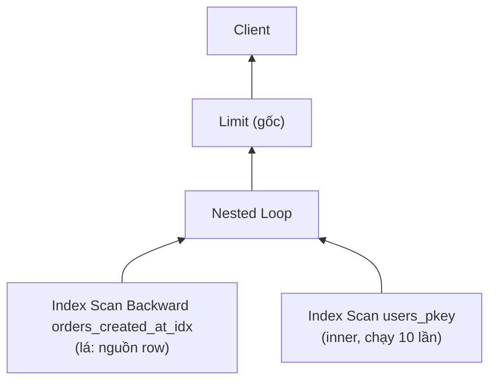
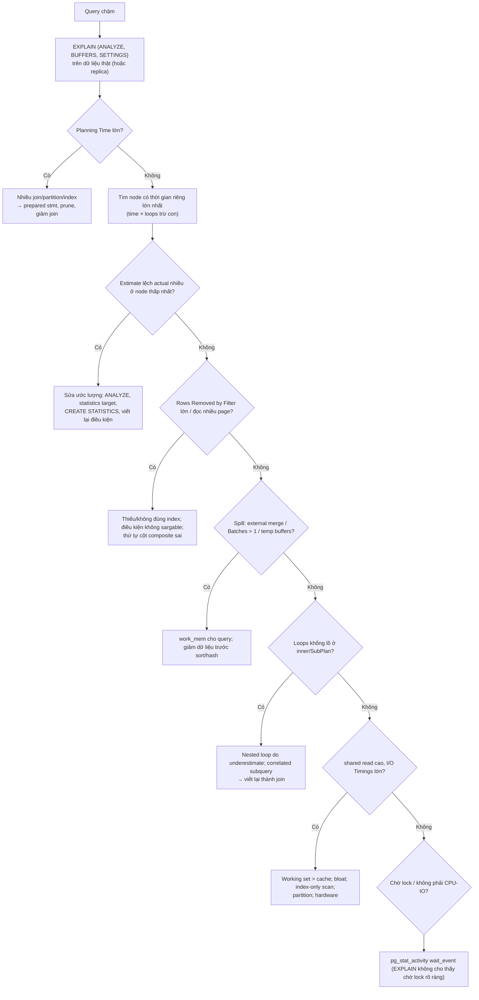

# PART 18 — EXPLAIN / EXPLAIN ANALYZE

> **Trước:** [17 — Query Planner](17-query-planner.md) · **Tiếp:** [19 — Join Algorithms](19-join-algorithms.md)
> **Độ ưu tiên:** Rất cao. EXPLAIN là "ống nghe" của planner — nơi bạn thấy **planner dự đoán gì** và **thực tế xảy ra gì**.

---

## Mục lục

1. [Simple mental model](#1-simple-mental-model)
2. [EXPLAIN vs EXPLAIN ANALYZE — WHAT & WHY](#2-explain-vs-explain-analyze)
3. [Các option](#3-các-option)
4. [Đọc cây plan](#4-đọc-cây-plan)
5. [Phần ước lượng: cost, rows, width](#5-phần-ước-lượng-cost-rows-width)
6. [Phần thực tế: actual time, rows, loops](#6-phần-thực-tế-actual-time-rows-loops)
7. [Buffers và I/O Timings](#7-buffers-và-io-timings)
8. [Các dòng chi tiết theo node](#8-các-dòng-chi-tiết-theo-node)
9. [Planning Time, Execution Time, và những gì không được tính](#9-planning-time-execution-time)
10. [Phân tích một plan hoàn chỉnh (worked example)](#10-worked-example)
11. [Quy trình phân tích query chậm](#11-quy-trình-phân-tích-query-chậm)
12. [What happens if... / Pitfalls](#12-what-happens-if--pitfalls)
13. [Production: auto_explain, pg_stat_statements](#13-production)
14. [Common misunderstandings](#14-common-misunderstandings)
- [Concept card — khung 13 điểm](#concept-card--)
15. [Interview Questions](#15-interview-questions)
16. [Key Takeaways](#16-key-takeaways)

---

## 1. Simple mental model

- `EXPLAIN` = **kế hoạch chuyến đi** kèm dự báo: "đi đường này, dự kiến 30 phút, qua 5 trạm".
- `EXPLAIN ANALYZE` = **thực sự lái xe** và ghi nhật ký: "thực tế mất 2 giờ, kẹt ở trạm 3 do dự báo trạm 3 có 10 xe nhưng thực tế có 10.000 xe".
- Kỹ năng đọc EXPLAIN = tìm **chỗ đầu tiên dự báo lệch thực tế** và hiểu **tại sao**.

---

## 2. EXPLAIN vs EXPLAIN ANALYZE

| | `EXPLAIN` | `EXPLAIN ANALYZE` |
|---|---|---|
| Thực thi query? | **Không** — chỉ plan | **Có** — chạy thật, bỏ kết quả |
| Hiển thị | Ước lượng: cost, rows, width | Ước lượng **và** thực tế: time, rows, loops, (buffers) |
| Tác dụng phụ | Không | **INSERT/UPDATE/DELETE thực sự ghi dữ liệu**, trigger chạy, sequence tăng |
| Thời gian | Nhanh | Bằng thời gian query (+ overhead đo) |

**An toàn với DML:**
```sql
BEGIN;
EXPLAIN (ANALYZE, BUFFERS) UPDATE orders SET status = 'x' WHERE id = 1;
ROLLBACK;   -- hủy thay đổi (nhưng lock đã lấy, WAL đã sinh, sequence đã tăng)
```

**WHY cần cả hai:** Chỉ EXPLAIN không cho biết ước lượng có đúng không. Chỉ đo thời gian tổng không cho biết thời gian bị tiêu ở đâu. EXPLAIN ANALYZE cho phép so **từng node**: ước lượng vs thực tế.

---

## 3. Các option

```sql
EXPLAIN (ANALYZE, BUFFERS, VERBOSE, SETTINGS, WAL, FORMAT TEXT) SELECT ...;
```

| Option | Version | Ý nghĩa |
|---|---|---|
| `ANALYZE` | | Thực thi và đo |
| `BUFFERS` | | Số buffer hit/read/dirtied/written ở mỗi node. **PG 18: tự động bật khi có ANALYZE.** |
| `VERBOSE` | | Tên cột output, schema, chi tiết worker |
| `COSTS` | | Hiển thị cost (mặc định on) |
| `TIMING` | | Đo thời gian mỗi node (mặc định on với ANALYZE); `TIMING OFF` giảm overhead, vẫn có row count |
| `SUMMARY` | | Planning/Execution time |
| `SETTINGS` | PG 12 | Liệt kê GUC ảnh hưởng planner khác mặc định |
| `WAL` | PG 13 | Số WAL record, FPI, bytes sinh ra (PG 18 thêm số lần WAL buffers full) |
| `GENERIC_PLAN` | PG 16 | Hiển thị generic plan cho query có `$1` |
| `SERIALIZE` | PG 17 | Đo chi phí chuyển kết quả sang định dạng gửi client (detoast, output function) |
| `MEMORY` | PG 17 | Memory planner dùng |
| `FORMAT` | | TEXT, JSON, YAML, XML (JSON cho công cụ trực quan hóa như explain.dalibo.com, explain.depesz.com) |

---

## 4. Đọc cây plan

```
Limit  (cost=0.87..45.20 rows=10 width=48) (actual time=0.052..0.310 rows=10.00 loops=1)
  ->  Nested Loop  (cost=0.87..44331.10 rows=10000 width=48) (actual time=0.051..0.305 rows=10.00 loops=1)
        ->  Index Scan Backward using orders_created_at_idx on orders o  (...) (actual ... rows=10.00 loops=1)
              Filter: (status = 'paid'::text)
              Rows Removed by Filter: 3
        ->  Index Scan using users_pkey on users u  (...) (actual time=0.005..0.005 rows=1.00 loops=10)
              Index Cond: (id = o.user_id)
```



**Cách đọc (từ dưới lên về luồng dữ liệu, từ trên xuống về điều khiển):**
1. Mỗi dòng bắt đầu bằng `->` là một node; **thụt lề** cho biết node con.
2. **Dữ liệu chảy từ lá lên gốc**; điều khiển (pull) từ gốc xuống lá (mô hình Volcano, [Chương 05 §8.2](05-query-lifecycle.md#82-how--mô-hình-volcano-iterator-demand-pull)).
3. Với join: node con **đầu tiên** là **outer** (driving), node con **thứ hai** là **inner**.
4. Các dòng không có `->` (Filter, Index Cond, Rows Removed...) là **chi tiết của node ngay trên**.

Ví dụ trên: Limit kéo từ Nested Loop; Nested Loop kéo từng order (quét ngược index created_at, lọc status), với mỗi order chạy inner index scan trên users (10 lần — `loops=10`). Limit đủ 10 row → dừng. Thời gian 0.31ms dù `orders` có thể hàng trăm triệu row.

---

## 5. Phần ước lượng: cost, rows, width

`(cost=0.87..44331.10 rows=10000 width=48)`:

| Trường | Ý nghĩa |
|---|---|
| `cost=A..B` | **A = startup cost**: chi phí ước lượng trước khi node trả row đầu tiên. **B = total cost**: chi phí ước lượng để trả **toàn bộ** row. Đơn vị tùy ý (1 = đọc tuần tự 1 page). Cost của node **bao gồm cost của các node con**. |
| `rows` | Số row **ước lượng** node trả ra (**mỗi lần thực thi** — per loop). |
| `width` | Kích thước trung bình ước lượng mỗi row (byte). |

**Lưu ý với Limit:** node con (Nested Loop) có total cost 44331 cho 10000 row, nhưng Limit chỉ cần 10 row → cost của Limit ≈ startup + (total − startup) × 10/10000 ≈ 45.2. Planner chọn plan này **vì** startup cost thấp.

---

## 6. Phần thực tế: actual time, rows, loops

`(actual time=0.005..0.005 rows=1.00 loops=10)`:

| Trường | Ý nghĩa |
|---|---|
| `actual time=X..Y` | ms. **X** = thời gian tới row đầu tiên, **Y** = thời gian tới row cuối cùng — **trung bình mỗi loop**, **bao gồm thời gian các node con**. |
| `rows` | Số row thực tế **trung bình mỗi loop**. PG 18 hiển thị số thập phân (vd `rows=0.50`) — trước PG 18 bị làm tròn, khiến `rows=0` với loops lớn gây hiểu lầm. |
| `loops` | Số lần node được thực thi (inner của Nested Loop, SubPlan, parallel workers). |

**Tổng thời gian của một node ≈ actual total time × loops.** Tổng số row ≈ rows × loops.

Ví dụ `actual time=0.005..0.005 rows=1.00 loops=10` → tổng ~0.05ms, 10 row. Nhưng `actual time=2.1..2.1 rows=1 loops=50000` → **105 giây** — node "trông rẻ" từng lần nhưng là thủ phạm.

**Thời gian riêng (exclusive) của node** = total time × loops của nó − Σ(total time × loops của các con). Các công cụ trực quan tính sẵn giá trị này.

**Node không bao giờ thực thi:** hiện `(never executed)` — ví dụ inner của join khi outer trả 0 row.

### 6.1 So sánh estimate vs actual — kỹ năng cốt lõi

| Estimate `rows` | Actual `rows` | Diễn giải |
|---|---|---|
| 10.000 | 9.500 | Tốt |
| 5 | 480.000 | **Underestimate ×100.000** → nguy hiểm (nested loop, bộ nhớ hash thiếu → nhiều batch) |
| 500.000 | 12 | Overestimate → plan có thể chọn seq scan/hash thừa, ít thảm họa hơn |

**Tìm node thấp nhất (gần lá nhất) có sai lệch lớn** — đó thường là **gốc** của vấn đề; các node phía trên chỉ thừa hưởng sai số.

---

## 7. Buffers và I/O Timings

```
Buffers: shared hit=1204 read=38211 dirtied=12 written=4, temp read=5120 written=5120
I/O Timings: shared read=412.337 ms, temp read=30.1 ms write=52.9 ms
```

| Trường | Ý nghĩa |
|---|---|
| `shared hit` | Số lần tìm thấy page trong **shared buffers** |
| `shared read` | Số page phải đọc từ **OS** (OS page cache hoặc disk — không phân biệt) |
| `shared dirtied` | Số page bị node này làm dirty (ghi, hint bits, pruning!) |
| `shared written` | Số page node này phải **tự ghi** ra để lấy buffer (dấu hiệu bgwriter/checkpointer không theo kịp) |
| `local ...` | Buffer của temp table |
| `temp read/written` | **Temp file** (sort/hash spill ra disk) — tính theo block 8KB |
| `I/O Timings` | Thời gian chờ I/O (cần `track_io_timing = on`). Nếu `read` nhiều mà time thấp → phần lớn trúng OS cache |

Buffers **cộng dồn từ các node con** (giống time). Số page tương đương dữ liệu: `read=38211` ≈ 298MB.

**WHY Buffers quan trọng hơn thời gian khi tối ưu:** thời gian phụ thuộc cache nóng/lạnh (chạy lần hai nhanh hơn); **số page chạm vào** là thước đo "công việc" ổn định hơn. Query tốt = chạm ít page.

---

## 8. Các dòng chi tiết theo node

### 8.1 Scan

| Dòng | Node | Ý nghĩa |
|---|---|---|
| `Index Cond:` | Index/Index Only/Bitmap Index Scan | Điều kiện được đẩy vào index (có thể gồm cả điều kiện không thu hẹp phạm vi — [Chương 16 §5](16-composite-index.md#5-internals--boundary-condition-vs-index-filter)) |
| `Filter:` | Mọi scan/join | Điều kiện kiểm tra **sau khi đã lấy row** |
| `Rows Removed by Filter: N` | | Số row đọc rồi bỏ (per loop). N lớn so với rows = đọc thừa → cân nhắc index |
| `Recheck Cond:` | Bitmap Heap Scan | Điều kiện kiểm tra lại trên heap |
| `Rows Removed by Index Recheck: N` | Bitmap Heap Scan | Số row bị loại khi recheck — thường do **lossy bitmap** (work_mem nhỏ) hoặc opclass lossy (GIN trigram, GiST) |
| `Heap Blocks: exact=A lossy=B` | Bitmap Heap Scan | lossy > 0 → bitmap vượt work_mem |
| `Heap Fetches: N` | Index Only Scan | Số lần phải đọc heap vì page chưa all-visible trong VM |
| `Index Searches: N` | Index Scan (PG 18) | Số lần descend B-Tree (IN-list, skip scan) |

### 8.2 Sort

```
Sort Method: quicksort  Memory: 2048kB        -- vừa work_mem
Sort Method: top-N heapsort  Memory: 27kB     -- ORDER BY ... LIMIT nhỏ
Sort Method: external merge  Disk: 181240kB   -- SPILL ra disk (vượt work_mem)
```

`external merge` = ghi các run đã sắp ra temp file rồi merge → chậm; tăng `work_mem` cho query đó hoặc tránh sort (index có thứ tự).

### 8.3 Hash (của Hash Join)

```
Hash  (actual rows=2000000 loops=1)
  Buckets: 262144 (originally 1024)  Batches: 16 (originally 1)  Memory Usage: 8193kB
```

- `Batches > 1` → hash table không vừa `work_mem × hash_mem_multiplier` → chia batch, **ghi phần lớn dữ liệu ra temp file** (cả build lẫn probe) → nhiều I/O.
- `(originally 1)`: planner **dự đoán** 1 batch (ước lượng ít row) nhưng thực tế phải tăng lên 16 → dấu hiệu **underestimate** input của Hash.
- `Buckets ... (originally 1024)`: bảng hash phải resize lúc chạy — cũng do underestimate.

### 8.4 Aggregate

```
HashAggregate  Group Key: user_id  Batches: 5  Memory Usage: 8241kB  Disk Usage: 50120kB
```
PG 13+: HashAgg spill → `Batches`, `Disk Usage`.

### 8.5 Memoize (PG 14)

```
Memoize  Cache Key: o.product_id  Cache Mode: logical
  Hits: 99120  Misses: 880  Evictions: 0  Overflows: 0  Memory Usage: 110kB
```
Cache kết quả inner của Nested Loop theo giá trị tham số. Hit ratio cao → tiết kiệm lớn. Evictions nhiều → cache nhỏ (work_mem).

### 8.6 Parallel

```
Gather  (actual rows=... loops=1)
  Workers Planned: 2
  Workers Launched: 2
  ->  Parallel Seq Scan on events  (actual time=... rows=333333 loops=3)
```
`loops=3` = 2 worker + leader; `rows` là **trung bình mỗi process**. `Workers Launched < Planned` → thiếu worker lúc chạy (giới hạn `max_parallel_workers`) → chậm hơn dự kiến.

### 8.7 SubPlan / InitPlan

```
SubPlan 1
  ->  Index Scan ... (actual ... loops=100000)
```
`loops` lớn trên SubPlan = correlated subquery chạy lại cho mỗi row ngoài ([Chương 03 §E](03-sql.md#phần-e--subquery)).

### 8.8 Khác

- `JIT: Functions: 24  Options: Inlining true, Optimization true... Timing: Generation 3.1 ms, Inlining 45 ms, Optimization 210 ms, Emission 150 ms, Total 408 ms` → JIT tốn 408ms; nếu query chỉ 50ms → JIT gây hại ([Chương 05 §12](05-query-lifecycle.md#12-jit-compilation)).
- `Trigger for constraint orders_user_id_fkey: time=1520 calls=100000` → FK check tốn 1.5s (có thể do thiếu index phía con khi xóa cha).
- `WAL: records=100000 fpi=4200 bytes=52000000` (option WAL) → chi phí WAL của DML.

---

## 9. Planning Time, Execution Time

```
Planning:
  Buffers: shared hit=120 read=4
Planning Time: 1.250 ms
Execution Time: 2842.117 ms
```

- **Planning Time**: parse analysis không tính (xấp xỉ planning + rewrite). Lớn → nhiều join, nhiều partition, nhiều index, catalog cache lạnh.
- **Execution Time**: từ ExecutorStart tới ExecutorEnd, **không gồm**: gửi kết quả qua mạng, thời gian client xử lý, (trừ khi `SERIALIZE`) chi phí convert output và detoast cột lớn chỉ cần khi gửi.
- **Overhead đo lường:** `TIMING` gọi đồng hồ hệ thống ở mỗi row mỗi node → với query xử lý hàng trăm triệu row, EXPLAIN ANALYZE có thể **chậm hơn đáng kể** so với chạy thật (đặc biệt trên máy ảo có clock source chậm — dùng `pg_test_timing` để kiểm tra). Dùng `TIMING OFF` khi chỉ cần row count.

---

## 10. Worked example

Query: "doanh thu 30 ngày gần đây theo quốc gia của khách hàng".

```sql
EXPLAIN (ANALYZE, BUFFERS)
SELECT c.country, sum(o.amount)
FROM orders o JOIN customers c ON c.id = o.customer_id
WHERE o.created_at >= now() - interval '30 days'
  AND o.status = 'paid'
GROUP BY c.country;
```

```
HashAggregate  (cost=48210.55..48212.55 rows=200 width=40) (actual time=9123.4..9123.5 rows=52.00 loops=1)
  Group Key: c.country
  Buffers: shared hit=1830221 read=402113
  ->  Nested Loop  (cost=1.00..48160.55 rows=10000 width=14) (actual time=0.09..8820.1 rows=1840000.00 loops=1)
        Buffers: shared hit=1830221 read=402113
        ->  Index Scan using orders_created_at_idx on orders o  (cost=0.56..12160.20 rows=10000 width=14)
                                                   (actual time=0.05..1650.3 rows=1840000.00 loops=1)
              Index Cond: (created_at >= (now() - '30 days'::interval))
              Filter: (status = 'paid'::text)
              Rows Removed by Filter: 160000
              Buffers: shared hit=40 read=402113
        ->  Index Scan using customers_pkey on customers c  (cost=0.43..3.59 rows=1 width=16)
                                                   (actual time=0.003..0.003 rows=1.00 loops=1840000)
              Index Cond: (id = o.customer_id)
              Buffers: shared hit=1830181
Planning Time: 0.9 ms
Execution Time: 9124.2 ms
```

**Phân tích từng bước:**

1. **Tìm node thấp nhất có sai lệch:** `Index Scan on orders`: ước lượng **10.000** row, thực tế **1.840.000** (×184). Gốc vấn đề ở đây.
2. **Tại sao sai?** `created_at >= now() - 30 days`: nếu thống kê cũ, histogram không chứa các giá trị gần đây (cột tăng dần, [Chương 17 §12](17-query-planner.md#12-tại-sao-planner-chọn-sai)); hoặc `status = 'paid'` được nhân độc lập. Kiểm tra `pg_stats` cho `created_at` và `last_autoanalyze`.
3. **Hệ quả lan lên:** planner nghĩ outer 10.000 row → Nested Loop với 10.000 lần index lookup trên customers là rẻ. Thực tế 1,84 triệu lần lookup (`loops=1840000`, mỗi lần 0.003ms ≈ 5.5s + overhead).
4. **Buffers:** `read=402113` trên orders ≈ 3.1GB đọc từ OS — index scan trên created_at với correlation thấp (heap page ngẫu nhiên). `hit=1830181` trên customers — mỗi lookup chạm ~1 page (đã trong cache) nhưng lặp 1,84 triệu lần.
5. **Plan tốt hơn khả dĩ:** với ước lượng đúng (~1,8 triệu row), planner sẽ chọn **Hash Join** (hash customers một lần) và có thể **Bitmap Heap Scan** hoặc **Parallel Seq Scan** trên orders.
6. **Hành động:** `ANALYZE orders;` (hoặc tăng tần suất autoanalyze cho table), cân nhắc index `(status, created_at)` hoặc partial index `WHERE status = 'paid'`, cân nhắc partition theo tháng. Chạy lại EXPLAIN ANALYZE để xác nhận.

---

## 11. Quy trình phân tích query chậm



**Cách đọc diagram (trên xuống):** Đi theo thứ tự từ "rẻ để kiểm tra, hay gặp" tới "hiếm". Ưu tiên sửa **ước lượng** trước khi thêm index hay ép plan, vì ước lượng đúng giúp planner tự chọn tốt cho *mọi* query liên quan.

---

## 12. What happens if / Pitfalls

| Pitfall | Giải thích |
|---|---|
| **Quên nhân loops** | Node có time nhỏ nhưng loops lớn là thủ phạm thật. |
| **Chạy EXPLAIN ANALYZE lần 1 cache lạnh, lần 2 cache nóng** | So sánh Buffers (hit vs read) thay vì chỉ thời gian. |
| **EXPLAIN ANALYZE trên DML không rollback** | Dữ liệu bị sửa thật. |
| **Test trên dữ liệu dev nhỏ** | Plan khác hoàn toàn so với production (planner dựa trên kích thước và phân bố). |
| **Query có tham số** | EXPLAIN với literal có thể ra custom plan khác generic plan mà app thực sự dùng → dùng `EXPLAIN (GENERIC_PLAN)` (PG 16) hoặc `PREPARE` + EXPLAIN EXECUTE nhiều lần. |
| **Parallel query** | rows trung bình mỗi process; cộng lại cho tổng. |
| **Overhead timing lớn** | Dùng `TIMING OFF` hoặc so với thời gian chạy thật. |
| **Thời gian chờ lock** | Được tính vào actual time của node đó nhưng EXPLAIN không nói "chờ lock"; kiểm tra `pg_stat_activity` trong lúc chạy. |
| **Network/client chậm** | Không hiện trong Execution Time. |

---

## 13. Production

- **`auto_explain`** (contrib): tự động log plan (có thể kèm ANALYZE, BUFFERS) của query vượt `auto_explain.log_min_duration`. Lưu lại plan tại thời điểm chậm — vô giá khi điều tra plan flip. `log_analyze` có overhead (timing mọi query được theo dõi) → dùng `log_timing = off` hoặc sample (`auto_explain.sample_rate`).
- **`pg_stat_statements`**: tìm query nào cần EXPLAIN (theo tổng thời gian, mean, shared_blks_read, temp_blks_written).
- **Công cụ trực quan**: explain.depesz.com, explain.dalibo.com (dán output TEXT/JSON) — tính exclusive time, highlight sai lệch estimate.
- **Không chạy EXPLAIN ANALYZE trên primary** cho query nặng không cần thiết — chạy trên replica có cùng dữ liệu (lưu ý replica có thể có cache/stats khác chút; statistics được replicate vì nằm trong catalog).

---

## 14. Common misunderstandings

1. **"cost là mili giây."** — Đơn vị tùy ý.
2. **"actual time là tổng."** — Là trung bình mỗi loop.
3. **"rows=1 thì node rẻ."** — Với loops=1.000.000 thì không.
4. **"Seq Scan trong plan nghĩa là thiếu index."** — Có thể là lựa chọn đúng.
5. **"`Index Cond` chứa điều kiện nghĩa là index được dùng tối ưu."** — Có thể chỉ thu hẹp theo một phần.
6. **"`shared read` = đọc disk."** — Có thể là OS page cache.
7. **"EXPLAIN ANALYZE an toàn trên mọi câu lệnh."** — Nó thực thi thật.
8. **"Execution Time là thời gian người dùng chờ."** — Thiếu planning, network, client.

---

## Concept card — EXPLAIN / EXPLAIN ANALYZE theo khung 13 điểm

| # | Khía cạnh | Tóm tắt |
|---|---|---|
| 1 | **WHAT** | EXPLAIN hiển thị plan + ước lượng; EXPLAIN ANALYZE thực thi và đo từng node. |
| 2 | **WHY** | Chỉ có cách này để thấy planner **dự đoán** gì và **thực tế** khác ở đâu — §2. |
| 3 | **HOW** | Đọc cây (dữ liệu lá → gốc, con đầu là outer), so estimate vs actual, nhân loops, xem Buffers — §4–§7. |
| 4 | **INTERNALS** | Executor instrumentation đo thời gian mỗi `ExecProcNode`, đếm buffer hit/read/dirtied/written, temp I/O; row count per loop. |
| 5 | **EXAMPLE** | Plan doanh thu 30 ngày với Nested Loop 1,84 triệu loops do underestimate — §10. |
| 6 | **WHAT HAPPENS IF** | Quên nhân loops, cache nóng/lạnh, DML không rollback, generic plan khác custom plan — §12. |
| 7 | **PERFORMANCE IMPACT** | TIMING có overhead lớn với query hàng trăm triệu row → `TIMING OFF`. |
| 8 | **PRODUCTION BEHAVIOR** | `auto_explain` lưu plan lúc chậm; `pg_stat_statements` chọn query cần phân tích — §13. |
| 9 | **TRADE-OFF** | ANALYZE cho sự thật nhưng thực thi thật (tốn tài nguyên, có tác dụng phụ); EXPLAIN an toàn nhưng chỉ là dự đoán. |
| 10 | **WHEN TO USE / NOT** | Dùng cho mọi query nóng/chậm với dữ liệu production-like; không chạy ANALYZE query nặng trên primary giờ cao điểm. |
| 11 | **MISUNDERSTANDINGS** | "cost là ms", "actual time là tổng", "shared read = disk read" — §14. |
| 12 | **INTERVIEW** | Đọc cost/rows/loops, Batches, Heap Fetches — §15. |
| 13 | **KEY TAKEAWAYS** | Tìm node thấp nhất có estimate lệch actual; Buffers đo công việc thật — §16. |

---

## 15. Interview Questions

**Q1. Giải thích `cost=0.43..8.45 rows=1 width=72`.**
- *Short:* Startup cost 0.43, total 8.45 (đơn vị tương đối), ước lượng 1 row, 72 byte/row.

**Q2. `actual time` và `loops` đọc thế nào?**
- *Short:* Thời gian trung bình mỗi lần thực thi (tới row đầu..row cuối), bao gồm con; nhân loops để ra tổng.

**Q3. Bạn nhìn gì đầu tiên trong EXPLAIN ANALYZE của một query chậm?**
- *Short:* Node có thời gian riêng lớn nhất và node thấp nhất có estimate lệch actual; Buffers; spill (external merge, batches); loops lớn.

**Q4. `Batches: 16 (originally 1)` nghĩa là gì?**
- *Short:* Hash không vừa memory, spill ra disk; planner dự đoán vừa → underestimate input.

**Q5. `Heap Fetches` cao trong Index Only Scan nghĩa là gì?**
- *Short:* VM chưa đánh dấu all-visible → phải đọc heap; cần VACUUM.

**Q6. `Rows Removed by Index Recheck` lớn?**
- *Short:* Bitmap lossy (work_mem nhỏ) hoặc index lossy (trigram/GiST).

**Q7. (Senior) EXPLAIN ANALYZE báo 50ms nhưng API mất 2s. Tại sao?**
- *Short:* Network/serialize kết quả lớn, chờ connection pool, lock chờ trong lúc thật, plan khác do generic plan/tham số, N+1 query ở app, cache lạnh vs nóng.

---

## 16. Key Takeaways

1. `EXPLAIN` = ước lượng; `EXPLAIN ANALYZE` = thực thi thật + đo (cẩn thận DML).
2. Đọc cây: dữ liệu chảy lá → gốc; join: con đầu là outer, con thứ hai là inner.
3. `cost=startup..total` (đơn vị tương đối), `rows` ước lượng per loop; `actual time` và `rows` **trung bình mỗi loop** → nhân `loops`.
4. Tìm **node thấp nhất có estimate lệch actual** → gốc vấn đề; underestimate nguy hiểm hơn overestimate.
5. `Buffers` (mặc định với ANALYZE từ PG 18) đo công việc thực: hit/read/dirtied/written/temp.
6. Dấu hiệu spill: `external merge Disk`, `Batches > 1`, `temp read/written`, `lossy`.
7. Execution Time không gồm planning, network, client (trừ `SERIALIZE`).
8. Production: `auto_explain` để lưu plan lúc chậm; `pg_stat_statements` để chọn query cần phân tích.

---

## Nguồn tham khảo

- PostgreSQL Docs — *Using EXPLAIN*: https://www.postgresql.org/docs/current/using-explain.html
- PostgreSQL Docs — *EXPLAIN*: https://www.postgresql.org/docs/current/sql-explain.html
- PostgreSQL Docs — *auto_explain*: https://www.postgresql.org/docs/current/auto-explain.html
- PostgreSQL 18 Release Notes (BUFFERS mặc định, fractional rows, index searches).
- Hubert "depesz" Lubaczewski, explain.depesz.com và loạt bài "Explaining the unexplainable".
