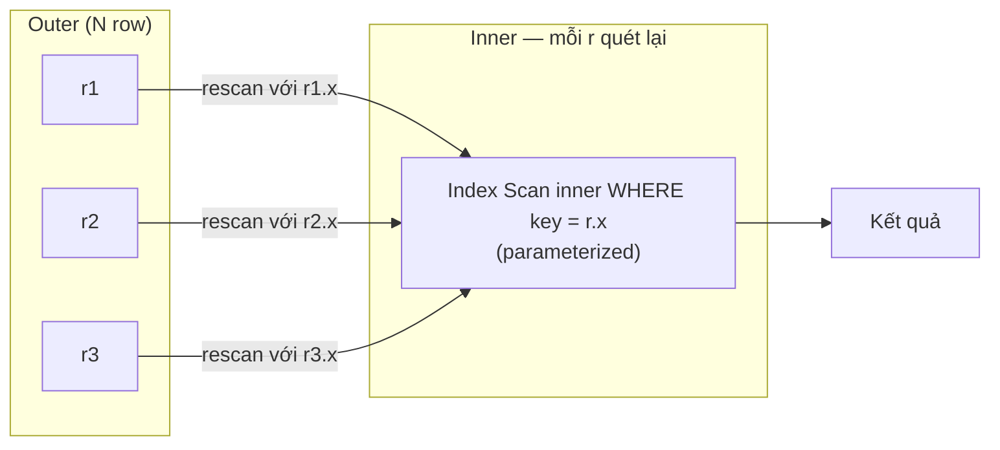
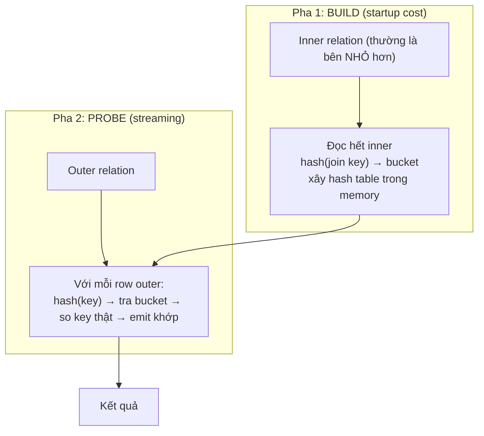
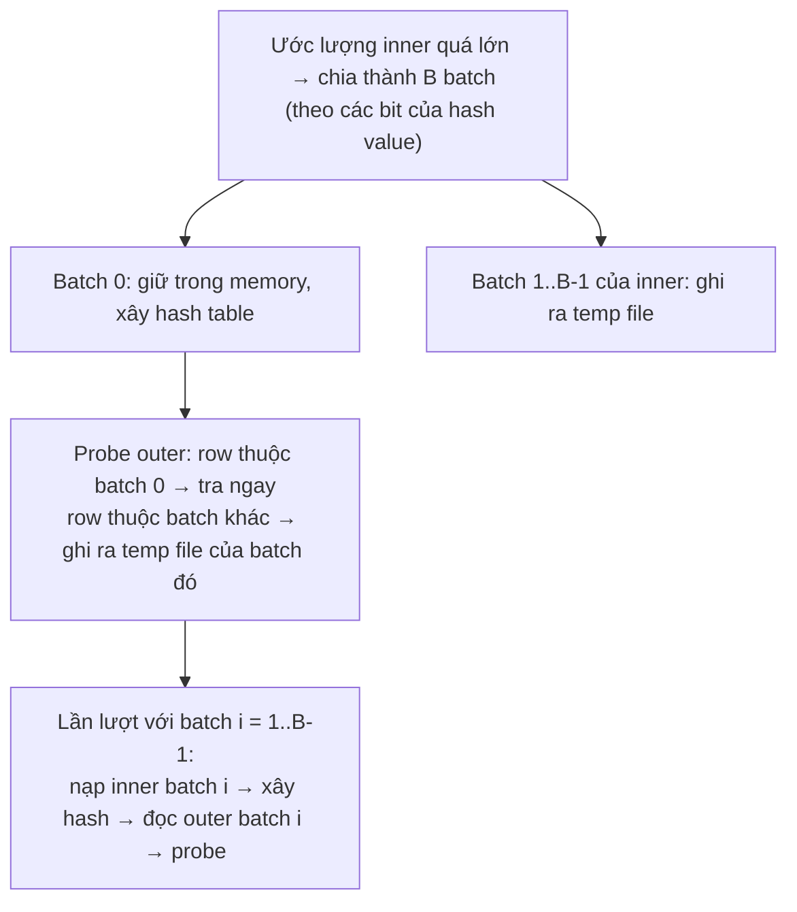
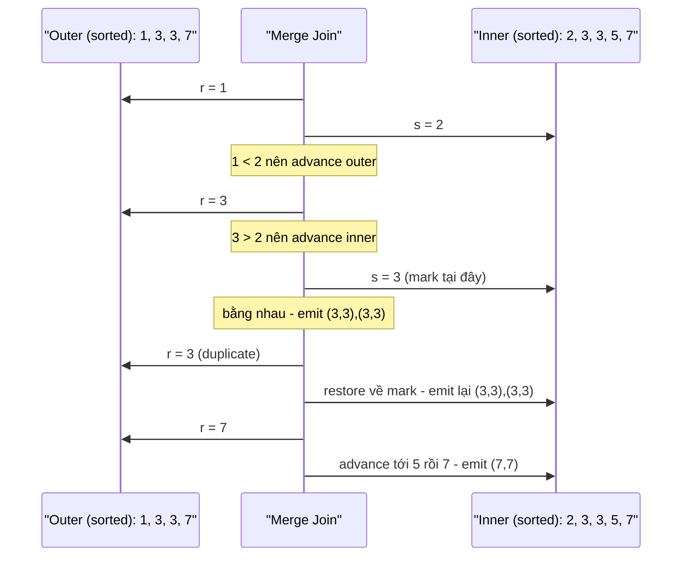
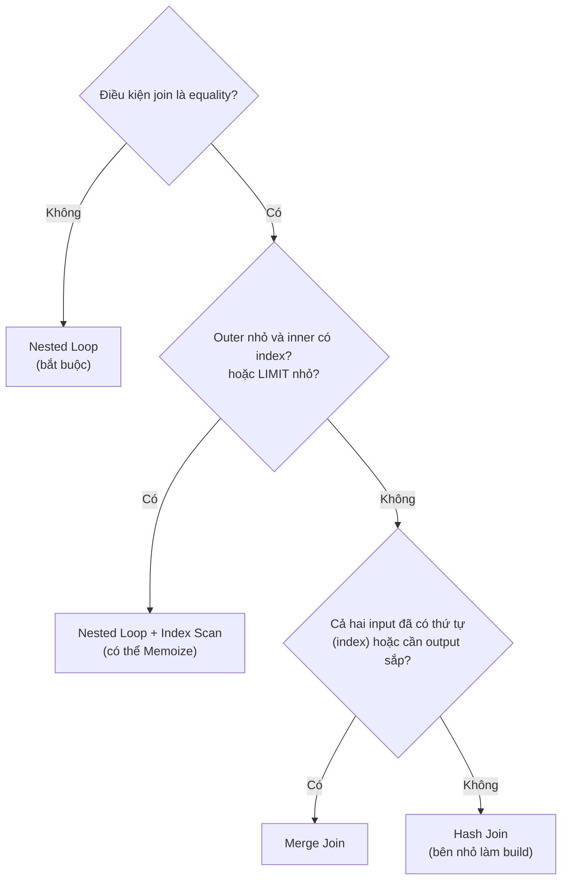

# PART 19 — JOIN ALGORITHMS

> **Trước:** [18 — EXPLAIN ANALYZE](18-explain-analyze.md) · **Tiếp:** [20 — WAL](20-wal.md)

PostgreSQL có **ba** thuật toán join vật lý: **Nested Loop**, **Hash Join**, **Merge Join**. Mọi logical join (INNER, LEFT, SEMI, ANTI, FULL...) đều được thực thi bằng một trong ba ([Chương 03 §C.1](03-sql.md#c1-logical-join-vs-physical-join)). Chương này phân tích từng thuật toán: cách chạy, độ phức tạp, bộ nhớ, disk, phụ thuộc index, khi nào planner chọn, tốt/tệ khi nào.

Ký hiệu: **outer** (bảng "dẫn", con đầu tiên trong EXPLAIN) có N row; **inner** (con thứ hai) có M row.

---

## Mục lục

1. [Simple mental model](#1-simple-mental-model)
2. [Nested Loop Join](#2-nested-loop-join)
3. [Hash Join](#3-hash-join)
4. [Merge Join](#4-merge-join)
5. [Semi Join và Anti Join](#5-semi-join-và-anti-join)
6. [So sánh tổng hợp](#6-so-sánh-tổng-hợp)
7. [Planner quyết định thế nào](#7-planner-quyết-định-thế-nào)
8. [What happens if... / Production](#8-what-happens-if--production)
9. [So sánh với MySQL](#9-so-sánh-với-mysql)
10. [Common misunderstandings](#10-common-misunderstandings)
- [Concept card — khung 13 điểm](#concept-card--)
11. [Interview Questions](#11-interview-questions)
12. [Key Takeaways](#12-key-takeaways)

---

## 1. Simple mental model

Ghép danh sách **học sinh** với danh sách **lớp** theo mã lớp:
- **Nested Loop:** với mỗi học sinh, đi tìm lớp của em đó (nhanh nếu có sổ tra cứu theo mã lớp — index).
- **Hash Join:** chép danh sách lớp thành một **bảng tra nhanh** (hash table) trong đầu, rồi đọc lướt danh sách học sinh, tra từng em.
- **Merge Join:** sắp **cả hai** danh sách theo mã lớp, rồi đi song song hai danh sách như khóa kéo.

---

## 2. Nested Loop Join

### 2.1 Algorithm

```
for each row r in outer:
    for each row s in inner (scan lại, thường với tham số từ r):
        if join_condition(r, s): emit (r, s)
```



**Cách đọc diagram:** Với mỗi row outer, inner được **thực thi lại** (rescan). Nếu inner là **parameterized index scan** (dùng giá trị từ row outer làm điều kiện index), mỗi lần rescan chỉ là một lookup O(log M) — đây là "index nested loop", dạng phổ biến và hiệu quả nhất.

### 2.2 Các biến thể trong PostgreSQL

| Biến thể | Mô tả |
|---|---|
| **Naive nested loop** | Inner là seq scan → O(N × M). Thường có **Materialize** node phía trên inner để lưu kết quả inner vào memory (tuplestore), các lần rescan đọc từ memory thay vì quét lại table. |
| **Index nested loop** | Inner là Index Scan có tham số `(key = outer.col)`. O(N × log M). |
| **Memoize** (PG 14) | Node **Memoize** giữa Nested Loop và inner: cache kết quả inner theo giá trị tham số. Nếu outer có nhiều row trùng giá trị join (ví dụ nhiều order cùng product_id), lookup lặp lại được phục vụ từ cache. Kích thước cache ≤ `work_mem × hash_mem_multiplier`. |

### 2.3 Complexity, memory, disk

| | |
|---|---|
| Thời gian | Naive: O(N·M). Index NL: O(N·log M). Memoize: O(N + D·log M) với D = số giá trị distinct |
| Startup cost | **Rất thấp** — có thể trả row đầu tiên ngay sau lookup đầu tiên |
| Memory | Rất ít (Materialize/Memoize dùng work_mem nếu có) |
| Disk | Không (trừ Materialize spill) |
| Index | **Phụ thuộc mạnh** vào index trên cột join của inner để hiệu quả |
| Điều kiện join | **Mọi loại**: `=`, `<`, `BETWEEN`, `LIKE`, hàm bất kỳ — thuật toán duy nhất hỗ trợ non-equi join |
| Join types | Inner, Left, Semi, Anti (không hỗ trợ Full và Right — planner đổi vai trò khi cần) |

### 2.4 Planner chọn khi nào

- Outer **nhỏ** (ước lượng vài chục đến vài nghìn row) và inner có index trên cột join.
- Có `LIMIT` nhỏ (startup cost thấp — dừng sớm).
- Điều kiện join không phải equality.
- `LATERAL` subquery.

### 2.5 Tốt / Tệ

- **Tốt:** OLTP lookup (lấy order + customer + items của 1 đơn hàng), top-N per group với LATERAL, outer nhỏ.
- **Tệ:** Outer lớn (hàng triệu) — inner bị gọi hàng triệu lần; đặc biệt thảm họa khi planner **underestimate** outer ([Chương 17 §7.2](17-query-planner.md#72-lan-truyền-sai-số-error-propagation), ví dụ ở [Chương 18 §10](18-explain-analyze.md#10-worked-example)). Inner không có index → O(N·M).

---

## 3. Hash Join

### 3.1 Algorithm — hai pha



**Cách đọc diagram:** Pha build đọc **toàn bộ** inner để xây hash table (trong EXPLAIN là node `Hash` là con của `Hash Join`). Chỉ sau khi build xong mới có row đầu tiên → **startup cost cao**. Pha probe đọc outer một lần, tra hash O(1) mỗi row.

Lưu ý: trong EXPLAIN, con **thứ hai** (dưới node `Hash`) là bên được build — planner chọn bên **nhỏ hơn** (theo ước lượng) làm bên build.

### 3.2 Khi hash table không vừa memory — Hybrid Hash Join với batches

Giới hạn memory = `work_mem × hash_mem_multiplier` (mặc định 4MB × 2.0).



**Cách đọc diagram:** Dữ liệu được chia thành các **batch** độc lập theo hash, mỗi batch vừa memory. Batch 0 xử lý ngay; các batch còn lại của **cả inner lẫn outer** bị ghi ra temp file rồi xử lý sau → I/O tăng đáng kể (mọi dữ liệu ngoài batch 0 được ghi một lần và đọc lại một lần). Nếu planner underestimate, số batch phải **tăng động lúc chạy** (`Batches: 16 (originally 1)`), càng tốn kém.

**Skew optimization:** nếu giá trị join ở outer có MCV (giá trị rất phổ biến), PostgreSQL dành riêng một phần memory cho các giá trị "skew" này ở inner để các row outer phổ biến được xử lý ngay trong batch đầu, không phải ghi ra disk.

**Parallel Hash Join (PG 11):** các worker **cùng xây một hash table chia sẻ** trong dynamic shared memory (thay vì mỗi worker xây bản riêng), probe song song. Hiện trong EXPLAIN là `Parallel Hash` / `Parallel Hash Join`.

### 3.3 Complexity, memory, disk

| | |
|---|---|
| Thời gian | O(N + M) (khi vừa memory); thêm I/O O(N + M) khi batch |
| Startup cost | **Cao** (phải build xong inner) |
| Memory | O(M) — hash table của bên build; giới hạn `work_mem × hash_mem_multiplier` |
| Disk | Temp file khi Batches > 1 |
| Index | **Không cần** index (thường dùng seq scan hai bên) |
| Điều kiện join | **Chỉ equality** (toán tử hashable) |
| Join types | Inner, Left, Right, Full, Semi, Anti (và Right Semi/Anti ở version mới) |

### 3.4 Planner chọn khi nào

- Equi-join giữa hai tập **lớn** không có thứ tự sẵn.
- Một bên vừa memory (hoặc ít batch).
- Không có LIMIT nhỏ yêu cầu startup thấp.
- Workload analytics/report, join table lớn với dimension table.

### 3.5 Tốt / Tệ

- **Tốt:** join lớn không cần thứ tự; join với bảng dimension nhỏ-vừa; FULL JOIN.
- **Tệ:** bên build rất lớn (nhiều batch, disk I/O); cần kết quả có thứ tự (phải Sort sau); query có LIMIT nhỏ (phải build toàn bộ trước); underestimate bên build (batch tăng động); key có phân bố lệch nặng (một bucket khổng lồ).

---

## 4. Merge Join

### 4.1 Algorithm

Cả hai input **đã được sắp theo join key** (qua Index Scan có thứ tự, hoặc node Sort). Đi song song như "khóa kéo":

```
r = first(outer); s = first(inner)
while r and s:
    if r.key < s.key: r = next(outer)
    elif r.key > s.key: s = next(inner)
    else:
        mark(inner)                         # nhớ vị trí đầu nhóm key bằng nhau ở inner
        emit mọi cặp (r, s') với s'.key == r.key
        r = next(outer)
        if r.key == key trước: restore(inner) về mark   # outer có duplicate → quét lại nhóm inner
```



**Cách đọc diagram:** Mỗi bên chỉ đi **tiến** (trừ việc quay về mark khi outer có key trùng). Không cần memory lớn. Inner cần hỗ trợ **mark/restore** — nếu không (vd seq scan + sort có thể, hoặc một số node), planner chèn **Materialize** node.

### 4.2 Complexity, memory, disk

| | |
|---|---|
| Thời gian | O(N + M) nếu đã sắp; O(N log N + M log M) nếu phải Sort |
| Startup cost | Thấp nếu input đã sắp (index); cao nếu phải Sort (Sort phải đọc hết) |
| Memory | Thấp (chỉ nhóm duplicate); Sort cần work_mem |
| Disk | Sort có thể spill (external merge) |
| Index | Hưởng lợi lớn nếu có index cung cấp thứ tự trên cột join ở cả hai bên |
| Điều kiện join | Equality với toán tử **mergejoinable** (thuộc B-Tree opfamily) |
| Join types | Inner, Left, Right, Full, Semi, Anti |
| Output | **Có thứ tự** theo join key → giúp ORDER BY/GROUP BY phía trên |

### 4.3 Planner chọn khi nào

- Cả hai input **đã có thứ tự** (index, hoặc output có thứ tự từ node dưới).
- Cần kết quả sắp theo join key (tránh sort riêng).
- Hai tập rất lớn mà hash join cần quá nhiều batch — sort (với memory tốt) + merge có thể rẻ hơn.

### 4.4 Tốt / Tệ

- **Tốt:** join hai table lớn qua PK/FK có index trên cả hai cột; join các partition cùng cách phân vùng; kết quả cần có thứ tự.
- **Tệ:** phải sort cả hai input lớn không có index; key trùng lặp nhiều ở cả hai bên (restore lặp lại nhiều).

---

## 5. Semi Join và Anti Join

Không phải thuật toán riêng — là **chế độ** của ba thuật toán trên:

| | Semi (`EXISTS`, `IN`) | Anti (`NOT EXISTS`, `LEFT JOIN ... IS NULL`) |
|---|---|---|
| Nested Loop | Dừng inner ngay khi tìm thấy khớp đầu tiên | Emit outer khi inner không có khớp nào |
| Hash | Probe: có ít nhất một khớp → emit outer một lần | Probe: không khớp → emit |
| Merge | Emit một lần mỗi outer có khớp | Emit outer không khớp |

Planner cũng có thể biến semi join thành **inner join + làm unique một bên** (`Unique`/HashAgg trên inner) nếu rẻ hơn, hoặc đảo vai trò (Right Semi/Anti Join — build hash trên bên outer logic) ở các version gần đây.

`NOT IN (subquery)` **không** được biến thành anti join (ngữ nghĩa NULL) → thường là **hashed SubPlan** (nếu vừa work_mem) hoặc SubPlan lặp lại — xem [Chương 01 §9.2](01-relational-database.md#92-các-bẫy-kinh-điển).

---

## 6. So sánh tổng hợp

| | Nested Loop | Hash Join | Merge Join |
|---|---|---|---|
| Complexity | O(N·M) / O(N log M) với index | O(N + M) | O(N + M) + sort nếu cần |
| Startup | **Thấp nhất** | **Cao** (build) | Thấp nếu đã sắp; cao nếu Sort |
| Memory | Thấp | O(bên build) — work_mem × hash_mem_multiplier | Thấp (+ Sort) |
| Spill disk | Hiếm | Batches | Sort external merge |
| Cần index? | Gần như bắt buộc (inner) để hiệu quả | Không | Có lợi (tránh Sort) |
| Non-equi join | **Có** | Không | Không |
| FULL JOIN | Không | Có | Có |
| Output có thứ tự | Theo outer | Không | **Theo join key** |
| Tốt nhất khi | Outer nhỏ, inner có index, LIMIT | Hai tập lớn, không thứ tự, equi-join | Hai tập lớn đã sắp/có index, cần thứ tự |
| Rủi ro | Underestimate outer → thảm họa | Underestimate build → batch | Sort lớn tốn |



**Cách đọc diagram:** Đây là trực giác, không phải luật cứng — planner quyết định bằng cost. Nhưng nó giúp dự đoán và kiểm tra: nếu EXPLAIN cho thấy Nested Loop với outer 1 triệu row, hoặc Hash Join cho query `LIMIT 1` cần tra 1 row, hãy nghi ngờ ước lượng.

---

## 7. Planner quyết định thế nào

Với mỗi cặp (tập relation trái, tập relation phải) trong join search ([Chương 17 §10.4](17-query-planner.md#104-join-search--dynamic-programming)), planner thử:
- Nested Loop với mọi path của inner (kể cả parameterized index path, Memoize, Materialize);
- Hash Join theo cả hai chiều (chọn bên build);
- Merge Join với các pathkey khả dĩ (dùng thứ tự sẵn có hoặc thêm Sort).

Cost mỗi phương án phụ thuộc: **ước lượng rows của hai input** (quan trọng nhất), chi phí từng input, `work_mem` (hash/sort có spill không), `random_page_cost` (index lookup trong NL), `effective_cache_size` (lookup lặp lại có trúng cache không).

Các GUC chẩn đoán: `enable_nestloop`, `enable_hashjoin`, `enable_mergejoin`, `enable_memoize`, `enable_material` — tắt tạm trong session để so sánh plan.

---

## 8. What happens if / Production

| Tình huống | Hệ quả | Xử lý |
|---|---|---|
| **Nested Loop với outer thực tế lớn hơn ước lượng 1000×** | Inner chạy hàng triệu lần; query phút → giờ | Sửa ước lượng (ANALYZE, extended stats); tạm thời `SET enable_nestloop = off` trong session để xác nhận |
| **Hash Join `Batches` lớn** | Temp I/O lớn, chậm | Tăng work_mem cho query; lọc sớm hơn để giảm bên build; kiểm tra ước lượng |
| **Merge Join với Sort cả hai bên 50GB** | Sort external merge nhiều | Index phù hợp; hash join nếu một bên nhỏ hơn |
| **Hash join trên key phân bố cực lệch** (90% cùng một giá trị) | Một bucket khổng lồ; batch không chia được | Skew optimization giúp phần nào; xem lại thiết kế |
| **Join trên cột kiểu khác nhau** (`bigint = text`) | Không dùng index/hash được theo toán tử chuẩn, cast mỗi row | Đồng nhất kiểu |
| **Memoize với cache miss cao** | Overhead thêm | `enable_memoize = off` nếu cần (ước lượng distinct sai) |

---

## 9. So sánh với MySQL

MySQL trong thời gian dài **chỉ có nested loop** (và biến thể Block Nested Loop với join buffer). **Hash join** được thêm ở MySQL 8.0.18 (2019) và thay thế BNL từ 8.0.20. MySQL không có merge join truyền thống như PostgreSQL. Vì vậy các query analytics join lớn trên PostgreSQL thường có nhiều lựa chọn thực thi hơn; ngược lại, người quen MySQL hay thiết kế query/index theo tư duy "mọi join là nested loop với index".

---

## 10. Common misunderstandings

1. **"Nested Loop luôn chậm."** — Là lựa chọn tốt nhất cho OLTP lookup với index và outer nhỏ.
2. **"Hash Join luôn nhanh hơn."** — Startup cao, cần memory; tệ với LIMIT nhỏ.
3. **"Merge Join cần index."** — Có thể Sort; index chỉ giúp tránh Sort.
4. **"Hash join dùng index."** — Không cần; thường seq scan hai bên.
5. **"Thứ tự table trong FROM quyết định outer/inner."** — Planner tự quyết (trừ khi vượt collapse limit hoặc `join_collapse_limit = 1`).
6. **"work_mem chỉ ảnh hưởng sort."** — Hash join, hash aggregate, Memoize, bitmap đều dùng.

---

## Concept card — Join Algorithms theo khung 13 điểm

| # | Khía cạnh | Tóm tắt |
|---|---|---|
| 1 | **WHAT** | Ba thuật toán vật lý: Nested Loop, Hash Join, Merge Join thực thi mọi logical join. |
| 2 | **WHY** | Không thuật toán nào tốt cho mọi kích thước input, loại điều kiện, và yêu cầu thứ tự. |
| 3 | **HOW** | NL: lặp outer, rescan inner (thường index); Hash: build bên nhỏ, probe bên lớn; Merge: đi song song hai input đã sắp — §2–§4. |
| 4 | **INTERNALS** | Parameterized path, Materialize, Memoize (PG 14); hybrid hash join với batches, skew optimization, parallel hash (PG 11); mark/restore trong merge. |
| 5 | **EXAMPLE** | Sequence diagram của Merge Join với key trùng (§4.1); batch spill của Hash (§3.2). |
| 6 | **WHAT HAPPENS IF** | NL với outer bị underestimate; Hash nhiều batch; Merge phải sort hai input lớn — §8. |
| 7 | **PERFORMANCE IMPACT** | O(N·log M) vs O(N+M) vs O(N+M)+sort; memory = work_mem × hash_mem_multiplier; startup cost khác nhau — §6. |
| 8 | **PRODUCTION BEHAVIOR** | `loops` khổng lồ trên inner, `Batches: 16 (originally 1)`, `Sort Method: external merge` trong EXPLAIN ANALYZE. |
| 9 | **TRADE-OFF** | Startup thấp (NL) ↔ throughput cho tập lớn (Hash) ↔ output có thứ tự (Merge). |
| 10 | **WHEN TO USE / NOT** | NL: outer nhỏ + index/LIMIT/non-equi; Hash: hai tập lớn equi-join; Merge: input đã sắp hoặc cần thứ tự — §7. |
| 11 | **MISUNDERSTANDINGS** | "NL luôn chậm", "Hash luôn nhanh", "Merge cần index" — §10. |
| 12 | **INTERVIEW** | So sánh ba thuật toán; tại sao non-equi chỉ NL — §11. |
| 13 | **KEY TAKEAWAYS** | Planner chọn theo ước lượng rows — sai ước lượng = sai thuật toán — §12. |

---

## 11. Interview Questions

**Q1. So sánh Nested Loop, Hash Join, Merge Join.**
- *Short:* NL: với mỗi outer quét inner (tốt khi outer nhỏ + index, hỗ trợ non-equi, startup thấp). Hash: build hash bên nhỏ, probe bên lớn (O(N+M), cần memory, equi-join). Merge: hai input đã sắp, đi song song (O(N+M) + sort, output có thứ tự).
- *Follow-up:* Khi nào Nested Loop gây thảm họa? `Batches > 1` nghĩa là gì?

**Q2. Tại sao join non-equality (`a.ts BETWEEN b.start AND b.end`) chỉ có thể dùng Nested Loop?**
- *Short:* Hash cần equality (hash); Merge cần toán tử mergejoinable. Tối ưu bằng index GiST/range trên inner, hoặc viết lại.

**Q3. Hash join chọn bên nào để build?**
- *Short:* Bên nhỏ hơn theo ước lượng (con thứ hai dưới node Hash trong EXPLAIN).

**Q4. Memoize là gì?**
- *Short:* PG 14: cache kết quả inner của Nested Loop theo tham số → hữu ích khi outer có nhiều giá trị join trùng.

**Q5. (Senior) Query join 3 table lớn chạy 40 phút; EXPLAIN ANALYZE thấy Nested Loop với loops=5.000.000. Bạn làm gì?**
- *Short:* Tìm node ước lượng sai (outer underestimate), ANALYZE/extended stats, kiểm tra với enable_nestloop=off trong session, sửa gốc (stats, index, viết lại).

---

## 12. Key Takeaways

1. **Nested Loop**: O(N·log M) với index; startup thấp; duy nhất cho non-equi join; nguy hiểm khi outer bị underestimate.
2. **Hash Join**: O(N+M); build bên nhỏ (startup cao), probe bên lớn; memory = work_mem × hash_mem_multiplier; vượt → batches ra disk.
3. **Merge Join**: cần input sắp (index hoặc Sort); O(N+M) + sort; output có thứ tự; mark/restore cho duplicate.
4. Semi/Anti là chế độ của các thuật toán này; `NOT IN` không thành anti join.
5. Planner chọn theo cost dựa trên **ước lượng rows** → sai ước lượng = sai thuật toán.

---

## Nguồn tham khảo

- PostgreSQL Docs — *Planner/Optimizer* (Generating Possible Plans): https://www.postgresql.org/docs/current/planner-optimizer.html
- PostgreSQL source: `src/backend/executor/nodeNestloop.c`, `nodeHashjoin.c`, `nodeHash.c`, `nodeMergejoin.c`, `nodeMemoize.c`.
- Shapiro, *Join Processing in Database Systems with Large Main Memories*, ACM TODS 1986 (hybrid hash join).
- Graefe, *Query Evaluation Techniques for Large Databases*, ACM Computing Surveys 1993.
