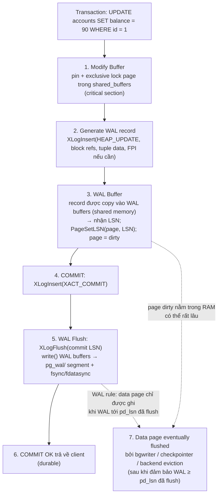
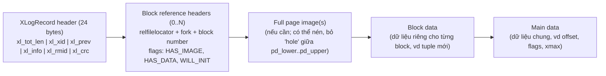
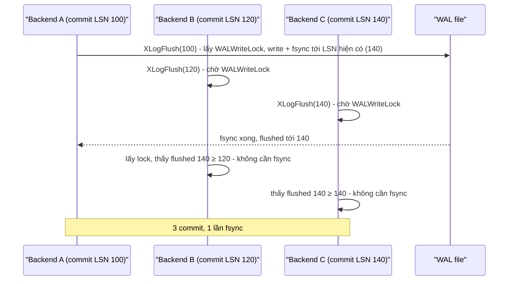
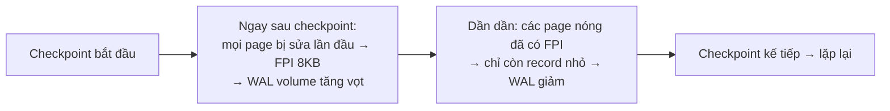
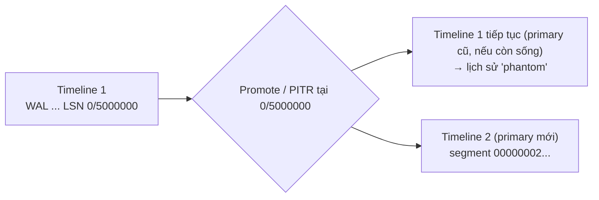

# PART 20 — WAL (Write-Ahead Logging)

> **Trước:** [19 — Join Algorithms](19-join-algorithms.md) · **Tiếp:** [21 — Checkpoint](21-checkpoint.md)
> **Độ ưu tiên:** Cao nhất. WAL là xương sống của durability, crash recovery, replication, PITR và CDC.

---

## Mục lục

1. [Simple mental model](#1-simple-mental-model)
2. [WHAT — WAL là gì, nguyên tắc WAL](#2-what)
3. [WHY — Tại sao cần WAL; nếu không có thì sao](#3-why)
4. [HOW — Luồng ghi từ UPDATE tới COMMIT](#4-how--luồng-ghi)
5. [INTERNALS 1 — WAL Record](#5-internals-1--wal-record)
6. [INTERNALS 2 — LSN](#6-internals-2--lsn)
7. [INTERNALS 3 — WAL Buffers và WAL insertion](#7-internals-3--wal-buffers-và-wal-insertion)
8. [INTERNALS 4 — WAL Segment files](#8-internals-4--wal-segment-files)
9. [INTERNALS 5 — Flush, fsync, WAL Writer, Group Commit](#9-internals-5--flush-fsync-wal-writer-group-commit)
10. [INTERNALS 6 — Full Page Writes](#10-internals-6--full-page-writes)
11. [wal_level: minimal, replica, logical](#11-wal_level)
12. [Redo, Checkpoint, Timeline, Archive — WAL trong vòng đời hệ thống](#12-redo-checkpoint-timeline-archive)
13. [WHAT HAPPENS IF...](#13-what-happens-if)
14. [PERFORMANCE IMPACT](#14-performance-impact)
15. [PRODUCTION BEHAVIOR](#15-production-behavior)
16. [TRADE-OFF & so sánh InnoDB](#16-trade-off--so-sánh-innodb)
17. [COMMON MISUNDERSTANDINGS](#17-common-misunderstandings)
18. [INTERVIEW QUESTIONS](#18-interview-questions)
19. [KEY TAKEAWAYS](#19-key-takeaways)

---

## 1. Simple mental model

Một kế toán ghi **sổ nhật ký** (journal) trước khi cập nhật **sổ cái** (ledger):
- Mỗi nghiệp vụ được ghi **ngay** vào nhật ký — một cuốn sổ chỉ viết nối tiếp, không bao giờ sửa trang cũ. Viết nối tiếp rất nhanh.
- Sổ cái (nhiều trang rải rác) được cập nhật **khi rảnh**.
- Nếu văn phòng cháy giữa chừng (crash), nhưng nhật ký nằm trong **két chống cháy** (đã fsync), kế toán mới chỉ cần **đọc lại nhật ký từ điểm kiểm kê gần nhất** (checkpoint) và áp các nghiệp vụ vào sổ cái → sổ cái đúng như trước khi cháy.
- Chi nhánh khác muốn có bản sao sổ cái? Gửi cho họ **bản sao nhật ký** — họ tự áp (replication).
- Muốn biết sổ cái trông thế nào lúc 10:03 hôm qua? Lấy bản chụp sổ cái lúc 0:00 (base backup) + áp nhật ký tới 10:03 (PITR).

---

## 2. WHAT

**Write-Ahead Logging** là kỹ thuật trong đó **mọi thay đổi đối với data file trước tiên được mô tả trong một log tuần tự (WAL), và log đó phải được ghi bền vững lên storage trước khi thay đổi tương ứng trên data page được ghi ra disk**.

**Nguyên tắc WAL (the WAL rule)** — có hai vế:
1. **Trước khi một data page bị sửa được ghi ra disk**, mọi WAL record mô tả thay đổi trên page đó (tới `pd_lsn` của page) phải đã được flush.
2. **Trước khi COMMIT được báo thành công**, WAL record commit của transaction (và mọi record trước nó) phải đã được flush.

Trong PostgreSQL, WAL nằm ở `pg_wal/`, là chuỗi file **segment** 16MB.

---

## 3. WHY

### 3.1 Bài toán

Transaction sửa 50 row nằm trên 50 page ở 10 file khác nhau (heap + index). Để đảm bảo **durability** khi commit, cần chắc rằng thay đổi sống sót qua mất điện.

### 3.2 Nếu không có WAL — "force at commit"

Phải **ghi và fsync cả 50 page** trước khi báo commit:
- 50 **random write** + fsync nhiều file → hàng chục ms trên SSD, hàng trăm ms trên HDD.
- Page 8KB có thể bị **ghi rách (torn)** khi mất điện giữa lúc ghi (disk/OS chỉ đảm bảo nguyên tử 512B–4KB) → page hỏng, không có cách phục hồi.
- Nếu crash sau khi ghi 30/50 page → trạng thái nửa vời; muốn rollback cần biết giá trị cũ → cần undo log (lại là một loại log).
- Page "nóng" (cùng page bị sửa bởi nhiều transaction liên tiếp) phải ghi lại mỗi lần commit.
- Không có cách gửi thay đổi sang replica ngoài gửi cả page.

### 3.3 Với WAL — "no-force, redo log"

- Commit chỉ cần flush **WAL** — một **sequential append**, vài KB, một lần fsync. Nhiều transaction đồng thời chia sẻ **một** fsync (group commit).
- Data page được ghi **lười** (bởi bgwriter/checkpointer), gom nhiều thay đổi vào một lần ghi.
- Crash → **redo** từ WAL.
- Torn page → sửa bằng **full page image** trong WAL.
- WAL là một **luồng thay đổi có thứ tự** → **replication** (gửi WAL), **PITR** (lưu WAL), **CDC** (giải mã WAL).

WAL biến "N random write + fsync" thành "1 sequential write + fsync" trên đường commit — đây là lý do mọi database nghiêm túc đều dùng write-ahead log dưới dạng nào đó (ARIES, 1992).

---

## 4. HOW — Luồng ghi

### 4.1 Diagram bắt buộc



**Cách đọc diagram (trên xuống):**

1. **Modify buffer:** Backend sửa page **trong shared buffers** (không phải trên disk), dưới exclusive content lock, trong một **critical section** (lỗi ở đây → PANIC, vì memory và WAL có thể không khớp).
2. **Generate WAL:** Tạo WAL record mô tả chính xác thay đổi vật lý (block nào, offset nào, dữ liệu gì).
3. **WAL buffer:** Record được chép vào **WAL buffers** (vùng shared memory `wal_buffers`); record nhận một **LSN** (vị trí trong luồng WAL). Page được gán `pd_lsn = LSN` và đánh dấu **dirty**. Tới đây, **chưa có gì xuống disk**.
4. **COMMIT** sinh WAL record commit.
5. **WAL flush:** `XLogFlush(commit LSN)` — ghi mọi WAL tới LSN đó từ buffers ra file segment và **fsync**. (Có thể đã được walwriter hoặc backend khác flush trước — group commit.)
6. **Trả về client.** Từ giờ transaction bền vững: dù data page chưa hề được ghi, WAL đủ để tái tạo.
7. **Data page** được ghi ra disk **muộn hơn** — có thể vài giây tới vài phút sau (tới checkpoint). Trước khi ghi, buffer manager kiểm tra WAL đã flush tới `pd_lsn` chưa (nếu chưa thì flush — đảm bảo vế 1 của WAL rule).

### 4.2 Tại sao WAL phải được persist trước data page?

Giả sử làm ngược lại — data page được ghi ra disk **trước** khi WAL mô tả nó được flush, rồi crash:
- Data file chứa thay đổi của transaction **chưa commit** (hoặc commit record chưa flush).
- Sau restart, WAL không có record nào về thay đổi đó → recovery không biết nó tồn tại.
- Không thể xác định trạng thái đúng: tuple mới có xmin của transaction không có commit record → được coi là aborted → **invisible**. Nghe có vẻ ổn? Không hẳn:
  - Với các thay đổi **không phải tuple** (cấu trúc B-Tree: page split, con trỏ cha–con, FSM, VM), data page ở trạng thái mà WAL không biết → cấu trúc có thể **không nhất quán** (index page trỏ tới page chưa tồn tại trong WAL history, split dở dang).
  - **Replica** (nhận WAL) sẽ khác primary vĩnh viễn — primary có thay đổi mà WAL không ghi.
  - `pd_lsn` trên page lớn hơn vị trí cuối WAL → recovery bối rối về trạng thái page.
- Vế 1 của WAL rule đảm bảo: **mọi thứ nằm trên disk đều có thể giải thích bằng WAL đã flush** → recovery luôn đưa hệ thống về một trạng thái nhất quán.

Vế 2 (commit chờ WAL flush) đảm bảo durability: transaction đã báo commit thì có commit record trên disk.

---

## 5. INTERNALS 1 — WAL Record

### 5.1 Cấu trúc (PG 9.5+ "generic" record format)



**Cách đọc diagram (trái sang phải):**
- **Header:** tổng độ dài, XID của transaction (nếu có), **xl_prev** (LSN record trước — tạo chuỗi ngược để phát hiện record lạc), **xl_rmid** (resource manager nào sẽ replay), **xl_info** (loại record trong rmgr đó), **xl_crc** (CRC-32C của toàn record — phát hiện record hỏng/ghi dở).
- **Block references:** record có thể sửa nhiều block (UPDATE sang page khác = 2 block; B-Tree split = 3+ block). Mỗi block ref nói block nào bị sửa và có kèm FPI không.
- **FPI:** ảnh toàn page (trừ "hole" trống giữa pd_lower và pd_upper để tiết kiệm), có thể nén (`wal_compression`).
- **Data:** thông tin đủ để replay (không phải "SQL" — là thay đổi **vật lý** ở mức page).

### 5.2 Resource managers

WAL là **physical logging** (chính xác hơn: *physiological* — vật lý tới page, logic bên trong page). Mỗi loại cấu trúc có resource manager (rmgr) biết cách ghi và replay record của mình:

| rmgr | Record ví dụ |
|---|---|
| `Heap` / `Heap2` | INSERT, UPDATE, HOT_UPDATE, DELETE, LOCK, PRUNE, FREEZE, VISIBLE, MULTI_INSERT |
| `Btree` | INSERT_LEAF, SPLIT_L/R, DELETE, VACUUM, NEWROOT, DEDUP |
| `Transaction` | COMMIT, ABORT, PREPARE, COMMIT_PREPARED |
| `XLOG` | CHECKPOINT_ONLINE/SHUTDOWN, FPI, SWITCH, BACKUP_END, PARAMETER_CHANGE |
| `Storage` | CREATE, TRUNCATE (tạo/cắt file) |
| `CLOG`, `MultiXact`, `CommitTs` | Mở rộng/cắt SLRU |
| `Standby` | RUNNING_XACTS, LOCK (thông tin cho hot standby) |
| `Gin`, `Gist`, `Hash`, `SPGist`, `BRIN`, `Sequence`, `Generic`, `LogicalMessage`... | |

Công cụ `pg_waldump` giải mã WAL segment thành văn bản:

```
rmgr: Heap   len (rec/tot): 72/72, tx: 1001, lsn: 0/05A3F2C8, prev 0/05A3F290, desc: HOT_UPDATE old_xmax: 1001, old_off: 1, old_infobits: [], flags: 0x10, new_xmax: 0, new_off: 2, blkref #0: rel 1663/16384/16385 blk 0
rmgr: Transaction len (rec/tot): 34/34, tx: 1001, lsn: 0/05A3F310, prev 0/05A3F2C8, desc: COMMIT 2025-06-01 10:00:00.123456 UTC
```

### 5.3 Physical vs logical logging

| | Physical/Physiological (PostgreSQL WAL) | Logical (MySQL binlog ROW/STATEMENT) |
|---|---|---|
| Mô tả | "Block 57 của file 16385: ghi tuple X ở offset Y" | "UPDATE row id=1 của table accounts: balance 100 → 90" |
| Replay | Nhanh, chính xác đến byte | Cần tầng SQL/engine |
| Phụ thuộc | Phiên bản, kiến trúc, layout vật lý (replica phải cùng major version, cùng kiến trúc) | Độc lập vật lý |
| Dùng cho | Recovery, physical replication | Replication giữa version/engine khác, CDC |

PostgreSQL có được "logical" từ WAL qua **logical decoding** (khi `wal_level = logical` — WAL chứa thêm thông tin đủ để tái dựng row) — [Chương 25](25-replication.md).

---

## 6. INTERNALS 2 — LSN

**LSN (Log Sequence Number)**: số 64-bit = **vị trí byte trong luồng WAL** (tính từ lúc cluster được tạo). Hiển thị dạng hai số hex `X/Y` (32 bit cao / 32 bit thấp), ví dụ `0/5A3F2C8`, `3A/1F000060`.

LSN tăng đơn điệu → là **"đồng hồ" của database**:

| LSN / hàm | Ý nghĩa |
|---|---|
| `pg_current_wal_insert_lsn()` | Vị trí đã chèn vào WAL buffers |
| `pg_current_wal_lsn()` | Vị trí đã **write** ra OS |
| `pg_current_wal_flush_lsn()` | Vị trí đã **flush** (bền vững) |
| `pd_lsn` trên mỗi page | LSN record cuối sửa page |
| Checkpoint `redo` LSN | Điểm bắt đầu recovery |
| `pg_stat_replication.sent_lsn / write_lsn / flush_lsn / replay_lsn` | Tiến độ replica |
| `pg_replication_slots.restart_lsn`, `confirmed_flush_lsn` | WAL mà slot còn cần |
| `pg_last_wal_replay_lsn()` (trên standby) | Replica đã replay tới đâu |

`pg_wal_lsn_diff(a, b)` = số byte giữa hai LSN → đo **replication lag theo byte**, **tốc độ sinh WAL**:

```sql
-- Tốc độ sinh WAL: đo hai lần cách nhau 60 giây
SELECT pg_current_wal_lsn();  -- 3A/1F000060
-- 60s sau: 3A/2B400000  → pg_wal_lsn_diff = ~205MB/phút
```

---

## 7. INTERNALS 3 — WAL Buffers và WAL insertion

### 7.1 WAL Buffers

Vùng shared memory kích thước `wal_buffers` (mặc định −1 = 1/32 `shared_buffers`, tối thiểu 64kB, tối đa 16MB — một segment). Là **ring buffer** các page WAL 8KB (`XLOG_BLCKSZ`).

### 7.2 WAL insertion — làm sao nhiều backend cùng ghi vào một log tuần tự?

Log tuần tự dễ trở thành **nút thắt**: mọi backend ghi đều phải "xếp hàng" vào một vị trí duy nhất. PostgreSQL (9.4+) tách làm hai bước:

1. **Reserve space:** lấy spinlock rất ngắn trên `insertpos`, **cấp một khoảng byte** [start, end) cho record (chỉ cộng con số) → nhận LSN. Nhả ngay.
2. **Copy:** chép record vào WAL buffers tại vị trí đã cấp, dưới một trong **8 WALInsertLock** (`NUM_XLOGINSERT_LOCKS`) — nhiều backend chép **song song** vào các vùng khác nhau.

Khi cần flush tới LSN X, phải đợi mọi backend đang chép vào vùng < X hoàn tất (kiểm tra các WALInsertLock).

Nếu WAL buffers đầy (vùng cần dùng chưa được ghi ra file) → backend phải tự ghi WAL cũ ra trước (`pg_stat_wal.wal_buffers_full` tăng) → tăng `wal_buffers` nếu thấy thường xuyên.

Contention: wait event `LWLock:WALInsert` (chép), `LWLock:WALWrite` (chờ ghi/flush), `IO:WALSync`, `IO:WALWrite`.

---

## 8. INTERNALS 4 — WAL Segment files

### 8.1 Đặt tên

Mỗi segment 16MB (mặc định; đổi được lúc `initdb --wal-segsize` từ PG 11). Tên 24 ký tự hex:

```
000000010000003A0000001F
└──┬───┘└──┬───┘└──┬───┘
timeline  "log"   segment
(8 hex)  (32 bit cao LSN) (32 bit thấp LSN / segsize)
```

LSN `3A/1F000060` với segment 16MB → segment `...0000003A0000001F`, offset 0x60 trong file. Timeline tăng khi promote/PITR (mục 12.3).

### 8.2 Vòng đời segment

- **Preallocation & recycling:** segment cũ không còn cần (sau checkpoint) được **đổi tên** thành segment tương lai thay vì xóa và tạo mới (tránh chi phí cấp phát file). Số segment giữ lại điều chỉnh giữa `min_wal_size` (80MB) và `max_wal_size` (1GB) theo mức sinh WAL gần đây.
- **Khi nào segment được xóa/recycle:** chỉ khi **tất cả** điều kiện: (1) nằm trước redo point của checkpoint gần nhất; (2) đã được archive (nếu `archive_mode = on`); (3) không còn replication slot nào cần (`restart_lsn`); (4) ngoài `wal_keep_size`.
- **`pg_switch_wal()`** / `archive_timeout`: buộc chuyển sang segment mới (segment hiện tại được đóng, có thể archive ngay) — dùng để giới hạn RPO khi ít ghi.

---

## 9. INTERNALS 5 — Flush, fsync, WAL Writer, Group Commit

### 9.1 write vs flush

- **write**: `write()` WAL buffers ra file → dữ liệu vào **OS page cache**. Sống sót qua crash **process** PostgreSQL, **không** sống sót qua crash OS/mất điện.
- **flush**: `fdatasync()`/`fsync()` (hoặc ghi với `O_DSYNC`) → dữ liệu xuống storage bền vững. Phương thức: `wal_sync_method` (Linux mặc định `fdatasync`; `open_datasync`, `fsync`, `fsync_writethrough`, `open_sync`). `pg_test_fsync` đo tốc độ các phương thức.

### 9.2 Ai flush WAL?

| Ai | Khi nào |
|---|---|
| **Backend lúc COMMIT** | `XLogFlush(commit LSN)` nếu `synchronous_commit` ≠ off |
| **WAL writer** | Mỗi `wal_writer_delay` (200ms) hoặc khi có ≥ `wal_writer_flush_after` (1MB) chưa flush — giúp async commit và giảm việc backend phải tự làm |
| **Backend khi evict dirty page** | Nếu `pd_lsn` > flush LSN (WAL rule) |
| **Backend khi WAL buffers đầy** | Ghi (không nhất thiết flush) để có chỗ |
| **Checkpointer** | Flush tới checkpoint record |

### 9.3 Group commit



**Cách đọc diagram:** Khi A flush, nó ghi **mọi WAL đã có trong buffers** (kể cả của B, C). B và C thức dậy thấy WAL của mình đã bền vững → trả về ngay. Dưới tải cao, **số fsync/giây không tăng tuyến tính theo số commit/giây** — đây là lý do throughput commit của PostgreSQL vượt xa 1/latency_fsync khi có nhiều connection.

`commit_delay` (µs) + `commit_siblings`: backend flush sẽ **cố ý chờ** một chút nếu có ≥ commit_siblings transaction khác đang chạy, để gom thêm commit vào cùng fsync. Chỉ hữu ích khi fsync rất đắt và concurrency cao.

---

## 10. INTERNALS 6 — Full Page Writes

### 10.1 WHAT

Khi `full_page_writes = on` (mặc định), **lần đầu tiên một page bị sửa sau mỗi checkpoint**, WAL record kèm **toàn bộ ảnh page (FPI — full page image)**. Các lần sửa tiếp theo page đó (cho tới checkpoint kế) chỉ ghi record nhỏ.

### 10.2 WHY — Torn page

Page PostgreSQL 8KB; disk/OS thường chỉ đảm bảo ghi **nguyên tử 512B hoặc 4KB**. Mất điện giữa lúc ghi page → **torn page**: một phần mới, một phần cũ. WAL record thông thường ("chèn tuple ở offset Y") **không thể** replay đúng lên một page rách — nó giả định page ở trạng thái nhất quán trước đó.

FPI giải quyết: khi recovery gặp record có FPI, nó **ghi đè toàn bộ page** bằng ảnh trong WAL (không quan tâm page trên disk rách hay không) rồi áp các record sau đó. Vì FPI được ghi lần đầu *sau checkpoint*, và recovery bắt đầu từ checkpoint, **mọi page bị sửa kể từ checkpoint đều có FPI trong vùng WAL mà recovery sẽ đọc**.

### 10.3 HOW — Quyết định có FPI không

Khi chèn record sửa block B: nếu `pd_lsn` của B ≤ **redo LSN của checkpoint gần nhất** (tức page chưa bị sửa kể từ checkpoint) → kèm FPI. Kiểm tra được thực hiện ở `XLogInsertRecord` (có xử lý race với checkpoint bắt đầu đồng thời).

### 10.4 PERFORMANCE IMPACT — "FPI storm" sau checkpoint



**Cách đọc diagram:** Tốc độ sinh WAL có hình **răng cưa** theo chu kỳ checkpoint. Một UPDATE 100 byte có thể sinh 8KB WAL nếu là lần đầu chạm page sau checkpoint. Với workload update ngẫu nhiên trên table lớn, FPI có thể chiếm **phần lớn** WAL.

Giảm FPI:
- **Checkpoint thưa hơn** (`checkpoint_timeout` 15–30 phút, `max_wal_size` lớn) → mỗi page nóng chỉ FPI một lần mỗi chu kỳ dài hơn. Đổi lại: recovery lâu hơn.
- **`wal_compression`** (`pglz`, `lz4`, `zstd` từ PG 15) nén FPI → giảm WAL đáng kể, tốn CPU.
- Key insert tuần tự (không UUIDv4) → ít page khác nhau bị chạm.

### 10.5 FPI và hint bits

Thay đổi hint bit bình thường không sinh WAL. Nhưng khi bật **data checksums** hoặc `wal_log_hints = on`, lần đầu đặt hint bit trên page sau checkpoint phải ghi **FPI** (record `XLOG_FPI_FOR_HINT`) — vì page bị ghi rách sau khi chỉ đổi hint bit sẽ có checksum sai. `wal_log_hints`/checksums là bắt buộc cho `pg_rewind`.

### 10.6 Tắt full_page_writes?

Chỉ an toàn nếu storage đảm bảo ghi nguyên tử 8KB (ví dụ ZFS copy-on-write với recordsize phù hợp). Ngược lại → corruption sau crash. InnoDB giải bài toán này bằng **doublewrite buffer** (ghi page vào vùng doublewrite trước, rồi mới ghi vào vị trí thật).

---

## 11. wal_level

| `wal_level` | WAL chứa | Cho phép |
|---|---|---|
| `minimal` | Chỉ đủ cho crash recovery; một số thao tác bulk (COPY/CTAS vào table tạo/truncate trong cùng transaction) **không ghi WAL cho dữ liệu** mà fsync file lúc commit | Crash recovery. **Không** replication, không archive/PITR |
| `replica` (mặc định) | Đủ cho archive và physical replication; thêm thông tin cho hot standby (running xacts, locks) | Streaming replication, PITR, `pg_basebackup` |
| `logical` | Thêm thông tin cho **logical decoding** (vd old key của row bị UPDATE/DELETE theo replica identity, cờ cho catalog tuple) | Logical replication, CDC |

`logical` sinh nhiều WAL hơn `replica` một chút (tùy replica identity: `FULL` ghi cả row cũ → nhiều hơn đáng kể). PG 19 (beta) cho phép bật logical decoding tự động khi `wal_level = replica` mà không cần restart (`effective_wal_level`).

---

## 12. Redo, Checkpoint, Timeline, Archive

### 12.1 Redo

**Redo** = áp lại WAL record lên data page. Tính **idempotent** nhờ `pd_lsn`: khi replay record có LSN L lên page P, nếu `P.pd_lsn ≥ L` → page đã chứa thay đổi này (đã được ghi ra disk trước crash) → **bỏ qua**; nếu nhỏ hơn → áp dụng và đặt `pd_lsn = L`. Record có FPI → ghi đè page bằng ảnh.

**PostgreSQL chỉ có redo, không có undo** — transaction chưa commit không cần hoàn tác vật lý; tuple của nó invisible qua CLOG ([Chương 10 §2.4](10-acid.md#24-internals--tại-sao-không-cần-undo)).

### 12.2 Checkpoint

Checkpoint = điểm mà **mọi dirty page đã được flush** → recovery chỉ cần bắt đầu từ **redo point** của checkpoint gần nhất; WAL trước đó có thể recycle. [Chương 21](21-checkpoint.md).

### 12.3 Timeline

Mỗi lần **promote standby** hoặc **PITR kết thúc**, lịch sử WAL **rẽ nhánh**: PostgreSQL tăng **timeline ID** (bắt đầu từ 1) và ghi file `0000000N.history` mô tả "timeline N rẽ ra từ timeline N−1 tại LSN X".



**Cách đọc diagram:** Sau điểm rẽ nhánh, hai lịch sử có thể cùng tồn tại (ví dụ primary cũ vẫn nhận ghi trong split-brain). Timeline ID trong tên segment ngăn WAL của hai nhánh trộn lẫn. Recovery/standby theo `recovery_target_timeline` (mặc định `latest` từ PG 12) để đi theo nhánh mới nhất. Rejoin primary cũ yêu cầu tua lại nó về điểm rẽ nhánh (`pg_rewind`) — [Chương 30](30-failover.md).

### 12.4 Archive

`archive_mode = on` + `archive_command` (hoặc `archive_library`, PG 15): khi segment hoàn tất, archiver sao chép nó ra ngoài (S3, NFS, pgBackRest/WAL-G repository). Chuỗi WAL archive liên tục + base backup = **PITR** ([Chương 31](31-backup-pitr.md)). Theo dõi: `pg_stat_archiver` (`failed_count`, `last_failed_wal`).

### 12.5 Replication

Standby nhận WAL qua **walsender** (đọc từ WAL buffers/segment) và replay bằng cùng code recovery — **replication vật lý chính là crash recovery chạy liên tục** ([Chương 25](25-replication.md)). Replication slot giữ WAL cho tới khi standby/consumer xác nhận.

---

## 13. WHAT HAPPENS IF...

| Tình huống | Hành vi |
|---|---|
| **Crash giữa lúc ghi một WAL record** | Record cuối ghi dở → CRC sai hoặc `xl_tot_len` vượt dữ liệu → recovery coi đó là **cuối WAL**, dừng ở record hợp lệ trước đó. Transaction liên quan không có commit record hợp lệ → aborted. Không mất commit đã báo OK (commit OK chỉ trả sau khi flush trọn record). |
| **`pg_wal` hết chỗ** | Không ghi được WAL → **PANIC** → server dừng. Khởi động lại cần giải phóng chỗ (không bao giờ xóa tay file trong pg_wal — xóa slot không dùng, sửa archive_command, mở rộng disk). [Chương 40, Scenario 9–10](40-production-behavior.md). |
| **archive_command lỗi liên tục** | Segment không được recycle → pg_wal phình → disk full. |
| **Replication slot inactive** | `restart_lsn` đứng yên → giữ mọi WAL → disk full (trừ khi `max_slot_wal_keep_size` giới hạn → slot bị invalidate). PG 18: `idle_replication_slot_timeout` tự invalidate slot không hoạt động. |
| **Ai đó xóa file trong pg_wal bằng tay** | Có thể mất WAL cần cho crash recovery → **database không khởi động được** hoặc mất dữ liệu; standby/archive đứt chuỗi. `pg_resetwal` là công cụ cứu cuối cùng, **gây mất dữ liệu và có thể hỏng nhất quán**. |
| **WAL segment bị hỏng trên disk** | Recovery dừng tại chỗ hỏng: có thể mất các transaction sau điểm đó. Standby/archive giúp khôi phục. |
| **fsync nói dối (cache không bảo vệ)** | Mất điện → WAL "đã flush" thực ra mất → mất commit + nguy cơ corruption. |
| **Transaction khổng lồ (UPDATE 500 triệu row)** | Sinh hàng trăm GB WAL; pg_wal có thể vượt max_wal_size nhiều (checkpoint không theo kịp); replica lag lớn; archive tắc. |

---

## 14. PERFORMANCE IMPACT

1. **Commit latency ≈ latency fsync WAL** (khi synchronous_commit = on). Storage có latency fsync thấp (NVMe với power-loss protection) là đầu tư hiệu quả nhất cho OLTP ghi nhiều.
2. **WAL volume** quyết định: I/O ghi, băng thông replication, dung lượng archive, thời gian recovery. Nguồn WAL lớn: FPI, index (mỗi index một record), non-HOT update, UPDATE copy cả tuple, VACUUM (prune/freeze records), `REPLICA IDENTITY FULL`.
3. **Tách WAL ra disk riêng**: tránh fsync WAL cạnh tranh với random I/O của data.
4. **`synchronous_commit = off`** cho dữ liệu kém quan trọng: commit không chờ fsync → latency giảm mạnh.
5. **Batch ghi** (nhiều row mỗi transaction, COPY) giảm số commit record và số fsync.
6. **`wal_compression`** giảm volume, tốn CPU.
7. **`wal_buffers`** quá nhỏ với workload ghi lớn → backend tự ghi WAL.

---

## 15. PRODUCTION BEHAVIOR

| Theo dõi | Nguồn |
|---|---|
| Tốc độ sinh WAL (bytes/s) | Chênh lệch `pg_current_wal_lsn()` theo thời gian; `pg_stat_wal.wal_bytes`, `wal_fpi`, `wal_records` (PG 14+) |
| Tỉ lệ FPI | `pg_stat_wal.wal_fpi` / `wal_records`; `EXPLAIN (ANALYZE, WAL)` cho từng câu |
| WAL buffers full | `pg_stat_wal.wal_buffers_full` |
| I/O WAL | `pg_stat_io` (PG 18 có hàng WAL), wait events `WALWrite`, `WALSync` |
| Dung lượng pg_wal | `SELECT sum(size) FROM pg_ls_waldir();` |
| Archive | `pg_stat_archiver` |
| Slot giữ WAL | `pg_replication_slots` (`restart_lsn`, `wal_status`, `safe_wal_size`) |
| Query sinh nhiều WAL | `pg_stat_statements.wal_bytes` (PG 13+) |

---

## 16. TRADE-OFF & so sánh InnoDB

| | PostgreSQL | MySQL/InnoDB |
|---|---|---|
| Redo log | WAL segments (không giới hạn cứng, tùy checkpoint/slot/archive) | Redo log kích thước cố định (circular; MySQL 8.0.30+ `innodb_redo_log_capacity`) — hết chỗ → buộc checkpoint (stall) |
| Log cho replication | **Cùng WAL** | **Binlog** riêng ở tầng server (cần 2PC nội bộ giữa redo và binlog) |
| Torn page | Full page writes (trong WAL) | Doublewrite buffer (vùng riêng) |
| Undo | Không | Undo log |
| Logical decoding | Từ WAL (wal_level=logical) | Binlog ROW format |

| Lợi ích WAL | Chi phí |
|---|---|
| Commit = 1 sequential fsync; group commit | WAL volume (đặc biệt FPI) |
| Redo recovery đơn giản | Recovery time tỉ lệ WAL từ checkpoint |
| Replication/PITR/CDC từ cùng nguồn | pg_wal có thể phình (slot, archive) → disk full |
| Physical replication chính xác tuyệt đối | Replica phải cùng major version, cùng kiến trúc |

---

## 17. COMMON MISUNDERSTANDINGS

1. **"Commit nghĩa là dữ liệu đã ghi vào table file."** — Chỉ WAL đã flush.
2. **"WAL là log SQL."** — Là thay đổi vật lý ở mức page.
3. **"WAL chỉ dùng cho recovery."** — Còn cho replication, PITR, CDC (logical decoding), incremental backup (WAL summaries PG 17).
4. **"Có thể xóa bớt file trong pg_wal khi đầy disk."** — Tuyệt đối không.
5. **"full_page_writes chỉ tốn chỗ, có thể tắt."** — Tắt → torn page corruption.
6. **"UPDATE một cột nhỏ sinh WAL nhỏ."** — Có thể 8KB+ FPI (và nhiều index record).
7. **"synchronous_commit = off gây corruption."** — Chỉ mất transaction gần nhất.

---

## 18. INTERVIEW QUESTIONS

**Q1. WAL là gì và tại sao phải ghi WAL trước data page?**
- *Short:* Log tuần tự mô tả mọi thay đổi; commit chỉ cần flush WAL (sequential, group commit); data page ghi lười. WAL phải trước data page để mọi thứ trên disk luôn giải thích được bằng WAL đã flush → recovery nhất quán.
- *Deep:* Hai vế WAL rule, pd_lsn, critical section, redo idempotent, FPI chống torn page.
- *Follow-up:* Chuyện gì nếu data page được ghi trước WAL?

**Q2. Chuyện gì xảy ra khi COMMIT (góc nhìn WAL)?**
- *Short:* Chèn commit record, XLogFlush tới LSN đó (write + fsync, có thể chung với người khác), rồi CLOG/ProcArray, trả OK.

**Q3. LSN là gì? Dùng để làm gì?**
- *Short:* Vị trí byte 64-bit trong WAL; đánh dấu page (pd_lsn), đo lag, checkpoint redo point, slot.

**Q4. Full page writes là gì? Tại sao WAL tăng vọt sau checkpoint?**
- *Short:* Lần sửa đầu mỗi page sau checkpoint ghi ảnh 8KB để chống torn page; sau checkpoint mọi page "mới được chạm" đều FPI.

**Q5. wal_level khác nhau thế nào?**
- *Short:* minimal (chỉ crash recovery), replica (replication/PITR), logical (logical decoding/CDC).

**Q6. (Senior) Disk đầy vì pg_wal. Nguyên nhân khả dĩ và xử lý?**
- *Short:* Slot inactive, archive_command lỗi, max_wal_size quá lớn/checkpoint chậm, wal_keep_size, transaction khổng lồ. Xử lý: xác định nguyên nhân (pg_replication_slots, pg_stat_archiver), drop slot/sửa archive, mở rộng disk; không xóa tay; đặt max_slot_wal_keep_size, cảnh báo.

**Q7. (Senior) Làm sao giảm WAL volume?**
- *Short:* Checkpoint thưa hơn, wal_compression, giảm index, tăng HOT (fillfactor), tránh no-op update, key tuần tự, replica identity phù hợp, unlogged cho dữ liệu tạm.

---

## 19. KEY TAKEAWAYS

1. **WAL rule**: WAL phải bền vững trước data page (tới pd_lsn) và trước khi báo commit.
2. Commit = **một sequential fsync** (chia sẻ qua group commit); data page ghi lười bởi bgwriter/checkpointer.
3. WAL record: header (XID, prev, rmgr, CRC) + block refs + FPI + data; là physiological log, replay bởi resource manager.
4. **LSN** = vị trí byte trong WAL — đồng hồ của database (pd_lsn, lag, slot, checkpoint).
5. **Full page writes** chống torn page; gây WAL răng cưa theo chu kỳ checkpoint; giảm bằng checkpoint thưa + wal_compression.
6. Redo idempotent nhờ pd_lsn; PostgreSQL chỉ có redo.
7. Cùng một WAL phục vụ: crash recovery, physical replication, PITR (archive), CDC (wal_level=logical), incremental backup.
8. Kẻ thù production: pg_wal đầy (slot, archive, transaction khổng lồ) → PANIC.

---

## Nguồn tham khảo

- PostgreSQL Docs — *Reliability and the Write-Ahead Log* (WAL, Asynchronous Commit, WAL Configuration, WAL Internals): https://www.postgresql.org/docs/current/wal.html
- PostgreSQL Docs — *pg_waldump*, *pg_test_fsync*, *pg_stat_wal*.
- PostgreSQL source: `src/backend/access/transam/README` (WAL), `xlog.c`, `xloginsert.c`, `xlogrecovery.c`, `src/include/access/xlogrecord.h`.
- C. Mohan et al., *ARIES: A Transaction Recovery Method Supporting Fine-Granularity Locking and Partial Rollbacks Using Write-Ahead Logging*, ACM TODS 1992.
- Hironobu Suzuki, *The Internals of PostgreSQL*, chương 9 (Write Ahead Logging).
