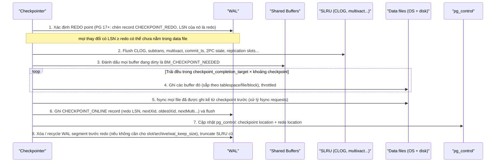
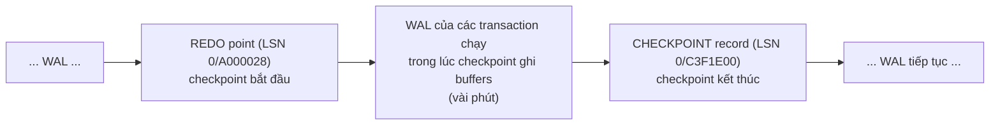
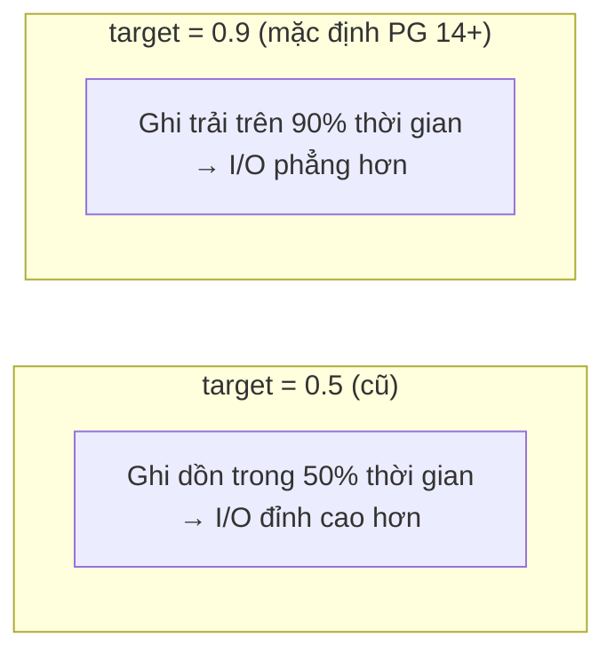
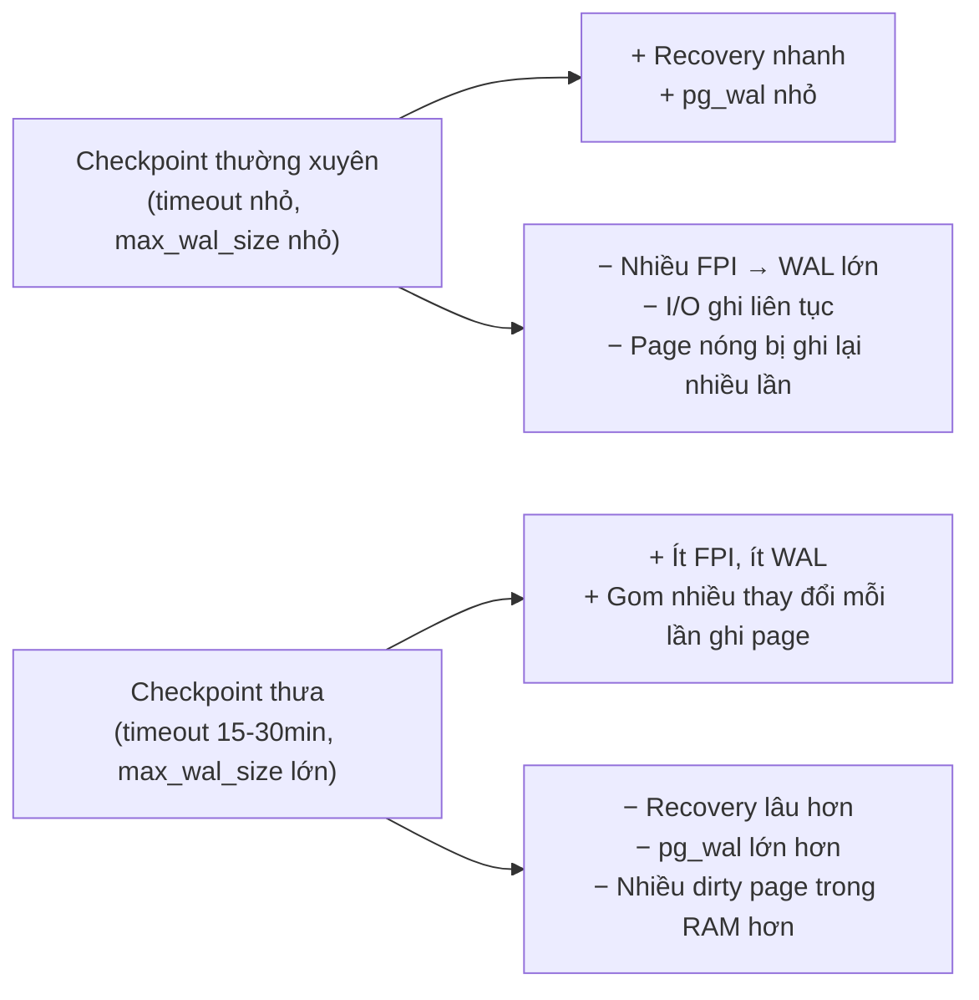

# PART 21 — CHECKPOINT

> **Trước:** [20 — WAL](20-wal.md) · **Tiếp:** [22 — Crash Recovery](22-crash-recovery.md)
> **Độ ưu tiên:** Rất cao.

---

## Mục lục

1. [Simple mental model](#1-simple-mental-model)
2. [WHAT — Checkpoint là gì](#2-what)
3. [WHY — Tại sao cần checkpoint](#3-why)
4. [HOW — Các bước của một checkpoint](#4-how)
5. [INTERNALS — Redo point, checkpoint record, pg_control](#5-internals)
6. [Khi nào checkpoint xảy ra: checkpoint_timeout, max_wal_size](#6-khi-nào-checkpoint-xảy-ra)
7. [checkpoint_completion_target và spreading](#7-checkpoint_completion_target)
8. [Checkpoint spike](#8-checkpoint-spike)
9. [Restartpoint trên standby](#9-restartpoint-trên-standby)
10. [WHAT HAPPENS IF...](#10-what-happens-if)
11. [PERFORMANCE IMPACT & Tuning](#11-performance-impact--tuning)
12. [PRODUCTION BEHAVIOR](#12-production-behavior)
13. [TRADE-OFF](#13-trade-off)
14. [COMMON MISUNDERSTANDINGS](#14-common-misunderstandings)
15. [INTERVIEW QUESTIONS](#15-interview-questions)
16. [KEY TAKEAWAYS](#16-key-takeaways)

---

## 1. Simple mental model

Tiếp tục ví dụ kế toán ([Chương 20](20-wal.md#1-simple-mental-model)): nhật ký (WAL) cứ dài mãi. Nếu cháy, phải đọc lại nhật ký **từ ngày đầu tiên** — mất cả tuần. Giải pháp: định kỳ **kiểm kê** — đảm bảo mọi nghiệp vụ trong nhật ký tới thời điểm T đã được chép đầy đủ vào sổ cái và sổ cái đã cất vào két. Sau đó ghi chú "đã kiểm kê tới T". Khi cháy, chỉ cần đọc nhật ký **từ T**; phần nhật ký trước T có thể hủy (nếu không ai khác cần).

---

## 2. WHAT

**Checkpoint** là một điểm trong luồng WAL mà tại đó PostgreSQL đảm bảo **mọi thay đổi data page được mô tả bởi WAL trước điểm đó đã được ghi ra data file và fsync**. Checkpoint ghi một **checkpoint record** vào WAL và cập nhật **`pg_control`** để trỏ tới nó.

Process thực hiện: **checkpointer** ([Chương 04 §6.1](04-postgresql-architecture.md#61-checkpointer)).

---

## 3. WHY

1. **Giới hạn thời gian crash recovery:** recovery bắt đầu từ **redo point** của checkpoint gần nhất, không phải từ đầu lịch sử.
2. **Cho phép tái sử dụng/xóa WAL:** WAL trước redo point không còn cần cho crash recovery (có thể vẫn cần cho archive/replication slot).
3. **Điểm khởi đầu cho full page writes:** lần sửa đầu mỗi page sau checkpoint → FPI ([Chương 20 §10](20-wal.md#10-internals-6--full-page-writes)).
4. **Điểm nhất quán cho base backup** (backup bắt đầu bằng checkpoint).
5. **Shutdown sạch:** shutdown checkpoint → lần khởi động sau không cần recovery.

**Nếu không có checkpoint:** WAL phình vô hạn; recovery sau crash phải replay toàn bộ lịch sử (có thể nhiều ngày); dirty page có thể nằm trong shared buffers mãi mãi.

---

## 4. HOW



**Cách đọc diagram (trên xuống):**

1. **Redo point** được xác định **trước tiên**. Đây là vị trí WAL mà recovery sẽ bắt đầu nếu checkpoint này là checkpoint hợp lệ gần nhất. Mọi thay đổi *trước* redo point sẽ được đảm bảo có trong data file khi checkpoint hoàn tất; thay đổi *sau* redo point (xảy ra trong lúc checkpoint chạy) được WAL bảo vệ.
2. Các cấu trúc SLRU được flush.
3. Checkpointer **chụp danh sách** buffer đang dirty tại thời điểm bắt đầu (bằng cờ). Buffer bị dirty *sau* đó (thay đổi có LSN > redo) không bắt buộc phải ghi trong checkpoint này.
4. Ghi các buffer **từ từ** (spreading) để không tạo I/O spike, sắp xếp theo vị trí file để I/O tuần tự hơn, cân bằng giữa các tablespace.
5. **fsync** mọi file đã ghi (không chỉ của checkpointer — backend và bgwriter gửi "fsync request" cho checkpointer thay vì tự fsync). Chỉ sau fsync, dữ liệu mới chắc chắn trên disk.
6. Ghi **checkpoint record** — mang redo LSN và trạng thái quan trọng (nextXid, oldestXid...).
7. Cập nhật **`pg_control`** (ghi file nhỏ + fsync) — từ giờ recovery sẽ dùng checkpoint này.
8. Dọn WAL và SLRU cũ.

**Nếu crash giữa checkpoint** (trước bước 7): `pg_control` vẫn trỏ checkpoint **trước**; recovery bắt đầu từ redo point cũ — an toàn, chỉ phải replay nhiều hơn.

---

## 5. INTERNALS

### 5.1 Redo point ≠ vị trí checkpoint record



**Cách đọc diagram:** Checkpoint "online" chạy song song với workload. Redo point là lúc bắt đầu; checkpoint record là lúc kết thúc (có thể cách vài phút và hàng GB WAL). Recovery đọc `pg_control` → tìm checkpoint record → đọc redo LSN từ record → **bắt đầu replay từ redo point** (lùi về trước checkpoint record).

### 5.2 pg_control

File 8KB trong `global/`, chứa: trạng thái cluster (`in production`, `shut down`, `in crash recovery`, `in archive recovery`, `shut down in recovery`), vị trí checkpoint gần nhất và redo, timeline, các tham số quan trọng (wal_level, max_connections...), system identifier, phiên bản. Xem bằng `pg_controldata`. Trạng thái `in production` lúc khởi động = lần trước không shutdown sạch → cần crash recovery.

### 5.3 Loại checkpoint

| Loại | Khi nào | Đặc điểm |
|---|---|---|
| **Timed** | Hết `checkpoint_timeout` | Spread |
| **Requested (WAL)** | WAL vượt ngưỡng từ `max_wal_size` | Spread (nhưng dồn dập nếu WAL sinh nhanh) |
| **Manual** | Lệnh `CHECKPOINT` | **Immediate** — ghi nhanh nhất có thể |
| **Shutdown** | Smart/fast shutdown | Immediate; record `CHECKPOINT_SHUTDOWN` |
| **Base backup** | `pg_basebackup`/`pg_backup_start` | Mặc định spread (`--checkpoint=fast` để immediate) |
| **End-of-recovery** | Sau crash recovery | |
| **CREATE DATABASE (strategy file_copy)**, DROP DATABASE... | | Immediate |

---

## 6. Khi nào checkpoint xảy ra

| Tham số | Mặc định | Vai trò |
|---|---|---|
| `checkpoint_timeout` | 5min | Khoảng thời gian tối đa giữa hai checkpoint |
| `max_wal_size` | 1GB | **Soft limit** tổng WAL; checkpoint được yêu cầu khi WAL sinh ra kể từ checkpoint trước vượt khoảng `max_wal_size / (1 + checkpoint_completion_target)` |
| `min_wal_size` | 80MB | Giữ tối thiểu lượng segment để recycle |
| `checkpoint_completion_target` | 0.9 (từ PG 14; trước là 0.5) | Tỉ lệ khoảng checkpoint dùng để trải việc ghi |
| `checkpoint_warning` | 30s | Log cảnh báo nếu checkpoint do WAL xảy ra cách nhau ít hơn giá trị này |
| `checkpoint_flush_after` | 256kB | Gợi ý kernel writeback sớm |

**Tại sao chia `(1 + target)`?** Trong lúc checkpoint N đang trải ghi (chiếm `target` × khoảng), WAL vẫn sinh ra; WAL từ redo của checkpoint N−1... cần giữ tới khi N xong. Công thức giữ tổng pg_wal quanh `max_wal_size`.

Ví dụ mặc định: 1GB / 1.9 ≈ 540MB WAL → checkpoint. Hệ thống sinh 50MB WAL/giây → checkpoint mỗi ~11 giây (!) thay vì 5 phút → FPI liên tục, I/O liên tục. Log sẽ có `checkpoints are occurring too frequently (11 seconds apart)` + gợi ý tăng `max_wal_size`.

---

## 7. checkpoint_completion_target

Checkpointer không ghi mọi dirty buffer ngay lập tức; nó **điều tiết tốc độ** (`CheckpointWriteDelay`) sao cho việc ghi kết thúc khi đã trôi qua khoảng `target × (checkpoint_timeout hoặc lượng WAL tới checkpoint kế)`.



**Cách đọc diagram:** Cùng lượng dirty page, target cao → tốc độ ghi thấp hơn nhưng kéo dài → ít ảnh hưởng latency query. Target quá gần 1.0 có rủi ro checkpoint chưa xong khi checkpoint kế đến hạn.

---

## 8. Checkpoint spike

### 8.1 Triệu chứng

Latency query tăng theo chu kỳ (mỗi 5 phút hoặc mỗi lần checkpoint do WAL), I/O write tăng, đôi khi tất cả query "đứng hình" vài giây.

### 8.2 Nguyên nhân (cơ chế)

1. **Write burst:** checkpoint ghi nhiều dirty page trong thời gian ngắn (target thấp, hoặc checkpoint immediate) → bão hòa băng thông I/O → read của query phải chờ.
2. **fsync stall:** kernel tích lũy hàng GB dirty page trong page cache (vì PostgreSQL chỉ `write()`), đến `fsync` cuối checkpoint phải xả tất cả → I/O queue đầy → mọi I/O khác (kể cả WAL fsync của commit!) bị chậm. Thấy trong log checkpoint: `sync=45.2 s, longest=12.1 s`.
3. **FPI storm** ngay sau checkpoint: WAL tăng vọt → WAL fsync nặng hơn → commit latency tăng; replication lag tăng theo.
4. **Checkpoint quá thường xuyên** (max_wal_size nhỏ): tất cả hiệu ứng trên lặp lại liên tục.

### 8.3 Giảm thiểu

| Biện pháp | Tác dụng |
|---|---|
| Tăng `max_wal_size` (vd 8–64GB tùy workload) | Checkpoint theo thời gian thay vì theo WAL; ít FPI |
| Tăng `checkpoint_timeout` (15–30min) | Ít checkpoint, ít FPI; đổi lại recovery lâu hơn |
| `checkpoint_completion_target = 0.9` | I/O phẳng |
| `checkpoint_flush_after` + kernel `vm.dirty_background_bytes` nhỏ | Tránh kernel tích quá nhiều dirty → fsync cuối nhẹ |
| `wal_compression` | Giảm WAL do FPI |
| Tách WAL ra disk riêng | FPI storm không tranh với data I/O |
| Storage IOPS/throughput đủ | Gốc rễ |

---

## 9. Restartpoint trên standby

Standby **không thể tạo checkpoint** (không sinh WAL của riêng nó). Thay vào đó, khi replay tới một checkpoint record của primary, standby có thể thực hiện **restartpoint**: flush dirty buffers của nó, cập nhật `pg_control` → nếu standby crash/restart, nó tiếp tục replay từ restartpoint. Restartpoint bị giới hạn bởi tần suất checkpoint trên primary (chỉ làm tại checkpoint record) và `checkpoint_timeout`/`max_wal_size` của standby. Standby có checkpoint thưa → giữ nhiều WAL hơn trong pg_wal.

---

## 10. WHAT HAPPENS IF...

| Tình huống | Hành vi |
|---|---|
| **Crash giữa checkpoint** | pg_control trỏ checkpoint cũ → recovery từ redo cũ. An toàn. |
| **Checkpoint không bao giờ xong** (disk quá chậm, fsync treo) | WAL tích lũy vượt max_wal_size, không recycle được → disk full; recovery sau crash rất lâu. |
| **max_wal_size quá nhỏ** | Checkpoint dồn dập, FPI nhiều, I/O liên tục, cảnh báo "too frequently". |
| **checkpoint_timeout quá lớn (1 giờ) + workload ghi nhiều** | Crash recovery phải replay tới 1 giờ WAL → downtime dài. |
| **fsync lỗi trong checkpoint** | PANIC ([Chương 08 §9.2](08-memory-buffer-cache.md#92-why--tại-sao-postgresql-không-dùng-o_direct-như-innodb)), khởi động lại + recovery. |
| **Chạy `CHECKPOINT` thủ công lúc cao điểm** | Immediate checkpoint → I/O burst. (Hữu ích trước shutdown/restart để shutdown nhanh hơn.) |
| **Replication slot/archive giữ WAL** | Checkpoint xong nhưng WAL không xóa được — không phải lỗi của checkpoint. |

---

## 11. PERFORMANCE IMPACT & Tuning

Trade-off trung tâm: **tần suất checkpoint** ↔ **thời gian recovery**.



**Cách đọc diagram:** Không có giá trị tối ưu tuyệt đối. Cách tiếp cận thực tế:
1. Đặt `checkpoint_timeout` theo **RTO chấp nhận được** cho crash recovery (vd 15 phút → recovery thường vài phút).
2. Đặt `max_wal_size` đủ lớn để **phần lớn checkpoint là timed** (không bị WAL kích hoạt) trong giờ cao điểm.
3. `checkpoint_completion_target = 0.9`.
4. Theo dõi và điều chỉnh.

Lưu ý: trong HA, crash recovery của primary thường được thay bằng **failover** sang replica → recovery time bớt quan trọng → có thể chọn checkpoint thưa hơn.

---

## 12. PRODUCTION BEHAVIOR

`log_checkpoints = on` (mặc định từ PG 15):

```
LOG:  checkpoint starting: time
LOG:  checkpoint complete: wrote 184223 buffers (17.6%), wrote 12 SLRU buffers; 0 WAL file(s) added,
      0 removed, 38 recycled; write=269.912 s, sync=1.204 s, total=271.418 s; sync files=412,
      longest=0.301 s, average=0.003 s; distance=612345 kB, estimate=630001 kB; lsn=3A/5F000110, redo lsn=3A/4B000028
```

Đọc:
- `starting: time` (timed) vs `wal` (do max_wal_size) — nhiều `wal` → tăng max_wal_size.
- `wrote N buffers (x%)` — lượng dirty page.
- `write=269.9 s` ≈ target × timeout (0.9 × 300s) → đang trải đều đúng.
- `sync=...`, `longest=...` — sync lâu → kernel dirty page nhiều/disk chậm.
- `distance` — WAL giữa hai checkpoint.

`pg_stat_checkpointer` (PG 17+; trước đó `pg_stat_bgwriter`): `num_timed`, `num_requested`, (PG 18: `num_done`), `write_time`, `sync_time`, `buffers_written`, (PG 18: `slru_written`).

---

## 13. TRADE-OFF

| Lợi ích | Chi phí |
|---|---|
| Giới hạn recovery time | I/O ghi định kỳ, có thể spike |
| Cho phép recycle WAL | FPI sau mỗi checkpoint tăng WAL |
| Điểm nhất quán cho backup | fsync nặng |

---

## 14. COMMON MISUNDERSTANDINGS

1. **"Checkpoint làm dữ liệu bền vững."** — Durability đã có từ WAL flush lúc commit. Checkpoint chỉ rút ngắn recovery và cho phép dọn WAL.
2. **"Checkpoint dừng mọi hoạt động."** — Checkpoint online chạy song song; chỉ gây chậm do I/O.
3. **"Checkpoint càng nhiều càng an toàn."** — Không an toàn hơn về dữ liệu; chỉ nhanh recovery hơn, đổi bằng WAL/I/O.
4. **"max_wal_size là giới hạn cứng."** — Soft limit; slot/archive/wal_keep_size có thể giữ nhiều hơn.
5. **"Chạy CHECKPOINT thủ công để 'lưu' dữ liệu."** — Không cần cho durability.

---

## 15. INTERVIEW QUESTIONS

**Q1. Checkpoint là gì? Tại sao cần?**
- *Short:* Điểm đảm bảo mọi dirty page tới redo point đã flush; giới hạn recovery và cho phép recycle WAL.
- *Follow-up:* Redo point khác checkpoint record thế nào?

**Q2. Checkpoint diễn ra thế nào?**
- *Short:* Xác định redo point → flush SLRU → ghi mọi buffer dirty (trải đều) → fsync → ghi checkpoint record → cập nhật pg_control → recycle WAL.

**Q3. Điều gì kích hoạt checkpoint?**
- *Short:* checkpoint_timeout, WAL vượt ngưỡng từ max_wal_size, CHECKPOINT, shutdown, base backup.

**Q4. Checkpoint spike là gì và giảm thế nào?**
- *Short:* I/O burst + fsync stall + FPI storm; tăng max_wal_size/timeout, completion_target 0.9, flush_after, wal_compression, tách WAL disk.

**Q5. Trade-off của checkpoint_timeout lớn?**
- *Short:* Ít WAL/I/O hơn nhưng recovery lâu hơn.

**Q6. (Senior) Log đầy "checkpoints are occurring too frequently". Bạn làm gì?**
- *Short:* WAL sinh nhanh vượt max_wal_size → tăng max_wal_size; tìm nguồn WAL (batch job, FPI, index, REPLICA IDENTITY FULL).

---

## 16. KEY TAKEAWAYS

1. Checkpoint = **mọi thay đổi trước redo point đã có trong data file + fsync**, ghi checkpoint record, cập nhật pg_control.
2. Recovery bắt đầu từ **redo point** của checkpoint hợp lệ gần nhất.
3. Kích hoạt bởi `checkpoint_timeout` (5min) hoặc WAL ~ `max_wal_size/(1+target)`; muốn đa số là timed.
4. `checkpoint_completion_target = 0.9` trải I/O; fsync cuối có thể stall nếu kernel tích dirty.
5. Sau mỗi checkpoint là **FPI storm**; checkpoint thưa hơn = ít WAL hơn, recovery lâu hơn.
6. Checkpoint **không** tạo durability — WAL làm việc đó.

---

## Nguồn tham khảo

- PostgreSQL Docs — *WAL Configuration*: https://www.postgresql.org/docs/current/wal-configuration.html
- PostgreSQL Docs — *CHECKPOINT*, *pg_controldata*, *pg_stat_checkpointer*.
- PostgreSQL source: `src/backend/postmaster/checkpointer.c`, `src/backend/access/transam/xlog.c` (`CreateCheckPoint`), `src/backend/storage/buffer/bufmgr.c` (`BufferSync`).
