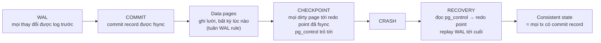
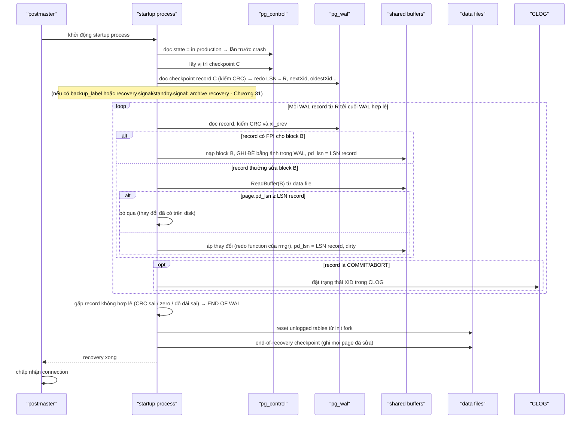

# PART 22 — CRASH RECOVERY

> **Trước:** [21 — Checkpoint](21-checkpoint.md) · **Tiếp:** [23 — VACUUM](23-vacuum.md)
> **Độ ưu tiên:** Rất cao. Chương này nối WAL → Commit → Checkpoint → Recovery thành một câu chuyện hoàn chỉnh.

---

## Mục lục

1. [Simple mental model](#1-simple-mental-model)
2. [WHAT & WHY](#2-what--why)
3. [Bối cảnh: WAL → Commit → Checkpoint → Recovery](#3-bối-cảnh)
4. [Kịch bản: UPDATE 1 triệu row, mất điện](#4-kịch-bản-update-1-triệu-row-mất-điện)
5. [Recovery step by step](#5-recovery-step-by-step)
6. [INTERNALS: tại sao redo đúng và đủ](#6-internals-tại-sao-redo-đúng-và-đủ)
7. [Sau recovery: dữ liệu trông như thế nào](#7-sau-recovery)
8. [WHAT HAPPENS IF... (các biến thể)](#8-what-happens-if)
9. [PERFORMANCE: thời gian recovery](#9-performance-thời-gian-recovery)
10. [PRODUCTION BEHAVIOR](#10-production-behavior)
11. [So sánh InnoDB (ARIES đầy đủ)](#11-so-sánh-innodb)
12. [COMMON MISUNDERSTANDINGS](#12-common-misunderstandings)
- [Concept card — khung 13 điểm](#concept-card--)
13. [INTERVIEW QUESTIONS](#13-interview-questions)
14. [KEY TAKEAWAYS](#14-key-takeaways)

---

## 1. Simple mental model

Sau vụ cháy, kế toán mở két: sổ cái (data files) **có thể** thiếu một số nghiệp vụ gần đây, **có thể** có trang bị cháy dở (torn page); nhưng nhật ký (WAL) còn nguyên tới dòng cuối cùng đã cất vào két. Kế toán tìm **dấu kiểm kê gần nhất** (checkpoint trong pg_control), rồi đọc nhật ký từ đó, **chép lại từng nghiệp vụ vào sổ cái** — bỏ qua nghiệp vụ mà trang sổ cái đã có (so số thứ tự trang với số nhật ký), thay nguyên trang bị cháy bằng bản chụp trong nhật ký. Nghiệp vụ nào không có dòng "đã chốt" trong nhật ký → coi như chưa từng xảy ra.

---

## 2. WHAT & WHY

**Crash recovery** là quá trình PostgreSQL tự động thực hiện khi khởi động sau khi **không shutdown sạch** (process crash, OS crash, mất điện, `kill -9`, OOM killer, immediate shutdown): **replay WAL từ redo point của checkpoint gần nhất** tới cuối WAL hợp lệ, đưa data files về trạng thái nhất quán chứa **mọi transaction đã commit**.

**Tại sao cần:** Theo thiết kế no-force ([Chương 20 §3.3](20-wal.md#33-với-wal--no-force-redo-log)), lúc crash:
- data files **thiếu** thay đổi của transaction đã commit (page chưa được ghi);
- data files **có thể chứa** thay đổi của transaction chưa commit (page dirty đã bị evict ra disk);
- một số page có thể **bị ghi rách**.

Recovery sửa cả ba.

---

## 3. Bối cảnh



**Cách đọc diagram (trái sang phải):** Mỗi mắt xích giữ một bất biến: WAL rule đảm bảo disk không bao giờ "đi trước" WAL; commit đảm bảo commit record đã bền vững; checkpoint đảm bảo mọi thứ trước redo point đã trên disk. Recovery dựa trên ba bất biến đó: chỉ cần replay từ redo point là đủ và đúng.

---

## 4. Kịch bản: UPDATE 1 triệu row, mất điện

**Giả thiết:**
- 10:00:00 — checkpoint C hoàn tất; redo point của C = LSN `R`.
- 10:01 — Transaction T (XID 5000) chạy `UPDATE big_table SET status = 'x'` trên **1 triệu row** (khoảng 20.000 heap page + index page). T sinh ~1.5GB WAL (nhiều FPI vì đây là lần đầu các page bị sửa sau C).
- WAL của T **đã được flush** hết (walwriter flush dần; transaction lớn liên tục ghi WAL khi WAL buffers đầy).
- Trong lúc chạy, **40% data page** bị sửa đã được ghi ra disk (buffer eviction, bgwriter).
- **Mất điện** tại 10:03.

Hai biến thể: **(A)** T đã COMMIT (commit record flushed, client đã nhận OK) trước khi mất điện; **(B)** T chưa commit (đang chạy tới row thứ 1 triệu, hoặc đã xong UPDATE nhưng chưa COMMIT).

### 4.1 Trạng thái disk lúc crash

| Thành phần | Trạng thái |
|---|---|
| pg_control | Trỏ checkpoint C (redo = R), state = `in production` |
| WAL | Từ R tới cuối: mọi record của T (+ commit record nếu A) + WAL của transaction khác |
| Data files | 40% page của T mang tuple mới (xmin=5000) + tuple cũ có xmax=5000; 60% page vẫn là trạng thái trước T. Có thể có page bị ghi rách. Hint bits trên disk có thể thiếu. |
| CLOG trên disk | Trang CLOG chứa XID 5000 có thể chưa được flush → bit của 5000 trên disk là `00` (IN_PROGRESS) dù T đã commit (A) |

---

## 5. Recovery step by step



**Cách đọc diagram (trên xuống) — chi tiết từng bước:**

1. **Phát hiện crash:** `pg_control` ghi state `in production` (không phải `shut down`) → phải recovery. Log: `database system was interrupted; last known up at ...` rồi `database system was not properly shut down; automatic recovery in progress`.
2. **Tìm điểm bắt đầu:** đọc checkpoint record C từ vị trí trong pg_control → **redo point R**. (Nếu checkpoint record hỏng → PostgreSQL hiện đại không tự lùi về checkpoint trước; báo lỗi `could not locate a valid checkpoint record`.)
3. **Replay tuần tự** mọi record từ R:
   - Record có **FPI** → page được **ghi đè toàn bộ** bằng ảnh → sửa **torn page** và đưa page về trạng thái chính xác tại thời điểm đó, bất kể disk đang có gì. Vì mọi page bị sửa sau C đều có FPI ở lần sửa đầu tiên sau C, và FPI đó nằm trong đoạn WAL được replay → **mọi page bị ghi rách đều được sửa**.
   - Record thường → so **`pd_lsn` của page trên disk** với LSN record: page mới hơn → bỏ qua (đã được ghi trước crash); page cũ hơn → áp dụng. Đây là cơ chế **idempotent**: replay nhiều lần cũng cho cùng kết quả.
   - Record commit/abort → cập nhật **CLOG** (sửa trường hợp trang CLOG chưa kịp flush).
4. **Kết thúc WAL:** WAL không có "dấu kết thúc" rõ ràng; recovery dừng tại record đầu tiên không hợp lệ (CRC sai, header zero, `xl_prev` không khớp, độ dài vượt). Log: `redo done at 3A/5F0001B8`.
5. **Dọn dẹp:** unlogged tables bị truncate (thay bằng init fork); temp files bị xóa; prepared transactions (2PC) được khôi phục từ `pg_twophase`/WAL.
6. **Checkpoint kết thúc recovery** để lần crash sau không phải replay lại đoạn này. (Khi promote standby, PostgreSQL ghi end-of-recovery record và cho phép connection ngay, checkpoint chạy sau.)
7. **Nhận connection:** `database system is ready to accept connections`.

---

## 6. INTERNALS: tại sao redo đúng và đủ

**Đủ (không mất commit):**
- Mọi thay đổi của transaction đã commit đều có WAL record trước commit record (WAL tuần tự), và commit record đã được flush trước khi báo OK → mọi record đó nằm trên disk.
- Recovery replay từ R; mọi thay đổi trước R đã nằm trong data files (checkpoint đảm bảo) → không thiếu gì.

**Đúng (không áp sai):**
- WAL rule: data page trên disk không bao giờ chứa thay đổi mà WAL trên disk không có → không có trạng thái "lạ".
- `pd_lsn` cho biết page đã chứa tới record nào → không áp trùng.
- FPI loại bỏ torn page.

**Không cần undo:**
- Thay đổi của transaction chưa commit **được redo** (tuple mới xuất hiện, xmax được đặt trên tuple cũ) — **về vật lý, recovery tái tạo cả những thay đổi chưa commit**.
- Nhưng XID của chúng không có commit record → sau recovery: không nằm trong ProcArray (không đang chạy), CLOG không nói committed → **coi là aborted** ([Chương 11 §8](11-mvcc.md#8-internals-4--committed-aborted-in-progress)) → tuple mới invisible, xmax trên tuple cũ bị bỏ qua. Không cần hoàn tác từng byte.

---

## 7. Sau recovery

### Biến thể A — T đã commit

- Replay toàn bộ ~1.5GB WAL của T: 60% page chưa có trên disk được áp dụng; 40% đã có được bỏ qua (pd_lsn), trừ khi có FPI (ghi đè — kết quả như nhau).
- Commit record của T → CLOG[5000] = COMMITTED.
- Kết quả: **1 triệu row có `status = 'x'`**, như client đã được báo. Durability giữ vững.
- Còn lại: 1 triệu tuple cũ (xmax=5000 committed) là dead → autovacuum dọn sau.

### Biến thể B — T chưa commit

- Replay toàn bộ WAL của T tới điểm crash (1 triệu hoặc ít hơn tuple mới xuất hiện vật lý trên page).
- Không có commit record → T coi như aborted.
- Kết quả: mọi query thấy **status cũ** cho mọi row. Atomicity giữ vững.
- Còn lại: tới 1 triệu tuple mới (xmin=5000 aborted) là dead ngay; tuple cũ có xmax=5000 (aborted) vẫn live — lần đầu bị đọc sẽ được đặt hint `XMAX_INVALID`. Table phình tạm thời, autovacuum dọn.

**Cả hai biến thể:** thời gian recovery bị chi phối bởi việc replay 1.5GB WAL (đọc WAL tuần tự + đọc/ghi hàng chục nghìn data page ngẫu nhiên).

---

## 8. WHAT HAPPENS IF...

| Tình huống | Hành vi |
|---|---|
| **Crash lần nữa trong lúc đang recovery** | Khởi động lại recovery từ đầu (từ cùng redo point, hoặc restartpoint nếu có) — idempotent nên an toàn. |
| **WAL cần cho recovery bị mất/xóa** | `could not open file "pg_wal/..."` / `invalid record` → recovery dừng sớm (mất dữ liệu sau điểm đó) hoặc không khởi động được. Không tự sửa được — cần backup/replica. |
| **Data page bị hỏng nhưng không có FPI trong đoạn replay** | Checksum phát hiện khi đọc → lỗi khi truy cập page đó (hoặc recovery lỗi nếu cần page đó). |
| **Disk đầy trong lúc recovery** | Recovery thất bại, cần giải phóng chỗ. |
| **Mất điện khi đang ghi WAL record commit** | Record ghi dở → CRC sai → coi như chưa commit. Client chưa nhận OK (OK chỉ gửi sau flush trọn vẹn) → nhất quán. |
| **Storage nói dối fsync** | WAL "đã flush" bị mất → mất commit; hoặc data page mới hơn WAL (vi phạm WAL rule ở tầng phần cứng) → corruption. |
| **`fsync = off` và OS crash** | Không có đảm bảo nào — data và WAL có thể không nhất quán → corruption khó phát hiện. |
| **Crash khi đang CREATE INDEX CONCURRENTLY** | Index ở trạng thái INVALID sau recovery → phải drop và tạo lại. |
| **Prepared transaction tồn tại lúc crash** | Được khôi phục, vẫn giữ lock, chờ COMMIT/ROLLBACK PREPARED. |

---

## 9. PERFORMANCE: thời gian recovery

Thời gian ≈ f(lượng WAL từ redo point, số page random cần đọc, tốc độ áp dụng):

| Yếu tố | Ảnh hưởng |
|---|---|
| `checkpoint_timeout`, `max_wal_size` | Quyết định lượng WAL tối đa phải replay |
| Tốc độ sinh WAL lúc crash | WAL nhiều → replay lâu |
| Random read data page | Mỗi record thường cần đọc page từ disk (nếu chưa có FPI) — đây thường là nút thắt |
| **Startup process là single-threaded** | Replay tuần tự, một CPU |
| `recovery_prefetch` (PG 15, mặc định `try`) | Đọc trước (prefetch) các block mà record sắp tới cần → giảm chờ I/O đáng kể |
| `full_page_writes` | FPI giúp không phải đọc page (ghi đè thẳng) |
| shared_buffers | Page đã sửa trong recovery nằm trong buffers; quá nhỏ → evict/ghi liên tục |

Ước lượng thô: replay vài trăm MB tới vài GB WAL mỗi phút tùy phần cứng và workload. Log tiến độ: `log_startup_progress_interval` (PG 15) in "redo in progress, elapsed time: ..., current LSN: ...".

---

## 10. PRODUCTION BEHAVIOR

- **Log điển hình:**
  ```
  LOG:  database system was interrupted; last known up at 2025-06-01 10:00:00 UTC
  LOG:  database system was not properly shut down; automatic recovery in progress
  LOG:  redo starts at 3A/4B000028
  LOG:  redo in progress, elapsed time: 10.00 s, current LSN: 3A/51F3A2C0
  LOG:  invalid record length at 3A/5F0001B8: expected at least 24, got 0
  LOG:  redo done at 3A/5F000180 system usage: CPU: ... elapsed: 42.13 s
  LOG:  checkpoint starting: end-of-recovery immediate wait
  LOG:  database system is ready to accept connections
  ```
  `invalid record length ... got 0` là **bình thường**: đó là cách recovery nhận ra cuối WAL.
- **Trong môi trường HA:** khi primary crash, HA manager thường **failover** sang replica thay vì chờ primary tự recovery. Primary cũ khi quay lại tự recovery rồi phải được rejoin như standby (thường cần `pg_rewind`) — [Chương 30](30-failover.md).
- **Sau recovery:** cumulative statistics bị reset (sau crash) → autovacuum "mù" tạm thời; nên `ANALYZE` các table quan trọng. Cache lạnh → latency cao một thời gian.

---

## 11. So sánh InnoDB

InnoDB theo **ARIES** đầy đủ: (1) **Analysis**, (2) **Redo** (áp redo log — "repeating history" kể cả thay đổi chưa commit), (3) **Undo** (rollback các transaction chưa commit bằng undo log — có thể chạy nền sau khi mở database). PostgreSQL chỉ có pha redo; "undo" là miễn phí nhờ MVCC + CLOG, đổi lại để lại dead tuple cho VACUUM. InnoDB còn phải xử lý đồng bộ giữa redo log và binlog (XA nội bộ) khi recovery.

---

## 12. COMMON MISUNDERSTANDINGS

1. **"Recovery rollback các transaction chưa commit."** — Không có rollback vật lý; chúng được redo rồi coi là aborted.
2. **"Dữ liệu sau checkpoint bị mất khi crash."** — Không; WAL sau checkpoint được replay. Chỉ mất nếu WAL không được flush (async commit) hoặc bị mất.
3. **"`invalid record length` trong log recovery là lỗi."** — Là dấu hiệu cuối WAL bình thường.
4. **"Recovery nhanh vì chỉ đọc WAL tuần tự."** — Nút thắt thường là random read data page.
5. **"Có replica thì không cần quan tâm crash recovery."** — Primary cũ vẫn phải recovery; replica cũng chạy cùng code replay.

---

## Concept card — Crash Recovery theo khung 13 điểm

| # | Khía cạnh | Tóm tắt |
|---|---|---|
| 1 | **WHAT** | Replay WAL từ redo point của checkpoint cuối tới cuối WAL hợp lệ khi khởi động sau khi không shutdown sạch. |
| 2 | **WHY** | No-force: data file có thể thiếu thay đổi đã commit, chứa thay đổi chưa commit, có page rách — §2. |
| 3 | **HOW** | pg_control → checkpoint record → redo LSN → replay tuần tự (FPI ghi đè, pd_lsn bỏ qua) → end of WAL → reset unlogged → checkpoint → nhận connection — §5. |
| 4 | **INTERNALS** | Startup process, resource manager redo functions, CRC + `xl_prev`, CLOG cập nhật từ commit record, KnownAssignedXids (standby) — §6. |
| 5 | **EXAMPLE** | UPDATE 1 triệu row, WAL flush, 40% page đã ghi, mất điện — §4, §7. |
| 6 | **WHAT HAPPENS IF** | Crash lần nữa khi recovery, thiếu WAL, fsync nói dối, CIC dở dang — §8. |
| 7 | **PERFORMANCE IMPACT** | Thời gian ∝ WAL từ redo point + random I/O; single-threaded; `recovery_prefetch` — §9. |
| 8 | **PRODUCTION BEHAVIOR** | Log "redo starts at / redo done at", "invalid record length" là cuối WAL bình thường; stats reset sau crash — §10. |
| 9 | **TRADE-OFF** | Chỉ redo (đơn giản, rollback O(1)) ↔ dead tuple để lại; checkpoint thưa (ít WAL) ↔ recovery lâu. |
| 10 | **WHEN TO USE / NOT** | Tự động — không cấu hình bật/tắt; với HA, thường failover thay vì chờ primary tự recovery. |
| 11 | **MISUNDERSTANDINGS** | "Recovery rollback transaction", "dữ liệu sau checkpoint bị mất" — §12. |
| 12 | **INTERVIEW** | Crash sau WAL flush trước dirty page flush — §13. |
| 13 | **KEY TAKEAWAYS** | WAL rule → commit flush → checkpoint → recovery — §14. |

---

## 13. INTERVIEW QUESTIONS

**Q1. Chuyện gì xảy ra nếu PostgreSQL crash sau khi WAL đã flush nhưng dirty page chưa flush?**
- *Short:* Khi khởi động, startup process đọc pg_control, tìm redo point của checkpoint cuối, replay WAL; các thay đổi được áp lại lên page (bỏ qua page đã có nhờ pd_lsn, ghi đè torn page bằng FPI). Transaction có commit record → committed; không có → aborted. Không mất dữ liệu đã commit.
- *Follow-up:* Nếu 40% page đã được ghi thì có bị áp trùng không? (pd_lsn.) Transaction chưa commit xử lý thế nào? (Redo rồi coi là aborted, dead tuple.)

**Q2. Tại sao PostgreSQL không cần undo khi recovery?**
- *Short:* MVCC: thay đổi gắn XID; XID không có commit record → invisible.

**Q3. Làm sao recovery biết dừng ở đâu?**
- *Short:* Record không hợp lệ đầu tiên (CRC sai, zero, xl_prev không khớp).

**Q4. Recovery mất bao lâu, phụ thuộc gì?**
- *Short:* Lượng WAL từ redo point (checkpoint_timeout, max_wal_size), random I/O đọc page, startup single-threaded, recovery_prefetch.

**Q5. (Senior) Làm sao giảm RTO khi primary crash?**
- *Short:* HA failover sang replica (không chờ recovery), checkpoint hợp lý, recovery_prefetch, storage nhanh, autoprewarm.

---

## 14. KEY TAKEAWAYS

1. Crash recovery = **replay WAL từ redo point của checkpoint cuối tới cuối WAL hợp lệ**.
2. **pd_lsn** làm redo idempotent; **FPI** sửa torn page; **CRC/xl_prev** xác định cuối WAL.
3. Mọi thay đổi (kể cả chưa commit) được redo; transaction không có commit record → **aborted** qua CLOG/ProcArray → không cần undo.
4. Kịch bản 1 triệu row: commit rồi → đầy đủ 1 triệu row mới; chưa commit → dữ liệu cũ, để lại dead tuple.
5. Chuỗi bất biến: **WAL rule → commit flush → checkpoint → recovery** — mỗi mắt xích là điều kiện cho mắt xích sau.
6. Thời gian recovery tỉ lệ WAL từ checkpoint và random I/O; HA thường failover thay vì chờ.

---

## Nguồn tham khảo

- PostgreSQL Docs — *WAL Internals*, *WAL Configuration*: https://www.postgresql.org/docs/current/wal-internals.html
- PostgreSQL source: `src/backend/access/transam/xlogrecovery.c`, `README` (WAL recovery), `src/backend/access/transam/xlog.c` (`StartupXLOG`).
- C. Mohan et al., *ARIES*, ACM TODS 1992.
- Hironobu Suzuki, *The Internals of PostgreSQL*, chương 9.
