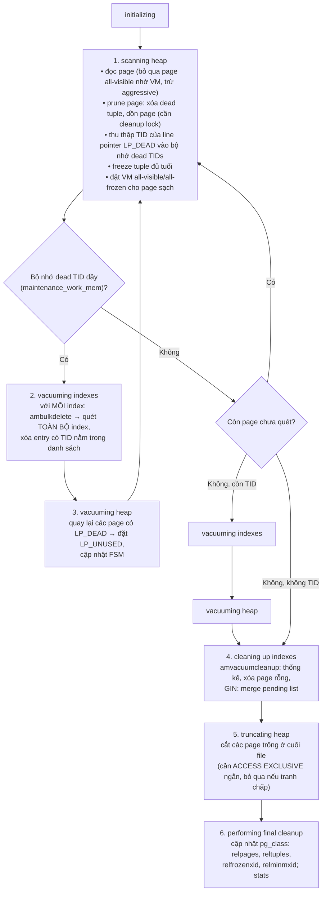
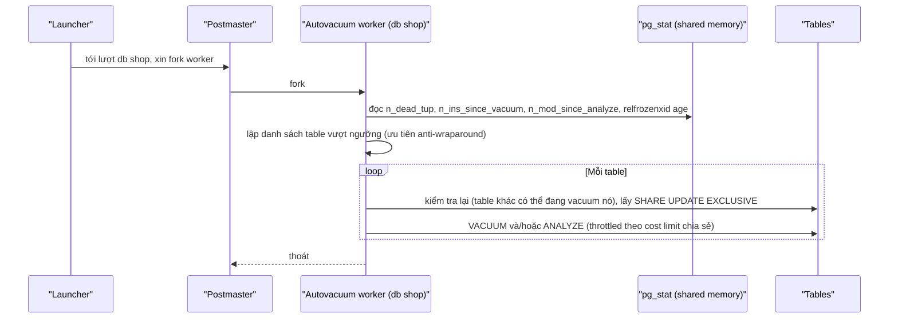
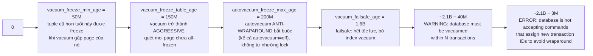
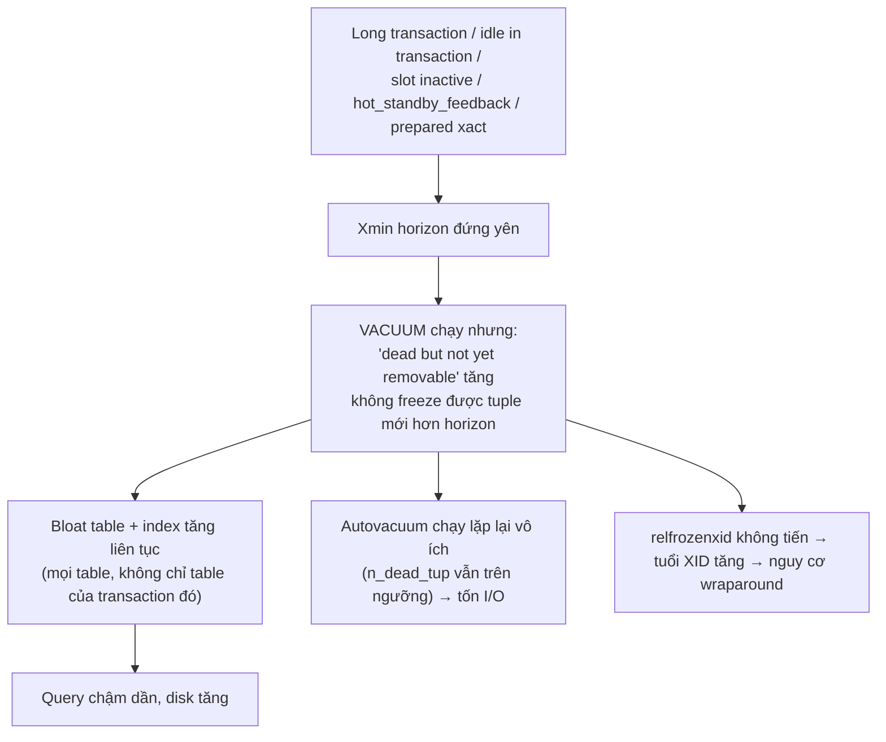

# PART 23 — VACUUM

> **Trước:** [22 — Crash Recovery](22-crash-recovery.md) · **Tiếp:** [24 — HOT Update](24-hot-update.md)
> **Độ ưu tiên:** Cao nhất. VACUUM là "nửa còn lại" của MVCC; hiểu sai VACUUM là nguồn gốc của bloat, query chậm dần, và sự cố XID wraparound — một trong số ít sự cố có thể làm PostgreSQL **ngừng nhận ghi**.

---

## Mục lục

1. [Simple mental model](#1-simple-mental-model)
2. [WHAT — Các dạng VACUUM](#2-what)
3. [WHY — Tại sao PostgreSQL cần VACUUM (và database khác thì sao)](#3-why)
4. [HOW — Plain VACUUM từng pha](#4-how--plain-vacuum-từng-pha)
5. [INTERNALS — Dead TID storage, index bypass, failsafe, locks](#5-internals)
6. [Visibility Map và Free Space Map trong VACUUM](#6-visibility-map-và-free-space-map)
7. [VACUUM FULL, CLUSTER, pg_repack, REPACK](#7-vacuum-full-cluster-pg_repack-repack)
8. [ANALYZE](#8-analyze)
9. [Autovacuum: khi nào chạy, chạy nhanh cỡ nào](#9-autovacuum)
10. [Freeze và Transaction ID Wraparound](#10-freeze-và-transaction-id-wraparound)
11. [Table Bloat](#11-table-bloat)
12. [Index Bloat và VACUUM](#12-index-bloat-và-vacuum)
13. [Long-running transaction & idle in transaction](#13-long-running-transaction--idle-in-transaction)
14. [WHAT HAPPENS IF...](#14-what-happens-if)
15. [PERFORMANCE IMPACT](#15-performance-impact)
16. [PRODUCTION BEHAVIOR & tuning](#16-production-behavior--tuning)
17. [TRADE-OFF](#17-trade-off)
18. [COMMON MISUNDERSTANDINGS](#18-common-misunderstandings)
19. [INTERVIEW QUESTIONS](#19-interview-questions)
20. [KEY TAKEAWAYS](#20-key-takeaways)

---

## 1. Simple mental model

MVCC giống việc **không bao giờ tẩy** mà chỉ **gạch** dòng cũ và viết dòng mới. Sớm muộn cuốn sổ đầy dòng gạch.

**VACUUM** là người đi qua từng trang:
1. Xóa hẳn các dòng gạch mà **không ai còn cần đọc** (dead tuple vượt xmin horizon).
2. Xóa các dòng trong **mục lục** (index) trỏ tới những dòng đó.
3. Ghi vào **sổ chỗ trống** (FSM) trang nào còn chỗ để viết tiếp.
4. Đóng dấu "**trang sạch**" (VM all-visible) cho trang không còn dòng gạch.
5. Đóng dấu "**đã niêm phong**" (freeze) lên các dòng rất cũ để số hiệu giao dịch 32-bit có thể quay vòng an toàn.

Nó **không** làm cuốn sổ mỏng đi (trừ vài trang trắng ở cuối) — chỗ trống chỉ được **tái sử dụng**.

---

## 2. WHAT

| Dạng | Làm gì | Lock | Giải phóng disk cho OS? |
|---|---|---|---|
| `VACUUM` (plain) | Dọn dead tuple, cập nhật FSM/VM, freeze (tùy tuổi), cập nhật relstats | **SHARE UPDATE EXCLUSIVE** — không chặn SELECT/INSERT/UPDATE/DELETE | Chỉ page trống **ở cuối** file |
| `VACUUM (FREEZE)` | Như trên + freeze tích cực mọi tuple đủ điều kiện | như trên | như trên |
| `VACUUM (ANALYZE)` | Vacuum + thu thống kê | như trên | như trên |
| `VACUUM FULL` | **Viết lại toàn bộ table** vào file mới, rebuild mọi index | **ACCESS EXCLUSIVE** — chặn mọi thứ | **Có** |
| `ANALYZE` | Chỉ thu thống kê (lấy mẫu) | SHARE UPDATE EXCLUSIVE | — |
| **Autovacuum** | Plain VACUUM/ANALYZE tự động theo ngưỡng; anti-wraparound bắt buộc | như plain | như plain |

Các option hữu ích: `VERBOSE`, `PARALLEL n` (PG 13, index song song cho vacuum thủ công), `INDEX_CLEANUP {AUTO|ON|OFF}`, `TRUNCATE {ON|OFF}`, `PROCESS_TOAST`, `SKIP_LOCKED`, `BUFFER_USAGE_LIMIT` (PG 16), `DISABLE_PAGE_SKIPPING`, `ONLY` (PG 18, cho partitioned/inheritance).

---

## 3. WHY

### 3.1 Bốn nhiệm vụ không thể thiếu

1. **Thu hồi chỗ của dead tuple** — nếu không: table và index phình vô hạn (**bloat**), mọi scan chậm dần.
2. **Cập nhật Visibility Map** — nếu không: index-only scan phải đọc heap, VACUUM sau phải đọc lại mọi page.
3. **Cập nhật Free Space Map** — nếu không: chỗ trống không được tái sử dụng, INSERT luôn mở rộng file.
4. **Freeze tuple cũ** — nếu không: **XID wraparound** → PostgreSQL buộc phải ngừng cấp XID (ngừng nhận ghi) để bảo vệ dữ liệu.

(+ **ANALYZE** — thống kê cho planner.)

### 3.2 Tại sao PostgreSQL cần VACUUM mà database khác "không cần"?

Vì **nơi lưu version cũ** ([Chương 11 §16](11-mvcc.md#16-trade-off--so-sánh)):

| | PostgreSQL | InnoDB | Oracle |
|---|---|---|---|
| Version cũ | Trong heap (cạnh version mới) | Undo log (rollback segment) | Undo tablespace |
| Ai dọn | **VACUUM** (quét heap + mọi index) | **Purge thread** (duyệt undo log theo thứ tự, xóa delete-marked record, dọn undo) | Undo tự tái sử dụng theo retention |
| Chi phí dọn | Tỉ lệ kích thước table + index (dù VM giúp bỏ qua page sạch) | Tỉ lệ lượng thay đổi | Tỉ lệ lượng thay đổi |
| XID wraparound | 32-bit, cần freeze | Transaction ID 48-bit (không cần freeze kiểu này) | SCN 48/64-bit |

Các database khác **vẫn phải dọn** — chỉ là việc dọn diễn ra ở undo log, tỉ lệ với lượng thay đổi, thường "vô hình" với người dùng. Và chúng cũng bị long transaction làm hại (InnoDB: history list length tăng, undo phình; Oracle: "snapshot too old"). PostgreSQL chọn: rollback O(1), không undo, reader không bao giờ phải dựng lại version từ undo — đổi lại phải VACUUM.

---

## 4. HOW — Plain VACUUM từng pha

Các pha tương ứng với cột `phase` của `pg_stat_progress_vacuum`:



**Cách đọc diagram (trên xuống):**

1. **Scanning heap (pha 1)** — phần chính:
   - Đọc page theo thứ tự block. Page được VM đánh dấu **all-visible** → **bỏ qua** (không có gì để dọn). Vacuum aggressive (vì tuổi XID) chỉ bỏ qua page **all-frozen**.
   - **Prune** page (giống HOT pruning): xóa storage của tuple dead, dồn tuple sống, line pointer của tuple dead thành **LP_DEAD** (hoặc LP_REDIRECT trong HOT chain). Cần **cleanup lock**; page đang bị pin bởi người khác → vacuum thường bỏ qua phần dọn của page đó (nhưng aggressive vacuum có thể phải chờ để freeze).
   - Ghi TID của các line pointer LP_DEAD vào **dead TID store** — chúng chưa thể thành LP_UNUSED vì **index còn trỏ tới**.
   - **Freeze** tuple có xmin đủ cũ (mục 10).
   - Page không còn dead tuple và mọi tuple visible với mọi người → đặt bit **all-visible** (và **all-frozen** nếu mọi tuple đã frozen).
2. **Vacuuming indexes (pha 2)** — với **mỗi** index, gọi `ambulkdelete` truyền danh sách dead TID. B-Tree **quét toàn bộ index** (theo thứ tự vật lý) và xóa entry có TID trong danh sách. Chi phí tỉ lệ **kích thước index**, không phải số dead tuple → table có 10 index lớn = 10 lần quét toàn bộ.
3. **Vacuuming heap (pha 3)** — quay lại các heap page có LP_DEAD, đặt **LP_UNUSED** (giờ an toàn vì không index nào trỏ tới), cập nhật FSM.
4. Nếu bộ nhớ dead TID đầy giữa chừng pha 1 → phải làm pha 2–3 ngay rồi tiếp tục pha 1 → **nhiều lượt quét index** (rất tốn với index lớn).
5. **Cleaning up indexes** — `amvacuumcleanup`: cập nhật thống kê index, B-Tree xóa page rỗng / cập nhật FSM của index, GIN merge pending list.
6. **Truncate** — nếu cuối file có page hoàn toàn trống, cố gắng lấy **ACCESS EXCLUSIVE** (conditional — không chờ nếu có người khác đang dùng table) để cắt file. Trong lúc giữ lock này, mọi query trên table bị chặn trong khoảnh khắc; trên standby, việc truncate (replay lock ACCESS EXCLUSIVE) có thể gây **conflict** hủy query. Có thể tắt: `vacuum_truncate` (storage parameter; PG 18 thêm GUC) hoặc `VACUUM (TRUNCATE OFF)`.
7. **Final cleanup** — cập nhật `pg_class.relpages/reltuples`, **`relfrozenxid`** (XID nhỏ nhất chưa freeze còn trong table) và `relminmxid`; cập nhật `pg_database.datfrozenxid` khi có thể.

### 4.1 VACUUM VERBOSE — đọc output

```
INFO:  vacuuming "shop.public.orders"
INFO:  finished vacuuming "shop.public.orders": index scans: 1
pages: 0 removed, 245112 remain, 61230 scanned (24.98% of total)
tuples: 1520344 removed, 18233401 remain, 402113 are dead but not yet removable
removable cutoff: 88213401, which was 1502 XIDs old when operation ended
new relfrozenxid: 72100023, which is 3200112 XIDs ahead of previous value
frozen: 5120 pages from table (2.09% of total) had 301233 tuples frozen
index scan needed: 44102 pages from table (17.99% of total) had 1520344 dead item identifiers removed
index "orders_pkey": pages: 60213 in total, 0 newly deleted, 120 currently deleted, 120 reusable
avg read rate: 45.2 MB/s, avg write rate: 12.1 MB/s
buffer usage: 180223 hits, 60122 misses, 30111 dirtied
WAL usage: 120334 records, 30112 full page images, 250123456 bytes
system usage: CPU: user: 3.2 s, system: 1.1 s, elapsed: 10.4 s
```

Các dòng quan trọng:
- `scanned (24.98% of total)` — nhờ VM chỉ phải quét 25%.
- **`402113 are dead but not yet removable`** — dead tuple bị giữ lại vì **xmin horizon** (long transaction, slot, feedback...). Con số này lớn = có kẻ giữ horizon.
- `removable cutoff ... XIDs old` — horizon tại thời điểm vacuum.
- `index scans: 1` — số lượt quét index (>1 = bộ nhớ dead TID không đủ).
- `WAL usage` — vacuum sinh WAL đáng kể (prune/freeze records, FPI).

---

## 5. INTERNALS

### 5.1 Bộ nhớ dead TID

- Giới hạn bởi `maintenance_work_mem` (manual) / `autovacuum_work_mem` (autovacuum; −1 = dùng maintenance_work_mem).
- **Trước PG 17:** mảng TID 6 byte, **tối đa 1GB** bất kể cấu hình (≈ 178 triệu TID) → table có hàng trăm triệu dead tuple buộc nhiều lượt quét index.
- **PG 17+:** cấu trúc **TidStore** (radix tree) nén hơn nhiều (thường < 1/20 bộ nhớ so với trước) và **không còn giới hạn 1GB** → gần như luôn một lượt quét index.

### 5.2 Index vacuum bypass (PG 14)

Nếu số page có LP_DEAD rất ít (< ~2% page của table), vacuum **bỏ qua pha index + heap vacuum** (các LP_DEAD ở lại tới lần sau) — vì quét toàn bộ mọi index chỉ để xóa vài entry là không đáng. `INDEX_CLEANUP AUTO` (mặc định) cho phép hành vi này; `ON` buộc làm; `OFF` bỏ qua hoàn toàn (dùng khi khẩn cấp).

### 5.3 Failsafe (PG 14)

Khi `relfrozenxid` của table quá cũ (tuổi > `vacuum_failsafe_age`, mặc định **1.6 tỷ**; multixact: `vacuum_multixact_failsafe_age`), vacuum vào **chế độ failsafe**: **bỏ cost-based delay** (chạy hết tốc lực), **bỏ qua index vacuum** (chỉ làm những gì cần để freeze), bỏ truncate — mục tiêu duy nhất: tiến `relfrozenxid` càng nhanh càng tốt trước khi wraparound.

### 5.4 Lock và tương tác

- Plain VACUUM: **SHARE UPDATE EXCLUSIVE** — chạy song song với mọi DML; xung đột với DDL, VACUUM khác, CREATE INDEX (thường và concurrently), ANALYZE.
- **Autovacuum tự nhường:** nếu autovacuum (không phải anti-wraparound) đang chặn một yêu cầu lock xung đột (ví dụ `ALTER TABLE`), sau `deadlock_timeout` hệ thống **hủy** worker autovacuum đó (log `canceling autovacuum task`). Hệ quả: DDL thường xuyên trên table → autovacuum bị hủy liên tục → table không bao giờ được vacuum xong.
- **Anti-wraparound autovacuum không tự nhường** → DDL phải chờ nó (và mọi query sau DDL chờ theo — lock queue hazard).

### 5.5 Cost-based vacuum delay

Vacuum tích lũy "credit" cho mỗi page:

| Tham số | Mặc định | Nghĩa |
|---|---|---|
| `vacuum_cost_page_hit` | 1 | Page trong shared buffers |
| `vacuum_cost_page_miss` | 2 (PG 14+; trước là 10) | Phải đọc từ OS |
| `vacuum_cost_page_dirty` | 20 | Làm dirty một page sạch |
| `vacuum_cost_limit` | 200 | Tích đủ số credit này thì ngủ |
| `vacuum_cost_delay` | 0 (manual VACUUM không bị throttle) | |
| `autovacuum_vacuum_cost_delay` | 2ms (PG 12+; trước là 20ms) | |
| `autovacuum_vacuum_cost_limit` | −1 (= vacuum_cost_limit = 200) | **Chia sẻ giữa các worker đang chạy** |

**Tính thông lượng tối đa của autovacuum mặc định:** 200 credit mỗi 2ms = 100.000 credit/giây (tổng cho **mọi worker cộng lại**).
- Toàn page miss (2): 50.000 page/s ≈ **390MB/s** đọc.
- Toàn page dirty (20): 5.000 page/s ≈ **39MB/s** làm dirty.

Thực tế hỗn hợp → autovacuum mặc định trên table lớn, nhiều dead tuple (phải dirty nhiều page) chỉ xử lý **vài chục MB/s** — table 1TB cần hàng giờ. Đây là lý do phổ biến nhất của "autovacuum không theo kịp" trên hệ thống lớn.

---

## 6. Visibility Map và Free Space Map

- **VM** ([Chương 06 §8](06-storage-internals.md#8-concept-visibility-map-vm)): VACUUM là thành phần **chính** đặt bit all-visible/all-frozen. Bit bị xóa bởi mọi thay đổi trên page. Vòng lặp: ghi → bit xóa → vacuum → bit đặt. Nếu vacuum chạy thưa, VM phần lớn "không sạch" → index-only scan kém, vacuum sau đọc nhiều hơn.
- **FSM** ([Chương 06 §7](06-storage-internals.md#7-concept-free-space-map-fsm)): VACUUM ghi lại chỗ trống sau khi dọn → INSERT/UPDATE sau tái sử dụng. Không vacuum → chỗ trống "vô hình" → file tiếp tục mở rộng.

---

## 7. VACUUM FULL, CLUSTER, pg_repack, REPACK

### 7.1 VACUUM FULL

- **HOW:** Lấy **ACCESS EXCLUSIVE**; đọc mọi tuple live, ghi vào **file mới** (relfilenode mới) nén chặt; rebuild **mọi index**; commit → đổi relfilenode, xóa file cũ.
- **Trả disk cho OS.**
- **Chi phí:** chặn mọi truy cập (kể cả SELECT) trong suốt thời gian — hàng giờ với table lớn; cần **thêm dung lượng** bằng kích thước table mới + index mới (nguy hiểm khi disk đang gần đầy — thường chính là lý do muốn chạy nó!); sinh WAL lớn (replication lag).
- **Không phải công cụ bảo trì định kỳ.** Chỉ dùng khi bloat nghiêm trọng và chấp nhận downtime.

### 7.2 CLUSTER

Như VACUUM FULL nhưng ghi tuple **theo thứ tự một index** → tăng correlation (tốt cho range scan, BRIN). Thứ tự **không được duy trì** khi ghi tiếp. Cùng lock ACCESS EXCLUSIVE.

### 7.3 pg_repack / pg_squeeze (extension)

Rebuild table **online**: tạo table mới, copy dữ liệu, dùng trigger (pg_repack) hoặc logical decoding (pg_squeeze) để bắt thay đổi đồng thời, cuối cùng lấy ACCESS EXCLUSIVE **rất ngắn** để hoán đổi. Cần gấp đôi dung lượng; cần PK/unique key. Công cụ tiêu chuẩn cho việc "khử bloat không downtime".

### 7.4 REPACK (PG 19, đang beta)

PG 19 (beta tại thời điểm viết) thêm lệnh `REPACK` hợp nhất VACUUM FULL và CLUSTER, với tùy chọn **`CONCURRENTLY`** cho phép rebuild **không chặn đọc/ghi** — đưa khả năng của pg_repack vào core.

---

## 8. ANALYZE

Lấy mẫu 300 × statistics target row, cập nhật `pg_statistic` ([Chương 17 §5.2](17-query-planner.md#52-analyze-thu-thập-thế-nào)). Lock SHARE UPDATE EXCLUSIVE. Chạy bởi autovacuum khi thay đổi vượt `autovacuum_analyze_threshold (50) + autovacuum_analyze_scale_factor (0.1) × reltuples`. Lưu ý: ANALYZE cũng lấy **snapshot** → ANALYZE trên table cực lớn (lâu) cũng giữ horizon trong thời gian đó (nhỏ so với long transaction thông thường). Partitioned table (bảng cha): autovacuum **không** tự ANALYZE bảng cha (chỉ partition) → thống kê trên cha cần ANALYZE thủ công nếu query dùng.

---

## 9. Autovacuum

### 9.1 Kiến trúc

**Launcher** (một process) → mỗi `autovacuum_naptime` (1 phút) cố gắng khởi động một **worker** cho mỗi database (trải đều) → worker duyệt các table trong database, chọn table vượt ngưỡng → vacuum/analyze → tối đa `autovacuum_max_workers` (3) worker đồng thời toàn cluster. PG 18: `autovacuum_worker_slots` cho phép tăng `autovacuum_max_workers` không cần restart. PG 19 (beta): parallel index vacuum cho autovacuum + hệ thống **tính điểm ưu tiên** table.

### 9.2 Ngưỡng kích hoạt

**Vacuum theo dead tuple:**
```
n_dead_tup > autovacuum_vacuum_threshold (50) + autovacuum_vacuum_scale_factor (0.2) × reltuples
           (PG 18: ngưỡng này bị chặn trên bởi autovacuum_vacuum_max_threshold, mặc định 100 triệu)
```

**Vacuum theo insert (PG 13+)** — để table append-only cũng được vacuum (đặt VM, freeze sớm):
```
n_ins_since_vacuum > autovacuum_vacuum_insert_threshold (1000) + autovacuum_vacuum_insert_scale_factor (0.2) × reltuples
```

**Analyze:**
```
n_mod_since_analyze > autovacuum_analyze_threshold (50) + autovacuum_analyze_scale_factor (0.1) × reltuples
```

**Anti-wraparound (bắt buộc, kể cả khi `autovacuum = off`):**
```
age(relfrozenxid) > autovacuum_freeze_max_age (200 triệu)
hoặc mxid_age(relminmxid) > autovacuum_multixact_freeze_max_age (400 triệu)
```

### 9.3 Vấn đề của scale factor với table lớn

| reltuples | Ngưỡng dead tuple (mặc định, trước PG 18) | Ý nghĩa |
|---|---|---|
| 10.000 | 2.050 | Vacuum rất thường xuyên |
| 10 triệu | 2 triệu | OK |
| 1 tỷ | **200 triệu** | Table phải tích 200 triệu dead tuple (~20% bloat, hàng chục GB) mới được vacuum; một lần vacuum khổng lồ |

Vì vậy với table lớn, đặt **per-table**:
```sql
ALTER TABLE orders SET (
  autovacuum_vacuum_scale_factor = 0.01,     -- 1%
  autovacuum_vacuum_threshold = 10000,
  autovacuum_analyze_scale_factor = 0.02,
  autovacuum_vacuum_cost_limit = 2000        -- vacuum table này nhanh hơn
);
```
PG 18 thêm `autovacuum_vacuum_max_threshold` (100 triệu) giới hạn trên chung.

### 9.4 Quy trình một worker



**Cách đọc diagram:** Worker phụ thuộc vào **cumulative statistics** để biết table nào cần vacuum. Sau crash (stats bị reset), `n_dead_tup` = 0 cho mọi table → autovacuum không biết cần dọn gì cho tới khi số liệu tích lũy lại hoặc ANALYZE/VACUUM chạy (ngoại trừ anti-wraparound — dựa vào `relfrozenxid` trong catalog).

---

## 10. Freeze và Transaction ID Wraparound

### 10.1 Vấn đề

XID 32-bit so sánh modulo 2³² ([Chương 09 §5.3](09-transaction.md#53-how--so-sánh-xid-theo-vòng-tròn-modulo-2³²)): một XID chỉ "thấy" ~2.1 tỷ XID trước nó là quá khứ. Tuple có `xmin = 100` sẽ **đột nhiên trở thành "tương lai"** (invisible) khi XID hiện tại vượt 100 + 2³¹. Dữ liệu vẫn trên disk nhưng **biến mất** khỏi mọi query — một dạng mất dữ liệu thảm khốc.

### 10.2 Giải pháp: Freeze

**Freeze** đánh dấu tuple là "cũ hơn mọi transaction" — visible với mọi snapshot mãi mãi, không cần so sánh XID:
- Từ 9.4: đặt cờ **`HEAP_XMIN_FROZEN`** trong infomask (giữ nguyên giá trị xmin cho mục đích forensic); trước 9.4: thay xmin bằng `FrozenTransactionId` (2).
- xmax cũ (lock-only hoặc aborted) cũng được xử lý; MultiXact cũ được thay.
- Page mà mọi tuple đã frozen → bit **all-frozen** trong VM → vacuum aggressive tương lai bỏ qua page đó.
- Freeze sinh **WAL** (record FREEZE_PAGE / trong PRUNE) và làm page dirty.

### 10.3 Theo dõi tuổi

- `pg_class.relfrozenxid`: mọi tuple trong table có xmin (chưa frozen) ≥ giá trị này. `age(relfrozenxid)` = số XID đã tiêu thụ kể từ đó.
- `pg_database.datfrozenxid` = min relfrozenxid của mọi table trong database.
- Tuổi cả cluster = max `age(datfrozenxid)`.

```sql
SELECT datname, age(datfrozenxid), mxid_age(datminmxid) FROM pg_database ORDER BY 2 DESC;
SELECT relname, age(relfrozenxid), pg_size_pretty(pg_table_size(oid))
FROM pg_class WHERE relkind IN ('r','m','t') ORDER BY age(relfrozenxid) DESC LIMIT 10;
```

### 10.4 Các ngưỡng



**Cách đọc diagram (trái sang phải theo tuổi XID của table/database):**
1. **50M:** freeze "cơ hội" — vacuum thường gặp tuple cũ hơn 50M thì freeze (PG 16+ còn freeze sớm hơn nếu page đằng nào cũng phải ghi FPI; PG 18 thêm **eager freezing** — vacuum thường chủ động quét và freeze một số page all-visible, điều khiển bởi `vacuum_max_eager_freeze_failure_rate`, để giảm gánh nặng cho aggressive vacuum về sau).
2. **150M:** vacuum (thủ công hoặc auto) lên table này trở thành **aggressive** — không bỏ qua page all-visible (chỉ bỏ all-frozen), phải chờ cleanup lock nếu cần.
3. **200M:** autovacuum **bắt buộc** chạy anti-wraparound — hiển thị trong `pg_stat_activity` là `autovacuum: VACUUM public.orders (to prevent wraparound)`. Không bị hủy bởi lock conflict.
4. **1.6B:** failsafe.
5. **Còn 40M:** WARNING mỗi lần cấp XID.
6. **Còn 3M:** **PostgreSQL từ chối mọi lệnh cần cấp XID mới** — mọi INSERT/UPDATE/DELETE/DDL thất bại. Chỉ đọc được. Phải chạy VACUUM (trên table cũ nhất) để giải phóng. Với PG hiện đại, documentation khuyến nghị chạy VACUUM bình thường (không cần single-user mode như hướng dẫn cũ), tránh `VACUUM FULL`, và không dùng `VACUUM FREEZE` toàn database một cách mù quáng (tốn thời gian hơn cần thiết).

Multixact có bộ ngưỡng tương tự (`vacuum_multixact_freeze_min_age` 5M, `..._table_age` 150M, `autovacuum_multixact_freeze_max_age` 400M) — cạn MultiXact (do FK/row lock chia sẻ dày đặc) cũng gây dừng ghi.

### 10.5 Ai ngăn freeze tiến triển

- **Xmin horizon cũ** (long transaction, slot, prepared xact): vacuum không thể freeze tuple mới hơn horizon và không thể tiến relfrozenxid vượt horizon.
- **Autovacuum quá chậm** trên table khổng lồ (cost limit).
- **Autovacuum bị hủy liên tục** (DDL, `lock_timeout`...).
- **Table khổng lồ append-only** trước PG 13 (không có insert trigger → chỉ gặp vacuum khi tới 200M → anti-wraparound đọc toàn bộ table một lúc).
- **Temp table** của session sống lâu (autovacuum không vacuum được temp table).

### 10.6 Production: "anti-wraparound vacuum bất ngờ"

Table 2TB append-only, không ai để ý. Đến lúc tuổi 200M, autovacuum anti-wraparound bắt đầu: đọc toàn bộ page chưa all-frozen (có thể toàn bộ 2TB), ghi freeze (WAL + FPI khổng lồ → replication lag), chạy hàng chục giờ, không nhường lock → một `ALTER TABLE` trong giờ cao điểm đứng chờ nó và kéo theo mọi query. Phòng: autovacuum insert threshold (PG 13+), tăng cost limit cho table lớn, VACUUM (FREEZE) chủ động trong giờ thấp điểm, theo dõi `age(relfrozenxid)` với cảnh báo (vd > 500M), partition (freeze partition cũ một lần là xong).

---

## 11. Table Bloat

### 11.1 WHAT

Table chiếm nhiều page hơn cần thiết cho lượng dữ liệu live: dead tuple chưa dọn + chỗ trống đã dọn nhưng chưa được lấp đầy.

### 11.2 WHY xảy ra

1. **Tốc độ sinh dead tuple > tốc độ vacuum** (ngưỡng quá cao, cost limit thấp, ít worker).
2. **Horizon bị giữ** → vacuum chạy nhưng không dọn được.
3. **Xóa/cập nhật hàng loạt** một lần (batch) → nửa table trống; plain vacuum chỉ đánh dấu tái dùng.
4. **Chỗ trống không được tái dùng hiệu quả**: pattern insert vào cuối (FSM có chỗ ở đầu nhưng dữ liệu mới vẫn hay đi cuối nếu FSM chưa cập nhật).

### 11.3 Hậu quả

- Seq scan đọc page trống/dead → chậm tỉ lệ bloat.
- Cache chứa ít dữ liệu hữu ích hơn.
- Backup, replication (base backup), disk tăng.
- Index scan đọc heap page thưa → nhiều I/O hơn cho cùng số row.

### 11.4 Đo

- `pg_stat_user_tables.n_dead_tup` (ước lượng từ stats), `n_live_tup`.
- `pgstattuple('t')`: `dead_tuple_percent`, `free_percent` (chính xác, đọc toàn table); `pgstattuple_approx` (nhanh hơn, dùng VM).
- Ước lượng qua thống kê (các query "bloat estimate" từ PostgreSQL Wiki / check_postgres) — nhanh nhưng xấp xỉ.

### 11.5 Xử lý

1. **Tìm và loại bỏ nguyên nhân** (horizon, cấu hình autovacuum).
2. Chấp nhận nếu bloat ổn định (steady-state bloat 10–30% với fillfactor là bình thường cho table update nhiều — chỗ trống đó được dùng cho HOT update).
3. Khử bloat: **pg_repack** (online), `VACUUM FULL` (downtime), PG 19 `REPACK CONCURRENTLY`.
4. Kiến trúc: partition theo thời gian + drop partition cũ.

---

## 12. Index Bloat và VACUUM

VACUUM xóa entry chết khỏi index và xóa **page rỗng hoàn toàn**, nhưng **không merge** page thưa và **không làm index file nhỏ lại**. Index bloat cần **`REINDEX CONCURRENTLY`** ([Chương 15 §3.8](15-index-internals.md#38-index-bloat)). Mỗi lần vacuum quét **toàn bộ** mọi index → index bloat làm vacuum chậm → dead tuple tồn tại lâu hơn → vòng luẩn quẩn.

---

## 13. Long-running transaction & idle in transaction

Chuỗi nhân quả đầy đủ ([Chương 11 §11–13](11-mvcc.md#11-xmin-horizon)):



**Cách đọc diagram:** Một nguồn giữ horizon duy nhất có thể gây ra bốn hệ quả song song. Đặc biệt: autovacuum **chạy liên tục mà không dọn được gì** (vì n_dead_tup vẫn vượt ngưỡng) — lãng phí I/O. Sau khi nguồn được giải phóng, horizon nhảy lên, vacuum dọn được — nhưng table vẫn giữ kích thước đỉnh.

Phòng ngừa: `idle_in_transaction_session_timeout`, `transaction_timeout` (PG 17), `statement_timeout` cho role báo cáo, `max_slot_wal_keep_size` + `idle_replication_slot_timeout` (PG 18), giám sát `age(backend_xmin)`, `pg_prepared_xacts`.

---

## 14. WHAT HAPPENS IF...

| Tình huống | Hành vi |
|---|---|
| **Tắt autovacuum** | Bloat không kiểm soát; thống kê lỗi thời; anti-wraparound vẫn chạy khi 200M (không tắt được) nhưng lúc đó thường là vacuum khổng lồ vào thời điểm tệ nhất. **Không bao giờ tắt toàn cục.** |
| **Chạy VACUUM FULL lúc cao điểm** | Chặn mọi truy cập table tới khi xong; lock queue làm nghẽn app. |
| **VACUUM FULL khi disk sắp đầy** | Có thể fail vì không đủ chỗ cho bản sao mới. |
| **Autovacuum bị hủy liên tục** (log `canceling autovacuum task`) | Table không bao giờ được vacuum xong → bloat; cuối cùng anti-wraparound (không hủy được) sẽ chạy. |
| **maintenance_work_mem nhỏ, table nhiều dead tuple (trước PG 17)** | Nhiều lượt quét index → vacuum lâu gấp bội. |
| **Vacuum trên standby** | Không chạy trên standby; standby nhận kết quả vacuum qua WAL (prune/freeze records) → có thể gây recovery conflict với query standby. |
| **Truncate phase trên table bận** | Lấy ACCESS EXCLUSIVE conditional; nếu có người chờ → dừng truncate. Trên standby, lock đó replay → hủy query dài. |
| **Tiến tới 3M XID còn lại** | Ngừng nhận ghi — sự cố P0. |

---

## 15. PERFORMANCE IMPACT

- **I/O đọc:** quét heap (phần không all-visible) + **toàn bộ mọi index**.
- **I/O ghi + WAL:** prune/freeze làm dirty page, sinh WAL (có FPI) → ảnh hưởng replication lag và checkpoint.
- **CPU:** kiểm tra visibility từng tuple.
- **Cache:** vacuum dùng ring buffer (`vacuum_buffer_usage_limit`) để không đẩy dữ liệu nóng ra.
- **Lợi ích hiệu năng:** table/index gọn, VM tốt (index-only scan), FSM tốt (INSERT không mở rộng file), stats tốt (plan tốt).

Vacuum là **chi phí phải trả** — câu hỏi là trả **đều đặn nhỏ giọt** (tuning tốt) hay **dồn cục** (anti-wraparound khổng lồ, VACUUM FULL, sự cố).

---

## 16. PRODUCTION BEHAVIOR & tuning

### 16.1 Giám sát

```sql
-- Table cần chú ý
SELECT relname, n_live_tup, n_dead_tup,
       round(100.0 * n_dead_tup / nullif(n_live_tup + n_dead_tup, 0), 1) AS dead_pct,
       last_autovacuum, last_autoanalyze, autovacuum_count
FROM pg_stat_user_tables ORDER BY n_dead_tup DESC LIMIT 20;

-- Vacuum đang chạy
SELECT p.pid, p.relid::regclass, p.phase, p.heap_blks_total, p.heap_blks_scanned,
       p.index_vacuum_count, a.query
FROM pg_stat_progress_vacuum p JOIN pg_stat_activity a USING (pid);
```

Bật `log_autovacuum_min_duration` (mặc định 10min từ PG 15; đặt thấp hơn, vd 1s, để thấy mọi lần vacuum đáng kể) — log chứa thống kê như `VACUUM VERBOSE`.

### 16.2 Tuning điển hình cho hệ thống lớn

| Tham số | Hướng |
|---|---|
| `autovacuum_max_workers` | Tăng (5–10) nếu nhiều table lớn; nhớ cost limit chia sẻ |
| `autovacuum_vacuum_cost_limit` | Tăng (1000–4000+) nếu storage chịu được |
| `autovacuum_vacuum_cost_delay` | 2ms (mặc định) hoặc thấp hơn |
| `autovacuum_vacuum_scale_factor` | Giảm cho table lớn (per-table 0.01–0.05) |
| `autovacuum_work_mem` / `maintenance_work_mem` | Đủ lớn (≥ 1GB trước PG 17) |
| `autovacuum_naptime` | Giảm nếu có rất nhiều database/table cần theo dõi sát |
| Per-table `fillfactor` | Giảm cho table update nhiều (HOT) |
| Cảnh báo | `age(datfrozenxid)` > 500M–1B, `n_dead_tup` bất thường, `age(backend_xmin)`, slot inactive |

---

## 17. TRADE-OFF

| Lựa chọn | Lợi | Hại |
|---|---|---|
| MVCC-in-heap + VACUUM | Rollback O(1), không undo, reader không dựng version | Bảo trì liên tục, bloat, wraparound |
| Autovacuum aggressive | Table gọn, VM/stats tốt | I/O, WAL, CPU nền cao hơn |
| Autovacuum lười | Ít I/O nền | Bloat, vacuum khổng lồ dồn cục |
| VACUUM FULL | Trả disk, gọn tối đa | Downtime, cần 2× chỗ |
| pg_repack | Online | Cần 2× chỗ, trigger overhead, phức tạp |
| Partition + drop | Dọn O(1), không bloat | Thiết kế phức tạp hơn |

---

## 18. COMMON MISUNDERSTANDINGS

1. **"VACUUM khóa toàn bộ table."** — Plain VACUUM chỉ lấy SHARE UPDATE EXCLUSIVE, không chặn đọc/ghi. VACUUM FULL mới khóa.
2. **"VACUUM giải phóng disk."** — Chỉ page trống ở cuối file; phần còn lại để tái dùng.
3. **"Nên chạy VACUUM FULL định kỳ."** — Không; là công cụ khẩn cấp.
4. **"Tắt autovacuum để tăng hiệu năng."** — Dẫn tới bloat và anti-wraparound khổng lồ.
5. **"Autovacuum đang chạy nên dead tuple sẽ giảm."** — Không nếu horizon bị giữ.
6. **"Wraparound làm mất dữ liệu ngay."** — PostgreSQL chủ động dừng cấp XID trước khi xảy ra — dừng ghi, không mất dữ liệu (nếu không cố tình vượt qua cơ chế bảo vệ).
7. **"Table append-only không cần vacuum."** — Cần để đặt VM (index-only scan) và freeze.
8. **"VACUUM ANALYZE thống kê bằng cách đọc toàn table."** — Phần ANALYZE lấy mẫu.

---

## 19. INTERVIEW QUESTIONS

**Q1. Tại sao PostgreSQL cần VACUUM?**
- *Short:* MVCC lưu version cũ trong heap; VACUUM thu hồi dead tuple, dọn index, cập nhật VM/FSM, và freeze để tránh XID wraparound.
- *Deep:* So sánh với undo/purge của InnoDB; các pha vacuum; chi phí quét toàn bộ index; horizon.
- *Follow-up:* Nếu autovacuum chạy liên tục mà dead tuple không giảm thì sao?

**Q2. Plain VACUUM vs VACUUM FULL?**
- *Short:* Plain: dọn tại chỗ, không chặn DML, không trả disk (trừ cuối file). FULL: rewrite, ACCESS EXCLUSIVE, trả disk, cần 2× chỗ.

**Q3. Transaction ID wraparound là gì? PostgreSQL phòng chống thế nào?**
- *Short:* XID 32-bit so sánh vòng tròn; tuple chưa freeze quá 2 tỷ XID sẽ thành "tương lai". Freeze bằng vacuum; ngưỡng freeze_min_age/table_age/freeze_max_age; anti-wraparound autovacuum; failsafe; cuối cùng dừng cấp XID.
- *Follow-up:* Điều gì ngăn relfrozenxid tiến lên? Chuyện gì xảy ra với table 2TB append-only?

**Q4. Autovacuum quyết định khi nào vacuum một table?**
- *Short:* dead > 50 + 0.2 × reltuples (PG 18 cap 100M); insert > 1000 + 0.2 × reltuples (PG 13); tuổi > 200M (bắt buộc).
- *Follow-up:* Vấn đề với table 1 tỷ row? Cách chỉnh per-table?

**Q5. Tại sao long transaction làm hại toàn hệ thống?**
- *Short:* Giữ xmin horizon → không dọn/freeze được ở mọi table → bloat, vacuum vô ích, tiến tới wraparound.

**Q6. (Senior) Autovacuum không theo kịp trên table 500GB update nhiều. Bạn làm gì?**
- *Short:* Kiểm tra horizon; tăng cost limit/giảm delay, tăng workers, giảm scale factor per-table, đủ work_mem, giảm index thừa, tăng HOT (fillfactor), partition; theo dõi bằng log_autovacuum_min_duration.

**Q7. (Senior) Database báo "not accepting commands that assign new transaction IDs". Xử lý?**
- *Short:* Tìm DB/table tuổi lớn nhất; loại bỏ nguồn giữ horizon (long tx, prepared xact, slot); VACUUM table cũ nhất (có thể INDEX_CLEANUP OFF, không throttle); sau đó rà soát giám sát.

---

## 20. KEY TAKEAWAYS

1. VACUUM tồn tại vì **MVCC lưu version cũ trong heap**; các database dùng undo dọn ở chỗ khác (purge) nhưng vẫn phải dọn.
2. Plain VACUUM: scan heap (prune, thu dead TID, freeze, set VM) → quét **toàn bộ mọi index** → LP_UNUSED + FSM → cleanup → truncate cuối file → cập nhật relfrozenxid.
3. Plain VACUUM **không chặn DML**, **không trả disk** (trừ cuối file); VACUUM FULL/pg_repack/REPACK mới trả.
4. Autovacuum theo ngưỡng dead (50 + 20%), insert (1000 + 20%), analyze (50 + 10%), anti-wraparound (200M); **scale factor mặc định quá lớn cho table lớn** → tune per-table.
5. Tốc độ autovacuum bị giới hạn bởi **cost limit chia sẻ** (mặc định ~vài chục MB/s ghi) → hay là nút thắt.
6. **Freeze** chống XID wraparound; ngưỡng 50M/150M/200M/1.6B; còn 3M → ngừng nhận ghi.
7. Mọi nguồn giữ **xmin horizon** vô hiệu hóa vacuum toàn hệ thống — theo dõi và đặt timeout.
8. Chuỗi phải thuộc: **UPDATE → MVCC → dead tuple → VACUUM → (không kịp) bloat → I/O → query chậm; và XID → freeze → wraparound**.

---

## Nguồn tham khảo

- PostgreSQL Docs — *Routine Vacuuming* (Recovering Disk Space, Updating Planner Statistics, Updating the Visibility Map, Preventing Transaction ID Wraparound Failures, The Autovacuum Daemon): https://www.postgresql.org/docs/current/routine-vacuuming.html
- PostgreSQL Docs — *VACUUM*, *Automatic Vacuuming* GUCs, *pg_stat_progress_vacuum*.
- PostgreSQL source: `src/backend/access/heap/vacuumlazy.c`, `src/backend/postmaster/autovacuum.c`, `src/backend/access/heap/pruneheap.c`.
- PostgreSQL 13/14/16/17/18 Release Notes (insert-triggered autovacuum, bypass/failsafe, opportunistic freeze, TidStore, eager freeze, max_threshold).
- PostgreSQL 19 Release Notes (beta): REPACK, parallel autovacuum, autovacuum scoring.
- pg_repack: https://reorg.github.io/pg_repack/
