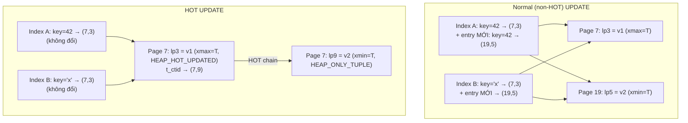
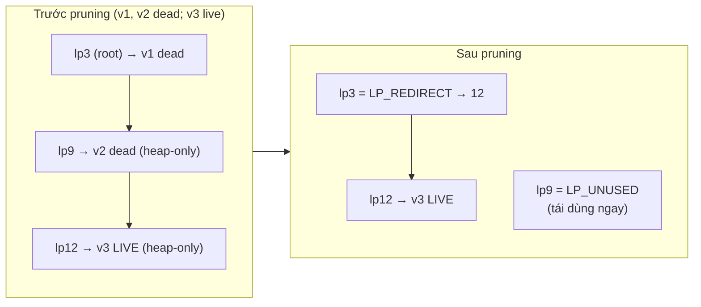

# PART 24 — HOT UPDATE (Heap-Only Tuple)

> **Trước:** [23 — VACUUM](23-vacuum.md) · **Tiếp:** [25 — Replication](25-replication.md)

---

## Mục lục

1. [Simple mental model](#1-simple-mental-model)
2. [WHAT](#2-what)
3. [WHY — Vấn đề của UPDATE thường](#3-why)
4. [HOW — Normal UPDATE vs HOT UPDATE](#4-how)
5. [INTERNALS — HOT chain, cờ, line pointer redirect](#5-internals)
6. [Page pruning: dọn HOT chain không cần VACUUM](#6-page-pruning)
7. [Điều kiện để HOT xảy ra](#7-điều-kiện-để-hot-xảy-ra)
8. [fillfactor](#8-fillfactor)
9. [WHAT HAPPENS IF...](#9-what-happens-if)
10. [PERFORMANCE IMPACT & Production](#10-performance-impact--production)
11. [TRADE-OFF](#11-trade-off)
12. [COMMON MISUNDERSTANDINGS](#12-common-misunderstandings)
13. [INTERVIEW QUESTIONS](#13-interview-questions)
14. [KEY TAKEAWAYS](#14-key-takeaways)

---

## 1. Simple mental model

Mục lục cuối sách (index) ghi "khách hàng số 42 → trang 7, dòng 3". Khi sửa thông tin khách hàng 42:
- **UPDATE thường:** viết bản mới ở chỗ khác (có thể trang khác), rồi **thêm một dòng mới vào mọi mục lục** trỏ tới bản mới.
- **HOT update:** viết bản mới **ngay trên trang 7**, và ở dòng 3 ghi chú "xem bản mới ở dòng 9 cùng trang". Mục lục **không cần sửa** — vẫn trỏ trang 7 dòng 3, người đọc tự đi theo ghi chú.

---

## 2. WHAT

**HOT (Heap-Only Tuple) update** (PostgreSQL 8.3+) là cách UPDATE trong đó version mới của row được đặt **trên cùng heap page** với version cũ và **không tạo index entry mới** — version mới là "heap-only": chỉ tồn tại trong heap, không index nào trỏ trực tiếp tới nó. Index truy cập nó qua **HOT chain** bắt đầu từ line pointer gốc.

---

## 3. WHY

UPDATE thường trong PostgreSQL ([Chương 07 §4](07-read-write-behavior.md#4-update)): TID của version mới khác TID cũ → **mọi index** phải có entry mới (kể cả index trên cột không đổi). Với table 8 index, mỗi UPDATE = 1 heap write + 8 index insert + WAL tương ứng + sau này 8 index phải được vacuum. Đây là **write amplification** — điểm yếu nổi tiếng nhất của PostgreSQL MVCC.

Quan sát: phần lớn UPDATE thực tế **không đổi cột được index** (đổi `status`, `last_seen_at`, `counter`, `payload`...). Với các update đó, index entry cũ (key cũ) vẫn đúng về giá trị — chỉ có TID là lỗi thời. HOT tận dụng điều này: giữ TID cũ làm "điểm vào" và nối tới version mới bên trong page.

---

## 4. HOW



**Cách đọc diagram:**
- **Trái (normal):** version mới ở page 19; cả Index A và Index B nhận entry mới trỏ `(19,5)`; entry cũ trỏ `(7,3)` vẫn còn chờ vacuum. Hai page heap + hai index page bị ghi.
- **Phải (HOT):** version mới ở **cùng page 7** (slot 9). Index **không thay đổi** — vẫn trỏ `(7,3)`. Tuple ở `(7,3)` có cờ `HEAP_HOT_UPDATED` và `t_ctid` → `(7,9)`; tuple ở `(7,9)` có cờ `HEAP_ONLY_TUPLE`. Chỉ một heap page bị ghi.

**Đọc qua index với HOT chain:** index scan lấy TID `(7,3)` → đọc page 7 → kiểm tra visibility của `(7,3)`; không visible → theo `t_ctid` tới `(7,9)` → kiểm tra... → trả version visible đầu tiên. Chain luôn nằm trong **một page** → không tốn thêm I/O.

---

## 5. INTERNALS

| Thành phần | Vai trò |
|---|---|
| `HEAP_HOT_UPDATED` (t_infomask2 của version cũ) | "Tuple này đã được HOT update; version kế tiếp trong cùng page, theo t_ctid" |
| `HEAP_ONLY_TUPLE` (t_infomask2 của version mới) | "Không index nào trỏ trực tiếp tới tôi; chỉ tới được qua chain" |
| **Root line pointer** | Line pointer mà index trỏ tới (điểm vào chain) |
| `LP_REDIRECT` | Sau pruning, root line pointer không còn tuple; nó **redirect** tới line pointer của member còn sống đầu tiên trong chain |
| WAL record | `XLOG_HEAP_HOT_UPDATE` (thay vì `XLOG_HEAP_UPDATE`) |

Một chain có thể dài nhiều bước: v1 → v2 → v3 → v4 (mỗi HOT update thêm một member). Pruning rút gọn chain.

---

## 6. Page pruning

### 6.1 WHAT

**Pruning** (`heap_page_prune`) dọn dẹp **trong phạm vi một page**: xóa storage của các tuple dead (vượt xmin horizon), rút gọn HOT chain, dồn page. Xảy ra:
- **Cơ hội (opportunistic)** trong lúc truy cập page (đọc hoặc update) qua `heap_page_prune_opt`, khi: `pd_prune_xid` cho thấy có thể có tuple prune được **và** page gần đầy (free space < max(mục tiêu fillfactor, 10% page)) — và lấy được **cleanup lock** mà không phải chờ.
- Trong pha 1 của VACUUM.

### 6.2 HOW — HOT chain trước và sau pruning



**Cách đọc diagram:**
1. **Root lp3** không thể bị xóa — index trỏ tới nó. Nó trở thành **LP_REDIRECT → 12** (4 byte, không storage).
2. **lp9** (heap-only, dead) — **không có index nào trỏ tới** → có thể đặt **LP_UNUSED ngay**, **không cần VACUUM dọn index**. Đây là điểm mấu chốt: **với HOT, dead tuple được dọn hoàn toàn chỉ bằng pruning trong page**.
3. Storage của v1, v2 được thu hồi; page được dồn → có chỗ cho các HOT update tiếp theo.
4. Nếu toàn bộ chain dead (row bị DELETE), root thành **LP_DEAD** (chờ VACUUM dọn index entry).

So với non-HOT: dead tuple v1 chỉ thành LP_DEAD sau pruning, và **phải chờ VACUUM** quét mọi index trước khi thành LP_UNUSED.

### 6.3 Tại sao HOT giảm index write — tổng hợp

| | Non-HOT | HOT |
|---|---|---|
| Index insert mỗi UPDATE | N (số index) | **0** |
| WAL | Heap + N index record | Heap record |
| Index bloat do version churn | Có | Không |
| Dọn version cũ | Pruning → LP_DEAD → VACUUM (quét mọi index) → LP_UNUSED | **Pruning → LP_UNUSED** (trừ root) |
| Page heap bị ghi | 1–2 | 1 |

---

## 7. Điều kiện để HOT xảy ra

HOT chỉ xảy ra khi **cả hai** điều kiện:

1. **Không cột nào được "index" bị đổi giá trị.** "Được index" bao gồm:
   - cột là key của bất kỳ index nào (kể cả cột INCLUDE);
   - cột xuất hiện trong **biểu thức** của expression index;
   - cột xuất hiện trong **predicate** của partial index.
   - Ngoại lệ PG 16+: cột chỉ nằm trong index **summarizing** (BRIN) **không** chặn HOT (BRIN vẫn được cập nhật tóm tắt).
   - So sánh là **so giá trị** (binary): `SET status = status` không đổi giá trị → không chặn HOT.
2. **Version mới vừa trên cùng page** với version cũ (đủ free space — sau khi prune nếu cần).

Không phụ thuộc: số cột bị đổi, kích thước thay đổi (miễn vừa page), isolation level.

---

## 8. fillfactor

### 8.1 WHAT

Storage parameter của table: **% mỗi page được lấp đầy bởi INSERT** (mặc định **100** cho heap). Phần còn lại dành cho UPDATE vào cùng page.

```sql
ALTER TABLE accounts SET (fillfactor = 80);   -- áp dụng cho page được ghi mới; muốn áp cho toàn bộ cần rewrite (pg_repack/VACUUM FULL)
```

### 8.2 WHY

fillfactor 100 → INSERT lấp page tới đầy → UPDATE đầu tiên trên row trong page thường **không còn chỗ** → non-HOT (trừ khi pruning giải phóng được chỗ). fillfactor 80 → mỗi page chừa 20% cho các version mới → tỉ lệ HOT tăng mạnh.

### 8.3 Trade-off

| fillfactor thấp | |
|---|---|
| + HOT nhiều hơn → ít index write, ít index bloat, ít vacuum index | |
| − Table lớn hơn (80 → +25% page) → seq scan đọc nhiều hơn, cache chứa ít row hơn | |
| − Phần dữ liệu không bao giờ update (append-only) lãng phí chỗ | |

Gợi ý: table update nhiều (session, account balance, job status, counter) → 70–90; table append-only/log → 100.

---

## 9. WHAT HAPPENS IF...

| Tình huống | Hệ quả |
|---|---|
| **Index trên `updated_at`** và mọi UPDATE đều set `updated_at = now()` | **Không bao giờ HOT** → mọi update ghi mọi index. Một trong những anti-pattern phổ biến nhất. Cân nhắc có thật cần index này không, hoặc BRIN (PG 16+ không chặn HOT). |
| **Long transaction giữ horizon** | Pruning không dọn được member dead → page đầy → UPDATE sau không vừa page → non-HOT. HOT "chết" dần dưới long transaction. |
| **Page đầy (fillfactor 100)** | Pruning có thể giải phóng chỗ nếu có dead tuple; nếu không → non-HOT. |
| **Row lớn / TOAST** | Tuple lớn khó vừa page; giá trị TOAST out-of-line không đổi thì pointer được giữ (tuple chính nhỏ) → vẫn có thể HOT. |
| **HOT chain rất dài** (hàng trăm update giữa hai lần prune) | Đọc qua index phải đi chain dài (trong một page — CPU, không I/O). Pruning rút gọn. |
| **Thêm index mới trên cột hay update** | Tỉ lệ HOT sụp đổ → ghi tăng vọt. Luôn kiểm tra trước khi thêm index trên table update nhiều. |

---

## 10. PERFORMANCE IMPACT & Production

Giám sát:

```sql
SELECT relname, n_tup_upd, n_tup_hot_upd,
       round(100.0 * n_tup_hot_upd / nullif(n_tup_upd, 0), 1) AS hot_pct,
       n_tup_newpage_upd   -- PG 16+: update phải đặt version mới ở page khác
FROM pg_stat_user_tables ORDER BY n_tup_upd DESC LIMIT 20;
```

- `hot_pct` thấp trên table update nhiều → tìm nguyên nhân: index trên cột hay đổi (sửa index), `n_tup_newpage_upd` cao (thiếu chỗ → giảm fillfactor), long transaction (horizon).
- Sau khi giảm fillfactor, cần rewrite (pg_repack) để các page cũ cũng có chỗ trống, hoặc chờ dần.

Tác động điển hình khi chuyển một table update nóng từ 20% HOT lên 95% HOT: WAL giảm mạnh, index bloat gần như biến mất, autovacuum trên table nhẹ hẳn, replication lag giảm.

---

## 11. TRADE-OFF

| Lợi ích | Chi phí / Giới hạn |
|---|---|
| Không index write cho update không đổi cột index | Chỉ khi cùng page + không đổi cột được index |
| Dọn version cũ bằng pruning, không cần vacuum index | Cần fillfactor < 100 (table lớn hơn) |
| Giảm WAL, bloat, vacuum | Đi chain khi đọc (CPU nhỏ) |
| | Mỗi index thêm vào đều thu hẹp cơ hội HOT |

---

## 12. COMMON MISUNDERSTANDINGS

1. **"Update cột không có index thì luôn HOT."** — Còn cần vừa cùng page.
2. **"HOT là update in-place."** — Vẫn tạo version mới (MVCC), chỉ không cần index entry mới.
3. **"HOT loại bỏ nhu cầu VACUUM."** — Giảm mạnh cho heap-only tuple, nhưng VACUUM vẫn cần cho VM, FSM, freeze, và dead root.
4. **"fillfactor càng thấp càng tốt."** — Đổi dung lượng và scan lấy HOT; chỉ cho table update nhiều.
5. **"Index INCLUDE không ảnh hưởng HOT."** — Cột INCLUDE cũng tính là được index.

---

## 13. INTERVIEW QUESTIONS

**Q1. HOT update là gì? Tại sao giảm index write?**
- *Short:* Version mới cùng page, không đổi cột được index → không tạo index entry mới; index trỏ root, đi HOT chain trong page.
- *Deep:* Cờ HEAP_HOT_UPDATED/HEAP_ONLY_TUPLE, LP_REDIRECT, pruning đặt LP_UNUSED cho heap-only tuple không cần vacuum index.
- *Follow-up:* Điều kiện HOT? fillfactor liên quan thế nào?

**Q2. Tại sao UPDATE trong PostgreSQL đắt? HOT giải quyết phần nào?**
- *Short:* Tạo tuple mới + index entry cho mọi index; HOT loại bỏ phần index khi điều kiện thỏa.

**Q3. Index trên updated_at ảnh hưởng gì?**
- *Short:* Mọi update đổi cột được index → không HOT → write amplification.

**Q4. (Senior) Tỉ lệ HOT của table `sessions` chỉ 5%. Điều tra và xử lý?**
- *Short:* Kiểm tra index trên cột hay đổi, n_tup_newpage_upd (thiếu chỗ → fillfactor), long transaction; bỏ index thừa, fillfactor 70–80 + repack, xử lý horizon.

---

## 14. KEY TAKEAWAYS

1. HOT = version mới **cùng page**, **không đổi cột được index** → **không index write**.
2. Index trỏ **root line pointer**; đọc đi theo **HOT chain** trong page.
3. **Pruning** dọn chain: root → LP_REDIRECT, heap-only dead → **LP_UNUSED ngay** (không cần vacuum index).
4. Điều kiện: không đổi cột key/INCLUDE/expression/partial predicate (BRIN không chặn từ PG 16) + đủ chỗ trong page.
5. **fillfactor** < 100 cho table update nhiều; mỗi index mới là một cột có thể phá HOT.
6. Theo dõi `n_tup_hot_upd / n_tup_upd` và `n_tup_newpage_upd`.

---

## Nguồn tham khảo

- PostgreSQL Docs — *Heap-Only Tuples (HOT)*: https://www.postgresql.org/docs/current/storage-hot.html
- PostgreSQL Docs — *CREATE TABLE* (fillfactor storage parameter).
- PostgreSQL source: `src/backend/access/heap/README.HOT`, `pruneheap.c`, `heapam.c` (`heap_update`).
- PostgreSQL 16 Release Notes (HOT với BRIN, `n_tup_newpage_upd`).
