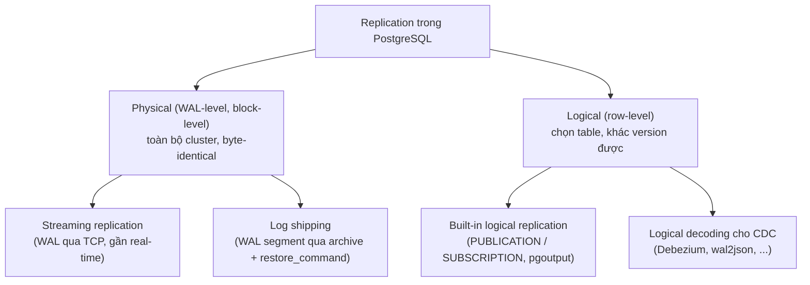
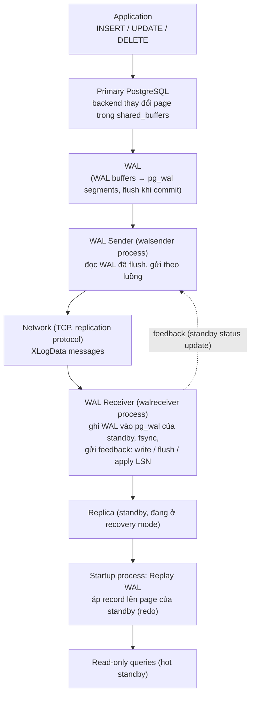
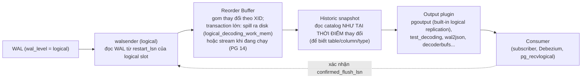
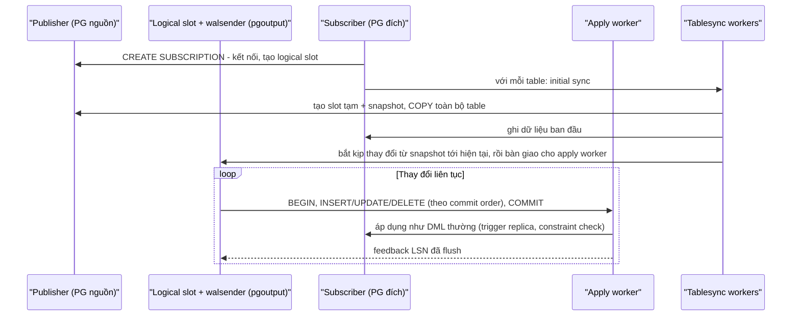

# PART 25 — REPLICATION

> **Trước:** [24 — HOT Update](24-hot-update.md) · **Tiếp:** [26 — Primary–Replica](26-primary-replica.md)
> **Độ ưu tiên:** Rất cao. Replication trong PostgreSQL là **WAL được gửi đi nơi khác** — mọi thứ ở [Chương 20](20-wal.md) áp dụng ở đây.

---

## Mục lục

1. [Simple mental model](#1-simple-mental-model)
2. [Tổng quan: Physical vs Logical, Streaming vs Log shipping](#2-tổng-quan)
3. [Concept: Physical Streaming Replication](#3-concept-physical-streaming-replication)
4. [WAL Sender, WAL Receiver, Startup (Replay)](#4-wal-sender-wal-receiver-startup)
5. [Hot Standby: query trên replica](#5-hot-standby)
6. [Concept: Replication Slot](#6-concept-replication-slot)
7. [Synchronous vs Asynchronous (tóm tắt)](#7-synchronous-vs-asynchronous)
8. [Concept: Logical Decoding](#8-concept-logical-decoding)
9. [Concept: Logical Replication — Publication & Subscription](#9-concept-logical-replication)
10. [So sánh Physical vs Logical](#10-so-sánh-physical-vs-logical)
11. [WHAT HAPPENS IF...](#11-what-happens-if)
12. [PERFORMANCE IMPACT](#12-performance-impact)
13. [PRODUCTION BEHAVIOR](#13-production-behavior)
14. [COMMON MISUNDERSTANDINGS](#14-common-misunderstandings)
- [Concept card — khung 13 điểm](#concept-card--)
15. [INTERVIEW QUESTIONS](#15-interview-questions)
16. [KEY TAKEAWAYS](#16-key-takeaways)

---

## 1. Simple mental model

- **Physical replication:** gửi cho chi nhánh **bản sao từng trang nhật ký kế toán** (WAL). Chi nhánh chép y hệt vào sổ cái của mình → sổ cái chi nhánh **giống hệt từng byte** trụ sở. Chi nhánh chỉ được đọc, không được ghi.
- **Logical replication:** một người **đọc nhật ký và diễn giải** thành câu chữ ("khách hàng 42 đổi địa chỉ thành X"), gửi các câu đó cho chi nhánh. Chi nhánh tự áp dụng theo cách của mình — có thể chỉ nhận một số table, có thể có thêm table riêng, có thể dùng phiên bản phần mềm khác.

---

## 2. Tổng quan



**Cách đọc diagram:** Cả hai nhánh đều xuất phát từ **WAL**. Physical gửi WAL nguyên bản; logical **giải mã (decode)** WAL thành thay đổi mức row. Streaming và log shipping là hai phương thức vận chuyển WAL vật lý và thường được **kết hợp**: streaming cho độ trễ thấp, archive làm dự phòng khi standby tụt quá xa.

Thuật ngữ: **primary** (nhận ghi), **standby** (thuật ngữ chính thức trong docs — server đang ở chế độ recovery liên tục), **replica** (thường dùng như standby), **hot standby** (standby cho phép query read-only), **warm standby** (standby không cho query). "Master/slave" là thuật ngữ cũ ([Chương 26](26-primary-replica.md)).

---

## 3. Concept: Physical Streaming Replication

### 3.1 WHAT

Standby kết nối tới primary bằng **replication connection**, nhận **luồng WAL** liên tục và **replay** nó — đúng cơ chế crash recovery ([Chương 22](22-crash-recovery.md)) nhưng không bao giờ kết thúc. Kết quả: standby là **bản sao vật lý chính xác** của toàn bộ cluster (mọi database, mọi table, mọi index), chậm hơn primary một khoảng thời gian (lag).

### 3.2 WHY

1. **High Availability:** primary chết → promote standby ([Chương 29](29-high-availability.md), [30](30-failover.md)).
2. **Read scaling:** chuyển query đọc sang standby ([Chương 26](26-primary-replica.md)).
3. **Durability ngoài một máy:** dữ liệu tồn tại ở nhiều máy/AZ (với sync replication — không mất commit nào khi mất primary).
4. **Backup/analytics offload:** chạy backup, report trên standby.

Không có replication: primary là điểm lỗi duy nhất; mất máy = khôi phục từ backup (RTO giờ, RPO phụ thuộc WAL archive).

### 3.3 HOW — Diagram bắt buộc



**Cách đọc diagram (trên xuống):**
1. **Application** ghi vào primary như bình thường.
2. **Primary** sinh WAL; khi commit, WAL được flush xuống `pg_wal` của primary.
3. **WAL Sender** (một process cho mỗi standby) đọc WAL — chỉ WAL **đã flush** trên primary mới được gửi (để standby không bao giờ "đi trước" primary) — và gửi qua **replication protocol** (`START_REPLICATION` rồi các message `XLogData`).
4. **Network** — độ trễ và băng thông mạng là một thành phần của lag.
5. **WAL Receiver** trên standby nhận, **ghi** vào `pg_wal` của standby, **flush**, và định kỳ gửi **feedback** về primary: vị trí đã write, đã flush, đã replay (mỗi `wal_receiver_status_interval`, mặc định 10s, và mỗi lần flush khi có sync rep).
6. **Startup process** đọc WAL đã nhận và **replay** vào data files của standby.
7. Nếu `hot_standby = on` (mặc định), standby nhận **query read-only**.

### 3.4 INTERNALS — khởi tạo và tham số

- **Khởi tạo standby:** sao chép dữ liệu primary bằng **base backup** (`pg_basebackup`, pgBackRest...) → một bản copy vật lý nhất quán + WAL cần thiết.
- **Cấu hình standby (PG 12+):** file `standby.signal` trong PGDATA (thay cho `recovery.conf` cũ) + `primary_conninfo` (chuỗi kết nối tới primary) + tùy chọn `primary_slot_name`, `restore_command` (lấy WAL từ archive khi cần).
- **Primary:** `wal_level = replica` (hoặc logical), `max_wal_senders` (mặc định 10), `pg_hba.conf` cho phép user có quyền `REPLICATION`.
- **Cascading replication:** standby có thể làm nguồn WAL cho standby khác (giảm tải walsender trên primary, tiết kiệm băng thông liên vùng).
- **Yêu cầu:** cùng **major version**, cùng kiến trúc CPU/OS tương thích (vì WAL là vật lý).
- Standby **không thể ghi** (kể cả temp table), không thể chạy VACUUM, không thể tạo index riêng.

### 3.5 Log shipping (file-based)

Standby không kết nối primary; nó lấy từng **WAL segment đầy** từ archive bằng `restore_command`. Lag ≥ một segment (hoặc `archive_timeout`). Dùng làm **dự phòng**: nếu streaming đứt và primary đã xóa WAL cần thiết, standby lấy từ archive để bắt kịp rồi quay lại streaming.

---

## 4. WAL Sender, WAL Receiver, Startup

| Process | Nơi chạy | Trách nhiệm | View quan sát |
|---|---|---|---|
| **walsender** | Primary (hoặc standby nguồn cascade) | Đọc WAL, gửi; nhận feedback; với sync rep đánh thức backend chờ | `pg_stat_replication` |
| **walreceiver** | Standby | Kết nối nguồn, nhận/ghi/flush WAL, gửi feedback (kèm `hot_standby_feedback` xmin) | `pg_stat_wal_receiver` |
| **startup** | Standby | Replay WAL (single-threaded), xử lý recovery conflict | `pg_last_wal_replay_lsn()`, `pg_last_xact_replay_timestamp()` |

**Tách write/flush/replay** là cơ sở để định nghĩa các loại lag ([Chương 28](28-replication-lag.md)) và các mức `synchronous_commit` ([Chương 27](27-sync-async-replication.md)).

---

## 5. Hot Standby

### 5.1 HOW — Standby tạo snapshot thế nào?

Standby không có ProcArray của primary. Primary ghi định kỳ WAL record **`RUNNING_XACTS`** (danh sách XID đang chạy) và mọi XID được cấp đều xuất hiện trong WAL; startup process duy trì cấu trúc **KnownAssignedXids** — danh sách XID "đang chạy trên primary" theo WAL đã replay. Query trên standby lấy snapshot từ cấu trúc này → thấy **trạng thái nhất quán của primary tại thời điểm replay hiện tại**.

### 5.2 Recovery conflicts

Replay có thể xung đột với query đang chạy trên standby:

| Loại | Nguyên nhân | Ví dụ |
|---|---|---|
| **Snapshot (cleanup)** | Primary vacuum/prune xóa tuple mà query standby (snapshot cũ) còn cần; record cleanup mang "latestRemovedXid" | Report 10 phút trên standby trong khi primary vacuum table đó |
| **Lock** | Replay cần ACCESS EXCLUSIVE (DROP, TRUNCATE, ALTER, **vacuum truncate**) trên table query đang đọc | |
| **Buffer pin** | Replay cần cleanup lock trên page query đang pin | |
| **Tablespace / Database** | DROP TABLESPACE/DATABASE | |
| **Deadlock** (startup chờ lock trong khi query chờ buffer...) | | |

**Giải quyết:** startup process **chờ** tối đa `max_standby_streaming_delay` (mặc định **30s**; `max_standby_archive_delay` cho WAL từ archive), sau đó **hủy query** gây xung đột: `ERROR: canceling statement due to conflict with recovery`. Trong lúc chờ, **replay dừng** → replication lag tăng. Thống kê: `pg_stat_database_conflicts`.

### 5.3 `hot_standby_feedback`

Khi `on`, walreceiver gửi **xmin của các query trên standby** về primary; primary coi đó như một backend giữ horizon → **không vacuum** tuple mà standby cần → loại bỏ phần lớn snapshot conflict.

Trade-off: query dài trên standby → **bloat trên primary** (như long transaction trên chính primary). Không có lựa chọn miễn phí:

| Lựa chọn | Hệ quả |
|---|---|
| `max_standby_streaming_delay` nhỏ, feedback off | Query dài trên standby bị hủy; lag nhỏ |
| `max_standby_streaming_delay` lớn/−1 | Query không bị hủy nhưng **replay có thể dừng rất lâu** → standby rất lag (không phù hợp làm HA) |
| `hot_standby_feedback = on` | Ít hủy query; primary bloat theo query standby |
| Standby riêng cho analytics (delay lớn) + standby riêng cho HA | Tách mục đích — thực tế tốt nhất |

---

## 6. Concept: Replication Slot

### 6.1 WHAT

**Replication slot** là một đối tượng **bền vững** trên primary (lưu trong `pg_replslot/`, sống qua restart) ghi nhớ **consumer đã nhận tới đâu**, và **ngăn primary xóa WAL (và/hoặc dọn tuple) mà consumer còn cần**.

### 6.2 WHY

Không có slot: primary recycle WAL sau checkpoint (trừ `wal_keep_size`); standby mất kết nối lâu → WAL nó cần đã bị xóa → `ERROR: requested WAL segment 0000000100000A3B000000F2 has already been removed` → phải **rebuild standby từ base backup** (có thể hàng giờ với database TB). Với logical decoding, mất WAL = mất thay đổi (không thể CDC tiếp).

### 6.3 HOW / INTERNALS

| Thuộc tính (`pg_replication_slots`) | Ý nghĩa |
|---|---|
| `slot_type` | `physical` / `logical` |
| `active` | Có consumer đang kết nối không |
| `restart_lsn` | WAL cũ nhất consumer còn cần → primary **giữ mọi WAL từ đây** |
| `confirmed_flush_lsn` (logical) | Consumer xác nhận đã xử lý tới đây |
| `xmin` | (physical + hot_standby_feedback) giữ **xmin horizon** |
| `catalog_xmin` (logical) | Giữ horizon cho **system catalog** (để decode WAL cũ cần catalog cũ) |
| `wal_status` (PG 13) | `reserved` / `extended` / `unreserved` (sắp bị mất) / `lost` |
| `safe_wal_size` | Còn bao nhiêu byte trước khi slot bị invalidate |
| `invalidation_reason` (PG 17) | Vì sao bị invalidate |

### 6.4 WHAT HAPPENS IF — Slot bị bỏ rơi

Consumer (standby đã bị gỡ, Debezium connector chết, subscription bị xóa ở phía subscriber nhưng slot còn ở publisher) → slot `active = false` → `restart_lsn` đứng yên → **WAL tích lũy vô hạn** → **disk full → PANIC**. Đồng thời `xmin`/`catalog_xmin` đứng yên → **bloat**.

Bảo vệ:
- `max_slot_wal_keep_size` (PG 13): giới hạn WAL mà slot được giữ; vượt → slot bị **invalidate** (`wal_status = lost`) — consumer phải khởi tạo lại, nhưng primary sống.
- `idle_replication_slot_timeout` (PG 18): tự invalidate slot không hoạt động quá thời gian.
- Giám sát `active`, `pg_wal_lsn_diff(pg_current_wal_lsn(), restart_lsn)`.

### 6.5 Slot vs `wal_keep_size`

`wal_keep_size` (PG 13, trước là `wal_keep_segments`): luôn giữ một lượng WAL cố định cho mọi standby — đơn giản, có giới hạn, nhưng không đảm bảo standby lag lâu vẫn đủ WAL. Slot: đảm bảo chính xác, không giới hạn (trừ khi đặt max_slot_wal_keep_size).

---

## 7. Synchronous vs Asynchronous

- **Async (mặc định):** primary commit không chờ standby → latency thấp; failover có thể **mất** các transaction đã commit trên primary nhưng chưa tới standby.
- **Sync:** `synchronous_standby_names` + `synchronous_commit` (`remote_write`/`on`/`remote_apply`) → commit chờ standby xác nhận → không mất commit khi failover (RPO = 0), latency cao hơn, và **primary có thể treo commit** nếu standby sync không phản hồi.

Chi tiết: [Chương 27](27-sync-async-replication.md).

---

## 8. Concept: Logical Decoding

### 8.1 WHAT

**Logical decoding** chuyển WAL (vật lý) thành **luồng thay đổi logic** mức row: `BEGIN`, `INSERT INTO t (...) VALUES (...)`, `UPDATE ... old key / new row`, `DELETE ... old key`, `COMMIT` — **theo thứ tự commit**, chỉ gồm transaction đã commit.

### 8.2 WHY

Physical replication không cho phép: replicate một phần, replicate sang version khác, sang hệ thống khác (Kafka, warehouse), có table riêng/index riêng ở đích. Logical decoding là nền tảng cho **logical replication** và **CDC** ([Chương 43](43-data-engineer-perspective.md)).

### 8.3 HOW



**Cách đọc diagram (trái sang phải):**
1. `wal_level = logical` làm WAL chứa thêm thông tin cần để tái dựng row (ví dụ giá trị **old key** của row bị UPDATE/DELETE, theo **REPLICA IDENTITY**).
2. Walsender logical đọc WAL từ `restart_lsn` của **logical slot**.
3. **Reorder buffer**: WAL xen kẽ thay đổi của nhiều transaction; decoding gom theo transaction và **chỉ phát khi COMMIT** (theo thứ tự commit). Transaction abort bị bỏ. Transaction lớn vượt `logical_decoding_work_mem` (64MB) → spill ra file trong `pg_replslot/` hoặc (PG 14+) **stream** các phần khi đang chạy (subscriber/consumer phải hỗ trợ).
4. **Historic snapshot**: để biết tuple trong WAL thuộc table nào, cột gì, kiểu gì — decoding đọc **system catalog tại thời điểm đó** → vì vậy slot giữ **catalog_xmin** (không cho vacuum dọn catalog tuple cũ còn cần).
5. **Output plugin** biến thay đổi thành định dạng cụ thể.
6. Consumer xác nhận LSN đã xử lý → slot tiến → WAL cũ được giải phóng.

### 8.4 REPLICA IDENTITY

Quyết định WAL ghi gì về **row cũ** cho UPDATE/DELETE:

| Mode | Ghi old row | Ghi chú |
|---|---|---|
| `DEFAULT` | Cột primary key (chỉ khi key đổi, với UPDATE) | Cần PK |
| `USING INDEX idx` | Cột của unique index chỉ định (NOT NULL) | |
| `FULL` | **Toàn bộ row cũ** | Không cần key; **WAL lớn hơn nhiều**; subscriber phải tìm row bằng mọi cột (chậm nếu không có index phù hợp) |
| `NOTHING` | Không | UPDATE/DELETE không replicate được |

Table không có PK trong publication có publish update/delete → UPDATE/DELETE trên primary **bị lỗi** cho tới khi đặt replica identity.

---

## 9. Concept: Logical Replication

### 9.1 WHAT & HOW

**Publication** (phía nguồn) định nghĩa **cái gì** được publish; **Subscription** (phía đích) kết nối, tạo logical slot trên nguồn (mặc định), và áp dụng thay đổi.



**Cách đọc diagram:** Subscription làm hai việc: **initial sync** (COPY dữ liệu hiện có, nhất quán với snapshot của slot) và **streaming thay đổi** sau đó. Apply worker áp dụng thay đổi như câu lệnh DML thông thường ở subscriber — có kiểm tra constraint, có thể xung đột.

```sql
-- Nguồn
CREATE PUBLICATION pub_orders FOR TABLE orders, order_items
  WITH (publish = 'insert, update, delete, truncate');
-- PG 15: row filter và column list
CREATE PUBLICATION pub_vn FOR TABLE customers (id, name, country) WHERE (country = 'VN');

-- Đích
CREATE SUBSCRIPTION sub_orders CONNECTION 'host=... dbname=shop' PUBLICATION pub_orders;
```

### 9.2 Tính năng theo version

| Version | Tính năng |
|---|---|
| PG 10 | Logical replication built-in |
| PG 11 | TRUNCATE được replicate |
| PG 13 | Publish partitioned table qua root (`publish_via_partition_root`) |
| PG 14 | Streaming transaction lớn đang chạy; binary mode |
| PG 15 | Row filters, column lists, `FOR TABLES IN SCHEMA`, two-phase, `disable_on_error`, `ALTER SUBSCRIPTION SKIP` |
| PG 16 | **Parallel apply** cho transaction lớn được stream; logical decoding **trên standby**; `origin = none` (tránh vòng lặp khi replicate hai chiều) |
| PG 17 | **Failover slots** (đồng bộ logical slot sang standby: `failover` option, `sync_replication_slots`), `pg_createsubscriber` (biến physical standby thành logical subscriber), pg_upgrade giữ logical slot/subscription |
| PG 18 | Mặc định subscription `streaming = parallel`; replicate giá trị generated column |
| PG 19 (beta) | Replicate **sequence**; bật logical decoding không cần restart khi `wal_level = replica` |

### 9.3 Giới hạn quan trọng

- **Không replicate DDL** → thay đổi schema phải thực hiện ở cả hai phía theo thứ tự đúng (thường: đích trước khi thêm cột, nguồn trước khi xóa cột).
- **Sequence** không được replicate (tới PG 18) → sau cutover phải đặt lại sequence ở đích.
- Large objects không được replicate.
- **Xung đột** ở subscriber (vd duplicate key vì đích đã có row) → apply worker lỗi và **dừng** (retry liên tục) → slot ở nguồn giữ WAL → nguồn disk tăng. Xử lý: sửa dữ liệu, `ALTER SUBSCRIPTION ... SKIP (lsn = ...)`, `disable_on_error`.
- Apply worker là **một process** mỗi subscription (parallel apply chỉ cho transaction lớn được stream) → throughput có giới hạn so với primary nhiều connection.

### 9.4 Use cases

- **Nâng cấp major version gần như không downtime**: replicate từ PG cũ sang PG mới, cutover.
- Replicate một phần (một số table/row) sang hệ thống khác, consolidation nhiều database vào một.
- Nguồn CDC (qua logical decoding).
- Bidirectional (multi-master tự quản) — phức tạp, dễ xung đột; PG 16 `origin = none` hỗ trợ tránh vòng lặp nhưng **không** giải quyết xung đột.

---

## 10. So sánh Physical vs Logical

| | Physical (streaming) | Logical |
|---|---|---|
| Đơn vị | WAL record (block) | Row change |
| Phạm vi | **Toàn cluster** | Table/schema/row/cột chọn lọc |
| Đích | Standby read-only, cùng major version, cùng kiến trúc | PG bất kỳ ≥ 10 (khác version được), đích **ghi được** |
| DDL | Có (vì là vật lý) | **Không** |
| Sequence, large object | Có | Không (sequence: PG 19 beta) |
| Index ở đích | Giống hệt nguồn | Tùy ý |
| Initial sync | Base backup | COPY per table |
| Overhead nguồn | Thấp (gửi WAL) | Decoding CPU/memory, WAL lớn hơn (wal_level logical, replica identity) |
| Dùng cho HA failover | **Có** (tiêu chuẩn) | Không phải lựa chọn chính |
| Throughput apply | Replay single-threaded nhưng rất nhanh (vật lý) | Apply worker như client DML, chậm hơn |

---

## 11. WHAT HAPPENS IF...

| Tình huống | Hành vi |
|---|---|
| **Standby mất kết nối 1 giờ, không dùng slot** | Nếu WAL đã bị recycle → không bắt kịp được qua streaming; lấy từ archive (restore_command) nếu có; không thì rebuild. |
| **Có slot, standby chết vĩnh viễn** | WAL tích lũy → disk full (trừ khi max_slot_wal_keep_size / idle_replication_slot_timeout). |
| **Primary chết** | Standby dừng nhận WAL; có thể promote ([Chương 30](30-failover.md)). |
| **Network chậm/băng thông thấp** | Lag tăng (write/flush lag). |
| **Standby replay chậm** (single-threaded, I/O chậm, conflict wait) | Replay lag tăng dù WAL đã tới. |
| **Query dài trên standby** | Hủy query sau 30s hoặc dừng replay (lag) hoặc bloat primary (feedback). |
| **ALTER TABLE ADD COLUMN ở nguồn logical, chưa thêm ở đích** | Apply lỗi khi gặp row có cột mới → dừng subscription. |
| **Logical subscriber bị drop nhưng slot ở nguồn còn** | Slot bỏ rơi → disk full nguồn. |
| **Failover primary khi dùng logical replication (trước PG 17)** | Logical slot không có trên standby mới → CDC/subscription phải khởi tạo lại (mất vị trí). PG 17 failover slots giải quyết. |
| **Transaction 50GB trên nguồn logical** | Reorder buffer spill ra disk hoặc stream; subscriber nhận chậm; slot giữ WAL lâu. |

---

## 12. PERFORMANCE IMPACT

- **Trên primary:** walsender đọc WAL (thường từ page cache), gửi mạng — nhẹ với physical; logical decoding tốn CPU/memory và I/O spill. Sync replication thêm latency commit = RTT + flush trên standby.
- **Trên standby:** replay single-threaded — với workload ghi rất nặng trên primary (nhiều connection song song), replay có thể không theo kịp (đặc biệt random I/O). `recovery_prefetch` (PG 15) giúp đáng kể.
- **WAL volume** quyết định băng thông replication — mọi biện pháp giảm WAL ([Chương 20 §14](20-wal.md#14-performance-impact)) cũng giảm lag.

---

## 13. PRODUCTION BEHAVIOR

```sql
-- Trên primary: trạng thái từng standby
SELECT application_name, client_addr, state, sync_state,
       sent_lsn, write_lsn, flush_lsn, replay_lsn,
       write_lag, flush_lag, replay_lag,
       pg_wal_lsn_diff(pg_current_wal_lsn(), replay_lsn) AS replay_lag_bytes
FROM pg_stat_replication;

-- Slot
SELECT slot_name, slot_type, active, wal_status, safe_wal_size,
       pg_size_pretty(pg_wal_lsn_diff(pg_current_wal_lsn(), restart_lsn)) AS retained_wal,
       age(xmin) AS xmin_age, age(catalog_xmin) AS catalog_xmin_age
FROM pg_replication_slots;

-- Trên standby
SELECT pg_is_in_recovery(), pg_last_wal_receive_lsn(), pg_last_wal_replay_lsn(),
       now() - pg_last_xact_replay_timestamp() AS replay_delay;
SELECT * FROM pg_stat_database_conflicts;

-- Logical
SELECT * FROM pg_stat_subscription;          -- trên subscriber
SELECT * FROM pg_stat_subscription_stats;    -- lỗi apply/sync (PG 15+)
```

Cảnh báo tối thiểu: slot inactive, retained WAL > ngưỡng, replay lag (bytes và thời gian), conflict count tăng, subscription error.

---

## 14. COMMON MISUNDERSTANDINGS

1. **"Replica luôn giống primary ngay lập tức."** — Có lag; async có thể thiếu commit khi failover.
2. **"Logical replication replicate mọi thứ."** — Không DDL, không sequence (tới PG 18), không large object.
3. **"Replication slot là tính năng an toàn không có rủi ro."** — Slot bỏ rơi làm đầy disk và gây bloat.
4. **"Standby có thể dùng cho query analytics dài mà không ảnh hưởng gì."** — Conflict/hủy query, lag, hoặc bloat primary (feedback).
5. **"`pg_last_xact_replay_timestamp` = độ trễ."** — Khi primary không ghi gì, giá trị này cũ đi dù standby đã bắt kịp hoàn toàn.
6. **"Physical replication giữa PG 15 và PG 16 được."** — Phải cùng major version; dùng logical cho nâng cấp.

---

## Concept card — Replication theo khung 13 điểm

| # | Khía cạnh | Tóm tắt |
|---|---|---|
| 1 | **WHAT** | Physical: gửi WAL nguyên bản để standby replay thành bản sao byte-identical. Logical: giải mã WAL thành row change để áp vào đích tùy ý. |
| 2 | **WHY** | HA, scale đọc, dữ liệu ngoài một máy, nâng cấp version, CDC — §3.2, §8.2. |
| 3 | **HOW** | WAL → walsender → network → walreceiver (write/flush) → startup (replay); logical: slot → reorder buffer → output plugin → apply — §3.3, §8.3, §9.1. |
| 4 | **INTERNALS** | Replication protocol, feedback LSN, KnownAssignedXids, recovery conflict, replication slot (`restart_lsn`, `xmin`, `catalog_xmin`), historic snapshot, REPLICA IDENTITY — §4–§8. |
| 5 | **EXAMPLE** | Publication/subscription cho `orders` với row filter (§9.1); query dài trên standby bị hủy (§5.2). |
| 6 | **WHAT HAPPENS IF** | Standby mất kết nối không có slot, slot bị bỏ rơi, DDL không đồng bộ ở logical, failover mất logical slot (trước PG 17) — §11. |
| 7 | **PERFORMANCE IMPACT** | Walsender nhẹ; decoding tốn CPU/memory; replay single-threaded; WAL volume quyết định băng thông — §12. |
| 8 | **PRODUCTION BEHAVIOR** | `pg_stat_replication`, `pg_replication_slots` (retained WAL), `pg_stat_database_conflicts`, `pg_stat_subscription_stats` — §13. |
| 9 | **TRADE-OFF** | Physical: toàn cluster, cùng version, read-only ↔ đơn giản, chính xác. Logical: chọn lọc, khác version ↔ không DDL, apply chậm hơn, xung đột — §10. |
| 10 | **WHEN TO USE / NOT** | Physical cho HA/read replica/DR; logical cho nâng cấp, tích hợp, replicate một phần, CDC. Không dùng logical làm cơ chế HA chính. |
| 11 | **MISUNDERSTANDINGS** | "Replica tức thời", "logical replicate mọi thứ", "slot không có rủi ro" — §14. |
| 12 | **INTERVIEW** | Streaming hoạt động thế nào, physical vs logical, hot standby conflict — §15. |
| 13 | **KEY TAKEAWAYS** | Replication = WAL được vận chuyển và replay/giải mã — §16. |

---

## 15. INTERVIEW QUESTIONS

**Q1. Streaming replication hoạt động thế nào?**
- *Short:* Standby kết nối primary; walsender gửi WAL đã flush; walreceiver ghi/flush WAL trên standby, gửi feedback; startup process replay như crash recovery liên tục; hot standby cho query read-only.
- *Follow-up:* Replication slot để làm gì? Rủi ro?

**Q2. Physical vs logical replication?**
- *Short:* Physical: WAL nguyên bản, toàn cluster, cùng version, read-only, dùng cho HA. Logical: decode thành row change, chọn lọc, khác version, đích ghi được, không DDL.

**Q3. Hot standby conflict là gì? Xử lý?**
- *Short:* Replay cần xóa tuple/khóa mà query standby đang dùng; chờ max_standby_streaming_delay rồi hủy query; hot_standby_feedback tránh hủy nhưng gây bloat primary.

**Q4. Logical decoding hoạt động thế nào?**
- *Short:* Đọc WAL từ slot, gom theo transaction trong reorder buffer, phát khi commit theo thứ tự commit, dùng historic snapshot của catalog, output plugin định dạng.

**Q5. Replica identity là gì?**
- *Short:* Quy định WAL ghi phần nào của row cũ cho UPDATE/DELETE để phía nhận xác định row: DEFAULT (PK), USING INDEX, FULL, NOTHING.

**Q6. (Senior) Làm sao nâng cấp PG 14 → PG 17 với downtime vài giây?**
- *Short:* Logical replication: dựng cluster PG 17, tạo schema (pg_dump --schema-only), tạo PUBLICATION ở PG 14 và SUBSCRIPTION ở PG 17, chờ initial sync và bắt kịp (lag ≈ 0), dừng ghi trong vài giây, đồng bộ sequence (không được replicate), chuyển traffic, giữ đường lui (replicate ngược hoặc giữ cluster cũ).
- *Follow-up:* Vì sao không dùng được physical replication cho việc này? (Physical yêu cầu cùng major version.)

**Q7. (Senior) Disk primary tăng 200GB qua đêm, không có tải bất thường. Nghi ngờ gì?**
- *Short:* Replication slot inactive (CDC connector chết, standby bị gỡ), archive_command lỗi; kiểm tra pg_replication_slots và pg_stat_archiver.

---

## 16. KEY TAKEAWAYS

1. Replication PostgreSQL = **WAL được vận chuyển và replay** (physical) hoặc **WAL được giải mã** (logical).
2. Pipeline physical: **WAL → walsender → network → walreceiver (write/flush) → startup (replay)**; standby = crash recovery không bao giờ kết thúc.
3. Hot standby dùng KnownAssignedXids để tạo snapshot; **recovery conflict** buộc chọn giữa hủy query, dừng replay, hoặc bloat primary.
4. **Replication slot** giữ WAL (và horizon) cho consumer — bảo vệ consumer, đe dọa primary nếu bị bỏ rơi.
5. Logical decoding: reorder buffer, commit order, historic snapshot (catalog_xmin), output plugin, replica identity.
6. Logical replication: chọn lọc, khác version, đích ghi được — nhưng không DDL/sequence (tới PG 18), xung đột làm dừng apply.
7. Physical cho HA; logical cho nâng cấp, tích hợp, CDC.

---

## Nguồn tham khảo

- PostgreSQL Docs — *High Availability, Load Balancing, and Replication* (Log-Shipping Standby Servers, Streaming Replication, Replication Slots, Hot Standby): https://www.postgresql.org/docs/current/high-availability.html
- PostgreSQL Docs — *Logical Replication*: https://www.postgresql.org/docs/current/logical-replication.html
- PostgreSQL Docs — *Logical Decoding*: https://www.postgresql.org/docs/current/logicaldecoding.html
- PostgreSQL Docs — *Streaming Replication Protocol*: https://www.postgresql.org/docs/current/protocol-replication.html
- PostgreSQL Release Notes 10–19.
- PostgreSQL source: `src/backend/replication/` (walsender.c, walreceiver.c, logical/reorderbuffer.c, logical/snapbuild.c).
