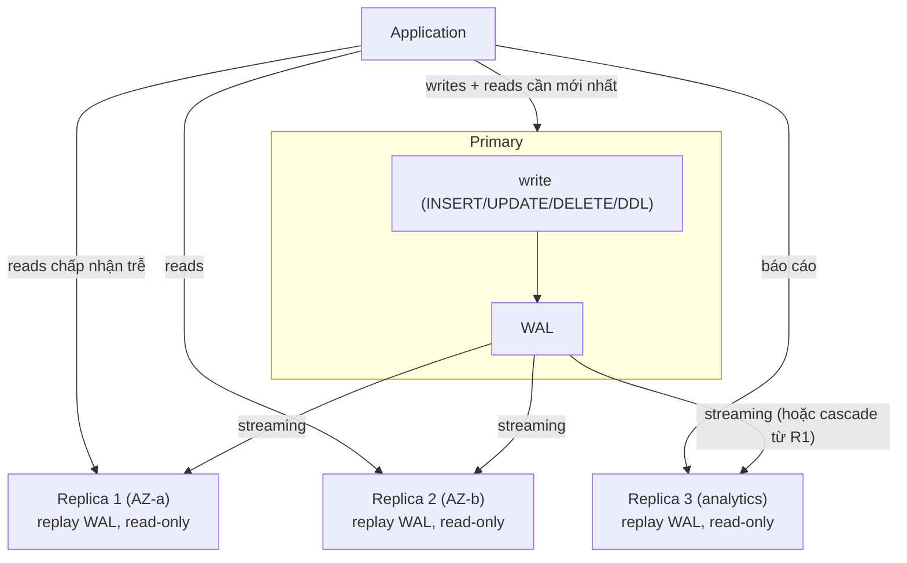
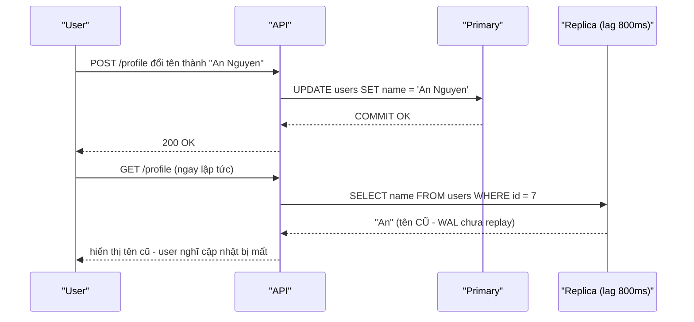

# PART 26 — PRIMARY–REPLICA / MASTER–SLAVE

> **Trước:** [25 — Replication](25-replication.md) · **Tiếp:** [27 — Sync vs Async Replication](27-sync-async-replication.md)
> **Độ ưu tiên:** Cao.

---

## Mục lục

1. [Thuật ngữ](#1-thuật-ngữ)
2. [Simple mental model](#2-simple-mental-model)
3. [Kiến trúc](#3-kiến-trúc)
4. [Write path](#4-write-path)
5. [Read path và routing](#5-read-path-và-routing)
6. [Consistency trong mô hình primary–replica](#6-consistency)
7. [Read-after-write problem](#7-read-after-write-problem)
8. [Monotonic read và stale read](#8-monotonic-read-và-stale-read)
9. [Failover và promotion (tổng quan)](#9-failover-và-promotion)
10. [WHAT HAPPENS IF...](#10-what-happens-if)
11. [PERFORMANCE & Capacity](#11-performance--capacity)
12. [TRADE-OFF / WHEN TO USE](#12-trade-off--when-to-use)
13. [COMMON MISUNDERSTANDINGS](#13-common-misunderstandings)
- [Concept card — khung 13 điểm](#concept-card--)
14. [INTERVIEW QUESTIONS](#14-interview-questions)
15. [KEY TAKEAWAYS](#15-key-takeaways)

---

## 1. Thuật ngữ

| Thuật ngữ | Nghĩa | Ghi chú |
|---|---|---|
| **Primary** | Node duy nhất nhận ghi | Thuật ngữ trong PostgreSQL docs |
| **Standby** | Node ở chế độ recovery liên tục, nhận WAL từ primary | Docs dùng "standby server" |
| **Replica / Read replica** | Standby dùng để phục vụ đọc | Thuật ngữ phổ biến (cloud) |
| **Hot standby** | Standby cho phép query read-only | `hot_standby = on` |
| **Master / Slave** | Thuật ngữ cũ, cộng đồng đã chuyển sang primary/standby (PostgreSQL docs bỏ từ khoảng 2020) | Vẫn gặp trong tài liệu cũ, MySQL cũ |
| **Leader / Follower** | Thuật ngữ trong hệ consensus (Raft) | Leader được **bầu**; PostgreSQL core không bầu — việc chọn primary do HA tool |
| **Writer / Reader endpoint** | Endpoint DNS của cloud (Aurora, RDS) | |

Khác biệt khái niệm quan trọng: trong PostgreSQL core, **"ai là primary" là một quyết định tĩnh do con người hoặc HA tool đưa ra** (promote), không phải kết quả của giao thức đồng thuận nội tại như Raft.

---

## 2. Simple mental model

Một **tổng đài viên duy nhất** (primary) ghi nhận mọi yêu cầu thay đổi vào sổ chính và **đọc to** từng dòng nhật ký qua loa. Nhiều **thư ký** (replicas) ở các phòng khác nghe và chép lại vào sổ của mình — hơi trễ một chút. Ai cần **tra cứu** có thể hỏi bất kỳ thư ký nào (giảm tải cho tổng đài viên), nhưng thư ký có thể **chưa kịp chép** dòng mới nhất. Ai cần **thay đổi** phải gặp tổng đài viên.

---

## 3. Kiến trúc

**Cách đọc diagram (trên xuống):** Mọi ghi đi vào **primary**; primary sinh **WAL**; WAL được stream tới **mọi replica** (hoặc cascade). Application **tự quyết định** (hoặc qua proxy/driver) query nào đi đâu. Replica 3 chuyên cho analytics có thể được cấu hình khác (delay lớn, không dùng cho failover).

---

## 4. Write path

1. Application gửi ghi tới primary.
2. Primary thực thi, sinh WAL, flush khi commit (và, nếu sync replication, chờ standby xác nhận — [Chương 27](27-sync-async-replication.md)).
3. Trả commit cho client.
4. WAL được stream tới replica **bất đồng bộ** (mặc định).

**Replica không giảm tải ghi của primary** — ngược lại, mỗi replica đều phải **replay toàn bộ WAL** của primary: một replica không thể "nhận ít ghi hơn" primary. Thêm replica tăng nhẹ tải trên primary (mỗi walsender).

---

## 5. Read path và routing

### 5.1 Các cách định tuyến

| Cách | Mô tả | Ưu | Nhược |
|---|---|---|---|
| **Hai pool trong application** | Một pool tới primary, một pool tới replica (hoặc load balancer replica); code chọn pool | Kiểm soát chính xác | Mọi dev phải nhớ; lỗi dễ xảy ra |
| **Framework/ORM hỗ trợ** | Ví dụ read/write splitting theo transaction read-only | Ít code | Cần hiểu quy tắc của framework |
| **libpq multi-host + `target_session_attrs`** | `host=a,b,c target_session_attrs=read-write` (PG 10) / `primary`, `standby`, `prefer-standby`, `read-only` (PG 14) | Driver tự tìm đúng node | Không phân phối tải tinh vi |
| **Proxy** (HAProxy + health check, Pgpool-II) | Proxy biết node nào primary (qua health check/Patroni REST API) | Tách khỏi app | Thêm hop, thêm thành phần |
| **DNS / Cloud endpoint** | writer endpoint, reader endpoint | Đơn giản | DNS TTL khi failover |

PgBouncer **không** tự tách đọc/ghi (nó là pooler, không phân tích query).

### 5.2 Query nào có thể đi replica

- Đọc chấp nhận dữ liệu trễ vài trăm ms–vài giây: danh sách sản phẩm, feed, tìm kiếm, dashboard.
- Báo cáo, export.
- **Không** nên: đọc ngay sau ghi của chính người dùng đó (read-after-write), đọc để quyết định ghi (check-then-act), đọc số dư trước khi trừ tiền.

---

## 6. Consistency

- Mỗi replica tại mọi thời điểm hiển thị một **trạng thái nhất quán** của primary **trong quá khứ** (prefix của lịch sử commit) — không bao giờ thấy "nửa transaction", không bao giờ thấy transaction B mà thiếu transaction A đã commit trước B (vì replay theo thứ tự WAL).
- Nhưng **không có đảm bảo "mới nhất"**: độ trễ từ vài ms tới vài giờ (khi có sự cố).
- Các replica khác nhau có thể ở các thời điểm khác nhau.

Theo thuật ngữ [Chương 38](38-consistency.md): primary–replica async cung cấp **eventual consistency** với **consistent prefix**, và cần thêm cơ chế để có read-after-write / monotonic reads.

---

## 7. Read-after-write problem

### 7.1 Vấn đề

**Cách đọc diagram:** Ghi thành công trên primary, nhưng đọc ngay sau đó đi vào replica chưa replay tới commit đó → người dùng thấy dữ liệu cũ **của chính họ**. Đây là **read-your-writes violation**.

### 7.2 Giải pháp

| Giải pháp | Cơ chế | Trade-off |
|---|---|---|
| **Đọc từ primary sau khi ghi** (sticky primary theo user/session trong N giây) | Sau write, đánh dấu session/user; đọc trong N giây đi primary | Đơn giản; N phải > lag (lag có thể tăng đột biến) |
| **Đọc từ primary cho dữ liệu "của chính user"** | Phân loại endpoint | Tải primary tăng |
| **LSN tracking (causal token)** | Sau commit, lấy `pg_current_wal_lsn()` (hoặc LSN commit) trả về client/session; khi đọc từ replica, **chờ** tới khi `pg_last_wal_replay_lsn() >= token` (poll, hoặc PG 19 beta có lệnh `WAIT` cho standby), quá thời gian thì fallback primary | Chính xác; phức tạp hơn |
| **`synchronous_commit = remote_apply`** với replica đó là sync standby | Commit chờ replica **replay** xong → đọc replica sau đó chắc chắn thấy | Latency ghi tăng; chỉ áp cho replica sync |
| **Trả dữ liệu từ response của write / cache phía client** | Client hiển thị giá trị vừa gửi | Không cần DB, nhưng chỉ cho UI |

---

## 8. Monotonic read và stale read

### 8.1 Monotonic read violation

Load balancer phân phối các request của cùng user tới replica khác nhau:
- Request 1 → Replica A (lag 10ms) → thấy comment mới.
- Request 2 → Replica B (lag 5s) → comment **biến mất**.

Người dùng thấy dữ liệu "đi lùi". **Giải pháp:** sticky replica theo session/user (hash user_id → replica), hoặc LSN token (chỉ đọc từ replica đã replay ≥ LSN lớn nhất user từng thấy).

### 8.2 Stale read — khi nào chấp nhận được

Đọc dữ liệu cũ là **chấp nhận được** khi nghiệp vụ cho phép (số lượt xem, danh sách sản phẩm, gợi ý). **Không chấp nhận** khi quyết định dựa trên dữ liệu (kiểm tra tồn kho trước khi đặt hàng, kiểm tra số dư, kiểm tra quyền vừa bị thu hồi). Quy tắc: **mọi đọc dẫn tới ghi phải đọc từ primary, trong cùng transaction với ghi, với lock phù hợp.**

---

## 9. Failover và promotion

Khi primary chết:
1. Chọn replica có **LSN lớn nhất** (ít mất dữ liệu nhất) — hoặc sync standby.
2. **Promote**: `pg_ctl promote` / `SELECT pg_promote()` → startup process kết thúc recovery, ghi end-of-recovery record, **tăng timeline**, bắt đầu nhận ghi.
3. Các replica khác **re-point** sang primary mới (theo timeline mới — `recovery_target_timeline = latest`).
4. Application/proxy chuyển ghi sang primary mới.
5. Primary cũ nếu quay lại **không được** nhận ghi — phải được rewind và gia nhập như standby.

Chi tiết, split brain, fencing: [Chương 29](29-high-availability.md), [30](30-failover.md).

---

## 10. WHAT HAPPENS IF...

| Tình huống | Hệ quả |
|---|---|
| **Replica lag tăng lên 5 phút** | Read-after-write vi phạm nhiều; nếu dùng replica cho failover → RPO lớn; nếu routing dựa trên lag, cần loại replica khỏi pool |
| **Tất cả replica chết** | Mọi đọc dồn về primary → quá tải nếu primary không được thiết kế chịu toàn bộ tải |
| **Primary chết, async** | Promote replica → mất các transaction trong khoảng lag |
| **Write đi nhầm tới replica** | `ERROR: cannot execute INSERT in a read-only transaction` |
| **Query dài trên replica dùng cho HA** | Conflict → hủy query hoặc replay dừng → replica không còn "gần" primary → failover mất nhiều dữ liệu hơn |
| **Thêm replica để "tăng tốc ghi"** | Không có tác dụng — mỗi replica replay toàn bộ ghi |

---

## 11. PERFORMANCE & Capacity

- **Read scaling tuyến tính (gần đúng)** với số replica, cho workload đọc chia được.
- Mỗi replica cần **cùng dung lượng disk** như primary (bản sao đầy đủ) và đủ I/O để replay toàn bộ ghi **cộng** phục vụ đọc.
- **Cache khác nhau:** mỗi replica có cache riêng; phân vùng traffic đọc theo "chủ đề" (ví dụ replica A cho catalog, replica B cho order history) giúp cache hiệu quả hơn.
- **Failover capacity:** primary mới phải chịu được toàn bộ tải ghi + phần đọc bắt buộc; các replica còn lại chịu phần đọc của replica đã promote.

---

## 12. TRADE-OFF / WHEN TO USE

| Lợi ích | Chi phí |
|---|---|
| Scale đọc | Stale read, read-after-write, monotonic read phải xử lý |
| HA (failover) | Async → mất dữ liệu khi failover; sync → latency |
| Offload backup/report | Conflict với replay; hot_standby_feedback → bloat |
| Bản sao ở vùng khác | Chi phí hạ tầng ×N |

**Dùng khi:** đọc chiếm phần lớn, primary bão hòa bởi đọc, cần HA. **Không giải quyết:** ghi bão hòa (cần partition/shard/tối ưu ghi), query chậm do thiết kế (replica cũng chậm như vậy).

---

## 13. COMMON MISUNDERSTANDINGS

1. **"Read replica giúp scale write."** — Không; replica replay mọi ghi.
2. **"Replica luôn giống primary."** — Có lag, và mỗi replica lag khác nhau.
3. **"Đọc từ replica an toàn cho mọi query."** — Không cho read-after-write hay check-then-act.
4. **"Thêm replica không ảnh hưởng primary."** — Mỗi walsender tốn chút tài nguyên; hot_standby_feedback có thể gây bloat primary; sync replica thêm latency.
5. **"PostgreSQL tự failover."** — Core không có automatic failover; cần HA tool.

---

## Concept card — Primary–Replica theo khung 13 điểm

| # | Khía cạnh | Tóm tắt |
|---|---|---|
| 1 | **WHAT** | Một primary nhận mọi ghi; N replica replay WAL và phục vụ đọc read-only. |
| 2 | **WHY** | Scale đọc, HA, tách workload đọc nặng khỏi primary. |
| 3 | **HOW** | Write path qua primary + WAL streaming; read path qua routing (app pools, libpq target_session_attrs, proxy, DNS) — §4, §5. |
| 4 | **INTERNALS** | Replica hiển thị prefix nhất quán theo thứ tự WAL (replay tuần tự); promotion tăng timeline — §6, §9. |
| 5 | **EXAMPLE** | Đổi tên profile rồi đọc từ replica lag 800ms thấy tên cũ — §7.1. |
| 6 | **WHAT HAPPENS IF** | Lag tăng, mọi replica chết, primary chết khi async, ghi nhầm vào replica — §10. |
| 7 | **PERFORMANCE IMPACT** | Scale đọc gần tuyến tính; mỗi replica phải replay toàn bộ ghi và cần dung lượng đầy đủ — §11. |
| 8 | **PRODUCTION BEHAVIOR** | Stale read, vi phạm read-after-write/monotonic read, health check loại replica lag. |
| 9 | **TRADE-OFF** | Scale đọc + HA ↔ consistency yếu hơn, routing phức tạp, chi phí ×N — §12. |
| 10 | **WHEN TO USE / NOT** | Dùng khi đọc chiếm phần lớn và primary bão hòa vì đọc; không giải quyết ghi bão hòa hay query tệ — §12. |
| 11 | **MISUNDERSTANDINGS** | "Replica scale write", "replica luôn giống primary", "PostgreSQL tự failover" — §13. |
| 12 | **INTERVIEW** | Read-after-write, routing cho e-commerce — §14. |
| 13 | **KEY TAKEAWAYS** | Mọi đọc dẫn tới quyết định ghi → primary, cùng transaction — §15. |

---

## 14. INTERVIEW QUESTIONS

**Q1. Mô tả kiến trúc primary–replica và luồng ghi/đọc.**
- *Short:* Primary nhận ghi, sinh WAL, stream tới replica; replica replay và phục vụ đọc read-only; routing ở app/proxy/driver.

**Q2. Read-after-write problem là gì? Giải quyết thế nào?**
- *Short:* Đọc từ replica chưa replay write vừa commit. Sticky primary sau write, LSN token + chờ replay, remote_apply, đọc primary cho dữ liệu của user.

**Q3. Replica có trả dữ liệu cũ không? Khi nào chấp nhận được?**
- *Short:* Có; chấp nhận cho dữ liệu không dùng để ra quyết định ghi.

**Q4. Tại sao replica không scale write?**
- *Short:* Mỗi replica phải replay toàn bộ WAL; ghi vẫn chỉ đi một primary.

**Q5. (Senior) Thiết kế routing cho e-commerce: catalog, giỏ hàng, checkout, lịch sử đơn.**
- *Short:* Catalog → replica; giỏ hàng/checkout → primary (transaction, lock); lịch sử đơn → replica với sticky primary sau khi đặt đơn hoặc LSN token.

---

## 15. KEY TAKEAWAYS

1. **Một primary nhận ghi**, N replica replay WAL và phục vụ đọc.
2. Replica hiển thị **prefix nhất quán** của lịch sử primary, **trễ** một khoảng không cố định.
3. **Read-after-write** và **monotonic read** không được đảm bảo sẵn → sticky routing, LSN token, remote_apply.
4. Mọi đọc dẫn tới quyết định ghi → primary, cùng transaction.
5. Replica scale đọc, **không** scale ghi.
6. Promotion tăng timeline; primary cũ phải được rewind trước khi quay lại.

---

## Nguồn tham khảo

- PostgreSQL Docs — *High Availability, Load Balancing, and Replication*: https://www.postgresql.org/docs/current/high-availability.html
- PostgreSQL Docs — *libpq Connection Strings* (`target_session_attrs`, multiple hosts): https://www.postgresql.org/docs/current/libpq-connect.html
- PostgreSQL Docs — *System Administration Functions* (`pg_promote`, `pg_last_wal_replay_lsn`).
- Martin Kleppmann, *Designing Data-Intensive Applications*, chương 5 (Replication — reading your own writes, monotonic reads).
