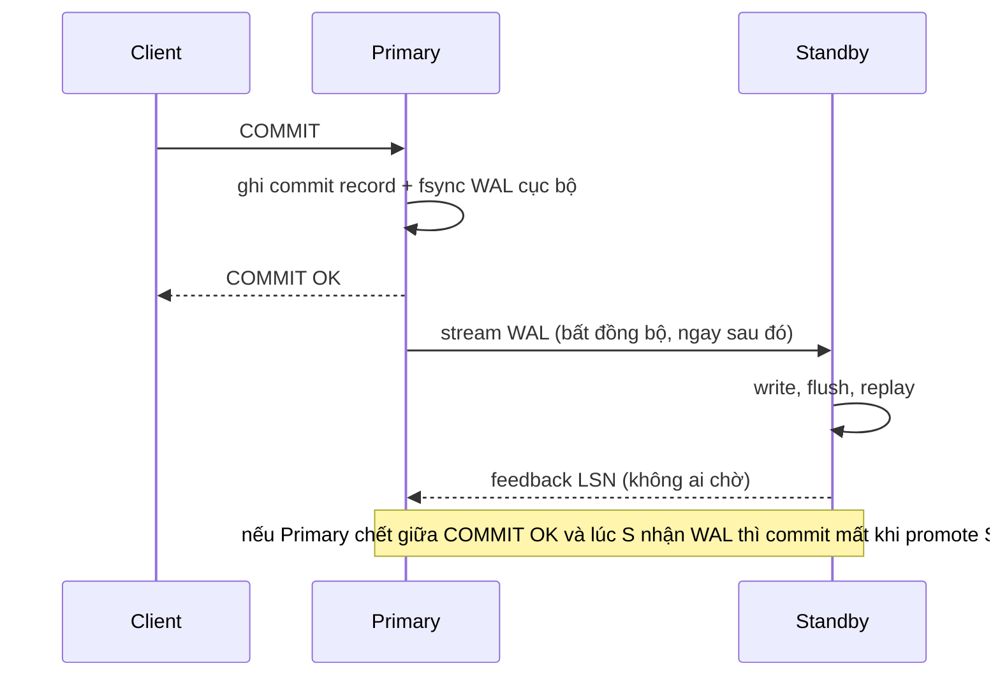
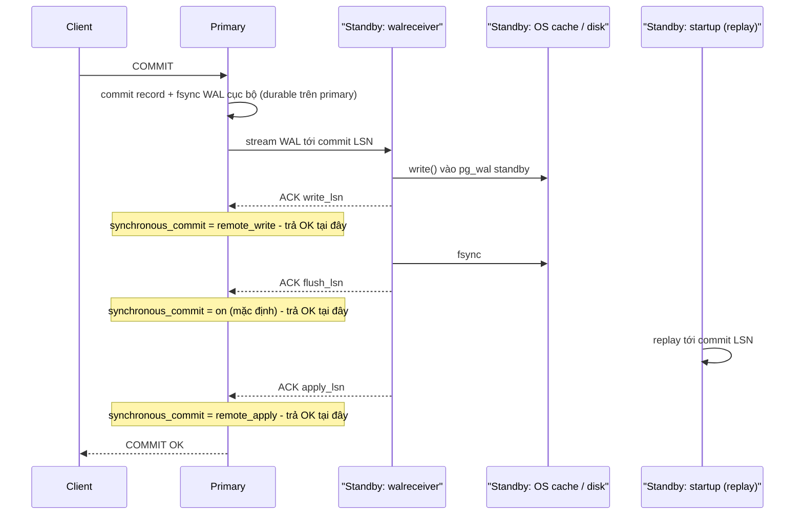

# PART 27 — SYNCHRONOUS VS ASYNCHRONOUS REPLICATION

> **Trước:** [26 — Primary–Replica](26-primary-replica.md) · **Tiếp:** [28 — Replication Lag](28-replication-lag.md)

---

## Mục lục

1. [Simple mental model](#1-simple-mental-model)
2. [WHAT & WHY](#2-what--why)
3. [HOW — Asynchronous](#3-how--asynchronous)
4. [HOW — Synchronous và các mức synchronous_commit](#4-how--synchronous)
5. [INTERNALS — commit chờ ở đâu](#5-internals--commit-chờ-ở-đâu)
6. [synchronous_standby_names: FIRST và ANY (quorum)](#6-synchronous_standby_names)
7. [So sánh: latency, durability, availability, RPO, RTO](#7-so-sánh)
8. [WHAT HAPPENS IF...](#8-what-happens-if)
9. [PRODUCTION BEHAVIOR & thiết kế](#9-production-behavior--thiết-kế)
10. [COMMON MISUNDERSTANDINGS](#10-common-misunderstandings)
- [Concept card — khung 13 điểm](#concept-card--)
11. [INTERVIEW QUESTIONS](#11-interview-questions)
12. [KEY TAKEAWAYS](#12-key-takeaways)

---

## 1. Simple mental model

- **Async:** bạn gửi thư bảo đảm, nhân viên bưu điện nói "đã nhận" ngay khi thư nằm trên quầy — thư tới nơi sau. Nếu bưu điện cháy trước khi thư được chuyển đi, thư mất dù bạn đã có biên nhận.
- **Sync:** nhân viên chỉ đưa biên nhận **sau khi** chi nhánh nhận thư gọi điện xác nhận "đã nhận" (hoặc "đã cất vào két", hoặc "đã phân phát" — tùy mức). Chậm hơn; và nếu chi nhánh không nghe máy, bạn **đứng chờ mãi**.

---

## 2. WHAT & WHY

- **Asynchronous replication:** primary báo COMMIT cho client **không chờ** standby. Mặc định PostgreSQL.
- **Synchronous replication:** primary báo COMMIT **chỉ sau khi** một (hoặc một số) standby xác nhận đã nhận WAL tới commit record, ở mức độ quy định bởi `synchronous_commit`.

**WHY sync:** async có **cửa sổ mất dữ liệu**: commit đã báo OK cho client, primary chết trước khi WAL tới standby, promote standby → commit đó **không tồn tại** trên primary mới. Với hệ thống tài chính, mất một giao dịch đã xác nhận là không chấp nhận được → cần **RPO = 0** → sync.

**WHY không luôn sync:** thêm **network round-trip + fsync ở standby** vào mọi commit; và nếu standby sync không phản hồi, **commit treo** → hy sinh availability.

---

## 3. HOW — Asynchronous



**Cách đọc diagram:** Client nhận OK ngay sau fsync cục bộ. Việc gửi WAL diễn ra song song/sau đó. Cửa sổ rủi ro = **replication lag** tại thời điểm primary chết (thường vài ms, có thể lớn khi có sự cố).

---

## 4. HOW — Synchronous

Kích hoạt khi `synchronous_standby_names` không rỗng **và** `synchronous_commit` ở mức `remote_write`, `on`, hoặc `remote_apply`.



**Cách đọc diagram:** Ba điểm xác nhận khả dĩ trên standby, tương ứng ba mức:

| `synchronous_commit` | Primary chờ | Đảm bảo | Không đảm bảo |
|---|---|---|---|
| `off` | Không chờ gì (kể cả fsync local) | — | Có thể mất commit gần nhất kể cả không failover |
| `local` | Fsync local | Durable trên primary | Standby |
| `remote_write` | Local fsync + standby đã **write** vào OS | Sống sót nếu **primary** chết (standby process sống) | Mất nếu primary chết **và** OS standby crash cùng lúc |
| `on` (mặc định) | Local fsync + standby đã **flush** | Commit có trên disk của ≥ 1 standby → **RPO = 0** khi failover sang standby đó | Standby có thể chưa **thấy** (chưa replay) → đọc từ standby có thể chưa thấy commit |
| `remote_apply` | Local fsync + standby đã **replay** | Như `on` + **đọc từ standby ngay sau commit sẽ thấy dữ liệu** (read-your-writes trên standby) | Latency cao nhất |

`synchronous_commit` đặt được **theo transaction/session/role**: hệ thống có thể dùng sync cho giao dịch tiền và `local`/`off` cho log/analytics trong cùng database.

---

## 5. INTERNALS — commit chờ ở đâu

Nhắc lại thứ tự commit ([Chương 09 §7](09-transaction.md#7-commit-từ-bên-trong)):

1. Ghi commit record + **fsync local**.
2. Đánh dấu CLOG committed.
3. **`SyncRepWaitForLSN`** — backend vào hàng đợi sync rep, ngủ tới khi walsender nhận ACK đủ điều kiện rồi đánh thức.
4. Gỡ khỏi ProcArray (transaction **visible** với người khác).
5. Trả OK.

**Hệ quả tinh tế:**
- Trong lúc chờ (bước 3), transaction **đã durable trên primary** nhưng **chưa visible** với session khác trên primary.
- Nếu client **hủy** (cancel/timeout) lúc đang chờ: PostgreSQL trả `WARNING: canceling wait for synchronous replication due to user request — DETAIL: The transaction has already committed locally, but might not have been replicated to the standby.` → transaction **đã commit** (và giờ visible) dù chưa tới standby.
- Nếu **primary crash** lúc đang chờ và **khởi động lại** (không failover): recovery replay commit record → transaction **committed và visible** trên primary, dù standby có thể chưa có. Client chưa nhận OK nên không có vi phạm durability với client — nhưng dữ liệu trên primary có thể **khác** với standby (nếu sau đó failover sang standby, transaction này "biến mất").
- → **Sync replication của PostgreSQL không phải 2PC**; nó đảm bảo "khi client nhận OK thì standby đã có", không đảm bảo "nếu standby không có thì primary cũng không có".

---

## 6. synchronous_standby_names

```
synchronous_standby_names = 'FIRST 1 (s1, s2, s3)'   -- priority: chờ s1; nếu s1 không kết nối thì s2...
synchronous_standby_names = 'ANY 2 (s1, s2, s3)'     -- quorum (PG 10+): chờ bất kỳ 2 trong 3
synchronous_standby_names = 's1, s2'                  -- cú pháp cũ = FIRST 1 (s1, s2)
synchronous_standby_names = '*'                        -- bất kỳ standby nào
```

Tên khớp với `application_name` trong `primary_conninfo` của standby. `pg_stat_replication.sync_state`: `sync`, `potential`, `quorum`, `async`.

| | FIRST n (priority) | ANY n (quorum) |
|---|---|---|
| Chờ | n standby có ưu tiên cao nhất đang kết nối | n standby **bất kỳ** trả lời nhanh nhất |
| Latency | Theo standby ưu tiên (có thể chậm) | Theo standby nhanh thứ n → thấp hơn, ổn định hơn |
| Khi một standby chậm/chết | Chuyển sang ứng viên tiếp theo (nếu còn) | Không ảnh hưởng nếu vẫn đủ n |
| Failover | Biết chính xác standby nào chắc chắn có dữ liệu | Phải chọn standby có LSN cao nhất trong nhóm (ít nhất một trong mọi tập n có dữ liệu) |

---

## 7. So sánh

| Tiêu chí | Async | Sync (`on`, 1 standby) | Sync quorum (`ANY 1` trong 2+) |
|---|---|---|---|
| **Latency commit** | Fsync local | Fsync local + RTT + fsync standby | Như sync nhưng theo standby nhanh nhất |
| **Durability khi mất primary** | Có thể mất commit trong khoảng lag | Không mất commit đã báo OK | Không mất |
| **Availability ghi khi standby lỗi** | Không ảnh hưởng | **Commit treo** tới khi standby về hoặc đổi cấu hình | Không ảnh hưởng nếu còn đủ standby |
| **Data loss khi failover** | Có thể (≤ lag) | 0 (nếu promote đúng standby sync) | 0 (nếu promote standby có LSN cao nhất) |
| **RPO** | Giây (lag) | 0 | 0 |
| **RTO** | Thời gian phát hiện + promote | Như async | Như async |

**Latency thực tế:** cùng AZ ~0.2–0.5ms RTT; khác AZ cùng region ~1–2ms; khác region 20–150ms. Sync qua region → mỗi commit +100ms → thường không chấp nhận được cho OLTP; thiết kế phổ biến: **sync trong region (khác AZ), async sang region khác**.

**RPO/RTO:**
- **RPO (Recovery Point Objective):** lượng dữ liệu tối đa chấp nhận mất (đo bằng thời gian).
- **RTO (Recovery Time Objective):** thời gian tối đa chấp nhận để khôi phục dịch vụ.
Sync giải quyết RPO; RTO phụ thuộc HA tooling (phát hiện lỗi, promote, reroute) — [Chương 29](29-high-availability.md).

---

## 8. WHAT HAPPENS IF...

| Tình huống | Hành vi |
|---|---|
| **Standby sync duy nhất chết** | Mọi commit (ở mức sync) **treo** vô thời hạn. Đọc vẫn được. Giải: HA tool (vd Patroni `synchronous_mode`) đổi `synchronous_standby_names` (có thể hạ xuống async — đánh đổi RPO lấy availability; `synchronous_mode_strict` thì không hạ), hoặc có ≥ 2 standby với ANY/FIRST. |
| **Mạng giữa primary và standby chậm** | Latency commit tăng theo. |
| **Standby sync bị lag replay** (với `on`) | Không ảnh hưởng commit (chỉ cần flush). Với `remote_apply` thì commit chậm theo replay. |
| **Client hủy lúc chờ sync** | Transaction đã commit local, visible, có thể chưa ở standby (WARNING). |
| **Đổi `synchronous_standby_names` bằng reload** | Có hiệu lực ngay; các backend đang chờ có thể được giải phóng nếu điều kiện mới thỏa. |
| **Async + primary chết + promote** | Mất các transaction chưa tới standby; primary cũ (nếu quay lại) chứa các transaction "mồ côi" → phải `pg_rewind` (và các thay đổi đó bị loại bỏ). |
| **Transaction dùng `synchronous_commit = local` trong hệ sync** | Transaction đó không được bảo vệ khi failover. |

---

## 9. PRODUCTION BEHAVIOR & thiết kế

- **Kiến trúc điển hình (RPO 0 trong region, chịu một AZ lỗi):** primary AZ-a, standby AZ-b, standby AZ-c; `synchronous_standby_names = 'ANY 1 (b, c)'`; một standby async ở region khác cho DR.
- **Theo dõi:** `pg_stat_replication.sync_state`, `write_lag/flush_lag/replay_lag`; wait event `IPC:SyncRep` trên backend (đang chờ standby) — nhiều backend ở trạng thái này = standby chậm/chết.
- **Không đặt sync mà chỉ có một standby** nếu không có automation xử lý khi standby chết — primary sẽ "đứng" khi standby bảo trì.
- **Test failover định kỳ** — kiểm chứng RPO/RTO thực tế.

---

## 10. COMMON MISUNDERSTANDINGS

1. **"Sync replication nghĩa là replica luôn đọc được dữ liệu mới nhất."** — Chỉ với `remote_apply`; với `on`, standby đã flush nhưng có thể chưa replay.
2. **"Sync replication là 2PC."** — Không; transaction commit local trước, chờ sau.
3. **"Sync = không bao giờ mất dữ liệu."** — Không mất commit **đã báo OK** khi failover đúng standby; nhưng hủy wait/transaction ở mức local có thể không được bảo vệ.
4. **"Sync làm chậm đọc."** — Chỉ ảnh hưởng latency commit.
5. **"Async replication mất nhiều dữ liệu."** — Thường chỉ vài ms; nguy hiểm khi lag tăng đột biến đúng lúc primary chết.

---

## Concept card — Sync vs Async Replication theo khung 13 điểm

| # | Khía cạnh | Tóm tắt |
|---|---|---|
| 1 | **WHAT** | Async: commit không chờ standby. Sync: commit chờ standby write/flush/apply tùy `synchronous_commit`. |
| 2 | **WHY** | Async có cửa sổ mất dữ liệu khi failover; sync đạt RPO 0 — §2. |
| 3 | **HOW** | Walsender nhận ACK write/flush/apply và đánh thức backend đang chờ — §3, §4. |
| 4 | **INTERNALS** | `SyncRepWaitForLSN` sau khi commit local và trước khi gỡ ProcArray; FIRST/ANY quorum — §5, §6. |
| 5 | **EXAMPLE** | Primary AZ-a + standby AZ-b/c với `ANY 1` — §9. |
| 6 | **WHAT HAPPENS IF** | Standby sync duy nhất chết → commit treo; client hủy lúc chờ → đã commit local — §8. |
| 7 | **PERFORMANCE IMPACT** | Latency commit + RTT + fsync standby; cross-region +20–150ms — §7. |
| 8 | **PRODUCTION BEHAVIOR** | Wait event `IPC:SyncRep`, `sync_state` trong `pg_stat_replication`. |
| 9 | **TRADE-OFF** | Latency + availability ghi ↔ durability (RPO) — §7. |
| 10 | **WHEN TO USE / NOT** | Sync quorum trong region cho dữ liệu tiền; async cross-region; có thể hạ mức theo transaction cho dữ liệu kém quan trọng. |
| 11 | **MISUNDERSTANDINGS** | "Sync = đọc replica luôn mới", "sync = 2PC" — §10. |
| 12 | **INTERVIEW** | So sánh, mức synchronous_commit, RPO/RTO — §11. |
| 13 | **KEY TAKEAWAYS** | Sync giải RPO; RTO là việc của HA tooling — §12. |

---

## 11. INTERVIEW QUESTIONS

**Q1. So sánh sync và async replication.**
- *Short:* Async: commit không chờ standby, latency thấp, có thể mất dữ liệu khi failover. Sync: commit chờ standby xác nhận (write/flush/apply), RPO 0, latency cao hơn, commit treo nếu standby sync không có.
- *Follow-up:* Các mức synchronous_commit? ANY vs FIRST?

**Q2. Với synchronous_commit = on, đọc từ standby ngay sau commit có thấy dữ liệu không?**
- *Short:* Không đảm bảo — standby đã flush nhưng có thể chưa replay; cần remote_apply.

**Q3. Chuyện gì xảy ra khi standby sync duy nhất chết?**
- *Short:* Commit treo; cần HA tool đổi cấu hình hoặc nhiều standby với quorum.

**Q4. RPO và RTO là gì? Sync ảnh hưởng cái nào?**
- *Short:* RPO: dữ liệu mất tối đa; RTO: thời gian khôi phục. Sync giảm RPO về 0; RTO phụ thuộc phát hiện lỗi + promote + reroute.

**Q5. (Senior) Thiết kế replication cho hệ thanh toán multi-AZ, có DR ở region khác.**
- *Short:* Sync quorum trong region (ANY 1 of 2 AZ khác), async cross-region, HA tool với fencing, synchronous_commit mặc định on, giảm cho dữ liệu không quan trọng.

---

## 12. KEY TAKEAWAYS

1. Async: OK sau fsync local; cửa sổ mất dữ liệu = lag khi primary chết.
2. Sync: OK sau khi standby **write** (`remote_write`), **flush** (`on`), hoặc **replay** (`remote_apply`).
3. Commit chờ **sau** khi đã commit local, **trước** khi visible — không phải 2PC.
4. `FIRST n` (priority) vs `ANY n` (quorum, PG 10+): quorum ổn định latency và chịu lỗi tốt hơn.
5. Standby sync duy nhất chết → **commit treo** — cần nhiều standby hoặc automation.
6. Sync giải RPO; RTO là chuyện của HA tooling. Có thể chọn mức sync theo từng transaction.

---

## Nguồn tham khảo

- PostgreSQL Docs — *Synchronous Replication*: https://www.postgresql.org/docs/current/warm-standby.html#SYNCHRONOUS-REPLICATION
- PostgreSQL Docs — *synchronous_commit*, *synchronous_standby_names*: https://www.postgresql.org/docs/current/runtime-config-replication.html
- PostgreSQL source: `src/backend/replication/syncrep.c`.
- Patroni Docs — *Replication modes* (synchronous_mode, synchronous_mode_strict).
