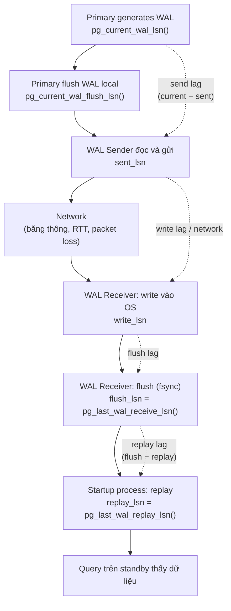
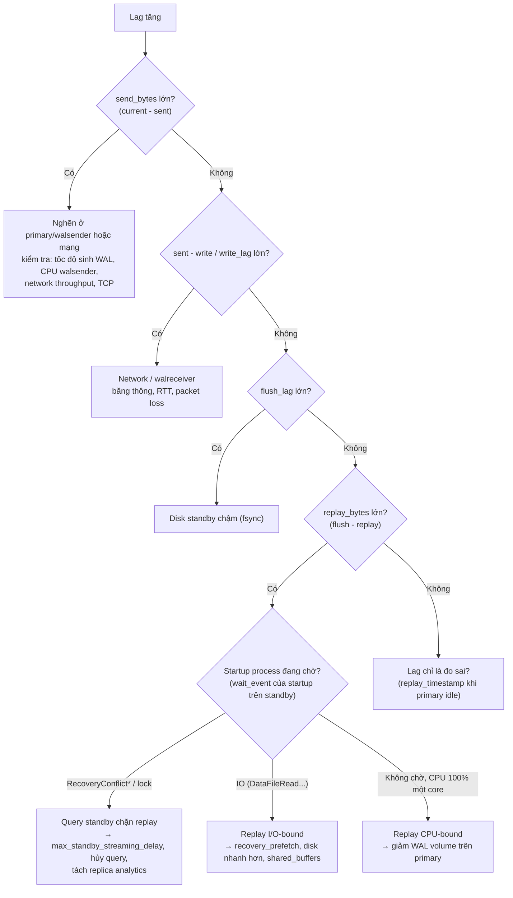

# PART 28 — REPLICATION LAG

> **Trước:** [27 — Sync vs Async](27-sync-async-replication.md) · **Tiếp:** [29 — High Availability](29-high-availability.md)

---

## Mục lục

1. [Simple mental model](#1-simple-mental-model)
2. [WHAT — Replication lag là gì](#2-what)
3. [HOW — Toàn bộ pipeline và các loại lag](#3-how--toàn-bộ-pipeline)
4. [INTERNALS — Đo lag: bytes, time, và bẫy](#4-internals--đo-lag)
5. [Nguyên nhân theo từng chặng](#5-nguyên-nhân-theo-từng-chặng)
6. [Ảnh hưởng production](#6-ảnh-hưởng-production)
7. [Logic chẩn đoán](#7-logic-chẩn-đoán)
8. [Khắc phục theo nguyên nhân](#8-khắc-phục-theo-nguyên-nhân)
9. [Delayed replica — lag có chủ đích](#9-delayed-replica)
10. [Lag trong logical replication](#10-lag-trong-logical-replication)
11. [COMMON MISUNDERSTANDINGS](#11-common-misunderstandings)
- [Concept card — khung 13 điểm](#concept-card--)
12. [INTERVIEW QUESTIONS](#12-interview-questions)
13. [KEY TAKEAWAYS](#13-key-takeaways)

---

## 1. Simple mental model

Một dây chuyền chuyển hàng từ kho A sang kho B qua bốn trạm: **đóng gói → xe chở → nhận hàng → xếp lên kệ**. Hàng "tới nơi" chỉ khi đã lên kệ. Kệ ở kho B trống không có nghĩa xe chậm — có thể người xếp kệ đang bận (replay chậm), hoặc hàng chưa rời kho A. **Lag** là khoảng cách giữa kho A và kệ kho B; muốn sửa phải biết **trạm nào** tắc.

---

## 2. WHAT

**Replication lag** = khoảng cách giữa **trạng thái primary** và **trạng thái standby**, đo bằng:
- **Bytes WAL** (LSN diff) — "còn bao nhiêu WAL chưa tới/chưa áp dụng";
- **Thời gian** — "standby đang ở trạng thái của primary cách đây bao lâu".

Lag luôn tồn tại (ít nhất vài ms với async). Câu hỏi là nó **bao nhiêu**, **ổn định không**, và **nằm ở chặng nào**.

---

## 3. HOW — Toàn bộ pipeline



**Cách đọc diagram (trên xuống):**

1. **Generate → Flush (primary):** WAL chỉ được gửi khi đã flush trên primary.
2. **Flush → Sent:** walsender đọc và gửi. Chậm khi walsender bị nghẽn (CPU, đọc WAL từ disk vì không còn trong cache, TCP buffer đầy do mạng/standby chậm nhận).
3. **Sent → Write (network):** truyền qua mạng + walreceiver nhận và `write()`.
4. **Write → Flush:** fsync trên standby — chậm nếu disk standby chậm.
5. **Flush → Replay:** startup process áp dụng — chậm nếu replay nặng (random I/O), CPU-bound (single-threaded), hoặc **bị chặn bởi recovery conflict**.
6. Chỉ sau **replay**, query trên standby mới thấy dữ liệu.

| Loại lag | Đo | Ý nghĩa |
|---|---|---|
| **Send lag** | `pg_current_wal_lsn() − sent_lsn` | WAL chưa rời primary |
| **Write lag** | `write_lag` (thời gian) / `sent_lsn − write_lsn` | Network + nhận |
| **Flush lag** | `flush_lag` | + fsync standby — quan trọng cho durability (sync `on`) |
| **Replay lag** | `replay_lag` / `flush_lsn − replay_lsn` | Quan trọng cho **stale read** và thời gian promote |

---

## 4. INTERNALS — Đo lag

### 4.1 Theo bytes (trên primary)

```sql
SELECT application_name,
       pg_wal_lsn_diff(pg_current_wal_lsn(), sent_lsn)   AS send_bytes,
       pg_wal_lsn_diff(sent_lsn, write_lsn)              AS write_bytes,
       pg_wal_lsn_diff(write_lsn, flush_lsn)             AS flush_bytes,
       pg_wal_lsn_diff(flush_lsn, replay_lsn)            AS replay_bytes,
       write_lag, flush_lag, replay_lag
FROM pg_stat_replication;
```

### 4.2 Theo thời gian — `write_lag`, `flush_lag`, `replay_lag` (PG 10+)

Primary ghi nhận **thời điểm** flush local của các LSN; khi standby báo đã write/flush/replay tới LSN đó, primary tính khoảng thời gian. Đây là **thời gian một commit gần đây cần để đi hết chặng**, không phải "standby cũ bao nhiêu giây". Nếu primary không có ghi mới, các giá trị này có thể giữ giá trị cũ hoặc NULL.

### 4.3 Trên standby

```sql
SELECT now() - pg_last_xact_replay_timestamp() AS replay_delay;
```

**Bẫy:** `pg_last_xact_replay_timestamp()` là **thời điểm commit (trên primary) của transaction cuối cùng đã replay**. Nếu primary **không ghi gì** trong 10 phút, giá trị này là 10 phút trước → "lag 10 phút" dù standby đã bắt kịp hoàn toàn. Cách đúng:
- So LSN (`pg_last_wal_receive_lsn()` = `pg_last_wal_replay_lsn()` và bằng LSN primary → bắt kịp).
- **Heartbeat table**: một job ghi `UPDATE heartbeat SET ts = now()` trên primary mỗi giây; trên standby, `now() - ts` là lag thực (cộng sai lệch đồng hồ).

---

## 5. Nguyên nhân theo từng chặng

### 5.1 Phía primary / nguồn WAL

| Nguyên nhân | Cơ chế |
|---|---|
| **WAL burst** | Bulk load, `UPDATE` hàng loạt, `CREATE INDEX` (WAL cho index mới), `VACUUM FREEZE` table lớn, `ALTER TABLE` rewrite, `REPLICA IDENTITY FULL` | Sinh WAL nhanh hơn băng thông mạng/replay |
| **FPI storm sau checkpoint** | WAL tăng vọt ngay sau checkpoint ([Chương 21 §8](21-checkpoint.md#8-checkpoint-spike)) |
| **Walsender đọc WAL từ disk** | Standby tụt xa, WAL không còn trong page cache → walsender đọc disk |
| **Nhiều standby/cascade** | Mỗi walsender tốn tài nguyên; cascade thêm một chặng |

### 5.2 Network

Băng thông thấp (cross-region), RTT cao, packet loss, TLS overhead, NAT/firewall giới hạn. Ví dụ: sinh 200MB/s WAL mà link 1Gbps (~110MB/s thực) → lag tăng liên tục. Bật `wal_compression` giảm bytes.

### 5.3 Standby: write/flush

Disk standby chậm hơn primary (instance nhỏ hơn để tiết kiệm chi phí), IOPS bị chia với query đọc, cloud volume burst credit cạn.

### 5.4 Standby: replay (thường là nút thắt)

| Nguyên nhân | Cơ chế |
|---|---|
| **Replay single-threaded** | Primary có 64 core ghi song song; standby replay bằng **một** process. Workload ghi rất nặng → replay CPU-bound |
| **Random I/O khi replay** | Mỗi record cần page tương ứng; page không có trong cache → đọc disk (tuần tự hóa). `recovery_prefetch` (PG 15) prefetch block sắp cần |
| **Recovery conflict** | Replay **dừng** chờ query standby (tối đa `max_standby_streaming_delay`, mặc định 30s; −1 = chờ mãi) — [Chương 25 §5.2](25-replication.md#52-recovery-conflicts) |
| **ACCESS EXCLUSIVE lock replay** | DDL hoặc vacuum truncate trên primary → replay cần lock mà query standby đang giữ |
| **Tải đọc nặng trên standby** | Tranh CPU/I/O/buffer với startup process |
| **Transaction khổng lồ** | Một commit mang hàng GB thay đổi → replay mất thời gian tương ứng |
| **`recovery_min_apply_delay`** | Delay có chủ đích (mục 9) |

---

## 6. Ảnh hưởng production

| Ảnh hưởng | Cơ chế |
|---|---|
| **Stale read** | Đọc từ replica thấy dữ liệu cũ; read-after-write vi phạm nhiều hơn |
| **RPO khi failover (async)** | Dữ liệu chưa tới standby bị mất khi promote |
| **RTO khi failover** | Promote cần replay hết WAL đã nhận → replay lag lớn = promote lâu |
| **WAL tích lũy trên primary** | Slot giữ WAL chưa được standby xác nhận → disk primary |
| **Sync commit latency** | Với sync `on`: flush lag cộng vào mọi commit; `remote_apply`: replay lag cộng vào |
| **Health check loại replica** | Replica lag quá ngưỡng bị loại khỏi pool đọc → tải dồn replica khác/primary |

---

## 7. Logic chẩn đoán



**Cách đọc diagram (trên xuống):** So sánh các LSN (sent, write, flush, replay) để **định vị chặng** tắc; sau đó nhìn **wait event của startup process** trên standby (`SELECT wait_event_type, wait_event FROM pg_stat_activity WHERE backend_type = 'startup'`) để phân biệt: bị conflict chặn, I/O-bound, hay CPU-bound.

Thêm: tương quan thời gian với sự kiện trên primary (batch job, checkpoint, vacuum freeze, DDL) qua `pg_stat_wal`, log checkpoint, `pg_stat_statements.wal_bytes`.

---

## 8. Khắc phục theo nguyên nhân

| Nguyên nhân | Khắc phục | Trade-off |
|---|---|---|
| WAL burst từ batch | Chia batch nhỏ, rải thời gian, `synchronous_commit` không ảnh hưởng lag; giảm index trong lúc load | Batch lâu hơn |
| FPI storm | Checkpoint thưa hơn, `wal_compression` | Recovery lâu hơn, CPU |
| Mạng | Băng thông lớn hơn, `wal_compression`, đặt standby gần hơn | Chi phí |
| Disk standby | Nâng cấp ngang primary | Chi phí |
| Replay I/O-bound | `recovery_prefetch = try` (PG 15+), shared_buffers đủ, `maintenance_io_concurrency` | |
| Replay CPU-bound | Giảm WAL (HOT, bớt index, tránh no-op update, REPLICA IDENTITY hợp lý) | Thay đổi thiết kế |
| Recovery conflict | Giảm `max_standby_streaming_delay` (hủy query sớm), `hot_standby_feedback` (bloat primary), **tách replica analytics khỏi replica HA** | Mỗi lựa chọn có cái giá |
| DDL/truncate lock | Tránh DDL giờ cao điểm; `vacuum_truncate = off` cho table lớn có standby đọc | Không trả được chỗ cuối file |

---

## 9. Delayed replica

`recovery_min_apply_delay = '1h'` trên một standby: replay mỗi commit chỉ khi đã qua 1 giờ kể từ thời điểm commit trên primary. **Lag có chủ đích** để bảo vệ khỏi **lỗi con người**: `DROP TABLE` nhầm trên primary → trong 1 giờ đó, dừng replay trên delayed replica (`pg_wal_replay_pause()`), lấy dữ liệu ra. Nhanh hơn nhiều so với PITR từ backup cho database lớn. Không dùng delayed replica cho failover hay read scaling.

---

## 10. Lag trong logical replication

Pipeline dài hơn: WAL → **logical decoding** (reorder buffer, chỉ phát khi commit) → pgoutput → network → **apply worker** (DML như client thường) → commit ở subscriber.

Nguyên nhân riêng:
- **Transaction lớn:** decode chỉ gửi khi commit (trừ streaming PG 14+) → lag nhảy vọt bằng thời gian transaction đó chạy + thời gian apply.
- **Apply worker single-threaded** (parallel apply chỉ cho transaction lớn streamed, PG 16+) → workload nhiều transaction nhỏ song song trên nguồn có thể vượt khả năng apply.
- **Index ở subscriber** thiếu cho replica identity → mỗi UPDATE/DELETE seq scan ở subscriber (đặc biệt với `REPLICA IDENTITY FULL`).
- **Xung đột/lỗi apply** → subscription dừng → lag tăng vô hạn, slot giữ WAL ở nguồn.

Đo: `pg_replication_slots.confirmed_flush_lsn` vs `pg_current_wal_lsn()` (nguồn), `pg_stat_subscription` (subscriber: `latest_end_lsn`, `latest_end_time`).

---

## 11. COMMON MISUNDERSTANDINGS

1. **"Lag = network chậm."** — Thường là replay (single-threaded, conflict, I/O).
2. **"`now() - pg_last_xact_replay_timestamp()` luôn là lag."** — Sai khi primary idle.
3. **"Sync replication loại bỏ lag."** — Sync (`on`) đảm bảo flush, không đảm bảo replay; replay lag vẫn có (trừ `remote_apply`).
4. **"Tăng tài nguyên standby luôn giải quyết lag."** — Replay single-threaded; CPU nhiều core không giúp replay CPU-bound.
5. **"hot_standby_feedback giải quyết lag."** — Nó tránh hủy query do cleanup conflict (và tránh replay phải dừng vì loại conflict đó), đổi lại bloat primary; không giải quyết lag do I/O/CPU/network.

---

## Concept card — Replication Lag theo khung 13 điểm

| # | Khía cạnh | Tóm tắt |
|---|---|---|
| 1 | **WHAT** | Khoảng cách (bytes WAL hoặc thời gian) giữa trạng thái primary và standby. |
| 2 | **WHY (quan trọng)** | Quyết định stale read, RPO/RTO failover, WAL tích lũy trên primary, latency sync commit — §6. |
| 3 | **HOW** | Pipeline generate → send → network → write → flush → replay — §3. |
| 4 | **INTERNALS** | `sent/write/flush/replay_lsn`, `write_lag/flush_lag/replay_lag` (PG 10+), startup process wait events, heartbeat — §4. |
| 5 | **EXAMPLE** | Lag tăng đều mỗi đêm do batch/report — Interview §12. |
| 6 | **WHAT HAPPENS IF** | WAL burst, mạng yếu, disk standby chậm, replay bị conflict chặn — §5. |
| 7 | **PERFORMANCE IMPACT** | Replay single-threaded là nút thắt phổ biến; recovery_prefetch giúp I/O-bound. |
| 8 | **PRODUCTION BEHAVIOR** | Health check loại replica, stale read, slot giữ WAL — §6. |
| 9 | **TRADE-OFF** | hot_standby_feedback (ít hủy query) ↔ bloat primary; delay lớn (không hủy query) ↔ lag lớn — §8. |
| 10 | **WHEN TO USE / NOT** | Delayed replica có chủ đích để chống lỗi con người; không dùng nó cho failover/đọc — §9. |
| 11 | **MISUNDERSTANDINGS** | "Lag = network", "replay_timestamp luôn đúng" — §11. |
| 12 | **INTERVIEW** | Nguyên nhân lag, các loại lag — §12. |
| 13 | **KEY TAKEAWAYS** | Định vị chặng tắc bằng so sánh LSN + wait event — §13. |

---

## 12. INTERVIEW QUESTIONS

**Q1. Tại sao replication lag xảy ra?**
- *Short:* WAL phải đi qua generate → send → network → write → flush → replay; bất kỳ chặng nào chậm hơn tốc độ sinh WAL đều gây lag: WAL burst, mạng, disk standby, replay single-threaded/I/O-bound, recovery conflict.
- *Follow-up:* Làm sao biết chặng nào?

**Q2. Các loại lag trong pg_stat_replication?**
- *Short:* write_lag, flush_lag, replay_lag (thời gian); so sánh sent/write/flush/replay LSN (bytes).

**Q3. Replica có trả stale data không? Bao lâu?**
- *Short:* Có, bằng replay lag — thường ms, có thể phút/giờ khi có sự cố.

**Q4. Làm sao đo lag chính xác khi primary ít ghi?**
- *Short:* So LSN hoặc heartbeat table.

**Q5. (Senior) Replay lag tăng đều mỗi đêm lúc 2h, về 0 lúc 4h. Nguyên nhân khả dĩ?**
- *Short:* Batch job sinh WAL lớn, hoặc report dài trên standby chặn replay (conflict), hoặc vacuum freeze. Xem wait event của startup, pg_stat_wal, lịch job.

---

## 13. KEY TAKEAWAYS

1. Lag = khoảng cách **generate → sent → write → flush → replay**; mỗi chặng có số đo riêng.
2. Đo bằng bytes (LSN diff) và thời gian (`*_lag`); cẩn thận `pg_last_xact_replay_timestamp` khi idle; dùng heartbeat.
3. Nút thắt phổ biến nhất: **replay** (single-threaded, random I/O, recovery conflict), tiếp theo là WAL burst và mạng.
4. Ảnh hưởng: stale read, RPO/RTO failover, WAL tích lũy primary, latency sync commit.
5. Chẩn đoán bằng so sánh LSN + wait event của startup process + tương quan sự kiện primary.
6. Delayed replica là lag có chủ đích để chống lỗi con người.

---

## Nguồn tham khảo

- PostgreSQL Docs — *Monitoring: pg_stat_replication* (write_lag, flush_lag, replay_lag): https://www.postgresql.org/docs/current/monitoring-stats.html#MONITORING-PG-STAT-REPLICATION-VIEW
- PostgreSQL Docs — *Hot Standby: Handling Query Conflicts*: https://www.postgresql.org/docs/current/hot-standby.html
- PostgreSQL Docs — *recovery_prefetch*, *recovery_min_apply_delay*: https://www.postgresql.org/docs/current/runtime-config-wal.html
