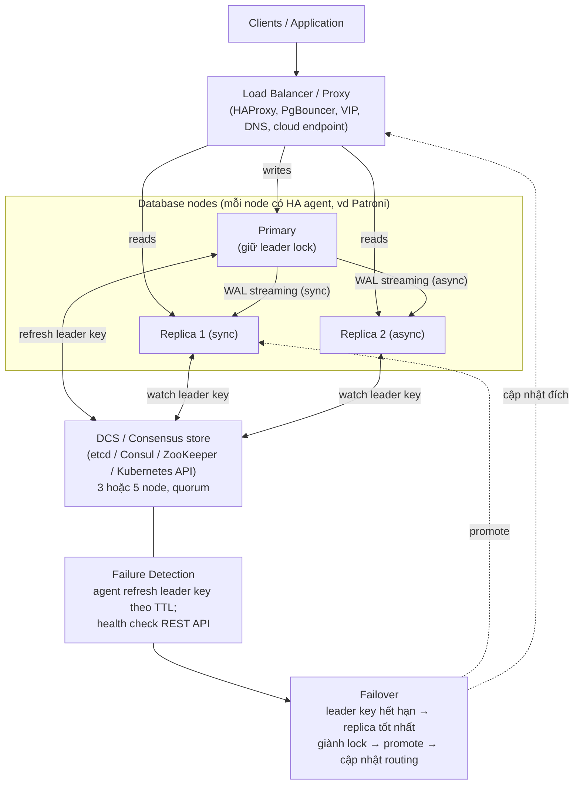
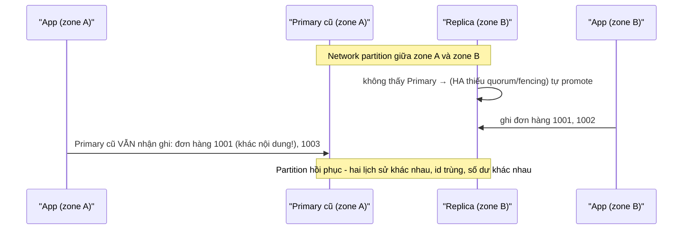

# PART 29 — HIGH AVAILABILITY

> **Trước:** [28 — Replication Lag](28-replication-lag.md) · **Tiếp:** [30 — Failover](30-failover.md)
> **Độ ưu tiên:** Rất cao.

---

## Mục lục

1. [Simple mental model](#1-simple-mental-model)
2. [WHAT — HA là gì, đo bằng gì](#2-what)
3. [WHY — PostgreSQL core không có automatic failover](#3-why)
4. [Kiến trúc HA](#4-kiến-trúc-ha)
5. [Failure Detection](#5-failure-detection)
6. [Leader Election, Quorum, Consensus (mức khái niệm)](#6-leader-election-quorum-consensus)
7. [Split Brain](#7-split-brain)
8. [Fencing](#8-fencing)
9. [Connection routing: Proxy, Load Balancer, VIP, DNS, driver](#9-connection-routing)
10. [Health check](#10-health-check)
11. [Promotion và Rejoin (tóm tắt)](#11-promotion-và-rejoin)
12. [Các công cụ và dịch vụ managed](#12-các-công-cụ-và-dịch-vụ-managed)
13. [WHAT HAPPENS IF...](#13-what-happens-if)
14. [TRADE-OFF](#14-trade-off)
15. [COMMON MISUNDERSTANDINGS](#15-common-misunderstandings)
- [Concept card — khung 13 điểm](#concept-card--)
16. [INTERVIEW QUESTIONS](#16-interview-questions)
17. [KEY TAKEAWAYS](#17-key-takeaways)

---

## 1. Simple mental model

Một đội bóng chỉ có **một thủ môn** được phép bắt bóng bằng tay (primary). Có dự bị (replica) ngồi ghế, luôn theo dõi trận đấu (replay WAL). Nếu thủ môn chấn thương, **trọng tài** (HA manager + quorum) phải: (1) xác nhận thủ môn thật sự không chơi được (không phải chỉ đang buộc dây giày — **failure detection**), (2) chọn **một** dự bị vào thay (**leader election**), (3) đảm bảo thủ môn cũ **ra khỏi sân** trước (**fencing**) — nếu không sẽ có **hai thủ môn** cùng bắt bóng (**split brain**), (4) thông báo cho cả đội chuyền về thủ môn mới (**routing**).

---

## 2. WHAT

**High Availability (HA)** là khả năng hệ thống **tiếp tục phục vụ** khi một thành phần hỏng, với thời gian gián đoạn tối thiểu.

| Availability | Downtime/năm | Downtime/tháng |
|---|---|---|
| 99% | 3.65 ngày | 7.2 giờ |
| 99.9% | 8.76 giờ | 43.8 phút |
| 99.95% | 4.38 giờ | 21.9 phút |
| 99.99% | 52.6 phút | 4.4 phút |
| 99.999% | 5.3 phút | 26 giây |

Hai chỉ số với database: **RTO** (bao lâu để phục vụ lại) và **RPO** (mất bao nhiêu dữ liệu). HA chủ yếu giảm **RTO**; replication sync giảm **RPO**.

---

## 3. WHY

PostgreSQL core cung cấp **cơ chế** (replication, promotion, timelines, pg_rewind) nhưng **không có** thành phần tự động quyết định "primary đã chết, promote node nào". Lý do: quyết định đó đòi hỏi **đồng thuận phân tán** và **fencing** — những thứ phụ thuộc môi trường (bare metal, VM, Kubernetes, cloud) và dễ sai. Cộng đồng để việc này cho các công cụ bên ngoài.

Không có HA automation: primary chết → người trực nhận cảnh báo → đánh giá → promote thủ công → đổi cấu hình app → RTO 15–60 phút (và đêm khuya có thể lâu hơn), dễ sai sót (promote nhầm node lag, quên fence primary cũ).

---

## 4. Kiến trúc HA

### 4.1 Diagram bắt buộc

**Cách đọc diagram (trên xuống):**
1. **Clients** kết nối qua một lớp **routing** — không bao giờ hard-code IP primary.
2. **Primary** nhận ghi, stream WAL tới replica.
3. Mỗi node có một **HA agent** (ví dụ Patroni). Agent của primary liên tục **gia hạn một "leader key"** (khóa có TTL — lease) trong **DCS** (distributed configuration store chạy thuật toán đồng thuận, ví dụ etcd/Raft).
4. Agent của replica **theo dõi** key đó.
5. Nếu primary chết (hoặc bị cô lập khỏi DCS), key **hết hạn** → các agent replica **tranh giành** key; chỉ một bên thành công (DCS đảm bảo tính duy nhất nhờ quorum) → bên thắng **promote** PostgreSQL của nó.
6. Routing được cập nhật (proxy health check thấy primary mới, VIP di chuyển, DNS đổi).
7. **Quan trọng:** agent của primary cũ, nếu vẫn sống nhưng **không gia hạn được key** (bị cô lập), phải **tự hạ cấp** (demote) — đây là **self-fencing**.

---

## 5. Failure Detection

### 5.1 WHAT & HOW

Xác định primary **không còn phục vụ được**. Tín hiệu:
- Agent primary không gia hạn leader key trong TTL (ví dụ Patroni `ttl = 30s`, `loop_wait = 10s`).
- Health check PostgreSQL (kết nối được không, `pg_is_in_recovery()`, query đơn giản).
- Heartbeat mạng.

### 5.2 Bài toán cơ bản: không phân biệt được "chết" và "chậm/cô lập"

Trong hệ phân tán, một node không phản hồi có thể: đã chết, đang treo (GC pause, I/O stall, swap), hoặc **vẫn sống nhưng mạng bị chia cắt**. Từ bên ngoài **không thể phân biệt chắc chắn** ([Chương 39](39-distributed-database.md)).

| Timeout ngắn | Timeout dài |
|---|---|
| Phát hiện nhanh → RTO thấp | Phát hiện chậm → RTO cao |
| **False positive**: failover khi primary chỉ tạm chậm → failover không cần thiết (mất dữ liệu async, kết nối bị ngắt, cache lạnh) | Ít failover nhầm |

Thực tế: TTL 20–30s cho phát hiện; tổng RTO (phát hiện + bầu + promote + routing + app reconnect) thường 30s–vài phút.

---

## 6. Leader Election, Quorum, Consensus

### 6.1 Leader election

Khi primary mất, **đúng một** node phải trở thành primary mới. Tiêu chí chọn (Patroni):
- Node khỏe, đang replicate;
- **LSN cao nhất** (ít mất dữ liệu nhất); trong chế độ sync, chỉ standby **sync** mới đủ điều kiện (đảm bảo RPO 0);
- Không bị gắn tag `nofailover`;
- Lag không vượt `maximum_lag_on_failover`.

### 6.2 Tại sao cần consensus store?

Nếu các node PostgreSQL tự bầu với nhau qua mạng có thể bị chia cắt, hai nhóm có thể mỗi bên bầu một primary. **Consensus** (Raft, Paxos, ZAB) đảm bảo: một quyết định (ai giữ leader key) được **đa số (quorum)** chấp nhận; hai nhóm bị chia cắt **không thể cả hai** đều có đa số.

### 6.3 Quorum

- Cụm DCS **N node** cần **⌊N/2⌋ + 1** node đồng ý. N = 3 → chịu được 1 node lỗi; N = 5 → chịu 2.
- **Số lẻ**: 4 node chịu lỗi như 3 (cần 3) — thêm node chẵn không tăng khả năng chịu lỗi.
- **2 node không đủ**: mất 1 node → không còn đa số → không bầu được (hoặc nếu cho phép bầu với 1 node → split brain).
- Đặt các node DCS ở **3 failure domain khác nhau** (3 AZ). Nếu chỉ có 2 datacenter, cần node thứ ba "trọng tài" ở nơi khác.

### 6.4 Consensus ở mức khái niệm (Raft)

Raft: các node bầu **leader** có nhiệm kỳ (term); leader nhận ghi, **replicate log** tới follower; một entry được coi là commit khi **đa số** đã ghi. Leader mất liên lạc với đa số → không commit được gì → nhóm đa số bầu leader mới với term lớn hơn. Chi tiết: [Chương 39](39-distributed-database.md).

**Lưu ý:** trong kiến trúc Patroni, consensus chỉ dùng cho **metadata** (ai là leader). **Dữ liệu** PostgreSQL vẫn replicate bằng streaming replication (không phải consensus). Khác với distributed SQL (CockroachDB, YugabyteDB) nơi **mỗi ghi** đi qua Raft.

---

## 7. Split Brain

### 7.1 WHAT

**Hai (hoặc nhiều) node cùng nghĩ mình là primary và cùng nhận ghi.** Hai lịch sử dữ liệu **phân kỳ** — không có cách tự động hợp nhất (một số ghi xung đột, một số ghi chỉ tồn tại ở một bên).

### 7.2 HOW xảy ra

**Cách đọc diagram:** Replica ở zone B không thấy primary → promote. Primary cũ ở zone A **không biết** mình bị thay thế và vẫn nhận ghi từ application cùng zone. Khi mạng hồi phục: hai database có dữ liệu khác nhau cho cùng khoảng thời gian — ví dụ hai đơn hàng khác nhau cùng id 1001, tiền bị trừ ở một bên mà bên kia không biết. Phải **chọn một lịch sử** và **xử lý thủ công** các ghi của lịch sử kia.

Nguyên nhân phổ biến: HA không dùng quorum (2 node tự bầu), fencing không có/thất bại, **promote thủ công** mà không dừng primary cũ, primary cũ restart và "tự nhận" là primary (cấu hình sai), VIP không di chuyển sạch.

### 7.3 Phòng chống (nhiều lớp)

1. **Leadership dựa trên quorum + lease**: primary chỉ được làm primary khi đang giữ leader key; mất key → **tự demote** trước khi TTL hết.
2. **Fencing** (mục 8): đảm bảo primary cũ **không thể** nhận ghi.
3. **Synchronous replication** như một lớp bảo vệ tự nhiên: primary cũ bị cô lập **không thể hoàn tất commit** vì không nhận được ACK từ sync standby (commit treo) → giới hạn thiệt hại (chỉ khi mọi sync standby nằm phía bên kia partition).
4. **Routing theo trạng thái thật** (health check hỏi "anh có phải primary và giữ leader key không") thay vì cấu hình tĩnh.
5. **Không promote thủ công** mà không fence.

---

## 8. Fencing

### 8.1 WHAT

**Fencing** = biện pháp **ngăn chắc chắn** node bị coi là hỏng tiếp tục truy cập tài nguyên chung / nhận ghi. "STONITH" — *Shoot The Other Node In The Head*.

### 8.2 Các hình thức

| Hình thức | Ví dụ |
|---|---|
| **Self-fencing** | Patroni primary không gia hạn được leader key → demote PostgreSQL (restart ở chế độ read-only/standby) |
| **Watchdog** | Linux watchdog (softdog/hardware): nếu agent Patroni treo (không thể tự demote), watchdog **reset máy** trước khi TTL leader key hết |
| **Power fencing** | IPMI/iLO tắt nguồn node cũ; cloud API stop instance |
| **Network fencing** | Rút node khỏi load balancer, security group chặn traffic, di chuyển VIP |
| **Storage fencing** | Thu hồi quyền truy cập volume (SCSI reservation, detach EBS) |
| **Application-level** | Token/epoch: ghi mang "term" hiện tại; hệ thống đích từ chối term cũ |

### 8.3 Tại sao self-fencing cần watchdog

Self-fencing dựa vào agent còn chạy để demote. Nếu **agent treo** (hoặc cả máy "đóng băng" vì I/O stall rồi sống lại sau khi TTL hết), primary cũ có thể vẫn chạy như primary trong khi replica đã được promote. Watchdog là "bảo hiểm": nếu agent không "đá" watchdog kịp, kernel/hardware reset máy.

---

## 9. Connection routing

| Cơ chế | Cách hoạt động | Thời gian chuyển | Lưu ý |
|---|---|---|---|
| **HAProxy + health check** | HAProxy gọi REST API của Patroni (`/primary` trả 200 chỉ trên primary, `/replica` trên replica khỏe) | Theo chu kỳ check (vài giây) | Cần HA cho chính HAProxy (keepalived VIP) |
| **VIP (Virtual IP)** | IP di chuyển theo leader (vip-manager đọc DCS; keepalived) | Nhanh (ARP) | Chỉ trong cùng L2 network; cloud thường không hỗ trợ VIP truyền thống |
| **DNS** | Bản ghi DNS trỏ primary, cập nhật khi failover | Phụ thuộc **TTL** và cache client (JVM cache DNS!) | Đơn giản nhưng chậm/khó đoán |
| **libpq multi-host** | `host=db1,db2,db3 target_session_attrs=read-write` — driver thử từng host tới khi gặp primary | Khi reconnect | Không cần thành phần thêm; driver phải hỗ trợ (libpq, pgx, JDBC `targetServerType`) |
| **PgBouncer** | Pooler trỏ tới một đích; cần cập nhật cấu hình + reload khi failover (hoặc trỏ tới VIP/HAProxy) | | Thường kết hợp |
| **Kubernetes Service** | Operator (CloudNativePG) cập nhật label/endpoint của Service `-rw` | Nhanh | |
| **Cloud endpoint** | RDS/Aurora writer endpoint cập nhật DNS | ~30s+ | |

**Application cũng là một phần của HA:** connection pool phải phát hiện connection chết (TCP keepalive, validation), **retry** với backoff, xử lý lỗi transaction đang dở (không biết đã commit chưa → idempotency). Không có điều này, failover 10s của database thành outage 5 phút của application.

---

## 10. Health check

Health check tốt phải trả lời đúng câu hỏi:
- "Node này có phải **primary hợp lệ** không?" → không chỉ "PostgreSQL có chạy không" mà "có đang giữ leader key, không ở recovery" (Patroni `/primary`).
- "Replica này có **đủ tươi** để phục vụ đọc không?" → kiểm tra lag (Patroni `/replica?lag=10MB` hoặc tương tự).
- Tránh health check quá nặng (query phức tạp) hoặc quá nhẹ (chỉ TCP connect — process có thể treo mà port vẫn mở).

---

## 11. Promotion và Rejoin

- **Promotion:** `pg_promote()` / `pg_ctl promote` → kết thúc recovery, **timeline mới**, nhận ghi.
- **Rejoin primary cũ:** không thể đơn giản khởi động lại như standby vì nó có thể có WAL **sau điểm rẽ nhánh** (transaction chưa tới replica). Phải **`pg_rewind`** (tua data directory về điểm rẽ nhánh bằng cách sao chép các block đã đổi từ primary mới; yêu cầu `wal_log_hints = on` hoặc data checksums) hoặc **re-clone** (base backup mới). Các transaction "mồ côi" trên primary cũ bị loại bỏ.

Chi tiết từng bước: [Chương 30](30-failover.md).

---

## 12. Các công cụ và dịch vụ managed

| Công cụ | Mô hình |
|---|---|
| **Patroni** | Agent Python trên mỗi node + DCS (etcd/Consul/ZooKeeper/Kubernetes). Phổ biến nhất. REST API, watchdog, sync mode, pg_rewind tự động |
| **repmgr** | Công cụ quản lý replication + daemon failover (repmgrd); không có DCS consensus theo nghĩa chặt → cần witness node, dễ split brain hơn nếu cấu hình không cẩn thận |
| **pg_auto_failover** | Một **monitor** node trung tâm (PostgreSQL) quyết định; monitor là điểm cần bảo vệ |
| **CloudNativePG** | Kubernetes operator; dùng Kubernetes API làm nguồn sự thật; tích hợp backup, fencing qua K8s |
| **Stolon** | Kubernetes-oriented, keeper/sentinel/proxy (ít phát triển gần đây) |
| **AWS RDS Multi-AZ (instance)** | Standby ở AZ khác nhận replication **đồng bộ ở tầng lưu trữ**; standby **không phục vụ đọc**; failover tự động qua DNS (~1–2 phút) |
| **RDS Multi-AZ DB cluster** | 1 writer + 2 reader ở 3 AZ, replication kiểu semi-sync (commit khi ≥ 1 reader xác nhận) |
| **Aurora PostgreSQL** | Kiến trúc khác hẳn: **storage phân tán** 6 bản sao / 3 AZ, ghi quorum 4/6; compute node không ship data page — failover chỉ là đổi compute (thường < 30s) |
| **Cloud SQL, Azure Flexible Server...** | HA đồng bộ tới standby zone khác, failover tự động |

---

## 13. WHAT HAPPENS IF...

| Tình huống | Hành vi mong đợi (với HA tốt) | Nếu HA kém |
|---|---|---|
| **Primary crash (process)** | Agent thử restart PostgreSQL tại chỗ hoặc failover | Downtime tới khi người can thiệp |
| **Primary mất mạng tới DCS nhưng vẫn phục vụ app cùng zone** | Primary tự demote (mất leader key); replica phía đa số được promote | **Split brain** |
| **DCS mất quorum (2/3 node etcd chết)** | Không ai giữ/đổi được leader key → Patroni primary **demote** (mặc định, trừ khi bật failsafe mode) → **toàn bộ read-only** | — (thiết kế DCS phải HA tốt hơn database) |
| **Replica sync chết (sync mode)** | Patroni đổi sync standby sang replica khác hoặc (không strict) hạ async | Commit treo |
| **Failover khi replica lag lớn (async)** | Chọn replica LSN cao nhất; nếu vượt `maximum_lag_on_failover` thì không failover tự động | Mất nhiều dữ liệu |
| **Primary cũ quay lại** | Agent phát hiện không giữ leader → pg_rewind → gia nhập làm standby | Hai primary |
| **Network flapping** | Timeout đủ lớn + không failover liên tục (cooldown) | Failover qua lại liên tục |
| **HAProxy là single point of failure** | HAProxy có HA riêng (2 instance + VIP) | App mất kết nối dù DB khỏe |

---

## 14. TRADE-OFF

| Quyết định | Lợi | Hại |
|---|---|---|
| Automatic failover | RTO thấp | Rủi ro failover nhầm, split brain nếu thiết kế sai |
| Manual failover | Con người kiểm soát | RTO cao |
| Timeout ngắn | Phát hiện nhanh | False positive |
| Sync replication | RPO 0, hạn chế split brain | Latency, availability ghi phụ thuộc standby |
| Nhiều replica | Chịu lỗi tốt, scale đọc | Chi phí |
| DCS 3 node đa AZ | Quorum chịu 1 AZ lỗi | Thêm hệ thống phải vận hành |
| Managed service | Không tự vận hành HA | Ít kiểm soát, chi phí, giới hạn cấu hình |

---

## 15. COMMON MISUNDERSTANDINGS

1. **"Có replica là có HA."** — Replica là **điều kiện cần**; HA còn cần phát hiện lỗi, bầu, fencing, routing, rejoin, và application xử lý reconnect.
2. **"PostgreSQL tự failover."** — Core không có; cần công cụ.
3. **"2 node là đủ cho HA tự động."** — Không có quorum → hoặc không tự động được, hoặc split brain.
4. **"Failover không mất dữ liệu."** — Async có thể mất; sync thì không (nếu promote đúng node).
5. **"Cluster = replica."** — Xem [Chương 35](35-database-cluster.md).
6. **"DNS failover là tức thì."** — TTL và cache client.

---

## Concept card — High Availability theo khung 13 điểm

| # | Khía cạnh | Tóm tắt |
|---|---|---|
| 1 | **WHAT** | Tiếp tục phục vụ khi thành phần hỏng; đo bằng availability %, RTO, RPO — §2. |
| 2 | **WHY** | PostgreSQL core không tự failover; thủ công thì RTO lớn và dễ sai — §3. |
| 3 | **HOW** | Replication + failure detection + leader election + fencing + routing + rejoin — §4. |
| 4 | **INTERNALS** | Leader key có TTL trong DCS (Raft), agent self-demote, watchdog, REST health check, timeline/pg_rewind — §5–§11. |
| 5 | **EXAMPLE** | Patroni + etcd 3 AZ + HAProxy — §4.1. |
| 6 | **WHAT HAPPENS IF** | DCS mất quorum, primary cô lập, sync standby chết, primary cũ quay lại — §13. |
| 7 | **PERFORMANCE IMPACT** | Sync replication thêm latency; health check và agent tốn tài nguyên nhỏ; failover gây cache lạnh. |
| 8 | **PRODUCTION BEHAVIOR** | RTO thực tế 30s–vài phút; application phải retry + idempotency. |
| 9 | **TRADE-OFF** | Timeout ngắn (RTO thấp) ↔ false positive; automatic ↔ rủi ro split brain nếu thiết kế sai — §14. |
| 10 | **WHEN TO USE / NOT** | Mọi production quan trọng; managed service khi không muốn tự vận hành — §12. |
| 11 | **MISUNDERSTANDINGS** | "Có replica là có HA", "2 node đủ" — §15. |
| 12 | **INTERVIEW** | Thiết kế HA, split brain, fencing, quorum — §16. |
| 13 | **KEY TAKEAWAYS** | Quorum + fencing là cốt lõi chống split brain — §17. |

---

## 16. INTERVIEW QUESTIONS

**Q1. Thiết kế HA cho PostgreSQL thế nào?**
- *Short:* Primary + ≥ 2 replica ở AZ khác, streaming replication (sync quorum trong region), HA agent (Patroni) + DCS 3–5 node đa AZ, fencing (self-demote + watchdog), routing (HAProxy health check / VIP / libpq multi-host), application retry + idempotency, backup + PITR riêng.
- *Follow-up:* Chuyện gì xảy ra nếu DCS mất quorum?

**Q2. Split brain là gì? Làm sao tránh?**
- *Short:* Hai primary cùng nhận ghi → dữ liệu phân kỳ. Tránh bằng leadership qua quorum + lease, fencing (self-demote, watchdog, STONITH), sync replication, routing theo trạng thái thật.

**Q3. Fencing là gì?**
- *Short:* Đảm bảo node cũ không thể nhận ghi: tự demote, watchdog reset, tắt nguồn, chặn mạng/storage.

**Q4. Quorum là gì? Tại sao số lẻ?**
- *Short:* Đa số (⌊N/2⌋+1) phải đồng ý; hai nhóm bị chia không thể cùng có đa số; số chẵn không tăng khả năng chịu lỗi.

**Q5. RTO của failover gồm những gì?**
- *Short:* Phát hiện (TTL) + bầu + promote (replay nốt WAL) + cập nhật routing + application reconnect/retry.

**Q6. (Senior) Tại sao synchronous replication giúp giảm thiệt hại split brain?**
- *Short:* Primary cũ bị cô lập khỏi mọi sync standby không nhận được ACK → commit treo → không có ghi "thành công" mới ở phía đó.

---

## 17. KEY TAKEAWAYS

1. HA = redundancy + failure detection + leader election + fencing + routing + rejoin + application resilience.
2. PostgreSQL core cung cấp cơ chế (replication, promote, timeline, pg_rewind); **automation là công cụ ngoài** (Patroni, CloudNativePG...).
3. Leader election cần **consensus store với quorum** (3/5 node, số lẻ, đa failure domain).
4. **Split brain** là rủi ro lớn nhất; chống bằng lease + self-fencing + watchdog + STONITH + sync replication + routing đúng.
5. Failure detection là trade-off giữa RTO và false positive.
6. Routing: HAProxy+health check, VIP, DNS (TTL), libpq multi-host, operator/cloud endpoint — và application phải retry.

---

## Nguồn tham khảo

- PostgreSQL Docs — *High Availability, Load Balancing, and Replication*, *Failover*: https://www.postgresql.org/docs/current/warm-standby-failover.html
- Patroni Documentation: https://patroni.readthedocs.io/
- CloudNativePG Documentation: https://cloudnative-pg.io/documentation/
- Diego Ongaro & John Ousterhout, *In Search of an Understandable Consensus Algorithm (Raft)*, USENIX ATC 2014.
- AWS Documentation — RDS Multi-AZ deployments, Aurora storage architecture.
