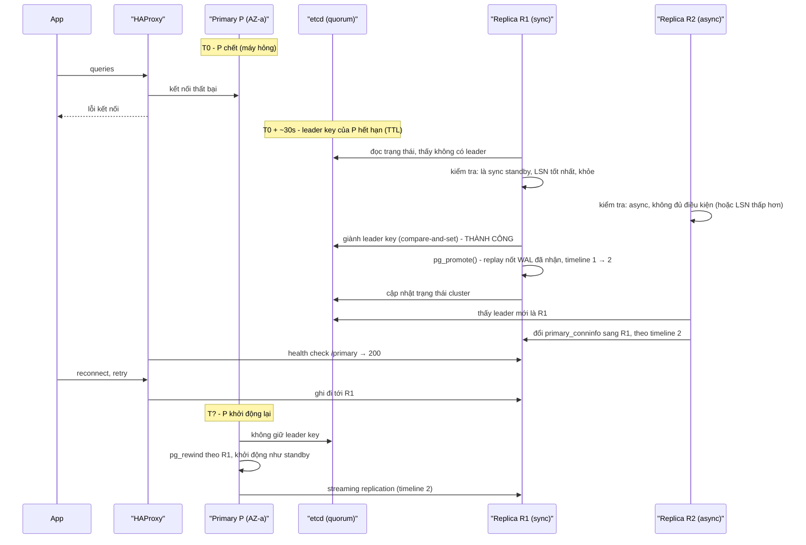
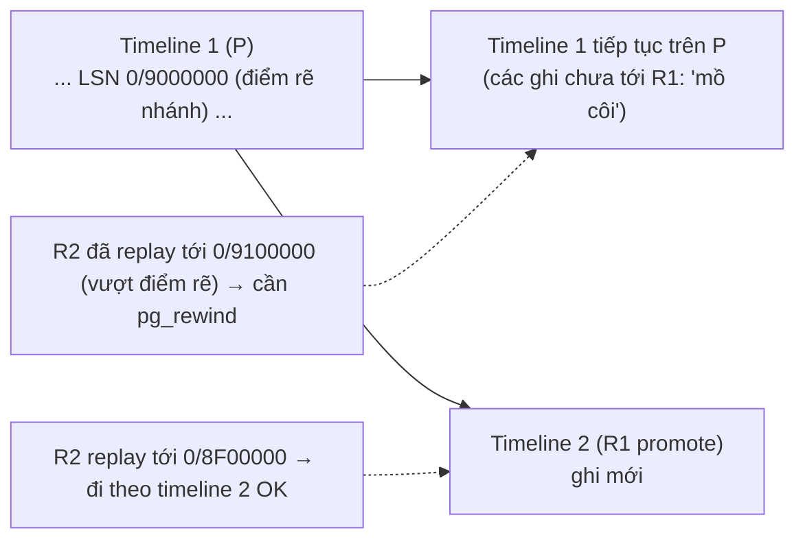
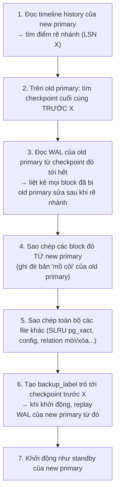
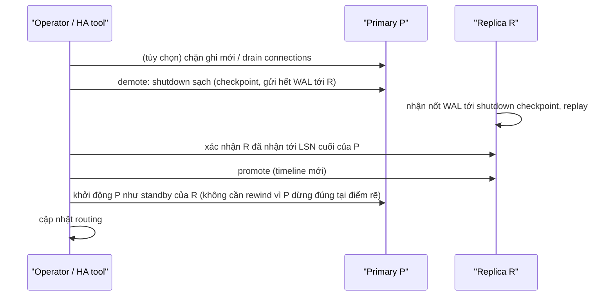

# PART 30 — FAILOVER

> **Trước:** [29 — High Availability](29-high-availability.md) · **Tiếp:** [31 — Backup & PITR](31-backup-pitr.md)
> **Độ ưu tiên:** Rất cao.

---

## Mục lục

1. [Simple mental model](#1-simple-mental-model)
2. [Failover vs Switchover](#2-failover-vs-switchover)
3. [Scenario: Primary chết — toàn bộ timeline](#3-scenario-primary-chết)
4. [Promotion từ bên trong](#4-promotion-từ-bên-trong)
5. [Các replica khác đi theo primary mới](#5-các-replica-khác-đi-theo-primary-mới)
6. [Application reconnect và "ambiguous commit"](#6-application-reconnect-và-ambiguous-commit)
7. [Old primary quay lại: chuyện gì xảy ra](#7-old-primary-quay-lại)
8. [pg_rewind hoạt động thế nào](#8-pg_rewind-hoạt-động-thế-nào)
9. [Split brain trong failover: xảy ra thế nào, tránh thế nào](#9-split-brain-trong-failover)
10. [Switchover có kiểm soát (zero data loss)](#10-switchover-có-kiểm-soát)
11. [WHAT HAPPENS IF...](#11-what-happens-if)
12. [PRODUCTION: kiểm thử failover](#12-production-kiểm-thử-failover)
13. [COMMON MISUNDERSTANDINGS](#13-common-misunderstandings)
- [Concept card — khung 13 điểm](#concept-card--)
14. [INTERVIEW QUESTIONS](#14-interview-questions)
15. [KEY TAKEAWAYS](#15-key-takeaways)

---

## 1. Simple mental model

Phi công chính (primary) bất tỉnh. Phi công phụ (replica) phải: xác nhận phi công chính thật sự không điều khiển được, **nhận quyền điều khiển**, báo cho tháp (routing) "từ giờ liên lạc với tôi". Nếu phi công chính tỉnh lại, anh ta **không được** giành lại cần lái ngay — phải được cập nhật tình hình (rewind) và ngồi ghế phụ.

---

## 2. Failover vs Switchover

| | **Failover** | **Switchover** |
|---|---|---|
| Kích hoạt | Không kế hoạch — primary hỏng | Có kế hoạch — bảo trì, nâng cấp, di chuyển |
| Primary cũ | Có thể không phản hồi | Còn sống, được hạ cấp có kiểm soát |
| Mất dữ liệu | Có thể (async) | **Không** (chờ replica bắt kịp trước khi promote) |
| Downtime ghi | Phát hiện + promote + routing | Vài giây |

---

## 3. Scenario: Primary chết

Thiết lập: Primary P (AZ-a), Replica R1 (AZ-b, sync), R2 (AZ-c, async), Patroni + etcd 3 node, HAProxy.

**Cách đọc diagram (trên xuống) — timeline và RTO:**

| Giai đoạn | Thời gian điển hình | Ghi chú |
|---|---|---|
| Primary chết → app bắt đầu lỗi | 0 | Mọi ghi thất bại từ đây |
| **Phát hiện** (TTL leader key) | 10–30s | Trade-off với false positive |
| **Bầu** | < 1s | Qua DCS |
| **Promote** | Vài giây (cộng thời gian replay WAL đã nhận chưa replay) | Replay lag lớn = promote lâu |
| **Routing cập nhật** | Chu kỳ health check (vài giây); DNS có thể lâu hơn | |
| **App reconnect** | Tùy pool/driver (retry, timeout) | Có thể là phần dài nhất nếu app không được thiết kế tốt |
| **Tổng RTO** | ~30s – vài phút | |

**RPO:** R1 là sync standby → mọi commit đã báo OK đều có trên R1 → **RPO = 0**. Nếu chỉ có async và promote R2 → mất các commit trong khoảng lag của R2.

---

## 4. Promotion từ bên trong

Khi `pg_promote()` được gọi trên standby:

1. **Dừng nhận WAL mới** (walreceiver dừng).
2. **Replay nốt** mọi WAL đã nhận (đã flush trong `pg_wal` của standby) — **quan trọng**: promote không bỏ WAL đã nhận.
3. Chọn **timeline mới** = max timeline đã biết + 1; ghi file **`00000002.history`**: "timeline 2 rẽ nhánh từ timeline 1 tại LSN X".
4. Ghi WAL record **end-of-recovery** (fast promotion — không chờ checkpoint), xóa `standby.signal`.
5. Chuyển sang chế độ bình thường: **nhận ghi**, bắt đầu cấp XID, autovacuum bắt đầu chạy (standby không chạy autovacuum).
6. Checkpoint được yêu cầu chạy nền.

Sau promotion: statistics (cumulative) trên node mới là của standby (thường không đầy đủ số liệu dead tuple) → nên theo dõi autovacuum/ANALYZE; cache của replica phản ánh workload đọc trước đó, có thể lạnh với workload ghi.

---

## 5. Các replica khác đi theo primary mới

R2 đang replicate từ P (timeline 1). Để theo R1:
- Đổi `primary_conninfo` sang R1 (Patroni tự làm; PG 13+ đổi được bằng reload, không cần restart).
- Với `recovery_target_timeline = 'latest'` (mặc định PG 12+), R2 đọc `00000002.history` từ R1, **chuyển sang timeline 2** tại điểm rẽ nhánh.
- **Điều kiện:** R2 **chưa replay vượt quá** điểm rẽ nhánh. Nếu R2 (async) đã nhận WAL của P **nhiều hơn** R1 (hiếm khi R1 là sync; có thể xảy ra với quorum/async) → R2 có lịch sử mà timeline 2 không có → không thể đi theo trực tiếp → phải **pg_rewind** R2 hoặc re-clone. (Đây là lý do HA tool chọn replica có LSN **cao nhất** để promote.)

**Cách đọc diagram:** Điểm rẽ nhánh là LSN mà R1 dừng timeline 1. Mọi node có lịch sử **tới hoặc trước** điểm đó có thể đi theo timeline 2; node có lịch sử **vượt** điểm đó chứa các thay đổi "mồ côi" phải bị tua lại.

---

## 6. Application reconnect và "ambiguous commit"

Khi primary chết giữa lúc client đang COMMIT:
- Client nhận **lỗi kết nối**, không nhận được kết quả COMMIT.
- Transaction có thể: **đã commit** (trên P, và nếu sync thì trên R1), hoặc **chưa commit**.
- Client **không thể biết** chỉ từ phía mình.

**Hệ quả:** Retry mù quáng có thể **thực hiện hai lần** (chuyển tiền hai lần). Giải pháp: **idempotency key** — mỗi thao tác nghiệp vụ mang một khóa duy nhất lưu cùng transaction (unique constraint); retry với cùng khóa → nếu đã tồn tại thì trả kết quả cũ. Với sync replication, nếu commit đã được ghi vào R1 thì sau failover, retry sẽ thấy key đã tồn tại.

Các vấn đề application khác sau failover:
- **Connection pool** giữ connection chết → cần validation/keepalive/timeout ngắn.
- **Prepared statements** mất (session mới).
- **Advisory lock** session-level mất.
- **Sequence** trên primary mới có thể "nhảy" (sequence được log theo lô 32 giá trị — [Chương 01 §6.5](01-relational-database.md#65-sequence-và-identity)) → gap trong id.
- **Cache lạnh** → latency cao tạm thời.
- **LISTEN/NOTIFY** subscriptions mất.

---

## 7. Old primary quay lại

### 7.1 Nếu có HA đúng (Patroni)

1. P khởi động (hoặc agent trên P phục hồi).
2. Agent thấy **không giữ leader key**, leader là R1.
3. Agent **không cho** PostgreSQL chạy như primary: chạy `pg_rewind` so với R1 (hoặc re-clone nếu rewind không được), cấu hình standby, khởi động như replica của R1.
4. Các transaction P đã commit **sau điểm rẽ nhánh** (async, chưa tới R1) **bị loại bỏ** trong quá trình rewind. (Nếu cần phục hồi chúng: trích từ WAL cũ của P bằng `pg_waldump` trước khi rewind — công việc forensic thủ công.)

### 7.2 Nếu không có HA / cấu hình sai

P khởi động lại **như primary** (vì không có `standby.signal`) → application nào còn trỏ tới P (DNS cache, cấu hình tĩnh, VIP chưa gỡ) **ghi vào P** trong khi các client khác ghi vào R1 → **split brain**.

---

## 8. pg_rewind hoạt động thế nào

### 8.1 WHAT & WHY

`pg_rewind` đồng bộ data directory của một server (old primary) với một server khác (new primary) **đã rẽ nhánh khỏi nó**, bằng cách chỉ sao chép **các block đã thay đổi** — nhanh hơn nhiều so với re-clone toàn bộ (TB).

### 8.2 HOW

**Cách đọc diagram:** pg_rewind không "undo" từng transaction; nó xác định **block nào** old primary đã sửa sau khi rẽ nhánh (qua WAL của chính old primary), rồi thay các block đó bằng bản của new primary. Sau đó, old primary replay WAL của new primary từ trước điểm rẽ nhánh → trở thành bản sao nhất quán của new primary.

### 8.3 Điều kiện

- Old primary phải có `wal_log_hints = on` **hoặc** data checksums (để thay đổi hint bit cũng được ghi WAL — nếu không, pg_rewind bỏ sót block chỉ đổi hint bit → corruption tinh vi).
- Old primary phải còn **WAL từ checkpoint trước điểm rẽ nhánh** tới cuối (hoặc lấy từ archive với `--restore-target-wal`, PG 13).
- Old primary phải được **shutdown sạch** trước (pg_rewind yêu cầu; PG 13 có thể tự chạy crash recovery ở single-user mode trước).

---

## 9. Split brain trong failover

### 9.1 Các con đường dẫn tới split brain

| Con đường | Mô tả |
|---|---|
| **Network partition + không có quorum** | Replica promote vì không thấy primary; primary vẫn sống phía bên kia |
| **Promote thủ công** | DBA promote replica khi primary "có vẻ chết" (thực ra chỉ treo) |
| **Primary cũ restart như primary** | Không có agent/HA cấu hình đúng |
| **Agent treo, không self-demote** | Không có watchdog |
| **Routing tĩnh** | App trỏ IP cố định vào primary cũ |

### 9.2 Phòng tránh

1. **Leader lease qua DCS có quorum** + **self-demote** khi mất lease.
2. **Watchdog** để đảm bảo demote/reset xảy ra trước khi lease hết.
3. **STONITH/fencing** hạ tầng (tắt instance, chặn mạng) cho trường hợp nghiêm trọng.
4. **Routing động** theo trạng thái thật (health check `/primary`).
5. **Synchronous replication**: primary bị cô lập khỏi sync standby không commit được.
6. **Quy trình vận hành**: không promote thủ công khi chưa fence; dùng lệnh của HA tool (`patronictl failover`) thay vì `pg_ctl promote` trực tiếp.

### 9.3 Nếu split brain đã xảy ra

1. **Dừng ghi ngay** vào một bên (chọn bên "chính" — thường bên có nhiều ghi quan trọng hơn hoặc bên có sync standby).
2. Trích các thay đổi của bên kia sau điểm rẽ nhánh (pg_waldump, logical decoding nếu có slot, so sánh dữ liệu, log application).
3. Rewind/re-clone bên bị loại.
4. **Hòa giải dữ liệu thủ công** (thường với sự tham gia của nghiệp vụ).
5. Postmortem — sửa nguyên nhân gốc.

---

## 10. Switchover có kiểm soát

Mục tiêu: đổi primary **không mất dữ liệu**, downtime ghi vài giây.

**Cách đọc diagram:** Khác failover ở chỗ primary cũ **dừng sạch** trước, đảm bảo replica có toàn bộ WAL → không có transaction mồ côi → primary cũ gia nhập làm standby mà không cần rewind. Patroni: `patronictl switchover`.

---

## 11. WHAT HAPPENS IF...

| Tình huống | Hành vi |
|---|---|
| **Replica được promote có replay lag 10 phút** | Promote phải replay 10 phút WAL trước khi nhận ghi → RTO tăng tương ứng |
| **Promote replica async có lag 5s** | Mất ~5s commit |
| **R2 đã nhận nhiều WAL hơn R1 được promote** | R2 không đi theo được timeline mới → rewind/re-clone R2 |
| **Old primary không có wal_log_hints/checksums** | pg_rewind từ chối → re-clone |
| **Old primary thiếu WAL cần cho rewind** | Dùng archive hoặc re-clone |
| **App cache DNS vĩnh viễn (JVM mặc định với security manager)** | App không bao giờ tìm thấy primary mới → phải cấu hình TTL DNS phía client |
| **Transaction dài đang chạy trên primary lúc failover** | Bị hủy; app phải retry toàn bộ |
| **Logical replication slot trên primary cũ (trước PG 17)** | Không có trên primary mới → CDC phải khởi tạo lại (snapshot lại); PG 17 failover slots giải quyết |
| **Failover liên tục do network flapping** | Mỗi lần mất dữ liệu async, cache lạnh; cần cooldown/giới hạn |

---

## 12. PRODUCTION: kiểm thử failover

- **Game day / chaos testing** định kỳ: kill primary, partition mạng, làm chậm disk — đo RTO/RPO thực tế, kiểm tra app phục hồi.
- **Switchover định kỳ** (ví dụ khi patch OS) là cách tốt để giữ quy trình "sống".
- Theo dõi: thời gian phát hiện, promote, reconnect; số lỗi app trong cửa sổ failover; dữ liệu mất (so sánh LSN).
- Runbook: các bước thủ công khi automation thất bại, kể cả xử lý split brain.

---

## 13. COMMON MISUNDERSTANDINGS

1. **"Failover luôn tự động và tức thì."** — Cần tooling; RTO thường 30s–vài phút.
2. **"Primary cũ quay lại thì tự làm replica."** — Chỉ khi HA tool xử lý (rewind); nếu không → split brain.
3. **"Promote bỏ qua WAL chưa replay."** — Promote replay nốt WAL đã nhận.
4. **"Retry sau failover luôn an toàn."** — Ambiguous commit → cần idempotency.
5. **"pg_rewind hoàn tác transaction."** — Nó sao chép block từ primary mới; thay đổi mồ côi bị ghi đè.

---

## Concept card — Failover theo khung 13 điểm

| # | Khía cạnh | Tóm tắt |
|---|---|---|
| 1 | **WHAT** | Chuyển vai trò primary sang standby khi primary hỏng (không kế hoạch); switchover là phiên bản có kế hoạch — §2. |
| 2 | **WHY** | Khôi phục khả năng ghi nhanh hơn nhiều so với sửa/khôi phục primary. |
| 3 | **HOW** | Phát hiện → bầu → promote → replica khác theo timeline mới → routing → app reconnect — §3. |
| 4 | **INTERNALS** | Promote replay nốt WAL, tạo `.history`, end-of-recovery record; pg_rewind sao chép block đã đổi — §4, §5, §8. |
| 5 | **EXAMPLE** | Primary AZ-a chết, R1 (sync) được promote — §3. |
| 6 | **WHAT HAPPENS IF** | Promote replica lag lớn, R2 vượt điểm rẽ nhánh, thiếu wal_log_hints, DNS cache — §11. |
| 7 | **PERFORMANCE IMPACT** | Cache lạnh, reconnect storm, stats reset trên node mới. |
| 8 | **PRODUCTION BEHAVIOR** | Ambiguous commit, lỗi kết nối hàng loạt, sequence nhảy số — §6. |
| 9 | **TRADE-OFF** | Tự động nhanh ↔ rủi ro failover nhầm; async RTO tốt ↔ mất dữ liệu. |
| 10 | **WHEN TO USE / NOT** | Failover khi primary thật sự hỏng; switchover cho bảo trì (không mất dữ liệu, không cần rewind) — §10. |
| 11 | **MISUNDERSTANDINGS** | "Primary cũ tự làm replica", "retry luôn an toàn" — §13. |
| 12 | **INTERVIEW** | Mô tả failover, old primary quay lại, pg_rewind — §14. |
| 13 | **KEY TAKEAWAYS** | Promote → timeline mới; rewind primary cũ; idempotency cho client — §15. |

---

## 14. INTERVIEW QUESTIONS

**Q1. Mô tả chuyện gì xảy ra khi primary chết trong hệ Patroni.**
- *Short:* Leader key hết TTL → replica đủ điều kiện (sync/LSN cao nhất) giành key → promote (replay nốt, timeline mới) → replica khác đi theo timeline mới → routing cập nhật → app reconnect.
- *Follow-up:* Mất dữ liệu không? Old primary quay lại thì sao?

**Q2. Old primary quay lại, chuyện gì xảy ra? Split brain xảy ra thế nào?**
- *Short:* Với HA đúng: agent phát hiện không phải leader, pg_rewind, gia nhập làm standby; các ghi mồ côi bị loại. Không có HA: khởi động như primary → hai primary → split brain.

**Q3. pg_rewind hoạt động thế nào? Điều kiện?**
- *Short:* Tìm điểm rẽ nhánh, đọc WAL old primary để biết block đã đổi, copy các block đó từ new primary, replay WAL new primary. Cần wal_log_hints/checksums, WAL đủ.

**Q4. Failover vs switchover?**
- *Short:* Không kế hoạch vs có kế hoạch; switchover dừng sạch primary cũ, không mất dữ liệu, không cần rewind.

**Q5. (Senior) Làm sao application xử lý đúng khi COMMIT trả lỗi kết nối trong failover?**
- *Short:* Không biết đã commit chưa → idempotency key trong cùng transaction, retry an toàn; kiểm tra trạng thái trước khi retry nếu cần.

---

## 15. KEY TAKEAWAYS

1. Failover = phát hiện → bầu (replica LSN cao nhất/sync) → **promote** (replay nốt WAL, **timeline mới**) → replica khác theo timeline → routing → app reconnect.
2. RPO phụ thuộc sync/async; RTO phụ thuộc TTL, replay lag, routing, application.
3. Commit trong lúc failover là **ambiguous** → idempotency key.
4. Old primary **phải** được rewind (`pg_rewind`, cần wal_log_hints/checksums) hoặc re-clone; transaction mồ côi bị loại.
5. Split brain đến từ partition không quorum, promote thủ công, primary cũ tự khởi động làm primary, routing tĩnh — chống bằng lease + fencing + watchdog + sync rep + routing động.
6. Switchover có kiểm soát: không mất dữ liệu, không cần rewind — dùng để luyện tập quy trình.

---

## Nguồn tham khảo

- PostgreSQL Docs — *Failover*: https://www.postgresql.org/docs/current/warm-standby-failover.html
- PostgreSQL Docs — *pg_rewind*: https://www.postgresql.org/docs/current/app-pgrewind.html
- PostgreSQL Docs — *Recovery Configuration* (`recovery_target_timeline`), *pg_promote*.
- Patroni Documentation — failover, switchover, watchdog, pg_rewind.
