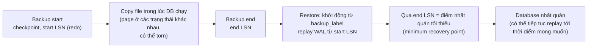
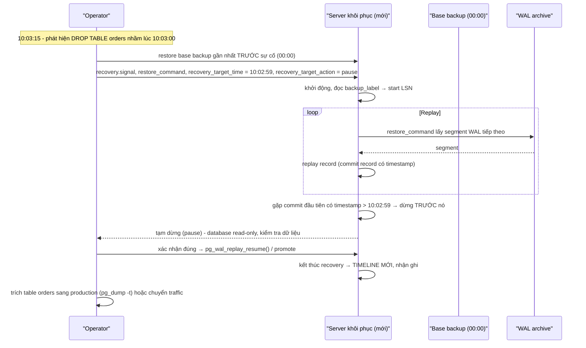
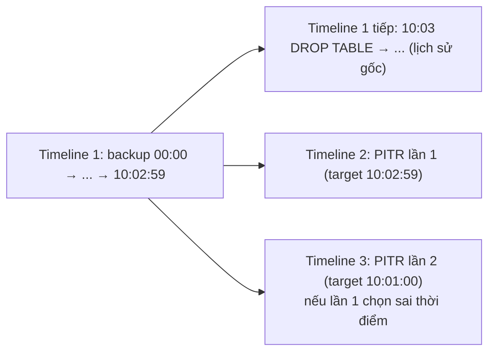

# PART 31 — BACKUP & PITR (Point-in-Time Recovery)

> **Trước:** [30 — Failover](30-failover.md) · **Tiếp:** [32 — Partitioning](32-partitioning.md)

Replication bảo vệ khỏi **mất máy**. Backup bảo vệ khỏi **mất dữ liệu** — bao gồm những thứ replication **nhân bản ngay lập tức**: `DROP TABLE` nhầm, `UPDATE` thiếu WHERE, bug application ghi rác, ransomware, corruption logic. **Replica không phải backup.**

---

## Mục lục

1. [Simple mental model](#1-simple-mental-model)
2. [RPO, RTO và mục tiêu backup](#2-rpo-rto-và-mục-tiêu-backup)
3. [Concept: Logical Backup (pg_dump)](#3-concept-logical-backup)
4. [Concept: Physical Backup (base backup)](#4-concept-physical-backup)
5. [Tại sao base backup "mờ" vẫn nhất quán: vai trò của WAL](#5-tại-sao-base-backup-mờ-vẫn-nhất-quán)
6. [WAL Archive: continuous archiving](#6-wal-archive)
7. [Concept: PITR](#7-concept-pitr)
8. [Recovery timeline](#8-recovery-timeline)
9. [Incremental backup (PG 17) và công cụ](#9-incremental-backup-và-công-cụ)
10. [So sánh các phương pháp](#10-so-sánh-các-phương-pháp)
11. [WHAT HAPPENS IF...](#11-what-happens-if)
12. [PRODUCTION: chiến lược backup](#12-production-chiến-lược-backup)
13. [COMMON MISUNDERSTANDINGS](#13-common-misunderstandings)
- [Concept card — khung 13 điểm](#concept-card--)
14. [INTERVIEW QUESTIONS](#14-interview-questions)
15. [KEY TAKEAWAYS](#15-key-takeaways)

---

## 1. Simple mental model

- **Logical backup** = **chép lại nội dung** cuốn sổ bằng tay thành văn bản (các câu lệnh tạo và điền dữ liệu). Đọc được ở bất kỳ đâu, nhưng chép lại (restore) lâu.
- **Physical backup** = **photocopy từng trang** của sổ. Nhanh, chính xác, nhưng chỉ dùng được với cùng loại sổ.
- **WAL archive** = giữ **mọi trang nhật ký** kể từ lần photocopy.
- **PITR** = lấy bản photocopy + áp nhật ký **tới đúng một thời điểm** (ví dụ 10:02:59, một giây trước khi ai đó xóa nhầm table).

---

## 2. RPO, RTO và mục tiêu backup

| Chỉ số | Câu hỏi | Quyết định bởi |
|---|---|---|
| **RPO** | Chấp nhận mất tối đa bao nhiêu dữ liệu? | Tần suất backup; WAL archive liên tục (RPO ~ giây–phút); streaming WAL tới backup server (RPO ~ 0) |
| **RTO** | Chấp nhận downtime khôi phục bao lâu? | Kích thước dữ liệu, tốc độ restore, lượng WAL phải replay, mức tự động hóa |

Backup cũng cần: **retention** (giữ bao lâu), **cách ly** (backup không bị cùng sự cố/ransomware xóa), **mã hóa**, **kiểm chứng** (restore thật).

---

## 3. Concept: Logical Backup

### 3.1 WHAT

`pg_dump` xuất **một database** thành các câu lệnh SQL / định dạng lưu trữ riêng (schema + dữ liệu qua `COPY`). `pg_dumpall` xuất mọi database + **đối tượng global** (roles, tablespaces). `pg_restore` khôi phục từ định dạng custom/directory/tar.

| Format | Đặc điểm |
|---|---|
| plain (`-Fp`) | File SQL; restore bằng psql |
| custom (`-Fc`) | Nén, chọn lọc khi restore, restore song song |
| directory (`-Fd`) | Mỗi table một file; **dump song song** (`-j`) và restore song song |
| tar (`-Ft`) | |

### 3.2 HOW — Nhất quán thế nào?

`pg_dump` mở **một transaction REPEATABLE READ** (snapshot duy nhất) và đọc mọi table qua snapshot đó → toàn bộ dump nhất quán tại một thời điểm, **không chặn ghi**. Dump song song: leader **export snapshot** (`pg_export_snapshot`), các worker **import** cùng snapshot. Mỗi table được lấy **ACCESS SHARE lock** → chặn DDL (ALTER/DROP) trên table đó trong suốt quá trình dump.

### 3.3 Ưu / nhược

| Ưu | Nhược |
|---|---|
| **Độc lập version/kiến trúc** (restore lên PG mới hơn, máy khác) | **Chậm** với database lớn: dump đọc toàn bộ; restore phải INSERT/COPY lại + **rebuild mọi index** + validate constraint → hàng giờ/ngày |
| Chọn lọc (một table, một schema) | **Không có PITR** — chỉ là ảnh tại thời điểm dump |
| Phát hiện corruption (đọc mọi row) | Giữ snapshot dài → **giữ xmin horizon → bloat** trên primary |
| Kích thước nhỏ (không có index, bloat) | Chặn DDL trong lúc dump |

**Dùng cho:** database nhỏ–vừa, migrate giữa version/nền tảng, backup bổ sung chọn lọc, dev/test data.

---

## 4. Concept: Physical Backup

### 4.1 WHAT

Sao chép **toàn bộ data directory** (mọi database trong cluster) ở mức file, **khi server đang chạy**, cộng với WAL cần thiết để làm cho bản sao nhất quán. Gọi là **base backup**.

### 4.2 HOW

**Với `pg_basebackup`** (dùng replication protocol):
1. Yêu cầu primary bắt đầu backup: **checkpoint** (spread hoặc fast), ghi nhận **start LSN** (redo point).
2. Stream toàn bộ file data directory (tablespaces), trong lúc database **vẫn nhận ghi**.
3. Kết thúc backup: ghi nhận **end LSN**, tạo **`backup_label`** (chứa start LSN, checkpoint location) và (nếu có) `tablespace_map`.
4. Kèm WAL từ start tới end (`-X stream` stream WAL song song — khuyến nghị) → backup **tự đủ** để khởi động.
5. PG 13+: sinh **backup manifest** → `pg_verifybackup` kiểm tra tính toàn vẹn.

**Low-level API** (cho công cụ tự sao chép file, snapshot): `pg_backup_start()` / `pg_backup_stop()` (PG 15 đổi tên từ `pg_start_backup/pg_stop_backup`, bỏ "exclusive backup mode").

**Filesystem/volume snapshot** (LVM, ZFS, EBS): nếu snapshot **nguyên tử trên mọi volume** (data + WAL cùng thời điểm), kết quả là **crash-consistent** — khởi động lại giống như sau mất điện (crash recovery). Nếu data và WAL ở volume khác nhau mà snapshot không đồng thời → phải dùng low-level API.

### 4.3 Ưu / nhược

| Ưu | Nhược |
|---|---|
| **Nhanh** (copy file tuần tự), restore nhanh (copy lại, không rebuild index) | Cùng **major version**, cùng kiến trúc |
| Nền tảng cho **PITR** và tạo **replica** | Toàn cluster (không chọn table) |
| Không giữ snapshot/horizon lâu như pg_dump | Kích thước = data directory (kể cả bloat, index) |
| Có thể lấy từ standby | |

---

## 5. Tại sao base backup "mờ" vẫn nhất quán

Base backup sao chép file trong khi database đang ghi → các file (thậm chí các page trong một file) được sao chép ở **các thời điểm khác nhau**; một page có thể bị copy lúc đang được ghi (**torn** trong bản copy). Bản copy này là "**fuzzy**" — không tương ứng với bất kỳ thời điểm nào.

**WAL sửa nó**, giống hệt crash recovery ([Chương 22](22-crash-recovery.md)):

**Cách đọc diagram:**
- Mọi page bị sửa trong lúc backup đều có WAL record (và **FPI** cho lần sửa đầu sau checkpoint bắt đầu backup — `full_page_writes` được **ép bật** trong lúc backup) nằm trong khoảng [start, end].
- Replay từ start LSN: FPI ghi đè mọi page bị torn/cũ; record thường áp lên page (pd_lsn đảm bảo idempotent).
- **Phải replay ít nhất tới end LSN** — trước đó, database chưa nhất quán (một số page có thể "mới" hơn các page khác). Đây là lý do backup thiếu WAL từ start tới end là **vô dụng**.

---

## 6. WAL Archive

`archive_mode = on` + `archive_command`/`archive_library`: mỗi WAL segment hoàn tất được sao chép ra kho lưu trữ ([Chương 20 §12.4](20-wal.md#124-archive)).

- **Chuỗi liên tục**: base backup + **mọi** segment từ start LSN của backup trở đi = khả năng khôi phục tới **bất kỳ thời điểm nào** sau backup.
- **RPO của archive:** segment chỉ được archive khi đầy (16MB) hoặc khi `archive_timeout` buộc switch → với ghi ít, segment hiện tại có thể chứa vài phút dữ liệu chưa archive. Muốn RPO ~0: **stream WAL** liên tục tới backup server (`pg_receivewal`, hoặc pgBackRest/Barman streaming) thay vì chỉ chờ segment đầy.
- **`archive_command` phải trả thành công CHỈ KHI file đã được lưu bền vững** (và không ghi đè file đã tồn tại khác nội dung). Một archive_command "luôn trả 0" là thảm họa âm thầm.
- **Giám sát:** `pg_stat_archiver` (`archived_count`, `failed_count`, `last_failed_wal`); lỗi archive → WAL tích lũy trên primary → disk full.

---

## 7. Concept: PITR

### 7.1 WHAT & WHY

**Point-in-Time Recovery** khôi phục database về trạng thái tại **một thời điểm tùy chọn** (hoặc LSN, XID, restore point có tên) — thường **ngay trước** sự cố logic (DROP/DELETE nhầm, bug ghi sai).

### 7.2 HOW

**Cách đọc diagram (trên xuống):**
1. Chọn **base backup gần nhất trước** thời điểm mục tiêu (backup sau sự cố vô dụng).
2. Cấu hình: file `recovery.signal` (archive recovery, không phải standby), `restore_command` (lấy WAL từ archive), **target**:
   - `recovery_target_time`, `recovery_target_lsn`, `recovery_target_xid`, `recovery_target_name` (tạo bằng `pg_create_restore_point('before_migration')`), hoặc `recovery_target = 'immediate'` (dừng ngay khi nhất quán).
   - `recovery_target_inclusive` (dừng sau hay trước transaction tại đúng target).
   - `recovery_target_action`: `pause` (mặc định — để kiểm tra), `promote`, `shutdown`.
3. Replay WAL từ archive. Target theo **thời gian** được so với **timestamp trong commit/abort record** — recovery dừng tại ranh giới transaction.
4. **Pause** → kiểm tra dữ liệu (read-only) → nếu chưa đúng, có thể đổi target và làm lại; nếu đúng → promote.
5. Promote → **timeline mới** (mục 8).
6. Thực tế thường **không** thay thế production bằng server PITR (vì sẽ mất mọi ghi hợp lệ sau 10:03); thay vào đó **trích dữ liệu bị mất** từ server PITR và nạp lại vào production.

### 7.3 Thời gian (RTO) của PITR

= thời gian **restore base backup** (copy TB từ object storage) + thời gian **replay WAL** từ lúc backup tới target (có thể hàng giờ WAL → hàng giờ replay). Giảm bằng: base backup/incremental thường xuyên hơn, restore song song (pgBackRest), delayed replica ([Chương 28 §9](28-replication-lag.md#9-delayed-replica)) cho sự cố logic gần đây.

---

## 8. Recovery timeline

Mỗi lần PITR kết thúc (promote), một **timeline mới** được tạo — giống failover ([Chương 20 §12.3](20-wal.md#123-timeline)).

**Cách đọc diagram:** Timeline cho phép **thử PITR nhiều lần** tới các điểm khác nhau mà không trộn WAL: segment của mỗi timeline có tiền tố timeline riêng, file `.history` ghi điểm rẽ nhánh. `recovery_target_timeline` (mặc định `latest`) chọn nhánh để đi theo. Không có timeline, WAL của lịch sử gốc (sau DROP) và WAL của lịch sử mới sẽ ghi đè lẫn nhau trong archive.

---

## 9. Incremental backup và công cụ

### 9.1 Native incremental backup (PG 17)

- Bật `summarize_wal = on` → process **walsummarizer** ghi tóm tắt "block nào thay đổi" vào `pg_wal/summaries/`.
- `pg_basebackup --incremental=<manifest của backup trước>` chỉ sao chép block đã đổi.
- `pg_combinebackup` ghép full + các incremental thành một backup đầy đủ để restore.

### 9.2 Công cụ phổ biến

| Công cụ | Đặc điểm |
|---|---|
| **pgBackRest** | Full/differential/incremental, song song, nén (lz4/zstd), mã hóa, S3/GCS/Azure, async archiving, verify, restore delta; rất phổ biến trong production |
| **Barman** | Quản lý backup tập trung cho nhiều server, streaming WAL, PITR |
| **WAL-G** | Backup/archiving lên object storage, delta backup, nhẹ |
| **pg_basebackup + pg_receivewal** | Core, đơn giản, ít tính năng quản lý retention |
| **Cloud managed** | Snapshot + WAL archive tự động (RDS PITR theo giây trong retention window) |

---

## 10. So sánh các phương pháp

| | pg_dump | Base backup + WAL archive | Volume snapshot | Replica | Delayed replica |
|---|---|---|---|---|---|
| Chống mất máy | Có | Có | Có (nếu lưu nơi khác) | **Có** (nhanh nhất) | Có |
| Chống lỗi logic (DROP nhầm) | Có (tới thời điểm dump) | **Có (PITR tới giây)** | Tới thời điểm snapshot | **Không** (nhân bản lỗi ngay) | Có (trong cửa sổ delay) |
| RPO | Giờ (tần suất dump) | Giây–phút | Tần suất snapshot | ~0–giây | — |
| RTO | Lâu (rebuild index) | Restore + replay | Nhanh | Giây–phút | Nhanh cho lỗi logic |
| Khác version | **Có** | Không | Không | Không | Không |
| Chọn lọc | **Có** | Không | Không | Không | Trích thủ công |

**Chiến lược thực tế = kết hợp:** replica (HA) + base backup định kỳ + WAL archive liên tục (PITR) + (tùy) delayed replica + pg_dump định kỳ cho các schema quan trọng/kiểm tra logic.

---

## 11. WHAT HAPPENS IF...

| Tình huống | Hệ quả |
|---|---|
| **Thiếu một WAL segment trong archive** | PITR **không thể vượt qua** segment đó — mọi thời điểm sau đều không khôi phục được từ base backup cũ. Cần base backup mới hơn. |
| **archive_command trả success mà không lưu** | Phát hiện chỉ khi restore → mất khả năng PITR. |
| **Backup không bao giờ được thử restore** | "Schrödinger's backup" — không biết có dùng được không. |
| **Base backup thiếu WAL start→end** | Không khởi động được (không đạt nhất quán). |
| **pg_dump chạy 10 giờ trên primary** | Giữ horizon 10 giờ → bloat; chặn DDL. |
| **Restore pg_dump thiếu roles** | Lỗi owner/permission — cần `pg_dumpall --globals-only`. |
| **Ransomware xóa cả backup (cùng credential)** | Mất tất cả — backup phải cách ly (immutable storage, object lock, credential riêng). |
| **Khôi phục PITR đè lên production** | Mất mọi ghi hợp lệ sau target — thường nên khôi phục ra server riêng và trích dữ liệu. |

---

## 12. PRODUCTION: chiến lược backup

1. **Xác định RPO/RTO** theo nghiệp vụ.
2. **Full base backup** hằng tuần/ngày + **incremental/differential** (pgBackRest hoặc PG 17 native) + **WAL archive liên tục** (async archiving để archive_command không làm nghẽn).
3. Lưu trữ **ngoài site/region**, **immutable** (object lock), mã hóa.
4. **Retention** đủ để phát hiện sự cố muộn (bug ghi sai dữ liệu có thể phát hiện sau vài tuần).
5. **Restore test tự động** định kỳ: restore vào môi trường riêng, chạy `pg_verifybackup`, `amcheck`, kiểm tra dữ liệu mẫu, đo RTO thực.
6. **Giám sát:** tuổi backup gần nhất, `pg_stat_archiver.failed_count`, độ trễ archive, dung lượng repository.
7. Tạo **restore point** trước thao tác rủi ro (migration lớn): `SELECT pg_create_restore_point('before_v2_migration');`.

---

## 13. COMMON MISUNDERSTANDINGS

1. **"Có replica thì không cần backup."** — Replica nhân bản lỗi logic ngay lập tức.
2. **"pg_dump là đủ cho database lớn."** — Restore quá chậm; không có PITR.
3. **"Copy thư mục data khi server chạy là backup."** — Chỉ hợp lệ với base backup API/snapshot nguyên tử + WAL.
4. **"Backup thành công = restore được."** — Chỉ restore test mới chứng minh.
5. **"PITR khôi phục tới bất kỳ đâu."** — Chỉ trong phạm vi base backup + chuỗi WAL liên tục.

---

## Concept card — Backup & PITR theo khung 13 điểm

| # | Khía cạnh | Tóm tắt |
|---|---|---|
| 1 | **WHAT** | Logical backup (pg_dump), physical base backup + WAL archive, và PITR khôi phục tới thời điểm tùy chọn. |
| 2 | **WHY** | Replica nhân bản lỗi logic ngay lập tức; backup chống DROP nhầm, bug, ransomware — phần mở đầu, §2. |
| 3 | **HOW** | Base backup (checkpoint → copy → end LSN) + archive liên tục; PITR = restore + replay tới recovery_target → pause → promote — §4, §7. |
| 4 | **INTERNALS** | backup_label, full_page_writes ép bật trong lúc backup, minimum recovery point, restore_command, timeline history — §5, §8. |
| 5 | **EXAMPLE** | DROP TABLE nhầm lúc 10:03, PITR tới 10:02:59 — §7.2. |
| 6 | **WHAT HAPPENS IF** | Thiếu một WAL segment, archive_command "luôn thành công", backup chưa từng restore — §11. |
| 7 | **PERFORMANCE IMPACT** | pg_dump giữ horizon + chặn DDL; base backup tốn I/O/mạng; RTO = restore + replay — §3.3, §7.3. |
| 8 | **PRODUCTION BEHAVIOR** | `pg_stat_archiver`, tuổi backup gần nhất, restore test định kỳ — §12. |
| 9 | **TRADE-OFF** | Logical: portable, chậm ↔ physical: nhanh, cùng version; backup thường xuyên (RTO tốt) ↔ chi phí lưu trữ — §10. |
| 10 | **WHEN TO USE / NOT** | Physical + archive làm xương sống; pg_dump bổ sung cho migrate/chọn lọc; delayed replica cho lỗi logic gần đây. |
| 11 | **MISUNDERSTANDINGS** | "Replica là backup", "copy thư mục data khi đang chạy là backup" — §13. |
| 12 | **INTERVIEW** | Logical vs physical, PITR, RPO/RTO — §14. |
| 13 | **KEY TAKEAWAYS** | Chỉ restore test mới chứng minh backup dùng được — §15. |

---

## 14. INTERVIEW QUESTIONS

**Q1. Logical vs physical backup?**
- *Short:* Logical (pg_dump): SQL/COPY, portable, chọn lọc, chậm, không PITR. Physical (base backup): copy file + WAL, nhanh, cùng version, nền tảng PITR/replica.

**Q2. PITR hoạt động thế nào?**
- *Short:* Restore base backup trước thời điểm mục tiêu, replay WAL từ archive tới recovery_target (time/LSN/XID/name), pause để kiểm tra, promote → timeline mới.
- *Follow-up:* Tại sao base backup chụp khi DB đang chạy vẫn nhất quán? (WAL từ start tới end, FPI.)

**Q3. RPO/RTO của WAL archiving?**
- *Short:* RPO: tới một segment/archive_timeout (streaming WAL → ~0). RTO: restore + replay.

**Q4. Replica có phải backup không?**
- *Short:* Không; chống mất máy, không chống lỗi logic. Delayed replica chống được trong cửa sổ delay.

**Q5. (Senior) Thiết kế backup cho database 5TB, RPO 1 phút, RTO 1 giờ.**
- *Short:* pgBackRest full hằng tuần + incremental hằng ngày, WAL streaming/async archive, restore song song từ object storage gần, delayed replica cho lỗi logic, restore test tự động đo RTO; nếu RTO không đạt → replica/snapshot để khôi phục mất máy, PITR cho lỗi logic.

---

## 15. KEY TAKEAWAYS

1. **Replica ≠ backup.** Backup chống lỗi logic, ransomware, bug.
2. **pg_dump**: nhất quán nhờ snapshot RR; portable; chậm restore; giữ horizon; không PITR.
3. **Base backup**: copy file "mờ" + WAL từ start→end → nhất quán nhờ replay (FPI, pd_lsn).
4. **WAL archive liên tục** + base backup = **PITR** tới giây; một segment thiếu làm đứt chuỗi.
5. PITR: recovery.signal + restore_command + recovery_target_* → pause → kiểm tra → promote → **timeline mới**.
6. PG 17: incremental backup native (summarize_wal, pg_combinebackup).
7. Chỉ **restore test** mới chứng minh backup dùng được.

---

## Nguồn tham khảo

- PostgreSQL Docs — *Backup and Restore* (SQL Dump, File System Level Backup, Continuous Archiving and PITR): https://www.postgresql.org/docs/current/backup.html
- PostgreSQL Docs — *pg_basebackup*, *pg_verifybackup*, *pg_combinebackup*, *Recovery Target settings*.
- pgBackRest User Guide: https://pgbackrest.org/user-guide.html
- Barman, WAL-G documentation.
