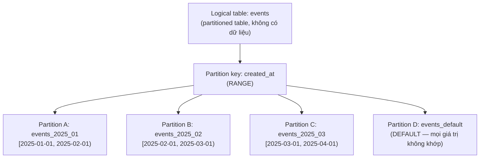
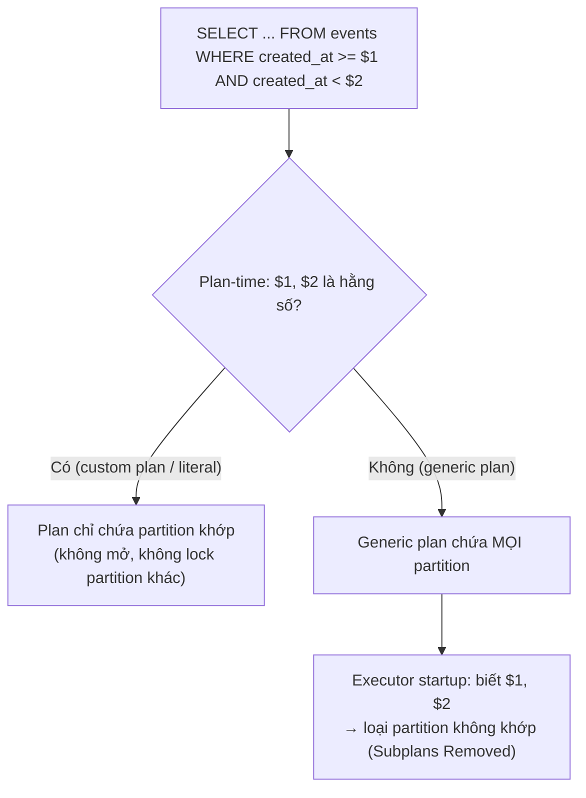
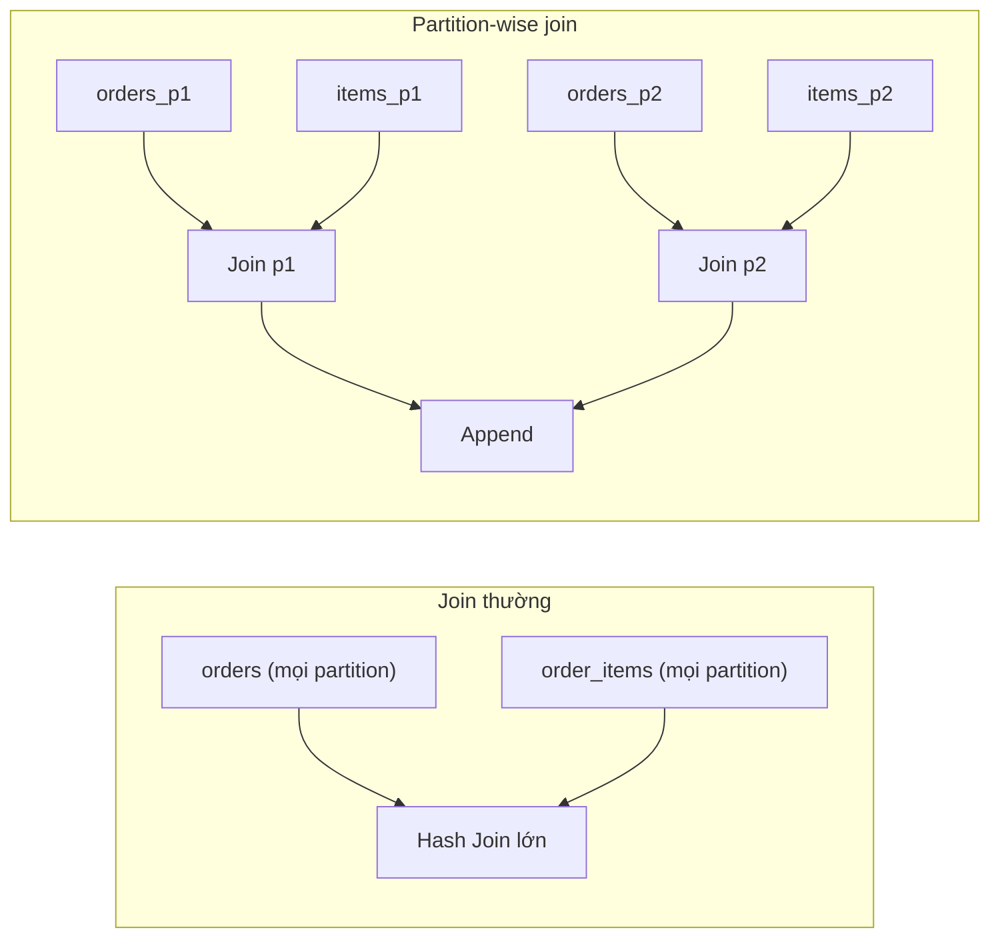

# PART 32 — PARTITIONING

> **Trước:** [31 — Backup & PITR](31-backup-pitr.md) · **Tiếp:** [33 — Sharding](33-sharding.md)
> **Độ ưu tiên:** Rất cao.

---

## Mục lục

1. [Simple mental model](#1-simple-mental-model)
2. [WHAT — Declarative partitioning](#2-what)
3. [WHY — Partitioning giải quyết vấn đề gì](#3-why)
4. [HOW — Range, List, Hash, Default, Sub-partitioning](#4-how--các-kiểu-partition)
5. [INTERNALS — Tuple routing, row movement](#5-internals--tuple-routing-row-movement)
6. [Partition Pruning](#6-partition-pruning)
7. [Partition-wise Join và Partition-wise Aggregate](#7-partition-wise-join-và-aggregate)
8. [Index trên partitioned table (local index), unique, FK](#8-index-trên-partitioned-table)
9. [Partition maintenance](#9-partition-maintenance)
10. [Partitioning có làm query nhanh hơn trong mọi trường hợp không?](#10-partitioning-có-làm-query-nhanh-hơn-trong-mọi-trường-hợp-không)
11. [WHAT HAPPENS IF...](#11-what-happens-if)
12. [PRODUCTION BEHAVIOR & thiết kế](#12-production-behavior--thiết-kế)
13. [TRADE-OFF / WHEN TO USE](#13-trade-off--when-to-use)
14. [COMMON MISUNDERSTANDINGS](#14-common-misunderstandings)
- [Concept card — khung 13 điểm](#concept-card--)
15. [INTERVIEW QUESTIONS](#15-interview-questions)
16. [KEY TAKEAWAYS](#16-key-takeaways)

---

## 1. Simple mental model

Một **tủ hồ sơ** thay vì một chồng giấy khổng lồ: mỗi **ngăn** chứa hồ sơ của một tháng. Tìm hồ sơ tháng 3 → chỉ mở ngăn tháng 3 (**pruning**). Hủy hồ sơ cũ hơn 2 năm → **rút cả ngăn ra vứt** (drop partition) thay vì lật từng tờ. Nhưng tìm "mọi hồ sơ của khách hàng A" (không biết tháng) → vẫn phải mở **mọi ngăn**. Và cả tủ vẫn nằm **trong cùng một phòng** (một server) — đó là khác biệt với sharding.

---

## 2. WHAT

**Partitioning** chia một table logic lớn thành nhiều **partition** — mỗi partition là **một table vật lý riêng** — dựa trên giá trị của **partition key**, trong **cùng một database, cùng một server**.

**Declarative partitioning** (PG 10+):

```sql
CREATE TABLE events (
    id bigint GENERATED ALWAYS AS IDENTITY,
    tenant_id int NOT NULL,
    created_at timestamptz NOT NULL,
    payload jsonb,
    PRIMARY KEY (id, created_at)          -- phải chứa partition key
) PARTITION BY RANGE (created_at);

CREATE TABLE events_2025_01 PARTITION OF events
    FOR VALUES FROM ('2025-01-01') TO ('2025-02-01');
CREATE TABLE events_2025_02 PARTITION OF events
    FOR VALUES FROM ('2025-02-01') TO ('2025-03-01');
```

- `events` là **partitioned table** (`relkind = 'p'`): **không có storage**, chỉ là định nghĩa + điểm truy cập.
- Mỗi partition là table thường (`relkind = 'r'`) với **partition bound** (constraint ngầm).
- Query/DML vào `events` được định tuyến tới partition phù hợp.

### Diagram bắt buộc



**Cách đọc diagram (trên xuống):** Application chỉ biết `events`. PostgreSQL dùng giá trị `created_at` để quyết định row thuộc partition nào (khi ghi) và partition nào cần đọc (khi query). Mỗi partition có file riêng, index riêng, được vacuum riêng.

---

## 3. WHY

| Vấn đề của một table khổng lồ | Partitioning giải quyết |
|---|---|
| Xóa dữ liệu cũ: `DELETE ... WHERE created_at < ...` trên hàng tỷ row → WAL khổng lồ, dead tuple, vacuum, bloat | **`DROP TABLE partition`** / `DETACH` — O(1), giải phóng disk ngay, không dead tuple |
| Vacuum table 5TB mất hàng ngày; anti-wraparound trên cả table | Vacuum **từng partition**; partition cũ (không còn ghi) freeze một lần là xong |
| Index khổng lồ không vừa cache | Index **mỗi partition nhỏ**; partition "nóng" (gần đây) vừa cache |
| Query theo khoảng thời gian quét nhiều | **Pruning**: chỉ đọc partition liên quan |
| Giới hạn 32TB/table | Mỗi partition có giới hạn riêng |
| Bulk load làm chậm table đang phục vụ | Load vào table riêng rồi **ATTACH** |
| Dữ liệu nóng/lạnh trên cùng storage | Partition cũ có thể chuyển sang tablespace rẻ hơn |

---

## 4. HOW — Các kiểu partition

### 4.1 Range

Theo khoảng liên tục (thời gian, id). Cận dưới **bao gồm**, cận trên **loại trừ**. Phổ biến nhất cho dữ liệu time-series, log, event, order theo thời gian.

### 4.2 List

Theo danh sách giá trị rời rạc:
```sql
CREATE TABLE orders (...) PARTITION BY LIST (region);
CREATE TABLE orders_apac PARTITION OF orders FOR VALUES IN ('VN', 'SG', 'JP');
CREATE TABLE orders_eu   PARTITION OF orders FOR VALUES IN ('DE', 'FR');
```
Dùng cho: region, tenant lớn, trạng thái (active/archived).

### 4.3 Hash (PG 11)

Theo `hash(key) mod N`:
```sql
CREATE TABLE sessions (...) PARTITION BY HASH (user_id);
CREATE TABLE sessions_p0 PARTITION OF sessions FOR VALUES WITH (MODULUS 8, REMAINDER 0);
-- ... p1..p7
```
Phân bố đều khi không có khóa tự nhiên theo khoảng. **Không giúp retention** (không drop được "dữ liệu cũ"), pruning chỉ với equality. Dùng để chia nhỏ table nóng (giảm contention, vacuum nhỏ hơn) hoặc chuẩn bị cho sharding. Đổi số partition = phải phân phối lại toàn bộ dữ liệu.

### 4.4 Default partition (PG 11)

Nhận row không khớp partition nào. Tránh lỗi insert khi quên tạo partition tương lai — nhưng có cái giá (mục 9.3).

### 4.5 Sub-partitioning

Partition cũng có thể là partitioned table: `events` RANGE theo tháng → mỗi tháng HASH theo `tenant_id`. Tăng số partition nhanh chóng — cẩn thận với tổng số.

---

## 5. INTERNALS — Tuple routing, row movement

### 5.1 INSERT → tuple routing

1. Executor tính giá trị partition key của row.
2. Tra **partition descriptor** (trong relcache: danh sách bound đã sắp) — với range: **binary search** trên bound; list: tra giá trị; hash: tính hash.
3. Chèn vào partition đích (mở partition, lấy lock ROW EXCLUSIVE trên nó, chèn heap + index của partition đó).
4. Không có partition phù hợp và không có default → `ERROR: no partition of relation "events" found for row`.

COPY vào partitioned table cũng được route (có tối ưu buffer theo partition).

### 5.2 UPDATE partition key → row movement (PG 11)

`UPDATE events SET created_at = '2025-03-05' WHERE ...` với row đang ở partition tháng 1 → PostgreSQL **DELETE khỏi partition cũ + INSERT vào partition mới** (trong cùng transaction). Hệ quả: trigger DELETE/INSERT trên partition chạy; với concurrency, transaction đồng thời đang cố update row đó có thể nhận lỗi `tuple to be locked was already moved to another partition due to concurrent update`.

---

## 6. Partition Pruning

### 6.1 WHAT

Loại bỏ các partition **chắc chắn không chứa** row thỏa điều kiện query → không scan, (và với plan-time pruning) không cả mở/lock chúng.

### 6.2 HOW — ba thời điểm

| Loại | Khi nào | Điều kiện | Ví dụ |
|---|---|---|---|
| **Plan-time** | Lúc lập plan | Hằng số trong WHERE trên partition key | `WHERE created_at >= '2025-02-01' AND created_at < '2025-03-01'` → chỉ `events_2025_02` xuất hiện trong plan |
| **Initial (executor startup)** (PG 11) | Khi executor khởi động | Tham số (`$1` trong generic plan), hàm **STABLE** như `now()` | `WHERE created_at > now() - interval '1 day'` → pruning khi bắt đầu thực thi; EXPLAIN: `Subplans Removed: N` |
| **Run-time (during execution)** (PG 11) | Trong lúc chạy | Giá trị đến từ node khác (vd tham số của Nested Loop) | Join `events` với table khác, inner là partitioned: mỗi lần lặp chỉ quét partition khớp; EXPLAIN: `(never executed)` cho partition bị bỏ |



**Cách đọc diagram:** Với literal hoặc custom plan, pruning xảy ra sớm nhất và rẻ nhất. Với generic plan (prepared statement), plan chứa mọi partition nhưng executor loại bỏ lúc khởi động — vẫn phải **lock mọi partition** lúc plan (tốn với hàng nghìn partition; PG 17/18 cải thiện việc lock khi dùng generic plan có run-time pruning).

### 6.3 Điều kiện để pruning hoạt động

- Điều kiện phải trên **partition key** với toán tử phù hợp (range: `<, <=, =, >=, >`, BETWEEN; list: `=`, `IN`; hash: `=`).
- **Không biến đổi cột**: `WHERE date_trunc('month', created_at) = '2025-02-01'` **không prune** (planner không suy ra được). Viết lại thành range.
- Kiểu dữ liệu khớp (so `timestamptz` với `date` có thể cần cast phù hợp).
- `enable_partition_pruning = on` (mặc định).
- Query **không có** điều kiện trên partition key → **quét mọi partition**.

---

## 7. Partition-wise Join và Aggregate

### 7.1 Partition-wise join

Hai table **partition giống hệt nhau** (cùng key, cùng bound) join trên partition key → thay vì join toàn bộ A với toàn bộ B, join **từng cặp partition** tương ứng (A1⋈B1, A2⋈B2...) — mỗi join nhỏ hơn, vừa memory hơn, song song được.



**Cách đọc diagram:** Partition-wise join tận dụng việc row khớp chỉ có thể nằm trong cặp partition tương ứng. `enable_partitionwise_join` **mặc định off** (vì tăng thời gian planning và memory — mỗi cặp là một join cần lập plan); bật khi dùng. PG 18 mở rộng các trường hợp áp dụng.

### 7.2 Partition-wise aggregate

`GROUP BY` chứa partition key → aggregate **hoàn toàn** trong từng partition rồi Append. Nếu không chứa partition key → partial aggregate mỗi partition rồi finalize. `enable_partitionwise_aggregate` mặc định off.

---

## 8. Index trên partitioned table

### 8.1 Local index

`CREATE INDEX ON events (tenant_id, created_at);` trên partitioned table tạo **partitioned index** (`relkind = 'I'`, không storage) + **một index thật trên mỗi partition** (và tự tạo cho partition mới). Đây là **local index** — mỗi index chỉ biết partition của nó.

**PostgreSQL không có global index** (một index trải qua mọi partition). Hệ quả:

### 8.2 Unique / Primary key phải chứa partition key

Vì mỗi index chỉ đảm bảo unique **trong partition của nó**, PostgreSQL chỉ cho phép UNIQUE/PK khi **mọi cột partition key nằm trong key** — khi đó hai row trùng key chắc chắn rơi vào cùng partition, nên unique cục bộ = unique toàn cục.

Hệ quả thiết kế: không thể có `UNIQUE (email)` toàn cục trên table partition theo `created_at`. Cách xử lý: table riêng (không partition) cho ràng buộc unique, hoặc partition theo key khác, hoặc chấp nhận unique `(email, created_at)` (thường không đúng nghiệp vụ).

### 8.3 Lookup theo cột không phải partition key

`WHERE id = 123` trên table partition theo `created_at` → không prune được → **probe index của mọi partition** (N lần descend B-Tree). Với 1000 partition = 1000 index lookup cho một row. Thiết kế nên để các lookup quan trọng mang partition key (vd id chứa thông tin thời gian — UUIDv7/snowflake — và query kèm khoảng thời gian).

### 8.4 CREATE INDEX CONCURRENTLY

Không hỗ trợ trực tiếp trên partitioned table (tính tới PG 18). Quy trình:
```sql
CREATE INDEX idx_events_tenant ON ONLY events (tenant_id);          -- invalid, chỉ trên parent
CREATE INDEX CONCURRENTLY idx_e_2025_01_tenant ON events_2025_01 (tenant_id);
ALTER INDEX idx_events_tenant ATTACH PARTITION idx_e_2025_01_tenant;
-- ... lặp cho mọi partition; khi đủ, index cha tự thành valid
```

### 8.5 Foreign key

- FK **từ** partitioned table tới table khác: PG 11+.
- FK **tới** partitioned table: PG 12+.

---

## 9. Partition maintenance

### 9.1 Tạo partition trước

Partition tương lai phải tồn tại **trước khi** dữ liệu tới (nếu không: lỗi insert, hoặc rơi vào default). Tự động hóa bằng **pg_partman** (extension) + cron/`pg_cron`, hoặc job của application. Tạo trước vài kỳ.

### 9.2 Retention: DETACH / DROP

```sql
ALTER TABLE events DETACH PARTITION events_2023_01;             -- ACCESS EXCLUSIVE trên cha (ngắn nhưng chặn)
ALTER TABLE events DETACH PARTITION events_2023_01 CONCURRENTLY; -- PG 14: không chặn query (hai transaction)
DROP TABLE events_2023_01;                                       -- giải phóng disk ngay
```
So với `DELETE` hàng tỷ row: không WAL cho từng row, không dead tuple, không vacuum.

### 9.3 ATTACH và cái bẫy default partition

```sql
-- Chuẩn bị: bulk load vào table độc lập, tạo index, thêm CHECK khớp bound
CREATE TABLE events_2025_04 (LIKE events INCLUDING ALL);
ALTER TABLE events_2025_04 ADD CONSTRAINT chk CHECK (created_at >= '2025-04-01' AND created_at < '2025-05-01');
-- ATTACH: nhờ CHECK đã validate, không cần scan partition mới
ALTER TABLE events ATTACH PARTITION events_2025_04 FOR VALUES FROM ('2025-04-01') TO ('2025-05-01');
```
- ATTACH lấy **SHARE UPDATE EXCLUSIVE** trên cha (PG 12+) — không chặn DML trên các partition khác.
- Nếu **có default partition**: ATTACH phải **scan default partition** để chắc không có row nào thuộc khoảng mới (và giữ lock trên default) → với default lớn, ATTACH chậm và chặn. Default partition tích lũy dữ liệu "lạc" lâu ngày là rủi ro — theo dõi và giữ nó rỗng.

### 9.4 Vacuum/Analyze

- Autovacuum xử lý **từng partition** như table thường — tốt.
- Autovacuum **không ANALYZE partitioned table cha** → thống kê ở mức cha (dùng khi planner ước lượng cho query trên cha, ví dụ join) có thể thiếu/lỗi thời → chạy `ANALYZE events` định kỳ (lệnh này thu thống kê cho cha và cả các partition). PG 18 thêm `ANALYZE ONLY events` để chỉ thu thống kê mức cha — nhanh hơn, hợp lý vì autovacuum đã tự analyze từng partition.

---

## 10. Partitioning có làm query nhanh hơn trong mọi trường hợp không?

**Không.** Phân tích theo loại query:

| Query | Không partition | Có partition | Kết luận |
|---|---|---|---|
| Range theo partition key (`created_at` 1 ngày) | Index range scan trên index lớn | Prune → index nhỏ của 1 partition (hoặc seq scan partition nhỏ) | **Nhanh hơn** hoặc tương đương; lợi lớn khi query quét nhiều (seq scan chỉ 1 partition thay vì cả table) |
| Point lookup theo PK có partition key | 1 B-Tree descend | Prune + 1 descend + chi phí routing/planning | **Tương đương** (hơi chậm hơn do overhead) |
| Point lookup theo cột không có partition key (`id = 123`) | 1 descend | **N descend** (mọi partition) | **Chậm hơn nhiều** |
| Aggregate toàn bộ | Seq scan | Append của N seq scan (có thể parallel/partition-wise) | Tương đương; partition-wise có thể lợi |
| Query không có điều kiện partition key + LIMIT | | Merge Append qua N partition | Có thể chậm hơn |
| **Planning** | 1 relation | Nhiều relation (nếu không prune lúc plan) | Chậm hơn với nhiều partition |

**Chi phí ẩn của nhiều partition:**
- Planning time tăng (dù đã cải thiện nhiều từ PG 12).
- Memory: relcache/catcache cho mỗi partition **trong mỗi backend** đã chạm → nhiều connection × nhiều partition = nhiều RAM.
- **Lock**: mỗi partition + mỗi index của nó là một lock → vượt fast-path → `LockManager` contention ([Chương 13 §9](13-locking.md#9-fast-path-locking)).
- Nhiều file mở (file descriptor).

**Quy tắc thực dụng:** partitioning chủ yếu là công cụ **quản lý dữ liệu (lifecycle, vacuum, bulk ops)**; lợi ích hiệu năng đến khi **phần lớn query quan trọng có điều kiện trên partition key**. Số partition nên ở mức **hàng chục đến vài nghìn**, không phải hàng chục nghìn; kích thước mỗi partition thường từ vài GB tới vài chục/trăm GB.

---

## 11. WHAT HAPPENS IF...

| Tình huống | Hệ quả |
|---|---|
| **Quên tạo partition tháng mới, không có default** | Mọi INSERT lỗi từ 00:00 ngày 1 → outage ghi |
| **Có default, quên tạo partition** | Dữ liệu dồn vào default; ATTACH sau đó phải scan default (chậm, lock) |
| **Partition theo cột không có trong query** | Mọi query quét mọi partition → chậm hơn không partition |
| **10.000 partition** | Planning chậm, memory backend tăng, lock contention |
| **Update partition key thường xuyên** | Row movement = delete + insert, đắt |
| **Cần unique toàn cục trên cột không phải partition key** | Không làm được bằng constraint — cần thiết kế khác |
| **Hash partition 8 → muốn 16** | Phải phân phối lại toàn bộ dữ liệu |
| **Query dùng hàm trên partition key** | Không prune |

---

## 12. PRODUCTION BEHAVIOR & thiết kế

1. **Chọn partition key** = cột xuất hiện trong **hầu hết query quan trọng** **và** phù hợp với **retention**. Với event/log: thời gian. Với multi-tenant lớn: có thể LIST/HASH theo tenant (hoặc sub-partition).
2. **Chọn độ hạt** (ngày/tuần/tháng) theo: kích thước mỗi partition, số partition tổng (retention × độ hạt), pattern truy vấn.
3. **Tự động hóa** tạo/xóa partition (pg_partman), giám sát default partition, giám sát "partition cho kỳ tới đã tồn tại chưa".
4. PK/unique phải có partition key → thiết kế id có thông tin thời gian (UUIDv7) để lookup theo id có thể kèm khoảng thời gian.
5. Kiểm tra EXPLAIN có pruning (`Subplans Removed`, số partition trong plan).
6. Migration table lớn sang partitioned: tạo partitioned table mới, copy dần (hoặc attach table cũ làm một partition "lịch sử" với CHECK phù hợp), chuyển ghi, backfill.

---

## 13. TRADE-OFF / WHEN TO USE

**Dùng khi:**
- Table rất lớn (hàng trăm GB+) với **retention theo thời gian** hoặc lifecycle rõ.
- Query chủ yếu lọc theo một khóa (thời gian, tenant).
- Vacuum/index maintenance trên một table khổng lồ đang là vấn đề.
- Bulk load/archive theo lô.

**Không dùng khi:**
- Table nhỏ/vừa (vài chục GB) không có vấn đề vận hành.
- Query đa dạng không theo một khóa.
- Cần unique toàn cục trên cột khác partition key.
- Mục tiêu là **scale ghi vượt một máy** — partitioning không làm điều đó (cần sharding).

| Lợi | Hại |
|---|---|
| Drop dữ liệu O(1) | Phức tạp schema, cần tự động hóa |
| Vacuum/index nhỏ, freeze partition cũ một lần | Không global index, PK phải chứa key |
| Pruning cho query theo key | Query không theo key chậm hơn |
| Bulk load qua ATTACH | Overhead planning/lock/memory khi nhiều partition |

---

## 14. COMMON MISUNDERSTANDINGS

1. **"Partitioning luôn làm query nhanh hơn."** — Chỉ khi query prune được; ngược lại có thể chậm hơn.
2. **"Partitioning = sharding."** — Partition cùng server; shard khác server ([Chương 34](34-partitioning-vs-sharding.md)).
3. **"Càng nhiều partition càng tốt."** — Overhead planning, lock, memory.
4. **"Index trên partitioned table là một index lớn."** — Là tập index local.
5. **"Default partition an toàn tuyệt đối."** — Gây chậm/khóa khi attach nếu chứa dữ liệu.
6. **"Partition giúp scale write."** — Vẫn một server, một WAL; có thể giảm contention cục bộ nhưng không vượt giới hạn máy.

---

## Concept card — Partitioning theo khung 13 điểm

| # | Khía cạnh | Tóm tắt |
|---|---|---|
| 1 | **WHAT** | Chia một table logic thành nhiều table vật lý theo partition key, trong cùng server — §2. |
| 2 | **WHY** | Retention O(1), vacuum/index nhỏ, pruning, bulk ops qua ATTACH/DETACH — §3. |
| 3 | **HOW** | Range / List / Hash / Default / sub-partition; tuple routing khi ghi; pruning khi đọc — §4–§6. |
| 4 | **INTERNALS** | Partitioned table không có storage; partition descriptor trong relcache; plan-time/executor-time pruning; partitioned index = tập local index — §5, §6, §8. |
| 5 | **EXAMPLE** | `events` partition theo tháng, DETACH CONCURRENTLY + DROP partition cũ — §2, §9.2. |
| 6 | **WHAT HAPPENS IF** | Quên tạo partition, default partition lớn khi ATTACH, 10.000 partition — §11. |
| 7 | **PERFORMANCE IMPACT** | Nhanh hơn khi prune được; chậm hơn cho lookup không có partition key; overhead planning/lock/memory khi nhiều partition — §10. |
| 8 | **PRODUCTION BEHAVIOR** | `Subplans Removed`, pg_partman, ANALYZE bảng cha, giám sát default partition — §12. |
| 9 | **TRADE-OFF** | Quản lý dữ liệu tốt ↔ PK phải chứa key, không global index, phức tạp schema — §13. |
| 10 | **WHEN TO USE / NOT** | Table rất lớn có lifecycle theo thời gian/khóa; không cho table vừa hoặc query không theo khóa — §13. |
| 11 | **MISUNDERSTANDINGS** | "Partition = shard", "partition luôn nhanh hơn" — §14. |
| 12 | **INTERVIEW** | Pruning, PK chứa partition key, xóa dữ liệu cũ — §15. |
| 13 | **KEY TAKEAWAYS** | Partitioning chủ yếu là công cụ quản lý dữ liệu — §16. |

---

## 15. INTERVIEW QUESTIONS

**Q1. Partitioning trong PostgreSQL hoạt động thế nào?**
- *Short:* Partitioned table (không storage) + partition là table thật với bound; INSERT route theo key; query prune partition không liên quan; index local mỗi partition.
- *Follow-up:* Tại sao PK phải chứa partition key?

**Q2. Partition pruning là gì? Khi nào không hoạt động?**
- *Short:* Loại partition không khớp điều kiện (plan-time, executor startup, run-time). Không hoạt động khi không lọc theo key, biến đổi key bằng hàm, kiểu không khớp.

**Q3. Partitioning có làm query nhanh hơn trong mọi trường hợp không?**
- *Short:* Không; lookup không có partition key phải probe mọi partition; nhiều partition tăng planning/lock/memory.

**Q4. Range vs List vs Hash?**
- *Short:* Range cho khoảng liên tục (thời gian, retention); List cho giá trị rời rạc (region); Hash cho phân bố đều không có khoảng tự nhiên (không hỗ trợ retention).

**Q5. Làm sao xóa dữ liệu cũ hiệu quả trên table 5TB?**
- *Short:* Partition theo thời gian → DETACH CONCURRENTLY + DROP.

**Q6. (Senior) Chuyển table 2TB đang chạy sang partitioned không downtime?**
- *Short:* Tạo partitioned table mới; attach table cũ làm partition "lịch sử" với CHECK constraint NOT VALID + VALIDATE; chuyển ghi mới sang partition mới; tách dần dữ liệu lịch sử nếu cần; hoặc dual-write + backfill + cutover.

---

## 16. KEY TAKEAWAYS

1. Partitioning = chia một table logic thành nhiều table vật lý **trên cùng server** theo **partition key** (Range/List/Hash, default, sub-partition).
2. Lợi ích chính: **lifecycle (drop O(1))**, vacuum/index nhỏ, **pruning**, bulk ops qua ATTACH/DETACH.
3. **Pruning** chỉ khi điều kiện trên partition key (plan-time với hằng số; executor-time với tham số/now(); run-time trong join).
4. Index là **local**; **không có global index**; UNIQUE/PK **phải chứa partition key**.
5. Partitioning **không** tự làm mọi query nhanh hơn; nhiều partition có chi phí planning/lock/memory.
6. Bảo trì: tạo trước partition (pg_partman), giữ default rỗng, ATTACH với CHECK sẵn, DETACH CONCURRENTLY, ANALYZE bảng cha.

---

## Nguồn tham khảo

- PostgreSQL Docs — *Table Partitioning*: https://www.postgresql.org/docs/current/ddl-partitioning.html
- PostgreSQL Docs — *CREATE TABLE ... PARTITION OF*, *ALTER TABLE ... ATTACH/DETACH PARTITION*.
- pg_partman: https://github.com/pgpartman/pg_partman
- PostgreSQL 10–18 Release Notes (declarative partitioning, hash, default, pruning, partition-wise, DETACH CONCURRENTLY).
